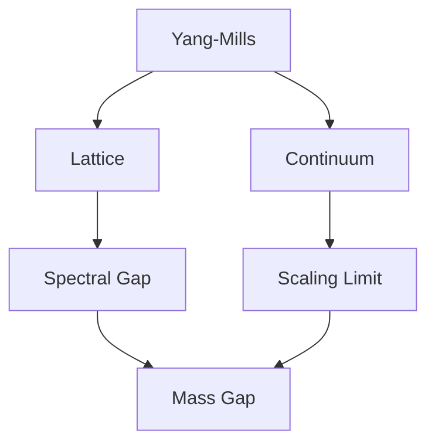

ได้ ผมจะรวม requirement ทั้งหมดเป็นแผนเดียว โดยวางระบบให้ **Obsidian เป็นแหล่งเนื้อหาหลัก + GitHub เป็น version control/deployment + เว็บไซต์เป็น Knowledge Archive** ไม่ใช่เว็บที่ต้องมานั่งกรอกบทความซ้ำอีกระบบหนึ่ง

# Deep Space Knowledge Archive — Website Plan

## 1. เป้าหมาย

เว็บไซต์นี้คือ **Personal Knowledge & Research Archive** สำหรับรวบรวม

- Mathematics
- Theoretical Physics
- Computer Science
- Research
- Study Notes
- Research Logs
- Ideas / Conjectures
- Exercises
- References

แนวคิดหลักคือ

> **Obsidian = ที่เขียนและจัดการความรู้**  
> **GitHub = ที่เก็บ source + version history**  
> **Website = วิธีนำเสนอและสำรวจองค์ความรู้**

ดังนั้นไม่ควรมีการเขียนเนื้อหาซ้ำบนเว็บไซต์

```text
             Write / Edit
                  │
                  ▼
             OBSIDIAN
                  │
             Markdown Vault
                  │
                  ▼
               GITHUB
            push / commit
                  │
                  ▼
           GitHub Actions
                  │
            Build Website
                  │
                  ▼
        DEEP SPACE ARCHIVE
```

ทุกครั้งที่เพิ่ม/แก้ `.md` แล้ว push ขึ้น GitHub เว็บจะ build และ deploy เวอร์ชันใหม่อัตโนมัติ

---

# 2. Technology Stack

ผมเสนอ architecture หลักเป็น

```text
Astro
│
├── TypeScript
├── Markdown / MDX
├── MathJax
├── Mermaid
├── Obsidian Compatibility Layer
├── Knowledge Graph
├── Search Engine
└── GitHub Actions
```

**Astro** เหมาะกับเว็บนี้เพราะเนื้อหาส่วนใหญ่เป็น static knowledge pages จำนวนมาก เว็บจะโหลดเร็วและไม่จำเป็นต้องมี server/database สำหรับบทความ

Repository อาจมีหน้าตา:

```text
deep-space-archive/
│
├── vault/
│   ├── Mathematics/
│   ├── Physics/
│   ├── Computer Science/
│   ├── Research/
│   ├── Ideas/
│   └── Assets/
│
├── src/
│   ├── components/
│   ├── layouts/
│   ├── pages/
│   ├── styles/
│   └── lib/
│
├── public/
├── astro.config.mjs
├── package.json
└── .github/
    └── workflows/
        └── deploy.yml
```

---

# 3. Obsidian เป็น CMS

นี่เป็นส่วนสำคัญที่สุด

แทนที่จะสร้าง CMS ขึ้นมาใหม่ ให้ **Obsidian Vault ทำหน้าที่ CMS**

ตัวอย่าง:

```text
Physics/
└── Quantum Field Theory/
    └── Yang-Mills/
        ├── Yang-Mills Theory.md
        ├── Mass Gap.md
        ├── Lattice Yang-Mills.md
        ├── Spectral Gap.md
        ├── Exponential Clustering.md
        └── Dimock/
            ├── Dimock I.md
            └── Dimock II.md
```

เพิ่มไฟล์ใหม่ = เพิ่มหน้าเว็บใหม่

แก้ Markdown = หน้าเว็บเปลี่ยน

ลบ Markdown = หน้าเว็บหาย

ไม่ต้องแก้ HTML

---

# 4. Obsidian Compatibility Layer

ผมจะถือ requirement ว่า

> **สิ่งที่ Obsidian Core แสดงผลได้ เว็บไซต์ควรแสดงผลได้ใกล้เคียงที่สุด**

Pipeline:

```text
.md
 │
 ▼
Markdown Parser
 │
 ├── Markdown
 ├── YAML
 ├── LaTeX
 ├── Wikilinks
 ├── Embeds
 ├── Images
 ├── Mermaid
 ├── Callouts
 ├── Footnotes
 ├── Code
 └── Tags
 │
 ▼
HTML / Website Components
```

### สมการ

รองรับทั้ง inline

```markdown
The spectral gap $\Delta > 0$.
```

และ display mathematics

```markdown
$$
\Delta = E_1-E_0 > 0
$$
```

รวมถึงสมการหลายบรรทัด เช่น

```latex
\begin{aligned}
D_\mu F^{\mu\nu} &= 0,\\
F_{\mu\nu}
&=
\partial_\mu A_\nu-
\partial_\nu A_\mu+
g[A_\mu,A_\nu].
\end{aligned}
```

MathJax จะเป็น renderer หลัก

---

# 5. Obsidian Wikilinks

syntax:

```markdown
[[Mass Gap]]
```

จะกลายเป็น hyperlink ของเว็บโดยอัตโนมัติ

เช่น

```text
/physics/qft/yang-mills/mass-gap
```

และ

```markdown
[[Mass Gap|Yang-Mills mass gap]]
```

ต้องรองรับ alias ด้วย

รวมถึง

```markdown
[[Mass Gap#Spectral Gap]]
```

สำหรับ heading links

---

# 6. Embedded Notes

Obsidian:

```markdown
![[Spectral Gap]]
```

เว็บไซต์ควรนำเนื้อหาของ note นั้นมา embed

รวมถึง

```markdown
![[Spectral Gap#Definition]]
```

สำหรับ embed เฉพาะ section

---

# 7. รูปภาพ

รองรับ

```markdown
![[mass-gap.png]]
```

```markdown
![[mass-gap.png|700]]
```

และ

```markdown

```

ไฟล์อย่าง

```text
PNG
JPEG
WEBP
SVG
GIF
```

ควรใช้งานได้

---

# 8. Graph / Diagram

Mermaid เช่น



เว็บไซต์ render เป็น diagram จริง

กราฟจาก Python/Matplotlib ที่ export เป็น PNG/SVG ก็แสดงเป็น asset ตามปกติ

---

# 9. Callouts

Obsidian:

```markdown
> [!theorem] Spectral Gap
> Suppose the Hamiltonian satisfies...
```

เว็บแปลงเป็น component

```text
┌──────────────────────────────────────────┐
│ THEOREM — Spectral Gap                   │
│                                          │
│ Suppose the Hamiltonian satisfies...     │
└──────────────────────────────────────────┘
```

และรองรับ

```text
note
info
warning
example
definition
theorem
lemma
proof
conjecture
remark
exercise
```

เราสามารถเพิ่ม academic callouts ที่ Obsidian ไม่มีเป็น default ได้ด้วย

---

# 10. Metadata

ทุก note สามารถมี YAML:

```yaml
---
title: Yang-Mills Mass Gap
category: Physics
field: Quantum Field Theory
status: studying
created: 2026-10-04
updated: 2026-10-04

tags:
  - Yang-Mills
  - QFT
  - Mass-Gap
---
```

เว็บใช้ข้อมูลนี้สร้าง navigation อัตโนมัติ

---

# 11. Knowledge Universe

นี่จะเป็น signature feature ของเว็บไซต์

Markdown:

```markdown
[[Yang-Mills]]
[[Gauge Theory]]
[[Lie Group]]
[[Spectral Gap]]
```

สร้าง graph:

```text
                  Lie Groups
                      │
                      │
Gauge Theory ─── Yang-Mills
                      │
            ┌─────────┴─────────┐
            │                   │
      Lattice YM          Continuum YM
            │                   │
      Spectral Gap        Scaling Limit
            │                   │
            └─────────┬─────────┘
                      │
                   Mass Gap
```

ไม่ต้องสร้าง graph ด้วยมือ

เว็บ scan `[[wikilinks]]` ทั้ง Vault แล้วสร้าง graph database ตอน build

---

# 12. Deep-Space Visualization

Graph เดียวกันสามารถแสดงเป็น **จักรวาลความรู้**


แนวคิด:

```text
NOTE     = star
SUBJECT  = star system
FIELD    = galaxy
LINK     = connection
TAG      = cluster
```

ตัวอย่าง

```text
                 MATHEMATICS
                    ✦
              ╱           ╲
          Topology       Analysis


                       PHYSICS
                         ✦
                        ╱
                       ╱
                  Quantum Field Theory
                       ✦
                    ╱     ╲
             Gauge Theory  Yang-Mills
                               ✦
                              ╱ ╲
                   Spectral Gap Mass Gap
```

---

# 13. แต่ Graph ต้องไม่แทน Navigation

นี่สำคัญมาก

Knowledge Graph เหมาะกับ **exploration** แต่ไม่เหมาะกับการค้นทุกอย่าง

จึงมี navigation ปกติด้วย

```text
HOME

EXPLORE
├─ Knowledge Universe
└─ Topics

LIBRARY
├─ Mathematics
├─ Physics
├─ Computer Science
└─ Other

RESEARCH
├─ Active Research
├─ Research Logs
└─ Previous Research

IDEAS

ABOUT
```

---

# 14. Home Page

หน้าแรกให้ mood แบบ Deep Space

```text
PLANKTOS
KNOWLEDGE ARCHIVE

        Mathematics · Physics · Computation

                EXPLORE THE UNKNOWN


                       ✦

          A personal archive devoted to
          mathematics, theoretical physics
              and fundamental questions.


                [ ENTER ARCHIVE ]


──────────────────────────────────────────

Knowledge Universe

             Mathematics

                  ✦

          ✦───────✦────────✦
       Physics   Research    CS


──────────────────────────────────────────

RECENT TRANSMISSIONS

Yang-Mills Mass Gap
Spectral Gap in Lattice Gauge Theory
Linear Transformations
Quantum Field Theory
```

---

# 15. Library

Library เป็นหน้าสำหรับคนที่ไม่อยากใช้ graph

```text
KNOWLEDGE LIBRARY

Search the archive...

MATHEMATICS
143 notes

THEORETICAL PHYSICS
217 notes

COMPUTER SCIENCE
82 notes

RESEARCH
51 notes

IDEAS
37 notes
```

เข้า Physics:

```text
PHYSICS

Classical Mechanics
Quantum Mechanics
General Relativity
Statistical Mechanics
Quantum Field Theory
Gauge Theory
Yang-Mills Theory
```

---

# 16. Article / Note Page

หน้าอ่านต้องสงบกว่าหน้า Home มาก

```text
PHYSICS / QFT / YANG-MILLS

Yang-Mills Theory

Updated October 4, 2026
──────────────────────────────────────────

Table of Contents

01 Introduction
02 Gauge Fields
03 Field Strength
04 Yang-Mills Action
05 Quantization
06 Mass Gap

──────────────────────────────────────────

# Gauge Field

Let

             Aμ = Aμᵃ Tᵃ

...

                 [equations]

...

──────────────────────────────────────────

CONNECTED KNOWLEDGE

Gauge Theory ── Yang-Mills ── Mass Gap
                     │
                  Lie Group
```

---

# 17. Backlinks

เพราะ Obsidian มีแนวคิด backlinks เว็บไซต์ก็ควรมี

ถ้า

`Mass Gap.md`

ถูกอ้างจาก

```text
Yang-Mills.md
Lattice YM.md
Spectral Gap.md
Glueball.md
```

ท้ายหน้า Mass Gap จะแสดง

```text
BACKLINKS

Referenced by

→ Yang-Mills Theory
→ Lattice Yang-Mills
→ Spectral Gap
→ Glueballs
```

สร้างอัตโนมัติ

---

# 18. Local Graph

ทุกบทความมี mini graph

```text
              Glueball
                 │
                 │
Spectral Gap ─ Mass Gap ─ Yang-Mills
                 │
                 │
        Exponential Clustering
```

ต่างจาก Knowledge Universe ที่แสดงทั้ง Vault

---

# 19. Research Sector

แยกจากบทเรียนทั่วไป

```text
RESEARCH SECTOR

ACTIVE
────────────────────

Yang-Mills Existence & Mass Gap
● ACTIVE

Main question:
Can four-dimensional quantum Yang-Mills
theory be rigorously constructed with Δ > 0?

Research Logs        34
References           81
Open Questions       12
Ideas                 9
```

---

# 20. Research Roadmap

สำหรับแต่ละ project:

```text
Yang-Mills Mass Gap

                    YM Problem
                        │
                        ▼
                  Lattice Theory
                        │
             ┌──────────┴──────────┐
             ▼                     ▼
       Transfer Matrix       Correlation Decay
             │                     │
             ▼                     ▼
       Spectral Gap      Exponential Clustering
             │                     │
             └──────────┬──────────┘
                        ▼
                 Infinite Volume
                        │
                        ▼
                 Continuum Limit
                        │
                        ▼
                     4D YM
                        │
                        ▼
                   MASS GAP
```

แต่ roadmap นี้ควรสามารถสร้างจาก metadata/links ใน Markdown ไม่ใช่ hard-code ทั้งหมด

---

# 21. Search

Search เป็น feature สำคัญมากเมื่อ Vault โต

ช่องค้น:

```text
Search the archive...

> spectral gap
```

ผลลัพธ์:

```text
Spectral Gap
Physics / QFT / Yang-Mills

Lattice Yang-Mills
Research / Yang-Mills

Transfer Matrix
Mathematics / Operator Theory

Exponential Clustering
Physics / Mathematical Physics
```

ค้นจาก

```text
Title
Content
Tags
Aliases
Headings
Equations/text representation
Metadata
```

---

# 22. Tags

Obsidian:

```markdown
#Yang-Mills
#Mass-Gap
#QFT
```

กลายเป็น

```text
/tags/yang-mills
```

และแสดงทุก note ที่เกี่ยวข้อง

---

# 23. References / Citation

สำหรับงานวิจัยควรรองรับ citation ตั้งแต่แรก เช่น BibTeX

```text
references.bib
```

Markdown อาจเขียน

```markdown
See @Dimock1982.
```

แล้วเว็บแสดง bibliography อัตโนมัติ

เพื่อให้อนาคต Vault กลายเป็นฐานงานวิจัยจริงได้ ไม่ใช่เพียง study notes

---

# 24. GitHub Workflow

หัวใจของระบบ update:

```text
                  PC
                   │
                   ▼
               Obsidian
                   │
                edit .md
                   │
                   ▼
                  Git
                   │
                 commit
                   │
                  push
                   ▼
                 GitHub
                   │
                   ▼
             GitHub Actions
                   │
          ┌────────┴────────┐
          │                 │
     parse Vault       validate links
          │                 │
     render math       build graph
          │                 │
          └────────┬────────┘
                   ▼
                Astro
                   │
                   ▼
             Production Site
```

เมื่อคุณแก้

```text
Mass Gap.md
```

แล้ว

```bash
git add .
git commit -m "Update mass gap notes"
git push
```

ระบบจัดการที่เหลือเอง

---

# 25. Automatic Validation

ผมแนะนำให้ GitHub Actions ตรวจด้วยว่า

```text
✓ Markdown valid
✓ Wikilinks valid
✓ images exist
✓ Mermaid valid
✓ metadata valid
✓ duplicate note names
✓ broken links
✓ build succeeds
```

ถ้ามี

```markdown
[[Spectrl Gap]]
```

แต่ไม่มีไฟล์นี้ ระบบควรแจ้ง

```text
Broken Wikilink

Mass Gap.md
→ [[Spectrl Gap]]

Possible:
→ [[Spectral Gap]]
```

มีประโยชน์มากเมื่อ Vault มีหลายพันไฟล์

---

# 26. Deployment

ถ้าเป็น static archive สามารถ deploy ผ่าน [GitHub Pages](https://pages.github.com/?utm_source=chatgpt.com) ได้โดยตรง หรือภายหลังย้าย hosting โดยไม่ต้องเปลี่ยนโครงสร้างเนื้อหา

Repository บน [GitHub](https://github.com/?utm_source=chatgpt.com) ยังคงเป็น source of truth

---

# 27. การ Update ในอนาคต

Architecture ต้องแยก

```text
CONTENT
   │
   │ independent
   ▼
DESIGN
```

หมายความว่าในอนาคตคุณสามารถเปลี่ยนเว็บจาก

**Deep Space → Minimal Academic**

โดย `.md` หลายพันไฟล์ไม่ต้องเปลี่ยน

หรือเพิ่มระบบใหม่ เช่น interactive equations ก็ไม่ต้อง rewrite content

---

# 28. Responsive Design

Desktop เน้น immersive experience:

```text
Sidebar | Article | TOC / Graph
```

Tablet:

```text
Article | TOC
```

Mobile:

```text
Article
```

Knowledge Universe บนมือถือเปิดเป็น fullscreen แยก ไม่พยายามยัด graph ลงข้างบทความ

---

# 29. Visual Identity

ผมจะไม่ทำเป็น neon cyberpunk เพราะจะลด readability ของเนื้อหาคณิตศาสตร์

ควรเป็น **Deep Space + Academic Minimalism**

พื้นหลังประมาณ

```text
#02040A
```

panel:

```text
#080D17
```

text:

```text
#E8EDF5
```

secondary:

```text
#7E899C
```

accent ใช้ cyan / blue-violet เพียงเล็กน้อย

หน้า Home สามารถมี nebula, stars, parallax

แต่หน้าอ่าน:

```text
แทบไม่มี animation
contrast สูง
พื้นที่ว่างเยอะ
สมการเด่น
typography อ่านง่าย
```

---

# 30. ระบบทั้งหมดเมื่อรวมกัน

ภาพใหญ่จะเป็น

```text
                         OBSIDIAN
                            │
                   ┌────────┴────────┐
                   │                 │
                Markdown           Assets
                   │                 │
                   └────────┬────────┘
                            ▼
                          Git
                            │
                            ▼
                         GITHUB
                            │
                            ▼
                     BUILD PIPELINE
                            │
        ┌───────────────────┼───────────────────┐
        ▼                   ▼                   ▼
 Markdown Parser      Obsidian Parser      Asset Resolver
        │                   │                   │
        ├─ MathJax          ├─ [[links]]        ├─ images
        ├─ Mermaid          ├─ embeds           ├─ SVG
        ├─ Code             ├─ callouts         └─ graphs
        └─ Tables           └─ tags
                            │
                            ▼
                     KNOWLEDGE ENGINE
                            │
             ┌──────────────┼──────────────┐
             ▼              ▼              ▼
           Search        Backlinks       Graph
             │              │              │
             └──────────────┼──────────────┘
                            ▼
                           ASTRO
                            │
                            ▼
                 DEEP SPACE KNOWLEDGE
                        ARCHIVE
```

### หลักการสำคัญที่สุด

ผมจะกำหนด specification ของโปรเจกต์ไว้ว่า:

> **Content belongs to Obsidian. Structure emerges from links and metadata. GitHub preserves and publishes it. The website visualizes the resulting knowledge universe.**

ด้วย architecture นี้ เว็บไซต์ไม่ได้เป็นเพียง “เว็บรวมบทเรียน” แต่สามารถค่อย ๆ เติบโตไปพร้อม Vault ของคุณได้หลายปี ตั้งแต่โน้ต Linear Algebra ไปจนถึง research logs, papers และเครือข่ายแนวคิดของ Yang–Mills โดยไม่ต้องเปลี่ยนระบบหลักใหม่ทุกครั้งที่เนื้อหาเพิ่มขึ้น.