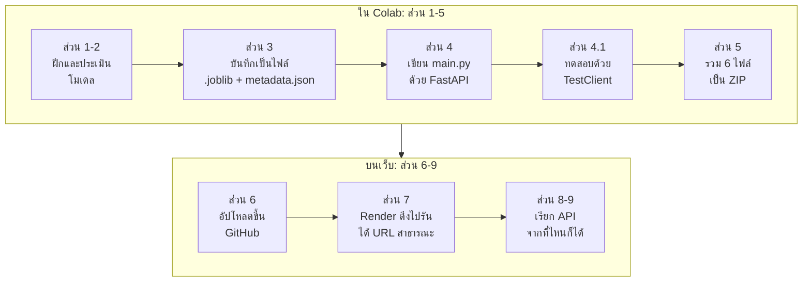
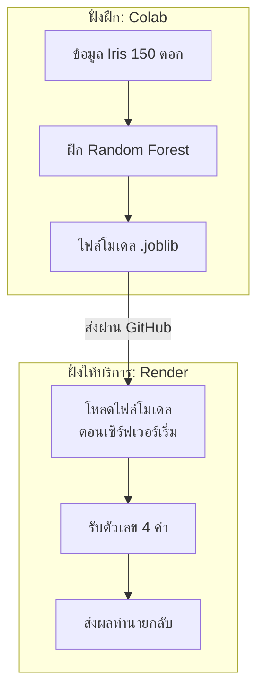
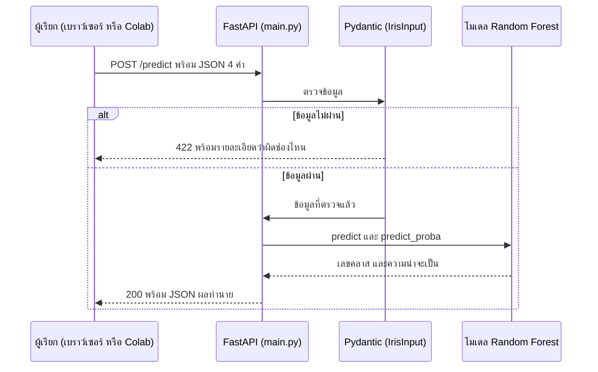
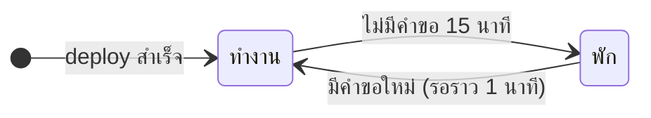

# Lecture 14 — Deploy โมเดล ML ด้วย FastAPI บน Render

เอกสารนี้สรุปและอธิบายโน้ตบุ๊ก `Lecture_14_FastAPI_Render_TH.ipynb` (ฉบับปรับปรุง 5 ตุลาคม 2569) ทีละส่วน ว่าบทนี้สอนอะไร ต้องทำอะไร และโค้ดแต่ละบรรทัดทำหน้าที่อะไร ส่วนขั้นตอนลงมือทำและเฉลยแบบฝึกหัดอยู่ที่ [[เฉลย Lecture 14 FastAPI, Render]]

> [!abstract] สรุปใน 1 นาที
> - **ปัญหา:** โมเดลที่ฝึกใน Colab ใช้ได้แค่คนที่เปิดโน้ตบุ๊กนั้น คนอื่นเรียกใช้ไม่ได้
> - **ทางแก้:** บันทึกโมเดลเป็นไฟล์ แล้วเขียนโปรแกรมเล็ก ๆ (API) ที่รับตัวเลขเข้ามา ส่งผลทำนายกลับไป จากนั้นเอาไปวางบนเซิร์ฟเวอร์ที่เปิดตลอด
> - **เครื่องมือ:** scikit-learn (ฝึกโมเดล) → joblib (บันทึกโมเดล) → FastAPI (เขียน API) → GitHub (เก็บไฟล์) → Render (เซิร์ฟเวอร์ฟรี)
> - **ตัวอย่างที่ใช้:** ทำนายสายพันธุ์ดอก Iris 3 ชนิด จากขนาดกลีบ 4 ค่า ด้วย Random Forest
> - **งานที่ต้องส่ง:** API ที่ deploy แล้วใช้งานได้จริง พร้อมคำตอบแบบฝึกหัด 5 ข้อ

> [!note] ตัวเลขในเอกสารนี้มาจากไหน
> ผลลัพธ์ทุกค่ามาจาก output ที่บันทึกอยู่ในโน้ตบุ๊ก และตรวจซ้ำด้วยการรันโค้ดเดียวกันบน Python 3.13.16, scikit-learn 1.6.1, numpy 2.1.3 (เวอร์ชันเดียวกับในโน้ตบุ๊ก) ได้ไฟล์โมเดลที่มีค่า SHA-256 ตรงกับของอาจารย์ทุกตัวอักษร ถ้ารันด้วยเวอร์ชันอื่น ตัวเลขอาจต่างไปเล็กน้อย

---

## 1. บทนี้พูดเรื่องอะไร

บทก่อน ๆ เราฝึกโมเดลแล้วดูผลในโน้ตบุ๊ก บทนี้ไปต่ออีกขั้น คือทำให้ **คนอื่นใช้โมเดลของเราได้ผ่านอินเทอร์เน็ต** ขั้นตอนนี้เรียกว่า **deploy**

เปรียบเทียบกับร้านอาหาร:

| ในร้านอาหาร | ในบทเรียน | หน้าที่ |
|---|---|---|
| พ่อครัว | โมเดล Random Forest | คนทำงานจริง (ทำนาย) |
| เมนูและพนักงานรับออร์เดอร์ | API ที่เขียนด้วย FastAPI | กำหนดว่าสั่งอะไรได้ ตรวจออร์เดอร์ แล้วส่งต่อให้พ่อครัว |
| ตัวร้านที่เปิดให้ลูกค้าเข้า | Render | ที่ตั้งที่คนภายนอกเข้ามาใช้บริการได้ |
| โกดังเก็บสูตรและวัตถุดิบ | GitHub | ที่เก็บไฟล์ที่ร้านไปหยิบมาใช้ |
| ครัวทดลองสูตร | Google Colab | ที่ฝึกและทดสอบก่อนเปิดร้าน |

### ภาพรวมทั้งบท



### แนวคิดหลัก: แยก "ฝึก" ออกจาก "ให้บริการ"



ฝั่งฝึก (training) ทำใน Colab ครั้งเดียว ส่วนฝั่งให้บริการ (inference) ทำงานบน Render ทุกครั้งที่มีคนเรียก ฝั่งให้บริการ **ไม่ฝึกโมเดลใหม่** และไม่ต้องมีข้อมูลฝึก มันแค่โหลดไฟล์โมเดลที่ฝึกเสร็จแล้วมาใช้ทำนาย ดังนั้นปิด Colab ไปแล้ว API ก็ยังทำงานต่อได้

### ผลลัพธ์การเรียนรู้ 4 ข้อ (ตามที่โน้ตบุ๊กระบุ)

1. แยกการฝึกโมเดลออกจากการให้บริการทำนาย (inference)
2. สร้าง FastAPI ที่ตรวจสอบ input และส่งผลเป็น JSON
3. Deploy ผ่าน GitHub → Render และทดสอบ `/docs`, `/health`, `/predict`
4. ตรวจความสอดคล้องของผลทำนายก่อนและหลัง deploy

### โครงสร้างโน้ตบุ๊ก 10 ส่วน

| ส่วน | ทำอะไร | ทำที่ไหน | เวลาโดยประมาณ |
|---|---|---|---|
| 1 | ติดตั้งและ import ไลบรารี | Colab | รวมส่วน 1–5 ประมาณ 40 นาที |
| 2 | ฝึกและประเมินโมเดล | Colab | |
| 3 | บันทึกโมเดลและ metadata | Colab | |
| 4, 4.1 | สร้าง `main.py` และทดสอบในโน้ตบุ๊ก | Colab | |
| 5 | สร้างไฟล์สำหรับ deploy และ ZIP | Colab | |
| 6 | อัปโหลดไฟล์ขึ้น GitHub | เว็บ GitHub (ทำเอง) | รวมส่วน 6–7 ประมาณ 30–45 นาที |
| 7 | สร้าง Web Service บน Render | เว็บ Render (ทำเอง) | |
| 8, 8.1 | เรียก API จริงและตรวจผล | Colab | รวมส่วน 8–9 ประมาณ 20 นาที |
| 9 | ทดลองเปลี่ยน input | Colab | |
| 10 | แบบฝึกหัดและหลักฐานส่งงาน | — | |

---

## 2. ต้องทำอะไรและต้องส่งอะไร

**สิ่งที่ต้องเตรียมก่อน:** บัญชี GitHub และบัญชี Render (โน้ตบุ๊กแนะนำให้สมัครก่อนวันเรียน เพราะขั้นตอนยืนยันบัญชีอาจใช้เวลา) และเลือกแผน **Free** ทั้ง workspace และ instance

**งานที่ต้องทำ**

1. รันโน้ตบุ๊กส่วน 1–5 เรียงจากบนลงล่างใน runtime ใหม่ จนได้ไฟล์ ZIP
2. แตก ZIP แล้วอัปโหลด 6 ไฟล์ขึ้น GitHub repository ของตัวเอง
3. สร้าง Web Service บน Render ให้ดึงไฟล์จาก repository นั้นไปรัน
4. นำ URL ที่ Render ให้มาใส่ในโน้ตบุ๊กส่วน 8 แล้วรันส่วน 8–9 เพื่อตรวจว่า API บนเซิร์ฟเวอร์ทำนายได้ตรงกับโมเดลในโน้ตบุ๊ก
5. ทำแบบฝึกหัด 5 ข้อในส่วน 10

**หลักฐานส่งงาน (ตัวแทนกลุ่มเป็นผู้ส่ง)**

- หมายเลขกลุ่มและรายชื่อสมาชิก
- โน้ตบุ๊กที่รันแล้ว
- URL ของ GitHub repository
- URL ของ Render ต่อท้ายด้วย `/docs`
- ผลทดสอบ local (ส่วน 4.1) และ remote (ส่วน 8, 8.1)
- คำตอบแบบฝึกหัดข้อ 1–5

> [!warning] ขั้นตอนที่โน้ตบุ๊กทำแทนไม่ได้
> โน้ตบุ๊กสร้างไฟล์และทดสอบในเครื่องให้เท่านั้น การสมัครบัญชี การอัปโหลดขึ้น GitHub และการ deploy บน Render ต้องทำเองผ่านหน้าเว็บ

---

## 3. คำศัพท์ที่ต้องรู้ก่อนอ่านโค้ด

| คำ | ความหมายแบบง่าย |
|---|---|
| **API** | ช่องทางให้โปรแกรมหนึ่งเรียกใช้อีกโปรแกรมหนึ่งผ่านเครือข่าย ในบทนี้คือ "ส่งตัวเลข 4 ค่าไป ได้ผลทำนายกลับมา" |
| **Endpoint** | ที่อยู่ย่อยของ API แต่ละตัว เช่น `/health`, `/predict` |
| **HTTP method** | ชนิดของคำขอ `GET` = ขอดูข้อมูล (เปิดด้วยเบราว์เซอร์ได้) ส่วน `POST` = ส่งข้อมูลไปให้ประมวลผล |
| **JSON** | รูปแบบข้อความสำหรับส่งข้อมูล หน้าตาเหมือน dict ของ Python เช่น `{"sepal_length": 5.1}` |
| **Status code** | เลข 3 หลักที่เซิร์ฟเวอร์ตอบกลับ บอกว่าคำขอสำเร็จหรือผิดพลาดแบบใด เช่น 200, 404, 422 |
| **Training** | การฝึกโมเดลจากข้อมูล |
| **Inference** | การเอาโมเดลที่ฝึกแล้วมาทำนายข้อมูลใหม่ |
| **Deploy** | การนำโปรแกรมไปวางบนเซิร์ฟเวอร์ให้คนอื่นใช้ได้ |
| **Serialization** | การแปลงวัตถุใน Python (เช่น โมเดล) ให้เป็นไฟล์ เพื่อเก็บหรือส่งต่อ ในบทนี้ใช้ `joblib` |
| **Validation** | การตรวจว่าข้อมูลที่ส่งเข้ามาถูกรูปแบบหรือไม่ ก่อนส่งให้โมเดล |
| **Metadata** | ข้อมูลที่อธิบายโมเดล เช่น เวอร์ชัน ลำดับ feature ชื่อคลาส |
| **SHA-256** | ลายนิ้วมือของไฟล์ ยาว 64 ตัวอักษร ไฟล์เปลี่ยนแม้นิดเดียวค่านี้จะเปลี่ยนทั้งหมด ใช้ตรวจว่าเป็นไฟล์เดียวกัน |
| **Repository** | โฟลเดอร์โปรเจกต์ที่เก็บบน GitHub |
| **Web Service** | ชนิดบริการบน Render ที่รันโปรแกรมค้างไว้เพื่อรอรับคำขอจากอินเทอร์เน็ต |

---

## 4. อธิบายโค้ดทีละส่วน

### ส่วนที่ 1 — เตรียมสภาพแวดล้อม

```python
%pip install -q fastapi uvicorn scikit-learn numpy scipy joblib requests httpx
```

`%pip install` คือคำสั่งพิเศษของโน้ตบุ๊ก ใช้ติดตั้งไลบรารีลงใน runtime ที่กำลังรันอยู่ ส่วน `-q` (quiet) ทำให้แสดงข้อความน้อยลง

| ไลบรารี | ใช้ทำอะไรในบทนี้ |
|---|---|
| `fastapi` | เครื่องมือเขียน API |
| `uvicorn` | โปรแกรมเซิร์ฟเวอร์ที่รัน FastAPI (ใช้ตอนอยู่บน Render) |
| `scikit-learn` | โมเดล Random Forest ชุดข้อมูล Iris และตัววัดผล |
| `numpy` | จัดการอาร์เรย์ตัวเลข |
| `scipy` | ไลบรารีที่ scikit-learn ต้องใช้ |
| `joblib` | บันทึกและโหลดโมเดล |
| `requests` | ส่งคำขอไปยัง API บน Render (ส่วน 8) |
| `httpx` | `TestClient` ของ FastAPI ต้องใช้ (ส่วน 4.1) |

โน้ตบุ๊กตั้งใจไม่ระบุเวอร์ชันตรงนี้ เพื่อไม่บังคับ downgrade ไลบรารีของ Colab ถ้าระบบแจ้งให้ restart หลังติดตั้ง ให้ restart แล้วรันใหม่ตั้งแต่เซลล์นี้

```python
from pathlib import Path
from importlib.metadata import version
import sys, json, platform, hashlib
import numpy as np
from joblib import dump, load
from sklearn.datasets import load_iris
from sklearn.model_selection import train_test_split
from sklearn.ensemble import RandomForestClassifier
from sklearn.metrics import accuracy_score, classification_report, confusion_matrix

PROJECT = Path("iris_fastapi_render").resolve()
PROJECT.mkdir(exist_ok=True)
print("Project:", PROJECT)
print("Python:", platform.python_version())
for name in ["scikit-learn", "numpy", "fastapi", "pydantic"]:
    print(name, version(name))
```

- `Path` ใช้จัดการที่อยู่ไฟล์และโฟลเดอร์ เขียน `PROJECT / "main.py"` เพื่อต่อ path ได้เลย
- `version("ชื่อแพ็กเกจ")` คืนเลขเวอร์ชันของไลบรารีที่ติดตั้งอยู่จริง
- `json` แปลงข้อมูลไปมาระหว่าง dict กับข้อความ JSON, `platform` ใช้ถามเวอร์ชัน Python, `hashlib` ใช้คำนวณ SHA-256
- `dump` / `load` คือคำสั่งบันทึกและโหลดโมเดลของ joblib
- `Path("iris_fastapi_render").resolve()` สร้าง path แบบเต็มของโฟลเดอร์โปรเจกต์ บน Colab จะได้ `/content/iris_fastapi_render`
- `mkdir(exist_ok=True)` สร้างโฟลเดอร์ ถ้ามีอยู่แล้วก็ไม่ error
- ลูป `for` ท้ายเซลล์พิมพ์เวอร์ชันของไลบรารีหลัก 4 ตัว

ผลในโน้ตบุ๊ก:

```text
Project: /content/iris_fastapi_render
Python: 3.13.16
scikit-learn 1.6.1
numpy 2.1.3
fastapi 0.141.1
pydantic 2.13.5
```

> [!important] จดเลขเวอร์ชันพวกนี้ไว้
> เลขเวอร์ชันสำคัญกับการ deploy มาก เพราะเซิร์ฟเวอร์ต้องใช้เวอร์ชันเดียวกับตอนฝึก ไฟล์โมเดลจึงจะโหลดได้ถูกต้อง ส่วนที่ 5 จะนำเลขพวกนี้ไปเขียนลงไฟล์ให้อัตโนมัติ

---

### ส่วนที่ 2 — ฝึกและประเมินโมเดล

```python
iris = load_iris()
X_train, X_test, y_train, y_test = train_test_split(
    iris.data, iris.target, test_size=0.2, stratify=iris.target,
    random_state=42
)
model = RandomForestClassifier(n_estimators=100, random_state=42, n_jobs=1)
model.fit(X_train, y_train)
y_pred = model.predict(X_test)
print(f"Train: {len(X_train)} | Test: {len(X_test)}")
print(f"Test accuracy: {accuracy_score(y_test, y_pred):.3f}")
print(classification_report(y_test, y_pred, target_names=iris.target_names))
print("Confusion matrix (rows=true, columns=predicted):")
print(confusion_matrix(y_test, y_pred))
```

**ข้อมูล Iris** มีดอกไม้ 150 ดอก 3 สายพันธุ์ สายพันธุ์ละ 50 ดอก แต่ละดอกวัดมา 4 ค่า หน่วยเป็นเซนติเมตร

| ลำดับ | ชื่อ feature | ความหมาย | ช่วงค่าในข้อมูล (ซม.) |
|---|---|---|---|
| 1 | `sepal_length` | ความยาวกลีบเลี้ยง | 4.3 – 7.9 |
| 2 | `sepal_width` | ความกว้างกลีบเลี้ยง | 2.0 – 4.4 |
| 3 | `petal_length` | ความยาวกลีบดอก | 1.0 – 6.9 |
| 4 | `petal_width` | ความกว้างกลีบดอก | 0.1 – 2.5 |

คำตอบที่ต้องทำนาย (target) เป็นเลข 0, 1, 2 แทน `setosa`, `versicolor`, `virginica` ตามลำดับ

> [!important] ลำดับ feature ต้องเหมือนกันเสมอ
> โมเดลไม่รู้จักชื่อคอลัมน์ มันรู้แค่ว่า "ค่าตัวที่ 1, 2, 3, 4" ดังนั้นตอนเรียกใช้ต้องส่งค่าเรียงลำดับเดียวกับตอนฝึกทุกครั้ง เรื่องนี้เป็นหัวใจของแบบฝึกหัดข้อ 3

**อธิบายทีละคำสั่ง**

- `load_iris()` โหลดชุดข้อมูล `iris.data` คือตารางตัวเลข 150 × 4 และ `iris.target` คือคำตอบ 150 ค่า
- `train_test_split(...)` แบ่งข้อมูลเป็นชุดฝึกและชุดทดสอบ
  - `test_size=0.2` กันไว้ทดสอบ 20% คือ 30 ดอก เหลือฝึก 120 ดอก
  - `stratify=iris.target` รักษาสัดส่วนสายพันธุ์ให้เท่าเดิม ชุดทดสอบจึงได้สายพันธุ์ละ 10 ดอกพอดี
  - `random_state=42` ล็อกการสุ่ม รันกี่ครั้งก็แบ่งได้ชุดเดิม
- `RandomForestClassifier(n_estimators=100, random_state=42, n_jobs=1)` สร้างโมเดลที่มีต้นไม้ตัดสินใจ 100 ต้น (ดูหลักการที่ [[Ch8-12 Tree, Ensemble, Clustering]]) ล็อกการสุ่มไว้ที่ 42 และใช้ CPU 1 แกน
- `model.fit(X_train, y_train)` ฝึกโมเดลจากชุดฝึก
- `model.predict(X_test)` ให้โมเดลทายชุดทดสอบ ซึ่งเป็นข้อมูลที่โมเดลไม่เคยเห็น
- `accuracy_score`, `classification_report`, `confusion_matrix` เทียบคำทายกับคำตอบจริง

ผลในโน้ตบุ๊ก:

```text
Train: 120 | Test: 30
Test accuracy: 0.900
              precision    recall  f1-score   support

      setosa       1.00      1.00      1.00        10
  versicolor       0.82      0.90      0.86        10
   virginica       0.89      0.80      0.84        10

    accuracy                           0.90        30
   macro avg       0.90      0.90      0.90        30
weighted avg       0.90      0.90      0.90        30

Confusion matrix (rows=true, columns=predicted):
[[10  0  0]
 [ 0  9  1]
 [ 0  2  8]]
```

![[l14-confusion-matrix.svg]]

**วิธีอ่าน classification report** (ยกแถว versicolor เป็นตัวอย่าง)

| ค่า | คำถามที่ตอบ | คำนวณจาก confusion matrix |
|---|---|---|
| precision 0.82 | ดอกที่โมเดลบอกว่าเป็น versicolor เป็นจริงกี่ส่วน | ทายว่า versicolor 9 + 2 = 11 ดอก ถูก 9 ดอก → 9/11 |
| recall 0.90 | ดอก versicolor จริง โมเดลหาเจอกี่ส่วน | versicolor จริง 10 ดอก เจอ 9 ดอก → 9/10 |
| f1-score 0.86 | ค่ารวมของ precision กับ recall | ค่าเฉลี่ยฮาร์มอนิกของสองค่าข้างบน |
| support 10 | จำนวนดอกจริงของคลาสนี้ในชุดทดสอบ | ผลรวมของแถว |

ทั้งชุดทดสอบทายถูก 27 จาก 30 ดอก จึงได้ accuracy 0.900 ดอกที่ผิดทั้ง 3 ดอกเป็นการสับสนระหว่าง versicolor กับ virginica ซึ่งกลีบมีขนาดใกล้กัน ดังภาพ

![[l14-petal-scatter.svg]]

> [!tip] ทำไมต้องวัดบนชุดทดสอบ
> ถ้าวัดบนชุดฝึก โมเดลนี้จะได้ accuracy 1.000 เพราะมันจำข้อมูลฝึกได้หมด ตัวเลขนั้นจึงบอกอะไรไม่ได้ การวัดบนข้อมูลที่โมเดลไม่เคยเห็นให้ภาพที่ใกล้ความจริงกว่า คือ 0.900

โน้ตบุ๊กหมายเหตุไว้ว่าตัวอย่างนี้ยังไม่มี preprocessing ถ้าโครงงานจริงมี scaler หรือ imputer ต้องบันทึกทั้ง `Pipeline` ไม่ใช่เฉพาะตัวโมเดล

---

### ส่วนที่ 3 — บันทึกโมเดลและ metadata

```python
model_path = PROJECT / "iris_random_forest.joblib"
dump(model, model_path)
feature_keys = ["sepal_length", "sepal_width", "petal_length", "petal_width"]
metadata = {
    "model_version": "iris-rf-v1",
    "feature_order": feature_keys,
    "target_names": iris.target_names.tolist(),
    "test_accuracy": float(accuracy_score(y_test, y_pred)),
    "random_state": 42,
    "python_version": platform.python_version(),
    "sklearn_version": version("scikit-learn"),
    "model_sha256": hashlib.sha256(model_path.read_bytes()).hexdigest()
}
(PROJECT / "metadata.json").write_text(
    json.dumps(metadata, indent=2, ensure_ascii=False), encoding="utf-8"
)
loaded_model = load(model_path)
np.testing.assert_array_equal(model.predict(X_test), loaded_model.predict(X_test))
print("โหลดกลับแล้วได้ผลตรงกับโมเดลเดิม")
print(json.dumps(metadata, indent=2, ensure_ascii=False))
```

**ขั้นที่ 1 บันทึกโมเดล** — `dump(model, model_path)` เขียนโมเดลทั้งก้อนลงไฟล์ `iris_random_forest.joblib` (ขนาดประมาณ 164 KB) โมเดลที่บันทึกคือตัวเดียวกับที่เพิ่งประเมินไป ไม่ได้ฝึกใหม่ด้วยข้อมูลทั้งหมด ตัวเลข accuracy ที่วัดไว้จึงเป็นของโมเดลตัวนี้จริง ๆ

**ขั้นที่ 2 เขียน metadata** — เก็บข้อมูลประกอบโมเดลไว้ใน dict แล้วเขียนเป็นไฟล์ `metadata.json`

| key | ค่า | เก็บไว้ทำไม |
|---|---|---|
| `model_version` | `"iris-rf-v1"` | ชื่อรุ่นของโมเดล ใช้บอกว่า API กำลังใช้รุ่นไหน |
| `feature_order` | ชื่อ feature 4 ตัวตามลำดับ | ให้ API เรียงค่าก่อนส่งให้โมเดลได้ถูกลำดับ |
| `target_names` | `["setosa", "versicolor", "virginica"]` | แปลงเลขคลาส 0/1/2 กลับเป็นชื่อ |
| `test_accuracy` | `0.9` | บันทึกผลประเมินไว้คู่กับโมเดล |
| `random_state` | `42` | ใช้ทำซ้ำ |
| `python_version` | `"3.13.16"` | เวอร์ชัน Python ตอนฝึก |
| `sklearn_version` | `"1.6.1"` | เวอร์ชัน scikit-learn ตอนฝึก |
| `model_sha256` | ข้อความ 64 ตัวอักษร | ลายนิ้วมือของไฟล์โมเดล ใช้ตรวจว่าโมเดลกับ metadata มาจากการรันครั้งเดียวกัน |

- `.tolist()` และ `float(...)` แปลงค่าจากชนิดของ NumPy เป็นชนิดธรรมดาของ Python เพราะ JSON เก็บชนิดของ NumPy ไม่ได้
- `model_path.read_bytes()` อ่านไฟล์โมเดลเป็นไบต์ ส่งให้ `hashlib.sha256(...)` คำนวณลายนิ้วมือ แล้ว `.hexdigest()` แปลงเป็นข้อความ
- `json.dumps(metadata, indent=2, ensure_ascii=False)` แปลง dict เป็นข้อความ JSON จัดย่อหน้า 2 ช่อง และคงอักษรไทยไว้ตามจริง

**ขั้นที่ 3 ตรวจว่าไฟล์ใช้ได้** — `load(model_path)` โหลดไฟล์กลับมาเป็น `loaded_model` แล้ว `np.testing.assert_array_equal(a, b)` ตรวจว่าคำทายของโมเดลเดิมกับโมเดลที่โหลดกลับมาเท่ากันทุกตัว ถ้าไม่เท่าจะ error ทันที ถ้าเท่าจะเงียบแล้วไปบรรทัดถัดไป

ผลในโน้ตบุ๊ก:

```text
โหลดกลับแล้วได้ผลตรงกับโมเดลเดิม
{
  "model_version": "iris-rf-v1",
  "feature_order": [
    "sepal_length",
    "sepal_width",
    "petal_length",
    "petal_width"
  ],
  "target_names": [
    "setosa",
    "versicolor",
    "virginica"
  ],
  "test_accuracy": 0.9,
  "random_state": 42,
  "python_version": "3.13.16",
  "sklearn_version": "1.6.1",
  "model_sha256": "a6ef37dcdfa8b33aa93ebc80fe8fa07093ce9661f49d79739a4c7a2bcf92433f"
}
```

> [!warning] โหลดเฉพาะไฟล์ joblib ที่เชื่อถือได้
> ไฟล์ `.joblib` ไม่ใช่ไฟล์ข้อมูลธรรมดา ตอนโหลดมันสั่งให้ Python รันโค้ดได้ ไฟล์จากคนแปลกหน้าจึงอาจแฝงโค้ดอันตราย ให้โหลดเฉพาะไฟล์ที่สร้างเองหรือมาจากแหล่งที่ไว้ใจได้

---

### ส่วนที่ 4 — สร้าง FastAPI (`main.py`)

ไฟล์ `main.py` คือโปรแกรม API ทั้งหมด มี 4 endpoint

| Method และ path | หน้าที่ | ตอบกลับ |
|---|---|---|
| `GET /` | ข้อมูลบริการ | ชื่อ API และ path ที่ควรไปดูต่อ |
| `GET /health` | ตรวจว่า API พร้อมไหม ใช้โมเดลรุ่นใด | `status`, `model_version`, `model_sha256` |
| `POST /predict` | รับตัวเลข 4 ค่า ส่งผลทำนาย | คลาสที่ทายและความน่าจะเป็น |
| `GET /docs` | หน้าเว็บทดลองเรียก API (Swagger UI) | FastAPI สร้างให้อัตโนมัติ ไม่ต้องเขียนเอง |

**เทคนิคของเซลล์นี้:** โน้ตบุ๊กเก็บซอร์สโค้ดทั้งไฟล์ไว้ในตัวแปรข้อความ `APP_SOURCE` แล้วสั่งเขียนลงไฟล์

```python
APP_SOURCE = r'''
...เนื้อหาของ main.py...
'''
(PROJECT / "main.py").write_text(APP_SOURCE, encoding="utf-8")
print(APP_SOURCE)
```

- `r'''...'''` คือข้อความหลายบรรทัดแบบ raw ตัวอักษรข้างในถูกเก็บตามที่พิมพ์ทุกตัว
- `write_text(...)` สร้างไฟล์ `main.py` ในโฟลเดอร์โปรเจกต์ เซลล์นี้จึง **ยังไม่ได้รัน API** แค่สร้างไฟล์

ต่อไปนี้คือเนื้อหาของ `main.py` แบ่งอธิบายเป็น 6 ช่วง

#### ช่วง 1 — import

```python
from pathlib import Path
import hashlib
import json
from typing import Annotated

import numpy as np
from fastapi import FastAPI
from joblib import load
from pydantic import BaseModel, ConfigDict, Field
```

- `FastAPI` คือคลาสหลักสำหรับสร้างแอป
- `BaseModel`, `ConfigDict`, `Field` มาจาก Pydantic ซึ่งเป็นไลบรารีตรวจข้อมูลที่ FastAPI ใช้
- `Annotated` ใช้แนบเงื่อนไขเพิ่มเข้ากับชนิดข้อมูล (ดูช่วง 3)

สังเกตว่า `main.py` import เฉพาะ `load` ไม่มี `train_test_split` หรือ `fit` เลย เพราะฝั่งให้บริการไม่ฝึกโมเดล

#### ช่วง 2 — โหลดโมเดลตอนเซิร์ฟเวอร์เริ่มทำงาน

```python
BASE_DIR = Path(__file__).resolve().parent
MODEL_PATH = BASE_DIR / "iris_random_forest.joblib"
metadata = json.loads((BASE_DIR / "metadata.json").read_text(encoding="utf-8"))
model = load(MODEL_PATH)
model_sha256 = hashlib.sha256(MODEL_PATH.read_bytes()).hexdigest()
if model_sha256 != metadata["model_sha256"]:
    raise RuntimeError("Model and metadata do not match")
```

- `__file__` คือ path ของไฟล์ `main.py` เอง `.resolve().parent` จึงได้โฟลเดอร์ที่ไฟล์นี้อยู่ การอ้างไฟล์โมเดลจากโฟลเดอร์นี้ทำให้หาไฟล์เจอเสมอ ไม่ว่าจะสั่งรันจากที่ไหน
- `json.loads(...)` อ่าน `metadata.json` กลับเป็น dict
- `load(MODEL_PATH)` โหลดโมเดลเข้าหน่วยความจำ
- สามบรรทัดสุดท้ายคำนวณ SHA-256 ของไฟล์โมเดลที่โหลดมา เทียบกับค่าที่จดไว้ใน metadata ถ้าไม่ตรงจะ `raise RuntimeError` ทำให้เซิร์ฟเวอร์เริ่มไม่สำเร็จ

โค้ดช่วงนี้อยู่นอกฟังก์ชัน จึงรัน **ครั้งเดียวตอนเซิร์ฟเวอร์เริ่ม** ไม่ได้โหลดโมเดลใหม่ทุกครั้งที่มีคนเรียก

> [!tip] ทำไมยอมให้เซิร์ฟเวอร์ล้มตั้งแต่ต้น
> ถ้าไฟล์โมเดลหายหรือไม่ตรงกับ metadata แล้วเซิร์ฟเวอร์ยังเปิดได้ มันจะดูเหมือนพร้อมทั้งที่ทำนายไม่ได้หรือทำนายผิด การล้มทันทีทำให้เห็นปัญหาใน Logs ตั้งแต่ตอน deploy

#### ช่วง 3 — สร้างแอปและกำหนดรูปแบบ input

```python
app = FastAPI(title="Iris Prediction API", version="1.0.0",
              description="Educational Random Forest deployment on Render")
PositiveFinite = Annotated[float, Field(gt=0, allow_inf_nan=False)]

class IrisInput(BaseModel):
    model_config = ConfigDict(extra="forbid")
    sepal_length: PositiveFinite
    sepal_width: PositiveFinite
    petal_length: PositiveFinite
    petal_width: PositiveFinite
```

- `app = FastAPI(...)` สร้างตัวแอป ชื่อตัวแปร `app` นี้จะถูกอ้างในคำสั่งเริ่มเซิร์ฟเวอร์ `uvicorn main:app` ส่วน `title`, `version`, `description` ไปแสดงบนหน้า `/docs`
- `PositiveFinite` คือชนิดข้อมูลที่ตั้งขึ้นเอง หมายถึง "ทศนิยม (`float`) ที่มากกว่า 0 (`gt=0`) และไม่ใช่ NaN หรือ Infinity (`allow_inf_nan=False`)" ตั้งชื่อไว้ครั้งเดียวแล้วใช้ซ้ำกับทั้ง 4 ช่อง
- `class IrisInput(BaseModel)` กำหนดว่า JSON ที่ส่งเข้ามาต้องมี 4 ช่องนี้ ทุกช่องไม่มีค่าเริ่มต้น จึง **ต้องส่งมาครบ**
- `ConfigDict(extra="forbid")` ห้ามมีช่องอื่นนอกเหนือจาก 4 ช่องนี้

Pydantic จะตรวจข้อมูลตามกติกานี้ให้อัตโนมัติ ถ้าไม่ผ่านจะตอบ **422** ทันทีโดยไม่เรียกโมเดล

> [!warning] ตรวจแค่ "เป็นเลขบวก" ไม่ได้ตรวจว่า "สมเหตุสมผล"
> ค่าอย่าง `sepal_length = 1000` ผ่านการตรวจและได้ผลทำนายกลับมาตามปกติ (ลองแล้วได้ setosa ความน่าจะเป็น 0.92) ทั้งที่ไม่มีดอก Iris ยาว 10 เมตร โมเดลให้คำตอบเสมอแม้ input จะอยู่นอกช่วงข้อมูลที่เคยเห็น จึงห้ามตีความความน่าจะเป็นสูงว่าโมเดลถูกแน่นอน

#### ช่วง 4 — endpoint `/` และ `/health`

```python
@app.get("/")
def root():
    return {"message": "Iris Prediction API", "docs": "/docs", "health": "/health"}

@app.get("/health")
def health():
    return {"status": "ok", "model_version": metadata["model_version"],
            "model_sha256": model_sha256}
```

- `@app.get("/health")` เรียกว่า decorator เป็นการบอก FastAPI ว่า "เมื่อมีคำขอแบบ GET มาที่ `/health` ให้เรียกฟังก์ชันข้างล่างนี้"
- ฟังก์ชัน `return` เป็น dict แล้ว FastAPI แปลงเป็น JSON ส่งกลับให้เอง
- `/health` ตอบทั้งสถานะ รุ่นโมเดล และลายนิ้วมือของไฟล์โมเดลที่เซิร์ฟเวอร์ใช้อยู่ ส่วนที่ 8 จะเอาค่านี้ไปเทียบกับของในโน้ตบุ๊ก

#### ช่วง 5 — endpoint `/predict`

```python
@app.post("/predict")
def predict(data: IrisInput):
    payload = data.model_dump()
    features = np.asarray([[payload[key] for key in metadata["feature_order"]]])
    predicted = int(model.predict(features)[0])
    probabilities = model.predict_proba(features)[0]
    names = metadata["target_names"]
    return {
        "ID": "ใส่รหัสนักศึกษาของคุณ",
        "model_version": metadata["model_version"],
        "input": payload,
        "predicted_class_index": predicted,
        "predicted_class_name": names[predicted],
        "probabilities": {names[int(k)]: float(p)
                          for k, p in zip(model.classes_, probabilities)}
    }
```

| บรรทัด | ทำอะไร |
|---|---|
| `@app.post("/predict")` | ผูกฟังก์ชันกับคำขอแบบ POST ที่ `/predict` |
| `def predict(data: IrisInput)` | บอก FastAPI ว่า body ของคำขอต้องเป็น JSON ตามรูปแบบ `IrisInput` ถ้าตรวจไม่ผ่าน ฟังก์ชันนี้จะไม่ถูกเรียกเลย |
| `payload = data.model_dump()` | แปลงข้อมูลที่ตรวจแล้วเป็น dict ธรรมดา |
| `features = np.asarray([[...]])` | หยิบค่าจาก `payload` **ตามลำดับใน `metadata["feature_order"]`** แล้วทำเป็นอาร์เรย์ 1 แถว 4 คอลัมน์ วงเล็บเหลี่ยมสองชั้นเพราะโมเดลรับข้อมูลเป็นตาราง แม้จะมีแถวเดียว |
| `model.predict(features)[0]` | ให้โมเดลทาย ได้เลขคลาส `[0]` คือหยิบคำตอบของแถวแรก แล้ว `int(...)` แปลงจากชนิดของ NumPy เป็น int ธรรมดาเพื่อใส่ใน JSON ได้ |
| `model.predict_proba(features)[0]` | ความน่าจะเป็นของแต่ละคลาส 3 ค่า รวมกันได้ 1 |
| `names[predicted]` | แปลงเลขคลาสเป็นชื่อสายพันธุ์ |
| `{names[int(k)]: float(p) for k, p in zip(...)}` | จับคู่เลขคลาสใน `model.classes_` กับความน่าจะเป็น แล้วสร้าง dict ที่ key เป็นชื่อสายพันธุ์ |

เพราะ API หยิบค่าตาม **ชื่อช่อง** แล้วเรียงเองตาม `feature_order` ผู้เรียกจึงเรียง key ใน JSON แบบไหนก็ได้ผลเท่าเดิม ความเสี่ยงเรื่องลำดับจึงไปอยู่ที่โค้ดที่ส่งอาร์เรย์เข้าโมเดลตรง ๆ

> [!tip] ความน่าจะเป็นของ Random Forest มาจากไหน
> มาจากการโหวตของต้นไม้ 100 ต้น เช่น input `6.0, 2.9, 4.5, 1.5` มีต้นไม้ 98 ต้นทายว่า versicolor และ 2 ต้นทายว่า virginica ผลจึงเป็น versicolor 0.98, virginica 0.02

> [!question] บรรทัด `"ID"` คืออะไร
> ในไฟล์ต้นฉบับ บรรทัดนี้มีรหัสใส่ไว้แล้ว แต่ output ที่บันทึกในโน้ตบุ๊ก (ทั้งตอนทดสอบในเครื่องและตอนเรียก Render) **ยังไม่มี key `ID`** แปลว่าบรรทัดนี้ถูกเพิ่มทีหลังโดยยังไม่ได้รันใหม่
>
> ข้อสังเกต: ทุกคนที่รันโน้ตบุ๊กนี้ด้วยเวอร์ชันเดียวกันจะได้ไฟล์โมเดลเหมือนกันทุกไบต์ ช่อง `ID` จึงน่าจะมีไว้ระบุว่า API ตัวนี้เป็นของใคร ในเอกสารนี้ใส่เป็นข้อความแทนที่ไว้ ให้เปลี่ยนเป็นรหัสของตัวเอง และ **ควรถามอาจารย์ให้แน่ใจ** ว่าต้องใส่รหัสรูปแบบใด (รายคนหรือรายกลุ่ม)

#### ลำดับการทำงานเมื่อมีคนเรียก `/predict`



---

### ส่วนที่ 4.1 — ทดสอบ API ในโน้ตบุ๊กก่อน deploy

`TestClient` ส่งคำขอปลอมเข้าไปที่แอป FastAPI โดยตรงภายในโปรแกรมเดียวกัน จึงไม่ต้องเปิดเซิร์ฟเวอร์หรือใช้เครือข่าย มันตรวจได้ว่า path ถูก การตรวจ input ทำงาน และผลทำนายถูกต้อง แต่ยังไม่ได้ตรวจการเชื่อมต่อผ่านอินเทอร์เน็ต

เซลล์นี้ทำ 4 อย่างต่อกัน

**(1) โหลด `main.py` เข้ามาเป็นโมดูล**

```python
import importlib.util
from fastapi.testclient import TestClient

spec = importlib.util.spec_from_file_location("iris_api", PROJECT / "main.py")
api_module = importlib.util.module_from_spec(spec)
spec.loader.exec_module(api_module)
local_client = TestClient(api_module.app)
```

สามบรรทัดของ `importlib` ทำงานเหมือน `import main` แต่ระบุที่อยู่ไฟล์เอง เพราะ `main.py` อยู่ในโฟลเดอร์ย่อยที่ Python หาเองไม่เจอ ตอน `exec_module` โค้ดใน `main.py` ถูกรันจริง คือโหลดโมเดล ตรวจ SHA-256 และสร้าง `app` จากนั้น `TestClient(api_module.app)` สร้างตัวจำลองผู้เรียก

**(2) ทดสอบกรณีปกติ**

```python
sample = dict(zip(feature_keys, [5.1, 3.5, 1.4, 0.2]))
assert local_client.get("/health").status_code == 200
assert local_client.get("/docs").status_code == 200
response = local_client.post("/predict", json=sample)
assert response.status_code == 200
result = response.json()
assert result["predicted_class_index"] == int(loaded_model.predict([list(sample.values())])[0])
print(json.dumps(result, indent=2, ensure_ascii=False))
```

- `dict(zip(feature_keys, [5.1, 3.5, 1.4, 0.2]))` จับคู่ชื่อช่องกับค่า ได้ `{"sepal_length": 5.1, "sepal_width": 3.5, "petal_length": 1.4, "petal_width": 0.2}`
- `assert เงื่อนไข` แปลว่า "ต้องเป็นจริง ไม่งั้นหยุดพร้อม error" ถ้าเซลล์รันผ่านโดยไม่มี error แปลว่าทุกเงื่อนไขเป็นจริง
- `local_client.post("/predict", json=sample)` ส่ง `sample` เป็น JSON ไปที่ `/predict`
- `assert` บรรทัดสุดท้ายตรวจว่าคลาสที่ API ตอบ ตรงกับที่โมเดลทายเองโดยตรง

**(3) ทดสอบ input ที่ผิด 8 แบบ ต้องได้ 422 ทุกแบบ**

```python
bad_payloads = [
    {**sample, "sepal_length": -1},
    {**sample, "petal_width": 0},
    {**sample, "petal_length": "hello"},
    {**sample, "sepal_width": None},
    {**sample, "sepal_length": "NaN"},
    {**sample, "sepal_length": "Infinity"},
    {key: value for key, value in sample.items() if key != "petal_width"},
    {**sample, "unknown_field": 1}
]
for bad in bad_payloads:
    r = local_client.post("/predict", json=bad)
    assert r.status_code == 422, r.text
print(f"ผ่าน validation tests: {len(bad_payloads)} กรณี")
```

`{**sample, "sepal_length": -1}` แปลว่า "คัดลอก `sample` มาทั้งหมด แล้วเปลี่ยนเฉพาะ `sepal_length` เป็น -1" ส่วนบรรทัดที่ 7 สร้าง dict ใหม่ที่ตัด `petal_width` ออก

| # | สิ่งที่ผิด | กติกาที่จับได้ | ข้อความที่ API ตอบ |
|---|---|---|---|
| 1 | ค่าติดลบ | `gt=0` | Input should be greater than 0 |
| 2 | ค่าเป็น 0 | `gt=0` (ต้องมากกว่า ไม่ใช่เท่ากับ) | Input should be greater than 0 |
| 3 | ข้อความ `"hello"` | ชนิด `float` | Input should be a valid number, unable to parse string as a number |
| 4 | ค่าว่าง `None` | ชนิด `float` | Input should be a valid number |
| 5 | `"NaN"` | `allow_inf_nan=False` | Input should be a finite number |
| 6 | `"Infinity"` | `allow_inf_nan=False` | Input should be a finite number |
| 7 | ขาดช่อง `petal_width` | ช่องบังคับ | Field required |
| 8 | มีช่องเกิน `unknown_field` | `extra="forbid"` | Extra inputs are not permitted |

> [!note] ข้อความที่ "แปลงเป็นตัวเลขได้" จะผ่าน
> Pydantic พยายามแปลงชนิดให้ก่อน ข้อความ `"5.1"` จึงถูกแปลงเป็น 5.1 และ `true` ถูกแปลงเป็น 1.0 ทั้งสองกรณีได้ 200 ไม่ใช่ 422 ที่ถูกปฏิเสธคือข้อความที่แปลงเป็นตัวเลขไม่ได้ เช่น `"hello"` เรื่องนี้ต้องระวังตอนเลือกตัวอย่างในแบบฝึกหัดข้อ 2

**(4) ตรวจว่า API ตอบตรงกับโมเดลทุกแถวในชุดทดสอบ**

```python
for row in X_test:
    remote = local_client.post("/predict", json=dict(zip(feature_keys, row.tolist()))).json()
    assert remote["predicted_class_index"] == int(loaded_model.predict([row])[0])
    expected = loaded_model.predict_proba([row])[0]
    actual = [remote["probabilities"][str(iris.target_names[int(k)])] for k in loaded_model.classes_]
    np.testing.assert_allclose(actual, expected, rtol=1e-6, atol=1e-8)
print(f"ผล API ตรงกับโมเดลทั้ง {len(X_test)} ตัวอย่างใน test set")
```

วนทีละแถวของชุดทดสอบ 30 แถว ส่งผ่าน API แล้วเทียบกับผลที่โมเดลทายตรง ๆ ทั้งเลขคลาสและความน่าจะเป็น `assert_allclose` ตรวจว่าตัวเลขสองชุด "ใกล้กันมากพอ" โดย `rtol` และ `atol` คือค่าความคลาดเคลื่อนที่ยอมได้ (ใช้แทนการเทียบเท่ากันเป๊ะ เพราะทศนิยมผ่านการแปลงเป็น JSON แล้วอาจต่างกันในหลักท้าย ๆ)

ผลในโน้ตบุ๊ก (output นี้บันทึกก่อนเพิ่มบรรทัด `"ID"` ถ้ารันใหม่จะมี `"ID"` ขึ้นเป็นบรรทัดแรก):

```text
{
  "model_version": "iris-rf-v1",
  "input": {
    "sepal_length": 5.1,
    "sepal_width": 3.5,
    "petal_length": 1.4,
    "petal_width": 0.2
  },
  "predicted_class_index": 0,
  "predicted_class_name": "setosa",
  "probabilities": {
    "setosa": 1.0,
    "versicolor": 0.0,
    "virginica": 0.0
  }
}
ผ่าน validation tests: 8 กรณี
ผล API ตรงกับโมเดลทั้ง 30 ตัวอย่างใน test set
```

> [!important] การทดสอบนี้ไม่ได้วัดว่าโมเดลเก่งแค่ไหน
> มันตรวจว่า "API ตอบเหมือนโมเดล" ครบ 30 จาก 30 แถว ทั้งที่โมเดลทายถูกจริงแค่ 27 แถว สองเรื่องนี้ต่างกัน และเป็นประเด็นของแบบฝึกหัดข้อ 5

---

### ส่วนที่ 5 — เตรียมไฟล์สำหรับ deploy

เซิร์ฟเวอร์ต้องการ 6 ไฟล์ วางไว้ระดับบนสุด (root) ของ repository

| ไฟล์ | สร้างในส่วน | Render ใช้ทำอะไร |
|---|---|---|
| `main.py` | 4 | โปรแกรม API |
| `iris_random_forest.joblib` | 3 | ไฟล์โมเดล |
| `metadata.json` | 3 | ลำดับ feature ชื่อคลาส และลายนิ้วมือโมเดล |
| `requirements.txt` | 5 | รายชื่อไลบรารีและเวอร์ชันที่ต้องติดตั้ง |
| `.python-version` | 5 | บอกว่าต้องใช้ Python เวอร์ชันใด |
| `README.md` | 5 | คำอธิบายโปรเจกต์ (แสดงบนหน้า GitHub) |

ไม่ต้องใช้ Dockerfile และไม่ต้องอัปโหลดโน้ตบุ๊กหรือข้อมูลทดสอบ

```python
packages = ["fastapi", "uvicorn", "pydantic", "scikit-learn", "numpy", "scipy", "joblib"]
requirements = "\n".join(f"{name}=={version(name)}" for name in packages) + "\n"
(PROJECT / "requirements.txt").write_text(requirements, encoding="utf-8")
(PROJECT / ".python-version").write_text(platform.python_version() + "\n", encoding="utf-8")
(PROJECT / "README.md").write_text(
    "# Iris FastAPI on Render\n\n"
    "Educational demo. Train in Colab; serve the saved model with FastAPI.\n\n"
    "Build: `pip install -r requirements.txt`\n\n"
    "Start: `uvicorn main:app --host 0.0.0.0 --port $PORT`\n\n"
    "Choose Python runtime and Free instance. Health check: `/health`.\n"
    "Open `/docs` to test `POST /predict`.\n", encoding="utf-8"
)
print(requirements)
print("Python:", (PROJECT / ".python-version").read_text())
```

- บรรทัดที่ 2 สร้างข้อความ `ชื่อ==เวอร์ชัน` ของไลบรารี 7 ตัว จากเวอร์ชันที่ **ติดตั้งอยู่จริงตอนนี้** แล้วต่อกันด้วยการขึ้นบรรทัดใหม่ เครื่องหมาย `==` บังคับให้ติดตั้งเวอร์ชันนี้เท่านั้น
- ไม่ใช้ `pip freeze` เพราะ Colab ติดตั้งไลบรารีไว้เป็นร้อยตัว ถ้าเอามาทั้งหมด Render จะต้องติดตั้งของที่ไม่เกี่ยวด้วย
- `.python-version` เก็บเลขเวอร์ชัน Python บรรทัดเดียว Render อ่านไฟล์นี้เพื่อเลือก Python ให้ตรงกับตอนฝึก

ผลในโน้ตบุ๊ก:

```text
fastapi==0.141.1
uvicorn==0.54.0
pydantic==2.13.5
scikit-learn==1.6.1
numpy==2.1.3
scipy==1.16.3
joblib==1.6.0

Python: 3.13.16
```

> [!note] ถ้า Render ไม่มี Python เวอร์ชันย่อยนั้น
> เอกสารของ Render (ตรวจเมื่อ 8 ตุลาคม 2569) ระบุว่าไฟล์ `.python-version` ใส่แค่ `3.13` ได้ Render จะเลือกเวอร์ชันย่อยล่าสุดของ 3.13 ให้ และถ้าไม่มีไฟล์นี้เลย บริการใหม่จะได้ Python ค่าเริ่มต้นของ Render (ตอนนี้คือ 3.14.3) ซึ่งไม่ตรงกับตอนฝึก ไฟล์นี้จึงสำคัญ

```python
import zipfile
zip_path = PROJECT.parent / "iris_fastapi_render_deploy.zip"
deploy_files = ["main.py", "iris_random_forest.joblib", "metadata.json",
                "requirements.txt", ".python-version", "README.md"]
with zipfile.ZipFile(zip_path, "w", zipfile.ZIP_DEFLATED) as archive:
    for name in deploy_files:
        archive.write(PROJECT / name, arcname=name)
print("ZIP:", zip_path)
print("ไฟล์ภายใน:", deploy_files)
```

รวม 6 ไฟล์เป็น ZIP เดียวเพื่อดาวน์โหลดง่าย `arcname=name` ทำให้ไฟล์ใน ZIP ไม่มีโฟลเดอร์ซ้อน แตกออกมาแล้วได้ 6 ไฟล์เลย

```python
# ตั้ง True เมื่อต้องการดาวน์โหลด ZIP ใน Colab
DOWNLOAD_ZIP = False
if DOWNLOAD_ZIP:
    try:
        from google.colab import files
    except ImportError:
        print("Jupyter: ดาวน์โหลด ZIP จาก file browser ของ Jupyter")
    else:
        files.download(str(zip_path))
else:
    print("พร้อมแล้ว: เปลี่ยน DOWNLOAD_ZIP = True หรือดาวน์โหลดผ่าน file browser")
```

ค่าเริ่มต้น `DOWNLOAD_ZIP = False` ทำให้กด Run all ได้โดยไม่มีหน้าต่างดาวน์โหลดเด้งขึ้นมา เมื่อเปลี่ยนเป็น `True` โค้ดจะลอง import `google.colab` ถ้าไม่มี (แปลว่ารันบน Jupyter ธรรมดา) จะเข้า `except` แล้วบอกให้ดาวน์โหลดเอง ถ้ามี (รันบน Colab) จะเข้า `else` แล้วสั่งดาวน์โหลด

---

### ส่วนที่ 6 — นำไฟล์ขึ้น GitHub (ทำเองบนเว็บ)

ส่วนนี้ไม่มีโค้ด เป็นขั้นตอนบนหน้าเว็บ ภาพประกอบทั้งหมดมาจากโน้ตบุ๊กของอาจารย์

**1. สร้าง repository ใหม่** — กดปุ่ม `+` มุมขวาบน เลือก **New repository**

![[l14-github-01-new-repository.png]]

**2. ตั้งชื่อและเลือก Public** — เช่น `iris-fastapi-render` ไม่ต้องเปิด Add README (เรามี `README.md` อยู่แล้ว) แล้วกด Create repository

![[l14-github-02-create-repository.png]]

**3. เข้าหน้าอัปโหลด** — ในหน้า repository ที่ยังว่าง กดลิงก์ **uploading an existing file**

![[l14-github-03-upload-link.png]]

**4. ลากไฟล์ที่แตกจาก ZIP แล้วเข้าไป** แล้วกด **Commit changes**

![[l14-github-04-upload-commit.png]]

> [!warning] จุดที่พลาดบ่อยในขั้นนี้
> - **ต้องแตก ZIP ก่อน** GitHub ไม่แตกไฟล์ให้ ถ้าอัปโหลด ZIP ทั้งก้อน Render จะหา `main.py` ไม่เจอ
> - **ไฟล์ต้องอยู่ที่ root** ไม่ซ้อนอยู่ในโฟลเดอร์
> - **`.python-version` อาจไม่ขึ้นไปด้วย** ในภาพของอาจารย์มีข้อความ "This file is hidden." และมีไฟล์ชื่อ `download` ติดขึ้นไปแทน ให้สร้างไฟล์นี้เองตามขั้นถัดไป
> - ห้ามใส่ token หรือรหัสผ่านลงใน repository

**5. สร้าง `.python-version` เอง (ถ้าไม่ขึ้นไป)** — กด `+` เลือก **Create new file**

![[l14-github-05-create-new-file.png]]

ตั้งชื่อไฟล์ `.python-version` พิมพ์เลขเวอร์ชัน Python ที่เซลล์ในส่วน 5 แสดง แล้วกด **Commit changes**

![[l14-github-06-python-version.png]]

> [!note] เลขในภาพคือ 3.13.15 แต่ output ในโน้ตบุ๊กคือ 3.13.16
> ภาพถ่ายจากการรันคนละครั้งกับ output ที่บันทึกไว้ ให้ใช้เลขที่ **โน้ตบุ๊กของตัวเองพิมพ์ออกมา** ไม่ต้องลอกตามภาพ

---

### ส่วนที่ 7 — Deploy บน Render (ทำเองบนเว็บ)

**1. เชื่อม GitHub** — เข้า render.com เลือก **New → Web Service** เลือก GitHub แล้วอนุญาตเฉพาะ repository ที่ใช้ (**Only select repositories**)

![[l14-render-01-connect-github.png]]

**2. กรอกค่าตามตาราง**

| ช่อง | ค่า | ความหมาย |
|---|---|---|
| Name | ชื่อบริการของกลุ่ม เช่น `iris-group-01` | กลายเป็นส่วนหนึ่งของ URL |
| Language | Python 3 | ชนิดของโปรแกรม |
| Branch | `main` | ดึงโค้ดจาก branch ใดของ GitHub |
| Root Directory | เว้นว่าง | ไฟล์อยู่ที่ root อยู่แล้ว |
| Build Command | `pip install -r requirements.txt` | คำสั่งติดตั้งไลบรารี รันครั้งเดียวต่อการ deploy |
| Start Command | `uvicorn main:app --host 0.0.0.0 --port $PORT` | คำสั่งเปิดเซิร์ฟเวอร์ |
| Instance Type | **Free** | ไม่เสียเงิน (0.1 CPU, RAM 512 MB) |
| Health Check Path | `/health` | path ที่ Render ใช้ถามเป็นระยะว่าบริการยังอยู่ดีไหม |

![[l14-render-02-settings.png]]

ช่อง Health Check Path อยู่ในหมวด **Advanced** ด้านล่าง

![[l14-render-02b-health-check.png]]

**แยกส่วนคำสั่ง Start Command**

| ส่วน | ความหมาย |
|---|---|
| `uvicorn` | โปรแกรมเซิร์ฟเวอร์ที่รันแอป FastAPI |
| `main:app` | ไฟล์ `main.py` : ตัวแปร `app` ในไฟล์นั้น |
| `--host 0.0.0.0` | รับคำขอจากทุกที่ ถ้าใช้ `127.0.0.1` จะรับได้เฉพาะจากเครื่องตัวเอง คนภายนอกเข้าไม่ถึง |
| `--port $PORT` | ใช้หมายเลขพอร์ตที่ Render กำหนดให้ผ่านตัวแปร `PORT` ห้ามใส่เลขตายตัว |

**3. กด Deploy แล้วดู Logs จนขึ้น Live**

![[l14-render-03-deploy-live.png]]

**อ่าน Logs อย่างไร** (เรียงตามลำดับที่ควรเห็น)

| ข้อความใน Logs | แปลว่า |
|---|---|
| `Successfully installed ... fastapi-... scikit-learn-...` | ติดตั้งไลบรารีตาม `requirements.txt` สำเร็จ |
| `Build successful` | ขั้น build ผ่าน |
| `Running 'uvicorn main:app --host 0.0.0.0 --port $PORT'` | เริ่มรัน Start Command |
| `Application startup complete.` | `main.py` รันผ่าน โหลดโมเดลและตรวจ SHA-256 สำเร็จ |
| `Uvicorn running on http://0.0.0.0:10000` | เซิร์ฟเวอร์เปิดรับคำขอแล้ว (10000 คือค่า `$PORT` ที่ Render ให้) |
| `"GET /health HTTP/1.1" 200 OK` | Render ถาม `/health` แล้วได้คำตอบปกติ |
| `Your service is live` | พร้อมใช้งาน |
| `Available at your primary URL https://....onrender.com` | **URL จริงของบริการ ให้คัดลอกจากตรงนี้หรือจาก Dashboard** |

> [!note] บรรทัด `"HEAD / HTTP/1.1" 405 Method Not Allowed` ไม่ใช่ปัญหา
> Render ลองถาม `/` ด้วย method `HEAD` แต่ `main.py` รองรับแค่ `GET` จึงตอบ 405 บริการยังทำงานปกติ

> [!warning] อย่าเดา URL จากชื่อบริการ
> ในตัวอย่างของอาจารย์ตั้งชื่อ `iris-fastapi-render` แต่ URL จริงคือ `https://iris-fastapi-render-r3y6.onrender.com` เพราะ Render เติมอักขระต่อท้ายให้ ต้องคัดลอกจาก Dashboard เสมอ

**4. ทดสอบผ่านเบราว์เซอร์**

1. เปิด `URL/health` ต้องเห็น `"status": "ok"`
2. เปิด `URL/docs` → กด **POST /predict** → **Try it out** → วาง JSON ข้างล่าง → **Execute**

```json
{"sepal_length": 5.1, "sepal_width": 3.5, "petal_length": 1.4, "petal_width": 0.2}
```

ผลที่คาดหวังคือสถานะ 200 และ `predicted_class_name` เป็น `setosa`

---

### ส่วนที่ 8 — เรียก API จาก Colab

```python
import requests
BASE_URL = "https://iris-fastapi-render-r3y6.onrender.com/"  # ตัวอย่างรูปแบบ: https://ชื่อบริการ.onrender.com
BASE_URL = BASE_URL.strip().rstrip("/")
REMOTE_READY = False
if not BASE_URL:
    print("ข้าม remote test: ใส่ URL จาก Render แล้วรันเซลล์นี้ใหม่")
else:
    if not BASE_URL.startswith("https://"):
        raise ValueError("ใช้ URL https:// ที่ Render แสดง")
    try:
        health_response = requests.get(f"{BASE_URL}/health", timeout=(10, 120))
        health_response.raise_for_status()
        health = health_response.json()
        assert health.get("status") == "ok", health
        assert health.get("model_sha256") == metadata["model_sha256"], "โมเดลบน Render ไม่ตรงกับ Notebook"
        REMOTE_READY = True
        print("API พร้อม:", health)
    except (requests.RequestException, ValueError, AssertionError) as error:
        print("ยังไม่พร้อม:", error)
        print("ตรวจ URL/Logs และเปิด /health ให้พร้อม จากนั้นรันใหม่")

def call_remote(payload):
    if not REMOTE_READY:
        raise RuntimeError("รัน health check ให้ผ่านก่อน")
    response = requests.post(f"{BASE_URL}/predict", json=payload, timeout=(10, 120))
    response.raise_for_status()
    return response.json()

if REMOTE_READY:
    print(json.dumps(call_remote(sample), indent=2, ensure_ascii=False))
```

> [!warning] URL ในโค้ดเป็นของอาจารย์
> `https://iris-fastapi-render-r3y6.onrender.com/` คือบริการที่อาจารย์ deploy ไว้ ต้องเปลี่ยนเป็น URL ของกลุ่มตัวเอง

| บรรทัด | ทำอะไร |
|---|---|
| `BASE_URL.strip().rstrip("/")` | ตัดช่องว่างหัวท้ายและตัด `/` ท้าย URL กันไม่ให้ต่อ path แล้วได้ `//health` |
| `REMOTE_READY = False` | ธงบอกว่าเชื่อมต่อสำเร็จหรือยัง เซลล์ถัด ๆ ไปเช็กธงนี้ก่อนทำงาน |
| `if not BASE_URL:` | ถ้ายังไม่ใส่ URL ให้ข้ามไป ทำให้กด Run all ได้ตั้งแต่ยังไม่ deploy |
| `startswith("https://")` | บังคับใช้ URL แบบเข้ารหัส |
| `requests.get(..., timeout=(10, 120))` | ส่งคำขอ GET รอเชื่อมต่อได้ 10 วินาที และรอคำตอบได้ 120 วินาที ตั้งไว้นานเพราะบริการฟรีที่หลับอยู่ใช้เวลาตื่นราว 1 นาที |
| `raise_for_status()` | ถ้าสถานะเป็น 4xx หรือ 5xx ให้โยน error |
| `assert health.get("status") == "ok"` | ตรวจว่า API บอกว่าพร้อม |
| `assert health.get("model_sha256") == metadata["model_sha256"]` | ตรวจว่าโมเดลบน Render เป็น **ไฟล์เดียวกัน** กับในโน้ตบุ๊ก |
| `except (...) as error:` | ถ้าเชื่อมต่อไม่ได้หรือตรวจไม่ผ่าน ให้พิมพ์สาเหตุแทนการหยุดทั้งโน้ตบุ๊ก |
| `def call_remote(payload)` | ฟังก์ชันส่ง input ไป `/predict` บน Render แล้วคืนผลเป็น dict ใช้ซ้ำในส่วน 8.1, 9 และแบบฝึกหัด |

ผลในโน้ตบุ๊ก:

```text
API พร้อม: {'status': 'ok', 'model_version': 'iris-rf-v1', 'model_sha256': 'a6ef37dcdfa8b33aa93ebc80fe8fa07093ce9661f49d79739a4c7a2bcf92433f'}
{
  "model_version": "iris-rf-v1",
  "input": {
    "sepal_length": 5.1,
    "sepal_width": 3.5,
    "petal_length": 1.4,
    "petal_width": 0.2
  },
  "predicted_class_index": 0,
  "predicted_class_name": "setosa",
  "probabilities": {
    "setosa": 1.0,
    "versicolor": 0.0,
    "virginica": 0.0
  }
}
```

### ส่วนที่ 8.1 — ตรวจผลและ validation หลัง deploy

```python
if REMOTE_READY:
    for row in X_test[:5]:
        payload = dict(zip(feature_keys, row.tolist()))
        result = call_remote(payload)
        expected = int(loaded_model.predict([row])[0])
        assert result["predicted_class_index"] == expected
        actual_p = [result["probabilities"][str(iris.target_names[int(k)])] for k in loaded_model.classes_]
        np.testing.assert_allclose(actual_p, loaded_model.predict_proba([row])[0], rtol=1e-6, atol=1e-8)
        print(payload, "→", result["predicted_class_name"])
    invalid = requests.post(f"{BASE_URL}/predict", json={**sample, "petal_width": -1}, timeout=(10,120))
    assert invalid.status_code == 422, invalid.text
    print("ผ่าน remote equivalence 5 กรณี และ validation 422")
else:
    print("ข้าม: ยังไม่ได้เชื่อมต่อ Render")
```

โครงสร้างเหมือนส่วน 4.1 แต่คราวนี้ส่งผ่านอินเทอร์เน็ตไปที่ Render จริง

- `X_test[:5]` ใช้แค่ 5 แถวแรก ไม่ส่งทั้ง 30 แถว เพื่อไม่ยิงคำขอถี่เกินไป
- เทียบผลจาก Render กับผลจาก `loaded_model` ในโน้ตบุ๊ก ทั้งเลขคลาสและความน่าจะเป็น
- ส่งค่าผิด 1 กรณี (`petal_width = -1`) ตรงนี้ใช้ `requests.post` ตรง ๆ ไม่ผ่าน `call_remote` เพราะ `call_remote` จะโยน error เมื่อเจอ 422 แต่เราอยากดูเลขสถานะ

ผลในโน้ตบุ๊ก:

```text
{'sepal_length': 4.4, 'sepal_width': 3.0, 'petal_length': 1.3, 'petal_width': 0.2} → setosa
{'sepal_length': 6.1, 'sepal_width': 3.0, 'petal_length': 4.9, 'petal_width': 1.8} → virginica
{'sepal_length': 4.9, 'sepal_width': 2.4, 'petal_length': 3.3, 'petal_width': 1.0} → versicolor
{'sepal_length': 5.0, 'sepal_width': 2.3, 'petal_length': 3.3, 'petal_width': 1.0} → versicolor
{'sepal_length': 4.4, 'sepal_width': 3.2, 'petal_length': 1.3, 'petal_width': 0.2} → setosa
ผ่าน remote equivalence 5 กรณี และ validation 422
```

โน้ตบุ๊กย้ำว่าการเปรียบเทียบนี้ตรวจ **ความสอดคล้องของการ deploy** ไม่ใช่การประเมินคุณภาพโมเดลรอบใหม่

---

### ส่วนที่ 9 — ทดลองเปลี่ยน input

```python
sepal_length = 6.0  #@param {type:"number"}
sepal_width = 2.9   #@param {type:"number"}
petal_length = 4.5  #@param {type:"number"}
petal_width = 1.5   #@param {type:"number"}
payload = dict(zip(feature_keys, [sepal_length, sepal_width, petal_length, petal_width]))
if REMOTE_READY:
    result = call_remote(payload)
    print("ผลการทำนายดอกไอริส:", result["predicted_class_name"])
    print("ความน่าจะเป็น:", result["probabilities"])
else:
    print("ใส่ BASE_URL และตรวจ health ให้ผ่านก่อนทดลอง")
```

`#@param {type:"number"}` เป็นคำสั่งเฉพาะของ Colab ที่เปลี่ยนตัวแปรให้เป็นช่องกรอกตัวเลขข้างเซลล์ บน Jupyter ธรรมดามันเป็นแค่ comment แก้เลขในโค้ดได้เหมือนกัน

ผลในโน้ตบุ๊ก:

```text
ผลการทำนายดอกไอริส: versicolor
ความน่าจะเป็น: {'setosa': 0.0, 'versicolor': 0.98, 'virginica': 0.02}
```

---

### ส่วนที่ 10 — แบบฝึกหัด

1. ทดลอง 3 input ที่ได้ผลต่างสายพันธุ์ บันทึก input และ JSON response
2. ส่งค่าที่ผิดอย่างน้อย 2 แบบ แล้วอธิบายความหมายของ HTTP 422
3. อธิบายว่าเหตุใดต้องใช้ลำดับ feature และ library version เดียวกับตอนฝึก
4. ปิด Colab แล้วให้เพื่อนเปิด `/docs` ทดลอง อธิบายว่าโมเดลกำลังทำงานที่ใด
5. เปรียบเทียบ accuracy บน test set กับการตรวจว่า local/remote ให้ผลตรงกัน วัดสิ่งเดียวกันหรือไม่

เฉลยพร้อมโค้ดและคำอธิบายอยู่ที่ [[เฉลย Lecture 14 FastAPI, Render]]

---

## 5. Status code ที่เจอในบทนี้

| รหัส | ชื่อ | เจอเมื่อไร |
|---|---|---|
| 200 | OK | คำขอสำเร็จ |
| 404 | Not Found | path ผิด เช่น พิมพ์ `/predic` หรือ URL ไม่ตรงกับที่ Dashboard แสดง |
| 405 | Method Not Allowed | path ถูกแต่ method ผิด เช่น เปิด `/predict` ด้วยแถบ address ของเบราว์เซอร์ (ซึ่งเป็น GET) ทั้งที่ต้องใช้ POST |
| 422 | Unprocessable Entity | JSON ส่งถึงแล้ว แต่ข้อมูลข้างในไม่ผ่านกติกาของ `IrisInput` |

## 6. ข้อจำกัดของ Render แผน Free



- บริการพักเมื่อไม่มีคำขอเข้ามา 15 นาที และใช้เวลาราว 1 นาทีในการตื่นเมื่อมีคนเรียก คำขอแรกหลังพักจึงช้า
- มีโควตา 750 instance-hours ต่อ workspace ต่อเดือน และมีโควตา build กับ bandwidth
- ระบบไฟล์เป็นแบบชั่วคราว ไฟล์ที่โปรแกรมเขียนขึ้นหลังเริ่มบริการจะหายเมื่อบริการ restart หรือพัก จึงใช้เป็นฐานข้อมูลถาวรไม่ได้
- เหมาะกับงานเรียนและการสาธิต ไม่เหมาะกับบริการที่ต้องพร้อมตลอดเวลา

ข้อจำกัดข้างต้นตรงกับเอกสารของ Render ณ วันที่ 8 ตุลาคม 2569 และอาจเปลี่ยนได้ในอนาคต

## 7. แก้ปัญหาที่พบบ่อย (จากโน้ตบุ๊ก)

| อาการ | ตรวจและแก้ไข |
|---|---|
| Build ไม่ผ่าน | อ่าน error แรกใน Logs ตรวจ Python version และ wheel ของ requirements |
| `Could not import module main` | ตรวจชื่อ `main.py`, Root Directory และ `main:app` |
| หาโมเดลหรือ metadata ไม่พบ | ตรวจว่าอัปโหลดไฟล์ไว้ที่ root (โค้ดอ้าง path จาก `__file__`) |
| Port scan / bind error | ใช้ host `0.0.0.0` และ `--port $PORT` |
| โหลดโมเดลแล้วเตือนเรื่องเวอร์ชัน | ใช้ requirements จาก runtime ที่ฝึก และส่งออกโมเดลใหม่หากเปลี่ยน runtime |
| `Model and metadata do not match` | อัปโหลดโมเดลและ metadata จากการรันชุดเดียวกัน |
| ครั้งแรกช้าหรือ timeout | บริการฟรีอาจพักอยู่ เปิด `/health` รอให้พร้อมแล้วลองอีกครั้ง |
| 404 | ตรวจ path `/predict` และ URL ที่คัดลอกจาก Dashboard |
| 405 | `/predict` ต้องใช้ POST ไม่ใช่เปิดด้วยแถบ address |
| 422 | ตรวจชื่อ field ค่าต้องมากกว่า 0 และรูปแบบ JSON |
| ใช้ RAM มาก | ใช้โมเดลเล็ก ไม่โหลดข้อมูลฝึก ไม่เปิด worker หลายตัว และดู memory ใน Logs |
| ไฟล์ที่บันทึกหลังเริ่มบริการหาย | ระบบไฟล์เป็นแบบชั่วคราว ไม่ใช้เป็นฐานข้อมูลถาวร |

## 8. จุดที่ควรสังเกตในไฟล์ต้นฉบับ

| จุด | รายละเอียด | ควรทำอย่างไร |
|---|---|---|
| บรรทัด `"ID"` ใน `/predict` | มีในโค้ดแต่ไม่มีใน output ที่บันทึกไว้ | ใส่รหัสของตัวเอง และถามอาจารย์เรื่องรูปแบบ |
| `BASE_URL` ในส่วน 8 | เป็น URL ของอาจารย์ | เปลี่ยนเป็น URL ของกลุ่มตัวเอง |
| เลข Python ในภาพ (3.13.15) ไม่ตรงกับ output (3.13.16) | ภาพกับ output มาจากการรันคนละครั้ง | ใช้เลขที่โน้ตบุ๊กของตัวเองพิมพ์ |
| Logs ในภาพติดตั้ง `uvicorn-0.53.0` แต่ output เป็น `0.54.0` | เหตุผลเดียวกัน | ใช้ `requirements.txt` ที่โน้ตบุ๊กของตัวเองสร้าง |
| ไฟล์ชื่อ `download` ใน repository ของอาจารย์ | ติดขึ้นไปตอนอัปโหลด ไม่ได้อยู่ในรายการ 6 ไฟล์ | ไม่จำเป็นต้องมี |

## แหล่งอ้างอิง

- [Render: Deploy FastAPI](https://render.com/docs/deploy-fastapi)
- [Render: Free services และข้อจำกัด](https://render.com/docs/free)
- [Render: Python version](https://render.com/docs/python-version)
- [FastAPI: Request body](https://fastapi.tiangolo.com/tutorial/body/)
- [FastAPI: Testing](https://fastapi.tiangolo.com/tutorial/testing/)
- [scikit-learn: Model persistence](https://scikit-learn.org/stable/model_persistence.html)
