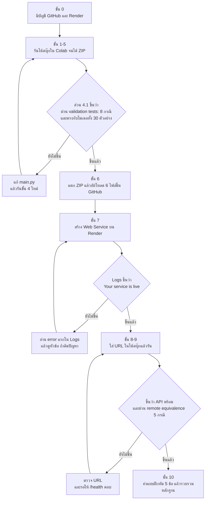
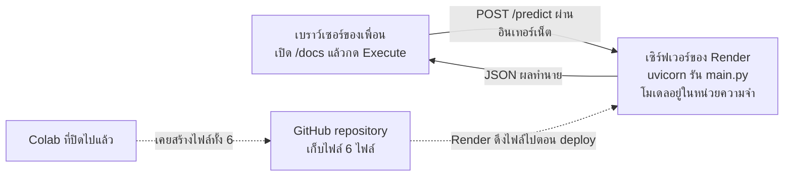
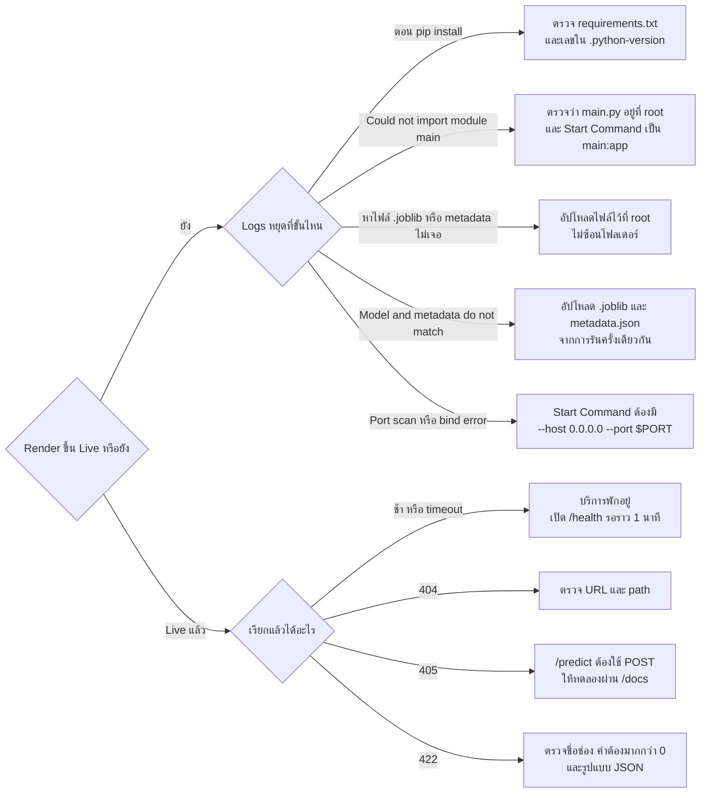

# เฉลย Lecture 14 — ทำตามทีละขั้นจนส่งงานได้

เอกสารนี้พาทำงานของ `Lecture_14_FastAPI_Render_TH.ipynb` ตั้งแต่เซลล์แรกจนได้หลักฐานส่งงาน มีโค้ดครบทุกเซลล์ ผลลัพธ์ที่ควรได้ จุดตรวจว่าทำถูกหรือยัง และเฉลยแบบฝึกหัด 5 ข้อ ถ้าอยากรู้ว่าโค้ดแต่ละบรรทัดทำงานอย่างไร ให้อ่านคู่กับ [[Lecture 14 FastAPI, Render]]

> [!abstract] ใช้เอกสารนี้อย่างไร
> 1. ทำตามขั้นที่ 0 ถึง 9 เรียงลำดับ ทุกขั้นมี **จุดตรวจ** ถ้าผลไม่ตรงอย่าเพิ่งไปต่อ
> 2. ขั้นที่ 10 คือเฉลยแบบฝึกหัด มีโค้ดให้รันและคำตอบให้เทียบ
> 3. ท้ายเอกสารมีแบบฟอร์มรวบรวมหลักฐานส่งงาน

> [!warning] สิ่งที่เฉลยทำแทนไม่ได้
> - **URL ของ GitHub และ Render ต้องเป็นของกลุ่มคุณเอง** เฉลยให้ได้แค่ขั้นตอน
> - **ผลจาก Render ต้องเป็นผลที่คุณรันเอง** ตัวเลขในเอกสารนี้ใช้เทียบว่าถูกหรือไม่ ไม่ใช่ให้ลอกไปส่ง
> - **คำตอบข้อ 2–5 ควรเรียบเรียงด้วยคำของตัวเอง** เฉลยเขียนให้เข้าใจเหตุผล

> [!note] ผลลัพธ์ในเอกสารนี้มาจากไหน
> โค้ดทุกเซลล์ในเอกสารนี้ถูกรันจริงเรียงตามลำดับบน Python 3.13.16, scikit-learn 1.6.1, numpy 2.1.3, fastapi 0.141.1 (เวอร์ชันเดียวกับในโน้ตบุ๊ก) ได้ไฟล์โมเดลที่มีค่า SHA-256 ตรงกับของอาจารย์
>
> ส่วนที่ต้องเรียก API ผ่านเครือข่าย (ขั้นที่ 8–10) ทดสอบโดยรัน `main.py` ด้วย `uvicorn` บนเครื่องทดสอบแล้วเรียกผ่าน HTTP จริง **ไม่ได้เรียก Render ของคุณ** ผลจาก Render ควรตรงกัน เพราะเป็นโค้ดและไฟล์โมเดลชุดเดียวกัน และตรงกับ output ที่อาจารย์บันทึกไว้ในโน้ตบุ๊ก

---

## แผนที่งานทั้งหมด



**รายการงาน** (ติ๊กไปทีละข้อ)

- [ ] ขั้น 0 — สมัครและยืนยันบัญชี GitHub กับ Render
- [ ] ขั้น 1 — ติดตั้งและ import ไลบรารี
- [ ] ขั้น 2 — ฝึกโมเดล ได้ accuracy 0.900
- [ ] ขั้น 3 — บันทึกโมเดลและ metadata
- [ ] ขั้น 4 — ใส่รหัสของตัวเองในบรรทัด `"ID"` แล้วสร้าง `main.py`
- [ ] ขั้น 4.1 — ทดสอบในโน้ตบุ๊กผ่านครบ
- [ ] ขั้น 5 — สร้างไฟล์ deploy และดาวน์โหลด ZIP
- [ ] ขั้น 6 — อัปโหลด 6 ไฟล์ขึ้น GitHub (ตรวจว่ามี `.python-version`)
- [ ] ขั้น 7 — Deploy บน Render จนขึ้น Live และจด URL
- [ ] ขั้น 8 — ใส่ URL ในโน้ตบุ๊ก ผ่าน health check และ remote equivalence
- [ ] ขั้น 9 — ทดลองเปลี่ยน input
- [ ] ขั้น 10 — ทำแบบฝึกหัด 5 ข้อ
- [ ] รวบรวมหลักฐานส่งงาน

---

## ขั้นที่ 0 — เตรียมบัญชี

1. สมัคร GitHub ที่ github.com และยืนยันอีเมล
2. สมัคร Render ที่ render.com (ใช้บัญชี GitHub เข้าสู่ระบบได้) เลือก workspace แบบไม่เสียเงิน
3. เปิดโน้ตบุ๊ก `Lecture_14_FastAPI_Render_TH.ipynb` ใน Google Colab แล้วเลือก **Runtime → Restart session** เพื่อเริ่มจาก runtime ใหม่

> [!tip] ไม่ต้องใช้ token ใด ๆ ในโน้ตบุ๊ก
> งานนี้อัปโหลดไฟล์ผ่านหน้าเว็บ GitHub ทั้งหมด ถ้ามีขั้นตอนไหนขอให้วาง token หรือรหัสผ่านลงในโน้ตบุ๊ก แปลว่าทำผิดทาง

---

## ขั้นที่ 1 — ติดตั้งและ import ไลบรารี

```python
%pip install -q fastapi uvicorn scikit-learn numpy scipy joblib requests httpx
```

ถ้า Colab แจ้งให้ restart หลังติดตั้ง ให้กด restart แล้วรันเซลล์นี้ซ้ำอีกครั้ง

```python
from pathlib import Path
from importlib.metadata import version
import sys, json, platform, hashlib
import numpy as np
from joblib import dump, load
from sklearn.datasets import load_iris
from sklearn.model_selection import train_test_split
from sklearn.ensemble import RandomForestClassifier
from sklearn.metrics import accuracy_score, classification_report, confusion_matrix

PROJECT = Path("iris_fastapi_render").resolve()
PROJECT.mkdir(exist_ok=True)
print("Project:", PROJECT)
print("Python:", platform.python_version())
for name in ["scikit-learn", "numpy", "fastapi", "pydantic"]:
    print(name, version(name))
```

ผลที่ควรได้:

```text
Project: /content/iris_fastapi_render
Python: 3.13.16
scikit-learn 1.6.1
numpy 2.1.3
fastapi 0.141.1
pydantic 2.13.5
```

> [!success] จุดตรวจ
> ต้องเห็นบรรทัด `Project:` และเลขเวอร์ชันครบ 5 บรรทัด เลขเวอร์ชันของคุณอาจต่างจากนี้ถ้า Colab อัปเดต ไม่เป็นไร แต่ **ให้จดเลข Python ไว้** เพราะต้องใช้ในขั้นที่ 6

---

## ขั้นที่ 2 — ฝึกและประเมินโมเดล

```python
iris = load_iris()
X_train, X_test, y_train, y_test = train_test_split(
    iris.data, iris.target, test_size=0.2, stratify=iris.target,
    random_state=42
)
model = RandomForestClassifier(n_estimators=100, random_state=42, n_jobs=1)
model.fit(X_train, y_train)
y_pred = model.predict(X_test)
print(f"Train: {len(X_train)} | Test: {len(X_test)}")
print(f"Test accuracy: {accuracy_score(y_test, y_pred):.3f}")
print(classification_report(y_test, y_pred, target_names=iris.target_names))
print("Confusion matrix (rows=true, columns=predicted):")
print(confusion_matrix(y_test, y_pred))
```

ผลที่ควรได้:

```text
Train: 120 | Test: 30
Test accuracy: 0.900
              precision    recall  f1-score   support

      setosa       1.00      1.00      1.00        10
  versicolor       0.82      0.90      0.86        10
   virginica       0.89      0.80      0.84        10

    accuracy                           0.90        30
   macro avg       0.90      0.90      0.90        30
weighted avg       0.90      0.90      0.90        30

Confusion matrix (rows=true, columns=predicted):
[[10  0  0]
 [ 0  9  1]
 [ 0  2  8]]
```

> [!success] จุดตรวจ
> - `Train: 120 | Test: 30`
> - `Test accuracy: 0.900`
> - confusion matrix แถวแรกเป็น `[10 0 0]` คือ setosa ถูกทั้งหมด
>
> ถ้าเวอร์ชัน scikit-learn ของคุณไม่ใช่ 1.6.1 ตัวเลขอาจต่างไปเล็กน้อย ให้บันทึกตามที่ได้จริง

---

## ขั้นที่ 3 — บันทึกโมเดลและ metadata

```python
model_path = PROJECT / "iris_random_forest.joblib"
dump(model, model_path)
feature_keys = ["sepal_length", "sepal_width", "petal_length", "petal_width"]
metadata = {
    "model_version": "iris-rf-v1",
    "feature_order": feature_keys,
    "target_names": iris.target_names.tolist(),
    "test_accuracy": float(accuracy_score(y_test, y_pred)),
    "random_state": 42,
    "python_version": platform.python_version(),
    "sklearn_version": version("scikit-learn"),
    "model_sha256": hashlib.sha256(model_path.read_bytes()).hexdigest()
}
(PROJECT / "metadata.json").write_text(
    json.dumps(metadata, indent=2, ensure_ascii=False), encoding="utf-8"
)
loaded_model = load(model_path)
np.testing.assert_array_equal(model.predict(X_test), loaded_model.predict(X_test))
print("โหลดกลับแล้วได้ผลตรงกับโมเดลเดิม")
print(json.dumps(metadata, indent=2, ensure_ascii=False))
```

ผลที่ควรได้:

```text
โหลดกลับแล้วได้ผลตรงกับโมเดลเดิม
{
  "model_version": "iris-rf-v1",
  "feature_order": [
    "sepal_length",
    "sepal_width",
    "petal_length",
    "petal_width"
  ],
  "target_names": [
    "setosa",
    "versicolor",
    "virginica"
  ],
  "test_accuracy": 0.9,
  "random_state": 42,
  "python_version": "3.13.16",
  "sklearn_version": "1.6.1",
  "model_sha256": "a6ef37dcdfa8b33aa93ebc80fe8fa07093ce9661f49d79739a4c7a2bcf92433f"
}
```

> [!success] จุดตรวจ
> - ขึ้นข้อความ `โหลดกลับแล้วได้ผลตรงกับโมเดลเดิม`
> - ในโฟลเดอร์ `iris_fastapi_render` (ดูจากแถบไฟล์ด้านซ้ายของ Colab) มีไฟล์ `iris_random_forest.joblib` และ `metadata.json`
>
> ค่า `model_sha256` คือค่าที่ Render จะต้องรายงานกลับมาให้ตรงกันในขั้นที่ 8

---

## ขั้นที่ 4 — สร้าง `main.py`

> [!important] แก้บรรทัด `"ID"` ก่อนรันเซลล์นี้
> เปลี่ยนข้อความ `ใส่รหัสนักศึกษาของคุณ` เป็นรหัสของตัวเอง ในไฟล์ต้นฉบับบรรทัดนี้มีรหัสตัวอย่างใส่ไว้แล้ว ถ้าไม่แน่ใจว่าต้องใส่รหัสรายคนหรือรายกลุ่ม ให้ถามอาจารย์
>
> ต้องแก้ **ก่อน** สร้าง ZIP ในขั้นที่ 5 เพราะ ZIP จะเก็บ `main.py` ฉบับที่สร้างจากเซลล์นี้

```python
APP_SOURCE = r'''
from pathlib import Path
import hashlib
import json
from typing import Annotated

import numpy as np
from fastapi import FastAPI
from joblib import load
from pydantic import BaseModel, ConfigDict, Field

BASE_DIR = Path(__file__).resolve().parent
MODEL_PATH = BASE_DIR / "iris_random_forest.joblib"
metadata = json.loads((BASE_DIR / "metadata.json").read_text(encoding="utf-8"))
model = load(MODEL_PATH)
model_sha256 = hashlib.sha256(MODEL_PATH.read_bytes()).hexdigest()
if model_sha256 != metadata["model_sha256"]:
    raise RuntimeError("Model and metadata do not match")

app = FastAPI(title="Iris Prediction API", version="1.0.0",
              description="Educational Random Forest deployment on Render")
PositiveFinite = Annotated[float, Field(gt=0, allow_inf_nan=False)]

class IrisInput(BaseModel):
    model_config = ConfigDict(extra="forbid")
    sepal_length: PositiveFinite
    sepal_width: PositiveFinite
    petal_length: PositiveFinite
    petal_width: PositiveFinite

@app.get("/")
def root():
    return {"message": "Iris Prediction API", "docs": "/docs", "health": "/health"}

@app.get("/health")
def health():
    return {"status": "ok", "model_version": metadata["model_version"],
            "model_sha256": model_sha256}

@app.post("/predict")
def predict(data: IrisInput):
    payload = data.model_dump()
    features = np.asarray([[payload[key] for key in metadata["feature_order"]]])
    predicted = int(model.predict(features)[0])
    probabilities = model.predict_proba(features)[0]
    names = metadata["target_names"]
    return {
        "ID": "ใส่รหัสนักศึกษาของคุณ",   # ← แก้บรรทัดนี้
        "model_version": metadata["model_version"],
        "input": payload,
        "predicted_class_index": predicted,
        "predicted_class_name": names[predicted],
        "probabilities": {names[int(k)]: float(p)
                          for k, p in zip(model.classes_, probabilities)}
    }
'''
(PROJECT / "main.py").write_text(APP_SOURCE, encoding="utf-8")
print(APP_SOURCE)
```

เซลล์นี้พิมพ์เนื้อหาของ `main.py` ออกมาทั้งไฟล์ ให้เลื่อนดูว่าบรรทัด `"ID"` เป็นรหัสของตัวเองแล้ว

> [!success] จุดตรวจ
> มีไฟล์ `main.py` เพิ่มในโฟลเดอร์ `iris_fastapi_render`

---

## ขั้นที่ 4.1 — ทดสอบ API ในโน้ตบุ๊ก

```python
import importlib.util
from fastapi.testclient import TestClient

spec = importlib.util.spec_from_file_location("iris_api", PROJECT / "main.py")
api_module = importlib.util.module_from_spec(spec)
spec.loader.exec_module(api_module)
local_client = TestClient(api_module.app)

sample = dict(zip(feature_keys, [5.1, 3.5, 1.4, 0.2]))
assert local_client.get("/health").status_code == 200
assert local_client.get("/docs").status_code == 200
response = local_client.post("/predict", json=sample)
assert response.status_code == 200
result = response.json()
assert result["predicted_class_index"] == int(loaded_model.predict([list(sample.values())])[0])
print(json.dumps(result, indent=2, ensure_ascii=False))

bad_payloads = [
    {**sample, "sepal_length": -1},
    {**sample, "petal_width": 0},
    {**sample, "petal_length": "hello"},
    {**sample, "sepal_width": None},
    {**sample, "sepal_length": "NaN"},
    {**sample, "sepal_length": "Infinity"},
    {key: value for key, value in sample.items() if key != "petal_width"},
    {**sample, "unknown_field": 1}
]
for bad in bad_payloads:
    r = local_client.post("/predict", json=bad)
    assert r.status_code == 422, r.text
print(f"ผ่าน validation tests: {len(bad_payloads)} กรณี")

for row in X_test:
    remote = local_client.post("/predict", json=dict(zip(feature_keys, row.tolist()))).json()
    assert remote["predicted_class_index"] == int(loaded_model.predict([row])[0])
    expected = loaded_model.predict_proba([row])[0]
    actual = [remote["probabilities"][str(iris.target_names[int(k)])] for k in loaded_model.classes_]
    np.testing.assert_allclose(actual, expected, rtol=1e-6, atol=1e-8)
print(f"ผล API ตรงกับโมเดลทั้ง {len(X_test)} ตัวอย่างใน test set")
```

ผลที่ควรได้ (บรรทัด `"ID"` จะเป็นรหัสที่คุณใส่):

```text
{
  "ID": "ใส่รหัสนักศึกษาของคุณ",
  "model_version": "iris-rf-v1",
  "input": {
    "sepal_length": 5.1,
    "sepal_width": 3.5,
    "petal_length": 1.4,
    "petal_width": 0.2
  },
  "predicted_class_index": 0,
  "predicted_class_name": "setosa",
  "probabilities": {
    "setosa": 1.0,
    "versicolor": 0.0,
    "virginica": 0.0
  }
}
ผ่าน validation tests: 8 กรณี
ผล API ตรงกับโมเดลทั้ง 30 ตัวอย่างใน test set
```

> [!success] จุดตรวจ
> ต้องเห็นสองบรรทัดสุดท้ายนี้ครบ
> - `ผ่าน validation tests: 8 กรณี`
> - `ผล API ตรงกับโมเดลทั้ง 30 ตัวอย่างใน test set`
>
> ถ้าเซลล์หยุดด้วย `AssertionError` แปลว่า `main.py` มีจุดผิด ให้กลับไปเทียบกับโค้ดขั้นที่ 4 แล้วรันขั้นที่ 4 และ 4.1 ใหม่

> [!note] ถ้าเห็น `StarletteDeprecationWarning` เกี่ยวกับ `httpx`
> เป็นข้อความเตือนของไลบรารี ไม่ใช่ error และไม่กระทบผลการทดสอบ

> [!warning] แก้ `main.py` แล้วต้องรันเซลล์นี้ใหม่ทุกครั้ง
> เซลล์นี้โหลด `main.py` เข้ามาตอนที่รัน ถ้าแก้โค้ดในขั้นที่ 4 ทีหลัง `local_client` ยังเป็นของเก่าจนกว่าจะรันเซลล์นี้ซ้ำ

---

## ขั้นที่ 5 — สร้างไฟล์ deploy และดาวน์โหลด ZIP

```python
packages = ["fastapi", "uvicorn", "pydantic", "scikit-learn", "numpy", "scipy", "joblib"]
requirements = "\n".join(f"{name}=={version(name)}" for name in packages) + "\n"
(PROJECT / "requirements.txt").write_text(requirements, encoding="utf-8")
(PROJECT / ".python-version").write_text(platform.python_version() + "\n", encoding="utf-8")
(PROJECT / "README.md").write_text(
    "# Iris FastAPI on Render\n\n"
    "Educational demo. Train in Colab; serve the saved model with FastAPI.\n\n"
    "Build: `pip install -r requirements.txt`\n\n"
    "Start: `uvicorn main:app --host 0.0.0.0 --port $PORT`\n\n"
    "Choose Python runtime and Free instance. Health check: `/health`.\n"
    "Open `/docs` to test `POST /predict`.\n", encoding="utf-8"
)
print(requirements)
print("Python:", (PROJECT / ".python-version").read_text())
```

ผลที่ควรได้:

```text
fastapi==0.141.1
uvicorn==0.54.0
pydantic==2.13.5
scikit-learn==1.6.1
numpy==2.1.3
scipy==1.16.3
joblib==1.6.0

Python: 3.13.16
```

```python
import zipfile
zip_path = PROJECT.parent / "iris_fastapi_render_deploy.zip"
deploy_files = ["main.py", "iris_random_forest.joblib", "metadata.json",
                "requirements.txt", ".python-version", "README.md"]
with zipfile.ZipFile(zip_path, "w", zipfile.ZIP_DEFLATED) as archive:
    for name in deploy_files:
        archive.write(PROJECT / name, arcname=name)
print("ZIP:", zip_path)
print("ไฟล์ภายใน:", deploy_files)
```

ผลที่ควรได้:

```text
ZIP: /content/iris_fastapi_render_deploy.zip
ไฟล์ภายใน: ['main.py', 'iris_random_forest.joblib', 'metadata.json', 'requirements.txt', '.python-version', 'README.md']
```

เซลล์ถัดไป ให้เปลี่ยน `DOWNLOAD_ZIP` จาก `False` เป็น `True` แล้วรัน เบราว์เซอร์จะดาวน์โหลดไฟล์ `iris_fastapi_render_deploy.zip`

```python
# ตั้ง True เมื่อต้องการดาวน์โหลด ZIP ใน Colab
DOWNLOAD_ZIP = True
if DOWNLOAD_ZIP:
    try:
        from google.colab import files
    except ImportError:
        print("Jupyter: ดาวน์โหลด ZIP จาก file browser ของ Jupyter")
    else:
        files.download(str(zip_path))
else:
    print("พร้อมแล้ว: เปลี่ยน DOWNLOAD_ZIP = True หรือดาวน์โหลดผ่าน file browser")
```

> [!success] จุดตรวจ
> 1. ได้ไฟล์ `iris_fastapi_render_deploy.zip` ในเครื่อง
> 2. **แตกไฟล์** (บน Windows คลิกขวา → Extract All)
> 3. ในโฟลเดอร์ที่แตกออกมาต้องมี 6 ไฟล์นี้ และไม่มีโฟลเดอร์ซ้อน
>
> | ไฟล์ | มีไว้ทำอะไร |
> |---|---|
> | `main.py` | โปรแกรม API |
> | `iris_random_forest.joblib` | โมเดล |
> | `metadata.json` | ข้อมูลประกอบโมเดล |
> | `requirements.txt` | รายชื่อไลบรารีและเวอร์ชัน |
> | `.python-version` | เวอร์ชัน Python |
> | `README.md` | คำอธิบายโปรเจกต์ |

---

## ขั้นที่ 6 — อัปโหลดขึ้น GitHub

**6.1** กดปุ่ม `+` มุมขวาบนของ GitHub เลือก **New repository**

![[l14-github-01-new-repository.png]]

**6.2** ตั้งชื่อ เช่น `iris-fastapi-render` เลือก **Public** ปล่อย Add README เป็น Off แล้วกด **Create repository**

![[l14-github-02-create-repository.png]]

**6.3** ในหน้า repository ที่ยังว่าง กดลิงก์ **uploading an existing file**

![[l14-github-03-upload-link.png]]

**6.4** ลากไฟล์ทั้ง 6 ไฟล์ (ที่แตกจาก ZIP แล้ว) ไปวาง พิมพ์ข้อความ commit เช่น `upload files` แล้วกด **Commit changes**

![[l14-github-04-upload-commit.png]]

**6.5** ตรวจรายชื่อไฟล์บนหน้า repository ถ้า **ไม่มี** `.python-version` ให้กด `+` → **Create new file**

![[l14-github-05-create-new-file.png]]

**6.6** ตั้งชื่อไฟล์ว่า `.python-version` (มีจุดนำหน้า) พิมพ์เลข Python ที่ขั้นที่ 5 แสดงในบรรทัด `Python:` ลงไปบรรทัดเดียว แล้วกด **Commit changes**

![[l14-github-06-python-version.png]]

> [!warning] เลขในภาพคือ 3.13.15 เป็นของอาจารย์
> ให้พิมพ์เลขที่ **โน้ตบุ๊กของคุณ** แสดง ถ้าใช้เลขตามผลในเอกสารนี้คือ `3.13.16`

> [!success] จุดตรวจ
> หน้า repository แสดงไฟล์ 6 ไฟล์อยู่ระดับบนสุด และกดเปิด `main.py` แล้วเห็นบรรทัด `"ID"` เป็นรหัสของตัวเอง
>
> ถ้ามีไฟล์ชื่อ `download` ติดขึ้นมาด้วย (เหมือนในภาพของอาจารย์) ไม่มีผลกับการ deploy

**จด URL ของ repository ไว้** รูปแบบคือ `https://github.com/ชื่อผู้ใช้/iris-fastapi-render` ต้องใช้ตอนส่งงาน

---

## ขั้นที่ 7 — Deploy บน Render

**7.1** เข้า render.com เข้าสู่ระบบ แล้วเลือก **New → Web Service**

**7.2** ที่หัวข้อ Source Code เลือก **GitHub** หน้าต่างของ GitHub จะเปิดขึ้นมา ให้เลือก **Only select repositories** แล้วเลือก repository ที่เพิ่งสร้าง

![[l14-render-01-connect-github.png]]

**7.3** กรอกค่าตามตารางนี้ให้ตรงทุกช่อง

| ช่อง | ค่าที่ต้องใส่ |
|---|---|
| Name | ชื่อบริการของกลุ่ม เช่น `iris-group-01` |
| Language | `Python 3` |
| Branch | `main` |
| Root Directory | เว้นว่าง |
| Build Command | `pip install -r requirements.txt` |
| Start Command | `uvicorn main:app --host 0.0.0.0 --port $PORT` |
| Instance Type | **Free** ($0 / month) |

![[l14-render-02-settings.png]]

**7.4** เปิดหมวด **Advanced** แล้วใส่ `/health` ในช่อง Health Check Path (ถ้ามีช่องนี้)

![[l14-render-02b-health-check.png]]

**7.5** ตรวจอีกครั้งว่าเลือก **Free** แล้วกดปุ่ม deploy ด้านล่างสุด

**7.6** รอดู Logs สักครู่ (ของอาจารย์ใช้เวลา 1 นาที 32 วินาที) จนเห็น `Your service is live` และสถานะ `Deploy succeeded | Live`

![[l14-render-03-deploy-live.png]]

**7.7** คัดลอก URL จากบรรทัด `Available at your primary URL` หรือจากด้านบนของ Dashboard

> [!warning] ห้ามเดา URL
> Render อาจเติมอักขระต่อท้ายชื่อ เช่น อาจารย์ตั้งชื่อ `iris-fastapi-render` แต่ได้ URL `https://iris-fastapi-render-r3y6.onrender.com`

**7.8** ทดสอบด้วยเบราว์เซอร์

1. เปิด `URL ของคุณ/health` ต้องเห็น `{"status":"ok","model_version":"iris-rf-v1","model_sha256":"..."}`
2. เปิด `URL ของคุณ/docs` → กดแถบ **POST /predict** → **Try it out** → ลบข้อความในช่อง Request body แล้ววาง JSON นี้ → **Execute**

```json
{"sepal_length": 5.1, "sepal_width": 3.5, "petal_length": 1.4, "petal_width": 0.2}
```

> [!success] จุดตรวจ
> ในหน้า `/docs` ส่วน Server response แสดง Code **200** และ Response body มี `"predicted_class_name": "setosa"` พร้อม `"ID"` เป็นรหัสของคุณ

> [!tip] แก้ `main.py` หลัง deploy แล้วได้ไหม
> ได้ เปิด `main.py` บน GitHub กดรูปดินสอ แก้แล้ว commit ในภาพการตั้งค่าของอาจารย์ ช่อง Auto-Deploy เป็น `On Commit` Render จึง deploy ใหม่เองเมื่อมี commit และอย่าลืมแก้ในโน้ตบุ๊กให้ตรงกันด้วย

---

## ขั้นที่ 8 — เรียก API จริงจากโน้ตบุ๊ก

กลับมาที่ Colab แก้บรรทัด `BASE_URL` เป็น URL ที่คัดลอกจาก Render แล้วรัน

```python
import requests
BASE_URL = "https://ชื่อบริการของคุณ.onrender.com"  # ← วาง URL ที่คัดลอกจาก Render Dashboard
BASE_URL = BASE_URL.strip().rstrip("/")
REMOTE_READY = False
if not BASE_URL:
    print("ข้าม remote test: ใส่ URL จาก Render แล้วรันเซลล์นี้ใหม่")
else:
    if not BASE_URL.startswith("https://"):
        raise ValueError("ใช้ URL https:// ที่ Render แสดง")
    try:
        health_response = requests.get(f"{BASE_URL}/health", timeout=(10, 120))
        health_response.raise_for_status()
        health = health_response.json()
        assert health.get("status") == "ok", health
        assert health.get("model_sha256") == metadata["model_sha256"], "โมเดลบน Render ไม่ตรงกับ Notebook"
        REMOTE_READY = True
        print("API พร้อม:", health)
    except (requests.RequestException, ValueError, AssertionError) as error:
        print("ยังไม่พร้อม:", error)
        print("ตรวจ URL/Logs และเปิด /health ให้พร้อม จากนั้นรันใหม่")

def call_remote(payload):
    if not REMOTE_READY:
        raise RuntimeError("รัน health check ให้ผ่านก่อน")
    response = requests.post(f"{BASE_URL}/predict", json=payload, timeout=(10, 120))
    response.raise_for_status()
    return response.json()

if REMOTE_READY:
    print(json.dumps(call_remote(sample), indent=2, ensure_ascii=False))
```

ผลที่ควรได้:

```text
API พร้อม: {'status': 'ok', 'model_version': 'iris-rf-v1', 'model_sha256': 'a6ef37dcdfa8b33aa93ebc80fe8fa07093ce9661f49d79739a4c7a2bcf92433f'}
{
  "ID": "ใส่รหัสนักศึกษาของคุณ",
  "model_version": "iris-rf-v1",
  "input": {
    "sepal_length": 5.1,
    "sepal_width": 3.5,
    "petal_length": 1.4,
    "petal_width": 0.2
  },
  "predicted_class_index": 0,
  "predicted_class_name": "setosa",
  "probabilities": {
    "setosa": 1.0,
    "versicolor": 0.0,
    "virginica": 0.0
  }
}
```

> [!success] จุดตรวจ
> ขึ้นคำว่า `API พร้อม:` และค่า `model_sha256` ตรงกับที่ขั้นที่ 3 พิมพ์ไว้

ถ้าขึ้นว่า `ยังไม่พร้อม:` ให้ดูข้อความต่อท้าย

| ข้อความต่อท้าย | สาเหตุ | วิธีแก้ |
|---|---|---|
| มีคำว่า `timed out` หรือ `Connection` | บริการพักอยู่ หรือ URL ผิด | เปิด `URL/health` ในเบราว์เซอร์ รอจนตอบ แล้วรันเซลล์ใหม่ |
| `404 Client Error` | URL ไม่ตรงกับบริการ | คัดลอก URL จาก Dashboard ใหม่ |
| `โมเดลบน Render ไม่ตรงกับ Notebook` | ไฟล์บน GitHub มาจากการรันคนละครั้ง หรือ Colab เปลี่ยนเวอร์ชันไลบรารี | ดาวน์โหลด ZIP ใหม่ แล้วอัปโหลด `iris_random_forest.joblib`, `metadata.json`, `requirements.txt` ทับของเดิม (และแก้ `.python-version` ถ้าเลข Python เปลี่ยน) |

> [!note] เปิด Colab ใหม่แล้วต้อง deploy ใหม่ไหม
> ปกติไม่ต้อง ถ้าเวอร์ชันไลบรารีเท่าเดิม การรันขั้นที่ 1–5 ซ้ำจะได้ไฟล์โมเดลเหมือนเดิมทุกไบต์ (ทดสอบแล้วว่าฝึกซ้ำได้ SHA-256 ค่าเดิม) การตรวจในเซลล์นี้จึงผ่าน

### ขั้นที่ 8.1 — ตรวจผลและ validation หลัง deploy

```python
if REMOTE_READY:
    for row in X_test[:5]:
        payload = dict(zip(feature_keys, row.tolist()))
        result = call_remote(payload)
        expected = int(loaded_model.predict([row])[0])
        assert result["predicted_class_index"] == expected
        actual_p = [result["probabilities"][str(iris.target_names[int(k)])] for k in loaded_model.classes_]
        np.testing.assert_allclose(actual_p, loaded_model.predict_proba([row])[0], rtol=1e-6, atol=1e-8)
        print(payload, "→", result["predicted_class_name"])
    invalid = requests.post(f"{BASE_URL}/predict", json={**sample, "petal_width": -1}, timeout=(10,120))
    assert invalid.status_code == 422, invalid.text
    print("ผ่าน remote equivalence 5 กรณี และ validation 422")
else:
    print("ข้าม: ยังไม่ได้เชื่อมต่อ Render")
```

ผลที่ควรได้:

```text
{'sepal_length': 4.4, 'sepal_width': 3.0, 'petal_length': 1.3, 'petal_width': 0.2} → setosa
{'sepal_length': 6.1, 'sepal_width': 3.0, 'petal_length': 4.9, 'petal_width': 1.8} → virginica
{'sepal_length': 4.9, 'sepal_width': 2.4, 'petal_length': 3.3, 'petal_width': 1.0} → versicolor
{'sepal_length': 5.0, 'sepal_width': 2.3, 'petal_length': 3.3, 'petal_width': 1.0} → versicolor
{'sepal_length': 4.4, 'sepal_width': 3.2, 'petal_length': 1.3, 'petal_width': 0.2} → setosa
ผ่าน remote equivalence 5 กรณี และ validation 422
```

> [!success] จุดตรวจ
> บรรทัดสุดท้ายคือ `ผ่าน remote equivalence 5 กรณี และ validation 422` ผลชุดนี้คือ **ผลทดสอบ remote** ที่ต้องแนบส่ง

---

## ขั้นที่ 9 — ทดลองเปลี่ยน input

```python
sepal_length = 6.0  #@param {type:"number"}
sepal_width = 2.9   #@param {type:"number"}
petal_length = 4.5  #@param {type:"number"}
petal_width = 1.5   #@param {type:"number"}
payload = dict(zip(feature_keys, [sepal_length, sepal_width, petal_length, petal_width]))
if REMOTE_READY:
    result = call_remote(payload)
    print("ผลการทำนายดอกไอริส:", result["predicted_class_name"])
    print("ความน่าจะเป็น:", result["probabilities"])
else:
    print("ใส่ BASE_URL และตรวจ health ให้ผ่านก่อนทดลอง")
```

ผลที่ควรได้:

```text
ผลการทำนายดอกไอริส: versicolor
ความน่าจะเป็น: {'setosa': 0.0, 'versicolor': 0.98, 'virginica': 0.02}
```

ลองแก้ตัวเลข 4 ค่าแล้วรันซ้ำได้ตามต้องการ ถ้าใส่ค่านอกช่วงข้อมูลฝึก (เช่น `sepal_length = 1000`) API ยังตอบผลทำนายกลับมา ให้จดไว้เป็นข้อจำกัด อย่าสรุปว่าโมเดลมั่นใจแล้วแปลว่าถูก

---

## ขั้นที่ 10 — เฉลยแบบฝึกหัด

เพิ่มเซลล์ใหม่ต่อท้ายโน้ตบุ๊กแล้ววางโค้ดของแต่ละข้อ ต้องรันขั้นที่ 1–8 ผ่านมาก่อน เพราะโค้ดใช้ตัวแปร `feature_keys`, `sample`, `call_remote`, `BASE_URL`, `loaded_model`, `local_client` จากเซลล์ก่อนหน้า

### ข้อ 1 — ทดลอง 3 input ที่ได้ผลต่างสายพันธุ์

> โจทย์: ทดลอง 3 input ที่ได้ผลต่างสายพันธุ์ บันทึก input และ JSON response

**แนวคิด:** สายพันธุ์ทั้งสามต่างกันชัดที่ขนาดกลีบดอก (petal) จึงเลือก input จากกลุ่มละจุด คือกลีบเล็ก กลีบกลาง และกลีบใหญ่ ตำแหน่งของ A, B, C อยู่ในภาพนี้

![[l14-petal-scatter.svg]]

```python
# แบบฝึกหัดข้อ 1 — ส่ง 3 input ที่ได้ผลต่างสายพันธุ์
ex1_inputs = {
    "A": [5.1, 3.5, 1.4, 0.2],
    "B": [6.0, 2.9, 4.5, 1.5],
    "C": [6.5, 3.0, 5.5, 2.0],
}
for label, values in ex1_inputs.items():
    payload = dict(zip(feature_keys, values))
    result = call_remote(payload)
    print(f"----- input {label} -----")
    print("ส่งไป :", json.dumps(payload))
    print("ได้กลับ:", json.dumps(result, indent=2, ensure_ascii=False))
```

ผลที่ได้:

```text
----- input A -----
ส่งไป : {"sepal_length": 5.1, "sepal_width": 3.5, "petal_length": 1.4, "petal_width": 0.2}
ได้กลับ: {
  "ID": "ใส่รหัสนักศึกษาของคุณ",
  "model_version": "iris-rf-v1",
  "input": {
    "sepal_length": 5.1,
    "sepal_width": 3.5,
    "petal_length": 1.4,
    "petal_width": 0.2
  },
  "predicted_class_index": 0,
  "predicted_class_name": "setosa",
  "probabilities": {
    "setosa": 1.0,
    "versicolor": 0.0,
    "virginica": 0.0
  }
}
----- input B -----
ส่งไป : {"sepal_length": 6.0, "sepal_width": 2.9, "petal_length": 4.5, "petal_width": 1.5}
ได้กลับ: {
  "ID": "ใส่รหัสนักศึกษาของคุณ",
  "model_version": "iris-rf-v1",
  "input": {
    "sepal_length": 6.0,
    "sepal_width": 2.9,
    "petal_length": 4.5,
    "petal_width": 1.5
  },
  "predicted_class_index": 1,
  "predicted_class_name": "versicolor",
  "probabilities": {
    "setosa": 0.0,
    "versicolor": 0.98,
    "virginica": 0.02
  }
}
----- input C -----
ส่งไป : {"sepal_length": 6.5, "sepal_width": 3.0, "petal_length": 5.5, "petal_width": 2.0}
ได้กลับ: {
  "ID": "ใส่รหัสนักศึกษาของคุณ",
  "model_version": "iris-rf-v1",
  "input": {
    "sepal_length": 6.5,
    "sepal_width": 3.0,
    "petal_length": 5.5,
    "petal_width": 2.0
  },
  "predicted_class_index": 2,
  "predicted_class_name": "virginica",
  "probabilities": {
    "setosa": 0.0,
    "versicolor": 0.0,
    "virginica": 1.0
  }
}
```

**สรุปคำตอบ**

| input | sepal_length | sepal_width | petal_length | petal_width | ผลทำนาย | ความน่าจะเป็น |
|---|---|---|---|---|---|---|
| A | 5.1 | 3.5 | 1.4 | 0.2 | setosa | setosa 1.00 |
| B | 6.0 | 2.9 | 4.5 | 1.5 | versicolor | versicolor 0.98, virginica 0.02 |
| C | 6.5 | 3.0 | 5.5 | 2.0 | virginica | virginica 1.00 |

ได้ครบ 3 สายพันธุ์ และทุกคำขอได้สถานะ 200

> [!tip] อยากใช้ input ของตัวเอง
> ค่าเหล่านี้ทดสอบแล้วกับโมเดลเดียวกัน เลือกใช้แทนได้
>
> | input (เรียงตามลำดับ feature) | ผลทำนาย | ความน่าจะเป็น |
> |---|---|---|
> | 7.7, 3.0, 6.1, 2.3 | virginica | virginica 1.00 |
> | 5.9, 3.0, 5.1, 1.8 | virginica | virginica 0.94, versicolor 0.06 |
> | 6.3, 2.5, 4.9, 1.5 | versicolor | versicolor 0.83, virginica 0.17 |
> | 6.0, 2.7, 5.1, 1.6 | versicolor | versicolor 0.66, virginica 0.34 |
>
> สองแถวล่างอยู่ใกล้รอยต่อของสองสายพันธุ์ ความน่าจะเป็นจึงไม่ขาด เหมาะจะยกเป็นตัวอย่างว่าโมเดลไม่แน่ใจเท่ากันทุกครั้ง

---

### ข้อ 2 — ส่งค่าที่ผิดอย่างน้อย 2 แบบ แล้วอธิบาย HTTP 422

> โจทย์: ส่งค่าที่ผิดอย่างน้อย 2 แบบ แล้วอธิบายความหมายของ HTTP 422

ข้อนี้ต้องใช้ `requests.post` ตรง ๆ ไม่ใช้ `call_remote` เพราะ `call_remote` มี `raise_for_status()` ซึ่งจะโยน error ทันทีเมื่อได้ 422 ทำให้อ่านรายละเอียดไม่ได้

```python
# แบบฝึกหัดข้อ 2 — ส่งค่าที่ผิด แล้วดูว่า API ตอบอะไร
bad_cases = {
    "ค่าติดลบ": {**sample, "petal_width": -1},
    "ข้อความแทนตัวเลข": {**sample, "petal_length": "hello"},
    "ส่งไม่ครบ 4 ช่อง": {k: v for k, v in sample.items() if k != "petal_width"},
    "มีช่องเกินมา": {**sample, "unknown_field": 1},
}
for name, bad in bad_cases.items():
    r = requests.post(f"{BASE_URL}/predict", json=bad, timeout=(10, 120))
    print(f"----- {name} -----")
    print("ส่งไป :", json.dumps(bad, ensure_ascii=False))
    print("สถานะ :", r.status_code)
    for err in r.json()["detail"]:
        print("  ช่องที่ผิด:", err["loc"], "| ชนิด:", err["type"], "| ข้อความ:", err["msg"])
```

ผลที่ได้:

```text
----- ค่าติดลบ -----
ส่งไป : {"sepal_length": 5.1, "sepal_width": 3.5, "petal_length": 1.4, "petal_width": -1}
สถานะ : 422
  ช่องที่ผิด: ['body', 'petal_width'] | ชนิด: greater_than | ข้อความ: Input should be greater than 0
----- ข้อความแทนตัวเลข -----
ส่งไป : {"sepal_length": 5.1, "sepal_width": 3.5, "petal_length": "hello", "petal_width": 0.2}
สถานะ : 422
  ช่องที่ผิด: ['body', 'petal_length'] | ชนิด: float_parsing | ข้อความ: Input should be a valid number, unable to parse string as a number
----- ส่งไม่ครบ 4 ช่อง -----
ส่งไป : {"sepal_length": 5.1, "sepal_width": 3.5, "petal_length": 1.4}
สถานะ : 422
  ช่องที่ผิด: ['body', 'petal_width'] | ชนิด: missing | ข้อความ: Field required
----- มีช่องเกินมา -----
ส่งไป : {"sepal_length": 5.1, "sepal_width": 3.5, "petal_length": 1.4, "petal_width": 0.2, "unknown_field": 1}
สถานะ : 422
  ช่องที่ผิด: ['body', 'unknown_field'] | ชนิด: extra_forbidden | ข้อความ: Extra inputs are not permitted
```

ถ้าอยากเห็น JSON เต็ม ๆ ที่ API ตอบกลับ:

```python
r = requests.post(f"{BASE_URL}/predict", json={**sample, "petal_width": -1}, timeout=(10, 120))
print(r.status_code)
print(json.dumps(r.json(), indent=2, ensure_ascii=False))
```

```text
422
{
  "detail": [
    {
      "type": "greater_than",
      "loc": [
        "body",
        "petal_width"
      ],
      "msg": "Input should be greater than 0",
      "input": -1,
      "ctx": {
        "gt": 0.0
      }
    }
  ]
}
```

**วิธีอ่านคำตอบ 422**

| ช่องใน `detail` | ความหมาย | ในตัวอย่าง |
|---|---|---|
| `loc` | ผิดที่ไหน | `["body", "petal_width"]` คือช่อง `petal_width` ใน body ของคำขอ |
| `type` | ผิดกติกาข้อใด | `greater_than` คือกติกา "ต้องมากกว่า" |
| `msg` | คำอธิบายสำหรับคนอ่าน | Input should be greater than 0 |
| `input` | ค่าที่ส่งมา | `-1` |
| `ctx` | รายละเอียดของกติกา | `{"gt": 0.0}` คือต้องมากกว่า 0 |

**คำตอบ: HTTP 422 หมายความว่าอะไร**

422 (Unprocessable Entity บางเครื่องมือเรียกว่า Unprocessable Content) แปลว่า **เซิร์ฟเวอร์ได้รับคำขอและอ่าน JSON ออก แต่ข้อมูลข้างในไม่ผ่านกติกาที่ API กำหนด จึงไม่นำไปประมวลผล**

ในบทนี้กติกามาจากคลาส `IrisInput` คือต้องมีครบ 4 ช่อง ทุกช่องเป็นตัวเลขที่มากกว่า 0 ไม่เป็น NaN หรือ Infinity และห้ามมีช่องอื่นเกินมา เมื่อข้อมูลผิดกติกา FastAPI จะตอบ 422 พร้อมบอกว่าผิดช่องไหนเพราะอะไร และ **โมเดลไม่ถูกเรียกเลย**

422 เป็นรหัสกลุ่ม 4xx คือความผิดอยู่ที่ฝั่งผู้ส่ง วิธีแก้คือแก้ข้อมูลที่ส่ง ไม่ใช่แก้เซิร์ฟเวอร์ การตรวจแบบนี้ช่วยกันไม่ให้ค่าที่ไม่มีความหมาย เช่น ความยาวติดลบ ไปถึงโมเดลแล้วได้คำทำนายที่ดูเหมือนปกติ

**เทียบกับรหัสอื่น**

| รหัส | ผิดตรงไหน | ตัวอย่างที่ทดสอบแล้ว |
|---|---|---|
| 200 | ไม่ผิด | ส่ง 4 ค่าถูกต้อง |
| 404 | path ไม่มีอยู่ | เรียก `/nope` |
| 405 | path ถูก method ผิด | เปิด `/predict` ด้วย GET |
| 422 | path และ method ถูก แต่ข้อมูลผิดกติกา | `petal_width = -1` |

> [!warning] ตัวอย่างที่ดูเหมือนผิดแต่ได้ 200
> ทดสอบแล้วว่าสองกรณีนี้ **ผ่าน** จึงไม่ควรใช้เป็นตัวอย่าง "ค่าที่ผิด"
> - `"sepal_length": "5.1"` (ตัวเลขในเครื่องหมายคำพูด) ถูกแปลงเป็น 5.1
> - `"sepal_length": 1000` เป็นเลขบวก จึงผ่าน แม้จะไม่สมเหตุสมผล

---

### ข้อ 3 — ทำไมต้องใช้ลำดับ feature และ library version เดียวกับตอนฝึก

> โจทย์: อธิบายว่าเหตุใดต้องใช้ลำดับ feature และ library version เดียวกับตอนฝึก

#### ส่วนที่ 1 — ลำดับ feature

ทดลองให้เห็นกับโมเดลในโน้ตบุ๊ก โดยส่งตัวเลขชุดเดียวกันแต่สลับลำดับ

```python
# แบบฝึกหัดข้อ 3 — ถ้าเรียงลำดับ feature ผิดจะเกิดอะไร (ทดลองกับโมเดลในโน้ตบุ๊ก)
right = [6.0, 2.9, 4.5, 1.5]   # sepal_length, sepal_width, petal_length, petal_width
wrong = [4.5, 1.5, 6.0, 2.9]   # ตัวเลขชุดเดิม แต่เอา petal ขึ้นก่อน sepal
for name, row in [("ลำดับถูก", right), ("ลำดับผิด", wrong)]:
    idx = int(loaded_model.predict([row])[0])
    print(name, row, "→", iris.target_names[idx], loaded_model.predict_proba([row])[0])

X_wrong = X_test[:, [2, 3, 0, 1]]   # สลับคอลัมน์ของ test set ทั้งชุดแบบเดียวกัน
print("accuracy เมื่อลำดับถูก:", round(accuracy_score(y_test, loaded_model.predict(X_test)), 3))
print("accuracy เมื่อลำดับผิด:", round(accuracy_score(y_test, loaded_model.predict(X_wrong)), 3))
```

ผลที่ได้:

```text
ลำดับถูก [6.0, 2.9, 4.5, 1.5] → versicolor [0.   0.98 0.02]
ลำดับผิด [4.5, 1.5, 6.0, 2.9] → virginica [0.   0.03 0.97]
accuracy เมื่อลำดับถูก: 0.9
accuracy เมื่อลำดับผิด: 0.333
```

**คำตอบ:** โมเดลไม่รู้จักชื่อ feature มันเรียนรู้กติกาจาก **ตำแหน่ง** ของคอลัมน์ เช่น "ถ้าค่าในคอลัมน์ที่ 3 น้อยกว่าค่าหนึ่ง ให้ไปกิ่งซ้าย" ถ้าตอนใช้งานส่งค่าสลับตำแหน่ง โมเดลจะเอาความยาวกลีบเลี้ยงไปเทียบกับกติกาที่ตั้งไว้สำหรับความยาวกลีบดอก ผลจึงผิด

จากการทดลอง ดอกเดียวกันเปลี่ยนคำตอบจาก versicolor (0.98) เป็น virginica (0.97) และเมื่อสลับทั้งชุดทดสอบ accuracy ตกจาก 0.900 เหลือ 0.333 ซึ่งเท่ากับเดาสุ่ม 1 ใน 3

จุดที่อันตรายคือ **ไม่มี error เลย** โมเดลยังตอบด้วยความน่าจะเป็นสูงเหมือนมั่นใจ ถ้าไม่ได้ตรวจจะไม่รู้ว่าผิด

ผลกระทบแรงขนาดนี้เพราะโมเดลนี้พึ่งกลีบดอกเป็นหลัก ค่า feature importance ของโมเดลคือ `petal_width` 0.437, `petal_length` 0.431, `sepal_length` 0.116, `sepal_width` 0.015

**โน้ตบุ๊กป้องกันเรื่องนี้อย่างไร**

- เก็บลำดับไว้ใน `metadata["feature_order"]` คู่กับโมเดล
- API รับข้อมูลเป็น JSON ที่มี **ชื่อช่อง** แล้ว `main.py` เรียงค่าตาม `feature_order` เองก่อนส่งให้โมเดล ผู้เรียกจึงเรียง key แบบไหนก็ได้

```python
# API เรียงให้เองตามชื่อช่อง ลองส่ง key สลับลำดับดู
shuffled = {"petal_width": 1.5, "petal_length": 4.5, "sepal_width": 2.9, "sepal_length": 6.0}
print(call_remote(shuffled)["predicted_class_name"])
```

```text
versicolor
```

#### ส่วนที่ 2 — library version

**คำตอบ:** ไฟล์ `.joblib` ไม่ได้เก็บแค่ตัวเลข แต่เก็บโครงสร้างภายในของวัตถุโมเดลตามแบบของ scikit-learn และ NumPy **เวอร์ชันที่ใช้ตอนบันทึก** ถ้าเซิร์ฟเวอร์ใช้เวอร์ชันอื่น โครงสร้างภายในอาจไม่ตรงกัน ผลที่เป็นไปได้มี 3 แบบ

1. โหลดไม่ได้ เซิร์ฟเวอร์เริ่มไม่สำเร็จ
2. โหลดได้แต่มีคำเตือน
3. โหลดได้และให้ผลต่างจากเดิมโดยไม่มีอะไรบอก ซึ่งแย่ที่สุด

ทดลองโหลดไฟล์โมเดลของบทนี้ (บันทึกด้วย scikit-learn 1.6.1) บนเครื่องที่มี scikit-learn 1.9.1 และ numpy 2.5.3 ได้คำเตือนนี้ซ้ำสำหรับต้นไม้ทุกต้น:

```text
InconsistentVersionWarning: Trying to unpickle estimator DecisionTreeClassifier from version 1.6.1 when using version 1.9.1. This might lead to breaking code or invalid results. Use at your own risk.
```

ในการทดลองครั้งนั้นโมเดลยังโหลดได้และทำนาย input B ได้ versicolor 0.98 เท่าเดิม แต่ scikit-learn ระบุชัดว่าไม่รับประกันผล จึงไม่ควรเสี่ยง

**โน้ตบุ๊กป้องกันเรื่องนี้อย่างไร**

| กลไก | อยู่ที่ไหน | ทำหน้าที่ |
|---|---|---|
| ระบุเวอร์ชันด้วย `==` | `requirements.txt` | ให้ Render ติดตั้งไลบรารีเวอร์ชันเดียวกับตอนฝึก |
| ระบุเวอร์ชัน Python | `.python-version` | ให้ Render ใช้ Python รุ่นเดียวกับตอนฝึก |
| จดเวอร์ชันไว้ | `metadata.json` | ย้อนดูได้ว่าโมเดลนี้ฝึกด้วยอะไร |
| ตรวจ SHA-256 | `main.py` และขั้นที่ 8 | ยืนยันว่าไฟล์โมเดลบนเซิร์ฟเวอร์เป็นไฟล์เดียวกับในโน้ตบุ๊ก |

---

### ข้อ 4 — ปิด Colab แล้วให้เพื่อนเปิด `/docs` โมเดลทำงานที่ใด

> โจทย์: ปิด Colab แล้วให้เพื่อนเปิด `/docs` ทดลอง อธิบายว่าโมเดลกำลังทำงานที่ใด

**วิธีทำ**

1. ปิดแท็บ Colab (หรือ Runtime → Disconnect and delete runtime)
2. ส่ง `URL ของคุณ/docs` ให้เพื่อน
3. ให้เพื่อนกด **POST /predict → Try it out → Execute** แล้วถ่ายภาพหน้าจอผลที่ได้

**คำตอบ:** โมเดลทำงานอยู่บน **เซิร์ฟเวอร์ของ Render** ไม่ได้อยู่ใน Colab ไม่ได้อยู่ในเครื่องของเพื่อน และไม่ได้อยู่บน GitHub



เหตุผลทีละส่วน

- **Colab** ทำหน้าที่ฝึกโมเดลและสร้างไฟล์ งานของมันจบตั้งแต่ได้ ZIP หลังจากนั้นไม่มีส่วนใดเรียกกลับมาที่ Colab อีก ปิดไปจึงไม่กระทบ
- **GitHub** เป็นที่เก็บไฟล์ ไม่ได้รันโปรแกรม
- **Render** ดึงไฟล์จาก GitHub ตอน deploy ติดตั้งไลบรารีตาม `requirements.txt` แล้วรัน `uvicorn main:app` ตอนเริ่มทำงาน `main.py` โหลด `iris_random_forest.joblib` เข้าหน่วยความจำของเซิร์ฟเวอร์ ทุกคำขอ `/predict` ถูกคำนวณที่นั่น
- **เบราว์เซอร์ของเพื่อน** แค่แสดงหน้า `/docs` ส่งตัวเลข 4 ค่าไป แล้วแสดง JSON ที่ได้กลับมา ไม่ได้คำนวณอะไร

หลักฐานที่ใช้ยืนยันได้: ใน Logs ของ Render จะเห็นบรรทัด `"POST /predict HTTP/1.1" 200 OK` เพิ่มขึ้นทุกครั้งที่เพื่อนกด Execute

> [!note] ถ้าเพื่อนเปิดแล้วช้ามาก
> บริการฟรีจะพักเมื่อไม่มีคำขอ 15 นาที คำขอแรกหลังพักต้องรอเซิร์ฟเวอร์ตื่นราว 1 นาที ซึ่งยืนยันอีกทางว่าโปรแกรมรันอยู่บนเครื่องของ Render

---

### ข้อ 5 — accuracy กับการตรวจ local/remote วัดสิ่งเดียวกันหรือไม่

> โจทย์: เปรียบเทียบ accuracy บน test set กับการตรวจว่า local/remote ให้ผลตรงกัน วัดสิ่งเดียวกันหรือไม่

**คำตอบสั้น: ไม่ใช่สิ่งเดียวกัน**

| | Accuracy บน test set | การตรวจ local/remote ตรงกัน |
|---|---|---|
| คำถามที่ตอบ | โมเดลทายถูกบ่อยแค่ไหน | API ตอบเหมือนโมเดลต้นฉบับหรือไม่ |
| เทียบกับอะไร | **สายพันธุ์จริง** ของดอกไม้ | **คำตอบของโมเดลในโน้ตบุ๊ก** |
| วัดคุณภาพของ | โมเดล | ขั้นตอน deploy |
| อยู่ในส่วนใด | ส่วน 2 | ส่วน 4.1 (30 แถว) และ 8.1 (5 แถว) |
| ผลในบทนี้ | 27 / 30 = 0.900 | 30 / 30 ในเครื่อง และ 5 / 5 บน Render |
| ถ้าผลต่ำ ต้องแก้ที่ | ข้อมูล feature หรือโมเดล | ไฟล์ที่อัปโหลด เวอร์ชันไลบรารี หรือโค้ด API |

นับให้เห็นทั้งสองอย่างบนชุดทดสอบเดียวกัน:

```python
# แบบฝึกหัดข้อ 5 — นับสองอย่างบน test set ชุดเดียวกัน
api_equals_model = 0   # API ตอบเหมือนโมเดลในโน้ตบุ๊กกี่แถว
api_equals_truth = 0   # API ตอบตรงกับสายพันธุ์จริงกี่แถว
for row, truth in zip(X_test, y_test):
    payload = dict(zip(feature_keys, row.tolist()))
    api_answer = local_client.post("/predict", json=payload).json()["predicted_class_index"]
    model_answer = int(loaded_model.predict([row])[0])
    api_equals_model += (api_answer == model_answer)
    api_equals_truth += (api_answer == truth)
    if api_answer != truth:
        print("ทายผิด:", row.tolist(), "| จริง =", iris.target_names[truth],
              "| โมเดล =", iris.target_names[model_answer], "| API =", iris.target_names[api_answer])
print(f"API ตรงกับโมเดล : {api_equals_model} / {len(X_test)}")
print(f"API ตรงกับคำตอบจริง: {api_equals_truth} / {len(X_test)}")
```

ผลที่ได้:

```text
ทายผิด: [6.0, 3.0, 4.8, 1.8] | จริง = virginica | โมเดล = versicolor | API = versicolor
ทายผิด: [6.1, 2.6, 5.6, 1.4] | จริง = virginica | โมเดล = versicolor | API = versicolor
ทายผิด: [6.7, 3.0, 5.0, 1.7] | จริง = versicolor | โมเดล = virginica | API = virginica
API ตรงกับโมเดล : 30 / 30
API ตรงกับคำตอบจริง: 27 / 30
```

**อธิบาย:** ดูดอก `[6.7, 3.0, 5.0, 1.7]` สายพันธุ์จริงคือ versicolor โมเดลทายว่า virginica และ API ก็ตอบว่า virginica

- ในมุม **accuracy** ดอกนี้นับเป็น **ผิด** เพราะไม่ตรงกับความจริง
- ในมุม **การตรวจ local/remote** ดอกนี้นับเป็น **ผ่าน** เพราะ API ตอบเหมือนโมเดลทุกประการ

API จึงตรงกับโมเดล 30 จาก 30 ทั้งที่ตรงกับความจริงแค่ 27 จาก 30

สองค่านี้เป็นอิสระต่อกัน

- โมเดลที่แย่แต่ deploy ถูกต้อง จะได้ accuracy ต่ำ แต่ local/remote ตรงกัน 100%
- โมเดลที่ดีแต่ deploy ผิด (เช่น สลับลำดับ feature แบบข้อ 3) จะได้ accuracy สูงในโน้ตบุ๊ก แต่ local/remote ไม่ตรงกัน

การตรวจ local/remote จึงบอกแค่ว่า "ของที่อยู่บนเซิร์ฟเวอร์คือของชิ้นเดียวกับที่ประเมินไว้" ทำให้ตัวเลข 0.900 ที่วัดในโน้ตบุ๊กใช้อ้างกับ API ได้ แต่มันไม่ได้ทำให้โมเดลแม่นขึ้น และไม่ใช่การประเมินคุณภาพรอบใหม่

---

## แบบฟอร์มหลักฐานส่งงาน

คัดลอกไปกรอก (ตัวแทนกลุ่มเป็นผู้ส่ง)

```text
Lecture 14 — Deploy ML ด้วย FastAPI บน Render

1. หมายเลขกลุ่ม: ____
   สมาชิก: ____________________ (รหัส ________)
           ____________________ (รหัส ________)

2. Notebook ที่รันแล้ว: แนบไฟล์ .ipynb (File → Download → Download .ipynb)

3. URL GitHub: https://github.com/__________/__________

4. URL Render /docs: https://__________.onrender.com/docs

5. ผลทดสอบ local  (ส่วน 4.1): วาง output ของเซลล์
   ผลทดสอบ remote (ส่วน 8 และ 8.1): วาง output ของเซลล์

6. คำตอบแบบฝึกหัด
   ข้อ 1: input 3 ชุด + JSON response
   ข้อ 2: ค่าที่ผิด 2 แบบขึ้นไป + สถานะที่ได้ + ความหมายของ 422
   ข้อ 3: เหตุผลเรื่องลำดับ feature และ library version
   ข้อ 4: โมเดลทำงานที่ใด + ภาพหน้าจอที่เพื่อนทดลอง
   ข้อ 5: วัดสิ่งเดียวกันหรือไม่ + เหตุผล
```

## ตรวจตัวเองก่อนส่ง

- [ ] โน้ตบุ๊กที่แนบมี output ครบทุกเซลล์ ไม่มีเซลล์ที่ขึ้น error
- [ ] บรรทัด `"ID"` ใน JSON response เป็นรหัสของตัวเอง ไม่ใช่ข้อความตัวอย่าง
- [ ] `BASE_URL` ในโน้ตบุ๊กเป็น URL ของกลุ่มตัวเอง ไม่ใช่ `iris-fastapi-render-r3y6` ของอาจารย์
- [ ] เปิด URL GitHub แล้วเห็นไฟล์ครบ 6 ไฟล์ และ repository เป็น Public
- [ ] เปิด URL Render `/docs` จากเครื่องอื่นได้ และกด Execute ได้ 200
- [ ] ไม่มี token หรือรหัสผ่านอยู่ในโน้ตบุ๊กหรือ repository

## ถ้าติดปัญหา



ตารางแก้ปัญหาฉบับเต็มจากโน้ตบุ๊กอยู่ใน [[Lecture 14 FastAPI, Render#7. แก้ปัญหาที่พบบ่อย (จากโน้ตบุ๊ก)]]

---

## ภาคผนวก ก — `main.py` ฉบับเต็ม

ไฟล์ที่ขั้นที่ 4 สร้างขึ้น ใช้เทียบกับไฟล์บน GitHub ได้ (อย่าลืมแก้บรรทัด `"ID"`)

```python
from pathlib import Path
import hashlib
import json
from typing import Annotated

import numpy as np
from fastapi import FastAPI
from joblib import load
from pydantic import BaseModel, ConfigDict, Field

BASE_DIR = Path(__file__).resolve().parent
MODEL_PATH = BASE_DIR / "iris_random_forest.joblib"
metadata = json.loads((BASE_DIR / "metadata.json").read_text(encoding="utf-8"))
model = load(MODEL_PATH)
model_sha256 = hashlib.sha256(MODEL_PATH.read_bytes()).hexdigest()
if model_sha256 != metadata["model_sha256"]:
    raise RuntimeError("Model and metadata do not match")

app = FastAPI(title="Iris Prediction API", version="1.0.0",
              description="Educational Random Forest deployment on Render")
PositiveFinite = Annotated[float, Field(gt=0, allow_inf_nan=False)]

class IrisInput(BaseModel):
    model_config = ConfigDict(extra="forbid")
    sepal_length: PositiveFinite
    sepal_width: PositiveFinite
    petal_length: PositiveFinite
    petal_width: PositiveFinite

@app.get("/")
def root():
    return {"message": "Iris Prediction API", "docs": "/docs", "health": "/health"}

@app.get("/health")
def health():
    return {"status": "ok", "model_version": metadata["model_version"],
            "model_sha256": model_sha256}

@app.post("/predict")
def predict(data: IrisInput):
    payload = data.model_dump()
    features = np.asarray([[payload[key] for key in metadata["feature_order"]]])
    predicted = int(model.predict(features)[0])
    probabilities = model.predict_proba(features)[0]
    names = metadata["target_names"]
    return {
        "ID": "ใส่รหัสนักศึกษาของคุณ",   # ← แก้บรรทัดนี้
        "model_version": metadata["model_version"],
        "input": payload,
        "predicted_class_index": predicted,
        "predicted_class_name": names[predicted],
        "probabilities": {names[int(k)]: float(p)
                          for k, p in zip(model.classes_, probabilities)}
    }
```

## ภาคผนวก ข — ลองรันบนเครื่องตัวเอง (ไม่บังคับ)

โน้ตบุ๊กไม่ได้กำหนดให้ทำขั้นนี้ แต่ช่วยให้เห็นว่า Render ทำอะไรกับไฟล์ของเรา เปิด Anaconda Prompt หรือ Terminal ในโฟลเดอร์ที่แตก ZIP ไว้ แล้วพิมพ์ทีละบรรทัด

```text
python -m venv .venv
.venv\Scripts\activate
pip install -r requirements.txt
uvicorn main:app --reload
```

จากนั้นเปิด `http://127.0.0.1:8000/docs` ในเบราว์เซอร์ จะได้หน้าเดียวกับบน Render กด `Ctrl+C` ใน Terminal เพื่อหยุดเซิร์ฟเวอร์

> [!warning] ข้อควรรู้
> - คำสั่งชุดนี้เขียนสำหรับ Windows และ **ยังไม่ได้ทดสอบบน Windows** (ส่วนคำสั่ง `uvicorn main:app` ทดสอบแล้วบน Linux)
> - ต้องใช้ Python 3.13 ให้ตรงกับตอนฝึก ถ้าเครื่องเป็นรุ่นอื่น `pip install` อาจไม่ผ่าน หรือโหลดโมเดลแล้วมีคำเตือนเรื่องเวอร์ชันตามที่อธิบายในข้อ 3
> - ตรงนี้ใช้ `127.0.0.1` ได้เพราะเรียกจากเครื่องตัวเอง ต่างจากบน Render ที่ต้องใช้ `0.0.0.0`

## แหล่งอ้างอิง

- [Render: Deploy FastAPI](https://render.com/docs/deploy-fastapi)
- [Render: Free services และข้อจำกัด](https://render.com/docs/free)
- [Render: Python version](https://render.com/docs/python-version)
- [FastAPI: Request body](https://fastapi.tiangolo.com/tutorial/body/)
- [FastAPI: Testing](https://fastapi.tiangolo.com/tutorial/testing/)
- [scikit-learn: Model persistence](https://scikit-learn.org/stable/model_persistence.html)
