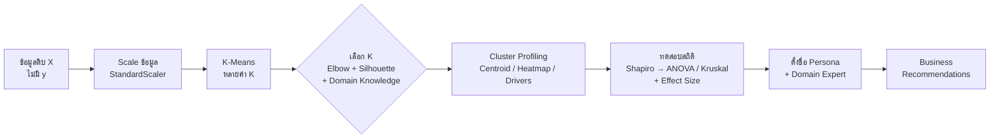
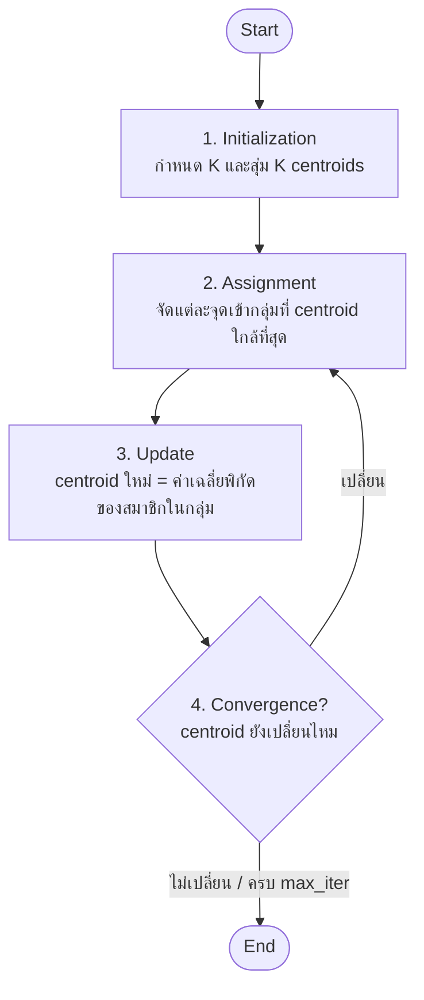
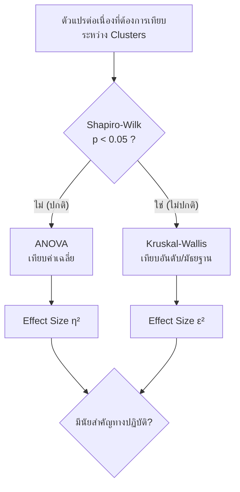
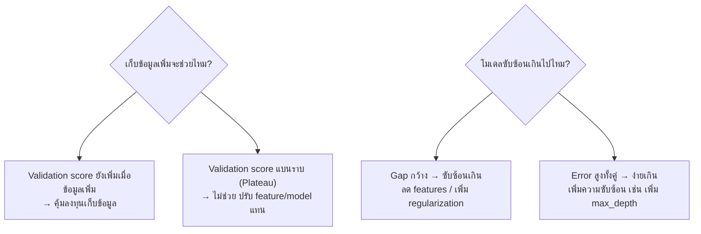

# 📘 สรุปเนื้อหาฉบับละเอียด: Decision Tree · Regression · Classification · Ensemble · Clustering · Model Validation

> [!info] แหล่งที่มาของเนื้อหา
> 1. สไลด์ *Introduction to AI – รู้จักปัญญาประดิษฐ์กับชีวิตประจำวัน (Decision Tree)* — U2T / มหาวิทยาลัยขอนแก่น
> 2. สไลด์ *Decision Tree* — อ.ธนพล ตั้งชูพงศ์ (อ้างอิง Datacamp, UW-Madison CS540, MIT 6.867, CMU)
> 3. ตำรา CP352101 Data Science — อ.ธนพล ตั้งชูพงศ์: บทที่ 8 Regression, บทที่ 9 Classification, บทที่ 10 Ensemble Methods, **บทที่ 11 Clustering**, **บทที่ 12 Model Validation และ Selection**
>
> เรียบเรียงใหม่ด้วยภาษาที่เข้าใจง่าย เพิ่มตัวอย่างคำนวณ ข้อสังเกตเมื่อโค้ด/ผลรันในต้นฉบับไม่ตรงกัน และแนวคำตอบคำถามท้ายหัวข้อ

> [!tip] วิธีอ่านใน Obsidian
> - เปิด **Outline** (แถบขวา) เพื่อกระโดดไปหัวข้อต่าง ๆ หรือคลิกลิงก์ในสารบัญด้านล่าง
> - กล่องที่มีลูกศร (เช่น 🧮 ตัวอย่างคำนวณ, คำถามท้ายบท) **คลิกเพื่อพับ/กาง** — ลองตอบเองก่อนเปิดดูเฉลย
> - สูตรแสดงผลด้วย LaTeX และแผนภาพ flowchart ใช้ Mermaid (รองรับใน Obsidian โดยไม่ต้องลงปลั๊กอิน)

## 🗂️ สารบัญ

- [[#ส่วนที่ 0 — ภาพรวม — ทุกเรื่องเชื่อมกันอย่างไร]]
- [[#ส่วนที่ 1 — AI กับการจำแนกสิ่งของในชีวิตประจำวัน]]
- [[#ส่วนที่ 2 — Decision Tree เชิงลึก (สไลด์บรรยาย)]]
- [[#ส่วนที่ 3 — บทที่ 8 Regression — การทำนายค่าต่อเนื่อง]]
- [[#ส่วนที่ 4 — บทที่ 9 Classification — การจำแนกประเภท]]
- [[#ส่วนที่ 5 — บทที่ 10 Ensemble Methods]]
- [[#ส่วนที่ 6 — บทที่ 11 Clustering การจัดกลุ่มข้อมูล]]
- [[#ส่วนที่ 7 — บทที่ 12 Model Validation และ Selection]]
- [[#ส่วนที่ 8 — สรุปรวบยอด สูตร และตารางเปรียบเทียบ (Cheat Sheet)]]
- [[#ส่วนที่ 9 — แนวคำตอบคำถามท้ายหัวข้อและแบบฝึกหัด]]

---

## ส่วนที่ 0 — ภาพรวม — ทุกเรื่องเชื่อมกันอย่างไร

```
Machine Learning
│
├── แบบมีผู้สอน (Supervised Learning) = มีข้อมูล X พร้อม "คำตอบ" y
│   ├── Regression (บทที่ 8)  → ทำนาย "ตัวเลขต่อเนื่อง" ... คำถามแบบ "เท่าไหร่?"
│   │     Linear / Multiple / Polynomial / Ridge / Lasso
│   ├── Classification (บทที่ 9 + สไลด์ทั้งสองชุด) → ทำนาย "หมวดหมู่" ... "อะไร? ใช่หรือไม่?"
│   │     Decision Tree / k-NN / Logistic Regression
│   └── Ensemble (บทที่ 10) → รวมหลายโมเดลให้เก่งขึ้น
│         Bagging (Random Forest) / Boosting (XGBoost, LightGBM, CatBoost) / Stacking
│
├── แบบไม่มีผู้สอน (Unsupervised Learning) = มีแค่ X
│   └── Clustering (บทที่ 11) → K-Means, เลือก K, Cluster Profiling, ทดสอบสถิติ, Persona
│
└── ใช้ได้กับทุกโมเดล: Model Validation & Selection (บทที่ 12)
      Cross-Validation / Hyperparameter Tuning / Pipeline กัน Data Leakage / Learning Curves
```

**เส้นเรื่องที่ควรจำ:**
1. คนเราจำแนกสิ่งของตามลักษณะเด่น (สี รูปทรง น้ำหนัก) → เราอยากสอนคอมพิวเตอร์ให้ทำแบบเดียวกัน
2. วิธีแรก: ถามผู้เชี่ยวชาญแล้วเขียนเป็นกฎ **If–Then** (Rule-based) → กฎเหล่านี้วาดเป็น **ต้นไม้ตัดสินใจ (Decision Tree)** ได้
3. วิธีที่สอง: ให้คอมพิวเตอร์ **สร้างต้นไม้เองจากข้อมูล** โดยเลือกคำถามที่ "ลดความกำกวม" ได้มากที่สุด วัดด้วย **Entropy / Information Gain / Gini**
4. Decision Tree ต้นเดียวมักจำข้อมูลมากเกินไป (**Overfitting**) → แก้ด้วยการตัดแต่ง (max_depth ฯลฯ) หรือใช้ **ป่า (Random Forest)** / **Boosting**
5. ทุกโมเดลต้องมีการ **วัดผล** ที่เหมาะกับงาน: Regression ใช้ MAE/MSE/RMSE/R²; Classification ใช้ Accuracy/Precision/Recall/F1
6. ถ้าไม่มีคำตอบ y เลย ใช้ **Clustering (K-Means)** หากลุ่ม แล้วต้อง **ตีความ (Profiling) + ทดสอบสถิติ + คุยกับ Domain Expert** จึงจะเกิดประโยชน์
7. สุดท้าย ประเมินและเลือกโมเดลอย่างน่าเชื่อถือด้วย **Cross-Validation, Hyperparameter Tuning, Pipeline (กัน Data Leakage) และ Learning Curves**

---

## ส่วนที่ 1 — AI กับการจำแนกสิ่งของในชีวิตประจำวัน

### 1.1 ปัญหาการจำแนกและรู้จำสิ่งของ (Classification and Recognition)

ตัวอย่างใกล้ตัว: **Google Lens** — ถ่ายรูปสุนัขแล้วแอปบอกได้ว่าเป็นพันธุ์พุดเดิ้ล นี่คือปัญหาการจำแนก (Classification) และรู้จำ (Recognition) ซึ่งเป็นปัญหาพื้นฐานที่สำคัญมากของ AI

การสร้าง AI เพื่อจำแนกข้อมูลทำได้ **2 แนวทางหลัก**

| แนวทาง | วิธีการ | ชื่อเรียก |
|---|---|---|
| 1. อาศัยความรู้ผู้เชี่ยวชาญ | ถามผู้เชี่ยวชาญว่าใช้หลักอะไรจำแนก แล้วให้โปรแกรมเมอร์แปลงเป็นขั้นตอนวิธี (อัลกอริทึม) | **Encoding Knowledge by Programmer** / Rule-based system |
| 2. เรียนรู้จากข้อมูลตัวอย่าง | ผู้ฝึกสอนเตรียมข้อมูลที่มีคุณลักษณะและคำตอบไว้ล่วงหน้า แล้วให้โปรแกรมเรียนรู้เอง เพื่อจำแนกข้อมูลใหม่ได้ | **Supervised Learning** |

### 1.2 แนวคิด: มนุษย์จำแนกของอยู่แล้วทุกวัน

- การจำแนกประเภท = การจัดสิ่งที่สนใจเข้ากลุ่ม ตาม **คุณลักษณะหรือคุณสมบัติ (Features and Attributes)** ที่เรากำหนด
- ตัวอย่าง: แม่ให้ไปตลาดซื้อ **กล้วยน้ำว้า** มาทำกล้วยบวชชี เราต้องแยกให้ออกว่ากล้วยไหนคือกล้วยน้ำว้า ไม่ใช่กล้วยหอม หรือแอปเปิล
- ปัญหาการจัดประเภทใน AI จึงคือ **"การสอนคอมพิวเตอร์ให้ทำสิ่งที่เราทำเป็นปกติ"** เช่น เห็นกล้วยแล้วตอบได้ว่า "กล้วยหอม"

> [!question]
> 💭 **คำถามชวนคิด:** เด็กเล็กเรียนรู้ว่า "นี่คือแอปเปิล" ได้อย่างไร? แล้วคอมพิวเตอร์จะรู้ได้อย่างไรว่าสิ่งนี้คือแอปเปิล ไม่ใช่ส้ม?
> คำตอบคือ ต้องบอกหรือให้มันค้นพบ **ลักษณะเด่น** ที่ใช้แยกแยะได้

### 1.3 กระบวนการสร้าง AI แบบอาศัยผู้เชี่ยวชาญ (Rule-based System) — 3 ขั้นตอน

```
① กำหนดปัญหา            ② สอบถามผู้เชี่ยวชาญ                  ③ แปลงความรู้เป็นอัลกอริทึม
 "อยากจำแนกแอปเปิล" ──►  • คุณลักษณะที่สำคัญคืออะไร?    ──►  กฎการตัดสินใจที่คอมพิวเตอร์
                          • ผู้เชี่ยวชาญใช้รูปแบบใดจำแนก?       เข้าใจได้ (If–Then)
```

### 1.4 คุณลักษณะเด่น (Features) ที่ผู้เชี่ยวชาญกำหนด — ตัวอย่างแอปเปิล

คุณลักษณะที่เป็นไปได้: **สี, รูปทรง, น้ำหนัก, ปริมาตร**

ความรู้จากผู้เชี่ยวชาญ (เช่น แม่ค้าผลไม้):

| คุณลักษณะ | ค่าที่เป็นลักษณะของแอปเปิล |
|---|---|
| สีผิว | สีแดง (โดยปกติ) |
| รูปทรง | ทรงกลม |
| น้ำหนักเฉลี่ย | 150 – 300 กรัม |
| เส้นผ่านศูนย์กลาง | 7 – 12 เซนติเมตร |

โปรแกรมเมอร์นำความรู้นี้ไปเขียนเป็นกฎ เช่น

```python
if color == "แดง" and shape == "กลม" and 150 <= weight <= 300 and 7 <= diameter <= 12:
    print("แอปเปิล")
else:
    print("ไม่ใช่แอปเปิล")
```

### 1.5 การแทนความรู้ด้วยกราฟ → Decision Tree

เพื่อให้คอมพิวเตอร์ประมวลผลได้ **และ** มนุษย์อ่านเข้าใจง่าย เราแทนกฎด้วย "กราฟรูปต้นไม้"

**กฎ 1 ชั้น**

```
ถ้าวัตถุ X มีคุณสมบัติ P1  → X อยู่กลุ่ม A            (P1?)
ถ้าไม่ใช่                   → X อยู่กลุ่ม B          ใช่/  \ไม่ใช่
                                                    A      B
```

**กฎซ้อนกัน 2 ชั้น (นี่คือ Decision Tree)**

```
ถ้า X มี P1 → กลุ่ม A                         (P1?)
ถ้าไม่ใช่:                                 ใช่/    \ไม่ใช่
    ถ้า X มี P2 → กลุ่ม B                   A     (P2?)
    ถ้าไม่ใช่   → กลุ่ม C                       ใช่/  \ไม่ใช่
                                                B      C
```

> [!important]
> 🔑 **ประเด็นสำคัญ:** กฎ If–Else ซ้อนกัน กับ ต้นไม้ตัดสินใจ คือ **สิ่งเดียวกัน** เขียนคนละรูปแบบ (แปลงไปกลับได้ ↔)

### 1.6 ตัวอย่าง: ต้นไม้ตัดสินใจจำแนกผลไม้ 5 ชนิด

ผลไม้: **แอปเปิล, เชอร์รี, เงาะ, มังคุด, กล้วย**

**ต้นไม้ A (จากสไลด์)**

```
                    [ผิวสีแดง?]
                 ใช่ /          \ ไม่ใช่
          [ผิวมีขน?]            [ผิวสีเหลือง?]
        ใช่ /     \ ไม่ใช่        ใช่ /     \ ไม่ใช่
       เงาะ   [น้ำหนัก > 50 g?]    กล้วย    มังคุด
               ใช่ /    \ ไม่ใช่
              แอปเปิล   เชอร์รี
```

**นิยาม:** ต้นไม้การตัดสินใจเป็นอัลกอริทึมพื้นฐานที่เข้าใจง่าย ช่วยวิเคราะห์เหตุการณ์หรือสถานการณ์เพื่อการตัดสินใจ

### 1.7 สร้างต้นไม้จาก "ฐานข้อมูลฝึกสอน" ได้ไหม?

ต้นไม้ตัดสินใจมีได้ 2 แหล่ง:
1. **ต้นไม้จากผู้เชี่ยวชาญ** (คนออกแบบเอง)
2. **ต้นไม้ที่สร้างจากฐานข้อมูลฝึกสอน** (คอมพิวเตอร์สร้างเองอัตโนมัติ) ← เป้าหมายของ Machine Learning

ข้อมูลฝึกสอนตัวอย่าง (ขยายเป็น 7 แถวในสไลด์ถัดมา):

| ผลไม้ | สี | ลักษณะผิว | น้ำหนัก (g) |
|---|---|---|---|
| 🍒 เชอร์รี | แดง | เรียบ | 10 |
| 🍒 เชอร์รี | แดง | เรียบ | 12 |
| เงาะ | แดง | มีขน | 40 |
| 🍎 แอปเปิล | แดง | เรียบ | 350 |
| 🍌 กล้วย | เหลือง | เรียบ | 270 |
| มังคุด | ม่วง | เรียบ | 310 |
| 🍌 กล้วย | เหลือง | เรียบ | 315 |

### 1.8 แนวคิดของขั้นตอนวิธีสร้างต้นไม้: "โปรเจคข้อมูลลงบนแกนคุณลักษณะ"

มองว่า **แต่ละคุณลักษณะ = แกนหนึ่งของระนาบ** แล้ววางผลไม้แต่ละลูกลงบนระนาบนั้น จากนั้น "ขีดเส้นแบ่ง" ตามค่าของคุณลักษณะทีละขั้น

| ขั้น | แกนที่ใช้ | เส้นแบ่ง | ผลที่ได้ | โหนดในต้นไม้ |
|---|---|---|---|---|
| 1 | สี | แดง / ไม่แดง | ฝั่งแดง: แอปเปิล+เชอร์รี+เงาะ (ยังปนกัน), ฝั่งไม่แดง: กล้วย+มังคุด | ผิวสีแดง? |
| 2 | สี (เฉพาะกลุ่มไม่แดง) | เหลือง / ไม่เหลือง | กล้วย แยกออกจาก มังคุด ได้สมบูรณ์ | ผิวสีเหลือง? |
| 3 | ลักษณะผิว (เฉพาะกลุ่มแดง) | มีขน / ไม่มีขน | เงาะ แยกออกมาได้, ที่เหลือแอปเปิล+เชอร์รี | ผิวมีขน? |
| 4 | น้ำหนัก (เฉพาะแดง+ไม่มีขน) | > 50 g / ≤ 50 g | แอปเปิล (หนัก) แยกจาก เชอร์รี (เบา) | น้ำหนัก > 50g? |

ภาพรวมในพื้นที่ 3 มิติ (สี × ลักษณะผิว × น้ำหนัก) คือพื้นที่ถูกตัดเป็น "กล่อง" ที่แต่ละกล่องมีผลไม้ชนิดเดียว

> [!tip]
> 💡 **สังเกต:** การแบ่งแต่ละครั้งทำ **ทีละแกน** และ **ขนานกับแกน** เสมอ (axis-aligned) นี่คือเหตุผลที่ขอบเขตการตัดสินใจของ Decision Tree มีลักษณะเป็น "ขั้นบันได/มุมฉาก"

### 1.9 คำถามที่น่าสนใจ ①: ต้นไม้ที่สร้างได้มีแบบเดียวหรือไม่?

**ไม่** — มีได้หลายแบบ ขึ้นอยู่กับว่า **เลือกถามคุณลักษณะใดก่อน**

**ต้นไม้ B** (ถามสีเหลืองก่อน)

```
               [ผิวสีเหลือง?]
             ใช่ /        \ ไม่ใช่
           กล้วย       [ผิวสีแดง?]
                     ใช่ /      \ ไม่ใช่
                 [ผิวมีขน?]     มังคุด
                ใช่ /   \ ไม่ใช่
               เงาะ   [น้ำหนัก > 50g?]
                      ใช่ /    \ ไม่ใช่
                     แอปเปิล   เชอร์รี
```

### 1.10 คำถามที่น่าสนใจ ②: ต้นไม้แบบไหนดีกว่า?

ต้นไม้ที่ดีควรมี:
1. **ความถูกต้องโดยเฉลี่ยของการตัดสินใจสูง**
2. **ความรวดเร็วในการตัดสินใจ** (ถามน้อยข้อแล้วได้คำตอบ)

**🧮 ลองคำนวณเปรียบเทียบ A vs B** (สมมติผลไม้ 5 ชนิดพบบ่อยเท่ากัน) — นับจำนวนคำถามที่ต้องถามกว่าจะถึงคำตอบ

| ผลไม้ | จำนวนคำถาม ต้นไม้ A | จำนวนคำถาม ต้นไม้ B |
|---|---|---|
| เงาะ | 2 | 3 |
| แอปเปิล | 3 | 4 |
| เชอร์รี | 3 | 4 |
| กล้วย | 2 | 1 |
| มังคุด | 2 | 2 |
| **เฉลี่ย** | **12/5 = 2.4 คำถาม** | **14/5 = 2.8 คำถาม** |

ทั้งสองต้นจำแนกถูก 100% แต่ **ต้นไม้ A เร็วกว่าโดยเฉลี่ย** (ถ้าใช้ข้อมูล 7 แถวในตาราง ที่มีเชอร์รีและกล้วยอย่างละ 2 ลูก: A เฉลี่ย 17/7 ≈ 2.43, B เฉลี่ย 19/7 ≈ 2.71 — A ก็ยังดีกว่า)

> [!note]
> ถ้ากล้วยพบบ่อยมาก ๆ (เช่น 90% ของผลไม้ในตลาด) ต้นไม้ B ที่ถามสีเหลืองก่อนอาจเร็วกว่า → **ต้นไม้ที่ดีขึ้นกับการกระจายตัวของข้อมูลจริง**

### 1.11 หลักการให้ AI สร้างต้นไม้เอง

- โปรเจคข้อมูลลงแกนคุณลักษณะ แล้วให้อัลกอริทึม **เลือกคุณลักษณะ (Variable / Feature) ที่ลดความกำกวมในการแบ่งข้อมูลได้มากที่สุด** มาเป็นคำถามแรก ๆ
- ต้องนิยาม "ตัววัด" เพื่อให้ AI จัดลำดับความสำคัญของคุณลักษณะได้ ได้แก่ **Information Gain** และ **Gini score** (อธิบายละเอียดในส่วนที่ 2)

**🧮 ตัวอย่างคำนวณจริงกับข้อมูลผลไม้ 7 แถว** (ใช้ Entropy ซึ่งจะอธิบายในหัวข้อ 2.9)

- Entropy ก่อนแบ่ง (เชอร์รี 2, เงาะ 1, แอปเปิล 1, กล้วย 2, มังคุด 1) ≈ **2.236 bits**

| คำถามแรกที่เป็นไปได้ | Information Gain |
|---|---|
| สีแบบ 3 ทาง (แดง / เหลือง / ม่วง) | **≈ 1.379** (สูงสุด) |
| ผิวสีแดง? (ใช่/ไม่ใช่) | ≈ 0.985 |
| น้ำหนัก > 50 g? | ≈ 0.985 |
| ผิวสีเหลือง? | ≈ 0.863 |
| ผิวมีขน? | ≈ 0.592 (ต่ำสุด) |

ผลนี้ยืนยันว่า **"สี" เป็นคำถามที่ควรถามก่อน** และถ้าจำกัดให้แบ่งแค่ 2 ทาง "สีแดง?" ดีกว่า "สีเหลือง?" → สอดคล้องกับว่าต้นไม้ A ดีกว่าต้นไม้ B

---
## ส่วนที่ 2 — Decision Tree เชิงลึก (สไลด์บรรยาย)

**โครงร่างบทเรียน (Outline):** What is Decision Tree? → Decision Tree Algorithm → Attribute Selection Measures → Optimizing Decision Tree Performance → Decision Tree by Scikit-learn → Pros vs Cons → Conclusion
(สไลด์ชุดนี้สอนถึง Attribute Selection Measures ส่วนที่เหลือ "Next time" — เนื้อหาเหล่านั้นมีในบทที่ 9–10 ของตำรา ซึ่งสรุปไว้ในส่วนที่ 4–5)

### 2.1 Decision Tree คืออะไร?

- เป็นอัลกอริทึม **Supervised Learning** (เรียนรู้จากข้อมูลที่มีคำตอบ)
- ใช้ได้ทั้ง **Classification** (ทำนายหมวดหมู่) และ **Regression** (ทำนายตัวเลข)
- เป็น **โมเดลแบบกฎ (Rule-based model)** ที่สร้างจากการ "สรุปรวม" (generalize) ค่าของ features เพื่อทำนายค่าเป้าหมาย — โครงสร้างคือ **If–Else**
- **แนวคิดหลัก:** สร้างต้นไม้ (ชุดกฎ) โดย **ลดความไม่แน่นอน (uncertainty)** ของค่าที่ทำนาย **โดยไม่ให้เกิด Overfitting**

**Decision Tree เป็นตัวอย่างง่าย ๆ ของ Inductive Learning** (การค้นพบกฎจากการสังเกตตัวอย่าง)

```
 training examples ──►  model {θ1,...,θn}  ──►  class prediction
 testing examples  ──┘
```

- เรียนรู้ต้นไม้จาก **training examples**
- ทำนายคลาสของ **testing examples** ที่ไม่เคยเห็น
- **Generalization (การวางนัยทั่วไป)** = ทำได้ดีแค่ไหนกับ testing examples
- ใช้ได้ผล **ก็ต่อเมื่อเรียนรู้โครงสร้างที่แท้จริงของข้อมูล (underlying structure) ได้**

### 2.2 ศัพท์ของ Decision Tree (Terminology)

ตัวอย่าง: ตัดสินใจว่าวันนี้จะทำอะไร

```
                 [Work to do?]              ← Root node (โหนดราก)
               Yes /        \ No
            Stay in      [Outlook?]          ← Internal node (โหนดภายใน)
                     Sunny/  |Overcast \Rainy   ← Branch (กิ่ง)
               Go to beach  Go running  [Friends busy?]
                                        Yes /    \ No
                                     Stay in   Go to movies   ← Leaf node (โหนดใบ)
```

| ศัพท์ | ความหมาย |
|---|---|
| **Root node** | โหนดบนสุด คำถามแรก |
| **Internal node** | โหนดคำถามระหว่างทาง (เงื่อนไขแบ่งข้อมูล) |
| **Branch** | เส้นเชื่อม = คำตอบ/ค่าของ attribute |
| **Leaf node** | โหนดปลายทาง = คำตอบสุดท้าย (class label) |

### 2.3 Decision Tree ในรูปชุดกฎ (Rulesets)

**ทุกเส้นทางจาก Root → Leaf = 1 กฎ** เช่นเส้นทางที่วงไว้ในสไลด์:

```
IF   Work to do? = No   AND   Outlook? = Rainy
     AND   Friends busy? = Yes
THEN Decision = Stay in
```

ต้นไม้นี้มี Leaf 6 ใบ → แปลงเป็นกฎได้ 6 ข้อ

### 2.4 ตัวอย่างหลัก: ทำนายความเสี่ยงเครดิต (Predicting Credit Risk)

| # | < 2 years at current job? | missed payments? | defaulted? |
|---|---|---|---|
| 1 | N | N | N |
| 2 | Y | N | **Y** |
| 3 | N | N | N |
| 4 | N | N | N |
| 5 | N | Y | **Y** |
| 6 | Y | N | N |
| 7 | N | Y | N |
| 8 | N | Y | **Y** |
| 9 | Y | N | N |
| 10 | Y | N | N |

รวม: ผิดนัด (defaulted=Y, "bad") 3 ราย, ไม่ผิดนัด ("good") 7 ราย

**Scatter plot** แบ่งพื้นที่เป็น 4 ช่อง (ทำงาน<2ปี?, ขาดชำระ?):

| ช่อง | ผู้กู้ | ผิดนัด |
|---|---|---|
| (No, No) | 1, 3, 4 | ไม่มี |
| (Yes, No) | 2, 6, 9, 10 | 2 |
| (No, Yes) | 5, 7, 8 | 5, 8 |
| (Yes, Yes) | – | – |

**ข้อสังเกต:**
- **แต่ละระดับของต้นไม้แบ่งข้อมูลด้วย attribute ที่ต่างกัน**
- **ลำดับของ attribute มีผลต่อประสิทธิภาพ!** แบ่งด้วย "missed payments" ก่อน ได้กลุ่มที่แยกกันชัดกว่าแบ่งด้วย "<2 years" ก่อน

**ต้นไม้ที่สอดคล้อง (Corresponding Tree):**

```
            [bad:3, good:7]
         N / missed payments? \ Y
   [bad:1, good:6]          [bad:2, good:1]
   N / <2 years? \ Y
[bad:0,good:3] [bad:1,good:3]
```

กฎ (RULE) ที่อ่านได้ เช่น
- IF missed = Y THEN defaulted = Y (ส่วนใหญ่ 2 ใน 3)
- IF missed = N AND <2 years = N THEN defaulted = N (ถูกทั้งหมด)
- IF missed = N AND <2 years = Y THEN defaulted = N (ส่วนใหญ่ 3 ใน 4)

**เป้าหมาย:** จำแนกได้ **สมบูรณ์ (perfect classification)** ด้วย **จำนวนการตัดสินใจน้อยที่สุด**
**แต่ไม่ใช่ทำได้เสมอ** เพราะ **noise หรือข้อมูลขัดแย้งกัน** — ดูแถว 7 กับ 8: ค่า feature เหมือนกันทุกอย่าง (N, Y) แต่คำตอบต่างกัน (N กับ Y) จึงไม่มีต้นไม้ใดแยกได้ 100%

### 2.5 Decision Tree กับค่าต่อเนื่อง (Continuous Values)

| years at current job | # missed payments | defaulted? |
|---|---|---|
| 7 | 0 | N |
| 0.75 | 0 | Y |
| 3 | 0 | N |
| 9 | 0 | N |
| 4 | 2 | Y |
| 0.25 | 0 | N |
| 5 | 1 | N |
| 8 | 4 | Y |
| 1.0 | 0 | N |
| 1.75 | 0 | N |

**จะแบ่งอย่างไร?** ใช้ **เกณฑ์ (threshold)** เช่น
- `# missed payments > 1.5` → แยกกลุ่มผิดนัด (2 และ 4 ครั้ง) ออกมาได้
- ในกลุ่มที่เหลือ `years at current job ≤ 1` → ช่วยแยกกรณี 0.75 ปีที่ผิดนัด (แต่ยังปนกับ 0.25 และ 1.0 ที่ไม่ผิดนัด)

```
         [# missed > 1.5 ?]
        Yes /          \ No
   defaulted=Y     [years ≤ 1 ?]
                  Yes /      \ No
            (ปนกัน 1Y:2N)   defaulted=N
```

> [!tip]
> **เคล็ดลับ (Fayyad, 1992):** จุดแบ่งที่ดีที่สุดสำหรับค่าต่อเนื่องจะอยู่ที่ **รอยต่อระหว่างตัวอย่างที่อยู่ติดกัน (เมื่อเรียงค่าแล้ว) แต่มีคลาสต่างกัน** → ไม่ต้องลองทุกค่า ลองแค่จุดกึ่งกลางของรอยต่อเหล่านี้

### 2.6 Decision Tree กับหมวดหมู่ของ ML

| มิติ | Decision Tree อยู่ฝั่งไหน |
|---|---|
| Supervised vs Unsupervised | **Supervised** |
| Classification vs Regression | **ทำได้ทั้งคู่** |
| Optimization method | **Greedy search** (เลือกจุดแบ่งที่ดีที่สุดทีละขั้น ไม่ย้อนกลับ — ใช้ Information Gain/Gini เป็นเกณฑ์) |
| Eager vs Lazy | **Eager** (สร้างโมเดลเสร็จตอน train; ต่างจาก k-NN ที่เป็น Lazy) |
| Batch vs Online | **Batch** (ใช้ข้อมูลทั้งหมดพร้อมกันตอนสร้าง) |
| Parametric vs Nonparametric | **Nonparametric** (จำนวน/โครงสร้างโหนดโตตามข้อมูล ไม่ได้กำหนดตายตัว) |
| Deterministic vs Stochastic | **Deterministic** (ข้อมูลเดิมได้ต้นไม้เดิม; ยกเว้นกรณีสุ่มแก้ค่าเสมอกัน) |

### 2.7 การเลือก Attribute (Choosing the attributes)

- **จะหาต้นไม้ที่สอดคล้องกับข้อมูลฝึกสอนได้อย่างไร?**
- วิธีมักง่าย: สร้างต้นไม้ที่มี 1 เส้นทางต่อ 1 ตัวอย่าง → **แค่ท่องจำ (memorize)** ไม่ generalize กับตัวอย่างใหม่
- ในอุดมคติ attribute ที่ดีที่สุดจะแบ่งข้อมูลเป็นกลุ่ม positive และ negative ได้ขาด
- **กลยุทธ์แบบโลภ (Greedy):** เลือก attribute ที่แบ่งได้ดีที่สุด **ก่อน**
- เป้าหมาย: **จำแนกถูกต้องด้วยจำนวนการทดสอบ (คำถาม) น้อยที่สุด**

### 2.8 พื้นฐานอัลกอริทึม: Recursion และ Divide & Conquer

การสร้างต้นไม้เป็น **อัลกอริทึมเวียนเกิด (Recursive)** แบบ **แบ่งแยกและเอาชนะ (Divide & Conquer)**

**Recursion ตัวอย่าง**

```python
def some_func(x):
    if x == []:
        return 0
    else:
        return 1 + some_func(x[1:])
```
**ฟังก์ชันนี้ทำอะไร?** → **นับจำนวนสมาชิกในลิสต์** (ความยาวของลิสต์) โดยตัดตัวแรกออกทีละตัวแล้วบวก 1 จนลิสต์ว่าง (กรณีฐาน)

**Divide & Conquer ตัวอย่าง: Quicksort**

```python
def quicksort(array):
    if len(array) < 2:          # กรณีฐาน
        return array
    else:
        pivot = array[0]
        smaller, bigger = [], []
        for ele in array[1:]:   # แบ่ง (divide)
            if ele <= pivot: smaller.append(ele)
            else:            bigger.append(ele)
        return quicksort(smaller) + [pivot] + quicksort(bigger)  # เอาชนะแล้วรวม
```
ตัวอย่าง `[5,8,1,3,7,9,2]` → pivot 5 → `[1,3,2]` + 5 + `[8,7,9]` → เรียงต่อย่อย ๆ → `[1,2,3,5,7,8,9]`

- **Time complexity ของ quicksort:** **O(n log n) โดยเฉลี่ย** (แย่สุด O(n²) เมื่อ pivot แย่ เช่นอาร์เรย์เรียงกลับด้าน)
- ตาราง Big-O cheat sheet: Mergesort/Heapsort O(n log n) ทุกกรณี, Bubble/Insertion/Selection O(n²) เฉลี่ย, Counting/Radix sort O(n+k)/O(nk)

**ความเชื่อมโยงกับ Decision Tree:** แต่ละโหนด "แบ่ง" ข้อมูลเป็นกลุ่มย่อย แล้ว "เรียกซ้ำ" สร้างต้นไม้ย่อยจากกลุ่มนั้น — เหมือน quicksort ที่แบ่งตาม pivot

**Time Complexity ของ Decision Tree** (n = จำนวนตัวอย่าง, m = จำนวน features)
- **การสร้างต้นไม้ (Growing):** ที่แต่ละระดับต้องลองทุก feature และต้องเรียงค่าต่อเนื่องเพื่อหาจุดแบ่ง ≈ O(m · n log n) ต่อระดับ; ถ้าต้นไม้สมดุลลึก ~log n ระดับ โดยรวมประมาณ **O(m · n log² n)** หรือเขียนหยาบ ๆ ว่า O(m · n log n) เมื่อเรียงล่วงหน้า
- **การถามต้นไม้ (Querying/Predict):** เดินจาก root ถึง leaf = **O(ความลึก)** ≈ **O(log n)** สำหรับต้นไม้ที่สมดุล (แย่สุด O(n) ถ้าต้นไม้เบี้ยว) → **ทำนายเร็วมาก**

### 2.9 อัลกอริทึมสร้างต้นไม้แบบทั่วไป (Generic Tree Growing Algorithm)

1. เลือก feature ที่เมื่อแบ่ง parent node แล้วได้ **Information Gain มากที่สุด**
2. **หยุด** ถ้า child nodes บริสุทธิ์ (pure) แล้ว หรือ Information Gain ≤ 0
3. วนกลับไปทำข้อ 1 กับ child node แต่ละโหนด

- **ถ้า features ในข้อมูลไม่พอที่จะทำให้ child nodes บริสุทธิ์ จะทำนายอย่างไร?** → ใช้ **เสียงข้างมาก (Majority vote)** ของคลาสใน leaf นั้น (สำหรับ regression ใช้ค่าเฉลี่ย)

**Pseudocode (feature แบบไบนารี 0/1)**

```
GenerateTree(D):
    if  y = 1 สำหรับทุก (x, y) ใน D   หรือ   y = 0 สำหรับทุก (x, y) ใน D:
        return Tree (leaf ที่มีคลาสนั้น)
    else:
        เลือก feature ที่ดีที่สุด x_j
            D0 ที่ Child0 : ตัวอย่างที่ x_j = 0
            D1 ที่ Child1 : ตัวอย่างที่ x_j = 1
        return Node(x_j, GenerateTree(D0), GenerateTree(D1))
```

### 2.10 ทางเลือกในการออกแบบ (Design choices)

**จะแบ่งอย่างไร (How to split)**
- ใช้ตัววัดอะไรเป็นเกณฑ์ความดี (Information Gain, Gini, Gain Ratio ฯลฯ)
- แบ่ง 2 ทาง (binary) หรือหลายทาง (multi-category)

**จะหยุดเมื่อไร (When to stop)**
- leaf มีแต่ตัวอย่างคลาสเดียวกัน
- ค่า feature ของทุกตัวอย่างเหมือนกันหมด (แบ่งต่อไม่ได้)
- การทดสอบนัยสำคัญทางสถิติ (statistical significance test) บอกว่าไม่คุ้มแบ่งต่อ

### 2.11 อัลกอริทึม Decision Tree ที่สำคัญ

| อัลกอริทึม | ผู้พัฒนา/ปี | ลักษณะเด่น | ข้อจำกัด / หมายเหตุ |
|---|---|---|---|
| **ID3** (Iterative Dichotomizer 3) | Quinlan, 1986 | หนึ่งในอัลกอริทึมแรก ๆ; **maximize Information Gain / minimize Entropy**; รองรับ feature แบบ discrete ทั้ง binary และหลายหมวด; ต้นไม้ **เตี้ยและกว้าง** | **ใช้ feature ตัวเลขไม่ได้**, **ไม่มี pruning → Overfit ง่าย** |
| **C4.5** | Quinlan, 1993 | รองรับทั้ง **continuous และ discrete**; **จัดการ missing values** (ไม่นับในการคำนวณ gain); **post-pruning** (ตัดจากล่างขึ้นบน); ใช้ **Gain Ratio** | feature ต่อเนื่อง **คำนวณแพง** เพราะต้องพิจารณาทุกช่วงที่เป็นไปได้ |
| **CART** (Classification And Regression Trees) | Breiman, 1984 | continuous และ discrete; **แบ่ง 2 ทางเสมอ (strictly binary)** → ต้นไม้สูงกว่า ID3/C4.5; ใช้ **Gini impurity** (หรือ twoing) สำหรับ classification, **variance reduction** สำหรับ regression; **cost complexity pruning** | binary split มักได้ต้นไม้ดีกว่า C4.5 แต่ **ใหญ่และตีความยากกว่า** (**scikit-learn ใช้แนวทาง CART**) |
| **CHAID** | Kass, 1980 | ใช้การทดสอบ Chi-squared, เหมาะกับข้อมูลเชิงหมวดหมู่จำนวนมาก | – |
| **MARS** | Friedman, 1991 | Multivariate Adaptive Regression Splines | – |
| **C5.0** | – | รุ่นพัฒนาต่อของ C4.5 | จดสิทธิบัตร (patented) |

### 2.12 เลือก feature ที่ดีที่สุดอย่างไร? → ทฤษฎีสารสนเทศ (Information Theory)

**ความคิด:** attribute หนึ่งให้ "ข้อมูล" เกี่ยวกับคลาสมากแค่ไหน?
- attribute ที่แบ่งได้สมบูรณ์ → ให้ข้อมูล **สูงสุด**
- attribute ที่ไม่เกี่ยวข้อง → ให้ข้อมูล **เป็นศูนย์**

#### (ก) Information ของสัญลักษณ์ w

$$I(w) = -\log_2 P(w)$$

- P(w) = 1/2 → I(w) = 1 bit
- P(w) = 1/4 → I(w) = 2 bits
- **เหตุการณ์ยิ่งเกิดยาก (P น้อย) ยิ่ง "น่าแปลกใจ" = ให้ข้อมูลมาก**

#### (ข) Entropy = ค่าเฉลี่ยของ Information

$$H(X) = \sum_x P(x)I(x) = -\sum_x P(x)\log_2 P(x)$$

- H(X) **ขึ้นกับความน่าจะเป็นเท่านั้น ไม่ขึ้นกับค่า**
- H(X) วัด **ความไม่แน่นอนของข้อมูล** เป็นหน่วย bit
- H(X) เป็น **ขอบล่างของจำนวน bit** ที่ต้องใช้เข้ารหัส/อธิบาย X

ตัวอย่างโยนเหรียญ:
- P(หัว) = 1/2 → H = −½log₂½ − ½log₂½ = **1 bit** (ไม่แน่นอนที่สุด)
- P(หัว) = 1/3 → H = −⅓log₂⅓ − ⅔log₂⅔ = **0.9183 bits**

**Entropy ของตัวแปรไบนารี:** เป็นกราฟรูประฆังคว่ำ
- **สูงสุด = 1 ที่ p = 0.5** (ครึ่งต่อครึ่ง ปนกันที่สุด)
- **เป็นศูนย์ที่ p = 0 หรือ p = 1** (บริสุทธิ์ รู้คำตอบแน่นอน)

**ตัวอย่างภาษาอังกฤษ (A–Z + space):**
- สุ่มตัวอักษรแบบเท่ากันหมด H ≈ 4.76 bits/ตัวอักษร (ข้อความอ่านไม่ออก)
- ความถี่ตัวอักษรเหมือนภาษาอังกฤษจริง H ≈ 4.03 bits/ตัวอักษร
- ตัวอักษรขึ้นกับ 3 ตัวก่อนหน้า H ≈ 2.8 bits/ตัวอักษร (เริ่มเหมือนคำจริง)
- 👉 **Entropy สูงขึ้นเมื่อข้อมูลมีระเบียบน้อยลง**

#### (ค) กลับไปที่ Credit Risk

$$H(Y) = -0.3\log_2 0.3 - 0.7\log_2 0.7 = 0.8813 \text{ bits}$$

คำถาม: รู้ attribute อื่นแล้ว **ลด** entropy (ความไม่แน่นอน) ของ "defaulted" ได้เท่าไร? ถ้าลดได้ถึง 0 = จำแนกได้สมบูรณ์

#### (ง) Conditional Entropy (เอนโทรปีมีเงื่อนไข)

H(Y|X) = entropy ที่ **เหลืออยู่** ของ Y เมื่อรู้ X แล้ว = ค่าเฉลี่ยถ่วงน้ำหนักของ entropy ในแต่ละกลุ่มย่อย

$$H(Y|X) = -\sum_x P(x)\sum_y P(y|x)\log_2 P(y|x) = \sum_x P(x)\,H(Y|X=x)$$

H(Y|X=x) เรียกว่า **specific conditional entropy** (entropy ของ Y เมื่อรู้ค่า x เฉพาะค่าหนึ่ง)

> [!warning]
> ⚠️ หมายเหตุ: บรรทัดสุดท้ายของสูตรในสไลด์เขียนเครื่องหมายลบและ Σ_y ซ้ำ ซึ่งเป็นการพิมพ์คลาดเคลื่อน รูปที่ถูกต้องคือ Σₓ P(x)·H(Y|X=x) ตามด้านบน

#### (จ) คำนวณทีละขั้นกับข้อมูลเครดิต

**Attribute 1: < 2 years at current job**

| กลุ่ม | จำนวน | ผิดนัด (Y) : ไม่ผิดนัด (N) | Entropy |
|---|---|---|---|
| <2yrs = N | 6 | 2 : 4 | −(4/6)log₂(4/6) − (2/6)log₂(2/6) = **0.9183** |
| <2yrs = Y | 4 | 1 : 3 | −(3/4)log₂(3/4) − (1/4)log₂(1/4) = **0.8113** |

H(defaulted | <2yrs) = (6/10)(0.9183) + (4/10)(0.8113) = **0.8755**

**Attribute 2: missed payments**

| กลุ่ม | จำนวน | Y : N | Entropy |
|---|---|---|---|
| missed = N | 7 | 1 : 6 | −(6/7)log₂(6/7) − (1/7)log₂(1/7) = **0.5917** |
| missed = Y | 3 | 2 : 1 | −(1/3)log₂(1/3) − (2/3)log₂(2/3) = **0.9183** |

H(defaulted | missed) = (7/10)(0.5917) + (3/10)(0.9183) = **0.6897**

> [!warning]
> ⚠️ ในสไลด์เขียนค่า 0.8133 และ 0.8763 (และติดป้ายบรรทัดว่า "missed" แทน "<2years") ค่าที่คำนวณได้จริงคือ 0.8113 และ 0.8755 — ต่างกันเล็กน้อย **ไม่เปลี่ยนข้อสรุป**

#### (ฉ) Mutual Information และ Information Gain

**Mutual Information** = entropy ที่ลดลงหลังจากรู้ X

$$I(Y;X) = H(Y) - H(Y|X)$$

ในบริบท Decision Tree เรียกว่า **Information Gain (IG)**

| Attribute | IG = H(defaulted) − H(defaulted \| attr) |
|---|---|
| < 2 years | 0.8813 − 0.8755 ≈ **0.006** (สไลด์: 0.0050) |
| **missed payments** | 0.8813 − 0.6897 = **0.1916** ✅ |

👉 **Missed payments เป็น attribute ที่ให้ข้อมูลเกี่ยวกับการผิดนัดมากที่สุด → เลือกเป็น Root node**

**แผนภาพเวนน์:** วงกลม H(X) และ H(Y) ซ้อนกัน ส่วนที่ทับกันคือ I(X;Y) ส่วนที่เหลือของแต่ละวงคือ H(X|Y) และ H(Y|X) ทั้งหมดรวมกันคือ H(X,Y)

**คุณสมบัติของ Mutual Information**
- **สมมาตร:** I(Y;X) = I(X;Y)
- ในรูปการแจกแจงความน่าจะเป็น: I(X;Y) = Σ P(x,y) log₂ [P(x,y) / (P(x)P(y))] (ในสไลด์มีเครื่องหมายลบนำหน้า ซึ่งควรไม่มี — รูปที่ถูกต้องให้ค่า ≥ 0)
- **I(X;Y) = 0 ⇔ X และ Y เป็นอิสระต่อกัน** (รู้อันหนึ่งไม่ช่วยทำนายอีกอัน)
- **ถ้า Y = X:** I(X;X) = H(X) − H(X|X) = H(X)

#### (ช) ตัววัดอีกแบบ: Gini Impurity (ใช้ใน CART / scikit-learn ค่าเริ่มต้น)

$$Gini = 1 - \sum_{i=1}^{C} p_i^2$$

- โหนดบริสุทธิ์ → Gini = 0; ไบนารีปน 50:50 → Gini = 0.5 (สูงสุดของ 2 คลาส)
- คำนวณเร็วกว่า Entropy (ไม่มี log) และมักได้ต้นไม้ใกล้เคียงกัน
- ตัวอย่างข้อมูลเครดิตทั้งชุด (3:7): Gini = 1 − (0.3² + 0.7²) = 0.42

### 2.13 ตัวอย่างใหญ่: ทำนาย miles per gallon (Andrew Moore)

ข้อมูลรถยนต์ 40 คัน attributes: cylinders, displacement, horsepower, weight, acceleration, modelyear, maker → เป้าหมาย mpg = good / bad

**ขั้นที่ 1: คำนวณ Information Gain ทุก attribute**

| Attribute | Info Gain |
|---|---|
| **cylinders** | **0.5067** ← สูงสุด เพราะเกือบแบ่งข้อมูลได้ขาด |
| horsepower | 0.3876 |
| weight | 0.3040 |
| modelyear | 0.2680 |
| displacement | 0.2231 |
| acceleration | 0.0642 |
| maker | 0.0437 |

**ขั้นที่ 2: แบ่งที่ root ด้วย cylinders** (root: bad 22, good 18)

| cylinders | bad | good | ทำนาย |
|---|---|---|---|
| 3 | 0 | 0 | bad (ไม่มีข้อมูล → ใช้เสียงข้างมากของ parent) |
| 4 | 4 | 17 | good |
| 5 | 1 | 0 | bad |
| 6 | 8 | 0 | bad |
| 8 | 9 | 1 | bad |

> [!note]
> สังเกต: การกระจายคลาสในแต่ละกิ่ง **เอียงข้าง (lopsided)** มาก = แบ่งได้ดี

**ขั้นที่ 3: เรียกซ้ำ (Recurse)** — นำข้อมูลเดิมมาแบ่งตามค่า cylinders แล้ว **สร้างต้นไม้จากข้อมูลย่อยแต่ละกลุ่ม ด้วยวิธีเดิมทุกประการ** แค่ข้อมูลเล็กลงและถูกกำหนดเงื่อนไขแล้ว
- cylinders=4 → แบ่งต่อด้วย maker (america 0:10 → good, asia 2:5, europe 2:2)
- cylinders=8 → แบ่งต่อด้วย horsepower (low 0:0, medium 0:1 → good, high 9:0 → bad)

**ทำไมไม่ขยายโหนด cylinders=5 และ 6?** → เพราะ **บริสุทธิ์แล้ว** (มีแต่ bad) ขยายต่อไม่ได้ประโยชน์ (เงื่อนไขหยุด)

**ต้นไม้สุดท้าย** ลึกประมาณ 4 ระดับ มีโหนด "(unexpandable)" คือ horsepower=medium → acceleration=medium มี bad 1 good 1 ซึ่ง **แบ่งต่อไม่ได้เพราะ feature หมดหรือค่าเหมือนกัน** → ทำนายตามเสียงข้างมาก/ค่าเริ่มต้น

> [!note]
> ค่า `pchance` ในภาพ = ความน่าจะเป็นที่การแบ่งนั้นเกิดโดยบังเอิญ (จากการทดสอบทางสถิติ) ค่าน้อย = การแบ่งมีความหมายจริง ใช้เป็นเกณฑ์หยุด/ตัดแต่งต้นไม้ได้

### 2.14 สิ่งที่สไลด์นัดไว้ครั้งหน้า + แหล่งเรียนเพิ่ม

หัวข้อ Optimizing Performance, Decision Tree ด้วย Scikit-learn, Pros/Cons, Conclusion — ดูส่วนที่ 4.2 และ 4.5 ของเอกสารนี้
แหล่งเรียนเพิ่ม: วิดีโอ YouTube และ Colab notebook ประกอบการบรรยาย (มีโค้ดคำนวณ Entropy ของ attributes) รวมถึงหัวข้อ Regression Tree

---
## ส่วนที่ 3 — บทที่ 8 Regression — การทำนายค่าต่อเนื่อง

**วัตถุประสงค์:** อธิบาย Linear Regression, สร้าง Simple/Multiple LR ด้วย scikit-learn, คำนวณและตีความ MAE/MSE/RMSE/R², วิเคราะห์ Residual Plots, ปรับปรุงโมเดลด้วย Feature Selection และ Regularization

### 3.1 ปัญหา Regression คืออะไร

Supervised Learning แบ่งเป็น 2 ประเภทหลัก: **Classification** และ **Regression**
- Regression = ประมาณความสัมพันธ์ระหว่าง **ตัวแปรตาม (Target, y)** กับ **ตัวแปรอิสระ (Features, X)**
- **ตัวแปรตามต้องเป็นข้อมูลต่อเนื่อง (Continuous)** เช่น ราคา น้ำหนัก อุณหภูมิ ระยะเวลา (มีทศนิยมได้)
- 🧭 **เคล็ดลับเลือก:** ถ้าคำถามเป็น **"เท่าไหร่?" (How much / How many?)** → ใช้ Regression

| | Regression | Classification |
|---|---|---|
| Target | ต่อเนื่อง (Continuous) | หมวดหมู่ (Categorical/Discrete) |
| ผลลัพธ์ | ตัวเลขจริง | คลาส หรือความน่าจะเป็นของคลาส |
| ตัวอย่าง | บ้านควรราคาเท่าไหร่? | ผู้ป่วยเป็นเบาหวานหรือไม่? |
| Metrics | MSE, RMSE, MAE, R² | Accuracy, Precision, Recall, F1 |

**ตัวอย่างในบริบทไทย**

| ด้าน | Features (X) | Target (y) |
|---|---|---|
| อสังหาฯ รอบ มข. | ขนาดห้อง, ระยะจากประตู มข., มีแอร์ไหม, อายุอาคาร | ค่าเช่า/ราคาขาย (บาท) |
| HR & การศึกษา | GPAX, TOEIC, จำนวนโปรเจกต์ GitHub, เดือนฝึกงาน | เงินเดือนเริ่มต้น |
| PM2.5 ภาคอีสาน | อุณหภูมิ, ความชื้น, ความเร็วลม, จำนวน Hotspots รัศมี 100 กม. | ค่า PM2.5 (µg/m³) |
| E-commerce (11.11, Payday) | เวลาใช้แอป, จำนวนคลิก, ยอดใช้จ่ายเฉลี่ยในอดีต | ยอดซื้อในแคมเปญ |

**รูปแบบคณิตศาสตร์พื้นฐาน**

$$Y = f(X) + \epsilon$$

- **f** = ความสัมพันธ์เชิงระบบที่เราไม่รู้ → ML ทำหน้าที่ **ประมาณค่า** ได้เป็น **f̂**
- **ε** = ความคลาดเคลื่อนสุ่ม (**Irreducible Error**) จากปัจจัยที่ไม่ได้อยู่ใน X มีค่าเฉลี่ยเป็นศูนย์ **กำจัดไม่ได้**

**ประมาณ f ไปทำไม? 2 จุดประสงค์**
1. **Prediction (ทำนาย):** Ŷ = f̂(X_new) เช่น ประเมินราคาบ้านหลังใหม่
2. **Inference (อนุมาน/ทำความเข้าใจ):** เช่น ถ้าไกล มข. เพิ่ม 1 กม. ค่าเช่าลดกี่บาท → ใช้วิเคราะห์นโยบาย

**EDA ก่อนสร้างโมเดล:** ข้อมูลจำลองหอพัก 100 แห่ง (ค่าเช่าพื้นฐาน 8,000 บาท ลด 1,000 บาท/กม. + noise) ใช้ `sns.regplot` วาด scatter + เส้นแนวโน้ม
- จุดมีแนวโน้มลดลงซ้ายไปขวา = **สหสัมพันธ์เชิงลบ**
- เส้นแนวโน้มสีแดง = f̂(X) แบบเส้นตรงอย่างง่าย
- ระยะห่างแนวดิ่งของจุดจากเส้น = ε (เช่น หอไกลแต่มีสระว่ายน้ำ, หอใกล้แต่ตึกเก่า)

### 3.2 Simple Linear Regression (1 ตัวแปรอิสระ)

$$Y = \beta_0 + \beta_1 X + \epsilon$$

| สัญลักษณ์ | ชื่อ | ความหมาย |
|---|---|---|
| β₀ | Intercept (จุดตัดแกน Y) | ค่า Y เมื่อ X = 0 |
| β₁ | Slope (ความชัน) | X เพิ่ม 1 หน่วย → Y เปลี่ยนเฉลี่ย β₁ หน่วย (บอกทั้งขนาดและทิศทาง) |
| ε | Error term | ปัจจัยอื่นที่ไม่ได้อยู่ใน X + ความคลาดเคลื่อนจากการวัด |

**ตัวอย่างตีความ:** ยอดขาย E-commerce Y = 50 + 3.5X (หน่วยหมื่นบาท, X = งบโฆษณา)
- β₀ = 50 → ไม่ยิงโฆษณาเลยก็ขายได้ 500,000 บาท (ลูกค้าประจำ/ค้นหาเอง)
- β₁ = 3.5 → เพิ่มงบ 10,000 บาท ยอดขายเพิ่มเฉลี่ย 35,000 บาท

**วิธีกำลังสองน้อยที่สุด (Ordinary Least Squares: OLS)**

ประมาณพารามิเตอร์จากข้อมูลตัวอย่าง: ŷᵢ = β̂₀ + β̂₁xᵢ
- **Residual:** eᵢ = yᵢ − ŷᵢ (ค่าจริง − ค่าทำนาย)
- **เป้าหมาย OLS:** หา β̂₀, β̂₁ ที่ทำให้ **ผลรวมกำลังสองของ residual (SSR) น้อยที่สุด**

$$SSR = \sum_{i=1}^{n} (y_i - \hat\beta_0 - \hat\beta_1 x_i)^2$$

**ทำไมต้องยกกำลังสอง?**
1. กันไม่ให้ error บวกกับลบ **หักล้างกัน**
2. **ลงโทษ** error ใหญ่ (เช่น outliers) หนักขึ้น ให้มีผลต่อการปรับเส้นมาก
(เพิ่มเติม: ฟังก์ชันกำลังสองหาอนุพันธ์ได้ทุกจุด จึงหาคำตอบแบบปิดได้ ต่างจากค่าสัมบูรณ์ที่ไม่ differentiable ที่ 0)

**ตัวอย่างโค้ด:** ทำนายคะแนนสอบปลายภาคจากชั่วโมงอ่านหนังสือ (ข้อมูลจำลอง y = 30 + 3X + noise)

```python
from sklearn.linear_model import LinearRegression
model = LinearRegression()
model.fit(X, y)                                  # X ต้องเป็น 2 มิติ: reshape(-1, 1)
beta_0, beta_1 = model.intercept_, model.coef_[0]
y_pred = model.predict(X)
# ผลที่ได้: y_hat = 34.02 + 2.41X
```
ตีความ (ตัวอย่างในตำราใช้ 32.15 + 2.85X): ไม่อ่านเลยได้ ~32 คะแนน, อ่านเพิ่ม 1 ชม./สัปดาห์ คะแนนเพิ่มเฉลี่ย ~2.85 — ในกราฟใช้ `plt.vlines` วาดเส้นประสีเทาแทน residual

**สมมติฐานเบื้องต้น (สรุปย่อ — ละเอียดในหัวข้อ 3.5):** Linearity, Independence, Homoscedasticity, Normality of residuals
การวัดผลเบื้องต้นใช้ **R²** (0–1) = X อธิบายความผันผวนของ Y ได้กี่ %

### 3.3 Multiple Linear Regression (หลายตัวแปรอิสระ)

$$y = \beta_0 + \beta_1x_1 + \beta_2x_2 + \dots + \beta_nx_n + \epsilon$$

ในโลกจริงผลลัพธ์มาจากหลายปัจจัย เช่น ราคาบ้านขึ้นกับพื้นที่ จำนวนห้องนอน ระยะทาง อายุบ้าน

**การตีความสัมประสิทธิ์:** βᵢ = การเปลี่ยนแปลงของ y เมื่อ xᵢ เพิ่ม 1 หน่วย **โดยตัวแปรอื่นคงที่ (holding all other variables constant)**

ตัวอย่าง: Price = 500,000 + 55,000(Area) − 15,000(Distance)
- β₁ = 55,000 → ระยะทางเท่ากัน พื้นที่เพิ่ม 1 ตร.ม. ราคาเพิ่ม 55,000 บาท
- β₂ = −15,000 → พื้นที่เท่ากัน ไกลขึ้น 1 กม. ราคาลด 15,000 บาท
- β₀ = 500,000 → คอนโด 0 ตร.ม. ห่าง 0 กม. — **ไม่มีความหมายทางกายภาพ** แต่เป็นค่าฐานของสมการ

**Raw vs Standardized Coefficients**

ปัญหา: 55,000 กับ −15,000 **เทียบความสำคัญกันตรง ๆ ไม่ได้** เพราะหน่วยต่างกัน (ตร.ม. vs กม.)
วิธีแก้: ทำ Z-score ทั้ง X และ y ก่อนสร้างโมเดล: z = (x − μ)/σ → β₀ = 0 และสัมประสิทธิ์ **ไม่มีหน่วย**

| | Raw | Standardized |
|---|---|---|
| หน่วย | ตามตัวแปรเดิม | ไม่มีหน่วย |
| เทียบความสำคัญข้ามตัวแปร | ไม่ได้ | **ได้โดยตรง** (ดูค่าสัมบูรณ์) |
| ใช้ทำอะไร | ทำนายค่าจริง, อธิบายผลในหน่วยที่ธุรกิจเข้าใจ | หาว่า feature ไหนมีอิทธิพลสูงสุด |

**ปัญหา Multicollinearity (ภาวะร่วมเชิงเส้นพหุ)**

= ตัวแปรอิสระ ≥ 2 ตัว **สัมพันธ์กันเองสูงมาก** เช่น น้ำหนัก กับ BMI (BMI คำนวณจากน้ำหนัก)

ผลกระทบ:
1. **สัมประสิทธิ์ไม่เสถียร** — ข้อมูลเปลี่ยนนิดเดียว β เปลี่ยนมาก หรือถึงขั้นกลับเครื่องหมาย
2. **ตีความผิด** — "ตัวแปรอื่นคงที่" เป็นไปไม่ได้จริง (เพิ่มน้ำหนักโดย BMI คงที่ไม่ได้)
3. **Standard Error สูงขึ้น** → p-value สูงขึ้น → ตัวแปรที่ควรสำคัญกลายเป็นไม่มีนัยสำคัญ

**ตรวจด้วย Variance Inflation Factor (VIF)**

$$VIF_i = \frac{1}{1 - R_i^2}$$

Rᵢ² = R² จากการเอา xᵢ เป็นตัวแปรตาม แล้วใช้ตัวแปรอิสระที่เหลือทำนาย

| VIF | ความหมาย |
|---|---|
| = 1 | ไม่สัมพันธ์กับตัวอื่นเลย (ดีเยี่ยม) |
| 1 – 5 | ปานกลาง ยอมรับได้ |
| ≥ 5 | สูง ควรจัดการ |
| ≥ 10 | รุนแรง ต้องแก้ทันที (ตัดตัวแปร หรือใช้ PCA) |

**ตัวอย่างโค้ด:** ยอดขายจากงบ Facebook, TikTok และจำนวน LINE Broadcasts (จงใจให้ LINE = 0.05 × FB + noise)

```python
from statsmodels.stats.outliers_influence import variance_inflation_factor
import statsmodels.api as sm
X_vif = sm.add_constant(X)         # ต้องเติมค่าคงที่ก่อนคำนวณ VIF
vifs = [variance_inflation_factor(X_vif.values, i) for i in range(X_vif.shape[1])]
```
ผล: Raw coef — FB 1.88, TikTok 3.90, LINE 5.38 | Standardized — FB 0.453, **TikTok 0.792**, LINE 0.070 | **VIF — FB 20.9, TikTok 1.02, LINE 20.9**
→ FB กับ LINE มี Multicollinearity รุนแรง ควรตัด LINE ออกแล้วฝึกใหม่; Standardized coef บอกว่า TikTok มีอิทธิพลต่อยอดขายมากที่สุด
(สังเกต: Raw coef ของ LINE = 5.38 ดูเหมือนสำคัญมาก ทั้งที่ข้อมูลจริงไม่ได้มีผลโดยตรง — นี่คือพิษของ Multicollinearity + หน่วยต่างกัน)

### 3.4 Evaluation Metrics สำหรับ Regression

พื้นฐาน: Residual eᵢ = yᵢ − ŷᵢ; ถ้าเอามาเฉลี่ยตรง ๆ บวกลบจะหักล้างกันจนใกล้ 0 → ต้องมี metric ที่ดีกว่า

| Metric | สูตร | หน่วย | ความไวต่อ Outlier | ใช้เมื่อ |
|---|---|---|---|---|
| **MAE** | (1/n)Σ\|yᵢ − ŷᵢ\| | เดียวกับ y | **ต่ำ (Robust)** | รายงานให้คนทั่วไปเข้าใจ, ไม่อยากให้ outlier ดึงผล |
| **MSE** | (1/n)Σ(yᵢ − ŷᵢ)² | y² (ตีความยาก) | **สูงมาก** | ลงโทษ error ใหญ่ (การแพทย์ การเงิน), ใช้ใน optimization เพราะหาอนุพันธ์ง่าย (Gradient Descent) |
| **RMSE** | √MSE | เดียวกับ y | สูง | อยากได้คุณสมบัติแบบ MSE แต่หน่วยเข้าใจง่าย |
| **R²** | 1 − SS_res/SS_tot | ไม่มีหน่วย | ปานกลาง | วัดภาพรวม เทียบข้ามชุดข้อมูล/หน่วยได้ |
| **Adjusted R²** | 1 − [(1−R²)(n−1)/(n−p−1)] | ไม่มีหน่วย | ปานกลาง | เทียบโมเดลที่จำนวน feature ต่างกัน (Feature Selection) |

รายละเอียดสำคัญ:
- **MAE:** ลงโทษแบบเส้นตรง (error ×2 → MAE ×2) — ตัวอย่าง: ทำนายวันส่งพัสดุ MAE = 1.2 วัน → "คลาดเคลื่อนเฉลี่ย 1.2 วัน"
- **MSE:** ลงโทษแบบกำลังสอง — ตัวอย่าง: ทำนายเตียง ICU ขาด 20 เตียงในวันเดียว อันตรายกว่า ขาด 4 เตียง 5 วัน → MSE บังคับให้โมเดลเลี่ยงความผิดพลาดใหญ่
- **RMSE ≥ MAE เสมอ**; ยิ่งห่างกันมาก = มี error ขนาดใหญ่ปนอยู่มาก — ตัวอย่าง: ราคาคอนโดแนวรถไฟฟ้า RMSE = 250,000 บาท (ถ้าใช้ MSE จะได้หน่วย "บาทยกกำลังสอง" ซึ่งไม่มีความหมาย)
- **MAE/MSE/RMSE ขึ้นกับสเกล (scale-dependent)** เปลี่ยนหน่วยบาทเป็นล้านบาทค่าจะเปลี่ยน
- **R²:** SS_res = Σ(yᵢ − ŷᵢ)², SS_tot = Σ(yᵢ − ȳ)² (เหมือนเอาค่าเฉลี่ยทายทุกจุด)
  - R² = 1 → ทำนายสมบูรณ์; R² = 0 → ไม่ดีกว่าทายด้วยค่าเฉลี่ย; **R² ติดลบได้** ถ้าแย่กว่าค่าเฉลี่ย
  - ตัวอย่าง: ทำนาย GPAX จากคะแนน TCAS R² = 0.65 → 65% ของความแตกต่างของ GPAX อธิบายได้ด้วย TCAS อีก 35% มาจากปัจจัยอื่น (ความขยัน สภาพแวดล้อม)
  - **ข้อจำกัด:** R² **ไม่ลดลงเลย** เมื่อเพิ่ม feature แม้เป็น feature ไร้ประโยชน์ → เสี่ยง Overfitting
- **Adjusted R²:** ≤ R² เสมอ; เพิ่ม feature มีประโยชน์ → เพิ่ม, เพิ่ม feature ไร้ประโยชน์ → **ลดลง** (n = จำนวนข้อมูล, p = จำนวน features)
  - ตัวอย่าง: โมเดลสินเชื่อ 2 ตัวแปร R² 0.80 / Adj 0.79 → เพิ่ม "สีรถยนต์" R² 0.801 แต่ Adj ลดเหลือ 0.78 → ตัดสีรถทิ้ง

**ตัวอย่างโค้ด (ค่าไฟ 10 ครัวเรือน, p = 3)**

```python
from sklearn.metrics import mean_absolute_error, mean_squared_error, r2_score
mae  = mean_absolute_error(y_true, y_pred)
mse  = mean_squared_error(y_true, y_pred)
rmse = np.sqrt(mse)
r2   = r2_score(y_true, y_pred)
adj_r2 = 1 - (1 - r2) * (n - 1) / (n - p - 1)   # sklearn ไม่มีฟังก์ชันสำเร็จรูป
```
ผล: MAE 125 บาท, MSE 34,750 บาท², RMSE 186.41 บาท, R² 0.9209, Adj R² 0.8813
→ RMSE > MAE ชัดเจน เพราะมีบางจุดพลาดมาก (จริง 3,200 ทาย 2,800; จริง 2,500 ทาย 2,100)

> [!tip]
> 🎯 ไม่มี metric ไหน "ดีที่สุด" ทุกสถานการณ์ — Data Scientist ที่ดีต้อง **เลือก** ให้ตรงบริบท และ **แปล** ตัวเลขเป็นภาษาธุรกิจได้

### 3.5 Regression Diagnostics (ตรวจสุขภาพโมเดล)

โมเดล LR ตั้งอยู่บน **สมมติฐาน** ถ้าข้อมูลละเมิด → ผลทำนายเอนเอียง หรือช่วงความเชื่อมั่นผิด → ตัดสินใจผิด
การตรวจอาศัย **Residuals** เป็นหลัก

**สมมติฐาน LINE**

| ตัวอักษร | สมมติฐาน | ความหมาย | ตัวอย่างที่ละเมิด |
|---|---|---|---|
| **L** | Linearity | X กับ Y สัมพันธ์เป็นเส้นตรง | ยอดขายจากงบโฆษณา: ช่วงแรกพุ่ง แล้วอิ่มตัว (Diminishing Returns) |
| **I** | Independence | residual แต่ละจุดเป็นอิสระต่อกัน | จำนวนผู้ป่วยไข้เลือดออกรายวันในขอนแก่น (Time series → **Autocorrelation**) |
| **N** | Normality of Residuals | residual แจกแจงปกติ ค่าเฉลี่ย 0 | ละเมิดแล้ว β อาจไม่ผิด แต่ p-value และ Confidence Interval ไม่น่าเชื่อถือ |
| **E** | Equal Variance (Homoscedasticity) | ความแปรปรวนของ residual คงที่ทุกระดับ X | ราคาคอนโดกรุงเทพฯ: ห้องเล็กราคาเกาะกลุ่ม, Penthouse ราคาต่างกันมหาศาล → **Heteroscedasticity** |

**เครื่องมือ (Diagnostic Plots)**

1. **Residuals vs Fitted Plot** (แกน X = ŷ, แกน Y = e) → ตรวจ Linearity + Homoscedasticity
   - ✅ ดี: จุดกระจาย **สุ่ม** รอบเส้น 0 ความกว้างสม่ำเสมอ
   - ❌ **รูปกรวย (Cone/Funnel)** = Heteroscedasticity
   - ❌ **รูปตัว U / โค้ง** = Non-linearity
2. **Normal Q-Q Plot** → ตรวจ Normality
   - ✅ จุดเรียงตามเส้นทแยง 45°
   - ❌ หัว/หางเบี่ยงออก = มี outliers หรือหางหนา (heavy-tailed)

**วงจร Problem → Diagnose → Fix**

| ปัญหา | วิธีตรวจ | วิธีแก้ |
|---|---|---|
| Non-linearity | Residual vs Fitted เป็นตัว U | เพิ่ม Polynomial features (X², X³), แปลง X เป็น log(X) หรือ √X |
| Heteroscedasticity | Residual vs Fitted เป็นรูปกรวย | แปลง Y เป็น log(Y), ใช้ Weighted Least Squares (WLS) |
| Non-normality | Q-Q Plot เบี่ยงจาก 45° | จัดการ outliers, Box-Cox Transformation |
| Autocorrelation | plot residual ตามลำดับเวลาเห็นเป็นคลื่น | เพิ่มตัวแปร Lag (Yₜ₋₁), ใช้โมเดล Time Series เช่น ARIMA |

**ตัวอย่างโค้ด:** ค่าบำรุงรักษาเซิร์ฟเวอร์ vs แบนด์วิดท์ (noise แปรตาม X → จงใจสร้าง Heteroscedasticity) — ใช้ **statsmodels** เพราะให้สถิติละเอียดกว่า scikit-learn

```python
import statsmodels.api as sm
X = sm.add_constant(df['Bandwidth'])      # ต้องเติม intercept เอง
model = sm.OLS(df['Cost'], X).fit()
fitted, resid = model.predict(X), model.resid
sm.qqplot(resid, line='45', fit=True)
# Fix:
df['Log_Cost'] = np.log(df['Cost'])
model_fixed = sm.OLS(df['Log_Cost'], X).fit()
```
ก่อนแก้: residual บานเป็นกรวย, Q-Q เบี่ยงที่หาง → หลัง log(Y): residual กระจายสม่ำเสมอขึ้น → Heteroscedasticity ลดลงชัดเจน

> [!note]
> Regression Diagnostics **ไม่ใช่ทางเลือก แต่เป็นขั้นตอนบังคับ** เพื่อยืนยันว่าโมเดลถูกหลักและใช้งานได้จริง

### 3.6 การปรับปรุงโมเดล (Model Improvement)

ปัญหาของ Baseline model: Overfitting, ความสัมพันธ์ไม่เป็นเส้นตรง, feature ไม่สำคัญ → ประสิทธิภาพกับข้อมูลใหม่ (unseen) ต่ำ

#### (ก) Feature Selection

feature มากเกินไป → **Curse of Dimensionality**: ซับซ้อน ช้า เสี่ยง Overfitting, บาง feature เป็น noise หรือสัมพันธ์กันเอง
ตัวอย่าง: โมเดลความสามารถชำระหนี้ มี "สีรถยนต์ที่ขับ" → ไม่เกี่ยวเชิงตรรกะ ควรตัด

| วิธี | หลักการ | ข้อดี / ข้อเสีย | ตัวอย่าง |
|---|---|---|---|
| **Filter** | ใช้สถิติวัดความสัมพันธ์ feature–target แยกแต่ละตัว | เร็ว ไม่ขึ้นกับโมเดล | Correlation (Pearson r), F-statistic (`SelectKBest(f_regression)`) |
| **Wrapper** | ลองสร้างโมเดลด้วยชุด feature ต่าง ๆ แล้ววัดผล | แม่นแต่คำนวณหนัก | Recursive Feature Elimination (RFE) |
| **Embedded** | เลือก feature ไปพร้อมการ train | สมดุล | Lasso, Decision Trees |

ตัวอย่างโค้ด `SelectKBest(score_func=f_regression, k=2)` บนข้อมูลจำลอง 5 features: ได้ F-score สูงสุด Family_Income (76.27) และ Noise_1 (65.06)
> [!note]
> หมายเหตุ: ข้อมูลสร้างด้วย `make_regression` จึง "ชื่อคอลัมน์" เป็นแค่ป้ายสมมติ feature ที่ข้อมูลจริงให้ผลอาจไม่ตรงกับชื่อ — บทเรียนคือ **ต้องตรวจผลด้วยความรู้เชิงโดเมนเสมอ**

#### (ข) Data Transformation

- **Log Transform:** แก้ข้อมูล **เบ้ขวา (right-skewed)** และลดอิทธิพล outliers เช่น ราคาคอนโดส่วนใหญ่ 2–5 ล้าน แต่มีบางห้อง 100 ล้าน
  - ใช้ `np.log1p(x)` = log(1 + x) เพื่อกันปัญหา log(0)
  - ตัวอย่าง: ยอดซื้อ E-commerce ค่าเฉลี่ย 972.51 สูงสุด 8,172.45 → หลัง log เฉลี่ย 6.30 สูงสุด 9.01 (ช่วงแคบลงมาก)
- **Polynomial Features:** จับความสัมพันธ์แบบโค้ง เช่น การใช้ไฟอาคารเรียน vs อุณหภูมิ เป็นรูปตัว U (หนาวเปิดเครื่องทำน้ำอุ่น ร้อนเปิดแอร์)
  - y = β₀ + β₁X + β₂X² — **ยังเป็น "Linear" Regression** เพราะ **เป็นเชิงเส้นในพารามิเตอร์ β**
  - `PolynomialFeatures(degree=2, include_bias=False)` เปลี่ยน [20] → [20, 400]

#### (ค) Regularization: ลดความซับซ้อนของโมเดล

แนวคิด: เพิ่ม **ค่าปรับ (Penalty)** เข้าไปใน Loss Function เพื่อลงโทษโมเดลที่ซับซ้อน (β ใหญ่) → ลด Overfitting / Variance

$$Loss = MSE + Penalty$$

| | **Ridge (L2)** | **Lasso (L1)** |
|---|---|---|
| Penalty | λ Σ βⱼ² | λ Σ \|βⱼ\| |
| ผลต่อ β | บีบ **เข้าใกล้ 0 แต่ไม่เป็น 0** | บีบให้ **เป็น 0 ได้จริง** |
| Feature Selection | ทำไม่ได้ | **ทำได้อัตโนมัติ** (Embedded) → Sparse model |
| จุดเด่น | จัดการ **Multicollinearity** ดีมาก (กระจายน้ำหนักให้ตัวแปรที่สัมพันธ์กัน) | โมเดลเรียบง่าย ตีความง่าย |
| ใช้เมื่อ | เชื่อว่าทุกตัวแปรมีความสำคัญ | เชื่อว่ามีแค่บางตัวที่สำคัญ |

- λ (ใน scikit-learn คือ `alpha`) = Hyperparameter ควบคุมความแรง: λ = 0 → LR ปกติ; λ ใหญ่มาก → β ถูกบีบเข้าใกล้ 0
- ⚠️ **ต้องทำ StandardScaler ก่อนใช้ Regularization** เพราะ penalty ขึ้นกับขนาดของ β ซึ่งขึ้นกับสเกลของ feature

**ตัวอย่างโค้ด:** ผู้ป่วย 1,000 คน, 100 features แต่มีผลจริงแค่ 10 ตัว

| โมเดล | จำนวน β ที่เป็น 0 | MSE (Test) |
|---|---|---|
| Linear Regression | 0/100 | 27.24 |
| Ridge (α=10) | 0/100 | **26.35** |
| Lasso (α=1) | **90/100** | 30.94 |

→ Lasso **ตัด 90 ตัวแปรที่ไม่เกี่ยวได้ตรงเป๊ะ** ได้โมเดล sparse
> [!warning]
> ⚠️ ข้อสังเกต: ตำราเขียนว่า MSE ของ Lasso ต่ำกว่า LR แต่ผลรันจริงคือ Lasso สูงกว่า (30.94) เพราะ α = 1 บีบค่า β ของตัวแปรสำคัญให้เล็กลงด้วย (bias เพิ่ม) — ถ้าจูน α ให้เล็กลงจะได้ทั้ง sparse และ MSE ต่ำ บทเรียน: **ต้องจูน α ด้วย Cross-Validation**

### 3.7 Polynomial Regression

$$y = \beta_0 + \beta_1x + \beta_2x^2 + \dots + \beta_dx^d + \epsilon$$

- สร้าง feature ใหม่จากการยกกำลัง แล้ว fit ด้วย LinearRegression ปกติ
- Linear: เส้นตรง | Quadratic (d=2): พาราโบลา | Cubic (d=3): S-curve

**ตัวอย่าง:** ราคาที่ดินขอนแก่นกับขนาดพื้นที่ (ความสัมพันธ์ quadratic)
- **Degree 1:** เส้นตรงจับโค้งไม่ได้ → **Underfitting** (R² ต่ำ)
- **Degree 2:** พอดีข้อมูล → **Best fit**
- **Degree 5:** คดเคี้ยวตาม noise → **Overfitting** (R² train สูง แต่ test ต่ำ)

**ป้องกัน Overfitting: Pipeline = Polynomial + Scaler + Ridge**

```python
from sklearn.pipeline import Pipeline
pipeline = Pipeline([
    ('poly',   PolynomialFeatures(degree=3, include_bias=False)),
    ('scaler', StandardScaler()),          # จำเป็นมากก่อน Regularization
    ('ridge',  Ridge(alpha=10.0))
])
pipeline.fit(X_train, y_train)
# R2 Train 0.9851, R2 Test 0.9851 → ใกล้กัน = ไม่ Overfit
```

**จำนวน feature พองเร็วมาก:** จาก p features ที่ degree d (ไม่รวม bias) = C(p+d, d) − 1
- 3 features, degree 3 → C(6,3) − 1 = **19**
- 10 features, degree 5 → C(15,5) − 1 = **3,002** 😱 → จึงต้องใช้ Regularization ร่วมด้วยเสมอ
- เลือก degree ที่เหมาะด้วย **Cross-Validation**

### 3.8 สรุปท้ายบทที่ 8

- **Regression:** ทำนายค่าต่อเนื่อง — คำถาม "เท่าไหร่?"
- **Simple/Multiple LR:** 1 ตัวแปร / หลายตัวแปร — สมการเส้นตรง หาค่าด้วย OLS
- **Metrics:** MAE, MSE, RMSE วัดขนาด error; R² วัดสัดส่วนที่อธิบายได้; Adjusted R² ใช้เลือก feature
- **Diagnostics:** LINE + Residual plot + Q-Q plot + วงจร Problem→Diagnose→Fix
- **Regularization:** Ridge (L2) ลดขนาด β; Lasso (L1) ตัดตัวแปรไม่สำคัญ
- **Polynomial Regression:** จับรูปแบบโค้ง ใช้คู่กับ Regularization

---
## ส่วนที่ 4 — บทที่ 9 Classification — การจำแนกประเภท

**วัตถุประสงค์:** อธิบาย Classification และความต่างจาก Regression, สร้าง/อธิบาย Decision Tree, สร้าง k-NN และเลือก k, อ่าน Confusion Matrix, คำนวณ Precision/Recall/F1 และเลือก metric ตามบริบท, สร้าง Logistic Regression

### 4.1 ปัญหา Classification

- งานหลักของ Supervised Learning: ทำนาย **หมวดหมู่/คลาส** ของข้อมูลใหม่
- คณิตศาสตร์: Y = f(X) โดย **Y ∈ {C₁, C₂, …, Cₖ}** (ค่าไม่ต่อเนื่อง, k = จำนวนคลาส)
- 🧭 **หลักพิจารณา:** ดูชนิดของ **Target** — ถ้าเป็นข้อมูลเชิงคุณภาพ/หมวดหมู่ → Classification ทันที

**3 ประเภทของ Classification**

| ประเภท | ลักษณะ | ตัวอย่าง |
|---|---|---|
| **Binary** | 2 คลาส (0/1, Positive/Negative) ไม่ซ้อนกัน | Spam/ไม่ Spam, เป็นโรค/ไม่เป็น |
| **Multiclass** | > 2 คลาส ข้อมูล 1 ตัวอยู่ได้คลาสเดียว | เกรด A–F, หมา/แมว/นก, สายพันธุ์ข้าว |
| **Multilabel** | ข้อมูล 1 ตัวอยู่ได้ **หลายคลาสพร้อมกัน** | หนังเรื่องเดียวเป็นทั้ง Action + Sci-Fi + Comedy |

**ตัวอย่างในบริบทไทย**

| งาน | Features (X) | Target (Y) |
|---|---|---|
| Spam/Phishing อีเมล มข. | ความถี่คำ "ด่วน", "รหัสผ่าน", "ถูกรางวัล", โดเมนผู้ส่ง, จำนวนลิงก์ | Spam / Ham |
| Churn ค่ายมือถือ (AIS, True, Dtac) | อายุลูกค้า, นาทีโทรออก, จำนวนครั้งติดต่อ Call Center, ชำระล่าช้า | Churn / Retain |
| คัดกรองไข้เลือดออก | อุณหภูมิกาย, เกล็ดเลือด, ปวดกระบอกตา, ผื่นแดง | เป็น / ไม่เป็น |
| สายพันธุ์ข้าว (Multiclass) | ความยาว, ความกว้าง, อัตราส่วน, ค่าสี RGB ของเมล็ด | หอมมะลิ 105 / กข6 / ไรซ์เบอร์รี่ |

**โค้ดพื้นฐาน (Churn, Logistic Regression)** — ขั้นตอน: เตรียมข้อมูล → `train_test_split` (80/20) → `fit` → `predict` → ประเมินด้วย `accuracy_score` และ `classification_report`
ผล: Accuracy 90.5%; คลาส "ยกเลิก" Precision 0.89, Recall 0.78 (ข้อมูลไม่สมดุล 70:30 → คลาสน้อยทำ Recall ได้ต่ำกว่า)

### 4.2 Decision Tree (ในมุมของตำรา)

**นิยาม:** อัลกอริทึม Supervised ที่สร้างการตัดสินใจเป็นโครงสร้างต้นไม้ แบ่งข้อมูลซ้ำ ๆ ตามเงื่อนไขของ features จนกลุ่มย่อยมีความเป็นเนื้อเดียวกัน (Homogeneous) มากที่สุด
โครงสร้าง: **Root Node** (จุดเริ่ม) → **Internal Node** (เงื่อนไขแบ่ง) → **Leaf Node** (คำตอบ/class label) — เช่น ระบบพิจารณาสินเชื่อธนาคาร

**เกณฑ์การแบ่ง (Splitting Criteria):** เลือกจาก "ความบริสุทธิ์ (Purity)" หลังแบ่ง

- **Gini Impurity:** Gini = 1 − Σ pᵢ²
  - ตัวอย่าง: ลูกค้าบัตรเครดิต 10 คน อนุมัติ 6 ไม่อนุมัติ 4 → Gini = 1 − (0.36 + 0.16) = **0.48**
- **Entropy:** Entropy = −Σ pᵢ log₂ pᵢ
  - ตัวอย่างเดียวกัน → Entropy ≈ **0.971**
- **Information Gain** = Impurity(parent) − ค่าเฉลี่ยถ่วงน้ำหนัก Impurity(children) → เลือกจุดแบ่งที่ IG สูงสุด

**โค้ดและการอ่านต้นไม้:** นักศึกษา 10 คน ใช้ Midterm_Score และ Absences ทำนาย Pass/Fail

```python
from sklearn.tree import DecisionTreeClassifier, plot_tree
clf = DecisionTreeClassifier(criterion='gini', random_state=42)
clf.fit(X, y)
plot_tree(clf, feature_names=['Midterm_Score','Absences'],
          class_names=['Fail','Pass'], filled=True, rounded=True)
```

ข้อมูลในแต่ละกล่องของ `plot_tree`:
1. **เงื่อนไข** เช่น `Midterm_Score <= 55.0` → จริงไปซ้าย เท็จไปขวา
2. **gini** ของโหนด
3. **samples** จำนวนตัวอย่างในโหนด
4. **value** จำนวนต่อคลาส เช่น [4, 6] = ตก 4 ผ่าน 6
5. **class** คลาสเสียงข้างมาก

ผล: คะแนน ≤ 55 → value [4, 0] Fail (Gini 0); > 55 → [0, 6] Pass (Gini 0) — แบ่งครั้งเดียวบริสุทธิ์ทั้งคู่

**Hyperparameters และ Overfitting**
ถ้าไม่ควบคุม ต้นไม้จะแตกกิ่งจนทุก leaf มี Gini = 0 → **จำข้อมูล train ได้สมบูรณ์ แต่ generalize ไม่ได้** → ต้องตัดแต่ง (**Tree Pruning**)

| Hyperparameter | ความหมาย | ผล |
|---|---|---|
| `max_depth` | ความลึกสูงสุด | น้อยไป → Underfit, มากไป → Overfit |
| `min_samples_split` | จำนวนตัวอย่างขั้นต่ำที่โหนดต้องมีจึงจะแบ่งได้ | สูงขึ้น → ไม่สร้างกฎจากข้อมูลน้อย ๆ |
| `min_samples_leaf` | จำนวนตัวอย่างขั้นต่ำใน leaf | ลดผลของ outlier/noise |
| `criterion` | 'gini' หรือ 'entropy' | เลือกตัววัด impurity |

**ข้อดี – ข้อเสียของ Decision Tree**

| ข้อดี ✅ | ข้อเสีย ❌ |
|---|---|
| **Interpretability สูง** (White-box) สำคัญในการแพทย์/การเงิน | **ไม่เสถียร (High Variance)** ข้อมูลเปลี่ยนนิดเดียว ต้นไม้เปลี่ยนทั้งต้น |
| **เตรียมข้อมูลน้อย** ไม่ต้อง Scaling (ดูลำดับค่า ไม่ได้ดูระยะห่าง) | **Overfitting ง่าย** ถ้าไม่ตั้ง hyperparameter |
| รองรับความสัมพันธ์ **Non-linear** | ขอบเขตการตัดสินใจ **ตั้งฉากกับแกน** (axis-aligned) ไม่เก่งกับขอบเขตเฉียง/โค้ง |

### 4.3 k-Nearest Neighbors (k-NN)

- สมมติฐาน: **ของที่คล้ายกันมักอยู่ใกล้กัน** ใน Feature Space
- เป็น **Instance-based / Lazy Learning** — ตอน train แค่ "จำข้อมูลไว้" ไม่สร้างสมการ คำนวณจริงตอนทำนาย

**3 ขั้นตอนการทำงาน**
1. **คำนวณระยะห่าง** จากข้อมูลใหม่ไปยังข้อมูล train ทุกจุด
2. **หาเพื่อนบ้านที่ใกล้ที่สุด k ตัว**
3. **โหวตเสียงข้างมาก** (Majority Voting) → คลาสที่ชนะคือคำตอบ
   (ตัวอย่าง: k=3 เพื่อนบ้านเป็น A 1 ตัว B 2 ตัว → ทำนาย B)

**การวัดระยะห่าง**
- **Euclidean:** d = √Σ(pᵢ − qᵢ)² (เส้นตรง นิยมกับข้อมูลต่อเนื่อง)
- **Manhattan:** d = Σ|pᵢ − qᵢ| (เดินตามบล็อกถนน เหมาะกับข้อมูลแบบ grid หรือมี outliers มาก)

**⚠️ ต้องทำ Feature Scaling ก่อนเสมอ (StandardScaler)**

ตัวอย่างสินเชื่อ: อายุ 20–60 ปี vs รายได้ 15,000–200,000 บาท

| ลูกค้า | อายุ | รายได้ | ระยะจาก A (ไม่ scale) |
|---|---|---|---|
| A | 25 | 30,000 | 0 |
| B | 26 | 35,000 | ≈ 5,000 |
| C | 50 | 30,000 | 25 |

C อายุต่างจาก A ถึง 25 ปี แต่ "ใกล้กว่า" B ที่อายุต่าง 1 ปี → **รายได้ครอบงำระยะทางทั้งหมด** → แก้ด้วย z = (x − μ)/σ
> [!warning]
> ⚠️ `fit_transform` กับ train เท่านั้น แล้ว `transform` กับ test ด้วยค่า μ, σ ของ train (กัน data leakage)

**การเลือก k (Elbow Method)**

| k | ความซับซ้อน | ปัญหา | Bias / Variance | ขอบเขตการตัดสินใจ |
|---|---|---|---|---|
| เล็ก (เช่น 1) | สูง | Overfitting | Low Bias, High Variance | ขรุขระ ไวต่อ noise |
| ใหญ่ | ต่ำ | Underfitting | High Bias, Low Variance | ราบเรียบ อาจพลาดกลุ่มเล็ก |

- ลอง k หลายค่า (เช่น 1–20) พล็อต Error Rate บน test → จุดที่กราฟหัก **"ข้อศอก"** คือ k ที่เหมาะ
- ปัญหา 2 คลาส ควรใช้ **k เลขคี่** กันคะแนนเสมอ

**Distance Weighting:** ให้เพื่อนบ้านที่ใกล้กว่ามีเสียงดังกว่า wᵢ = 1/d(x, xᵢ) (`weights='distance'`) — เหมาะเมื่อข้อมูลกระจายไม่สม่ำเสมอหรือใช้ k ใหญ่

**ข้อดี – ข้อเสีย**

| ข้อดี ✅ | ข้อเสีย ❌ |
|---|---|
| เข้าใจง่าย ไม่มีเวลา train | **ทำนายช้า (High Inference Cost)** ต้องวัดระยะกับทุกจุด |
| รองรับ Multiclass ตามธรรมชาติ | **ใช้หน่วยความจำสูง** ต้องเก็บ train ทั้งหมด |
| เพิ่มข้อมูลใหม่ใช้ได้ทันที ไม่ต้อง retrain | **Curse of Dimensionality** — มิติมาก ระยะทุกจุดใกล้เคียงกันหมด |

**โค้ดตัวอย่าง** (นักศึกษา 200 คน: ชั่วโมงอ่านหนังสือ vs ชั่วโมงเล่นเกม → ผ่าน/ตก)

```python
scaler = StandardScaler()
X_train_s = scaler.fit_transform(X_train); X_test_s = scaler.transform(X_test)
for k in range(1, 20, 2):                         # เลขคี่
    knn = KNeighborsClassifier(n_neighbors=k, weights='distance')
    knn.fit(X_train_s, y_train)
    error = 1 - accuracy_score(y_test, knn.predict(X_test_s))
```
ผล: k ที่ error ต่ำสุดคือ 1, Accuracy 0.93
> [!note]
> ข้อสังเกต: การเลือก k จาก test set โดยตรงทำให้ผลดูดีเกินจริง ในงานจริงควรใช้ validation set หรือ Cross-Validation (บทที่ 12) และ k=1 มักเสี่ยง overfit

### 4.4 Classification Metrics

#### Confusion Matrix (2×2)

| | ทำนาย Positive | ทำนาย Negative |
|---|---|---|
| **จริง Positive** | **TP** (True Positive) | **FN** (False Negative) — *Type II Error* |
| **จริง Negative** | **FP** (False Positive) — *Type I Error* | **TN** (True Negative) |

ตัวอย่าง AI ตรวจมะเร็งปอด (รพ.ศรีนครินทร์):
- TP: เป็นมะเร็ง ทายว่าเป็น → ได้รักษา
- TN: ปกติ ทายว่าปกติ → กลับบ้านสบายใจ
- FP: ปกติ ทายว่าเป็น → ตกใจ ต้องตรวจชิ้นเนื้อ เสียเงิน
- **FN: เป็นมะเร็ง ทายว่าปกติ → ไม่ได้รักษา อันตรายถึงชีวิต**

#### สูตร Metrics

| Metric | สูตร | ตอบคำถาม | สูงเมื่อ |
|---|---|---|---|
| **Accuracy** | (TP+TN)/(ทั้งหมด) | ทายถูกกี่ % | – (หลอกตาเมื่อข้อมูลไม่สมดุล) |
| **Precision** | TP/(TP+FP) | ที่บอกว่า Positive ถูกจริงกี่ % | FP ต่ำ |
| **Recall / Sensitivity** | TP/(TP+FN) | Positive จริงทั้งหมด จับได้กี่ % | FN ต่ำ |
| **F1-Score** | 2·P·R/(P+R) | สมดุล P กับ R | ทั้ง P และ R สูง |

- **Precision–Recall Tradeoff:** เพิ่มอันหนึ่งมักทำให้อีกอันลด
- **F1 ใช้ค่าเฉลี่ยฮาร์มอนิก** เพื่อลงโทษกรณีค่าใดค่าหนึ่งต่ำ (เช่น P=1.0, R=0.0 → ค่าเฉลี่ยเลขคณิต = 0.5 แต่ F1 = 0)

#### เลือก Metric ตามบริบท

| เน้น **Recall** (ห้ามพลาด FN) | เน้น **Precision** (ห้ามพลาด FP) |
|---|---|
| คัดกรองโรคระบาด เช่น COVID-19 (ปล่อยคนติดเชื้อหลุด อันตรายกว่า) | กรองอีเมลขยะ (อีเมลอาจารย์ถูกลบ เสียหายกว่าสแปมหลุด) |
| ตรวจจับผู้บุกรุกเครือข่าย (ปล่อยแฮกเกอร์เข้าได้ อันตรายกว่า) | ระบบแนะนำสินค้า/หนัง (แนะนำมั่ว ลูกค้าเลิกเชื่อ) |

#### ปัญหาข้อมูลไม่สมดุล (Imbalanced Data)

ธุรกรรมปกติ 999,000 ทุจริต 1,000 → โมเดล "ทายว่าปกติทุกรายการ" ได้ **Accuracy 99.9%** แต่ **Recall ของ Fraud = 0%** → ไร้ประโยชน์!
ตัวอย่างโค้ด (ทุจริต 2%): Accuracy 0.9763, Precision 1.00 แต่ **Recall 0.066, F1 0.12** → ต้องดู Precision/Recall/F1 + Confusion Matrix เสมอ

#### Metrics สำหรับ Multiclass

- คำนวณแยกทีละคลาสแบบ **One-vs-Rest** (คลาสที่สนใจ = Positive ที่เหลือ = Negative)

| การเฉลี่ย | วิธี | เหมาะเมื่อ |
|---|---|---|
| **Macro** | เฉลี่ยทุกคลาส น้ำหนักเท่ากัน | ให้ความสำคัญคลาสส่วนน้อย (เช่น นักศึกษาเสี่ยงตก, โรคร้ายแรง) |
| **Micro** | รวม TP/FP/FN ทุกคลาสก่อนแล้วคำนวณ | ดูภาพรวมทั้งหมด |
| **Weighted** | เฉลี่ยถ่วงน้ำหนักตามจำนวนตัวอย่างแต่ละคลาส | ข้อมูลไม่สมดุล อยากสะท้อนสัดส่วนจริง |

#### Metrics สำหรับ Multilabel

| Metric | ความหมาย | ดีเมื่อ |
|---|---|---|
| Subset Accuracy | สัดส่วนตัวอย่างที่ทายถูก **ครบทุก label** (เข้มงวดมาก) | สูง |
| **Hamming Loss** | สัดส่วน label ที่ทายผิดจาก label ทั้งหมด | **ต่ำ** |
| **Jaccard Score** | ความคล้ายของชุด label ทาย vs จริง | สูง |
| Micro / Macro F1 | รวมก่อน / เฉลี่ยราย label | สูง |
| **Samples F1** | F1 รายตัวอย่างแล้วเฉลี่ย (เฉพาะ multilabel) | สูง |

ตัวอย่างข่าว 5 ข่าว 3 labels (Technology, Economy, Education): Micro F1 0.82, Macro F1 0.82, Samples F1 0.83, **Hamming Loss 0.2** (ผิด 3 จาก 15 การตัดสินใจ), Jaccard 0.73

#### สรุปแนวทางเลือก Metric

| สถานการณ์ | Metric |
|---|---|
| Binary + สมดุล | Accuracy, Precision, Recall, F1 |
| Binary + ไม่สมดุล | Precision, Recall, F1, ROC-AUC, PR-AUC |
| Multiclass + สมดุล | Accuracy, Macro F1 |
| Multiclass + ไม่สมดุล | Macro F1, Weighted F1, Per-class Recall |
| Multilabel | Micro/Macro/Samples F1, Hamming Loss, Jaccard |
| การแพทย์/ความปลอดภัย | Recall, Sensitivity, Macro Recall |
| ต้องลดการแจ้งเตือนผิด | Precision |

### 4.5 การเปรียบเทียบและเลือกโมเดล

**No Free Lunch Theorem (Wolpert, 1996):** ไม่มีอัลกอริทึมใดดีที่สุดสำหรับทุกปัญหา

**Decision Tree vs k-NN**

| คุณสมบัติ | k-NN | Decision Tree |
|---|---|---|
| ประเภทการเรียนรู้ | **Lazy** | **Eager** |
| เวลา Train | เร็วมาก (แค่เก็บข้อมูล) | พอสมควร (หาจุดตัดทุก feature) |
| เวลา Predict | **ช้า** (วัดระยะทุกจุด) | **เร็วมาก** (เดิน root → leaf) |
| ต้อง Scale ข้อมูล | **จำเป็นอย่างยิ่ง** | **ไม่จำเป็น** (Scale-invariant) |
| ทนต่อ Outliers | ต่ำ | สูงกว่า |
| อธิบายผล | ต่ำ (Black-box) | **สูงมาก (White-box, If-Then)** |
| Missing Values | จัดการตรง ๆ ไม่ได้ | บาง implementation ทำได้ |

- ใช้ **Decision Tree:** อนุมัติสินเชื่อ (ธปท. กำหนดให้ต้องอธิบายเหตุผลการปฏิเสธได้ เช่น "รายได้ < 15,000 และค้างชำระ > 2 ครั้ง")
- ใช้ **k-NN:** ระบบแนะนำสินค้า, จับคู่ผู้ป่วยที่อาการคล้ายกันเพื่อดูแนวทางรักษาที่เคยได้ผล

**Overfitting และ Depth Tuning (Iris dataset)**

```
Error                                     • Training error ลดลงเรื่อย ๆ จนใกล้ 0
  │ \                                      • Test error ลดลงก่อน แล้วเพิ่มขึ้นเมื่อ Overfit
  │  \  Test          /                    • จุดต่ำสุดของ Test error = Optimal depth
  │   \_____________/
  │    \ Training
  │     \_______________
  └──────────┬────────────── max_depth
         Optimal
```

ผลการทดลอง: depth 1 → Underfit; depth ~2–3 → Test Accuracy สูงสุด (~96%); depth ≥ 5 → Train = 100% แต่ Test คงที่/ลดลง = Overfit
> [!note]
> หมายเหตุ: ตำราเขียนทั้ง "optimal = 2" (เส้นในกราฟ) และ "optimal = 3" ในย่อหน้าสรุป — ใจความคือ **ความลึกตื้น ๆ ก็พอสำหรับ Iris** และต้องเลือกจากผล test/validation

**Feature Selection: Petal-only Decision Tree (Iris)**
- Curse of Dimensionality: feature มาก → ประมวลผลนาน, เสี่ยง Overfit, อธิบายยาก
- Decision Tree มี **Embedded Feature Selection ในตัว** — feature ที่ไม่ช่วยลด impurity จะไม่ถูกเลือกเป็นโหนด
- Feature Importance (max_depth=3): sepal length 0.00, sepal width 0.00, **petal length 0.57, petal width 0.43**
- ใช้แค่ 2 features (petal) → Accuracy 0.9333 **เท่ากับ** ใช้ 4 features → โมเดลเล็กลง เร็วขึ้น วาดกราฟ 2 มิติได้

### 4.6 Logistic Regression

**ทำไมสำคัญ:** เป็น **Baseline model** ยอดนิยมในอุตสาหกรรม — เรียบง่าย มีประสิทธิภาพ ตีความง่ายผ่าน coefficients, ต่อยอดจาก Linear Regression, ให้ผลเป็น **ความน่าจะเป็น (0–1)**

**ปัญหาของการใช้ Linear Regression ทำ Classification:** ผลเป็นค่าต่อเนื่อง อาจติดลบหรือเกิน 1 ซึ่งไม่ใช่ความน่าจะเป็น
**ทางแก้:** ใช้ **Sigmoid (Logistic) Function** บีบให้อยู่ใน [0, 1]

$$P(Y=1|X) = \sigma(z) = \frac{1}{1+e^{-z}}, \quad z = \beta_0 + \beta_1X_1 + \dots + \beta_pX_p$$

- z มาก → σ → 1; z = 0 → σ = 0.5; z ติดลบมาก → σ → 0
- ตัดสินคลาสด้วย **Threshold** (ค่าเริ่มต้น 0.5) — ปรับได้ตาม Precision–Recall Tradeoff (ลด threshold → Recall ขึ้น)

**การตีความ Coefficients**

| β | ความหมาย |
|---|---|
| > 0 | เพิ่มความน่าจะเป็นของ Class 1 |
| < 0 | ลดความน่าจะเป็นของ Class 1 |
| \|β\| มาก | อิทธิพลสูง |
| \|β\| ≈ 0 | แทบไม่มีผล |

(ถ้าต้องการเทียบกันระหว่างตัวแปร ต้อง Standardize ก่อน)

**ตัวอย่างสินเชื่อ:** Accuracy 0.90; Credit Score +1.17 (เพิ่มโอกาสอนุมัติ), อัตราหนี้/รายได้ −0.005 (ลดโอกาส) ฯลฯ; ลูกค้าตัวอย่าง P(อนุมัติ) = 34.97% < 0.5 → ไม่อนุมัติ
> [!note]
> ข้อมูลในตัวอย่างสร้างจาก `make_classification` ชื่อ feature จึงเป็นเพียงป้ายสมมติ ค่าบางตัว (เช่น วงเงินที่ขอ +3.14) อาจไม่สมเหตุสมผลเชิงธุรกิจ

**เปรียบเทียบ 3 อัลกอริทึม**

| | Logistic Regression | Decision Tree | k-NN |
|---|---|---|---|
| Decision Boundary | เส้นตรง | ขั้นบันได (ตั้งฉากแกน) | โค้งตามข้อมูล |
| Interpretability | สูง (Coefficients) | สูง (Rules) | ต่ำ |
| Probability | ใช่ (Calibrated ดี) | ใช่ (ไม่ค่อย calibrated) | ใช่ (สัดส่วนเพื่อนบ้าน) |
| Non-linearity | ไม่ได้ (ต้องทำ Feature Engineering) | ได้ | ได้ |
| ความเร็ว | Train เร็วมาก | เร็ว | Train เร็ว แต่ Predict ช้า |
| เหมาะกับ | Baseline, ข้อมูลแยกด้วยเส้นตรงได้ | ต้องการกฎอธิบายได้ | ข้อมูลเป็นกลุ่มชัดเจน |

### 4.7 สรุปท้ายบทที่ 9

- **Classification:** ทำนายหมวดหมู่ — คำถาม "อะไร?" หรือ "ใช่/ไม่ใช่?"
- **Decision Tree:** กฎ If-Then ตีความง่าย เสี่ยง Overfit → คุมด้วย max_depth ฯลฯ
- **k-NN:** ทำนายจากเพื่อนบ้าน — ต้อง Scale ก่อน, เลือก k ด้วย Elbow
- **Logistic Regression:** Baseline ที่สำคัญที่สุด — Sigmoid แปลง Linear เป็น Probability
- **Metrics:** Precision/Recall/F1 เลือกตามบริบท — **Accuracy ไม่เหมาะกับ Imbalanced Data**

---
## ส่วนที่ 5 — บทที่ 10 Ensemble Methods

**วัตถุประสงค์:** อธิบาย Ensemble และข้อดีเทียบ Single Model, อธิบาย Bagging/Random Forest และสร้างด้วย scikit-learn, เปรียบเทียบ Tree vs Forest, อธิบาย Gradient Boosting และความต่างจาก Bagging, เลือกใช้ RF / XGBoost / LightGBM ให้เหมาะกับปัญหา

### 5.1 แนวคิด Ensemble

โมเดลเดี่ยวมีข้อจำกัดเรื่อง **Bias และ Variance** → Ensemble = **รวมการตัดสินใจของ "ผู้เชี่ยวชาญ" หลายคน** ให้แม่นและเสถียรกว่าคนเดียว

**Wisdom of the Crowds (ภูมิปัญญาของฝูงชน):** Sir Francis Galton (ค.ศ. 1906) ให้คนหลายร้อยคนทายน้ำหนักวัว — รายคนผิดเยอะ แต่ **ค่าเฉลี่ยใกล้น้ำหนักจริงอย่างน่าทึ่ง**

**Condorcet's Jury Theorem:** ถ้าผู้โหวตแต่ละคน (Base Learner) ถูกด้วยความน่าจะเป็น **> 0.5** (ดีกว่าเดาสุ่มนิดเดียวก็พอ) และตัดสินใจ **เป็นอิสระต่อกัน** เมื่อเพิ่มจำนวนผู้โหวต ความน่าจะเป็นที่เสียงข้างมากถูกจะ **ลู่เข้า 1 (100%)**
→ **ความหลากหลาย (Diversity)** ของโมเดลจึงสำคัญมาก ถ้าทุกโมเดลผิดที่เดียวกันเสมอ รวมกันก็ไม่ช่วย

ตัวอย่าง: ทำนายนักศึกษา มข. เสี่ยงออกกลางคัน ใช้ "คณะกรรมการ" 3 โมเดล — ผลการเรียน, การเข้าร่วมกิจกรรม, การใช้ e-Learning → โหวตรวมแม่นกว่าดู GPA อย่างเดียว

**ปัญหาของ Decision Tree ต้นเดียว:** ปล่อยให้โตจนสุด → จำ noise → **High Variance / Overfitting**

ตัวอย่างโค้ด (ความเสี่ยงโรคหัวใจ 1,000 คน, noise 15%):

| โมเดล | Train Acc | Test Acc |
|---|---|---|
| Single Decision Tree (ไม่จำกัดความลึก) | 1.0000 | 0.8450 |
| Random Forest (100 ต้น) | 1.0000 | **0.8750** |

→ ต้นเดียวจำข้อมูลหมด (Memorization) แต่ทดสอบจริงแย่กว่า; ป่าเฉลี่ยความผิดพลาดของหลายต้นจึง generalize ดีกว่า

### 5.2 สถาปัตยกรรม Ensemble 3 แบบ

```
1. BAGGING (ขนาน & อิสระ)          เป้าหมาย: ลด Variance (แก้ Overfitting)
   Data ─► Bootstrap 1 ─► Tree 1 ─┐
        ─► Bootstrap 2 ─► Tree 2 ─┼─► Majority Vote / Average ─► Output
        ─► Bootstrap N ─► Tree N ─┘

2. BOOSTING (ลำดับขั้น & ปรับตัว)    เป้าหมาย: ลด Bias (แก้ Underfitting)
   Data ─► Model 1 ─(errors)─► Model 2 ─(errors)─► Model 3 ─► Output

3. STACKING (Meta-Learning)          เป้าหมาย: ดึงจุดเด่นของโมเดลต่างชนิด
   Data ─► SVM  ─┐
        ─► KNN  ─┼─► Meta-Model (เช่น Logistic Regression) ─► Output
        ─► Tree ─┘
```

| | Bagging | Boosting | Stacking |
|---|---|---|---|
| การฝึก | ขนาน (Parallel) | ลำดับ (Sequential) | 2 ระดับ (Level-0, Level-1) |
| โมเดลฐาน | ชนิดเดียวกัน (Homogeneous) | ชนิดเดียวกัน | **ต่างชนิด (Heterogeneous)** |
| เป้าหมาย | ลด Variance | ลด Bias | เพิ่มความแม่นยำรวม |
| จัดการข้อมูล | สุ่มแบบใส่คืน (Bootstrap) | **เพิ่มน้ำหนักข้อมูลที่ทายผิด** | ใช้ผลทำนายเป็น feature ใหม่ |
| ตัวอย่าง | Random Forest | AdaBoost, XGBoost, LightGBM | Stacked Classifier/Regressor |

**ตัวอย่างเข้าใจง่าย**
- **Bagging:** ระบบแนะนำสินค้า — ต้นไม้แต่ละต้นเห็นลูกค้าเพียงบางส่วน จึงไม่เอนเอียงตามลูกค้ากลุ่มใดกลุ่มหนึ่ง
- **Boosting:** Credit Scoring — โมเดลแรกแยกลูกค้าดีชัด/แย่ชัดได้ แต่พลาดกลุ่ม "ก้ำกึ่ง" → โมเดลถัดไปถูกบังคับให้โฟกัสกลุ่มนี้
- **Stacking:** เหมือน "รัฐมนตรี" (Meta-Learner) ฟังผู้เชี่ยวชาญระบาดวิทยา เศรษฐศาสตร์สาธารณสุข และพฤติกรรมศาสตร์ แล้วเรียนรู้ว่าวิกฤตแบบไหนควรเชื่อใคร

### 5.3 Random Forest

= สร้าง **Decision Trees จำนวนมาก** แล้วรวมผล — ใช้ได้ทั้ง Classification และ Regression
หลักสถิติ: เฉลี่ยโมเดล High Variance หลายตัวที่ **อิสระต่อกัน** → Variance รวมลดลง โดย Bias คงเดิม

**กลไกที่ 1: Bootstrap Aggregating (Bagging)**
1. **Bootstrap Sampling:** จากข้อมูล N แถว สุ่ม N แถว **แบบใส่คืน** → บางแถวซ้ำ บางแถวไม่ถูกเลือก (เรียก **Out-of-Bag (OOB)** ใช้ประเมินโมเดลได้ โดยเฉลี่ยราว 1/3 ของข้อมูลจะเป็น OOB) ทำซ้ำ B ครั้ง
2. **Aggregating:** สร้างต้นไม้จากแต่ละชุด แล้วรวมผล — Classification: **Majority Voting**; Regression: **Averaging**

ตัวอย่าง: แทนที่เจ้าหน้าที่สินเชื่อคนเดียวตัดสิน (ลำเอียงได้) ตั้งกรรมการ 100 คน แต่ละคนได้แฟ้มลูกค้าต่างกันเล็กน้อย แล้วโหวต

**กลไกที่ 2: Random Subsets of Features**
ปัญหา: ถ้ามี feature ที่แรงมาก (เช่น รายได้) ทุกต้นจะเลือกเป็น root → ต้นไม้หน้าตาเหมือนกัน (**Highly Correlated**) → Ensemble ไม่ช่วย
ทางแก้: ทุกครั้งที่แบ่งโหนด **สุ่ม features มาเพียง m ตัว** (m < p) ให้พิจารณา
- Classification: m ≈ √p
- Regression: m ≈ p/3
→ ต้นไม้ **Decorrelated** ต้นไม้บางต้นต้องใช้ feature รอง → เรียนรู้รูปแบบได้ครอบคลุมขึ้น

**Feature Importance** (ช่วยให้ Random Forest ยังพอตีความได้)
- ใช้ **Mean Decrease in Impurity (Gini Importance):** feature ถูกใช้แบ่งบ่อยแค่ไหน และลด impurity ได้มากแค่ไหน รวมทุกต้น
- ตัวอย่าง Dropout นักศึกษาปี 1: จำนวนครั้งเข้าเรียน 0.45, GPAX ม.ปลาย 0.25, การใช้หอสมุด 0.15, คะแนนสอบเข้า 0.10, ระยะทางบ้าน 0.05 → พฤติกรรมเข้าเรียนปัจจุบันสำคัญกว่าคะแนนในอดีต → ตั้งระบบแจ้งเตือนเมื่อขาดเรียนเกินกำหนด

**Hyperparameters สำคัญ**

| Hyperparameter | ความหมาย | ผล | Default (sklearn) |
|---|---|---|---|
| `n_estimators` | จำนวนต้นไม้ | มากขึ้น → เสถียรขึ้น แต่ช้าและใช้ RAM มากขึ้น (**ไม่ทำให้ Overfit**) | 100 |
| `max_depth` | ความลึกสูงสุดแต่ละต้น | น้อย → กัน Overfit (น้อยไป Underfit) | None (โตจนใบบริสุทธิ์) |
| `max_features` | จำนวน features ที่สุ่มต่อการแบ่ง | น้อย → ต้นไม้ต่างกันมากขึ้น | 'sqrt' |
| `min_samples_split` | ตัวอย่างขั้นต่ำก่อนแบ่ง | สูง → ต้นไม้เล็ก ไม่เรียนรู้ noise | 2 |

**โค้ดตัวอย่าง** (ลูกค้า E-commerce ตอบสนองแคมเปญหรือไม่)

```python
from sklearn.ensemble import RandomForestClassifier
rf = RandomForestClassifier(n_estimators=100, max_depth=5,
                            max_features='sqrt', random_state=42)
rf.fit(X_train, y_train)
importances = rf.feature_importances_
```
ผล: Accuracy 0.97; Importance สูงสุด Review_Score 0.577, Purchase_Frequency 0.214, …, Time_on_App 0.007
ฝ่ายการตลาดใช้ตารางนี้วางกลยุทธ์ได้ (ข้อมูลจำลอง ชื่อ feature เป็นป้ายสมมติ)

### 5.4 เปรียบเทียบ Single Tree vs Random Forest

**พฤติกรรม Overfitting**
- **Single Tree:** High Variance, Low Bias — โตจนทุกใบบริสุทธิ์ สร้างกฎเฉพาะเจาะจงเกิน เช่น "เกรด 2.15, ขาดเรียน 3 ครั้ง, มาจากร้อยเอ็ด → ตกออก" (จำนักศึกษาคนเดียว)
- **Random Forest:** Bagging + Random Subspace → ต้นไม้ไม่สัมพันธ์กัน → เฉลี่ยแล้ว Variance ลดลงมาก ทนต่อ noise

**ความแม่นยำ** (ข้อมูลสินเชื่อจำลอง 10,000 รายการ, 20 features)

| | Train Acc | Test Acc | เวลา Train |
|---|---|---|---|
| Single Tree | 1.0000 | 0.8520 | 0.16 วินาที |
| Random Forest (100 ต้น, `n_jobs=-1`) | 1.0000 | **0.9310** | 0.31 วินาที |

**ต้นทุนการประมวลผล** (N = จำนวนข้อมูล, D = จำนวน features, M = จำนวนต้นไม้)

| มิติ | Single Tree | Random Forest |
|---|---|---|
| Training | O(N log N · D) | O(M · N log N · √D) — แต่ทำขนานได้ |
| Prediction | O(log N) เร็วมาก | O(M · log N) ช้ากว่า M เท่า |
| Memory | ต่ำ (1 ต้น) | สูง (M ต้น) |
| Parallel | ทำไม่ได้ | ทำได้ดีมาก (`n_jobs=-1`) |

**เลือกใช้เมื่อไร**

| ใช้ **Single Tree** | ใช้ **Random Forest** |
|---|---|
| ต้องการอธิบายเหตุผลสูง เช่น คัดกรองไข้เลือดออกใน รพ.ชุมชน ("ไข้ > 39°C และเกล็ดเลือด < 100,000 → กลุ่มเสี่ยง") | ต้องการความแม่นยำสูงสุด เช่น Fraud Detection / Recommendation บน Shopee, Lazada (แม่นขึ้น 1% = หลายล้านบาท) |
| ข้อกำหนดกฎหมาย (PDPA, GDPR) ต้องอธิบายการปฏิเสธบริการได้ | ข้อมูลซับซ้อน มี noise/outliers/missing มาก |
| ทรัพยากรจำกัด (IoT, Mobile, Edge) | ต้องการดู Feature Importance ประกอบ EDA |

### 5.5 Gradient Boosting ในทางปฏิบัติ

**หลักการ:** สร้างโมเดล **ทีละตัวตามลำดับ** แต่ละตัวพยายาม **แก้ Residuals** ของโมเดลรวมรอบก่อนหน้า

1. **เริ่มต้น:** โมเดลฐาน = ค่าเฉลี่ย (Regression) หรือคลาสที่พบบ่อยสุด (Classification)
2. **รอบที่ 1:** คำนวณ residual (จริง − ทำนาย) แล้วสร้าง **ต้นไม้เล็ก (Weak Learner)** ทำนาย residual
3. **รอบที่ 2..N:** นำต้นไม้ใหม่ × **Learning Rate (η)** บวกเข้าโมเดลรวม วนซ้ำ
4. **ผลสุดท้าย:** ผลรวมถ่วงน้ำหนักของต้นไม้ทุกต้น

$$F_m(x) = F_{m-1}(x) + \eta \cdot h_m(x)$$

- η น้อย → เรียนช้าแต่แม่นยำกว่า (ต้องเพิ่มจำนวนรอบ)
- **ต่างจาก RF:** RF สร้างขนานและอิสระ; GB สร้างเป็นลำดับ แต่ละต้นพึ่งผลรอบก่อน

**ตัวอย่างเข้าใจง่าย (Regression):** ราคาบ้านจริง 5 ล้าน
- รอบ 0: ทายค่าเฉลี่ย 4 ล้าน → residual 1 ล้าน
- รอบ 1: ต้นไม้ทาย residual ได้ 0.8 ล้าน × η(0.1) → ทายใหม่ 4.08 ล้าน → residual เหลือ 0.92 ล้าน
- ทำต่อไปเรื่อย ๆ ค่อย ๆ ขยับเข้าใกล้ 5 ล้านทีละนิด (ก้าวเล็ก ๆ กัน Overfit)

**ไลบรารียอดนิยม**

| อัลกอริทึม | จุดเด่น | เหมาะกับ |
|---|---|---|
| **XGBoost** (eXtreme Gradient Boosting) | มี Regularization (L1/L2), จัดการ Missing Values ดี | ข้อมูลขนาดกลาง, Kaggle |
| **LightGBM** | Histogram-based splitting → **เร็วมาก** | ข้อมูลใหญ่ (> 100K rows) |
| **CatBoost** | จัดการ Categorical features ได้เองไม่ต้อง encode | ข้อมูลที่มี categorical มาก |

**โค้ด XGBoost** (Churn ลูกค้า ISP, 5,000 แถว)

```python
from xgboost import XGBClassifier      # pip install xgboost
xgb = XGBClassifier(n_estimators=200, max_depth=4, learning_rate=0.1,
                    subsample=0.8, colsample_bytree=0.8,
                    reg_alpha=0.1, reg_lambda=1.0,
                    random_state=42, eval_metric='logloss')
xgb.fit(X_train, y_train)
```
ผล: Accuracy 0.917, Precision/Recall ราว 0.91–0.93 ทั้งสองคลาส

**Hyperparameters ของ Gradient Boosting**

| Hyperparameter | ความหมาย | ค่าแนะนำเริ่มต้น | ผล |
|---|---|---|---|
| `n_estimators` | จำนวนรอบ | 100–500 | **มากเกินไป → Overfit** (ต่างจาก RF) |
| `learning_rate` | อัตราการเรียนรู้ η | 0.01–0.3 | น้อย → แม่นแต่ต้องเพิ่มรอบ |
| `max_depth` | ความลึกต้นไม้ | 3–8 | ตื้นกว่า RF (Weak Learners) |
| `subsample` | สัดส่วนข้อมูลต่อรอบ | 0.7–1.0 | ลด Overfit (คล้าย Bagging) |
| `reg_alpha` / `reg_lambda` | L1 / L2 Regularization | 0–1 | ลงโทษต้นไม้ที่ซับซ้อน |

> [!warning]
> ⚠️ **Gradient Boosting Overfit ได้** ถ้ารอบมากเกิน → ใช้ **Early Stopping** กับ Validation set (หยุดเมื่อผล validation เริ่มแย่ลง)

**Random Forest vs Gradient Boosting**

| | Random Forest (Bagging) | Gradient Boosting |
|---|---|---|
| สถาปัตยกรรม | Parallel | Sequential |
| เป้าหมาย | ลด Variance | ลด Bias |
| ต้นไม้ | ลึก (Deep) | ตื้น (Shallow, Weak Learners) |
| เสี่ยง Overfit | ต่ำ (เพิ่มต้นไม่ Overfit) | สูง (ต้อง Early Stopping) |
| ความเร็ว Train | เร็ว | ช้ากว่า |
| การจูน | ง่าย ไม่ไวต่อ hyperparameter | ยาก ไวต่อ learning rate, depth |
| Accuracy | ดี | ดีกว่าเล็กน้อยถ้าจูนดี |

**ทำไม RF ใช้ต้นไม้ลึก แต่ GB ใช้ต้นไม้ตื้น?**
- RF: ต้นไม้ลึก = Bias ต่ำ Variance สูง → แล้วใช้การเฉลี่ยลด Variance
- GB: ต้นไม้ตื้น = Bias สูง Variance ต่ำ → แล้วใช้การบวกสะสมทีละรอบลด Bias

**ตัวอย่างในไทย:** ธนาคารใช้ XGBoost ทำ Credit Scoring (แม่นกว่า RF 1–3% มีมูลค่ามหาศาล), โรงพยาบาลใหญ่ใช้ LightGBM ใน Clinical Decision Support System (CDSS), E-commerce ใช้ GB ในระบบ Ranking สินค้าแบบ real-time

**ผังการเลือก**

```
ข้อมูลเล็ก (<10K) หรืออยากได้ Baseline เร็ว  → Random Forest
ต้องการ Accuracy สูงสุด มีเวลาจูน           → XGBoost/LightGBM + Early Stopping + Grid Search
ข้อมูลใหญ่ (>100K rows)                     → LightGBM
มี Categorical features มาก                → CatBoost
```

### 5.6 การตีความและนำเสนอผลลัพธ์ Ensemble

**Feature Importance: RF vs XGBoost**

| | Random Forest | XGBoost |
|---|---|---|
| Metric | Mean Decrease in Impurity (MDI) | Gain / Weight / Cover |
| หลักการ | ลด Gini Impurity เฉลี่ยทุกต้น | Gain ที่ได้จากการแบ่งด้วย feature นั้น |
| ข้อดี | เข้าใจง่าย คำนวณเร็ว | มีหลาย metric ให้เลือก |
| ข้อจำกัด | **Bias ต่อ feature ที่มีค่าหลายแบบ (high cardinality)** | อาจให้ผลต่างจาก RF มาก |

ตัวอย่างโค้ดเปรียบเทียบ (Churn 8 features): RF และ XGBoost จัดอันดับใกล้เคียงแต่ไม่เหมือนกัน → **ควรยืนยันด้วย Permutation Importance** (สลับค่า feature แบบสุ่มแล้วดูว่าความแม่นยำตกเท่าไร)

**จาก Feature Importance → Actionable Insights (Data → Insight → Action)**

| Feature Importance | Insight | Action |
|---|---|---|
| จำนวนร้องเรียน สูง | ร้องเรียนมาก ยิ่งเลิกใช้ | ปรับปรุง Call Center |
| ค่าบริการ/เดือน สูง | ค่าบริการสูงเสี่ยงเลิก | เสนอแพ็กเกจส่วนลด |
| ระยะเป็นลูกค้า | ลูกค้าใหม่เลิกง่าย | โปรแกรม Onboarding |

**Template นำเสนอผู้บริหาร: Problem → Findings → Confidence → Recommendations**
1. **ปัญหา:** "ลูกค้ายกเลิก 15% ต่อไตรมาส มูลค่า 50 ล้านบาท"
2. **สิ่งที่ค้นพบ:** "วิเคราะห์ลูกค้า 50,000 ราย พบ 3 ปัจจัยหลักคือ…"
3. **ความแม่นยำ:** "ระบุลูกค้าที่จะเลิกได้ล่วงหน้า 30 วัน แม่นยำ 85%"
4. **คำแนะนำ:** "ทำ 3 มาตรการ คาดลดอัตราเลิก 5% ≈ 17 ล้านบาท/ไตรมาส"

❌ อย่าพูด: "XGBoost max_depth=4 learning_rate=0.1 ได้ AUC-ROC 0.92"
✅ ให้พูด: "ระบบ AI ระบุลูกค้าเสี่ยงได้แม่นยำ 85% ก่อนที่เขาจะตัดสินใจยกเลิก"

**กรณีศึกษา Credit Scoring ธนาคารไทย**
- Story: ลูกค้า 100,000 ราย ปัจจัยสำคัญสุดคือ DTI Ratio (หนี้/รายได้) รองลงมาคือประวัติชำระล่าช้า
- Insight: DTI > 0.5 ผิดนัดสูงกว่า 4.2 เท่า → กำหนดเกณฑ์ DTI ≤ 0.5
- Impact: ลด NPL ได้ ~120 ล้านบาท/ปี

**ระวัง Data Leakage:** ถ้า feature ที่สำคัญที่สุดเกิดขึ้น "หลัง/เพราะ" ผลลัพธ์ (เช่น จำนวนธุรกรรมพุ่งเพราะลูกค้าเซ็นยกเลิกหลายรายการก่อนออก) โมเดลจะดูแม่นเกินจริงแต่ใช้งานจริงไม่ได้ → ตรวจโดยดูว่า feature นั้น **มีให้ใช้ ณ เวลาที่ต้องทำนายจริงหรือไม่**, feature importance สูงผิดปกติ, หรือผลแม่นเกินจริงจนน่าสงสัย

### 5.7 สรุปท้ายบทที่ 10

- **Ensemble:** รวมหลายโมเดล — Bagging, Boosting, Stacking
- **Random Forest:** Bagging + สุ่ม features → ต้นไม้อิสระ → ลด Variance
- **Gradient Boosting:** ต้นไม้ลำดับขั้นแก้ Residuals → ลด Bias; XGBoost/LightGBM/CatBoost
- **RF vs GBM:** RF = Baseline ปรับง่าย; GBM = Accuracy สูงสุดเมื่อจูนดี
- **การตีความ:** Feature Importance → Actionable Insights → Business Value

---

---

## ส่วนที่ 6 — บทที่ 11 Clustering การจัดกลุ่มข้อมูล

> [!abstract] วัตถุประสงค์การเรียนรู้ (บทที่ 11)
> 1. อธิบาย Unsupervised Learning และความต่างจาก Supervised
> 2. อธิบายขั้นตอนของ K-Means
> 3. เลือกจำนวน K ด้วย Elbow Method และ Silhouette Score
> 4. วิเคราะห์และตีความผลด้วย Cluster Profiling
> 5. ใช้การทดสอบทางสถิติ (ANOVA, Kruskal-Wallis) เปรียบเทียบ Cluster
> 6. นำเสนอผล Clustering ร่วมกับ Domain Expert



### 6.1 Unsupervised Learning

**นิยาม:** การเรียนรู้ของเครื่องที่ค้นหา **โครงสร้างที่ซ่อนอยู่ (hidden structure) รูปแบบ หรือความสัมพันธ์** ในข้อมูล **โดยไม่มีตัวแปรเป้าหมาย (y) หรือผลเฉลย (ground truth)** มาชี้นำ

ในเชิงคณิตศาสตร์ ข้อมูลคือเมทริกซ์ $X$ ขนาด $n \times p$ ($n$ = จำนวนแถว, $p$ = จำนวน features) เรามีแค่ $X$ และไม่มีเวกเตอร์ $y$ คอยบอกว่าโมเดลผิดตรงไหน

| คุณลักษณะ | Supervised | Unsupervised |
|---|---|---|
| ข้อมูลนำเข้า | มีป้ายกำกับ (X และ y) | ไม่มีป้ายกำกับ (X อย่างเดียว) |
| เป้าหมาย | **ทำนาย** (Prediction) ข้อมูลใหม่ | **สำรวจ** (Exploration) หาโครงสร้าง จัดกลุ่ม |
| การประเมินผล | ชัดเจน (Accuracy, RMSE, F1) | ยาก มีความเป็นอัตวิสัยสูง |
| ต้นทุนเตรียมข้อมูล | สูงมาก (ต้องใช้คน label) | ต่ำกว่า ใช้ข้อมูลดิบที่ทำความสะอาดแล้วได้ทันที |
| ประเภทงาน | Classification, Regression | Clustering, Dimensionality Reduction, Association Rules |

**เทียบให้เห็นภาพ (ธนาคารกับบัตรเครดิต)**
- **Supervised:** มีประวัติว่าใคร "ผิดนัด (1)" หรือ "ชำระปกติ (0)" → สร้างโมเดล **ทำนาย** ลูกค้าใหม่
- **Unsupervised:** มีแค่พฤติกรรมการรูดบัตร (ร้านอาหาร ท่องเที่ยว ช้อปออนไลน์) → **จัดกลุ่ม** ลูกค้าที่คล้ายกัน เพื่อออกแบบโปรโมชัน โดยไม่รู้ล่วงหน้าว่าจะได้กี่กลุ่มหรือแต่ละกลุ่มเป็นแบบไหน

**กรณีใช้งานจริง (Use Cases)**

| งาน | ทำอะไร | ตัวอย่างในไทย |
|---|---|---|
| **Customer Segmentation** | แบ่งลูกค้าตามพฤติกรรมหรือประชากรศาสตร์ | Shopee/Lazada พบกลุ่ม "ล่าโค้ดส่งฟรีตอนเที่ยงคืน" กับกลุ่ม "ซื้อไอทีราคาสูงแต่ไม่สนโปรโมชัน" → ทำ Personalized Campaign แทนการหว่านโฆษณาแบบ Mass Marketing |
| **Anomaly Detection** | หาข้อมูลที่เบี่ยงเบนจากส่วนใหญ่อย่างมีนัยสำคัญ | สปสช. ตรวจการเบิกจ่ายนับล้านรายการต่อเดือน: คลินิกที่เบิกยาชนิดหนึ่งสูงผิดปกติเมื่อเทียบกับคลินิกขนาดเดียวกันในภูมิภาคเดียวกันจะถูก flag ให้เจ้าหน้าที่ตรวจ **โดยไม่ต้องมีประวัติการทุจริตมาสอนโมเดล** |
| **Topic Modeling** (NLP) | สกัดหัวข้อที่ซ่อนอยู่ในคลังเอกสาร | มข. วิเคราะห์ความเห็นปลายเปิดจากการประเมินการสอนหลายหมื่นข้อความด้วย LDA ได้หัวข้อ เช่น {แอร์, ห้องเรียน, ร้อน, ซ่อม} หรือ {เอกสาร, สไลด์, อ่านยาก, อัปโหลด} |

**โค้ดพื้นฐาน:** `make_blobs(n_samples=300, centers=4, cluster_std=0.60)` แล้วทิ้ง y ไป → `KMeans(n_clusters=4, n_init=10).fit(X)` (สังเกตว่า **fit(X) ไม่มี y**) → `predict` แล้วระบายสีตามกลุ่ม พร้อมพล็อต `cluster_centers_` เป็นกากบาทแดง อัลกอริทึมแบ่งกลุ่มได้จากระยะห่างล้วน ๆ โดยไม่มีใครบอกว่าจุดไหนอยู่กลุ่มไหน

| ข้อดี ✅ | ข้อจำกัด ❌ |
|---|---|
| **ลดต้นทุนเตรียมข้อมูล** ไม่ต้องจ้างคน label (เช่น จ้างแพทย์ดูฟิล์มเอกซเรย์หลายหมื่นใบ) | **ประเมินผลยาก** ไม่มี ground truth ต้องอาศัยตัววัดทางคณิตศาสตร์หรือดุลยพินิจผู้เชี่ยวชาญ |
| **ค้นพบความรู้ใหม่ (Serendipity)** โมเดลไม่ถูกตีกรอบด้วยคำตอบที่คนกำหนด | **ผลลัพธ์มีอัตวิสัย** โมเดลบอกได้แค่ "กลุ่ม 1, กลุ่ม 2" แต่ไม่รู้ว่ากลุ่มนั้นคืออะไร การตีความเป็นหน้าที่ของคน ซึ่งอาจลำเอียง |
| **ใช้เป็น preprocessing** เช่น PCA ลดมิติหรือสกัด feature ก่อนส่งให้โมเดล Supervised | **คำนวณหนัก** บางวิธี (เช่น Hierarchical Clustering) ต้องวัดระยะทุกคู่จุด จึงขยายไปข้อมูลใหญ่ได้ยาก |

### 6.2 K-Means Algorithm

แบ่งข้อมูลเป็น **K กลุ่ม** ให้ข้อมูลในกลุ่มเดียวกันคล้ายกันที่สุด และต่างกลุ่มต่างกันที่สุด โดยใช้ **จุดศูนย์กลาง (Centroid)** เป็นตัวแทนกลุ่ม และวัดความคล้ายด้วย **Euclidean distance**

**เป้าหมาย:** ลด **WCSS (Within-Cluster Sum of Squares) หรือ Inertia** ให้น้อยที่สุด

$$WCSS = \sum_{k=1}^{K} \sum_{x_i \in C_k} \lVert x_i - \mu_k \rVert^2$$

($C_k$ = กลุ่มที่ k, $\mu_k$ = centroid ของกลุ่ม k, $\lVert x_i-\mu_k\rVert^2$ = ระยะ Euclidean ยกกำลังสอง)

**4 ขั้นตอน (วนซ้ำ)**



$$\text{Assignment: } \text{cluster}(x_i)=\arg\min_k \lVert x_i-\mu_k\rVert^2 \qquad \text{Update: } \mu_k=\frac{1}{|C_k|}\sum_{x_i\in C_k} x_i$$

> [!example]- 🧮 ลองเดินมือ 1 รอบ (ตัวอย่างเพิ่มเติม ไม่มีในตำรา)
> จุด 1 มิติ: 1, 2, 3, 10, 11, 12 และ K = 2 สุ่ม centroid เริ่มต้น = 1 กับ 2
> - **Assignment:** จุด 1 → กลุ่ม A (centroid 1), จุด 2, 3, 10, 11, 12 → กลุ่ม B (centroid 2 ใกล้กว่า)
> - **Update:** A = 1, B = (2+3+10+11+12)/5 = 7.6
> - **Assignment รอบ 2:** 1, 2, 3 ใกล้ 1 มากกว่า 7.6 → A; 10, 11, 12 → B
> - **Update:** A = 2, B = 11 → รอบถัดไปไม่มีจุดย้ายกลุ่ม → **ลู่เข้า**
> - WCSS = (1+0+1) + (1+0+1) = **4**

**Feature Scaling = บังคับทำ**

K-Means ใช้ระยะทาง ตัวแปรที่ตัวเลขใหญ่จะครอบงำ ตัวอย่างลูกค้า E-commerce: Age 18–60 ปี vs Total_Spent 5,000–500,000 บาท

| ลูกค้า | อายุ | ยอดใช้จ่าย |
|---|---|---|
| A | 20 | 10,000 |
| B | 22 | 10,500 |
| C | 55 | 10,000 |

ไม่ scale: d(A,B) = √(2² + 500²) ≈ **500** แต่ d(A,C) = √(35²) = **35** → A ถูกมองว่าคล้าย C (ต่างวัย 35 ปี) มากกว่า B (วัยเดียวกัน ยอดต่างแค่ 500 บาท) ซึ่งขัดกับพฤติกรรมจริง
**แก้ด้วย Standardization (Z-score):** $z = (x-\mu)/\sigma$ → ทุกตัวแปรมี mean 0, std 1

**ปัญหา Random Initialization Trap และทางแก้**
ถ้าสุ่ม centroid เริ่มต้นไม่ดี (กระจุกอยู่ที่เดียวกัน) อาจติด **Local Optima** แทน Global Optima

| ทางแก้ | ทำงานอย่างไร |
|---|---|
| **K-Means++** (`init='k-means++'`) | สุ่มจุดแรกก่อน แล้วจุดถัดไปมีโอกาสถูกเลือก **มากขึ้นถ้าอยู่ไกล** จาก centroid ที่มีอยู่ → centroid เริ่มต้นกระจายทั่วข้อมูล |
| **n_init** (มักตั้ง 10) | รัน K-Means ทั้งกระบวนการหลายรอบด้วยจุดเริ่มต้นใหม่ แล้ว **เลือกรอบที่ WCSS ต่ำสุด** |

**เงื่อนไขหยุด (Convergence)**
1. Centroid ไม่เปลี่ยน (หรือเปลี่ยนน้อยกว่า `tol`)
2. ไม่มีจุดใดย้ายกลุ่มในรอบล่าสุด
3. ครบ `max_iter` (ค่าเริ่มต้น 300) — **หยุดเพื่อกันการวนไม่รู้จบ** แม้อาจยังไม่ลู่เข้าสมบูรณ์

**ตัวอย่างโค้ด:** นักศึกษา มข. 300 คน (GPAX 1.5–4.0, เข้าห้องสมุด 0–50 ครั้ง/เทอม)

```python
scaler = StandardScaler()
X_scaled = scaler.fit_transform(df_students)                 # บังคับทำ
kmeans = KMeans(n_clusters=3, init='k-means++', n_init=10, max_iter=300, random_state=42)
kmeans.fit(X_scaled)
df_students['Cluster'] = kmeans.labels_
centroids = scaler.inverse_transform(kmeans.cluster_centers_)  # แปลงกลับสเกลเดิมเพื่อตีความ
```

| Cluster | GPAX เฉลี่ย | เข้าห้องสมุดเฉลี่ย | ตีความ (ตัวอย่าง) |
|---|---|---|---|
| 0 | 2.52 | 45 ครั้ง | เข้าห้องสมุดบ่อยมาก เกรดปานกลาง |
| 1 | 1.82 | 4 ครั้ง | กลุ่มเสี่ยง เกรดต่ำ แทบไม่เข้าห้องสมุด |
| 2 | 3.71 | 27 ครั้ง | เกรดสูง เข้าห้องสมุดปานกลาง |

> [!tip] attribute ที่ได้จากโมเดล
> `labels_` = หมายเลขกลุ่มของแต่ละจุด · `cluster_centers_` = centroid (ในสเกลที่ scale แล้ว) · `inertia_` = WCSS สุดท้าย

### 6.3 การเลือกค่า K

K น้อยเกินไป → ข้อมูลต่างกันถูกบังคับรวมกลุ่ม (**Underfitting**) · K มากเกินไป → กลุ่มไม่มีความหมาย หรือจับ noise (**Overfitting**)

#### (ก) Elbow Method
- Inertia **ลดลงเสมอ** เมื่อ K เพิ่ม (ถ้า K = จำนวนจุด Inertia = 0) จึงใช้ค่า Inertia ตรง ๆ เลือก K ไม่ได้
- รัน K = 1 ถึง 10 แล้วพล็อต Inertia เทียบ K → หา **จุดหักมุมคล้ายข้อศอก** ที่การเพิ่ม K ต่อไปไม่ช่วยลด error มากนักแล้ว
- ตัวอย่างในตำรา: ลูกค้า E-commerce 500 ราย (4 กลุ่มตามธรรมชาติ) กราฟหักชัดที่ **K = 4**
- ⚠️ ข้อมูลจริงที่กลุ่มทับซ้อน (overlapping) กราฟมักโค้งเรียบ ไม่มีข้อศอกชัด → การตัดสินใจเป็นอัตวิสัย

#### (ข) Silhouette Score
วัด 2 ด้านพร้อมกัน: **Cohesion** (ใกล้เพื่อนในกลุ่มแค่ไหน) และ **Separation** (ไกลจากกลุ่มอื่นแค่ไหน)

$$s(i)=\frac{b(i)-a(i)}{\max\big(a(i),\,b(i)\big)}$$

- $a(i)$ = ระยะเฉลี่ยจากจุด i ไปทุกจุด **ในกลุ่มเดียวกัน** (ยิ่งน้อยยิ่งดี)
- $b(i)$ = ระยะเฉลี่ยจากจุด i ไปทุกจุด **ในกลุ่มที่ใกล้ที่สุดถัดไป** (ยิ่งมากยิ่งดี)
- Silhouette Score ของโมเดล = ค่าเฉลี่ย s(i) ทุกจุด อยู่ในช่วง **−1 ถึง 1**: ใกล้ 1 = จัดกลุ่มดีมาก · ใกล้ 0 = อยู่บนรอยต่อ · ใกล้ −1 = น่าจะอยู่ผิดกลุ่ม
- ต้องมี K ≥ 2

> [!example]- 🧮 คำนวณ s(i) ด้วยมือ (ตัวอย่างเพิ่มเติม)
> ถ้าจุด i มี a(i) = 2 และ b(i) = 8 → s = (8 − 2)/8 = **0.75** (อยู่ถูกกลุ่ม)
> ถ้า a(i) = 6, b(i) = 5 → s = (5 − 6)/6 = **−0.17** (ใกล้กลุ่มอื่นมากกว่า → น่าจะอยู่ผิดกลุ่ม)

ผลตัวอย่างในตำรา (ผู้ป่วยเบาหวาน: HbA1c กับ BMI):

| K | 2 | 3 | **4** | 5 | 6 |
|---|---|---|---|---|---|
| Silhouette | 0.6072 | 0.7819 | **0.8336** | 0.7005 | 0.5635 |

→ K = 4 ดีที่สุดในเชิงสถิติ (ตรงกับข้อมูลจำลองที่สร้างไว้ 4 กลุ่ม)

**Silhouette Plot:** แท่งของแต่ละกลุ่ม **ความหนา = จำนวนสมาชิก** ความยาว = ค่า s(i); กลุ่มที่ดีควรยื่นเลยเส้นค่าเฉลี่ยรวมและหนาใกล้เคียงกัน
⚠️ ข้อจำกัด: ต้องคำนวณระยะทุกคู่ → **O(N²)** ไม่เหมาะกับ Big Data และ **ลำเอียงไปทางกลุ่มทรงกลม (convex)** ถ้าข้อมูลรูปร่างซับซ้อน เช่น วงแหวนซ้อนกัน อาจประเมินผิด

#### (ค) Domain Knowledge
อัลกอริทึมไม่รู้งบประมาณ กฎหมาย หรือข้อจำกัดด้านคน จึงต้องให้ผู้เชี่ยวชาญช่วยตัดสิน
- **ธนาคาร:** Silhouette แนะนำ K = 6 แต่ฝ่ายการตลาดทำแคมเปญได้แค่ 3 แบบ (บัตรเงิน/ทอง/แพลตตินัม) → **เลือก K = 3**
- **มข. (ติวเสริมนักศึกษาปี 1):** Elbow ไม่มีข้อศอกชัด แต่มี TA 4 ทีมที่ถนัดปัญหาต่างกัน → **เลือก K = 4**
- ⚠️ ข้อเสีย: พึ่งมากเกินไปทำให้เกิด **human bias** บังคับข้อมูลเข้ากรอบความคิดเดิม และพลาด hidden patterns ซึ่งเป็นจุดประสงค์หลักของ Unsupervised Learning

| วิธี | ข้อดี | ข้อจำกัด | เหมาะเมื่อ |
|---|---|---|---|
| Elbow | เข้าใจง่าย เร็ว (ใช้ Inertia ที่คำนวณอยู่แล้ว) | มักไม่มีข้อศอกชัด → อัตวิสัย | กลุ่มแยกกันชัด ต้องการความเร็ว |
| Silhouette | ได้ตัวเลขชัดเจน ดูทั้ง cohesion และ separation | ช้า O(N²) ลำเอียงไปทางกลุ่มทรงกลม | ข้อมูลเล็กถึงกลาง ต้องการความแม่นยำ |
| Domain Knowledge | นำไปใช้ได้จริง (Actionable) ตรงข้อจำกัดธุรกิจ | human bias, อาจขัดกับโครงสร้างจริงของข้อมูล | มีข้อจำกัดธุรกิจชัด (จำนวนแพ็กเกจ งบประมาณ) |

> [!important] แนวปฏิบัติที่ดี
> ใช้ Elbow + Silhouette หา **ช่วง** K ที่เป็นไปได้ทางสถิติ (เช่น 3–5) แล้วหารือกับผู้เชี่ยวชาญเพื่อเลือก K สุดท้ายที่สร้างมูลค่าสูงสุด

### 6.4 Cluster Profiling

ป้ายกำกับ 0, 1, 2 **ไม่มีความหมายในตัวเอง** Cluster Profiling คือการทำความเข้าใจลักษณะของแต่ละกลุ่ม เพื่อเชื่อมผลทางคณิตศาสตร์เข้ากับ Actionable Insights มี 4 เทคนิค:

#### (1) Centroid Analysis
เทียบค่าเฉลี่ย (หรือมัธยฐาน) ของแต่ละตัวแปรในแต่ละกลุ่มกับ **ค่าเฉลี่ยรวม (Global Mean)**

ตัวอย่าง RFM ของ E-commerce (Recency = วันนับจากซื้อล่าสุด, Frequency = ครั้ง/ปี, Monetary = บาท/ปี):

| ตัวแปร | Cluster 0 | Cluster 1 | Cluster 2 | Global Mean |
|---|---|---|---|---|
| Recency (วัน) | 15.2 | **120.5** | 5.1 | 46.9 |
| Frequency | 5.4 | 1.2 | **25.8** | 10.8 |
| Monetary (บาท) | 4,500 | 800 | **45,000** | 16,766 |

→ Cluster 2 ซื้อบ่อยและใช้เงินสูงกว่าค่าเฉลี่ยมาก · Cluster 1 หายไปนาน (Recency สูงมาก)

```python
cluster_means = df.groupby('Cluster_Label').mean()
global_mean = df.drop('Cluster_Label', axis=1).mean()
```

> [!warning] ข้อสังเกตจากโค้ดในตำรา
> 1. โค้ดใช้ `cluster_means.append(global_mean)` ซึ่ง **ถูกลบออกใน pandas 2.0** ให้ใช้ `pd.concat([cluster_means, global_mean.to_frame().T])` แทน
> 2. ในโค้ด cluster label ถูก **สุ่ม** (`np.random.choice`) ผลที่พิมพ์ออกมาจึงมีค่าเฉลี่ยทุกกลุ่มใกล้ global mean (Recency 86–93, Monetary 25,400–27,100) ต่างจากตาราง RFM ข้างบน ซึ่งเป็นภาพของกลุ่มที่แยกกันจริง ใช้เป็นบทเรียนได้ว่า **ถ้า profile ทุกกลุ่มใกล้ค่าเฉลี่ยรวม แปลว่าการแบ่งกลุ่มไม่ได้จับโครงสร้างจริง** (ดูคำถามท้าย section ข้อ 1)

#### (2) Deviation Heatmap
เมื่อมีหลายตัวแปรหลายกลุ่ม ตัวเลขดิบอ่านยาก → แปลงเป็น **ร้อยละความเบี่ยงเบนจากค่าเฉลี่ยรวม**

$$\text{Deviation}(\%) = \frac{\text{Cluster Mean}-\text{Global Mean}}{\text{Global Mean}}\times 100$$

```python
deviation_df = ((cluster_avg - global_avg) / global_avg) * 100
sns.heatmap(deviation_df, annot=True, fmt=".1f", cmap="coolwarm", center=0)
```
- `center=0` + `coolwarm`: **แดงเข้ม** = สูงกว่าค่าเฉลี่ยมาก · **น้ำเงินเข้ม** = ต่ำกว่าค่าเฉลี่ยมาก · **ขาว/อ่อน** = ใกล้ค่าเฉลี่ย ไม่ใช่จุดเด่นของกลุ่ม

#### (3) Cluster Drivers
หาว่าตัวแปรใดมีอิทธิพลที่สุดต่อการแยกกลุ่ม โดย **ใช้โมเดล Supervised มาอธิบาย Unsupervised**:
- X = ตัวแปรเดิมทั้งหมด, **y = cluster label**
- ฝึก Random Forest / Decision Tree แล้วดู **Feature Importance** → ตัวที่ importance สูงสุดคือ driver

> [!warning] ข้อสังเกต
> ในตัวอย่างผู้ป่วยเบาหวานของตำรา label ถูกสุ่มเช่นกัน importance จึงกระจายเท่า ๆ กัน (BMI 0.219, Cholesterol 0.207, Glucose 0.201, Age 0.187, BP 0.186) ข้อความว่า "ถ้า Glucose + BMI รวมเกิน 70%" จึงเป็นการยกสถานการณ์สมมติ ไม่ใช่สิ่งที่ผลรันแสดง

#### (4) Naming Clusters
สังเคราะห์จาก Centroid, Heatmap และ Drivers แล้วตั้งชื่อแบบ Persona
- เน้นพฤติกรรมเด่น (ใช้คำที่อธิบาย driver หลัก)
- หลีกเลี่ยงชื่อเชิงลบเกินจำเป็น
- กระชับ จำง่าย

| Cluster | Insight | Drivers | ชื่อกลุ่ม | กลยุทธ์ |
|---|---|---|---|---|
| 0 | ซื้อไม่บ่อย ยอดปานกลาง เพิ่งซื้อไม่นาน | Recency ต่ำ, Frequency กลาง | ลูกค้าทั่วไป (Standard) | โปรโมชันกระตุ้นการซื้อซ้ำในหมวดที่เกี่ยวข้อง |
| 1 | หายไปนาน ยอดและความถี่ต่ำมาก | Recency สูงมาก | ลูกค้ากำลังจะเสีย (At-Risk / Churned) | อีเมลลดราคาพิเศษจำกัดเวลาเพื่อดึงกลับ |
| 2 | ซื้อบ่อยมาก ยอดสูงมาก เพิ่งซื้อ | Monetary สูง, Frequency สูง | ลูกค้าชั้นดี (Champions / VIP) | Loyalty Program และบริการพรีเมียม |

> [!quote] หัวใจ
> การตั้งชื่อกลุ่มคือการ **แปลภาษาคณิตศาสตร์ให้เป็นภาษาธุรกิจ**

### 6.5 การทดสอบทางสถิติสำหรับ Clusters

> [!warning] ทำไมต้องทดสอบ
> อัลกอริทึม Clustering **แบ่งกลุ่มให้เสมอ** แม้ข้อมูลจะไม่มีโครงสร้างกลุ่มจริง จึงต้องทดสอบว่ากลุ่มต่างกันจริงหรือไม่



#### (1) Normality Check ด้วย Shapiro-Wilk (Shapiro & Wilk, 1965)
- $H_0$: ข้อมูลแจกแจงแบบปกติ · $H_a$: ไม่ปกติ
- p < α (0.05) → ปฏิเสธ $H_0$ → **ไม่ปกติ** → ใช้สถิติไร้พารามิเตอร์
- ⚠️ ข้อมูลขนาดใหญ่มาก Shapiro-Wilk มักปฏิเสธ $H_0$ เสมอแม้เบี่ยงเล็กน้อย → ดู **Q-Q Plot / Histogram** ควบคู่เสมอ (ในโค้ดตำราจึงสุ่มมา 100 ตัวอย่างก่อนทดสอบ)

#### (2) ANOVA vs Kruskal-Wallis

| | ANOVA (Parametric) | Kruskal-Wallis H-test (Non-parametric) |
|---|---|---|
| เปรียบเทียบ | ค่าเฉลี่ย (Mean) | มัธยฐาน / อันดับ (Ranks) |
| ข้อตกลงการแจกแจง | ต้องปกติ + ความแปรปรวนเท่ากัน (Homogeneity) | ไม่ต้อง (Distribution-free) |
| Outliers | อ่อนไหวสูง | ทนทาน (Robust) |
| ข้อมูลจริง/Big Data | ปานกลาง (มักผิดข้อตกลง) | สูง (ข้อมูลธุรกิจมักเบ้ขวา) |
| ตัวอย่างที่เหมาะ | คะแนนสอบนักศึกษา | ยอดใช้จ่ายบัตรเครดิต, ยอดสั่งซื้อ E-commerce (คนส่วนน้อยใช้เงินสูงมาก) |

ANOVA ใช้กับ 3 กลุ่มขึ้นไป (t-test เทียบได้แค่ 2 กลุ่ม)

#### (3) Effect Size
p-value บอกว่า **ต่างหรือไม่** แต่ไม่บอกว่า **ต่างมากแค่ไหน**

$$\eta^2 = \frac{SS_{between}}{SS_{total}} \quad\text{(ANOVA)}\qquad\qquad \varepsilon^2 = \frac{H}{n-1} \quad\text{(Kruskal-Wallis ตามโค้ดในตำรา)}$$

| η² (Cohen, 1988) | ขนาดอิทธิพล |
|---|---|
| ≈ 0.01 | น้อย (Small) |
| ≈ 0.06 | ปานกลาง (Medium) |
| ≥ 0.14 | มาก (Large) |

ตัวอย่าง: "จำนวนครั้งเข้าแอปธนาคาร" มี η² = 0.45 → การแบ่งกลุ่มอธิบายความแตกต่างของการเข้าแอปได้ 45% → ตัวแปรนี้แยกกลุ่มได้ดีมาก

#### (4) p-value ≠ Practical Significance (Wasserstein & Lazar, 2016)
- **Statistical significance:** ความต่าง **ไม่ได้เกิดจากความบังเอิญ** (ดู p-value)
- **Practical significance:** ความต่าง **มีคุณค่าต่อการตัดสินใจ** หรือไม่ (ดู effect size + บริบทธุรกิจ)
- ตัวอย่าง: ลูกค้า 2 กลุ่ม กลุ่มละ 500,000 คน ยอดซื้อเฉลี่ย 1,500 vs 1,505 บาท ได้ p = 0.001 (ต่างอย่างมีนัยสำคัญ) แต่ต่างกันแค่ **5 บาท** ไม่คุ้มทำแคมเปญแยก และ η² ≈ 0

#### (5) ตัวอย่างโค้ด: ลูกค้าธนาคาร 1,000 ราย (ยอดโอน PromptPay)
ข้อมูลจำลอง 3 กลุ่ม: ลูกค้าทั่วไป ~500 บาท (600 คน), แม่ค้าออนไลน์ ~3,000 บาท (300 คน), SME ~15,000 บาท (100 คน)

```python
sample = df['transaction_amount'].sample(100, random_state=42)
stat, p_shapiro = stats.shapiro(sample)                     # p = 0.0000 → ไม่ปกติ
h_stat, p_kruskal = stats.kruskal(cluster_0, cluster_1, cluster_2)
epsilon_sq = h_stat / (n - 1)
```

| ผล | ค่า |
|---|---|
| ค่าเฉลี่ยแต่ละกลุ่ม | 502.52 · 15,055.71 · 3,050.35 บาท |
| Shapiro-Wilk p | 0.0000 → ไม่ปกติ → ใช้ Kruskal-Wallis |
| Kruskal-Wallis | H = 753.62, p = 2.26 × 10⁻¹⁶⁴ |
| ε² | **0.7544** → Large effect → มีนัยสำคัญทางปฏิบัติ |

> [!warning] ข้อควรระวังเชิงลึก (เพิ่มเติมจากตำรา)
> ตัวอย่างนี้จัดกลุ่มด้วย `transaction_amount` ตัวเดียว แล้วทดสอบความต่างของ **ตัวแปรเดียวกันนั้น** ผลจึง "มีนัยสำคัญ" แน่นอนอยู่แล้ว เพราะ K-Means ตัดกลุ่มตามตัวแปรนี้โดยตรง (circular / double dipping) ในงานจริง การทดสอบจะให้ข้อมูลมากกว่าเมื่อใช้กับ **ตัวแปรที่ไม่ได้ใช้สร้างกลุ่ม** (เช่น อายุ ช่องทางที่ใช้) หรือใช้ effect size เทียบว่าตัวแปรไหนแยกกลุ่มได้ดีที่สุด

### 6.6 Storytelling และ Domain Expert Collaboration

ผลลัพธ์ของ Clustering ตอนแรกเป็นแค่ "Cluster 0, 1" — ความท้าทายสูงสุดไม่ใช่การเขียนโค้ด แต่คือ **การตีความและสื่อสาร** ให้เกิด Business Value

**แบ่งหน้าที่**

| ความรับผิดชอบ | Data Scientist | Domain Expert |
|---|---|---|
| เตรียมข้อมูล | จัดการ missing values, scaling, encoding | ระบุตัวแปรที่สำคัญต่อธุรกิจ |
| เลือกโมเดล | เลือกอัลกอริทึมให้เหมาะกับการกระจายของข้อมูล | กำหนดข้อจำกัด (เช่น จำนวนกลุ่มที่ทีมดูแลได้จริง) |
| ประเมินผล | เชิงปริมาณ (Silhouette, Davies-Bouldin Index) | เชิงคุณภาพ: มีความหมายและทำได้จริง (Actionability) |
| นำไปใช้ | สร้าง Data Pipeline, Automate | ออกแบบกลยุทธ์หรือแคมเปญของแต่ละกลุ่ม |

ตัวอย่าง มข.: K-Means ได้ 3 กลุ่มของนักศึกษาเสี่ยงพ้นสภาพ แต่คนที่ตีความได้ว่า "กลุ่ม 2 เกรดกลาง ๆ แต่ขาดเรียนบ่อยในวิชาพื้นฐาน = ปัญหาการปรับตัวเข้ากับชีวิตมหาวิทยาลัย ไม่ใช่สติปัญญา" คือ **อาจารย์ที่ปรึกษาหรือกองบริการการศึกษา**

**Validate Clusters: Sanity Check 3 ข้อ**
1. **Interpretability** — อธิบายแต่ละกลุ่มเป็นภาษาคนได้ไหม (ถ้ากลุ่มปนกันจนหาจุดเด่นไม่ได้ อาจเลือก K หรือ features ไม่เหมาะ)
2. **Distinctiveness** — ต่างกันในมุมธุรกิจไหม (ถ้าสองกลุ่มต้องใช้กลยุทธ์เดียวกัน ควร **merge**)
3. **Actionability** — องค์กรทำอะไรกับกลุ่มนี้ได้จริงไหม

ตัวอย่าง รพ. ภาคอีสาน: K = 5 ได้ Silhouette สูงสุด แต่แพทย์บอกว่าทางคลินิกแบ่งผู้ป่วยเบาหวานเป็น 3 ระดับ (ควบคุมได้ดี / เริ่มมีภาวะแทรกซ้อน / วิกฤต) การแบ่ง 5 กลุ่มทำให้จัดพยาบาลซ้ำซ้อน → **รันใหม่ด้วย K = 3** ยอมแลกคะแนนสถิติเพื่อ Actionability

**Data Storytelling (Knaflic, 2015)** = Context + Visual + Narrative
เทคนิคที่ทรงพลังที่สุดใน Clustering คือ **Persona Creation** ตั้งชื่อกลุ่มและบรรยายเหมือนเป็นคนจริง

ตัวอย่างลูกค้าบัตรเครดิต:
- **First-Jobbers (กลุ่มสร้างเนื้อสร้างตัว):** รายได้เริ่มต้นถึงปานกลาง ใช้บัตรบ่อย (กาแฟ ซูเปอร์มาร์เก็ต ขนส่งสาธารณะ)
- **Conservative Wealth (มั่งคั่งเงียบ):** รายได้สูงมาก แต่ใช้บัตรน้อย (ประกัน ค่ารักษา)
- **Lifestyle Shoppers (เสพติดไลฟ์สไตล์):** รายได้กลางถึงสูง ใช้จ่ายสูงมาก มักเต็มวงเงิน

```python
cluster_summary = df.groupby('Cluster').mean().round(2)      # พฤติกรรมเฉลี่ยของแต่ละกลุ่ม
cluster_summary.index = cluster_summary.index.map(persona_names)
cluster_summary_scaled = cluster_summary / cluster_summary.max()   # normalize 0–1 เพื่อพล็อตรวมกราฟเดียว
```

> [!warning] ข้อสังเกตจากผลรันในตำรา: ชื่อ Persona ถูกจับคู่ผิดกลุ่ม
> | ชื่อที่ใส่ในโค้ด | Income | Spend | Trans./เดือน | ชื่อที่ควรเป็นจากตัวเลข |
> |---|---|---|---|---|
> | Lifestyle Shoppers | 120,549 | 10,245 | 5.2 | **Conservative Wealth** |
> | First-Jobbers | 61,286 | 44,118 | 20.9 | **Lifestyle Shoppers** |
> | Conservative Wealth | 24,574 | 15,994 | 30.0 | **First-Jobbers** |
>
> เพราะหมายเลข cluster จาก K-Means **เป็นเลขสุ่ม** ไม่ได้เรียงตามลำดับที่สร้างข้อมูล บทเรียนคือ **ต้องดูตาราง profile ก่อน แล้วจึงตั้งชื่อ** ห้ามเดาจากเลข cluster

**Business Recommendations**

```
[Raw Data] → (K-Means) → [Clusters 0,1,2] → (Domain Expert) → [Personas]
                                                                   ↓
[Business Impact] ← (Strategy Execution) ← [Actionable Recommendations]
```

| Persona | Insight | Recommendation |
|---|---|---|
| First-Jobbers | ใช้บัตรบ่อย ยอดต่อครั้งต่ำ | "ใช้ครบ 10 ครั้ง/เดือน รับเงินคืน", ร่วมมือร้านกาแฟ / BTS / MRT สร้าง Brand Loyalty |
| Conservative Wealth | กำลังซื้อสูงแต่ไม่รูดบัตรทั่วไป | ไม่ต้องส่งโปรร้านอาหาร ให้ RM เสนอ Wealth Management, บัตรระดับสูง (Lounge, สนามกอล์ฟ) เป็น Status Symbol |
| Lifestyle Shoppers | ใช้จ่ายสูง แต่เสี่ยงชำระหนี้ | ผ่อน 0% 3 เดือน (เพิ่มยอดโดยไม่เพิ่ม NPL เกินไป) + โปรร่วมห้างชั้นนำ |

### 6.7 สรุปท้ายบทที่ 11

- **Unsupervised Learning:** เรียนรู้โดยไม่มี label ค้นหา pattern หรือกลุ่มในข้อมูล
- **K-Means:** แบ่ง K กลุ่มตามระยะ Euclidean วนซ้ำ Assignment ↔ Update จนลู่เข้า **ต้อง scale ก่อนเสมอ** แก้ local optima ด้วย K-Means++ และ n_init
- **การเลือก K:** Elbow + Silhouette + Domain Knowledge
- **Cluster Profiling:** Centroid Analysis, Deviation Heatmap, Cluster Drivers, Naming
- **สถิติ:** Shapiro-Wilk → ANOVA หรือ Kruskal-Wallis → Effect Size และอย่าเชื่อ p-value อย่างเดียว
- **Storytelling:** ทำงานกับ Domain Expert, Persona, Business Recommendations

---

## ส่วนที่ 7 — บทที่ 12 Model Validation และ Selection

> [!abstract] วัตถุประสงค์การเรียนรู้ (บทที่ 12)
> 1. อธิบายหลักการและความสำคัญของ Cross-Validation
> 2. ใช้ k-Fold Cross-Validation ประเมินโมเดล
> 3. ปรับ Hyperparameter ด้วย Grid Search และ Random Search
> 4. ใช้ sklearn Pipeline ป้องกัน Data Leakage
> 5. เปรียบเทียบและเลือกโมเดลที่เหมาะสม
> 6. วิเคราะห์ Learning Curves เพื่อวินิจฉัย Overfitting / Underfitting

### 7.1 Cross-Validation

#### ทำไม Single Split ไม่พอ
การแบ่ง Train/Test ครั้งเดียว (70:30 หรือ 80:20) ง่ายและเร็ว แต่มีปัญหา **ความแปรปรวนจากการสุ่ม (Sampling Variance)** — คะแนนขึ้นกับว่าข้อมูลไหนบังเอิญไปอยู่ใน test
- ตัวอย่าง: โมเดลทำนาย Dropout ของ มข. ถ้าสุ่มได้ test ที่มีแต่นักศึกษาเรียนดี โมเดลอาจได้ 95% ทั้งที่จับกลุ่มเสี่ยงไม่ได้เลย (**Over-optimistic**) หรือถ้าได้ test ที่ยาก ก็ประเมินต่ำกว่าจริง

ตัวอย่างโค้ด: Decision Tree (max_depth=3) บน breast cancer dataset เปลี่ยนแค่ `random_state`

| random_state | 0 | 1 | 2 | 3 | 4 |
|---|---|---|---|---|---|
| Accuracy | 0.9649 | 0.9211 | 0.9123 | 0.9298 | **0.8772** |

→ แกว่งเกือบ **9 จุด** จากการสุ่มอย่างเดียว

#### K-Fold Cross-Validation
แบ่งข้อมูลเป็น k ส่วนเท่า ๆ กัน ทำ k รอบ แต่ละรอบใช้ 1 ส่วนเป็น validation และอีก k − 1 ส่วนเป็น training → **ข้อมูลทุกตัวได้เป็น validation 1 ครั้งพอดี** แล้วเฉลี่ยคะแนน

```
Iteration 1: [ Test ] [Train] [Train] [Train] [Train] → Score 1
Iteration 2: [Train] [ Test ] [Train] [Train] [Train] → Score 2
Iteration 3: [Train] [Train] [ Test ] [Train] [Train] → Score 3
Iteration 4: [Train] [Train] [Train] [ Test ] [Train] → Score 4
Iteration 5: [Train] [Train] [Train] [Train] [ Test ] → Score 5
Final = Average(Score 1..5)
```

- นิยม **k = 5 หรือ 10** เป็นจุดสมดุลระหว่าง bias และ variance ของการประเมิน และเวลาคำนวณ

```python
kf = KFold(n_splits=5, shuffle=True, random_state=42)   # shuffle กันข้อมูลที่เรียงตามกลุ่ม
scores = cross_val_score(rf_model, X, y, cv=kf, scoring='accuracy')
# [0.9561 0.9649 0.9386 0.9649 0.9646] → เฉลี่ย 0.9578
```

#### Stratified K-Fold — สำหรับข้อมูลไม่สมดุล
ถ้าคลาสส่วนน้อยมีน้อยมาก (เช่น ทุจริต 100 จาก 100,000 = 0.1%) K-Fold ปกติอาจได้บาง fold ที่ไม่มีคลาสทุจริตเลย → โมเดลทาย "ปกติ" ทั้งหมดก็ได้ 100% ใน fold นั้น = ประเมินผิดร้ายแรง
**Stratified K-Fold บังคับให้ทุก fold มีสัดส่วนคลาสเท่ากับข้อมูลทั้งชุด**

ตัวอย่าง: คลาส 0 = 950, คลาส 1 = 50 → `StratifiedKFold(n_splits=5)` ได้ทุก fold = **{0: 190, 1: 10}** เท่ากันหมด

#### Leave-One-Out CV (LOOCV)
กรณีสุดโต่ง **k = N**: ฝึกด้วย N − 1 ตัว ทดสอบ 1 ตัว ทำ N รอบ

| ข้อดี | ข้อจำกัด |
|---|---|
| แทบไม่มี bias (เรียนจากข้อมูลเกือบทั้งหมด) | ต้นทุนสูงมาก (100,000 แถว = ฝึก 100,000 ครั้ง) |
| ผลแน่นอน (deterministic) ไม่มีการสุ่ม | อาจมี variance สูงเมื่อมี outliers |

เหมาะกับ **ข้อมูลน้อยมาก** เช่น งานวิจัยโรคหายากของ รพ.ศรีนครินทร์ที่มีผู้ป่วย 40 ราย
ตัวอย่างโค้ด: 40 รอบ ได้ accuracy **0.50** เพราะข้อมูลจำลองเป็น `np.random` ล้วน ไม่มี pattern ให้เรียน (ตำราหมายเหตุไว้เอง)

#### สื่อสารผลด้วย Mean ± Standard Deviation
รายงานตัวเลขเดียว ("แม่นยำ 85%") **ปกปิดความเสี่ยง** CV ให้คะแนน k ค่า จึงควรรายงาน **Mean ± Std**
- **Mean** = ประสิทธิภาพที่คาดหวังโดยรวม
- **Std** = ความเสถียร; std สูง = อ่อนไหวต่อข้อมูล เสี่ยง overfit

| โมเดล | Accuracy 5 folds | Mean ± Std | ตีความทางธุรกิจ |
|---|---|---|---|
| A: Logistic Regression | 0.82, 0.81, 0.83, 0.82, 0.82 | **0.82 ± 0.007** | ปานกลางแต่เสถียรมาก คาดเดาผลได้ |
| B: Deep Neural Net | 0.95, 0.70, 0.98, 0.65, 0.92 | 0.84 ± 0.137 | เฉลี่ยสูงกว่าเล็กน้อย แต่แกว่งมาก (บาง fold เหลือ 65–70%) |

→ สำหรับ Production ควรเลือก **Model A** เปลี่ยนคำถามจาก "โมเดลไหนคะแนนสูงสุด?" เป็น "โมเดลไหนเชื่อถือได้มากที่สุด?"

> [!note] ข้อสังเกต
> โค้ดในตำราพิมพ์ "ช่วงความมั่นใจโดยประมาณ 70.3%–97.7%" ซึ่งคือ mean ± 1 std เป็นการบอก "ช่วงแกว่งทั่วไป" แบบหยาบ ไม่ใช่ confidence interval ทางสถิติที่แท้จริง (ตัวเลข std ใช้ `np.std` แบบ population, ddof = 0)

### 7.2 Hyperparameter Tuning

| | **Parameters** | **Hyperparameters** |
|---|---|---|
| ที่มา | **เรียนรู้อัตโนมัติจากข้อมูล** (ผ่าน optimization เช่น Gradient Descent) | **ผู้ใช้กำหนดก่อนฝึก** |
| บทบาท | กำหนดความสัมพันธ์ระหว่าง X กับ y | ควบคุมโครงสร้าง ความซับซ้อน และกระบวนการเรียนรู้ |
| วิธีหาค่า | Loss function ภายในอัลกอริทึม | ลองผิดลองถูก / Search algorithms |
| ตัวอย่าง | weights และ bias ใน Linear Regression/NN, จุดแบ่งของ Decision Tree, coefficients ของ Logistic Regression | k ใน KNN, max_depth, learning rate, alpha ของ Ridge/Lasso, จำนวน hidden layers |

**ทำไมต้องจูน:** ค่า default (เช่น `n_estimators=100` ใน RandomForest) ใช้ได้ระดับหนึ่ง แต่ข้อมูลแต่ละชุดต่างกัน เป้าหมายคือหาจุด **สมดุล bias–variance** เช่น Decision Tree ที่ `max_depth=None` ทาย train ถูก 100% แต่ใช้กับนักศึกษากลุ่มใหม่ไม่ได้ (overfit)

#### GridSearchCV
1. กำหนด **Search Space** (hyperparameter แต่ละตัวมีค่าอะไรบ้าง)
2. สร้าง **ผลคูณคาร์ทีเซียน** = ทุกการจับคู่
3. ประเมินแต่ละชุดด้วย **Cross-Validation**
4. คืนชุดที่คะแนนเฉลี่ยดีที่สุด (`best_params_`, `best_score_`, `best_estimator_`)

$$\text{จำนวนครั้งที่ต้องฝึก} = \Big(\prod_{j} \text{จำนวนค่าของ hyperparameter } j\Big) \times k$$

ตัวอย่าง: max_depth {5,10,15} × n_estimators {50,100,150,200} = 12 ชุด × 5 folds = **60 ครั้ง**
⚠️ เพิ่ม hyperparameter แล้วงานโตแบบทวีคูณ (Curse of Dimensionality)

**ตัวอย่างจริง: ทำนายผู้ป่วยเบาหวานกลับมา admit ภายใน 30 วัน** (ข้อมูลจำลอง 2,000 แถว คลาส 80:20)

```python
param_grid = {'n_estimators': [50, 100, 200],
              'max_depth': [None, 10, 20, 30],
              'min_samples_split': [2, 5, 10]}          # 3×4×3 = 36 ชุด × 5 folds = 180 ครั้ง
grid_search = GridSearchCV(RandomForestClassifier(random_state=42), param_grid,
                           cv=5, scoring='f1', n_jobs=-1)   # f1 เพราะข้อมูลไม่สมดุล
grid_search.fit(X_train, y_train)
```

| ผล | ค่า |
|---|---|
| best_params_ | max_depth = 10, min_samples_split = 5, n_estimators = 200 |
| best CV F1 | 0.8036 |
| Test set | accuracy 0.93; คลาส 1 (กลับมา admit): precision 0.90, recall 0.74, F1 0.81 |

- `n_jobs=-1` ใช้ทุก CPU core ประมวลผลขนาน
- ใช้ **F1 แทน Accuracy** เพราะถ้าโมเดลทาย "ไม่กลับมา" หมดก็ยังได้ accuracy สูง แต่ไม่มีประโยชน์

#### ทางเลือกอื่น

| วิธี | หลักการ | เด่น | ข้อจำกัด |
|---|---|---|---|
| **GridSearchCV** | ลองทุกการจับคู่ | รับประกันเจอดีที่สุด **ภายใน grid ที่กำหนด** | ช้ามากเมื่อ search space ใหญ่ |
| **RandomizedSearchCV** | สุ่มชุดตามจำนวนรอบ (`n_iter`) | คุมเวลาได้ตายตัว มักได้ผลใกล้ Grid ในเวลาน้อยกว่ามาก | อาจพลาดจุดดีที่สุด |
| **Bayesian Optimization** | ใช้ผลรอบก่อนคาดว่าควรลองตรงไหนต่อ | ใช้จำนวนรอบน้อย มีทิศทาง | ซับซ้อนกว่า; เหมาะกับโมเดลที่ฝึกแต่ละรอบแพง (Deep Learning, XGBoost/LightGBM) |

### 7.3 Model Selection และ Pipeline

#### Occam's Razor (Lex Parsimoniae)
> [!quote]
> ถ้าหลายคำอธิบายอธิบายได้ดีเท่ากัน ให้เลือก **คำอธิบายที่เรียบง่ายที่สุด**

เมื่อโมเดลซับซ้อนกับโมเดลง่ายให้ผลบน test ใกล้กัน → **เลือกตัวที่ง่ายกว่า** เพราะ
1. **Interpretability** — อธิบายเหตุผลได้ชัดกว่า black-box
2. **Computational Cost** — ฝึกและทำนายเร็วกว่า ใช้หน่วยความจำน้อยกว่า
3. **Generalization** — โมเดลซับซ้อน overfit ได้ง่ายกว่าเมื่อข้อมูลเปลี่ยน

ตัวอย่าง มข.: Model A = Logistic Regression 5 ตัวแปร (85%) vs Model B = Deep NN 50 ตัวแปร รวมพฤติกรรมใช้ Wi-Fi (86%) → **เลือก A** เพราะดีขึ้นแค่ 1% ไม่คุ้มความซับซ้อนในการเก็บข้อมูลและดูแลระบบ และอาจารย์ที่ปรึกษาตีความ A ได้ว่าทำไมนักศึกษาจึงเสี่ยง

#### Data Leakage
ข้อมูลที่โมเดล **ไม่ควรเห็นตอนฝึก** รั่วเข้าไปในการสร้างโมเดล → คะแนน validation สูงเกินจริง แต่ใช้จริงแล้วล้มเหลว
รูปแบบที่พบบ่อยที่สุด: **ทำ preprocessing (imputation, scaling, feature selection) กับข้อมูลทั้งหมดก่อนแบ่ง**

ตัวอย่างธนาคาร: Min-Max scale รายได้โดยใช้ max/min จาก **ลูกค้าทั้งหมด** ก่อนแบ่ง → train แฝงข้อมูล "รายได้สูงสุดใน test" ไว้ ซึ่งในชีวิตจริงธนาคารไม่มีทางรู้ล่วงหน้าว่ารายได้ของลูกค้าในอนาคตจะสูงสุดเท่าไร

| ❌ ผิด (Leakage) | ✅ ถูก |
|---|---|
| 1. `StandardScaler()` กับข้อมูลทั้งหมด | 1. `train_test_split` ก่อน |
| 2. แบ่ง X_train, X_test | 2. **fit** (หา mean/SD) จาก X_train เท่านั้น |
| 3. ฝึกด้วย X_train | 3. **transform** X_train |
| 4. ประเมินด้วย X_test | 4. **transform** X_test ด้วยค่าจากข้อ 2 |
| | 5. ประเมินผล |

| สาเหตุ leakage ที่พบบ่อย | ตัวอย่าง | วิธีป้องกัน |
|---|---|---|
| Scale ก่อน split | `fit_transform` กับ X ทั้งหมด | ใช้ Pipeline |
| Feature จากอนาคต | ใช้ยอดขายเดือนหน้าทำนายเดือนนี้ | ตรวจ timeline |
| Duplicate rows | แถวซ้ำข้าม train/test | ลบ duplicates ก่อน split |

#### Pipeline
มัด **Transformers** (StandardScaler, SimpleImputer, SelectKBest) + **Estimator** (RandomForest, SVC) เป็น object เดียว
1. **ป้องกัน leakage อัตโนมัติ** — ใน CV จะ `fit` transformer เฉพาะ training fold แล้ว `transform` validation fold
2. **Deploy ง่าย** — save โมเดลแล้ว preprocessing ติดไปด้วย ข้อมูลใหม่ผ่านมาตรฐานเดียวกัน
3. **จูนรวมกันได้** — GridSearchCV ค้นทั้งพารามิเตอร์ของ preprocessing และโมเดล (ตั้งชื่อแบบ `step__param` เช่น `rf__max_depth`)

**ตัวอย่างที่เห็นผลชัดที่สุดของบท: SelectKBest + SVC** (100 แถว, 500 features แต่มีผลจริงแค่ 5 ตัว ที่เหลือเป็น noise)

```python
# ❌ เลือก feature จากข้อมูลทั้งหมดก่อน CV
X_selected = SelectKBest(f_classif, k=10).fit_transform(X, y)
cross_val_score(SVC(kernel='linear'), X_selected, y, cv=5)

# ✅ เลือก feature ภายในแต่ละ training fold
pipeline = Pipeline([('selector', SelectKBest(f_classif, k=10)),
                     ('svc', SVC(kernel='linear'))])
cross_val_score(pipeline, X, y, cv=5)
```

| วิธี | Accuracy |
|---|---|
| ❌ มี leakage | **0.8800 ± 0.0510** |
| ✅ Pipeline | **0.7300 ± 0.0812** |
| ส่วนต่าง | **สูงเกินจริง 15 จุด** |

สาเหตุ: SelectKBest ที่เห็นข้อมูลทั้งหมดจะเลือก feature ที่ **บังเอิญ** สัมพันธ์กับ label ในข้อมูลทั้งชุด (รวม validation) โมเดลจึงดูเก่งทั้งที่กำลัง overfit กับ noise

#### Reproducibility
รันโค้ด ข้อมูล และสภาพแวดล้อมเดิม แล้วได้ผลตรงกับที่รายงาน **ทุกประการ** — ถ้าไม่มี ระบบสำคัญจะไม่ถูกยอมรับ (เช่น AI คัดกรองมะเร็งปอดของ รพ.ศรีนครินทร์ถ้ารัน 3 ครั้งได้ไม่เท่ากัน จะไม่ผ่านการรับรองเครื่องมือแพทย์จาก อย. เพราะตรวจสอบย้อนกลับไม่ได้)

| ปัจจัย | ทางแก้ |
|---|---|
| ความสุ่มในอัลกอริทึม (สุ่ม weights, สุ่ม feature ใน RF, `train_test_split`) | กำหนด **random seed / `random_state`** เสมอ |
| เวอร์ชันไลบรารีและสภาพแวดล้อม (sklearn 0.24 vs 1.2 อาจให้ผลต่าง) | Virtual environment + `requirements.txt` หรือ **Docker** |
| ข้อมูลเปลี่ยน (ดึงผ่าน API real-time) | **Data Version Control (DVC)** หรือเก็บ snapshot ข้อมูลดิบ |

นิสัยนี้ช่วยให้ทำงานกับ Data Engineer / DevOps ใน **MLOps** ได้ราบรื่น

### 7.4 Learning Curves

พล็อต **ขนาดข้อมูลที่ใช้ฝึก (training size)** เทียบกับ **คะแนน/ค่า error** ทั้งบน training และ validation

| รูปแบบ | วินิจฉัย | ทางแก้ |
|---|---|---|
| Train error ต่ำ, Validation error สูง (**gap กว้าง**) | **Overfitting** (High Variance) | เพิ่มข้อมูล, ลดความซับซ้อน, Regularization |
| Train error สูง, Validation error สูง (**gap แคบ**) | **Underfitting** (High Bias) | เพิ่มความซับซ้อน, เพิ่ม features, ลด regularization |
| Train ≈ Validation ≈ ระดับที่ยอมรับได้ | **Good fit** | รักษาไว้ |

```python
train_sizes, train_scores, val_scores = learning_curve(
    model, X, y, train_sizes=np.linspace(0.1, 1.0, 10), cv=5, scoring='accuracy', n_jobs=-1)
train_mean, val_mean = train_scores.mean(axis=1), val_scores.mean(axis=1)
```

ผลที่คาดในตำรา (ข้อมูลจำลองอนุมัติสินเชื่อ 1,000 แถว):
- **Decision Tree (ไม่ prune):** training ≈ 100% แต่ validation ต่ำกว่ามาก → overfit → ใช้ `max_depth` / `min_samples_split`
- **Random Forest:** gap แคบกว่า → generalize ดีกว่า เพราะ ensemble ลด variance

**ใช้ตอบคำถามธุรกิจ**



### 7.5 สรุปท้ายบทที่ 12

- **Cross-Validation:** K-Fold ลด variance ของผลประเมิน; Stratified สำหรับข้อมูลไม่สมดุล; LOOCV สำหรับข้อมูลน้อยมาก; รายงาน **Mean ± Std**
- **Hyperparameter Tuning:** Parameters (เรียนเอง) ≠ Hyperparameters (เรากำหนด); Grid ค้นทั้งหมด, Random สุ่ม, Bayesian มีทิศทาง — เลือกตามงบเวลา และเลือก metric ให้ตรงบริบท
- **Model Selection:** Occam's Razor; ระวัง **Data Leakage**; ใช้ **Pipeline**; รักษา **Reproducibility**
- **Learning Curves:** วินิจฉัย over/underfit และตัดสินใจว่าควรเก็บข้อมูลเพิ่มหรือไม่

---

## ส่วนที่ 8 — สรุปรวบยอด สูตร และตารางเปรียบเทียบ (Cheat Sheet)

### 8.1 สูตรที่ต้องจำ

| หมวด | สูตร |
|---|---|
| Information | I(w) = −log₂ P(w) |
| Entropy | H(X) = −Σ P(x) log₂ P(x) |
| Conditional Entropy | H(Y\|X) = Σₓ P(x) · H(Y\|X=x) |
| Information Gain | IG = H(Y) − H(Y\|X) |
| Gini Impurity | Gini = 1 − Σ pᵢ² |
| Simple LR | y = β₀ + β₁x + ε |
| Multiple LR | y = β₀ + β₁x₁ + … + βₙxₙ + ε |
| Residual | eᵢ = yᵢ − ŷᵢ |
| MAE / MSE / RMSE | (1/n)Σ\|e\| / (1/n)Σe² / √MSE |
| R² | 1 − SS_res / SS_tot |
| Adjusted R² | 1 − (1−R²)(n−1)/(n−p−1) |
| VIF | 1 / (1 − Rᵢ²) |
| Z-score | z = (x − μ)/σ |
| Ridge / Lasso | MSE + λΣβ² / MSE + λΣ\|β\| |
| Euclidean / Manhattan | √Σ(pᵢ−qᵢ)² / Σ\|pᵢ−qᵢ\| |
| Accuracy | (TP+TN)/(TP+TN+FP+FN) |
| Precision / Recall | TP/(TP+FP) / TP/(TP+FN) |
| F1 | 2PR/(P+R) |
| Sigmoid | σ(z) = 1/(1+e^(−z)) |
| Gradient Boosting | Fₘ(x) = Fₘ₋₁(x) + η·hₘ(x) |

### 8.2 ค่าที่ควรจำได้ทันที

- Entropy 2 คลาส: 50:50 = 1.0, 1:2 (หรือ 2:1) = 0.9183, 1:3 = 0.8113, 3:7 = 0.8813, บริสุทธิ์ = 0
- Gini 2 คลาส: 50:50 = 0.5, 6:4 = 0.48, บริสุทธิ์ = 0
- VIF: < 5 โอเค, ≥ 5 ควรแก้, ≥ 10 รุนแรง
- RMSE ≥ MAE เสมอ; Adjusted R² ≤ R² เสมอ
- Random Forest: max_features ≈ √p (classification), p/3 (regression)
- GB: learning_rate 0.01–0.3, max_depth 3–8

### 8.3 Overfitting vs Underfitting — วิธีแก้ในแต่ละโมเดล

| โมเดล | ปุ่มที่ใช้คุมความซับซ้อน | Overfit เมื่อ | แก้ Overfit |
|---|---|---|---|
| Linear/Polynomial Regression | degree, จำนวน features | degree สูง, feature มาก | ลด degree, Feature Selection, Ridge/Lasso |
| Decision Tree | max_depth, min_samples_split/leaf | ต้นไม้ลึก | ลด max_depth, เพิ่ม min_samples, Pruning |
| k-NN | k | k เล็ก (เช่น 1) | เพิ่ม k |
| Random Forest | max_depth, n_estimators, max_features | ต้นไม้แต่ละต้นลึกมาก + ข้อมูล noise | จำกัด max_depth, เพิ่ม min_samples_split (เพิ่ม n_estimators ไม่ทำให้ overfit) |
| Gradient Boosting | n_estimators, learning_rate, max_depth | รอบมากเกิน, η สูง | Early Stopping, ลด η, subsample, reg_alpha/lambda |

**สัญญาณจำง่าย:** Train สูงมาก + Test ต่ำ = **Overfitting (High Variance)** | Train ต่ำ + Test ต่ำ = **Underfitting (High Bias)**

### 8.4 เมื่อไหร่ต้อง Scale ข้อมูล?

| ต้อง Scale | ไม่ต้อง Scale |
|---|---|
| k-NN, K-Means (ใช้ระยะทาง) | Decision Tree |
| Ridge / Lasso (penalty ขึ้นกับขนาด β) | Random Forest |
| Logistic Regression (ช่วยให้ลู่เข้าและเทียบ coefficient ได้) | Gradient Boosting (ต้นไม้) |
| เปรียบเทียบ Standardized Coefficients | |

### 8.5 แผนผังเลือกโมเดลแบบรวบรัด

```
ไม่มี Target (y)? ──ใช่──► Clustering / K-Means (บทที่ 11) → Scale → เลือก K → Profiling → ทดสอบสถิติ
   │ไม่ใช่
   ▼
Target เป็นตัวเลขต่อเนื่อง? ──ใช่──► Regression
   │                                  ├─ ความสัมพันธ์ตรง → Linear/Multiple LR (ตรวจ LINE, VIF)
   │                                  ├─ โค้ง → Polynomial + Ridge / Log transform
   │                                  └─ feature มาก/ซ้ำซ้อน → Lasso (ตัดตัวแปร) / Ridge (Multicollinearity)
   ไม่ใช่
   ▼
Classification
   ├─ เริ่มต้นเสมอด้วย Baseline → Logistic Regression
   ├─ ต้องอธิบายกฎได้ → Decision Tree (คุม max_depth)
   ├─ ข้อมูลเป็นกลุ่มชัด มิติน้อย → k-NN (Scale ก่อน!)
   └─ ต้องการแม่นยำสูง → Random Forest → XGBoost/LightGBM/CatBoost

ทุกเส้นทาง → ประเมินด้วย (Stratified) K-Fold CV · จูนด้วย Grid/Random Search ใน Pipeline
           → ดู Learning Curve · เลือกตัวที่ง่ายกว่าเมื่อผลใกล้กัน (Occam's Razor) (บทที่ 12)
```

### 8.6 สูตรและหลักจำ บทที่ 11–12

| หมวด | สูตร / หลัก |
|---|---|
| WCSS / Inertia | $\sum_k \sum_{x_i\in C_k}\lVert x_i-\mu_k\rVert^2$ (ลดลงเสมอเมื่อ K เพิ่ม) |
| Centroid update | $\mu_k = \frac{1}{\lvert C_k\rvert}\sum_{x_i\in C_k}x_i$ |
| Silhouette | $s(i)=\frac{b(i)-a(i)}{\max(a(i),b(i))}$ ช่วง −1 ถึง 1 |
| Deviation % | (Cluster Mean − Global Mean) / Global Mean × 100 |
| η² (ANOVA) | SS_between / SS_total — 0.01 เล็ก, 0.06 กลาง, ≥ 0.14 ใหญ่ |
| ε² (Kruskal) | H / (n − 1) |
| Grid Search | จำนวนครั้งฝึก = (ผลคูณจำนวนค่าแต่ละ hyperparameter) × k folds |
| รายงาน CV | Mean ± Std |

| เลือกเครื่องมือ | ใช้เมื่อ |
|---|---|
| Elbow | อยากได้คำตอบเร็ว กลุ่มแยกชัด |
| Silhouette | ข้อมูลเล็กถึงกลาง อยากได้ตัวเลขชัด |
| ANOVA | ข้อมูลปกติ ความแปรปรวนเท่ากัน เทียบ ≥ 3 กลุ่ม |
| Kruskal-Wallis | ไม่ปกติ / เบ้ / มี outliers |
| K-Fold | ทั่วไป (k = 5 หรือ 10) |
| Stratified K-Fold | classification ที่คลาสไม่สมดุล |
| LOOCV | ข้อมูลน้อยมาก |
| Time-based split | ข้อมูลตามเวลา (ฝึกอดีต ทดสอบอนาคต) |
| RandomizedSearch | search space ใหญ่ เวลาจำกัด |
| Bayesian Optimization | ฝึกแต่ละรอบแพงมาก |

> [!tip] ต้อง scale เพิ่มเติม (ต่อจาก 8.4)
> **K-Means ต้อง scale เสมอ** เหมือน k-NN เพราะใช้ระยะทาง และ scaler ต้องอยู่ใน **Pipeline** เพื่อไม่ให้รั่วข้าม fold

---

## ส่วนที่ 9 — แนวคำตอบคำถามท้ายหัวข้อและแบบฝึกหัด

### 9.1 บทที่ 8 Regression

**คำถามท้ายหัวข้อ**

1. **Length of Stay ของผู้ป่วย (กี่วัน)** → **Regression** เพราะคำตอบเป็นจำนวน (ถามว่า "กี่วัน") เป็นค่าเชิงปริมาณ (แม้เป็นจำนวนเต็มก็มองเป็นต่อเนื่องได้)
2. **ε ในโมเดลเงินเดือนบัณฑิต** เช่น ทักษะการสัมภาษณ์/soft skills, เครือข่ายคนรู้จัก, สภาวะเศรษฐกิจและทำเลบริษัท, การต่อรองเงินเดือน
3. **Y = 50 + 3.5X อยากได้ 100:** 3.5X = 50 → X ≈ **14.29 หมื่นบาท (~142,857 บาท)**
4. **ทำไมยกกำลังสอง:** กันบวกลบหักล้าง, ลงโทษ error ใหญ่, หาอนุพันธ์ได้ทุกจุด → ได้สูตรปิด; ถ้าใช้ค่าสัมบูรณ์ (LAD) จะทนต่อ outlier มากกว่า แต่ไม่ differentiable ที่ 0 ต้องใช้วิธีเชิงตัวเลข และคำตอบอาจไม่ unique
5. **X สำหรับทำนายวันพักฟื้น:** เช่น อายุ (ผู้สูงอายุฟื้นช้า), ความรุนแรงของโรค/ประเภทการผ่าตัด, จำนวนโรคประจำตัว
6. **Salary = 15000 + 2000(GPA) + 500(TOEIC):** GPA เพิ่ม 1 หน่วย เงินเดือนเพิ่มเฉลี่ย 2,000 บาท **เมื่อคะแนน TOEIC คงที่**
7. **เทียบเงินเดือน (บาท) vs เวลาเดินทาง (นาที):** ใช้ **Standardized** เพราะหน่วยต่างกัน เทียบ Raw ตรง ๆ ไม่ได้
8. **VIF = 12.5:** ตัดตัวแปรหนึ่งทิ้ง, รวมเป็นตัวแปรใหม่ (เช่น อัตราส่วน/ค่าเฉลี่ย), ใช้ PCA, หรือใช้ Ridge
9. **อายุเครื่องจักร (เสียก่อนเวลา = เสียหายมหาศาล):** ใช้ **RMSE** เพราะลงโทษความคลาดเคลื่อนใหญ่หนักกว่า
10. **โมเดล A (5 ตัวแปร R² 0.85) vs B (20 ตัวแปร R² 0.86):** ยังสรุปไม่ได้ว่า B ดีกว่า เพราะ R² เพิ่มเองเมื่อเพิ่ม feature → ใช้ **Adjusted R²** (และผลบน test set)
11. **Residual รูป U ในราคาบ้าน:** ความสัมพันธ์ไม่เป็นเส้นตรง → เพิ่ม Polynomial features หรือแปลงตัวแปร (log)
12. **Independence ถูกละเมิดกับข้อมูลแบบไหน:** Time series เช่น ยอดขายรายวันของร้านค้าปลีก (ยอดวันนี้สัมพันธ์กับเมื่อวาน/วันเดียวกันของสัปดาห์ก่อน)
13. **ผู้ป่วย 50 คน ยีน 10,000 ตัว ทรัพยากรจำกัด:** ใช้ **Filter method** (เร็ว) เพื่อตัดเหลือจำนวนน้อยก่อน แล้วอาจใช้ **Lasso** (Embedded) ต่อ; หลีกเลี่ยง Wrapper ที่คำนวณหนัก
14. **Polynomial degree 10–20:** Bias ลดแต่ Variance พุ่ง → Overfit (เส้นคดเคี้ยวตาม noise)
15. **ตัวแปรสัมพันธ์สูง (พื้นที่บ้าน vs จำนวนห้องนอน) ใช้ Lasso:** Lasso มักเลือกตัวใดตัวหนึ่งแบบค่อนข้างสุ่มแล้วตัดอีกตัวเป็น 0 → ไม่เสถียร ตีความผิด; Ridge กระจายน้ำหนักให้ทั้งคู่ จึงเหมาะกว่า
16. **ราคาที่ดินทวีคูณตามพื้นที่:** Polynomial features (x²) หรือ Log transform ของราคา
17. **ความต่าง L1 vs L2:** L2 = Σβ² (ลงโทษค่าใหญ่มาก ตัวเล็กแทบไม่โดน → เข้าใกล้ 0 แต่ไม่ถึง); L1 = Σ|β| (ลงโทษเท่ากันทุกขนาด → ตัวที่ไม่สำคัญกลายเป็น 0 พอดี)
18. **Transform ก่อนหรือหลังแบ่ง train/test:** **หลังแบ่ง** — fit ตัวแปลงกับ train เท่านั้นแล้ว transform test เพื่อกัน **Data Leakage** (สำหรับ log ที่ไม่มีพารามิเตอร์ ทำก่อนหรือหลังได้ผลเท่ากัน แต่ scaler/Box-Cox ที่เรียนค่าจากข้อมูลต้องทำหลัง)
19. **Residual U-shape (degree 1):** Non-linearity → ใช้ Polynomial degree 2+
20. **PolynomialFeatures(degree=5) กับ 10 features:** C(15,5) − 1 = **3,002 features** → เสี่ยง Overfit มาก จึงต้องใช้ Regularization

**แบบฝึกหัดท้ายบทที่ 8 (ปรนัย):** 1-C, 2-B, 3-B, 4-C, 5-B
**อัตนัย:** (1) R² เพิ่มเสมอเมื่อเพิ่มตัวแปร แต่ Adjusted R² มี penalty → ใช้ Adjusted R² เลือกโมเดล (2) Autocorrelation → ละเมิด Independence → เพิ่ม Lag features หรือใช้ ARIMA (3) p > n → ใช้ **Lasso** เพื่อตัดตัวแปร
**Coding:** (1) ค่าเช่าคอนโด: Price = 12164 − 842.25·Distance, MAE 591 บาท, R² 0.91 (2) Poly(3)+Scaler+Ridge(α=10): 19 features, R² train 0.9965 ≈ test 0.9963 → ไม่ Overfit

### 9.2 บทที่ 9 Classification

1. **ทำนาย GPAX (3.45, 2.80)** → **ไม่ใช่** Classification แต่เป็น Regression (ค่าต่อเนื่อง)
2. **ไข้เลือดออก:** FN (เป็นแต่ทายว่าไม่เป็น) อันตรายกว่า → เน้น **Recall**
3. **Gini ของโหนด 50:50** = 1 − (0.25 + 0.25) = **0.5** = ปนกันมากที่สุด (สำหรับ 2 คลาส)
4. **Train 99% / Test 60%** = **Overfitting** → **ลด max_depth** (และ/หรือเพิ่ม min_samples_leaf)
5. **ทำไม Decision Tree ไม่ต้อง Normalize:** แบ่งด้วยเกณฑ์ทีละ feature (ดูลำดับค่า) ไม่ได้คำนวณระยะทางหรือรวม feature ต่างหน่วยกัน
6. **k-NN คัดกรองเบาหวานโดยไม่ Scale:** ระดับน้ำตาล (หลักร้อย) ครอบงำระยะ Euclidean มากกว่า BMI (หลักสิบ) → ระบบมองแค่น้ำตาล
7. **k กับ Bias-Variance / มี outliers มาก:** k เล็ก = variance สูง; k ใหญ่ = bias สูง; มี outliers มาก ควรใช้ **k ค่อนข้างมาก** เพื่อให้เสียงข้างมากกลบ outliers
8. **เร่ง k-NN:** ใช้โครงสร้างข้อมูลเชิงพื้นที่ เช่น **KD-Tree, Ball Tree** หรือ Approximate Nearest Neighbor (เช่น LSH/HNSW)
9. **สินเชื่อ (Positive = ผิดนัด):** FP = ลูกค้าดีถูกมองว่าจะผิดนัด (เสียโอกาส/ลูกค้า); FN = ลูกค้าจะผิดนัดแต่ได้อนุมัติ (หนี้เสีย) — ธนาคารส่วนใหญ่เน้น **Recall** เพราะ FN เสียหายมากกว่า (แต่ต้องดู Precision ไม่ให้ปฏิเสธคนดีมากเกิน)
10. **TP 40, TN 900, FP 10, FN 50:** รวม **1,000**; Accuracy = 940/1000 = **0.94**; Precision = 40/50 = **0.80**; Recall = 40/90 ≈ **0.444**; F1 = 2(0.8)(0.444)/(1.244) ≈ **0.571**
11. **ทำไม F1 ใช้ Harmonic mean:** ค่าเฉลี่ยฮาร์มอนิกถูกดึงลงหาค่าที่ต่ำ จึงลงโทษโมเดลที่ดีแค่ด้านเดียว (P=1, R=0.01 → Arithmetic ≈ 0.5 แต่ F1 ≈ 0.02)
12. **บัตรเครดิตต้องอธิบายการปฏิเสธ:** **Decision Tree** (White-box, กฎ If-Then)
13. **Train 99% / Test 65%** = Overfitting → ลด max_depth, เพิ่ม min_samples, Feature Selection, หรือใช้ Ensemble
14. **DT เป็น Embedded Feature Selection อย่างไร:** แต่ละโหนดเลือก feature ที่ลด impurity (เพิ่ม IG) ได้สูงสุด feature ที่ไม่ช่วยจะไม่ถูกเลือกเลย และ importance = 0
15. **ทำไมไม่ใช้ Linear Regression ทำ Classification ตรง ๆ:** ผลเกิน 1 หรือติดลบ ตีความเป็นความน่าจะเป็นไม่ได้ และ outliers ดึงเส้นทำให้ threshold เพี้ยน
16. **Threshold คัดกรอง COVID-19:** ตั้ง **ต่ำ (เช่น 0.3)** เพื่อเพิ่ม Recall (จับผู้ติดเชื้อให้ได้มากที่สุด) ยอม Precision ลด — ผู้ป่วย P = 0.75 ถูกจัดว่าติดเชื้อทั้งสอง threshold
17. **ผู้บริหารอยากรู้ตัวแปรสำคัญ:** **Logistic Regression** (ดู coefficient หลัง standardize) ส่วน k-NN ไม่มีค่าบอกความสำคัญ

**แบบฝึกหัดท้ายบทที่ 9 (ปรนัย):** 1-C, 2-B, 3-B, 4-B, 5-C
**อัตนัย:** (1) เลือก Decision Tree เพราะแพทย์อ่านกฎได้ ระวัง Overfit (2) โมเดลทายปกติทุกรายการได้ Accuracy 99% แต่จับ Fraud ไม่ได้ → ใช้ Precision/Recall/F1 (3) ไม่ scale → รายได้ครอบงำระยะทาง
**Coding:** (1) Decision Tree ทำนายการพ้นสภาพ: Accuracy 0.97, Recall คลาส Dropped Out 0.90 (ใช้ `stratify=y` รักษาสัดส่วนคลาส) (2) k-NN บัตรเครดิต: k = 1, 3, 5 ได้ 0.9667 เท่ากัน — ในทางปฏิบัติควรเลือก k ที่ใหญ่กว่า (เช่น 5) เพราะเสถียรกว่า

### 9.3 บทที่ 10 Ensemble Methods

1. **Decision Tree Underfit (High Bias) ทั้ง train และ test** → ใช้ **Boosting** เพราะออกแบบมาลด Bias
2. **Diversity ตาม Condorcet:** ทฤษฎีต้องการให้ความผิดพลาดของแต่ละโมเดลเป็นอิสระกัน ถ้าทุกโมเดลผิดข้อเดียวกันเสมอ การโหวตก็ผิดตาม → ไม่ได้ประโยชน์จาก Ensemble
3. **RF Train 100% / Test 65%** → Overfitting → ลด `max_depth`, เพิ่ม `min_samples_split/leaf`, ลด `max_features`
4. **ทำไมต้องสุ่ม features:** ถ้าใช้แค่ Bagging ทุกต้นจะเลือก feature แรง ๆ ตัวเดิมเป็น root → ต้นไม้คล้ายกัน (correlated) → การเฉลี่ยลด variance ได้น้อย
5. **Feature Importance ในโมเดลเบาหวาน:** แพทย์รู้ปัจจัยเสี่ยงหลักเพื่อให้คำแนะนำ; ผู้กำหนดนโยบายจัดสรรงบรณรงค์ตรงจุด (เช่น ลดน้ำหนัก, คัดกรองกลุ่มเสี่ยง)
6. **คัดกรองมะเร็งปอด แพทย์ต้องตรวจตรรกะได้ทุกขั้น** → **Single Tree** (White-box) ตัดแต่งให้เหมาะ
7. **ข้อมูลธนาคาร 1 ล้านรายการ RF 500 ต้น** → การทำนายช้าลง (O(M·log N)) ใช้ RAM มาก → แก้โดยลดจำนวนต้น/ความลึก, ประมวลผลขนาน, ใช้ LightGBM, หรือ Model distillation/Batch inference
8. **ทำไม GB ใช้ต้นไม้ตื้น RF ใช้ต้นไม้ลึก:** ดูหัวข้อ 5.5 (RF ลด variance จากต้นลึก; GB ลด bias จากต้นตื้น)
9. **ยอดขาย 500,000 รายการ ต้องการแม่นสุด** → **LightGBM/XGBoost** จูน learning_rate, n_estimators (+ Early Stopping), max_depth, subsample ด้วย Grid/Random Search + Cross-Validation
10. **ทำไม GB Overfit เมื่อ n_estimators มาก แต่ RF ไม่:** GB แต่ละรอบไล่แก้ residual ที่เหลือ ซึ่งสุดท้ายคือ noise → เริ่มจำ noise; RF แค่เฉลี่ยต้นไม้อิสระ เพิ่มต้นก็แค่ทำให้ค่าเฉลี่ยนิ่งขึ้น
11. **จำนวนธุรกรรมสูงเพราะเซ็นสัญญาก่อนยกเลิก** = **Data Leakage** → ตรวจว่า feature มีอยู่จริง ณ เวลาทำนายหรือไม่, ดู importance ที่สูงผิดปกติ, ผลแม่นเกินจริง
12. **Template Re-admit 30 วัน:** Problem: อัตรา re-admit สูง เพิ่มค่าใช้จ่ายและเตียงเต็ม → Findings: ปัจจัยหลัก เช่น จำนวนโรคร่วม อายุ การนัดติดตาม → Confidence: ระบุผู้ป่วยเสี่ยงได้แม่นยำ X% ก่อนจำหน่าย → Recommendations: โทรติดตามหลังกลับบ้าน, จัดนัด follow-up เร็วขึ้นในกลุ่มเสี่ยง, ประเมินมูลค่าที่ประหยัดได้

**แบบฝึกหัดท้ายบทที่ 10 (ปรนัย):** 1-C, 2-B, 3-B, 4-C, 5-B
**อัตนัย:** (1) RF ใช้ต้นไม้ลึก (Bias ต่ำ Variance สูง) + Bagging เฉลี่ยตัวแปรสุ่มที่สัมพันธ์กันน้อย → Variance ลด Bias ยังต่ำ (2) รพ.ศรีนครินทร์: RF แม่นกว่าแต่เป็น Black-box ใช้ร่วมกับ Feature Importance/SHAP อธิบาย หรือใช้ Decision Tree ถ้าต้องการ guideline ทันที (3) n_estimators ต่ำไป → ไม่เสถียร, สูงไป → ไม่ overfit แต่เปลืองทรัพยากร; max_depth ต่ำไป underfit, สูงไป overfit
**Coding:** (1) ทุนการศึกษา: Tree 0.93 vs RF **0.97** (2) Feature Importance เรียงมากไปน้อยด้วย `sort_values` แล้ววาด `sns.barplot` — Distance_to_Uni 0.505 สูงสุด

---

### 9.4 บทที่ 11 Clustering

#### คำถามท้ายหัวข้อ

> [!question]- 6.1-1 ระบบคัดกรองนักศึกษาเสี่ยงซึมเศร้าจากพฤติกรรม e-Learning/ห้องสมุด โดย **ไม่เคยเก็บ label** ว่าใครป่วย — Supervised หรือ Unsupervised ในช่วงเริ่มต้น?
> **Unsupervised** เพราะไม่มี y ให้สอน ใช้ clustering / anomaly detection หากลุ่มที่พฤติกรรมเปลี่ยนผิดปกติ แล้วให้นักจิตวิทยาตรวจสอบ เมื่อได้ข้อมูลยืนยัน (label) มากพอค่อยต่อยอดเป็น supervised ได้ (ต้องระวังเรื่องความเป็นส่วนตัวและจริยธรรมของข้อมูลสุขภาพจิตด้วย)

> [!question]- 6.1-2 "แบ่ง 10 กลุ่มดีกว่า 3 กลุ่มเสมอ" เห็นด้วยไหม?
> **ไม่เห็นด้วย** Inertia ลดลงเสมอเมื่อ K เพิ่ม (K = n ได้ 0) จึงวัด "ดีกว่า" ด้วย inertia ไม่ได้ ต้องดู Silhouette (ซึ่งมักลดลงเมื่อ K มากเกิน) และ actionability — 10 กลุ่มอาจซอยย่อยจนจับ noise (overfitting) และองค์กรทำแคมเปญ 10 แบบไม่ไหว ไม่มี ground truth ยืนยันว่าแบบไหนถูก

> [!question]- 6.2-1 K-Means ผู้ป่วยเบาหวาน "อายุ (ปี)" กับ "น้ำตาล (mg/dL)" ถ้าไม่ scale จะเป็นอย่างไร?
> น้ำตาลมีช่วงค่าหลักร้อย (เช่น 70–300) ส่วนอายุหลักสิบ ระยะ Euclidean จะถูก **น้ำตาลครอบงำ** อายุแทบไม่มีผล กลุ่มที่ได้จะแบ่งตามน้ำตาลเกือบอย่างเดียว ผู้ป่วยวัยต่างกันมากแต่น้ำตาลใกล้กันจะถูกรวมกลุ่ม → ต้อง StandardScaler ก่อน

> [!question]- 6.2-2 `n_init` ทำหน้าที่อะไร ทำไมสำคัญต่อความเสถียร?
> รัน K-Means ทั้งกระบวนการหลายรอบ (เช่น 10) ด้วย centroid เริ่มต้นต่างกัน แล้วเลือกรอบที่ **WCSS ต่ำสุด** ลดโอกาสติด local optima จากการสุ่มเริ่มต้นไม่ดี ผลจึงไม่แกว่งไปตามโชคของการสุ่มครั้งเดียว

> [!question]- 6.2-3 Convergence ทางทฤษฎี ต่างจากหยุดเพราะ `max_iter` อย่างไร?
> **Convergence** = centroid ไม่เปลี่ยน (หรือเปลี่ยน < tol) / ไม่มีจุดย้ายกลุ่ม → ได้คำตอบที่เสถียร (อาจเป็น local optimum)
> **max_iter** = หยุดเพราะครบจำนวนรอบ เป็นตัวกันวนไม่รู้จบ **อาจยังไม่ลู่เข้า** ผลจึงอาจยังไม่ดีที่สุด (sklearn จะเตือน ConvergenceWarning) แก้ได้โดยเพิ่ม max_iter หรือ scale ข้อมูล

> [!question]- 6.3-1 Elbow โค้งเรียบไม่มีข้อศอก จะทำอย่างไรต่อ?
> 1) ดู **Silhouette Score / Silhouette Plot** หา K ที่คะแนนสูงและกลุ่มสมดุล 2) ใช้ Elbow + Silhouette กำหนด **ช่วง** K ที่เป็นไปได้ 3) ปรึกษา **Domain Expert** และข้อจำกัดธุรกิจ 4) ตรวจ actionability ของแต่ละ K ด้วย cluster profiling (ทบทวน feature ที่ใช้ด้วย เพราะ feature ที่มี noise มากก็ทำให้ไม่มีข้อศอก)

> [!question]- 6.3-2 Silhouette บอก 5 กลุ่ม แต่โรงพยาบาลรองรับโปรแกรมรักษาได้ 3 แบบ จะอธิบายและหาทางออกอย่างไร?
> อธิบายว่าสถิติบอกโครงสร้างข้อมูล แต่ไม่รู้ข้อจำกัดทรัพยากร ทางออก: รัน **K = 3** แล้วตรวจคุณภาพ (Silhouette, profile ว่ายังแยกกลุ่มทางคลินิกได้ชัดไหม) หรือใช้ 5 กลุ่มเชิงวิเคราะห์แล้ว **รวม (merge)** กลุ่มที่ต้องการการรักษาคล้ายกันเหลือ 3 โปรแกรม พร้อมบันทึกไว้ว่ายอมแลกคะแนนสถิติเพื่อ actionability

> [!question]- 6.4-1 ได้ 5 กลุ่ม แต่ค่าเฉลี่ยทุกตัวแปรแทบเท่า global mean — เกิดอะไรขึ้น แก้อย่างไร?
> แปลว่าการแบ่งกลุ่ม **ไม่ได้จับโครงสร้างจริง** (ข้อมูลอาจไม่มีกลุ่มตามธรรมชาติ, ไม่ได้ scale, feature มี noise มาก หรือ K ไม่เหมาะ) แก้: scale ข้อมูล, คัด/สร้าง feature ใหม่ที่มีความหมาย, ลอง K อื่นหรืออัลกอริทึมอื่น (DBSCAN, Hierarchical), ตรวจ Silhouette และทดสอบสถิติ + effect size

> [!question]- 6.4-2 Deviation % เมื่อ global mean ใกล้หรือเท่ากับศูนย์ มีปัญหาอะไร ใช้วิธีไหนแทน?
> หารด้วยค่าใกล้ 0 ทำให้ร้อยละ **พุ่งเป็นอนันต์หรือไม่นิยาม** (และสลับเครื่องหมายถ้า global mean ติดลบ) ทางเลือก: ใช้ **ผลต่างมาตรฐาน** $(\bar x_{cluster}-\bar x_{global})/\sigma_{global}$ (z-score ของค่าเฉลี่ยกลุ่ม) หรือคำนวณ heatmap จาก centroid ในสเกลที่ standardize แล้ว หรือใช้ผลต่างสัมบูรณ์หลัง Min-Max scale

> [!question]- 6.4-3 ตั้งชื่อกลุ่ม 1 (กิจกรรมสูง เกรดต่ำ ห้องสมุดต่ำ) และกลุ่ม 2 (เกรดสูง กิจกรรมต่ำ ห้องสมุดสูง) พร้อมแนวทางดูแล
> - กลุ่ม 1 **"นักกิจกรรมตัวยง (Active Achievers ที่ต้องบาลานซ์)"** — ให้คำปรึกษาเรื่องบริหารเวลา, เปิดติวเสริม/เพื่อนช่วยเพื่อนในช่วงกิจกรรมหนัก, อาจารย์ที่ปรึกษาติดตามเกรดใกล้ชิด โดยไม่ลดคุณค่าของกิจกรรม
> - กลุ่ม 2 **"นักวิชาการ (Academic Focused)"** — ชวนเป็นพี่ติว/TA, ส่งเสริมกิจกรรมที่พัฒนา soft skills และสุขภาวะ เพื่อไม่ให้แยกตัวจากสังคม

> [!question]- 6.5-1 ผู้ป่วย 50,000 คน "ระยะเวลารอ (นาที)" Shapiro p = 0.0001 เทียบ 4 กลุ่ม ใช้อะไร?
> **Kruskal-Wallis** เพราะข้อมูลไม่ปกติ (เวลารอมักเบ้ขวา มีคนรอนานมาก) และเทียบ > 2 กลุ่ม (ถ้าต้องรู้ว่าคู่ไหนต่าง ใช้ post-hoc เช่น Dunn's test) และควรรายงาน ε² เพราะ n ใหญ่มาก p จะเล็กเกือบเสมอ หมายเหตุ: ด้วย n ขนาดนี้ Shapiro ปฏิเสธง่ายมาก จึงควรดู histogram/Q-Q ประกอบด้วย

> [!question]- 6.5-2 Statistical vs Practical significance พร้อมตัวอย่างระบบลงทะเบียน มข.
> Statistical = ความต่างไม่น่าเกิดจากความบังเอิญ (p-value) · Practical = ความต่างใหญ่พอจะมีผลต่อการตัดสินใจ (effect size + บริบท)
> ตัวอย่าง: นักศึกษา 40,000 คนแบ่ง 2 กลุ่ม เวลาลงทะเบียนเฉลี่ย 4.0 vs 4.1 นาที ได้ p < 0.01 แต่ต่างกัน 6 วินาที ไม่คุ้มจะปรับระบบหรือแยกนโยบาย (η² ≈ 0)

> [!question]- 6.6-1 Silhouette สูงสุดที่ K = 8 แต่การตลาดทำได้ 4 แคมเปญ
> เลือก **K = 4** (หรือใช้ 8 กลุ่มแล้ว merge กลุ่มที่ต้องใช้กลยุทธ์เดียวกันเหลือ 4) เพราะคุณค่าของ clustering อยู่ที่ actionability; ตรวจด้วย profile และ Silhouette ที่ K = 4 ว่ายังแยกกันพอ และชี้แจงผู้บริหารว่ากลุ่มย่อยที่ถูกรวมมีความต่างอะไรที่อาจใช้ในอนาคต

> [!question]- 6.6-2 ประเมินผู้ป่วยกลุ่ม A, B, C ด้วย "สถิติ" vs "Domain Expert" ต่างกันอย่างไร
> **สถิติ** (Silhouette, Davies-Bouldin, ANOVA/Kruskal + effect size) วัดว่ากลุ่ม **แยกกันทางคณิตศาสตร์** ชัดแค่ไหน · **แพทย์** ประเมินว่ากลุ่ม **มีความหมายทางคลินิก** (Interpretability), ต่างกันจนต้องรักษาต่างกันจริงไหม (Distinctiveness) และนำไปใช้จัดการรักษา/ทรัพยากรได้ไหม (Actionability) ต้องผ่านทั้งสองมุม

> [!question]- 6.6-3 ยกธุรกิจไทย 1 ธุรกิจ สร้าง Persona และ Business Recommendation
> ตัวอย่าง **ร้านกาแฟเชนท้องถิ่น** ใช้ข้อมูลแอปสมาชิก (ความถี่ ช่วงเวลา ยอดต่อบิล เมนู)
> - "ออฟฟิศเช้าเร่งรีบ" (มาบ่อย 7–9 น. บิลเล็ก) → สะสมแต้ม/แพ็กเกจรายเดือน, สั่งล่วงหน้าผ่านแอป
> - "นักนั่งทำงาน" (บ่ายยาว บิลใหญ่ มีขนม) → โปรเซ็ตกาแฟ + เบเกอรี่, Wi-Fi/ปลั๊ก
> - "ขาจรสุดสัปดาห์" (นาน ๆ มา ช่วงวันหยุด) → คูปองดึงกลับเมื่อหายไป 30 วัน
> วัดผลด้วยยอดซื้อซ้ำและ retention ของแต่ละกลุ่ม

#### แบบฝึกหัดท้ายบทที่ 11

**ปรนัย:** 1-**B** · 2-**C** · 3-**B** · 4-**D** · 5-**C**

> [!example]- เหตุผลรายข้อ (ปรนัย)
> 1. Unsupervised ไม่มี target/label (A ผิดเพราะใช้ข้อมูลหมวดหมู่ได้ผ่าน encoding หรืออัลกอริทึมอื่น เช่น K-Modes; C, D ผิดชัด)
> 2. Update step ย้าย centroid ไปที่ **ค่าเฉลี่ย** ของสมาชิก (ถ้าใช้มัธยฐานจะเป็น K-Medians คนละอัลกอริทึม)
> 3. Silhouette วัด cohesion + separation ช่วง −1..1 (Elbow ใช้ WCSS ไม่มีช่วงนี้)
> 4. เปรียบเทียบ **ค่าเฉลี่ย** ของ 4 กลุ่ม → ANOVA (t-test ได้แค่ 2 กลุ่ม, Chi-square สำหรับหมวดหมู่, correlation วัดความสัมพันธ์ ไม่ใช่เทียบกลุ่ม)
> 5. Domain Expert ช่วยแปลความหมายให้ตรงบริบทธุรกิจและนำไปปฏิบัติได้

> [!example]- อัตนัย (แนวคำตอบ)
> 1. **ทำไมต้อง scale ก่อน K-Means:** ใช้ระยะ Euclidean ตัวแปรสเกลใหญ่ (ยอดซื้อหลักหมื่น) ครอบงำตัวแปรสเกลเล็ก (จำนวนเข้าชมหลักสิบ) กลุ่มจะแบ่งตามยอดซื้ออย่างเดียว StandardScaler ทำให้ทุกตัวแปรมี mean 0 std 1 และมีน้ำหนักเท่ากัน
> 2. **Profiling ห้องสมุด + GPA:** หาค่าเฉลี่ยรายกลุ่ม → ตั้งชื่อ เช่น "เรียนดี-ใช้ห้องสมุดหนัก", "เรียนปานกลาง-อ่านที่บ้าน", "กลุ่มเสี่ยง-ไม่เข้าห้องสมุด" → นำเสนอด้วย bar chart เปรียบเทียบ + action plan เช่น แคมเปญ Co-working space ดึงกลุ่มเสี่ยง
> 3. **Elbow vs Silhouette:** Elbow เข้าใจง่าย เร็ว แต่หาข้อศอกยากเมื่อกลุ่มไม่ชัด · Silhouette ได้ตัวเลขชัด ดูทั้ง cohesion/separation แต่คำนวณ O(N²) ช้ากับข้อมูลใหญ่

> [!example]- Coding (สรุปแนวทาง)
> **ข้อ 1 (E-commerce):** `StandardScaler` → loop K = 1..10 เก็บ `inertia_` พล็อต elbow → `KMeans(n_clusters=3, n_init=10)` → scatter แยกสีตาม `cluster_labels` พร้อม centroid (ในโค้ดเฉลยพล็อตในสเกลที่ standardize แล้ว ถ้าอยากพล็อตหน่วยจริงให้ `inverse_transform` centroid)
> **ข้อ 2 (ผู้ป่วยเบาหวาน):** `groupby('Cluster').mean()` ได้ BMI/Blood_Sugar = 22.5/88.0, 28.2/131.0, 32.1/160.9 → `stats.f_oneway(group0, group1, group2)` ได้ **F = 237.56, p = 8.86 × 10⁻⁴⁷** < 0.05 → ปฏิเสธ H₀: น้ำตาลเฉลี่ยของอย่างน้อย 1 คู่ต่างกันอย่างมีนัยสำคัญ (ถ้าจะรู้ว่าคู่ไหนต่าง ให้ทำ post-hoc เช่น Tukey HSD)

### 9.5 บทที่ 12 Model Validation และ Selection

#### คำถามท้ายหัวข้อ

> [!question]- 7.1-1 ผู้ป่วย 50,000 คน เบาหวาน 5% ใช้ CV แบบไหน?
> **Stratified K-Fold** (เช่น k = 5 หรือ 10) เพื่อให้ทุก fold มีผู้ป่วยเบาหวาน ~5% เท่ากัน ป้องกัน fold ที่คลาสส่วนน้อยน้อยผิดปกติ และควรใช้ metric อย่าง F1/Recall/PR-AUC แทน accuracy ส่วน LOOCV ไม่เหมาะเพราะต้องฝึก 50,000 ครั้ง

> [!question]- 7.1-2 ได้ 0.75 ± 0.20 จะอธิบายฝ่ายการตลาดอย่างไร ควรใช้จริงไหม?
> "โดยเฉลี่ยโมเดลถูก 75% แต่ผลแกว่งมาก บางชุดข้อมูลอาจถูกแค่ราว 55% บางชุดถึง 95%" → **ยังไม่ควรใช้จริง** เพราะไม่เสถียร คาดการณ์ผลทางธุรกิจไม่ได้ ควรหาสาเหตุ (ข้อมูลน้อย/ไม่สมดุล, overfit) ลด variance ด้วยโมเดลที่ง่ายขึ้น regularization หรือเพิ่มข้อมูล แล้วประเมินใหม่

> [!question]- 7.2-1 Fraud 0.1% ใช้ scoring อะไรใน GridSearchCV ทำไมไม่ใช้ accuracy?
> ใช้ **F1, Recall, PR-AUC (`average_precision`) หรือ ROC-AUC** เพราะโมเดลที่ทาย "ปกติ" ทั้งหมดได้ accuracy **99.9%** ทั้งที่จับทุจริตไม่ได้เลย GridSearch จะพาไปเลือกโมเดลไร้ประโยชน์ถ้าใช้ accuracy

> [!question]- 7.2-2 Grid 4 ตัวแปร ตัวละ 5 ค่า กับ 10-Fold ต้องฝึกกี่รอบ? ถ้านานเกินจะทำอย่างไร?
> $5^4 = 625$ ชุด × 10 = **6,250 รอบ** (ถ้า `refit=True` ซึ่งเป็นค่าเริ่มต้น จะฝึกเพิ่มอีก 1 ครั้งบนข้อมูลทั้งหมด) ทางแก้: **RandomizedSearchCV** กำหนด `n_iter`, **Bayesian Optimization**, ลดจำนวนค่า/ทำ coarse-to-fine grid, ลด k (เช่น 5), `n_jobs=-1`, ใช้ subsample ข้อมูลตอนค้นคร่าว ๆ หรือ `HalvingGridSearchCV`

> [!question]- 7.3-1 เติมค่าหายด้วยค่าเฉลี่ย 5 ปี ก่อนแบ่ง Train (ปี 1–4) / Test (ปี 5)
> ค่าเฉลี่ยมีข้อมูลยอดขาย **ปีที่ 5** ปนอยู่ → train รู้ "อนาคต" (ระดับยอดขายปีทดสอบ) = **data leakage** ผลบน test จะดีเกินจริง เมื่อใช้งานจริงจะแย่กว่าที่รายงาน ที่ถูก: แบ่งตามเวลาก่อน แล้วคำนวณค่าเติมจาก train (ปี 1–4) เท่านั้น ผ่าน Pipeline

> [!question]- 7.3-2 ทำไม Pipeline แก้ leakage ใน K-Fold ได้?
> เพราะในแต่ละรอบ `cross_val_score`/`GridSearchCV` จะเรียก `pipeline.fit` กับ **training folds เท่านั้น** — transformer (scaler, imputer, selector) จึงเรียนสถิติจาก training fold แล้วใช้ `transform` กับ validation fold ข้อมูล validation ไม่เคยมีส่วนในการเรียนรู้เลย

> [!question]- 7.3-3 แพทย์ถามว่าทำไมเลือก Decision Tree 88% แทน Deep Learning 89.5%
> ใช้ **Occam's Razor**: ต่างแค่ 1.5 จุด (ควรดู Mean ± Std ด้วยว่าต่างจริงหรืออยู่ในช่วงแกว่ง) แต่ Decision Tree **อธิบายเหตุผลได้** (แพทย์ตรวจกฎทางคลินิกได้), เร็ว, ดูแลง่าย, overfit น้อยกว่าเมื่อข้อมูลเปลี่ยน และเหมาะกับการรับรอง/ตรวจสอบย้อนกลับในงานการแพทย์

> [!question]- 7.4-1 Train 99% / Validation 72% วินิจฉัยและแก้ 3 วิธี
> **Overfitting (high variance)** แก้: 1) เพิ่มข้อมูลฝึก 2) ลดความซับซ้อน (ลด max_depth, ลด features) 3) Regularization / ensemble (Random Forest) / early stopping

> [!question]- 7.4-2 ทำไม `StandardScaler().fit_transform(X)` ก่อนแบ่งจึงเป็น leakage?
> scaler คำนวณ mean/SD จาก **ข้อมูลทั้งหมดรวม test** ข้อมูล train ที่ถูก scale จึงแฝงสถิติของ test ไว้ และ test ไม่ได้ถูกแปลงด้วยสถิติของ train แบบที่จะเกิดจริงตอนใช้งาน ผลประเมินจึงไม่ใช่การจำลองข้อมูลใหม่ที่แท้จริง

> [!question]- 7.4-3 ทีมเสนอใช้ 5 ล้านบาทเก็บข้อมูลเพิ่ม 10 เท่า แต่ validation score plateau แล้ว
> **ไม่แนะนำ** เพราะ learning curve แบนแล้ว ข้อมูลเพิ่มแทบไม่ช่วย ควรใช้งบกับ **feature engineering** (หา feature ใหม่ที่มีข้อมูลมากกว่าเดิม), ลองโมเดลที่ยืดหยุ่นขึ้นถ้าเป็น underfit (error สูงทั้งคู่) หรือปรับคุณภาพ label แทน อาจทดลองนำร่องเก็บข้อมูลเพิ่มเล็กน้อยก่อนเพื่อยืนยัน

#### แบบฝึกหัดท้ายบทที่ 12

**ปรนัย:** 1-**B** · 2-**B** · 3-**C** · 4-**B** · 5-**D**

> [!example]- เหตุผลรายข้อ (ปรนัย)
> 1. K-Fold ลด variance ของการประเมิน เพราะข้อมูลทุกจุดได้เป็นทั้ง train และ validation (A ผิด: ใช้เวลามากกว่า)
> 2. Random Search สุ่มตามจำนวนรอบ มีประสิทธิภาพกว่าใน search space ใหญ่ (Grid ไม่ได้เร็วกว่าเสมอ)
> 3. scaler ต้องอยู่ใน Pipeline ให้ fit เฉพาะ training fold
> 4. ข้อมูลไม่สมดุล → Stratified K-Fold + F1 / ROC-AUC (MSE, R² เป็น metric ของ regression; Time Series Split ไม่ใช่โจทย์นี้)
> 5. **Nested CV** (ตำราไม่ได้อธิบายในเนื้อหา): loop ใน = จูน hyperparameter, loop นอก = ประเมินกระบวนการจูนทั้งหมดบน fold ที่ loop ในไม่เคยเห็น → ได้ generalization error ที่ไม่ลำเอียงไปทางดี เพราะถ้ารายงาน `best_score_` ของ GridSearch ตรง ๆ จะ optimistic (เลือกตัวที่บังเอิญดีบน validation)

> [!example]- อัตนัย (แนวคำตอบ)
> 1. **Dropout มข. ปี 2560–2565 (คลาสส่วนน้อยน้อยมาก):** ถ้าเป้าหมายคือใช้อดีตทำนายอนาคต ใช้ **Time Series Split / แบ่งตามช่วงเวลา** (ฝึก 2560–2563 ทดสอบ 2564–2565) เพราะหลักสูตรและพฤติกรรมเปลี่ยนตามเวลา ถ้าประเมินภาพรวมโดยไม่สนเวลา ใช้ **Stratified K-Fold** รักษาสัดส่วนผู้พ้นสภาพในทุก fold (ดีที่สุดคือผสม: แบ่งตามเวลาและตรวจสัดส่วนคลาสในแต่ละช่วง)
> 2. **Grid vs Random vs Bayesian:** Grid ครบถ้วนแต่ช้ามาก · Random เร็วกว่า มักเจอค่าที่ดีพอ แต่อาจพลาดจุดดีที่สุด · Bayesian เรียนจากรอบก่อนจึงใช้รอบน้อย แต่ตั้งค่าซับซ้อน เหมาะกับโมเดลที่ฝึกแต่ละรอบแพง เช่น Deep NN, XGBoost/LightGBM บนข้อมูลใหญ่
> 3. **Leakage ใน CV + Pipeline:** standardize ข้อมูลทั้งหมดก่อนแบ่ง fold → mean/SD ได้อิทธิพลจาก validation fold → คะแนนสูงเกินจริง Pipeline ทำให้ `scaler.fit` เกิดเฉพาะใน training fold แล้ว transform validation fold

> [!example]- Coding (สรุปแนวทาง)
> **ข้อ 1:** `Pipeline([('scaler', StandardScaler()), ('rf', RandomForestClassifier(random_state=42))])` + `param_grid = {'rf__n_estimators': [50,100,200], 'rf__max_depth': [None,10,20]}` (9 ชุด × 5 folds = 45 ครั้ง) → best = **max_depth 10, n_estimators 200**, CV accuracy **0.9287**, test accuracy **0.9200** (การ scale ไม่จำเป็นสำหรับ Random Forest แต่โจทย์ฝึกโครงสร้าง Pipeline และการตั้งชื่อ `step__param`)
> **ข้อ 2:** `KFold(10, shuffle=True)` + `cross_val_score(..., scoring='neg_mean_squared_error')` → `rmse = np.sqrt(-scores)` ได้ Ridge **14.65 ± 1.42**, Lasso 15.00 ± 1.66, SVR (linear) 15.69 ± 1.86 → เลือก **Ridge** (RMSE ต่ำสุดและ std ต่ำสุด) หมายเหตุ: ส่วนต่างระหว่างโมเดลเล็กกว่า std จึงควรสรุปอย่างระมัดระวัง

---

> [!success] จบเอกสารสรุป
> ลำดับทบทวนที่แนะนำ: [[#ส่วนที่ 1 — AI กับการจำแนกสิ่งของในชีวิตประจำวัน|ส่วนที่ 1]] → [[#ส่วนที่ 2 — Decision Tree เชิงลึก (สไลด์บรรยาย)|2]] (แนวคิดต้นไม้และ Entropy) → [[#ส่วนที่ 4 — บทที่ 9 Classification — การจำแนกประเภท|4]] (Classification + Metrics) → [[#ส่วนที่ 3 — บทที่ 8 Regression — การทำนายค่าต่อเนื่อง|3]] (Regression) → [[#ส่วนที่ 5 — บทที่ 10 Ensemble Methods|5]] (Ensemble) → [[#ส่วนที่ 6 — บทที่ 11 Clustering การจัดกลุ่มข้อมูล|6]] (Clustering) → [[#ส่วนที่ 7 — บทที่ 12 Model Validation และ Selection|7]] (Validation)
> แล้วใช้ [[#ส่วนที่ 8 — สรุปรวบยอด สูตร และตารางเปรียบเทียบ (Cheat Sheet)|ส่วนที่ 8]] เป็นกระดาษโน้ตก่อนสอบ และ [[#ส่วนที่ 9 — แนวคำตอบคำถามท้ายหัวข้อและแบบฝึกหัด|ส่วนที่ 9]] ฝึกตอบคำถาม (บทที่ 11–12 กดที่กล่องคำถามเพื่อเปิดดูเฉลย)
