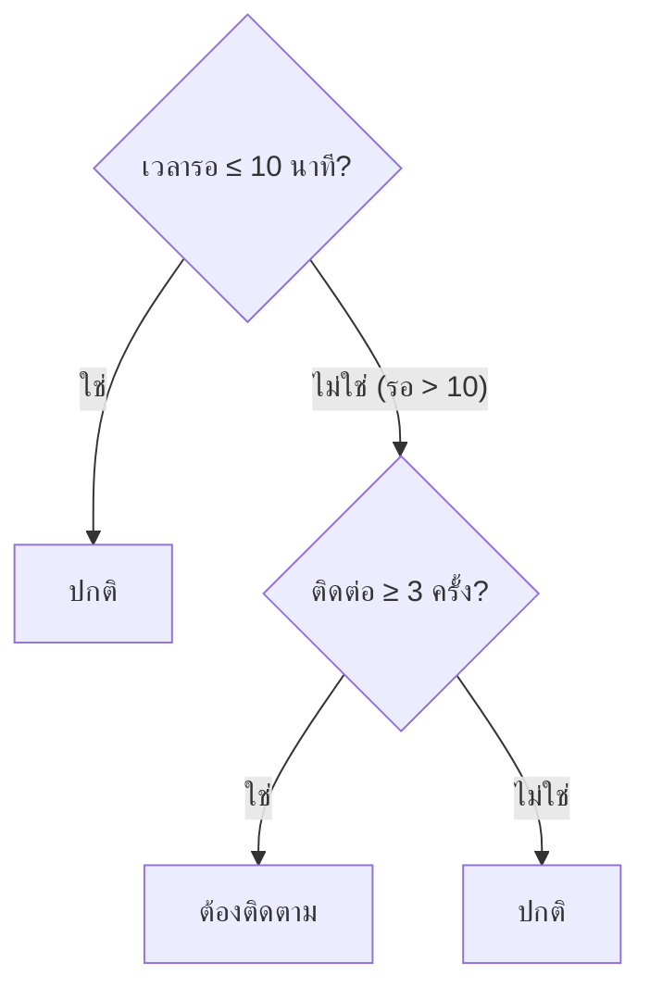

# สรุปเตรียมสอบ ML — Classification, Ensemble, CV และ Tuning

ครอบคลุมแบบทดสอบ 2 ชุด รวม 38 ข้อ

| ชุด | ตรงกับบท | หัวข้อ | จำนวน |
|---|---|---|---|
| ชุด 1 | บทที่ 9 Classification และบทที่ 10 Ensemble Methods | Decision Tree, KNN, Metrics, Logistic Regression, Bagging, Random Forest, Boosting | 20 ข้อ |
| ชุด 2 | บทที่ 12 Model Validation และ Selection | วิธีแบ่ง fold, Grid/Randomized Search, Pipeline, Nested CV, Learning curve | 18 ข้อ |

เนื้อหาฉบับเต็มอยู่ที่ [[Ch8-12 Tree, Ensemble, Clustering]] (ส่วนที่ 4, 5 และ 7) โน้ตนี้คัดเฉพาะส่วนที่ใช้ตอบแบบทดสอบ

> [!important] กฎ 5 ข้อที่ตอบได้เกือบครึ่งชุด
> 1. **final test แตะครั้งเดียวตอนจบ** ตัวเลือกใดใช้ final test เพื่อจูน เลือกโมเดล fit scaler หรือเลือก metric ถือว่าผิดทันที
> 2. **ทุกอย่างที่เรียนรู้จากข้อมูลต้อง fit บน train เท่านั้น** (scaler, feature selection, โมเดล) แล้วนำไปใช้กับ validation/test
> 3. **เลือกโมเดลจาก validation ไม่ใช่ training score**
> 4. **มีเงื่อนไข ให้กรองก่อน แล้วค่อยเลือกค่าสูงสุด** ในกลุ่มที่ผ่าน
> 5. **สรุปเท่าที่หลักฐานมี** ตัวเลือกที่มีคำว่า "แน่นอน" "เสมอ" "รับประกัน" "ทุกชุดข้อมูล" มักผิด

---

# ส่วนที่ 1 — Classification และ Ensemble (บทที่ 9–10)

## 1. ระบุประเภทโจทย์

*ใช้ตอบ: ชุด 1 Q01*

| ประเภท | มี label ไหม | Target เป็นอะไร | ตัวอย่าง |
|---|---|---|---|
| **Classification** | มี | หมวดหมู่ | ต้องติดตาม / ไม่ต้องติดตาม |
| **Regression** | มี | ตัวเลขต่อเนื่อง | ราคา ยอดขาย |
| **Clustering** | ไม่มี | ไม่มี target ให้เรียนรู้ | จัดกลุ่มลูกค้า |

ดูที่ **ลักษณะของ target** เท่านั้น เหตุผลลวงที่พบบ่อย:

- "ใช้ข้อมูลเก่า" ไม่ได้บอกประเภท เพราะทุกโมเดลเรียนจากข้อมูลเก่า
- "คอมพิวเตอร์แทนกลุ่มด้วย 0 และ 1" ยังเป็นหมวดหมู่ ไม่ใช่ Regression
- "มีสองกลุ่ม" แต่มี label กำกับ คือ Classification ไม่ใช่ Clustering

## 2. Decision Tree

*ใช้ตอบ: ชุด 1 Q02, Q03*

### อ่านต้นไม้

เริ่มจากรากแล้วเดินตามเงื่อนไข **ทีละชั้นจนถึงใบ** ห้ามหยุดตอบกลางทาง



ตัวอย่าง: รอ 12 นาที ติดต่อ 2 ครั้ง → 12 > 10 จึงไปแขนงขวา → 2 < 3 → **ปกติ**
(การรอเกิน 10 นาทีอย่างเดียวยังไม่พอ ต้องตรวจเงื่อนไขถัดไปด้วย และต้นไม้ให้คำตอบได้โดยไม่ต้องมี probability)

### Overfitting

สัญญาณ: **train สูงมาก แต่ validation ต่ำ** เช่น train F1 = 0.99, validation F1 = 0.65

| ทำ | ไม่ทำ |
|---|---|
| ลด `max_depth` | เพิ่มความลึกจน train = 1 |
| เพิ่ม `min_samples_leaf` | ใช้ final test จูนซ้ำ |
| วัด validation ใหม่หลังปรับ | ลบแถวที่โมเดลทำนายผิด |

## 3. KNN (K-Nearest Neighbors)

*ใช้ตอบ: ชุด 1 Q04, Q05*

ทำนายจากเพื่อนบ้าน k ตัวที่ใกล้ที่สุด วัดด้วยระยะทาง Euclidean

$$d(x, y) = \sqrt{\sum_i (x_i - y_i)^2}$$

### ต้องปรับสเกล

feature ที่ช่วงค่ากว้าง (รายจ่าย 0–100,000) จะครอบงำ feature ช่วงแคบ (จำนวนครั้ง 0–10) วิธีที่ถูก:

1. `fit` StandardScaler ด้วย **train เท่านั้น**
2. ใช้ mean/SD ชุดเดิม `transform` validation และ test

การบวกค่าคงที่ให้ทุกคน (เช่น +1 บาท) ไม่เปลี่ยนช่วงสเกล และการคำนวณสเกลจาก final test คือ leakage

### เลือก k

- เลือกตาม **validation metric ที่กำหนด** เช่น k=1 ได้ 0.70, k=5 ได้ 0.82, k=15 ได้ 0.78 → เลือก **k=5**
- ไม่เลือกจาก training score (k=1 จำข้อมูล train ได้หมด จึงดูดีเกินจริง)
- "k มากที่สุด" หรือ "ใกล้ข้อมูลที่สุด" ไม่ใช่เกณฑ์

## 4. Confusion Matrix และ Metrics

*ใช้ตอบ: ชุด 1 Q06, Q07, Q08, Q09*

กำหนด positive ก่อนเสมอ (เช่น positive = "ต้องติดตาม")

| | ทำนาย Positive | ทำนาย Negative |
|---|---|---|
| **จริง Positive** | TP | **FN** (พลาด) |
| **จริง Negative** | **FP** (เตือนผิด) | TN |

วิธีจำ: ตัวหลัง (P/N) คือ **สิ่งที่โมเดลทำนาย** ตัวหน้า (T/F) คือ **ทำนายถูกหรือผิด**

- **FN** = ทำนาย Negative แต่ผิด → จริงเป็น Positive (จริงต้องติดตาม แต่ทำนายว่าไม่ต้อง)
- **FP** = ทำนาย Positive แต่ผิด → จริงเป็น Negative

### สูตร

| Metric | สูตร | ความหมาย |
|---|---|---|
| Precision | $\frac{TP}{TP+FP}$ | ที่ทำนายว่า positive ถูกจริงกี่ส่วน |
| Recall | $\frac{TP}{TP+FN}$ | positive จริงทั้งหมด จับได้กี่ส่วน |
| F1 | $\frac{2PR}{P+R}$ | ค่าเฉลี่ยฮาร์โมนิกของ P และ R |
| Accuracy | $\frac{TP+TN}{\text{ทั้งหมด}}$ | ทำนายถูกรวมกี่ส่วน |

### ตัวอย่างคำนวณ: TP=30, FP=10, FN=20, TN=140

- Precision = 30 / (30+10) = **0.75**
- Recall = 30 / (30+20) = **0.60**
- F1 = 2(0.75)(0.60) / (0.75+0.60) = 0.90 / 1.35 = **0.667**
- Accuracy = (30+140) / 200 = 0.85

> [!warning] ตัวลวงในข้อคำนวณ
> - สลับ Precision กับ Recall (0.60 / 0.75)
> - ใช้ Accuracy 0.85 มาตอบแทน Precision/Recall
> - F1 ลวง: 0.450 = P×R, 0.675 = ค่าเฉลี่ยธรรมดา (P+R)/2, 1.350 = P+R

### เลือก metric ตามต้นทุนความผิดพลาด

| สถานการณ์ | กลัวอะไร | เน้น |
|---|---|---|
| คัดกรองของชำรุด/โรค ยอมตรวจซ้ำเพิ่มได้ | พลาดของจริง (FN) | **Recall** ของ class positive |
| การเตือนผิดมีต้นทุนสูง | เตือนผิด (FP) | **Precision** |

## 5. Logistic Regression และ Threshold

*ใช้ตอบ: ชุด 1 Q10, Q11*

1. คำนวณผลรวมเชิงเส้น $z = w_1x_1 + \dots + w_nx_n + b$
2. ผ่าน sigmoid ได้ความน่าจะเป็นของ class ที่กำหนด $p = \frac{1}{1+e^{-z}}$ (อยู่ในช่วง 0–1)
3. เทียบกับ threshold เพื่อตัดสิน class

ข้อเท็จจริงที่ต้องรู้:

- ชื่อมีคำว่า regression แต่ **ใช้ทำ classification**
- ถ้าใช้ features ดั้งเดิม decision boundary เป็น **เส้นตรง** ไม่ใช่เส้นโค้ง
- ผลลัพธ์ถูกจำกัดในช่วง 0–1 ไม่ใช่ตัวเลขใดก็ได้

### Threshold

กฎ: ทำนาย class 1 เมื่อ probability ≥ threshold

| P(class 1) | threshold | ผล |
|---|---|---|
| 0.40 | 0.50 | 0 (เพราะ 0.40 < 0.50) |
| 0.40 | 0.30 | 1 (เพราะ 0.40 ≥ 0.30) |

**threshold เปลี่ยนแค่การตัดสิน ค่า probability ยังเป็น 0.40 เท่าเดิม**
ลด threshold → ทำนาย positive มากขึ้น → Recall มักเพิ่ม Precision มักลด

## 6. Ensemble: Bagging, Random Forest, Boosting

*ใช้ตอบ: ชุด 1 Q12–Q16, Q18*

### ทำไมรวมหลายโมเดลแล้วดีขึ้น

โมเดลที่ **ผิดต่างกันบางส่วน** ช่วยชดเชยกันได้ ถ้าทุกตัวผิดเหมือนกันหมดการรวมก็ไม่ช่วย และไม่มีการรับประกัน accuracy 100% รวมถึงยังต้องมีชุดประเมินเหมือนเดิม

### Bootstrap และ Bagging

- **Bootstrap** = สุ่มแถว **แบบใส่คืน** (sampling with replacement) จาก training set
- ผลคือในแต่ละชุด **บางแถวซ้ำ และบางแถวไม่ถูกเลือกเลย**
- **Bagging** = ฝึก base model แต่ละตัวบนชุด bootstrap ของตัวเอง แล้วรวมผล (โหวต/เฉลี่ย)

### Out-of-bag (OOB)

OOB samples ของต้นไม้ต้นหนึ่ง = **แถวใน training set ต้นทางที่ไม่ถูกเลือกใน bootstrap ของต้นนั้น** (ประมาณ 37% ของแถว) ใช้ประเมินต้นนั้นได้เพราะต้นนั้นไม่เคยเห็น
ไม่ใช่ final test ไม่ใช่แถวที่มี missing และไม่ใช่แถวที่ทำนายผิด

### Random Forest

Bagging ของ Decision Tree + ความหลากหลายอีกชั้น: **สุ่ม subset ของ features ทุกครั้งที่หา split แต่ละจุด** ทำให้ต้นไม้ต่างกันมากขึ้น

```python
from sklearn.ensemble import RandomForestClassifier

rf = RandomForestClassifier(random_state=29)
rf.fit(X_train, y_train)      # fit ด้วย train ทั้ง X และ y
pred = rf.predict(X_val)      # predict ด้วย X ของ validation
```

จุดที่โจทย์ลวง: ใช้ `Regressor` กับงาน classification, `predict` ก่อน `fit`, `fit` ด้วย validation, ส่ง `y` เข้า `fit`/`predict` แทน `X`

### Bagging เทียบกับ Gradient Boosting

| | Bagging / Random Forest | Gradient Boosting (XGBoost, LightGBM) |
|---|---|---|
| วิธีฝึก | ฝึก base models **แยกกัน** บนชุด bootstrap | เพิ่มโมเดล **ตามลำดับ** |
| แต่ละโมเดลทำอะไร | เรียนอิสระจากกัน | ปรับปรุง **loss ของ ensemble เดิม** |
| รวมผล | โหวต/เฉลี่ย | บวกสะสม |

## 7. เปรียบเทียบและเลือกโมเดล

*ใช้ตอบ: ชุด 1 Q17, Q19, Q20*

### เปรียบเทียบอย่างยุติธรรม

ต้องเหมือนกันทั้งหมด: **ข้อมูล, split, นิยาม positive, metric, validation set**
ห้าม: ให้โมเดลหนึ่งเห็น test, รายงาน training score, เทียบ F1 ของตัวหนึ่งกับ accuracy ของอีกตัว

### เลือกภายใต้เงื่อนไข

ตัวอย่าง: ต้องการ F1 สูงสุด โดย latency ≤ 10 ms และ memory ≤ 180 MB

| โมเดล | F1 | latency | memory | ผ่านไหม |
|---|---|---|---|---|
| RF | 0.88 | 8 ms | 200 MB | ไม่ผ่าน (memory) |
| XGBoost | 0.91 | 12 ms | 160 MB | ไม่ผ่าน (latency) |
| **LightGBM** | 0.90 | 6 ms | 100 MB | **ผ่าน → เลือก** |

ตัวที่ F1 สูงสุด (XGBoost) คือตัวลวง เพราะตกเงื่อนไข

### สรุปผลให้พอดีหลักฐาน

RF ชนะ Tree 0.02 จาก split เดียว สรุปได้เพียงว่า "ดีกว่าตาม metric ใน split ที่ทดลองนี้" และควรตรวจความแปรผัน (variability) ข้อจำกัด รวมถึงต้นทุนเวลา/memory ก่อนใช้จริง

---

# ส่วนที่ 2 — Cross-validation และ Hyperparameter Tuning (บทที่ 12)

## 8. Cross-validation คืออะไร

*ใช้ตอบ: ชุด 2 Q01, Q02, Q03*

**เหตุผลหลัก:** ประเมินบนหลายการแบ่ง train/validation เพื่อ **ลดการพึ่งพา split ครั้งเดียว**

CV ไม่ได้: ทำให้ไม่ต้องมี test, เพิ่มแถวข้อมูลจริง, หรือทำให้โมเดลถูกทุกตัวอย่าง

### k-fold

แบ่ง development เป็น k ส่วนเท่ากัน วน k รอบ แต่ละรอบใช้ 1 ส่วนเป็น validation ที่เหลือเป็น train

- validation ต่อรอบ = n / k
- train ต่อรอบ = n − n / k

ตัวอย่าง: 100 แถว 5-fold → validation **20** train **80**

### คะแนน CV

รายงานเป็น **mean** (และ SD) ของคะแนนทุก fold
ตัวอย่าง: 0.70, 0.80, 0.75, 0.85, 0.90 → รวม 4.00 → mean = 4.00 / 5 = **0.80**

## 9. เลือกวิธีแบ่ง fold ให้ตรงกับข้อมูล

*ใช้ตอบ: ชุด 2 Q04, Q05, Q06*

| ลักษณะข้อมูล | วิธีแบ่ง | เหตุผล |
|---|---|---|
| class ไม่สมดุล แต่ละแถวอิสระกัน | **StratifiedKFold** | รักษาสัดส่วน class ในทุก fold |
| หลายแถวต่อผู้ใช้/กลุ่ม ต้องการทำนายกลุ่มใหม่ | **GroupKFold** | คนเดียวกันไม่ข้าม train/validation |
| ข้อมูลมีลำดับเวลา ทำนายอนาคต | **TimeSeriesSplit** | train จากอดีต validate ช่วงถัดไป พิจารณา gap |

> [!warning] ข้อผิดที่โจทย์ใช้ลวง
> - สุ่มแถวทั้งที่มีหลายแถวต่อผู้ใช้ → คนเดิมอยู่ทั้งสองฝั่ง คะแนนสูงเกินจริง
> - ลบรหัสผู้ใช้ออกจาก features **ไม่ได้แก้** ปัญหา เพราะแถวของคนเดิมยังคล้ายกันอยู่
> - ใช้ข้อมูลอนาคตฝึกเพื่อทำนายอดีต
> - เรียงตาม target แล้วแบ่ง หรือกอง positive ไว้ fold เดียว

## 10. Hyperparameter และการค้นหา

*ใช้ตอบ: ชุด 2 Q07, Q08, Q09*

### Hyperparameter เทียบกับ Parameter

| | Hyperparameter | Parameter ที่เรียนรู้ |
|---|---|---|
| กำหนดเมื่อไร | **ผู้ใช้กำหนดก่อน fit** | โมเดลเรียนรู้ระหว่าง fit |
| ตัวอย่าง | `C`, `max_depth`, `min_samples_leaf`, `n_neighbors` | `coef_`, `intercept_` |

ใน scikit-learn ชื่อที่ลงท้ายด้วย `_` คือสิ่งที่เรียนรู้จากข้อมูล
`C` ของ LogisticRegression ควบคุม regularization **แบบผกผัน**: C น้อย = regularization แรง

### GridSearchCV เทียบกับ RandomizedSearchCV

| | GridSearchCV | RandomizedSearchCV |
|---|---|---|
| ทดลอง | **ทุกคู่** ใน grid | **สุ่ม** combinations ตามจำนวนที่กำหนด (`n_iter`) จากขอบเขตที่ให้ |
| ประเมินด้วย | CV | CV |
| รับประกันค่าดีที่สุดของทุกค่าที่เป็นไปได้ | ไม่ (ดีที่สุดเฉพาะใน grid) | ไม่ |

ทั้งสองแบบยังต้องกำหนด `scoring` ให้ตรงเป้าหมายเอง

### นับจำนวนครั้งที่ fit

$$\text{จำนวน fit} = \text{จำนวน combinations} \times \text{จำนวน folds}$$

ตัวอย่าง: `max_depth=[2,4,6]` (3 ค่า) × `min_samples_leaf=[1,5]` (2 ค่า) = 6 combinations × 4 folds = **24 ครั้ง**
ถ้านับ refit ตัวที่เลือกด้วยจะเป็น 25 (ตัวลวง 6 คือลืมคูณ folds)

## 11. Data Leakage ใน CV และ Pipeline

*ใช้ตอบ: ชุด 2 Q10, Q11 (และชุด 1 Q04)*

**หลัก:** ขั้นตอนใดที่เรียนรู้จากข้อมูล ต้อง fit ภายใน **train ของแต่ละ fold** เท่านั้น

| ทำผิด | ทำไมผิด |
|---|---|
| fit scaler บน development ทั้งหมดก่อน CV | สถิติของ validation fold รั่วเข้า scaler |
| เลือก features จากความสัมพันธ์กับ target บนข้อมูลทั้งหมดก่อน CV | **target ของ validation fold** มีอิทธิพลต่อการเลือก → คะแนน CV มองโลกดีเกินไป |
| ปรับสเกล train และ validation แยกกันคนละค่า | ต้องใช้ค่าจาก train ชุดเดียวกัน |

feature selection ใช้ target ได้ แต่ต้องทำ **ภายใน train fold**

### วิธีแก้: ใส่ทุกขั้นใน Pipeline แล้วส่ง Pipeline ให้ CV

```python
from sklearn.pipeline import Pipeline
from sklearn.preprocessing import StandardScaler
from sklearn.neighbors import KNeighborsClassifier
from sklearn.model_selection import GridSearchCV, StratifiedKFold

pipe = Pipeline([
    ("scaler", StandardScaler()),
    ("knn", KNeighborsClassifier()),
])
param_grid = {"knn__n_neighbors": [1, 5, 15]}
cv = StratifiedKFold(n_splits=5, shuffle=True, random_state=29)

search = GridSearchCV(pipe, param_grid, scoring="f1", cv=cv, refit=True)
search.fit(X_dev, y_dev)          # CV จะ fit scaler ใหม่ใน train ของแต่ละ fold
print(search.best_params_)
```

## 12. Final test และ `refit=True`

*ใช้ตอบ: ชุด 2 Q12, Q18*

- **final test** ใช้ประเมินโมเดล/ขั้นตอนที่ **เลือกเสร็จแล้ว** และไม่ย้อนกลับไปเปลี่ยนการเลือกจากผลนี้
- ห้าม: จูนซ้ำด้วย test, เลือก metric หลังเห็นผล test, ใส่ label ของ test ลงใน features
- `GridSearchCV(refit=True)` หลังเลือก parameters ที่ดีที่สุดแล้ว จะ fit ใหม่บน **development ทั้งหมดที่ส่งเข้า `search.fit`** ด้วย parameters นั้น ตัวนี้คือ estimator ที่ `search.predict` ใช้ (ไม่ใช่เฉพาะ fold แรก และไม่ได้ใช้ final test)

## 13. Nested CV

*ใช้ตอบ: ชุด 2 Q14*

ใช้เมื่อจูนหลายแบบและต้องการประเมิน **กระบวนการเลือก** อย่างไม่ลำเอียง

| Loop | ใช้ข้อมูลใด | หน้าที่ |
|---|---|---|
| **Inner** | training data ของ outer | **เลือก** hyperparameters |
| **Outer** | outer validation ที่ inner ไม่เคยเห็น | **ประเมิน** ผลของกระบวนการที่เลือกแล้ว |

inner ต้องไม่ใช้ outer validation ในการเลือก

## 14. เปรียบเทียบโมเดลด้วย mean และ SD

*ใช้ตอบ: ชุด 2 Q13*

ตัวอย่าง: A mean F1 = 0.81 (SD 0.06), B mean F1 = 0.82 (SD 0.05)

สรุปที่เหมาะสม: **B มี mean สูงกว่าเล็กน้อยในการทดลองนี้ แต่ยังไม่พิสูจน์ความต่างเชิงสถิติหรือความเหนือกว่าทั่วไป** เพราะต่างกัน 0.01 ซึ่งเล็กกว่า SD มาก

- SD ของ CV **ไม่ใช่** 95% confidence interval
- ใช้ folds เดียวกันไม่ได้ทำให้ SD เป็นศูนย์

## 15. Learning Curve

*ใช้ตอบ: ชุด 2 Q15, Q16 (และชุด 1 Q03)*

ดูแกนตั้งก่อนเสมอ: **RMSE/error ต่ำดีกว่า** ส่วน **F1/accuracy สูงดีกว่า**

| รูปแบบ | วินิจฉัย | สิ่งที่ควรทดลอง |
|---|---|---|
| train กับ CV **เข้าใกล้กัน แต่แย่ทั้งคู่** | **Underfit** (high bias) | ตรวจ features เพิ่มความยืดหยุ่นของโมเดล ตรวจคุณภาพข้อมูล (เพิ่มข้อมูลอย่างเดียวไม่รับประกัน) |
| train **ดีมาก** CV แย่ **ช่องว่างกว้าง** | **Overfit** (high variance) | ลดความซับซ้อน เพิ่ม regularization แล้วเทียบ CV ข้อมูลเพิ่มอาจช่วย |

ตัวอย่าง:
- train RMSE กับ CV RMSE เข้าใกล้กันแต่ยังสูงกว่าที่ยอมรับได้มาก → underfit (train error สูง **ไม่ใช่** overfit)
- train F1 ≈ 0.99, CV F1 ≈ 0.65 → overfit ห้ามเลือกทันทีเพราะ train สูง

## 16. เลือกโมเดลจากผล CV ภายใต้เงื่อนไข

*ใช้ตอบ: ชุด 2 Q17*

เงื่อนไข latency ≤ 5 ms แล้วเลือก mean CV F1 สูงสุด

| โมเดล | F1 | latency | ผ่านไหม |
|---|---|---|---|
| A | 0.86 | 12 ms | ไม่ผ่าน |
| **B** | 0.84 | 4 ms | **ผ่าน → เลือก** |
| C | 0.82 | 3 ms | ผ่าน แต่ F1 ต่ำกว่า B |

> [!warning] อ่านตัวเลือกให้ดี
> ข้อนี้ตัวอักษรตัวเลือกไม่ตรงกับชื่อโมเดล: โมเดล **B** อยู่ที่ตัวเลือก **C** (ตัวเลือก B คือโมเดล C)

---

# เฉลย

> [!success]- เฉลยชุด 1 — Classification และ Ensemble (20 ข้อ)
> | ข้อ | ตอบ | สาระ | อ่านหัวข้อ |
> |---|---|---|---|
> | Q01 | B | Classification เพราะเป้าหมายเป็นสองหมวดหมู่ | 1 |
> | Q02 | D | ปกติ (รอ > 10 แต่ติดต่อ < 3) | 2 |
> | Q03 | A | ลด max_depth / เพิ่ม min_samples_leaf แล้วตรวจ validation | 2 |
> | Q04 | C | fit StandardScaler ด้วย train แล้ว transform val/test | 3 |
> | Q05 | B | k = 5 (validation F1 สูงสุด) | 3 |
> | Q06 | D | จริงต้องติดตาม แต่ทำนายว่าไม่ต้อง | 4 |
> | Q07 | A | Precision 0.75, Recall 0.60 | 4 |
> | Q08 | C | F1 = 0.667 | 4 |
> | Q09 | B | Recall ของชิ้นงานชำรุด | 4 |
> | Q10 | A | linear combination ผ่าน sigmoid ได้ probability | 5 |
> | Q11 | D | จาก 0 เป็น 1 โดย probability ยัง 0.40 | 5 |
> | Q12 | C | โมเดลที่ผิดต่างกันชดเชยกันได้ | 6 |
> | Q13 | A | สุ่มแถวแบบใส่คืนจาก training set | 6 |
> | Q14 | D | สุ่ม subset ของ features ที่แต่ละ split | 6 |
> | Q15 | B | แถวใน train ที่ไม่ถูกเลือกใน bootstrap ของต้นนั้น | 6 |
> | Q16 | C | RandomForestClassifier → fit(X_train, y_train) → predict(X_val) | 6 |
> | Q17 | A | ข้อมูล split positive metric validation เดียวกัน | 7 |
> | Q18 | D | Boosting เพิ่มตามลำดับเพื่อลด loss / Bagging ฝึกบน bootstrap แล้วรวม | 6 |
> | Q19 | C | LightGBM (ตัวเดียวที่ผ่านทั้งสองเงื่อนไข) | 7 |
> | Q20 | B | ดีกว่าใน split นี้ ควรตรวจ variability และข้อจำกัด | 7 |

> [!success]- เฉลยชุด 2 — Cross-validation และ Tuning (18 ข้อ)
> | ข้อ | ตอบ | สาระ | อ่านหัวข้อ |
> |---|---|---|---|
> | Q01 | C | ประเมินหลาย split ลดการพึ่งพา split เดียว | 8 |
> | Q02 | A | train 80, validation 20 | 8 |
> | Q03 | D | mean = 0.80 | 8 |
> | Q04 | B | StratifiedKFold | 9 |
> | Q05 | C | GroupKFold | 9 |
> | Q06 | A | train จากอดีต validate ช่วงถัดไป พิจารณา gap | 9 |
> | Q07 | D | 6 combinations × 4 folds = 24 | 10 |
> | Q08 | B | สุ่ม combinations ตามจำนวนที่กำหนด แล้วประเมินด้วย CV | 10 |
> | Q09 | C | C (regularization แบบผกผัน) | 10 |
> | Q10 | A | ใส่ scaler + KNN ใน Pipeline ส่งให้ CV | 11 |
> | Q11 | D | target ของ validation fold รั่วเข้าการเลือก features | 11 |
> | Q12 | B | ใช้ประเมินครั้งสุดท้าย ไม่ย้อนไปเปลี่ยนการเลือก | 12 |
> | Q13 | C | B สูงกว่าเล็กน้อย แต่ยังไม่พิสูจน์ความต่าง | 14 |
> | Q14 | A | inner เลือก / outer ประเมิน | 13 |
> | Q15 | D | underfit ตรวจ features ความยืดหยุ่น คุณภาพข้อมูล | 15 |
> | Q16 | B | ลดความซับซ้อน / เพิ่ม regularization แล้วเทียบ CV | 15 |
> | Q17 | C | โมเดล B (F1 0.84, 4 ms) | 16 |
> | Q18 | A | development ทั้งหมดที่ส่งเข้า search.fit | 12 |

---

# ทบทวนเร็วก่อนสอบ

- มี label + target เป็นหมวดหมู่ = Classification
- อ่าน Decision Tree ให้ถึงใบ
- Overfit: train สูง validation ต่ำ → ลดความซับซ้อน / Underfit: แย่ทั้งคู่ → เพิ่มความยืดหยุ่น
- KNN ต้อง scale และ scaler fit จาก train เท่านั้น
- Precision หารด้วย TP+FP / Recall หารด้วย TP+FN / F1 = 2PR/(P+R)
- กลัวพลาดของจริง → Recall
- threshold เปลี่ยนการตัดสิน ไม่เปลี่ยน probability
- Bootstrap = สุ่มใส่คืน / OOB = แถวที่ไม่ถูกสุ่ม / RF = bootstrap + สุ่ม features ต่อ split
- Bagging ฝึกแยกกัน / Boosting ฝึกตามลำดับเพื่อลด loss
- k-fold: validation = n/k, train = n − n/k
- class ไม่สมดุล → Stratified / มีกลุ่ม → Group / มีเวลา → TimeSeries
- จำนวน fit = combinations × folds
- ชื่อลงท้าย `_` คือสิ่งที่เรียนรู้ ไม่ใช่ hyperparameter
- Pipeline กัน leakage ใน CV
- `refit=True` → fit ใหม่บน development ทั้งหมด
- Nested CV: inner เลือก outer ประเมิน
- mean ต่างกันน้อยกว่า SD → ยังสรุปว่าเหนือกว่าไม่ได้
