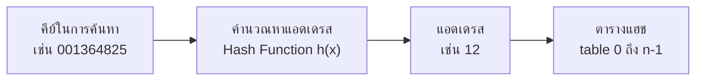
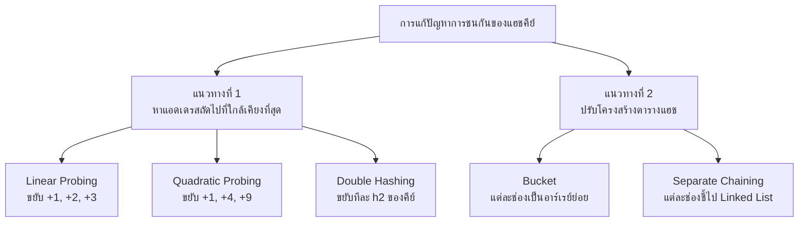
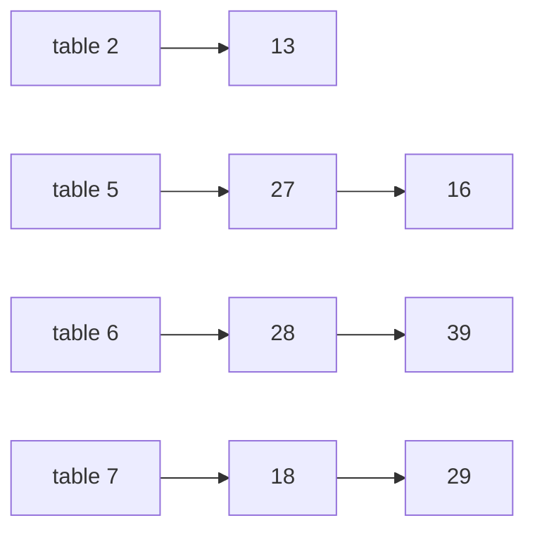

# บทที่ 10 — Hashing

Oct 10, 2026 · สรุปจากสไลด์ของ ผศ.ดร.สิลดา อินทรโสธรฉันท์ (28 หน้า)

ก่อนหน้า: [[Ch9 Priority Queue]] · ถัดไป: [[Ch11 Graph]] · ชุดเดียวกัน: [[Ch8 Searching Algorithm]] · [[Ch12 Sorting]]

> [!abstract] บทนี้ต้องทำอะไรได้
> 1. อธิบายว่า Hashing, Hash Function, Hash Table และ Collision คืออะไร
> 2. คำนวณค่าแฮชด้วย 3 วิธี: **เลือกหลัก, บวกหลัก, หารเอาเศษ** และแปลงข้อความเป็นตัวเลขได้
> 3. แก้ปัญหาการชนด้วย **Linear Probing, Quadratic Probing, Double Hashing** และวาดตารางผลลัพธ์ได้
> 4. อธิบายการแก้ปัญหาด้วยการปรับโครงสร้างตาราง: **Bucket** และ **Separate Chaining**

---

## 1. แนวคิดของ Hashing

ใน [[Ch8 Searching Algorithm]] ทุกวิธีต้อง "เปรียบเทียบ" หลายครั้งกว่าจะเจอ Hashing ใช้แนวคิดต่างออกไป: **เอาตัวข้อมูลเองไปคำนวณเป็นตำแหน่งที่เก็บ** แล้วกระโดดไปตำแหน่งนั้นทันที

- การจัดการข้อความหรือข้อมูลให้เป็น **ดัชนี** เพื่อใช้อ้างอิงตำแหน่งการเก็บในอาร์เรย์ เรียกว่า **การทำแฮช (Hash)**
- เมื่อต้องการค้นหา ก็คำนวณดัชนีแบบเดิม แล้วเข้าถึงข้อมูลได้ **ในครั้งเดียว**
- การหาตำแหน่งเพื่อเพิ่มข้อมูลลงอาร์เรย์เรียกว่า **การคำนวณหาแอดเดรส**



| คำศัพท์ | ความหมาย |
| --- | --- |
| **Hash Function** (แฮชฟังก์ชัน) | ฟังก์ชันที่คำนวณหาแอดเดรสจากคีย์ เขียนแทนด้วย `h(x)` |
| **Hash Table** (แฮชเทเบิล) | อาร์เรย์ที่ใช้เก็บข้อมูลตามแอดเดรสที่คำนวณได้ |
| **Hash Key / แอดเดรส** | ค่าที่ได้จากแฮชฟังก์ชัน ใช้เป็น index ของตาราง |
| **Collision** (การชนกันของข้อมูล) | คีย์ต่างกัน แต่ได้แอดเดรส **ซ้ำกัน** |

### ตัวอย่างนำเรื่องจากสไลด์ — เบอร์โทรศัพท์ของโรงพยาบาล

โรงพยาบาลเก็บข้อมูลผู้ป่วยโดยใช้หมายเลขโทรศัพท์ (ตัวแปร `phone`) เป็นดัชนี: `table[phone]`

| แนวทาง | ตำแหน่งที่เก็บ 123-4567 | ขนาดตารางที่ต้องจอง | ปัญหา |
| --- | --- | --- | --- |
| ใช้เบอร์ทั้ง 7 หลัก | `table[1234567]` | 10,000,000 ช่อง (สิบล้าน) | เปลืองหน่วยความจำมาก |
| ใช้เฉพาะ **4 ตัวหลัง** | `table[4567]` | 10,000 ช่อง | อาจชนกัน |

การเปลี่ยนจากตำแหน่ง 1234567 มาเป็น 4567 นี่แหละคือ **การใช้แฮชฟังก์ชัน**

แต่เบอร์ `1234567` กับ `1114567` มี 4 ตัวหลังเหมือนกัน → ได้แอดเดรส 4567 ทั้งคู่ → เกิด **Collision**

> [!note] แก่นของบทนี้มี 2 คำถาม
> 1. จะเลือกแฮชฟังก์ชันอย่างไรให้ **กระจาย** และชนกันน้อย → หัวข้อ 2–3
> 2. เมื่อชนกันแล้วจะ **เก็บไว้ที่ไหน** → หัวข้อ 4–5
>
> แฮชฟังก์ชันทำงานกับ **ตัวเลขจำนวนเต็ม** คือเปลี่ยนตัวเลขที่หลากหลายให้อยู่ในช่วงที่กำหนด (เช่น 0 ถึง 100) ถ้าคีย์ไม่ใช่จำนวนเต็ม (เช่นข้อความ) ก็ต้องแปลงเป็นจำนวนเต็มก่อน

---

## 2. แฮชฟังก์ชัน 3 วิธี

ใช้คีย์ตัวอย่างเดียวกันทั้งหมด คือรหัสลูกจ้าง 9 หลัก **001364825**

| หลักที่ | 1 | 2 | 3 | 4 | 5 | 6 | 7 | 8 | 9 |
| --- | --- | --- | --- | --- | --- | --- | --- | --- | --- |
| ตัวเลข | 0 | 0 | 1 | 3 | 6 | 4 | 8 | 2 | 5 |

### (1) การเลือกหลัก (Digit Selection)

เลือกบางหลักของคีย์มาประกอบกันเป็นแอดเดรส

เลือก **หลักที่ 4** (= 3) และ **หลักสุดท้าย** (= 5) → `h(001364825) = 35` → เก็บที่ `table[35]`

> [!warning] ข้อควรระวัง
> ต้องเลือกหลักที่ **ค่าแตกต่างกันมากระหว่างคีย์** ถ้าเลือกหลักที่หลายคนมีค่าเหมือนกัน (เช่นหลักที่ 1 กับหลักที่ 3 ของรหัสที่ขึ้นต้นคล้ายกัน) จะชนกันเป็นจำนวนมาก — เหมือนตัวอย่างเบอร์โทรที่เลขท้ายซ้ำ

### (2) การบวกหลัก (Folding)

เลือกหลักแล้วนำตัวเลขมา **บวกกัน**

**แบบบวกทุกหลัก**

$$0 + 0 + 1 + 3 + 6 + 4 + 8 + 2 + 5 = 29 \quad\Rightarrow\quad \texttt{table[29]}$$

ช่วงของแอดเดรส: 9 หลัก หลักละ 0–9 → ผลบวกอยู่ระหว่าง **0 ถึง 81** (9 × 9)

**แบบจัดกลุ่มแล้วบวก** (เมื่อต้องการตารางใหญ่ขึ้น) แบ่งเป็น 3 กลุ่ม กลุ่มละ 3 หลัก

$$001 + 364 + 825 = 1{,}190$$

ช่วงของแอดเดรส: **0 ถึง 3 × 999 = 2,997**

### (3) การหารเอาเศษ (Modulo)

รูปแบบที่ง่ายและใช้บ่อยที่สุด

$$h(x) = x \bmod \mathit{tableSize}$$

ถ้า `tableSize = 101` จะได้ `h(x) = x mod 101` ค่าอยู่ในช่วง **0 ถึง 100**

$$h(001364825) = 1364825 \bmod 101 = 12 \quad\Rightarrow\quad \texttt{table[12]}$$

สไลด์ชี้ว่าวิธีนี้ยังเกิดการชนได้ คือมักมีคีย์หลายตัวไปตกตำแหน่งเดียวกัน (หลายตัวตกที่ `table[0]` หลายตัวตกที่ `table[1]` เป็นต้น)

### สรุป 3 วิธีบนคีย์ 001364825

| วิธี | วิธีคิด | แอดเดรส | ช่วงที่เป็นไปได้ |
| --- | --- | --- | --- |
| เลือกหลัก (หลัก 4 และหลักสุดท้าย) | 3 กับ 5 | 35 | 0–99 |
| บวกทุกหลัก | 0+0+1+3+6+4+8+2+5 | 29 | 0–81 |
| จัดกลุ่ม 3 หลักแล้วบวก | 001+364+825 | 1,190 | 0–2,997 |
| หารเอาเศษ (mod 101) | 1364825 mod 101 | 12 | 0–100 |

### ทริคคิดเลข mod ให้เร็ว (ไม่ต้องตั้งหารยาว)

> [!tip] ทริค 1 — mod 101: ตัดทีละ 2 หลักจากขวา แล้ว "บวก ลบ สลับกัน"
> เพราะ $100 \equiv -1 \pmod{101}$ จึงแบ่งตัวเลขเป็นกลุ่มละ 2 หลักจากขวา แล้วคำนวณ กลุ่มขวาสุด − กลุ่มถัดไป + กลุ่มถัดไป − … (ถ้าผลติดลบให้บวก 101)
>
> | คีย์ | แบ่งกลุ่ม | คำนวณ | ผล |
> | --- | --- | --- | --- |
> | 1364825 | 1 · 36 · 48 · 25 | 25 − 48 + 36 − 1 | **12** |
> | 4567 | 45 · 67 | 67 − 45 | **22** |
> | 7597 | 75 · 97 | 97 − 75 | **22** |
> | 0628 | 06 · 28 | 28 − 6 | **22** |
> | 3658 | 36 · 58 | 58 − 36 | **22** |
>
> จะเห็นทันทีว่าทำไมตัวอย่างในสไลด์ (4567, 7597, 0628, 3658) ถึงชนกันที่ 22 ทุกตัว — สองหลักหลังลบสองหลักหน้าได้ 22 เท่ากันหมด

> [!tip] ทริค 2 — mod 11: บวกลบเลขโดดสลับกันจากขวา
> เพราะ $10 \equiv -1 \pmod{11}$ → หลักหน่วย − หลักสิบ + หลักร้อย − …
> - 58 → 8 − 5 = **3** · 14 → 4 − 1 = **3** · 91 → 1 − 9 = −8 → −8 + 11 = **3**
> - 17 → 7 − 1 = **6** · 73 → 3 − 7 = −4 → **7**
>
> ทริคอื่นที่ใช้บ่อย: mod 10 = หลักสุดท้าย · mod 100 = สองหลักสุดท้าย · mod 9 = ผลบวกเลขโดด (แล้ว mod 9 อีกที)

> [!tip] ทริค 3 — ทำไมนิยมใช้ tableSize เป็นจำนวนเฉพาะ (ความรู้เสริม)
> ถ้า tableSize มีตัวประกอบร่วมกับรูปแบบของคีย์ ค่าแฮชจะกระจุกตัว เช่น tableSize = 100 เท่ากับการ "เลือก 2 หลักสุดท้าย" ซึ่งชนง่าย (เหมือนตัวอย่างเบอร์โทร) จำนวนเฉพาะอย่าง 101 หรือ 11 ทำให้ทุกหลักของคีย์มีผลต่อค่าแฮช จึงกระจายดีกว่า ตัวอย่างในสไลด์จึงใช้ 101 และ 11

---

## 3. การเปลี่ยนข้อความเป็นตัวเลข

ถ้าคีย์เป็นข้อความ ต้องเปลี่ยนตัวอักษรแต่ละตัวเป็นตัวเลขก่อน แล้วจึงเข้าแฮชฟังก์ชัน

ตัวอย่างข้อความ **"NOTE"**

| ตัวอักษร | N | O | T | E |
| --- | --- | --- | --- | --- |
| รหัส ASCII | 78 | 79 | 84 | 69 |
| ลำดับ A=1 … Z=26 | 14 | 15 | 20 | 5 |
| ฐานสอง 5 บิต | 01110 | 01111 | 10100 | 00101 |

### วิธีมาตรฐาน — ต่อเลขฐานสองแล้วแปลงเป็นฐานสิบ

ตัวอักษร A–Z มี 26 ตัว ใช้ **5 บิต** ต่อตัว ($2^5 = 32 \ge 26$) นำมาเรียงต่อกัน

$$01110\;01111\;10100\;00101_2 = 474{,}757_{10}$$

แล้วนำ 474,757 ไปเข้าแฮชฟังก์ชันต่อ เช่น 474757 mod 101 = 57

### วิธีที่เร็วกว่า — Horner's rule

การแปลงเลขฐานสอง 20 หลักด้วยมือทำได้ยาก แต่การต่อ 5 บิตก็คือ **การเขียนเลขฐาน 32** นั่นเอง

$$(14 \times 32^3) + (15 \times 32^2) + (20 \times 32^1) + (5 \times 32^0) = 474{,}757$$

Horner's rule จัดรูปใหม่ให้ไม่ต้องยกกำลังเลย: **"คูณ 32 แล้วบวกตัวถัดไป" ซ้ำไปเรื่อยๆ**

$$((14 \times 32 + 15) \times 32 + 20) \times 32 + 5$$

| ขั้น | คำนวณ | ผลสะสม |
| --- | --- | --- |
| เริ่มที่ N | 14 | 14 |
| ต่อ O | 14 × 32 + 15 | 463 |
| ต่อ T | 463 × 32 + 20 | 14,836 |
| ต่อ E | 14,836 × 32 + 5 | **474,757** |

> [!tip] ทริค — mod ไปทีละขั้น ตัวเลขจะไม่บวมเลย
> ถ้าปลายทางคือ `mod tableSize` อยู่แล้ว ให้ mod ทุกขั้นของ Horner ได้เลย ผลลัพธ์เท่ากัน (สมบัติของ mod) และเป็นวิธีที่ใช้เขียนโปรแกรมจริงเพื่อกันตัวเลขล้น
>
> | ขั้น | คำนวณ | mod 101 |
> | --- | --- | --- |
> | N | 14 | 14 |
> | O | 14 × 32 + 15 = 463 | 463 − 404 = 59 |
> | T | 59 × 32 + 20 = 1,908 | 1,908 − 1,818 = 90 |
> | E | 90 × 32 + 5 = 2,885 | 2,885 − 2,828 = **57** |
>
> ตรงกับ 474757 mod 101 = 57 (ตรวจด้วยทริคตัด 2 หลัก: 57 − 47 + 47 = 57 ✓)

---

## 4. การแก้ปัญหาการชนกัน — ภาพรวม

ตัวอย่างการชนจากสไลด์: ตารางขนาด 101 ใช้ `h(x) = x mod 101`

- เพิ่ม 4567 → 4567 mod 101 = 22 → `table[22]`
- เพิ่ม 7597 → 7597 mod 101 = 22 → `table[22]` **มีข้อมูลอยู่แล้ว** → ชนกัน

แก้ได้ 2 แนวทาง



| | แนวทางที่ 1 (ตำราทั่วไปเรียก Open Addressing) | แนวทางที่ 2 |
| --- | --- | --- |
| หลักคิด | ทุกข้อมูลยังอยู่ **ในตารางเดิม** แค่ย้ายไปช่องอื่นที่ว่าง | เปลี่ยนให้ `table[i]` หนึ่งช่อง **เก็บได้มากกว่าหนึ่งข้อมูล** |
| ช่องละกี่ข้อมูล | 1 | หลายข้อมูล |

---

## 5. แนวทางที่ 1 — หาแอดเดรสถัดไป

ให้ $h = h(x)$ เป็นตำแหน่งเริ่มต้น (home) และ i = 1, 2, 3, … คือครั้งที่ลองใหม่

| วิธี | ตำแหน่งที่ลองครั้งที่ i | ระยะจาก home |
| --- | --- | --- |
| Linear Probing | $h + i$ | 1, 2, 3, 4, … |
| Quadratic Probing | $h + i^2$ | 1, 4, 9, 16, … |
| Double Hashing | $h_1 + i \times h_2$ | $h_2, 2h_2, 3h_2, …$ |

ถ้าตำแหน่งเกินขนาดตาราง ให้ **วนกลับ** ด้วย `mod tableSize` (สไลด์แสดงการวนกลับไว้ในตัวอย่าง Double Hashing)

### 5.1 Linear Probing (การแก้ปัญหาแบบลำดับ)

รูปแบบที่ง่ายที่สุด เลื่อนไปตำแหน่ง **ถัดไปทีละหนึ่ง**: `table[h(x)+1]` ถ้าไม่ว่างก็ `table[h(x)+2]` ไปเรื่อยๆ จนเจอช่องว่าง

ตัวอย่างจากสไลด์: ใส่ 7597, 4567, 0628, 3658 (ทุกตัว mod 101 = 22)

| คีย์ | home | ลองตำแหน่ง | ลงที่ |
| --- | --- | --- | --- |
| 7597 | 22 | 22 ว่าง | **22** (i) |
| 4567 | 22 | 22 ชน → 23 ว่าง | **23** (i+1) |
| 0628 | 22 | 22, 23 ชน → 24 ว่าง | **24** (i+2) |
| 3658 | 22 | 22, 23, 24 ชน → 25 ว่าง | **25** (i+3) |

### 5.2 Quadratic Probing (การแก้ปัญหาแบบกำลังสอง)

ปรับจาก Linear โดยขยับด้วย **ค่ายกกำลังสอง**: ตรวจ `table[h(x)+1²]` ถ้าไม่ว่างไป `table[h(x)+2²]` ไปเรื่อยๆ

ตัวอย่างจากสไลด์ (คีย์ชุดเดิม)

| คีย์ | home | ลองตำแหน่ง | ลงที่ |
| --- | --- | --- | --- |
| 7597 | 22 | 22 ว่าง | **22** |
| 4567 | 22 | 22 ชน → 22 + 1² = 23 ว่าง | **23** |
| 0628 | 22 | 22, 23 ชน → 22 + 2² = 26 ว่าง | **26** |
| 3658 | 22 | 22, 23, 26 ชน → 22 + 3² = 31 ว่าง | **31** |

เทียบสองวิธี: Linear ได้ข้อมูลเกาะกันเป็นแพ 22–25 ส่วน Quadratic กระจายเป็น 22, 23, 26, 31

> [!warning] จุดที่ผิดบ่อยของ Quadratic
> ระยะ 1, 4, 9 วัดจาก **home เดิมเสมอ** ไม่ใช่วัดจากตำแหน่งล่าสุด
> ✗ 22 → 23 → 23 + 4 = 27 (ผิด)
> ✓ 22 → 22 + 1 = 23 → 22 + 4 = 26 → 22 + 9 = 31

### 5.3 Double Hashing (การทำแฮช 2 ครั้ง)

ใช้แฮชฟังก์ชัน 2 ตัว

- $h_1(x)$ หาแอดเดรสเริ่มต้น
- ถ้าตำแหน่งนั้นมีข้อมูลอยู่แล้ว ใช้ $h_2(x)$ หา **ระยะในการขยับ** ไปตำแหน่งถัดไป
- ข้อกำหนด: $h_2(x) \ne 0$ และ $h_1 \ne h_2$

ตัวอย่างจากสไลด์: ตารางเก็บได้ 11 ข้อมูล

$$h_1(x) = x \bmod 11 \qquad h_2(x) = 7 - (x \bmod 7)$$

เช่น key = 58 → $h_1 = 58 \bmod 11 = 3$ และ $h_2 = 7 - (58 \bmod 7) = 7 - 2 = 5$ หมายความว่าถ้า `table[3]` ไม่ว่าง จะขยับไป `table[3+5] = table[8]`

**ใส่ 58, 14, 91 ตามลำดับ**

| คีย์ | $h_1$ | $h_2$ | ลำดับตำแหน่งที่ลอง | ลงที่ |
| --- | --- | --- | --- | --- |
| 58 | 58 mod 11 = 3 | (ยังไม่ต้องใช้) | 3 ว่าง | **table\[3\]** |
| 14 | 14 mod 11 = 3 | 7 − (14 mod 7) = 7 − 0 = 7 | 3 ชน → 3 + 7 = 10 ว่าง | **table\[10\]** |
| 91 | 91 mod 11 = 3 | 7 − (91 mod 7) = 7 − 0 = 7 | 3 ชน → 10 ชน → 3 + 7 + 7 = 17 เกินขนาด → 17 mod 11 = 6 ว่าง | **table\[6\]** |

ตารางหลังใส่ครบ

| index | 0 | 1 | 2 | 3 | 4 | 5 | 6 | 7 | 8 | 9 | 10 |
| --- | --- | --- | --- | --- | --- | --- | --- | --- | --- | --- | --- |
| ข้อมูล | | | | 58 | | | 91 | | | | 14 |

> [!tip] ทริค Double Hashing
> - เขียนเป็นสูตรเดียว: ตำแหน่งที่ลองครั้งที่ i = $(h_1 + i \times h_2) \bmod \mathit{tableSize}$ → 91: (3 + 2×7) mod 11 = 17 mod 11 = **6** ไม่ต้องไล่บวกทีละขั้น
> - $h_2 = 7 - (x \bmod 7)$ ให้ค่า **1 ถึง 7 เสมอ** ไม่มีทางเป็น 0 (ถ้าเป็น 0 จะย่ำอยู่กับที่ตลอดกาล) นี่คือเหตุผลของข้อกำหนด $h_2 \ne 0$
> - คีย์ที่ชนกันที่ home เดียวกันมักได้ $h_2$ **ต่างกัน** จึงแยกย้ายไปคนละทาง ต่างจาก Linear/Quadratic ที่คีย์ซึ่งชนกันจะเดินตามรอยเดียวกันหมด

### 5.4 ตัวอย่างเสริม — ใส่ชุดเดียวกันด้วยทั้ง 3 วิธี

ใส่ **27, 18, 29, 28, 39, 13, 16** ลงตารางขนาด 11 โดย $h(x) = x \bmod 11$ (Double Hashing ใช้ $h_2 = 7 - (x \bmod 7)$)

ค่า home ของแต่ละคีย์ (ใช้ทริค mod 11): 27 → 5 · 18 → 7 · 29 → 7 · 28 → 6 · 39 → 6 · 13 → 2 · 16 → 5

**Linear Probing**

| คีย์ | home | ลำดับที่ลอง | ลงที่ | จำนวนครั้งที่ชน |
| --- | --- | --- | --- | --- |
| 27 | 5 | 5 | 5 | 0 |
| 18 | 7 | 7 | 7 | 0 |
| 29 | 7 | 7 ชน → 8 | 8 | 1 |
| 28 | 6 | 6 | 6 | 0 |
| 39 | 6 | 6, 7, 8 ชน → 9 | 9 | 3 |
| 13 | 2 | 2 | 2 | 0 |
| 16 | 5 | 5, 6, 7, 8, 9 ชน → 10 | 10 | 5 |

**Quadratic Probing**

| คีย์ | home | ลำดับที่ลอง | ลงที่ | จำนวนครั้งที่ชน |
| --- | --- | --- | --- | --- |
| 27 | 5 | 5 | 5 | 0 |
| 18 | 7 | 7 | 7 | 0 |
| 29 | 7 | 7 ชน → 7 + 1 = 8 | 8 | 1 |
| 28 | 6 | 6 | 6 | 0 |
| 39 | 6 | 6 ชน → 6 + 1 = 7 ชน → 6 + 4 = 10 | 10 | 2 |
| 13 | 2 | 2 | 2 | 0 |
| 16 | 5 | 5 ชน → 5 + 1 = 6 ชน → 5 + 4 = 9 | 9 | 2 |

**Double Hashing**

| คีย์ | $h_1$ | $h_2$ | ลำดับที่ลอง | ลงที่ | จำนวนครั้งที่ชน |
| --- | --- | --- | --- | --- | --- |
| 27 | 5 | – | 5 | 5 | 0 |
| 18 | 7 | – | 7 | 7 | 0 |
| 29 | 7 | 7 − 1 = 6 | 7 ชน → 13 mod 11 = 2 | 2 | 1 |
| 28 | 6 | – | 6 | 6 | 0 |
| 39 | 6 | 7 − 4 = 3 | 6 ชน → 9 | 9 | 1 |
| 13 | 2 | 7 − 6 = 1 | 2 ชน → 3 | 3 | 1 |
| 16 | 5 | 7 − 2 = 5 | 5 ชน → 10 | 10 | 1 |

**ตารางผลลัพธ์เทียบกัน**

| index | 0 | 1 | 2 | 3 | 4 | 5 | 6 | 7 | 8 | 9 | 10 | ชนรวม |
| --- | --- | --- | --- | --- | --- | --- | --- | --- | --- | --- | --- | --- |
| Linear | | | 13 | | | 27 | 28 | 18 | 29 | 39 | 16 | 9 ครั้ง |
| Quadratic | | | 13 | | | 27 | 28 | 18 | 29 | 16 | 39 | 5 ครั้ง |
| Double | | | 29 | 13 | | 27 | 28 | 18 | | 39 | 16 | 4 ครั้ง |

ข้อสังเกต: Linear ทำให้ข้อมูลเกาะกลุ่มยาว (5–10) คีย์ที่มาทีหลังจึงต้องเดินไกลขึ้นเรื่อยๆ (16 ชนถึง 5 ครั้ง) ปรากฏการณ์นี้ตำราเรียกว่า *clustering* ส่วน Double Hashing กระจายดีที่สุด

> [!tip] ทริค — ลำดับขั้นตอนที่ไม่พลาด
> 1. คำนวณ home ของ **ทุกคีย์** ให้เสร็จก่อนในบรรทัดเดียว
> 2. วาดตารางเปล่า 1 แถว แล้วใส่คีย์ **ตามลำดับที่โจทย์ให้** (ลำดับการใส่มีผลต่อผลลัพธ์)
> 3. Quadratic: จดระยะ 1, 4, 9, 16 ไว้ข้างกระดาษ บวกจาก home ทุกครั้ง · จำง่ายๆ ว่าระยะห่างระหว่างการลองแต่ละครั้งคือเลขคี่ +1, +3, +5, +7
> 4. เกินขนาดตารางให้ลบ tableSize ออก (วนกลับไปต้นตาราง)

### การค้นหาในตารางที่ใช้แนวทางที่ 1 (ความรู้เสริม)

ค้นหาด้วย **เส้นทางเดียวกับตอนใส่**: คำนวณ home แล้วไล่ตามลำดับการลองแบบเดิม จนกว่าจะ (ก) เจอคีย์ → พบ หรือ (ข) เจอ **ช่องว่าง** → ไม่มีคีย์นี้ในตาราง เช่นหา 39 ในตาราง Linear ข้างบน: 6 (28) → 7 (18) → 8 (29) → 9 (39) พบ

---

## 6. แนวทางที่ 2 — ปรับโครงสร้างตารางแฮช

### 6.1 Bucket (การเก็บข้อมูลแบบกลุ่ม)

- แต่ละตำแหน่ง `table[i]` มี **อาร์เรย์ย่อย** เรียกว่า Bucket ใช้เก็บข้อมูลหลายตัวที่แฮชมาลงตำแหน่งเดียวกัน
- **ข้อจำกัด:** Bucket มีขนาดตายตัว ถ้าขนาดน้อยกว่าจำนวนข้อมูลที่แฮชมาลง ก็ยังเกิดการชนกัน (ล้น) ใน Bucket ได้

### 6.2 Separate Chaining (การแยกออกจากกันด้วยการเชื่อมโยง)

- ออกแบบตารางเป็น **อาร์เรย์ของลิงก์ลิสต์**
- สมาชิกแต่ละตัวของ `table[i]` ทำหน้าที่ **อ้างอิงไปยังลิงก์ลิสต์** ที่เชื่อมโยงข้อมูลทุกตัวซึ่งแฮชมาลงตำแหน่ง i
- ไม่จำกัดจำนวนข้อมูลต่อช่อง (ต่อโหนดเพิ่มได้เรื่อยๆ)

ตัวอย่างเสริม: ชุดเดิม 27, 18, 29, 28, 39, 13, 16 กับ $h(x) = x \bmod 11$



(ช่องอื่นๆ คือ 0, 1, 3, 4, 8, 9, 10 เป็น null)

| | Bucket | Separate Chaining |
| --- | --- | --- |
| โครงสร้างของแต่ละช่อง | อาร์เรย์ขนาดคงที่ | Linked List |
| รับข้อมูลต่อช่อง | จำกัดตามขนาด Bucket | ไม่จำกัด |
| ปัญหา | ล้นได้ / จองที่เผื่อแล้วอาจไม่ได้ใช้ | ใช้หน่วยความจำเพิ่มสำหรับ pointer / ถ้าสายยาวต้องไล่นาน |

> [!tip] ทริค Separate Chaining
> ไม่มีการ "ลองตำแหน่งใหม่" เลย ทุกคีย์ลงที่ home ของตัวเองเสมอ จึงเป็นวิธีที่คิดง่ายที่สุดในข้อสอบ: คำนวณ home ครบทุกตัวแล้วต่อสายตามลำดับที่ใส่ การค้นหาใช้เวลาตามความยาวของสายในช่องนั้น

---

## 7. โค้ด Java

```java
// (1) เลือกหลัก: หลักที่ 4 และหลักสุดท้ายของคีย์ 9 หลัก
int digitSelect(String key) {
    return (key.charAt(3) - '0') * 10 + (key.charAt(8) - '0');
}

// (2) บวกทุกหลัก
int digitSum(String key) {
    int sum = 0;
    for (char c : key.toCharArray()) sum += c - '0';
    return sum;
}

// (3) หารเอาเศษ
int hash(int x, int tableSize) {
    return x % tableSize;
}

// ข้อความ → ตัวเลข ด้วย Horner's rule (A=1..Z=26, ฐาน 32) แล้ว mod ไปทีละขั้น
int hashString(String s, int tableSize) {
    int h = 0;
    for (char c : s.toCharArray()) {
        h = (h * 32 + (c - 'A' + 1)) % tableSize;
    }
    return h;
}
```

```java
// แนวทางที่ 1: เปลี่ยนบรรทัดคำนวณ idx เพื่อสลับวิธี
boolean insert(Integer[] table, int key) {
    int m = table.length;
    int h1 = key % m;
    int h2 = 7 - (key % 7);                    // ใช้เฉพาะ Double Hashing
    for (int i = 0; i < m; i++) {
        int idx = (h1 + i) % m;                // Linear Probing
        // int idx = (h1 + i * i) % m;         // Quadratic Probing
        // int idx = (h1 + i * h2) % m;        // Double Hashing
        if (table[idx] == null) {              // เจอช่องว่าง
            table[idx] = key;
            return true;
        }
    }
    return false;                              // หาช่องว่างไม่ได้
}
```

```java
// แนวทางที่ 2: Separate Chaining
class ChainedHashTable {
    private LinkedList<Integer>[] table;

    @SuppressWarnings("unchecked")
    ChainedHashTable(int size) {
        table = new LinkedList[size];
        for (int i = 0; i < size; i++) table[i] = new LinkedList<>();
    }
    void insert(int key)      { table[key % table.length].add(key); }
    boolean search(int key)   { return table[key % table.length].contains(key); }
}
```

---

## 8. ข้อสังเกตจากสไลด์ (จุดที่พิมพ์คลาดเคลื่อน)

| หน้า | ที่เขียนในสไลด์ | ที่ควรเป็น |
| --- | --- | --- |
| 10 | "คีย์ในการค้นหาของข้อมูล 001**35**4825" | 001**36**4825 (คีย์เดียวกับบรรทัดก่อนหน้า) |
| 12 | "ตารางแฮชจะเก็บข้อมูลได้ระหว่าง 0 ถึง 81 ข้อมูล" | หมายถึงแอดเดรสมีค่าได้ตั้งแต่ 0 ถึง 81 (รวม 82 ตำแหน่ง) |
| 22–23 | ป้าย i+1, i+2, i+3 และ i+1², i+2², i+3² | i คือแอดเดรสเริ่มต้น 22 ไม่ใช่ตัวนับรอบ |
| 25 | key = 58 ได้ table\[8\] | เป็นการอธิบายว่า "ถ้าชน" จะไปที่ไหน ในตัวอย่างหน้า 26 เลข 58 ใส่เป็นตัวแรกจึงลงที่ table\[3\] ได้เลย |

---

## 9. แบบฝึกหัดพร้อมเฉลย

**ข้อ 1** คีย์ **520934716** จงหาแอดเดรสด้วย (ก) เลือกหลักที่ 4 และหลักสุดท้าย (ข) บวกทุกหลัก (ค) แบ่ง 3 กลุ่ม กลุ่มละ 3 หลักแล้วบวก (ง) mod 101

> [!success]- เฉลยข้อ 1
> (ก) หลักที่ 4 = 9, หลักสุดท้าย = 6 → **96**
> (ข) 5 + 2 + 0 + 9 + 3 + 4 + 7 + 1 + 6 = **37**
> (ค) 520 + 934 + 716 = **2,170**
> (ง) แบ่ง 2 หลักจากขวา: 5 · 20 · 93 · 47 · 16 → 16 − 47 + 93 − 20 + 5 = **47**

**ข้อ 2** แปลงข้อความ "CAT" เป็นตัวเลขด้วย Horner's rule (A = 1 … Z = 26, ฐาน 32) แล้วหาแอดเดรสในตารางขนาด 101

> [!success]- เฉลยข้อ 2
> C = 3, A = 1, T = 20
> (3 × 32 + 1) × 32 + 20 = 97 × 32 + 20 = 3,104 + 20 = **3,124**
> 3124 mod 101 → 24 − 31 = −7 → −7 + 101 = **94** → table\[94\]

**ข้อ 3** ใส่ **18, 41, 22, 44, 59, 32, 31, 73** ลงตารางขนาด 11 ด้วย $h(x) = x \bmod 11$ จงแสดงตารางเมื่อใช้ (ก) Linear Probing (ข) Quadratic Probing (ค) Double Hashing โดย $h_2(x) = 7 - (x \bmod 7)$ (ง) Separate Chaining

> [!success]- เฉลยข้อ 3
> home: 18 → 7 · 41 → 8 · 22 → 0 · 44 → 0 · 59 → 4 · 32 → 10 · 31 → 9 · 73 → 7
> คีย์ที่ชนมี 2 ตัวคือ **44** (ชนกับ 22 ที่ช่อง 0) และ **73** (ชนกับ 18 ที่ช่อง 7)
>
> **(ก) Linear** — 44: 0 ชน → **1** · 73: 7, 8, 9, 10 ชน → วนไป 0, 1 ชน → **2**
>
> **(ข) Quadratic** — 44: 0 ชน → 0 + 1 = **1** · 73: 7 ชน → 7 + 1 = 8 ชน → 7 + 4 = 11 → 0 ชน → 7 + 9 = 16 → 16 − 11 = **5**
>
> **(ค) Double** — 44: $h_2$ = 7 − (44 mod 7) = 7 − 2 = 5 → 0 ชน → **5** · 73: $h_2$ = 7 − (73 mod 7) = 7 − 3 = 4 → 7 ชน → 11 → 0 ชน → 15 → 4 ชน → 19 → 8 ชน → 23 → **1**
>
> | index | 0 | 1 | 2 | 3 | 4 | 5 | 6 | 7 | 8 | 9 | 10 |
> | --- | --- | --- | --- | --- | --- | --- | --- | --- | --- | --- | --- |
> | Linear | 22 | 44 | 73 | | 59 | | | 18 | 41 | 31 | 32 |
> | Quadratic | 22 | 44 | | | 59 | 73 | | 18 | 41 | 31 | 32 |
> | Double | 22 | 73 | | | 59 | 44 | | 18 | 41 | 31 | 32 |
>
> **(ง) Chaining** — table\[0\]: 22 → 44 · table\[4\]: 59 · table\[7\]: 18 → 73 · table\[8\]: 41 · table\[9\]: 31 · table\[10\]: 32

**ข้อ 4** ต่อจากตัวอย่าง Double Hashing ในสไลด์ (ตารางมี 58 ที่ช่อง 3, 91 ที่ช่อง 6, 14 ที่ช่อง 10) ถ้าใส่ **25** เพิ่ม จะลงที่ช่องใด

> [!success]- เฉลยข้อ 4
> $h_1(25)$ = 25 mod 11 = 3 → ชนกับ 58
> $h_2(25)$ = 7 − (25 mod 7) = 7 − 4 = 3
> ลอง 3 + 3 = 6 → ชนกับ 91 → ลอง 3 + 6 = 9 → ว่าง → **table\[9\]**

**ข้อ 5** ใส่ 4567, 7597, 0628, 3658 ลงตารางขนาด 101 ด้วย Quadratic Probing แล้วใส่ **2143** เพิ่ม จะลงช่องใด

> [!success]- เฉลยข้อ 5
> 2143 mod 101 → 43 − 21 = 22 → home = 22 (ชนอีกตัว)
> ตารางมีข้อมูลที่ 22, 23, 26, 31 แล้ว → ลอง 22 + 1 = 23 ชน → 22 + 4 = 26 ชน → 22 + 9 = 31 ชน → 22 + 16 = **38** ว่าง → table\[38\]

**ข้อ 6** อธิบายความแตกต่างระหว่าง Bucket กับ Separate Chaining และบอกข้อจำกัดของ Bucket

> [!success]- เฉลยข้อ 6
> ทั้งสองวิธีทำให้ `table[i]` หนึ่งช่องเก็บได้มากกว่าหนึ่งข้อมูล ต่างกันที่ Bucket ใช้ **อาร์เรย์ขนาดคงที่** ส่วน Separate Chaining ใช้ **ลิงก์ลิสต์** ที่ต่อเพิ่มได้เรื่อยๆ ข้อจำกัดของ Bucket คือถ้าขนาด Bucket น้อยกว่าจำนวนข้อมูลที่แฮชมาลงช่องนั้น จะยังเกิดการชนกัน (ล้น) ภายใน Bucket ได้

---

## 10. สรุปก่อนสอบ

> [!summary] จำ 10 ข้อนี้
> 1. Hashing = คำนวณตำแหน่งเก็บจากตัวคีย์ → เข้าถึงข้อมูลได้ในครั้งเดียว
> 2. Collision = คีย์ต่างกัน ได้แอดเดรสเดียวกัน (1234567 กับ 1114567 → 4567)
> 3. แฮชฟังก์ชัน 3 แบบ: **เลือกหลัก** (35) · **บวกหลัก** (29 หรือ 1,190) · **หารเอาเศษ** (12)
> 4. บวกทุกหลักของคีย์ 9 หลัก → ช่วง 0–81 · แบ่ง 3 กลุ่ม → ช่วง 0–2,997 · mod 101 → ช่วง 0–100
> 5. ข้อความ → ตัวเลข: A=1…Z=26 ตัวละ 5 บิต = เลขฐาน 32 → ใช้ **Horner's rule** ("คูณ 32 บวกตัวถัดไป") · NOTE = 474,757
> 6. Linear: +1, +2, +3 · Quadratic: +1, +4, +9 **จาก home** · Double: ก้าวทีละ $h_2$
> 7. Double Hashing ในสไลด์: $h_1 = x \bmod 11$, $h_2 = 7 - (x \bmod 7)$ · ต้อง $h_2 \ne 0$ และ $h_1 \ne h_2$ · เกินขนาดให้ mod กลับ
> 8. 58, 14, 91 → ช่อง 3, 10, 6
> 9. Bucket = ช่องละอาร์เรย์ (ล้นได้) · Separate Chaining = ช่องละลิงก์ลิสต์
> 10. ทริค mod: mod 101 ตัด 2 หลักบวกลบสลับ · mod 11 บวกลบเลขโดดสลับ
