# บทที่ 11 — Graph

Oct 10, 2026 · สรุปจากสไลด์ของ ผศ.ดร.สิลดา อินทรโสธรฉันท์ (97 หน้า)

ก่อนหน้า: [[Ch10 Hashing]] · ถัดไป: [[Ch12 Sorting]] · ชุดเดียวกัน: [[Ch8 Searching Algorithm]] · [[Ch9 Priority Queue]]

> [!abstract] บทนี้ต้องทำอะไรได้
> 1. บอกชนิดของกราฟ และแปลงไปมาระหว่าง **ภาพกราฟ ↔ Adjacency Matrix ↔ Adjacency List**
> 2. ท่องกราฟแบบ **DFS (ใช้ Stack)** และ **BFS (ใช้ Queue)** พร้อมแสดงสถานะ Stack/Queue ทุกขั้น
> 3. หา **Minimum Spanning Tree** ด้วย Prim และ Kruskal
> 4. หา **Shortest Path** ด้วย Dijkstra

เนื้อหาแบ่งเป็น 4 ส่วน: (1) พื้นฐานและการแทนกราฟ (2) Graph Traversal (3) Minimum Spanning Tree (4) Shortest Path

---

## ส่วนที่ 1 — พื้นฐานของกราฟ

### 1.1 นิยาม

กราฟคือโครงสร้างข้อมูลที่ใช้แทน **เครือข่าย** ของจุดที่เชื่อมถึงกัน

- จุดเรียกว่า **Vertex** (พหูพจน์ Vertices) หรือโหนด
- เส้นที่เชื่อมจุดเรียกว่า **Edge**
- กราฟ g นิยามด้วยเซตของ vertices **V** และเซตของ edges **E** ที่เชื่อม vertices เหล่านั้น

ใช้แทนเครือข่ายคอมพิวเตอร์ เครือข่ายสังคม และ **dependency** ในซอฟต์แวร์หรือสถาปัตยกรรม (dependency graph มีประโยชน์ในการวิเคราะห์และ debug ซอฟต์แวร์)

### 1.2 ชนิดของกราฟ

| ชนิด | ลักษณะ | จุดสังเกต |
| --- | --- | --- |
| **Undirected Graph** | เส้นเชื่อมไม่มีทิศทาง | A–B กับ B–A คือเส้นเดียวกัน |
| **Directed Graph (Digraph)** | เส้นเชื่อมมีทิศทาง ออกจากจุดหนึ่งไปสิ้นสุดอีกจุดหนึ่ง | เส้น A→B **ไม่เท่ากับ** B→A |
| **Cyclic Graph** | มีอย่างน้อยหนึ่งเส้นทางที่จุดเริ่มกับจุดจบเป็นจุดเดียวกัน | เช่น A→B→C→D→E→A |
| **Weighted Graph** | แต่ละเส้นมี **น้ำหนัก** กำกับ ปกติหมายถึงระยะทางระหว่างสองจุด | เป็นได้ทั้งแบบมีและไม่มีทิศทาง |

**Undirected** — V = {A, B, C, D, E}, E = {AB, AC, AD, BD, CE, ED}

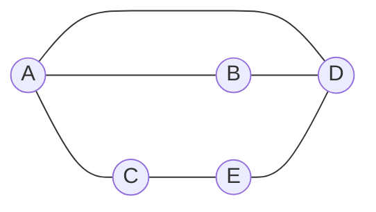

**Directed และ Cyclic** — เส้นทาง A→B→C→D→E→A วนกลับมาที่เดิม จึงเป็น directed cycle

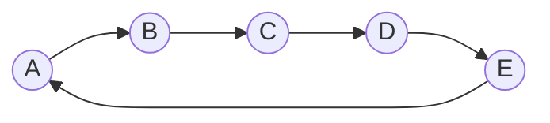

**Weighted (undirected)**

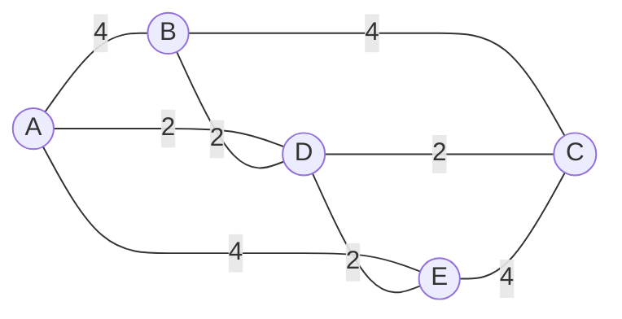

รายการเส้นเชื่อม (ใช้อ่านประกอบภาพ): A–B 4 · A–D 2 · A–E 4 · B–D 2 · B–C 4 · D–E 2 · D–C 2 · E–C 4

### 1.3 การแทนกราฟ (Graph Representation)

มี 2 วิธี: **Adjacency Matrix** และ **Adjacency List**

#### Adjacency Matrix

- เก็บความสัมพันธ์ของ vertices กับ edges ในตาราง
- vertices เป็นทั้ง **แถวและคอลัมน์** → กราฟ N จุด ได้เมทริกซ์ขนาด **N × N**
- ช่อง $M_{ij} = 1$ หมายถึง **มีเส้นเชื่อมจาก i ไป j** (แถว = From, คอลัมน์ = To)
- กราฟมีน้ำหนัก: ใส่ **ค่าน้ำหนัก** แทนเลข 1

**(ก) Undirected** — เส้นเชื่อม: AB, AE, BC, BE, CD, DE

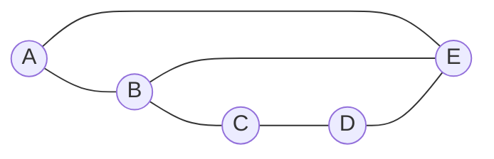

| From \\ To | A | B | C | D | E |
| --- | --- | --- | --- | --- | --- |
| **A** | 0 | 1 | 0 | 0 | 1 |
| **B** | 1 | 0 | 1 | 0 | 1 |
| **C** | 0 | 1 | 0 | 1 | 0 |
| **D** | 0 | 0 | 1 | 0 | 1 |
| **E** | 1 | 1 | 0 | 1 | 0 |

แถว A: ช่อง AB และ AE เป็น 1 เพราะมีเส้นจาก A ไป B และ A ไป E

**(ข) Directed** — เส้นเชื่อม: A→B, A→E, B→C, B→D, D→A, D→C, D→E, E→B, E→D

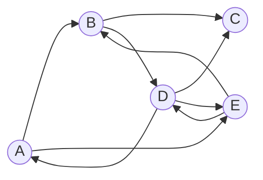

| From \\ To | A | B | C | D | E |
| --- | --- | --- | --- | --- | --- |
| **A** | 0 | 1 | 0 | 0 | 1 |
| **B** | 0 | 0 | 1 | 1 | 0 |
| **C** | 0 | 0 | 0 | 0 | 0 |
| **D** | 1 | 0 | 1 | 0 | 1 |
| **E** | 0 | 1 | 0 | 1 | 0 |

ช่อง AB = 1 แต่ BA = 0 เพราะไม่มีเส้นที่ชี้จาก B ไป A

**(ค) Directed Weighted** — A→B (4), B→C (3), B→D (3), C→A (2), C→E (2), E→B (5), E→D (2)

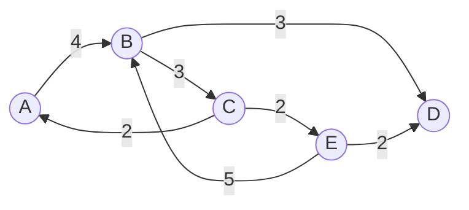

| From \\ To | A | B | C | D | E |
| --- | --- | --- | --- | --- | --- |
| **A** | 0 | 4 | 0 | 0 | 0 |
| **B** | 0 | 0 | 3 | 3 | 0 |
| **C** | 2 | 0 | 0 | 0 | 2 |
| **D** | 0 | 0 | 0 | 0 | 0 |
| **E** | 0 | 5 | 0 | 2 | 0 |

จาก Adjacency Matrix สามารถ **สร้างกลับเป็นกราฟ** ได้: อ่านทีละแถว ช่องไหนไม่เป็น 0 ก็ลากเส้นจากชื่อแถวไปชื่อคอลัมน์ พร้อมเขียนน้ำหนักกำกับ

#### Adjacency List

- เป็นการแทนแบบ **ลิงก์** — ใช้อาร์เรย์ของ Linked List โดยแต่ละช่องของอาร์เรย์คือ vertex หนึ่งตัว
- การมีเส้นเชื่อมระหว่างสอง vertex แทนด้วย **pointer** จากตัวแรกไปตัวที่สอง
- มี list ของตัวเองสำหรับ **ทุก vertex**
- โหนดสุดท้ายของแต่ละ list เก็บ **NULL** ในช่อง next
- กราฟมีน้ำหนัก: เพิ่ม **ฟิลด์น้ำหนัก** ในแต่ละโหนดของ list

**(ก) Undirected** (กราฟเดียวกับเมทริกซ์ ก)

```text
A → B → E → null
B → A → C → E → null
C → B → D → null
D → C → E → null
E → A → B → D → null
```

จำนวนเส้นเชื่อม = 6 แต่ความยาวรวมของทุก list = 2 + 3 + 2 + 2 + 3 = **12** → กราฟไม่มีทิศทาง ความยาวรวม = **2 เท่าของจำนวน edge** (แต่ละเส้นถูกบันทึกสองฝั่ง)

**(ข) Directed** (กราฟเดียวกับเมทริกซ์ ข)

```text
A → B → E → null
B → C → D → null
C → null
D → A → C → E → null
E → B → D → null
```

ความยาวรวม = 2 + 2 + 0 + 3 + 2 = **9** = จำนวน edge พอดี → กราฟมีทิศทาง ความยาวรวม = **จำนวน edge**

**(ค) Directed Weighted** (กราฟเดียวกับเมทริกซ์ ค) แต่ละโหนดเก็บ (ปลายทาง, น้ำหนัก)

```text
A → (B,4) → null
B → (C,3) → (D,3) → null
C → (A,2) → (E,2) → null
D → null
E → (B,5) → (D,2) → null
```

#### เปรียบเทียบสองวิธี

| | Adjacency Matrix | Adjacency List |
| --- | --- | --- |
| โครงสร้าง | อาร์เรย์ 2 มิติ N × N | อาร์เรย์ของ Linked List |
| พื้นที่ | $N^2$ ช่องเสมอ | ตามจำนวน vertex + edge |
| ถามว่า "i กับ j เชื่อมกันไหม" | ดูช่องเดียว เร็วมาก | ต้องไล่ list ของ i |
| หาเพื่อนบ้านทั้งหมดของ i | ต้องไล่ทั้งแถว | ไล่เฉพาะ list ของ i |
| เหมาะกับ | กราฟที่เส้นเชื่อมหนาแน่น | กราฟที่เส้นเชื่อมน้อย |

(แถวพื้นที่และความเหมาะสมเป็นความรู้เสริม ไม่ได้ระบุในสไลด์)

### ทริคส่วนที่ 1

> [!tip] ทริค 1 — ตรวจเมทริกซ์ด้วยความสมมาตร
> กราฟ **ไม่มีทิศทาง** → เมทริกซ์ต้อง **สมมาตรตามแนวทแยง** ($M_{ij} = M_{ji}$) เสมอ เขียนแค่ครึ่งบนแล้วสะท้อนลงครึ่งล่างได้เลย ถ้าเมทริกซ์ที่โจทย์ให้ไม่สมมาตร แปลว่าเป็นกราฟมีทิศทาง

> [!tip] ทริค 2 — นับจากเมทริกซ์โดยไม่ต้องวาดกราฟ
> | ต้องการหา | Undirected | Directed |
> | --- | --- | --- |
> | จำนวน edge | จำนวนช่องที่ไม่เป็น 0 **หาร 2** | จำนวนช่องที่ไม่เป็น 0 |
> | degree ของ vertex | นับช่องที่ไม่เป็น 0 ในแถว | **แถว** = out-degree (เส้นออก), **คอลัมน์** = in-degree (เส้นเข้า) |
>
> ตัวอย่าง (ข): แถว C เป็น 0 ทั้งแถว → C ไม่มีเส้นออกเลย · คอลัมน์ C มี 1 สองช่อง (จาก B และ D) → มีเส้นเข้า 2 เส้น
> ตัวอย่าง (ก): มี 1 ทั้งหมด 12 ช่อง → 12/2 = 6 edges ✓ ตรงกับความยาวรวมของ Adjacency List

> [!tip] ทริค 3 — แปลง Matrix → List ในบรรทัดเดียว
> list ของ vertex i คือ **ชื่อคอลัมน์ที่ไม่เป็น 0 ในแถว i** เรียงจากซ้ายไปขวา เช่นแถว D ของ (ข) = 1 0 1 0 1 → D → A → C → E

---

## ส่วนที่ 2 — Graph Traversal

การท่องกราฟคือการเยี่ยมทุก vertex ให้ครบ **ตัวละครั้งเดียว** มี 2 แบบ

| | Depth-First (DFS) | Breadth-First (BFS) |
| --- | --- | --- |
| ทิศทาง | ลงลึก (depthward) | แผ่กว้าง (breadthward) |
| โครงสร้างที่ใช้จำ | **Stack** | **Queue** |
| นิสัย | ไปให้สุดทางก่อน ตันแล้วค่อยถอย | เยี่ยมเพื่อนบ้านให้ครบก่อน แล้วค่อยขยับออกไปชั้นถัดไป |

**ข้อตกลงในสไลด์:** ถ้ามีเพื่อนบ้านที่ยังไม่เยี่ยมหลายตัว ให้เลือก **ตามลำดับตัวอักษร**

### 2.1 Depth-First Traversal (DFS)

กฎ 3 ข้อ

- **Rule 1** — เยี่ยม vertex ข้างเคียงที่ยังไม่ถูกเยี่ยม: ทำเครื่องหมาย visited, แสดงผล, แล้ว **push ลง stack**
- **Rule 2** — ถ้าไม่มี vertex ข้างเคียงที่ยังไม่เยี่ยม ให้ **pop** ออกจาก stack (pop ไปเรื่อยๆ จนกว่าตัวบนสุดจะมีเพื่อนบ้านที่ยังไม่เยี่ยม)
- **Rule 3** — ทำ Rule 1 และ 2 ซ้ำจนกว่า **stack จะว่าง**

การดูเพื่อนบ้านให้ดูจาก **ตัวบนสุดของ stack** เสมอ

#### ตัวอย่างที่ 1 — กราฟ 5 จุด เริ่มที่ S

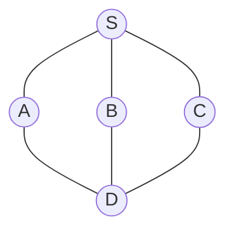

| ขั้น | ตัวบนสุดของ stack | เพื่อนบ้านที่ยังไม่เยี่ยม | ทำอะไร | Stack (ล่าง → บน) | ลำดับการเยี่ยม |
| --- | --- | --- | --- | --- | --- |
| 1 | – | – | เยี่ยม S, push | S | S |
| 2 | S | A, B, C | เลือก A, push | S A | S A |
| 3 | A | D (S เยี่ยมแล้ว) | เยี่ยม D, push | S A D | S A D |
| 4 | D | B, C | เลือก B, push | S A D B | S A D B |
| 5 | B | ไม่มี | pop B | S A D | |
| 6 | D | C | เยี่ยม C, push | S A D C | S A D B C |
| 7 | C | ไม่มี | pop C | S A D | |
| 8 | D → A → S | ไม่มี | pop D, pop A, pop S | ว่าง | จบ |

ผลลัพธ์: **S → A → D → B → C**

#### ตัวอย่างที่ 2 — กราฟ 8 จุด เริ่มที่ S

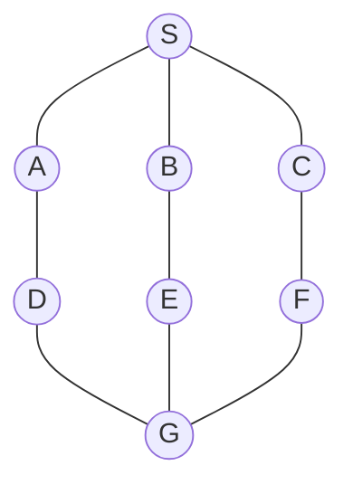

| ขั้น | ทำอะไร | Stack (ล่าง → บน) | Path |
| --- | --- | --- | --- |
| 1 | เยี่ยม S | S | S |
| 2 | จาก S ไป A | S A | S > A |
| 3 | จาก A ไป D | S A D | S > A > D |
| 4 | จาก D ไป G | S A D G | S > A > D > G |
| 5 | จาก G เลือก E (ก่อน F) | S A D G E | S > A > D > G > E |
| 6 | จาก E ไป B | S A D G E B | S > A > D > G > E > B |
| 7 | B ตัน (S เยี่ยมแล้ว) → pop B | S A D G E | |
| 8 | E ตัน → pop E | S A D G | |
| 9 | จาก G ไป F | S A D G F | … > B > F |
| 10 | จาก F ไป C | S A D G F C | … > B > F > C |
| 11 | ทุกตัวตัน → pop C, F, G, D, A, S | ว่าง | จบ |

ผลลัพธ์: **S > A > D > G > E > B > F > C**

### 2.2 Breadth-First Traversal (BFS)

กฎ 3 ข้อ

- **Rule 1** — เยี่ยม vertex ข้างเคียงที่ยังไม่ถูกเยี่ยม: ทำเครื่องหมาย visited, แสดงผล, แล้ว **ใส่ลง queue**
- **Rule 2** — ถ้าไม่มี vertex ข้างเคียงที่ยังไม่เยี่ยม ให้ **นำตัวแรกออกจาก queue** (แล้วพิจารณาเพื่อนบ้านของตัวนั้นต่อ)
- **Rule 3** — ทำ Rule 1 และ 2 ซ้ำจนกว่า **queue จะว่าง**

#### ตัวอย่างที่ 1 — กราฟ 5 จุดเดิม เริ่มที่ S

| ขั้น | โหนดที่กำลังพิจารณา | ทำอะไร | Queue (หน้า → หลัง) |
| --- | --- | --- | --- |
| 1 | S | เยี่ยม S | ว่าง |
| 2 | S | เยี่ยม A, enqueue | A |
| 3 | S | เยี่ยม B, enqueue | A B |
| 4 | S | เยี่ยม C, enqueue | A B C |
| 5 | S หมดเพื่อนบ้าน | dequeue ได้ A | B C |
| 6 | A | เยี่ยม D, enqueue | B C D |
| 7 | ไม่เหลือโหนดที่ยังไม่เยี่ยม | dequeue B, C, D จน queue ว่าง | ว่าง → จบ |

ผลลัพธ์: **S → A → B → C → D**

#### ตัวอย่างที่ 2 — กราฟ 8 จุดเดิม เริ่มที่ S

| รอบ | PATH (โหนดที่นำออกมาพิจารณาแล้ว) | เพิ่มเข้า queue | Queue หลังจบรอบ |
| --- | --- | --- | --- |
| R1 | S | A, B, C | A B C |
| R2 | S-A | D | B C D |
| R3 | S-A-B | E | C D E |
| R4 | S-A-B-C | F | D E F |
| R5 | S-A-B-C-D | G | E F G |
| R6 | S-A-B-C-D-E | – | F G |
| R7 | S-A-B-C-D-E-F | – | G |
| R8 | S-A-B-C-D-E-F-G | – | ว่าง → จบ |

ผลลัพธ์: **S-A-B-C-D-E-F-G**

#### ตัวอย่างที่ 3 — กราฟ 8 จุดเดิม เริ่มที่ E

| รอบ | PATH | เพิ่มเข้า queue | Queue หลังจบรอบ |
| --- | --- | --- | --- |
| R1 | E | B, G | B G |
| R2 | E-B | S | G S |
| R3 | E-B-G | D, F | S D F |
| R4 | E-B-G-S | A, C | D F A C |
| R5 | E-B-G-S-D | – | F A C |
| R6 | E-B-G-S-D-F | – | A C |
| R7 | E-B-G-S-D-F-A | – | C |
| R8 | E-B-G-S-D-F-A-C | – | ว่าง → จบ |

ผลลัพธ์: **E-B-G-S-D-F-A-C**

(ตัวเลข 1–7 บนเส้นในภาพสไลด์หน้า 45 คือ **ลำดับที่โหนดถูกเยี่ยม** ไม่ใช่น้ำหนักของเส้น)

### โค้ด (Adjacency Matrix)

```java
// DFS ตามกฎในสไลด์: ดูตัวบนสุดของ stack หาเพื่อนบ้านที่ยังไม่เยี่ยม
void dfs(int[][] adj, int start) {
    int n = adj.length;
    boolean[] visited = new boolean[n];
    Stack<Integer> stack = new Stack<>();
    visited[start] = true;
    System.out.print(start + " ");
    stack.push(start);
    while (!stack.isEmpty()) {                       // Rule 3
        int top = stack.peek();
        int next = -1;
        for (int v = 0; v < n; v++) {                // ไล่ตามลำดับ = ตามตัวอักษร
            if (adj[top][v] != 0 && !visited[v]) { next = v; break; }
        }
        if (next == -1) {
            stack.pop();                             // Rule 2: ตัน → pop
        } else {
            visited[next] = true;                    // Rule 1: เยี่ยม แสดงผล push
            System.out.print(next + " ");
            stack.push(next);
        }
    }
}

// BFS: เยี่ยมเพื่อนบ้านทั้งหมดของโหนดปัจจุบัน แล้วค่อย dequeue ตัวถัดไป
void bfs(int[][] adj, int start) {
    int n = adj.length;
    boolean[] visited = new boolean[n];
    Queue<Integer> queue = new LinkedList<>();
    visited[start] = true;
    System.out.print(start + " ");
    int current = start;
    while (true) {
        for (int v = 0; v < n; v++) {                // Rule 1
            if (adj[current][v] != 0 && !visited[v]) {
                visited[v] = true;
                System.out.print(v + " ");
                queue.add(v);
            }
        }
        if (queue.isEmpty()) break;                  // Rule 3
        current = queue.remove();                    // Rule 2
    }
}
```

### ทริคส่วนที่ 2

> [!tip] ทริค 1 — BFS คือการอ่านกราฟ "ทีละชั้น" ตามระยะห่างจากจุดเริ่ม
> ไม่ต้องจำลอง queue ก็เขียนคำตอบได้: จัดโหนดเป็นชั้นตามจำนวนเส้นที่ห่างจากจุดเริ่ม แล้วอ่านทีละชั้น
>
> | เริ่มที่ | ชั้น 0 | ชั้น 1 | ชั้น 2 | ชั้น 3 |
> | --- | --- | --- | --- | --- |
> | S | S | A B C | D E F | G |
> | E | E | B G | S D F | A C |
>
> ภายในชั้นเดียวกัน ลำดับขึ้นกับ **ลำดับของแม่ในชั้นก่อนหน้า** (แม่ที่มาก่อน ลูกมาก่อน) แล้วจึงเรียงตามตัวอักษรในกลุ่มลูกของแม่เดียวกัน เช่นเริ่มที่ E: ลูกของ B (S) มาก่อนลูกของ G (D, F) → S D F
> ใช้ queue จริงตอนเขียนวิธีทำ และใช้วิธีนี้ตรวจคำตอบ

> [!tip] ทริค 2 — DFS คือ "เดินเขาวงกตโดยเอามือแตะกำแพง"
> จากโหนดปัจจุบัน เลือกเพื่อนบ้านที่ยังไม่เยี่ยมตัวที่ **อักษรมาก่อน** แล้วเดินไปเลย ไม่ต้องสนใจเพื่อนบ้านตัวอื่นจนกว่าจะตัน เมื่อตันให้ถอยกลับทีละก้าว (pop) จนถึงโหนดที่ยังมีทางไป
> ข้อสังเกตที่ช่วยได้: **สิ่งที่อยู่ใน stack ณ ขณะใดๆ คือเส้นทางจากจุดเริ่มถึงโหนดปัจจุบัน** พอดี

> [!tip] ทริค 3 — ตรวจคำตอบ traversal
> - ทุก vertex ต้องปรากฏ **ครั้งเดียวพอดี** (กราฟ 8 จุด คำตอบต้องมี 8 ตัว)
> - DFS: โหนดที่อยู่ติดกันในคำตอบ ต้องมีเส้นเชื่อมกัน **หรือ** เกิดหลังการถอยกลับ (pop)
> - BFS: เพื่อนบ้านทั้งหมดของจุดเริ่มต้องมาเป็นกลุ่มแรกต่อจากจุดเริ่ม
> - จำนวน push/enqueue ทั้งหมด = จำนวน vertex และจบเมื่อ stack/queue **ว่าง** ไม่ใช่เมื่อเยี่ยมครบ

> [!warning] ผิดบ่อย
> - ลืมว่า BFS ต้องเยี่ยมเพื่อนบ้าน **ให้ครบทุกตัว** ของโหนดปัจจุบันก่อน dequeue ตัวถัดไป
> - DFS: หลัง pop แล้วต้องกลับไปดูเพื่อนบ้านของตัวบนสุดตัวใหม่ **อีกครั้ง** (ขั้น 9 ของตัวอย่างที่ 2: กลับมาที่ G แล้วพบว่ายังมี F)
> - ลืมกติกาเลือกตามลำดับตัวอักษร ทำให้ได้คำตอบที่เป็น traversal ถูกต้องแต่ไม่ตรงเฉลย

---

## ส่วนที่ 3 — Minimum Spanning Tree (MST)

### 3.1 นิยาม

**Spanning Tree** คือต้นไม้ที่

- ประกอบด้วย **ทุกโหนด** ของกราฟ
- แต่ละคู่โหนดมีเส้นทางเชื่อมถึงกัน **เพียงเส้นทางเดียว** — ไม่มี loop หรือ cycle
- เป็นซับเซตของกราฟแบบ **ไม่มีทิศทาง**

เมื่อใช้กับ **กราฟมีน้ำหนัก** และต้องการให้ **ผลรวมน้ำหนักทั้งหมดน้อยที่สุด** เรียกว่า **Minimum Spanning Tree**

**จุดประสงค์**

| จุดประสงค์ | ความหมาย |
| --- | --- |
| ลดค่าใช้จ่าย | เชื่อมทุกจุดด้วยน้ำหนักรวมน้อยที่สุด เช่นออกแบบเครือข่ายคอมพิวเตอร์ วางระบบท่อ วางสายไฟฟ้า โครงสร้างพื้นฐาน |
| ประสิทธิภาพในเครือข่าย | ลดความซ้ำซ้อน สร้างเครือข่ายสื่อสารที่มีประสิทธิภาพและค่าใช้จ่ายต่ำ |
| วิเคราะห์และเพิ่มประสิทธิภาพระบบ | วิเคราะห์ระบบที่มีอยู่และปรับปรุง เช่นหาเส้นทางขนส่งที่ประหยัดที่สุด |

**ตัวอย่างการประยุกต์:** ออกแบบเครือข่ายคอมพิวเตอร์ · วางระบบท่อหรือสายไฟเชื่อมทุกบ้านในเมือง · วางแผนเส้นทางขนส่งสินค้า

อัลกอริทึมที่นิยมมี 2 ตัว ทั้งคู่ใช้กับกราฟ **มีน้ำหนักและไม่มีทิศทาง**

| | Prim's Algorithm | Kruskal's Algorithm |
| --- | --- | --- |
| มุมมอง | **โตจากจุดเดียว** ขยายต้นไม้ทีละโหนด | **มองเส้นทั้งกราฟ** หยิบเส้นถูกสุดทีละเส้น |
| เริ่มต้น | เลือกโหนดเริ่มต้น | เรียงเส้นเชื่อมทั้งหมดจากน้อยไปมาก |
| แต่ละรอบเลือก | เส้นน้ำหนักน้อยสุดที่เชื่อม **โหนดในต้นไม้ → โหนดนอกต้นไม้** | เส้นน้ำหนักน้อยสุดถัดไปที่ **ไม่ทำให้เกิดวงจร** |
| ระหว่างทำ | เป็นต้นไม้ก้อนเดียวเสมอ | อาจเป็นหลายก้อนแยกกัน แล้วค่อยเชื่อมถึงกัน |

### 3.2 Prim's Algorithm

1. **เลือกจุดเริ่มต้น** ใดๆ แล้วทำเครื่องหมายว่าอยู่ในต้นไม้แล้ว
2. **ค้นหาเส้นเชื่อมที่น้ำหนักน้อยที่สุด** ที่เชื่อมจากจุดในต้นไม้ ไปยังจุดที่ยังไม่อยู่ในต้นไม้
3. **เพิ่มเส้นนั้น** เข้าต้นไม้ และทำเครื่องหมายจุดปลายทางว่าอยู่ในต้นไม้แล้ว
4. **ทำซ้ำ** ข้อ 2–3 จนทุกจุดอยู่ในต้นไม้

#### ตัวอย่างที่ 1 — กราฟ 7 จุด เริ่มที่ a

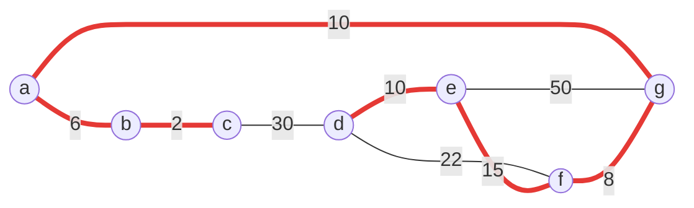

(เส้นหนาสีแดง = เส้นที่อยู่ใน MST)

รายการเส้นเชื่อม: a–b 6 · a–g 10 · b–c 2 · c–d 30 · d–e 10 · d–f 22 · e–f 15 · e–g 50 · f–g 8

| รอบ | โหนดในต้นไม้ | เส้นที่เป็นตัวเลือก (ใน → นอก) | เลือก | น้ำหนัก |
| --- | --- | --- | --- | --- |
| 1 | a | ab 6, ag 10 | **ab** | 6 |
| 2 | a b | bc 2, ag 10 | **bc** | 2 |
| 3 | a b c | ag 10, cd 30 | **ag** | 10 |
| 4 | a b c g | gf 8, cd 30, ge 50 | **gf** | 8 |
| 5 | a b c g f | fe 15, fd 22, cd 30, ge 50 | **fe** | 15 |
| 6 | a b c g f e | ed 10, fd 22, cd 30 | **ed** | 10 |

ครบทุกโหนด → หยุด น้ำหนักรวม = 6 + 2 + 10 + 8 + 15 + 10 = **51**

#### ตัวอย่างที่ 2 — กราฟ 6 จุด เริ่มที่ A

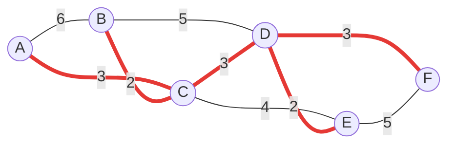

รายการเส้นเชื่อม: A–B 6 · A–C 3 · B–C 2 · B–D 5 · C–D 3 · C–E 4 · D–E 2 · D–F 3 · E–F 5

| รอบ | โหนดในต้นไม้ | เส้นที่เป็นตัวเลือก | เลือก | น้ำหนัก |
| --- | --- | --- | --- | --- |
| 1 | A | AC 3, AB 6 | **AC** | 3 |
| 2 | A C | CB 2, CD 3, CE 4, AB 6 | **BC** | 2 |
| 3 | A C B | CD 3, CE 4, BD 5 | **CD** | 3 |
| 4 | A C B D | DE 2, DF 3, CE 4 | **DE** | 2 |
| 5 | A C B D E | DF 3, EF 5 | **DF** | 3 |

น้ำหนักรวม = 3 + 2 + 3 + 2 + 3 = **13**

### 3.3 Kruskal's Algorithm

1. **เรียงลำดับเส้นเชื่อม** ทั้งหมดตามน้ำหนักจากน้อยไปมาก
2. **เลือกเส้นเชื่อม** เริ่มจากน้ำหนักน้อยที่สุดเพิ่มเข้าต้นไม้ โดยตรวจว่าเส้นที่เลือก **ไม่ทำให้เกิดวงจร**
3. **ทำซ้ำ** จนมีเส้นทางไปยังครบทุกโหนด

#### ตัวอย่างที่ 1 — กราฟ 7 จุดเดิม

| เส้น | bc | ab | fg | ag | ed | ef | df | cd | eg |
| --- | --- | --- | --- | --- | --- | --- | --- | --- | --- |
| น้ำหนัก | 2 | 6 | 8 | 10 | 10 | 15 | 22 | 30 | 50 |

| ลำดับ | เส้น | น้ำหนัก | เกิดวงจร? | ผล | กลุ่มโหนดที่เชื่อมกันแล้ว |
| --- | --- | --- | --- | --- | --- |
| 1 | bc | 2 | ไม่ | เลือก | {b c} |
| 2 | ab | 6 | ไม่ | เลือก | {a b c} |
| 3 | fg | 8 | ไม่ | เลือก | {a b c} {f g} |
| 4 | ag | 10 | ไม่ | เลือก | {a b c f g} |
| 5 | ed | 10 | ไม่ | เลือก | {a b c f g} {d e} |
| 6 | ef | 15 | ไม่ | เลือก | {a b c d e f g} ครบ → หยุด |

เส้นที่เหลือ (df 22, cd 30, eg 50) ไม่ต้องพิจารณา น้ำหนักรวม = 2 + 6 + 8 + 10 + 10 + 15 = **51**

ได้ต้นไม้ **เดียวกับ Prim** ทุกเส้น (สไลด์หน้า 76 วางเทียบกันให้ดู)

#### ตัวอย่างที่ 2 — กราฟ 7 จุด (A–G)

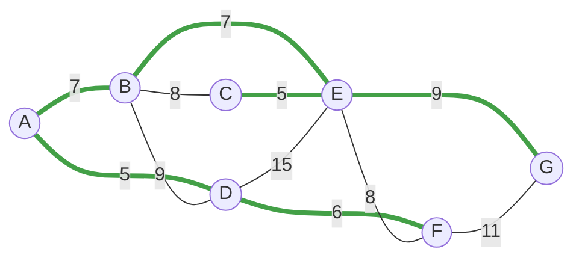

(เส้นหนาสีเขียว = เส้นที่อยู่ใน MST · น้ำหนักของทุกเส้นดูได้จากตารางด้านล่าง)

| เส้น | AD | CE | DF | AB | BE | BC | EF | BD | EG | FG | DE |
| --- | --- | --- | --- | --- | --- | --- | --- | --- | --- | --- | --- |
| น้ำหนัก | 5 | 5 | 6 | 7 | 7 | 8 | 8 | 9 | 9 | 11 | 15 |

| ลำดับ | เส้น | น้ำหนัก | เกิดวงจร? | ผล | กลุ่มโหนดที่เชื่อมกันแล้ว |
| --- | --- | --- | --- | --- | --- |
| 1 | AD | 5 | ไม่ | เลือก | {A D} |
| 2 | CE | 5 | ไม่ | เลือก | {A D} {C E} |
| 3 | DF | 6 | ไม่ | เลือก | {A D F} {C E} |
| 4 | AB | 7 | ไม่ | เลือก | {A B D F} {C E} |
| 5 | BE | 7 | ไม่ | เลือก | {A B C D E F} |
| 6 | BC | 8 | **เกิด** (B, C อยู่กลุ่มเดียวกันแล้ว) | ข้าม | – |
| 7 | EF | 8 | **เกิด** | ข้าม | – |
| 8 | BD | 9 | **เกิด** | ข้าม | – |
| 9 | EG | 9 | ไม่ | เลือก | {A B C D E F G} ครบ → หยุด |

ข้อสังเกตตามสไลด์: พอเลือก AB แล้ว **BD** เลือกไม่ได้อีก (A–B–D–A จะเป็นวงจร) และพอเลือก BE แล้ว **BC, EF, DE** ก็เลือกไม่ได้เช่นกัน

น้ำหนักรวม = 5 + 5 + 6 + 7 + 7 + 9 = **39**

### ทริคส่วนที่ 3

> [!tip] ทริค 1 — MST ของกราฟ V จุด มี V − 1 เส้นเสมอ
> ใช้เป็นเงื่อนไขหยุดและตรวจคำตอบ: กราฟ 7 จุด → 6 เส้น · กราฟ 6 จุด → 5 เส้น ใน Kruskal พอเลือกครบ V − 1 เส้นก็หยุดได้ทันที ไม่ต้องไล่เส้นที่เหลือ

> [!tip] ทริค 2 — ตรวจวงจรใน Kruskal ด้วย "กลุ่ม" ไม่ต้องมองภาพ
> จดกลุ่มของโหนดที่เชื่อมถึงกันแล้วไว้ (คอลัมน์ขวาสุดของตาราง) เส้นใดที่ **ปลายทั้งสองข้างอยู่ในกลุ่มเดียวกัน → เกิดวงจร ข้าม** ถ้าอยู่คนละกลุ่ม → เลือก แล้วรวมสองกลุ่มเป็นกลุ่มเดียว วิธีนี้ไม่พลาดแม้กราฟจะยุ่ง (เป็นแนวคิดเดียวกับโครงสร้าง Union-Find ที่ใช้เขียนโปรแกรมจริง)

> [!tip] ทริค 3 — ใช้อีกอัลกอริทึมตรวจคำตอบ
> Prim กับ Kruskal ต้องได้ **น้ำหนักรวมเท่ากันเสมอ** (ถ้าน้ำหนักของทุกเส้นไม่ซ้ำกัน จะได้ต้นไม้เดียวกันทุกเส้นด้วย) Kruskal มักทำมือเร็วกว่า ถ้าโจทย์สั่ง Prim ให้ทำ Prim แล้วใช้ Kruskal ตรวจผลรวม
> เช่นตัวอย่างที่ 2 ของ Prim ลองทำ Kruskal: BC 2, DE 2, AC 3, CD 3, DF 3 = 13 ✓ · ตัวอย่างที่ 2 ของ Kruskal ลองทำ Prim จาก A: AD 5, DF 6, AB 7, BE 7, EC 5, EG 9 = 39 ✓

> [!tip] ทริค 4 — Prim: เส้นที่ไม่ต้องดูอีกแล้ว
> เส้นที่ **ปลายทั้งสองข้างอยู่ในต้นไม้แล้ว** ให้ขีดทิ้งจากรายการตัวเลือกได้เลย (เช่นรอบ 6 ของตัวอย่างที่ 1 เส้น ge 50 หายไปเพราะทั้ง g และ e อยู่ในต้นไม้แล้ว) นอกจากนี้เมื่อน้ำหนักไม่ซ้ำกัน เส้นที่น้ำหนักน้อยที่สุดของทั้งกราฟ และเส้นที่น้ำหนักน้อยที่สุดที่ติดกับแต่ละโหนด จะอยู่ใน MST เสมอ ใช้เดาโครงคำตอบล่วงหน้าได้ (ตัวอย่างที่ 1: เส้นที่ถูกสุดของ a คือ ab, ของ c คือ bc, ของ d คือ de, ของ g คือ fg ล้วนอยู่ใน MST)

> [!note] เมื่อน้ำหนักเท่ากัน
> ถ้ามีตัวเลือกน้ำหนักเท่ากันหลายเส้น เลือกเส้นใดก่อนก็ได้ หน้าตาต้นไม้อาจต่างกัน แต่ **ผลรวมน้ำหนักจะเท่ากัน** เช่นกราฟ weighted ในส่วนที่ 1 (น้ำหนัก 2 กับ 4) ได้ MST = AD, BD, CD, DE รวม 8

---

## ส่วนที่ 4 — Shortest Path (Dijkstra's Algorithm)

### 4.1 แนวคิด

การค้นหาเส้นทางที่สั้นที่สุด คือการหาเส้นทางส่งข้อมูลจาก **ต้นทางไปปลายทาง** โดยให้ระยะทาง (ผลรวมน้ำหนัก) สั้นที่สุด อัลกอริทึมที่ใช้คือ **Dijkstra's Algorithm**

### 4.2 ขั้นตอนมาตรฐาน

1. แทรก vertex **เริ่มต้น** ลงใน Tree (กำหนดโหนดเริ่มต้น ระยะสะสม T = 0)
2. เลือก edge จาก vertex ใน Tree ไปยัง vertex ที่ **ยังไม่อยู่ใน Tree** ซึ่งมี **ผลรวมของ weight น้อยที่สุด** (เป็นผลรวม **สะสม** จากจุดเริ่มต้น) แล้วแทรกลงใน Tree
3. ทำซ้ำข้อ 2 จนครบทุก vertex

วิธีทำตามสไลด์ในแต่ละรอบ: (ก) พิจารณาโหนดข้างเคียงของโหนดที่อยู่ใน Tree แล้วคำนวณ **ค่าน้ำหนักสะสม T** เขียนกำกับไว้ที่โหนด (ข) เลือกโหนดที่ T น้อยที่สุดซึ่งยังไม่อยู่ใน Tree ลงมาเพิ่ม

#### ตัวอย่างที่ 1 — กราฟ 4 จุด เริ่มที่ b

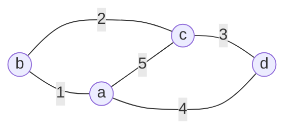

รายการเส้นเชื่อม: b–a 1 · b–c 2 · a–c 5 · c–d 3 · a–d 4

| Step | โหนดใน Tree | คำนวณน้ำหนักสะสมของโหนดข้างเคียง | เลือก |
| --- | --- | --- | --- |
| 1 | b (T=0) | a: 0 + 1 = **1** · c: 0 + 2 = 2 | **a** (T = 1) |
| 2 | b, a | c ผ่าน b: 0 + 2 = **2** · c ผ่าน a: 1 + 5 = 6 · d ผ่าน a: 1 + 4 = 5 | **c** (T = 2) |
| 3 | a, b, c | d ผ่าน c: 2 + 3 = **5** · d ผ่าน a: 1 + 4 = **5** | **d** (T = 5) |

Step 3: สองเส้นทางได้ค่าเท่ากัน (5) → **เลือกเส้นทางใดก็ได้** d มีเส้นทางสั้นที่สุด 2 เส้นทางคือ b–c–d และ b–a–d

| ปลายทาง | ระยะสั้นที่สุด | เส้นทาง |
| --- | --- | --- |
| a | 1 | b–a |
| c | 2 | b–c |
| d | 5 | b–c–d หรือ b–a–d |

#### ตัวอย่างที่ 2 — กราฟ 6 จุด เริ่มที่ A

(กราฟเดียวกับตัวอย่างที่ 2 ของ Prim)

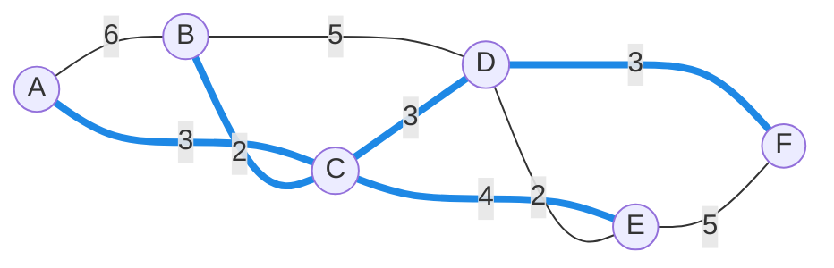

(เส้นหนาสีน้ำเงิน = ต้นไม้เส้นทางสั้นที่สุดจาก A) · รายการเส้นเชื่อมเหมือนตัวอย่างที่ 2 ของ Prim: A–B 6 · A–C 3 · B–C 2 · B–D 5 · C–D 3 · C–E 4 · D–E 2 · D–F 3 · E–F 5

| รอบ | โหนดใน Tree | เส้นทางที่เป็นไปได้ (ค่าสะสม T) | เลือก |
| --- | --- | --- | --- |
| 1 | A (0) | B ผ่าน A: 6 · C ผ่าน A: **3** | **C** (T = 3) |
| 2 | A, C | B ผ่าน A: 6 · B ผ่าน C: 3 + 2 = **5** · D ผ่าน C: 3 + 3 = 6 · E ผ่าน C: 3 + 4 = 7 | **B** (T = 5) |
| 3 | A, C, B | D ผ่าน C: **6** · D ผ่าน B: 5 + 5 = 10 · E ผ่าน C: 7 | **D** (T = 6) |
| 4 | A, C, B, D | E ผ่าน C: **7** · E ผ่าน D: 6 + 2 = 8 · F ผ่าน D: 6 + 3 = 9 | **E** (T = 7) |
| 5 | A, C, B, D, E | F ผ่าน D: **9** · F ผ่าน E: 7 + 5 = 12 | **F** (T = 9) |

| ปลายทาง | B | C | D | E | F |
| --- | --- | --- | --- | --- | --- |
| ระยะสั้นที่สุดจาก A | 5 | 3 | 6 | 7 | 9 |
| เส้นทาง | A–C–B | A–C | A–C–D | A–C–E | A–C–D–F |

### 4.3 วิธีตาราง — ทำเร็วกว่าและตรวจง่ายกว่าการวาดต้นไม้ทุกรอบ

> [!tip] ทริค 1 — ตาราง Dijkstra
> สร้างตาราง 1 คอลัมน์ต่อ 1 โหนด แต่ละแถวคือ 1 รอบ ในช่องเขียน **ระยะสะสมที่ดีที่สุดเท่าที่รู้ (มาจากโหนดไหน)**
> 1. แถวแรก: จุดเริ่ม = 0 ที่เหลือ = ∞
> 2. แต่ละรอบ: เลือกโหนดที่ **ยังไม่ปิด** และค่าน้อยที่สุด → ปิดโหนดนั้น (ค่านี้คือคำตอบสุดท้ายของมัน)
> 3. อัปเดตเพื่อนบ้านที่ยังไม่ปิด: ถ้า `ค่าของโหนดที่ปิด + น้ำหนักเส้น` **น้อยกว่า** ค่าเดิม ให้เขียนทับ ไม่เช่นนั้นลอกค่าเดิมลงมา
> 4. ทำจนปิดครบทุกโหนด

ตัวอย่างที่ 2 ด้วยวิธีตาราง (✓ = ปิดแล้ว, ตัวอักษรในวงเล็บ = มาจากโหนดไหน)

| รอบ | โหนดที่ปิด | A | B | C | D | E | F |
| --- | --- | --- | --- | --- | --- | --- | --- |
| เริ่ม | – | 0 | ∞ | ∞ | ∞ | ∞ | ∞ |
| 1 | A (0) | ✓ | 6 (A) | 3 (A) | ∞ | ∞ | ∞ |
| 2 | C (3) | | 5 (C) | ✓ | 6 (C) | 7 (C) | ∞ |
| 3 | B (5) | | ✓ | | 6 (C) | 7 (C) | ∞ |
| 4 | D (6) | | | | ✓ | 7 (C) | 9 (D) |
| 5 | E (7) | | | | | ✓ | 9 (D) |
| 6 | F (9) | | | | | | ✓ |

> [!tip] ทริค 2 — หาเส้นทางด้วยการ "เดินย้อน" ตามวงเล็บ
> อยากรู้เส้นทางไป F: F มาจาก (D) → D มาจาก (C) → C มาจาก (A) → กลับลำดับได้ **A–C–D–F** ไม่ต้องจำเส้นทางระหว่างทำเลย

> [!tip] ทริค 3 — ตรวจคำตอบ
> - ค่าของโหนดที่ถูกปิดต้อง **ไม่ลดลง** ตามลำดับการปิด (0, 3, 5, 6, 7, 9) ถ้ารอบหลังปิดด้วยค่าน้อยกว่ารอบก่อน แปลว่าทำผิด
> - ระยะสั้นสุดของโหนดใด ต้องไม่มากกว่า "ระยะของเพื่อนบ้าน + น้ำหนักเส้นที่เชื่อม" ของเพื่อนบ้านทุกตัว

> [!warning] Prim กับ Dijkstra หน้าตาเหมือนกัน แต่ **เทียบคนละค่า**
> | | Prim (MST) | Dijkstra (Shortest Path) |
> | --- | --- | --- |
> | ค่าที่ใช้เลือก | **น้ำหนักของเส้นเดียว** ที่เชื่อมเข้าต้นไม้ | **ระยะสะสมจากจุดเริ่มต้น** ถึงโหนดนั้น |
> | เป้าหมาย | ผลรวมน้ำหนักทั้งต้นน้อยที่สุด | ระยะจากจุดเริ่มไปแต่ละโหนดน้อยที่สุด |
>
> บนกราฟ 6 จุดเดียวกัน เริ่มที่ A เหมือนกัน:
> - Prim ได้เส้น AC, BC, CD, **DE**, DF (รวม 13)
> - Dijkstra ได้เส้น AC, BC, CD, **CE**, DF (รวม 15)
>
> ต่างกันที่โหนด E: Prim เลือก DE เพราะเส้นหนัก 2 ถูกกว่า CE (4) แต่ Dijkstra เลือก CE เพราะระยะสะสม A–C–E = 7 สั้นกว่า A–C–D–E = 8
> ข้อผิดพลาดอันดับหนึ่งของบทนี้คือ **ลืมบวกสะสมใน Dijkstra** หรือ **เผลอบวกสะสมใน Prim**

> [!note] ข้อจำกัด (ความรู้เสริม)
> Dijkstra ใช้ได้เมื่อน้ำหนักทุกเส้น **ไม่ติดลบ** และถ้าใช้ Priority Queue (Min-Heap จาก [[Ch9 Priority Queue]]) ช่วยเลือกโหนดที่ระยะน้อยที่สุด จะทำงานได้เร็วขึ้นมาก

### โค้ด (Adjacency Matrix, 0 = ไม่มีเส้น)

```java
// Dijkstra: คืนระยะสั้นที่สุดจาก src ไปทุกโหนด
int[] dijkstra(int[][] w, int src) {
    int n = w.length;
    int[] dist = new int[n];
    boolean[] inTree = new boolean[n];
    Arrays.fill(dist, Integer.MAX_VALUE);
    dist[src] = 0;                                   // ขั้นที่ 1
    for (int round = 0; round < n; round++) {
        int u = -1;
        for (int v = 0; v < n; v++)                  // ขั้นที่ 2: เลือก T น้อยสุดที่ยังไม่อยู่ใน Tree
            if (!inTree[v] && (u == -1 || dist[v] < dist[u])) u = v;
        if (dist[u] == Integer.MAX_VALUE) break;     // ที่เหลือไปไม่ถึง
        inTree[u] = true;
        for (int v = 0; v < n; v++)                  // อัปเดตค่าสะสมของเพื่อนบ้าน
            if (w[u][v] != 0 && !inTree[v] && dist[u] + w[u][v] < dist[v])
                dist[v] = dist[u] + w[u][v];         // Prim ต่างตรงนี้: ใช้ w[u][v] เฉยๆ
    }
    return dist;
}

// Prim: คืนน้ำหนักรวมของ MST
int prim(int[][] w, int start) {
    int n = w.length, total = 0;
    int[] key = new int[n];                          // น้ำหนักเส้นที่ถูกสุดที่เชื่อมเข้าต้นไม้
    boolean[] inTree = new boolean[n];
    Arrays.fill(key, Integer.MAX_VALUE);
    key[start] = 0;
    for (int round = 0; round < n; round++) {
        int u = -1;
        for (int v = 0; v < n; v++)
            if (!inTree[v] && (u == -1 || key[v] < key[u])) u = v;
        inTree[u] = true;
        total += key[u];
        for (int v = 0; v < n; v++)
            if (w[u][v] != 0 && !inTree[v] && w[u][v] < key[v])
                key[v] = w[u][v];                    // เทียบน้ำหนักเส้นเดียว ไม่สะสม
    }
    return total;
}
```

```java
// Kruskal: edges[i] = {u, v, weight}
int kruskal(int n, int[][] edges) {
    Arrays.sort(edges, (x, y) -> x[2] - y[2]);       // 1) เรียงตามน้ำหนัก
    int[] group = new int[n];
    for (int i = 0; i < n; i++) group[i] = i;        // ตอนแรกทุกโหนดอยู่กลุ่มของตัวเอง
    int total = 0, count = 0;
    for (int[] e : edges) {
        int gu = find(group, e[0]), gv = find(group, e[1]);
        if (gu != gv) {                              // 2) คนละกลุ่ม = ไม่เกิดวงจร
            group[gu] = gv;                          // รวมกลุ่ม
            total += e[2];
            if (++count == n - 1) break;             // 3) ครบ V-1 เส้น หยุด
        }
    }
    return total;
}

int find(int[] group, int x) {
    while (group[x] != x) x = group[x];
    return x;
}
```

---

## ข้อสังเกตจากสไลด์ (จุดที่พิมพ์คลาดเคลื่อน)

| หน้า | ที่เขียนในสไลด์ | ที่ควรเป็น |
| --- | --- | --- |
| 9 | "intersection $M_{ij}$ in the adjacency **list** = 1" | adjacency **matrix** |
| 40 | "At this stage, we are left with no unmarked nodes" ตามด้วยการ dequeue | ถูกต้องตามหลัก: แม้เยี่ยมครบแล้วก็ต้อง dequeue จน queue ว่างจึงจบ |
| 45 | ตัวเลข 1–7 บนเส้นของกราฟ | เป็นลำดับการเยี่ยมของ BFS จาก E ไม่ใช่น้ำหนัก |
| 49 | มีเครื่องหมาย \*\* ค้างในข้อความ | เป็นสัญลักษณ์ตัวหนาที่ไม่ได้ถูกแปลง ไม่มีความหมายพิเศษ |
| 92 | "จงหา Shortest Path จากโหนด ไปยังโหนดอื่นๆ" (ชื่อโหนดหาย) | จากโหนด **A** (ดูจากภาพที่ A เป็นจุดเริ่ม T:0) |

---

## แบบฝึกหัดพร้อมเฉลย

**ข้อ 1** จงเขียน Adjacency Matrix และ Adjacency List ของกราฟไม่มีทิศทาง V = {A, B, C, D, E}, E = {AB, AC, AD, BD, CE, ED}

> [!success]- เฉลยข้อ 1
> | | A | B | C | D | E |
> | --- | --- | --- | --- | --- | --- |
> | **A** | 0 | 1 | 1 | 1 | 0 |
> | **B** | 1 | 0 | 0 | 1 | 0 |
> | **C** | 1 | 0 | 0 | 0 | 1 |
> | **D** | 1 | 1 | 0 | 0 | 1 |
> | **E** | 0 | 0 | 1 | 1 | 0 |
>
> ```text
> A → B → C → D → null
> B → A → D → null
> C → A → E → null
> D → A → B → E → null
> E → C → D → null
> ```
>
> ตรวจ: เมทริกซ์สมมาตร ✓ · มี 1 ทั้งหมด 12 ช่อง = 2 × 6 edges ✓ · ความยาวรวมของ list = 3 + 2 + 2 + 3 + 2 = 12 ✓

**ข้อ 2** จากเมทริกซ์ Directed Weighted (ค) ในส่วนที่ 1 จงหา out-degree และ in-degree ของทุกโหนด และบอกว่าโหนดใดไม่มีเส้นออก

> [!success]- เฉลยข้อ 2
> | โหนด | A | B | C | D | E | รวม |
> | --- | --- | --- | --- | --- | --- | --- |
> | out-degree (นับในแถว) | 1 | 2 | 2 | 0 | 2 | 7 |
> | in-degree (นับในคอลัมน์) | 1 | 2 | 1 | 2 | 1 | 7 |
>
> โหนด **D** ไม่มีเส้นออก (แถว D เป็น 0 ทั้งแถว) ผลรวมทั้งสองแถวเท่ากับจำนวน edge = 7 ✓

**ข้อ 3** จากกราฟ 8 จุด (S, A–G) จงหาลำดับ (ก) DFS เริ่มที่ G (ข) BFS เริ่มที่ G (ค) DFS เริ่มที่ E (ง) BFS เริ่มที่ A

> [!success]- เฉลยข้อ 3
> **(ก) DFS จาก G: G-D-A-S-B-E-C-F**
> G → D (ก่อน E, F) → A → S → B (ก่อน C) → E → ตัน pop E, pop B → กลับมาที่ S ไป C → F → ตัน pop จนหมด
>
> **(ข) BFS จาก G: G-D-E-F-A-B-C-S**
> ชั้น 0: G · ชั้น 1: D E F · ชั้น 2: A (ลูกของ D), B (ลูกของ E), C (ลูกของ F) · ชั้น 3: S
>
> **(ค) DFS จาก E: E-B-S-A-D-G-F-C**
> E → B (ก่อน G) → S → A → D → G → F → C → ตัน pop จนหมด (เดินได้ยาวรวดเดียวโดยไม่ต้องถอยเลย)
>
> **(ง) BFS จาก A: A-D-S-G-B-C-E-F**
> ชั้น 0: A · ชั้น 1: D S · ชั้น 2: G (ลูกของ D), B C (ลูกของ S) · ชั้น 3: E F (ลูกของ G)

**ข้อ 4** จากกราฟ 7 จุด (a–g) จงหา MST ด้วย Prim โดย **เริ่มที่ d**

> [!success]- เฉลยข้อ 4
> | รอบ | โหนดในต้นไม้ | ตัวเลือก | เลือก |
> | --- | --- | --- | --- |
> | 1 | d | de 10, df 22, dc 30 | de 10 |
> | 2 | d e | ef 15, df 22, dc 30, eg 50 | ef 15 |
> | 3 | d e f | fg 8, dc 30, eg 50 | fg 8 |
> | 4 | d e f g | ga 10, dc 30 | ga 10 |
> | 5 | d e f g a | ab 6, dc 30 | ab 6 |
> | 6 | d e f g a b | bc 2, dc 30 | bc 2 |
>
> รวม 10 + 15 + 8 + 10 + 6 + 2 = **51** ได้เส้นชุดเดียวกับตอนเริ่มที่ a — จุดเริ่มของ Prim ไม่มีผลต่อน้ำหนักรวม

**ข้อ 5** จากกราฟ 6 จุด (A–F) จงหา MST ด้วย (ก) Kruskal (ข) Prim เริ่มที่ F

> [!success]- เฉลยข้อ 5
> **(ก) Kruskal** เรียงเส้น: BC 2, DE 2, AC 3, CD 3, DF 3, CE 4, BD 5, EF 5, AB 6
> เลือก BC → DE → AC → CD → DF ครบ 5 เส้น (V − 1) หยุด รวม **13**
>
> **(ข) Prim จาก F:** FD 3 → DE 2 → DC 3 → CB 2 → CA 3 รวม **13**

**ข้อ 6** จากกราฟ 6 จุด (A–F) จงหาเส้นทางสั้นที่สุดจาก **F** ไปยังทุกโหนดด้วย Dijkstra

> [!success]- เฉลยข้อ 6
> | รอบ | ปิด | A | B | C | D | E | F |
> | --- | --- | --- | --- | --- | --- | --- | --- |
> | เริ่ม | – | ∞ | ∞ | ∞ | ∞ | ∞ | 0 |
> | 1 | F (0) | ∞ | ∞ | ∞ | 3 (F) | 5 (F) | ✓ |
> | 2 | D (3) | ∞ | 8 (D) | 6 (D) | ✓ | 5 (F) | |
> | 3 | E (5) | ∞ | 8 (D) | 6 (D) | | ✓ | |
> | 4 | C (6) | 9 (C) | 8 (D) | ✓ | | | |
> | 5 | B (8) | 9 (C) | ✓ | | | | |
> | 6 | A (9) | ✓ | | | | | |
>
> | ปลายทาง | A | B | C | D | E |
> | --- | --- | --- | --- | --- | --- |
> | ระยะ | 9 | 8 | 6 | 3 | 5 |
> | เส้นทาง | F–D–C–A | F–D–B | F–D–C | F–D | F–E |
>
> หมายเหตุ: E ผ่าน D ได้ 3 + 2 = 5 เท่ากับ F–E ตรงๆ และ B ผ่าน C ได้ 6 + 2 = 8 เท่ากับ F–D–B จึงมีเส้นทางสั้นที่สุดมากกว่าหนึ่งแบบ (F–D–E และ F–D–C–B ก็ถูก)

**ข้อ 7** จากกราฟ 7 จุด (a–g) จงหาระยะสั้นที่สุดจาก **a** ไปยังทุกโหนด

> [!success]- เฉลยข้อ 7
> ลำดับการปิด: a (0) → b (6) → c (8) → g (10) → f (18) → e (33) → d (38)
>
> | ปลายทาง | b | c | g | f | e | d |
> | --- | --- | --- | --- | --- | --- | --- |
> | ระยะ | 6 | 8 | 10 | 18 | 33 | 38 |
> | เส้นทาง | a–b | a–b–c | a–g | a–g–f | a–g–f–e | a–b–c–d |
>
> จุดที่ต้องระวัง: e ผ่าน g ตรงๆ ได้ 10 + 50 = 60 แต่ผ่าน f ได้ 18 + 15 = **33** · d ผ่าน c ได้ 8 + 30 = **38** ซึ่งสั้นกว่าผ่าน f (18 + 22 = 40) และผ่าน e (33 + 10 = 43)
> สังเกตว่าเส้น cd (30) **ไม่อยู่ใน MST** แต่ **อยู่ในเส้นทางสั้นที่สุด** — ย้ำอีกครั้งว่า MST กับ Shortest Path เป็นคนละโจทย์

---

## สรุปก่อนสอบ

> [!summary] จำ 12 ข้อนี้
> 1. กราฟ = เซตของ Vertex + เซตของ Edge · มีทิศ/ไม่มีทิศ · มีน้ำหนัก/ไม่มีน้ำหนัก · cyclic เมื่อมีเส้นทางวนกลับจุดเดิม
> 2. Adjacency Matrix ขนาด N × N · แถว = From, คอลัมน์ = To · มีน้ำหนักให้ใส่ค่าน้ำหนักแทน 1
> 3. Undirected → เมทริกซ์สมมาตร · ความยาวรวมของ Adjacency List = 2 × จำนวน edge · Directed = จำนวน edge
> 4. **DFS ใช้ Stack** — ลงลึก ตันแล้ว pop · **BFS ใช้ Queue** — เยี่ยมเพื่อนบ้านให้ครบแล้ว dequeue
> 5. เพื่อนบ้านหลายตัวให้เลือกตามลำดับตัวอักษร · จบเมื่อ stack/queue ว่าง
> 6. กราฟ 8 จุดจาก S: DFS = S A D G E B F C · BFS = S A B C D E F G
> 7. Spanning Tree: ครบทุกโหนด ไม่มีวงจร มี V − 1 เส้น · MST = ผลรวมน้ำหนักน้อยที่สุด
> 8. **Prim** โตจากจุดเดียว เลือกเส้นถูกสุดที่ต่อจากในต้นไม้ไปนอกต้นไม้
> 9. **Kruskal** เรียงเส้นจากน้อยไปมาก เลือกทีละเส้นถ้าไม่เกิดวงจร
> 10. Prim กับ Kruskal ได้น้ำหนักรวมเท่ากัน (51, 13, 39 ในตัวอย่าง)
> 11. **Dijkstra** เลือกโหนดที่ **ระยะสะสมจากจุดเริ่ม** น้อยที่สุด · ค่าเท่ากันเลือกทางใดก็ได้
> 12. Prim เทียบน้ำหนักเส้นเดียว · Dijkstra เทียบระยะสะสม — อย่าสลับกัน
