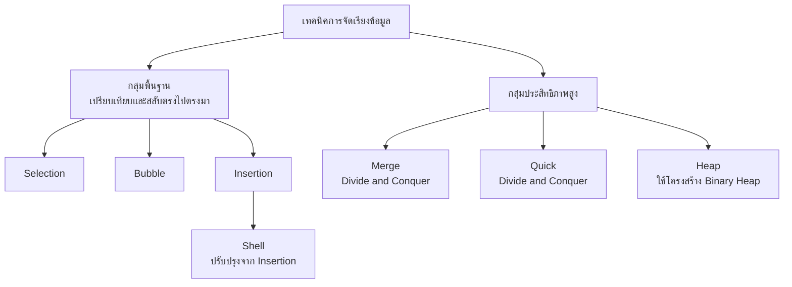
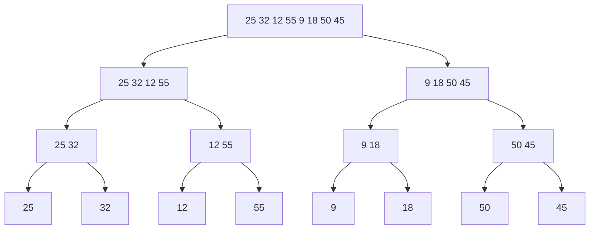
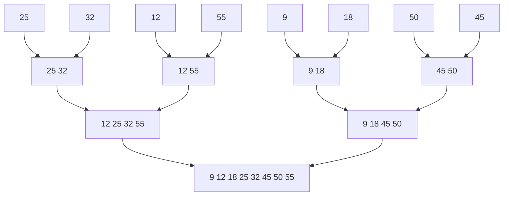
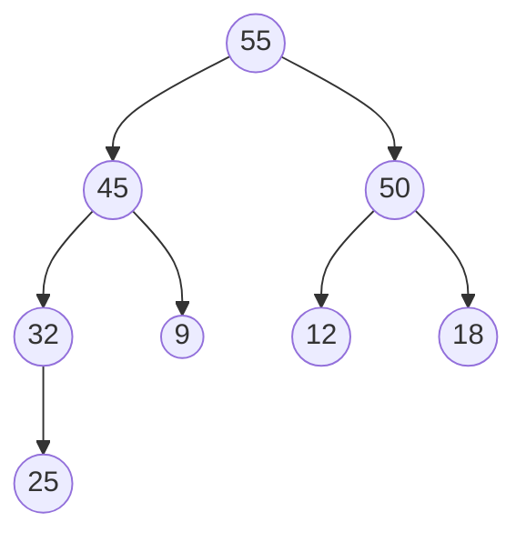
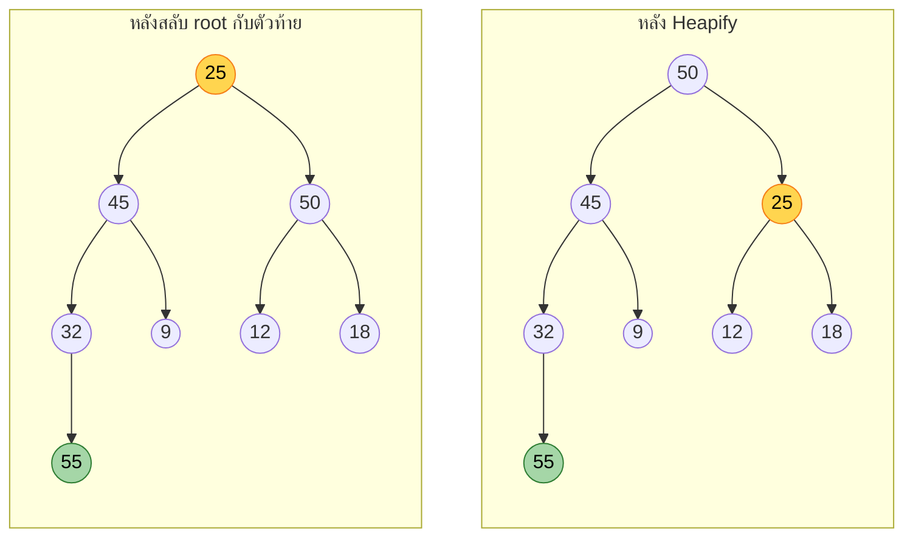

# บทที่ 12 — Sorting (เทคนิคการจัดเรียงข้อมูล)

Oct 10, 2026 · สรุปจากสไลด์ของ ผศ.ดร.สิลดา อินทรโสธรฉันท์ (88 หน้า)

ก่อนหน้า: [[Ch11 Graph]] · ชุดเดียวกัน: [[Ch8 Searching Algorithm]] · [[Ch9 Priority Queue]] · [[Ch10 Hashing]]

> [!abstract] บทนี้ต้องทำอะไรได้
> 1. อธิบายหลักการของการเรียงลำดับทั้ง **7 วิธี** และบอก Time Complexity ได้
> 2. **trace ทีละรอบ** ของทุกวิธีบนชุดข้อมูลที่กำหนด (โจทย์หลักของบทนี้)
> 3. บอกจุดเด่น ข้อจำกัด และเลือกวิธีที่เหมาะกับสถานการณ์
> 4. ดูสถานะระหว่างทางแล้วบอกได้ว่าเป็นของวิธีไหน

---

## 0. ภาพรวมทั้งบท

| # | วิธี | แนวคิดหนึ่งบรรทัด | Time Complexity (ตามสไลด์) |
| --- | --- | --- | --- |
| 1 | Selection Sort | หาตัวน้อยสุดในส่วนที่ยังไม่เรียง สลับมาไว้หน้าสุด | $O(n^2)$ |
| 2 | Bubble Sort | เทียบคู่ที่ติดกัน สลับถ้าผิดลำดับ ตัวมากลอยไปท้าย | $O(n^2)$ |
| 3 | Insertion Sort | หยิบทีละตัวไปแทรกในส่วนที่เรียงแล้ว (เหมือนเรียงไพ่) | $O(n^2)$ |
| 4 | Shell Sort | Insertion Sort แบบข้ามช่องด้วยระยะ Gap แล้วลด Gap จนเหลือ 1 | $O(n^2)$ หรือ $O(n^{1.5})$ ขึ้นกับชุด Gap |
| 5 | Merge Sort | แบ่งครึ่งจนเหลือตัวเดียว แล้วผสานกลับพร้อมเรียง | $O(n \log n)$ เสมอ |
| 6 | Quick Sort | เลือก Pivot แบ่งน้อยกว่าไปซ้าย มากกว่าไปขวา ทำซ้ำ | เฉลี่ย $O(n \log n)$, แย่สุด $O(n^2)$ |
| 7 | Heap Sort | สร้าง Max-Heap ดึงตัวมากสุดไปไว้ท้าย แล้วปรับ Heap | $O(n \log n)$ เสมอ |



ชุดข้อมูลที่สไลด์ใช้ (เรียงจาก **น้อยไปมาก** ทุกตัวอย่าง)

- **ชุด A (5 ตัว):** `64 25 12 22 11` — ใช้กับ Selection และ Bubble
- **ชุด B (8 ตัว):** `25 32 12 55 9 18 50 45` — ใช้กับทุกวิธี

ในตาราง trace ของสรุปนี้ **ตัวหนา** = ส่วนที่เรียงเสร็จและอยู่ตำแหน่งสุดท้ายแล้ว

---

## 1. Selection Sort (การเรียงลำดับแบบเลือก)

### หลักการ

"ค้นหาข้อมูลที่มีค่า **น้อยที่สุด** ในส่วนที่ยังไม่ได้เรียง แล้วนำมา **สลับ** กับข้อมูลตัวแรกของส่วนนั้น" ทำซ้ำจนเรียงครบ

- ข้อดี: เรียบง่าย เหมาะกับข้อมูลที่มีการเปลี่ยนแปลงน้อย
- ข้อจำกัด: ประสิทธิภาพต่ำกับข้อมูลขนาดใหญ่
- Time Complexity $O(n^2)$ เพราะต้องวนหาค่าน้อยที่สุดซ้ำๆ

### ขั้นตอนมาตรฐาน

1. **แบ่งข้อมูลเป็น 2 ส่วน:** ส่วนที่เรียงแล้ว (เริ่มต้นมี 0 ตัว) และส่วนที่ยังไม่เรียง (เริ่มต้นคือทั้งหมด)
2. **ค้นหาค่าน้อยที่สุด** ในส่วนที่ยังไม่เรียง
3. **สลับตำแหน่ง** ค่านั้นกับตัวแรกของส่วนที่ยังไม่เรียง
4. **ขยายส่วนที่เรียงแล้ว** เพิ่ม 1 ตัว
5. **ทำซ้ำ** ข้อ 2–4 จนส่วนที่ยังไม่เรียงเหลือตัวเดียว

### ตัวอย่างที่ 1 — ชุด A

| รอบ | ค่าน้อยที่สุดในส่วนที่ยังไม่เรียง | การสลับ | ผลลัพธ์ |
| --- | --- | --- | --- |
| เริ่ม | – | – | 64 25 12 22 11 |
| 1 | 11 | สลับ 11 กับ 64 | **11** 25 12 22 64 |
| 2 | 12 | สลับ 12 กับ 25 | **11 12** 25 22 64 |
| 3 | 22 | สลับ 22 กับ 25 | **11 12 22** 25 64 |
| 4 | 25 | อยู่ตำแหน่งเดิม ไม่ต้องสลับ | **11 12 22 25 64** |

### ตัวอย่างที่ 2 — ชุด B

| รอบ | ค่าน้อยที่สุด | การสลับ | ผลลัพธ์ |
| --- | --- | --- | --- |
| เริ่ม | – | – | 25 32 12 55 9 18 50 45 |
| 1 | 9 | สลับ 9 กับ 25 | **9** 32 12 55 25 18 50 45 |
| 2 | 12 | สลับ 12 กับ 32 | **9 12** 32 55 25 18 50 45 |
| 3 | 18 | สลับ 18 กับ 32 | **9 12 18** 55 25 32 50 45 |
| 4 | 25 | สลับ 25 กับ 55 | **9 12 18 25** 55 32 50 45 |
| 5 | 32 | สลับ 32 กับ 55 | **9 12 18 25 32** 55 50 45 |
| 6 | 45 | สลับ 45 กับ 55 | **9 12 18 25 32 45** 50 55 |
| 7 | 50 | อยู่ตำแหน่งเดิม ไม่ต้องสลับ | **9 12 18 25 32 45 50 55** |

### โค้ด

```java
void selectionSort(int[] a) {
    int n = a.length;
    for (int i = 0; i < n - 1; i++) {          // i = ตัวแรกของส่วนที่ยังไม่เรียง
        int min = i;
        for (int j = i + 1; j < n; j++) {      // หาค่าน้อยที่สุด
            if (a[j] < a[min]) min = j;
        }
        if (min != i) {                        // สลับมาไว้หน้าสุด
            int t = a[i]; a[i] = a[min]; a[min] = t;
        }
    }
}
```

### ทริคและมุมมองที่เร็วกว่า

> [!tip] ทริค Selection Sort
> - ทำ **n − 1 รอบเสมอ** ไม่ว่าข้อมูลจะเป็นอย่างไร (5 ตัว → 4 รอบ, 8 ตัว → 7 รอบ)
> - จำนวนการเปรียบเทียบ **คงที่** = $\frac{n(n-1)}{2}$ → n = 5 ได้ 10 ครั้ง, n = 8 ได้ 28 ครั้ง (ข้อมูลเรียงมาแล้วก็ยังเทียบเท่าเดิม)
> - สลับ **ไม่เกิน n − 1 ครั้ง** (รอบละไม่เกิน 1 ครั้ง) น้อยที่สุดในกลุ่มพื้นฐาน — ชุด A สลับ 3 ครั้ง ชุด B สลับ 6 ครั้ง
> - **ตรวจคำตอบ:** หลังรอบที่ k ตัวหน้าสุด k ตัวต้องเป็น **k ตัวที่น้อยที่สุดของทั้งชุด เรียงแล้ว** เช่นหลังรอบ 3 ของชุด B ต้องขึ้นต้นด้วย 9 12 18
> - ในแต่ละรอบมีแค่ **2 ตัวที่เปลี่ยนตำแหน่ง** ตัวอื่นลอกลงมาได้เลย

---

## 2. Bubble Sort (การเรียงลำดับแบบฟองอากาศ)

### หลักการ

"เปรียบเทียบข้อมูล **คู่ที่อยู่ติดกัน** ทีละคู่ แล้ว **สลับ** ถ้าเรียงไม่ถูก" ทำซ้ำไปเรื่อยๆ ข้อมูลตัวที่มากที่สุดจะค่อยๆ ย้ายไปอีกฝั่ง เหมือนฟองอากาศลอยขึ้นสู่ผิวน้ำ

- เทียบกับ Selection: Bubble **สลับบ่อยกว่ามาก** แต่ **จบได้เร็วกว่า** ถ้าข้อมูลเรียงมาอยู่แล้ว
- Time Complexity $O(n^2)$

### ขั้นตอนมาตรฐาน

1. **เริ่มจากคู่แรก:** เทียบตำแหน่งที่ 1 กับ 2
2. **สลับถ้าไม่ถูกต้อง:** ตัวซ้ายมากกว่าตัวขวา → สลับ
3. **เลื่อนไปคู่ถัดไป:** 2 กับ 3, 3 กับ 4 ไปจนสุดแถว
4. จบรอบแรก **ตัวที่มากที่สุดจะถูกดันไปอยู่ตำแหน่งสุดท้าย**
5. **ทำรอบใหม่** เริ่มจากคู่แรก โดย **ลดขอบเขตลงทีละ 1** (ตัวท้ายๆ เรียงเสร็จแล้ว) ทำจนกระทั่ง **ไม่มีการสลับเลยทั้งรอบ**

### ตัวอย่างที่ 1 — ชุด A

| รอบ | การเปรียบเทียบ (ซ้ายไปขวา) | ผลลัพธ์จบรอบ |
| --- | --- | --- |
| 1 | 64>25 สลับ · 64>12 สลับ · 64>22 สลับ · 64>11 สลับ | 25 12 22 11 **64** |
| 2 | 25>12 สลับ · 25>22 สลับ · 25>11 สลับ | 12 22 11 **25 64** |
| 3 | 12<22 ไม่สลับ · 22>11 สลับ | 12 11 **22 25 64** |
| 4 | 12>11 สลับ | **11 12 22 25 64** |

รอบที่ 1 แบบละเอียด: `64 25 12 22 11` → `25 64 12 22 11` → `25 12 64 22 11` → `25 12 22 64 11` → `25 12 22 11 64`

### ตัวอย่างที่ 2 — ชุด B

| รอบ | การเปรียบเทียบ | จำนวนสลับ | ผลลัพธ์จบรอบ |
| --- | --- | --- | --- |
| เริ่ม | – | – | 25 32 12 55 9 18 50 45 |
| 1 | 25,32 ไม่สลับ · 32,12 สลับ · 32,55 ไม่สลับ · 55,9 สลับ · 55,18 สลับ · 55,50 สลับ · 55,45 สลับ | 5 | 25 12 32 9 18 50 45 **55** |
| 2 | 25,12 สลับ · 25,32 ไม่สลับ · 32,9 สลับ · 32,18 สลับ · 32,50 ไม่สลับ · 50,45 สลับ | 4 | 12 25 9 18 32 45 **50 55** |
| 3 | 12,25 ไม่สลับ · 25,9 สลับ · 25,18 สลับ · 25,32 ไม่สลับ · 32,45 ไม่สลับ | 2 | 12 9 18 25 32 **45 50 55** |
| 4 | 12,9 สลับ · 12,18 ไม่สลับ · 18,25 ไม่สลับ · 25,32 ไม่สลับ | 1 | 9 12 18 25 **32 45 50 55** |
| 5 | 9,12 · 12,18 · 18,25 ไม่สลับทั้งหมด | 0 | ไม่มีการสลับเลยทั้งรอบ → **หยุด** |

ผลลัพธ์: `9 12 18 25 32 45 50 55` (ใช้ 5 รอบ ไม่ต้องทำครบ 7 รอบ)

### โค้ด

```java
void bubbleSort(int[] a) {
    int n = a.length;
    for (int pass = 0; pass < n - 1; pass++) {
        boolean swapped = false;
        for (int j = 0; j < n - 1 - pass; j++) {   // ลดขอบเขตลงรอบละ 1
            if (a[j] > a[j + 1]) {                 // ซ้ายมากกว่าขวา → สลับ
                int t = a[j]; a[j] = a[j + 1]; a[j + 1] = t;
                swapped = true;
            }
        }
        if (!swapped) break;                       // ไม่สลับเลยทั้งรอบ → เรียงแล้ว
    }
}
```

### ทริคและมุมมองที่เร็วกว่า

> [!tip] ทริค 1 — เขียนผลของทั้งรอบในครั้งเดียวด้วยวิธี "ถือตัวมากสุดเดินไป"
> เดินจากซ้ายไปขวาโดย **ถือ** ตัวแรกไว้ เจอตัวที่น้อยกว่าที่ถืออยู่ → เขียนตัวนั้นลงไป (มันถูกดันมาทางซ้าย 1 ช่อง) เจอตัวที่มากกว่า → **วางตัวที่ถือ** แล้วถือตัวใหม่แทน สุดทางก็วางตัวที่ถือ
> ชุด B รอบ 1: ถือ 25 → เจอ 32 (มากกว่า) วาง **25** ถือ 32 → เจอ 12 เขียน **12** → เจอ 55 วาง **32** ถือ 55 → เขียน **9 18 50 45** → วาง **55**
> ได้ `25 12 32 9 18 50 45 55` ตรงกับตารางโดยไม่ต้องเขียนทีละการสลับ

> [!tip] ทริค 2 — นับจำนวนการสลับทั้งหมดจากข้อมูลตั้งต้น
> จำนวนการสลับทั้งหมด = จำนวน **คู่ที่เรียงผิดลำดับ** (inversion) = สำหรับแต่ละตัว นับว่ามีตัวที่ **มากกว่าอยู่ทางซ้าย** กี่ตัว แล้วรวมกัน
>
> | ชุด B | 25 | 32 | 12 | 55 | 9 | 18 | 50 | 45 | รวม |
> | --- | --- | --- | --- | --- | --- | --- | --- | --- | --- |
> | ตัวที่มากกว่าทางซ้าย | 0 | 0 | 2 | 0 | 4 | 3 | 1 | 2 | **12** |
>
> ตรงกับ 5 + 4 + 2 + 1 = 12 ✓ (ชุด A ได้ 0 + 1 + 2 + 2 + 4 = 9 ตรงกับ 4 + 3 + 1 + 1)

> [!tip] ทริค 3 — รู้จำนวนรอบล่วงหน้า
> ในหนึ่งรอบ ตัวมากวิ่งไปขวาได้ไกล แต่ **ตัวน้อยขยับมาซ้ายได้แค่รอบละ 1 ช่อง** ดังนั้นจำนวนรอบที่มีการสลับ = ค่ามากสุดในแถว "ตัวที่มากกว่าทางซ้าย" ของทริค 2
> ชุด B: ค่ามากสุดคือ 4 (ของเลข 9) → สลับอยู่ 4 รอบ + อีก 1 รอบที่ไม่มีการสลับเพื่อยืนยัน = **5 รอบ** ✓ (แต่ไม่เกิน n − 1 รอบ เช่นชุด A: 4 รอบพอดี)

> [!tip] ทริค 4 — ตรวจคำตอบ
> หลังรอบที่ k ตัวท้ายสุด k ตัวต้องเป็น **k ตัวที่มากที่สุด เรียงแล้ว** (กลับด้านกับ Selection ที่เรียงเสร็จจากด้านหน้า) และรอบที่ k เปรียบเทียบ n − k คู่

---

## 3. Insertion Sort (การเรียงลำดับแบบแทรก)

### หลักการ

เหมือน **การจัดเรียงไพ่ในมือ**: หยิบไพ่ทีละใบจากกอง แล้วนำไป **แทรก** ในตำแหน่งที่ถูกต้องของไพ่ที่เรียงไว้แล้วในมือ

- Time Complexity $O(n^2)$
- **จุดเด่น:** มีประสิทธิภาพสูงมากกับข้อมูล **ขนาดเล็ก** หรือข้อมูลที่ **เกือบเรียงสมบูรณ์อยู่แล้ว**

### ขั้นตอนมาตรฐาน

1. **แบ่งข้อมูลเป็น 2 ส่วน:** ส่วนที่เรียงแล้ว (เริ่มต้นมีตัวแรกสุด 1 ตัว) และส่วนที่ยังไม่เรียง (ตั้งแต่ตัวที่ 2)
2. **หยิบข้อมูลมา 1 ตัว:** ตัวแรกสุดของส่วนที่ยังไม่เรียง เรียกว่า **Key**
3. **เปรียบเทียบและถอยหลัง:** เทียบ Key กับส่วนที่เรียงแล้ว ไล่จาก **ขวาไปซ้าย**
4. **ขยับช่องว่าง:** ตัวที่ **มากกว่า Key** ให้ขยับไปทางขวา 1 ช่อง
5. **แทรก:** เจอตัวที่น้อยกว่าหรือเท่ากับ Key (หรือถอยจนสุดซ้าย) ให้วาง Key ลงในช่องว่างนั้นทันที
6. **ทำซ้ำ** ข้อ 2–5 จนหมด

### ตัวอย่าง — ชุด B

เริ่มต้น: ส่วนที่เรียงแล้ว `[25]` · ส่วนที่ยังไม่เรียง `32 12 55 9 18 50 45`

| รอบ | Key | การเปรียบเทียบ (ขวาไปซ้าย) | ขยับกี่ตัว | ส่วนที่เรียงแล้ว \| ส่วนที่เหลือ |
| --- | --- | --- | --- | --- |
| 1 | 32 | 32 > 25 ไม่ต้องขยับ ต่อท้าย 25 | 0 | \[25 32\] \| 12 55 9 18 50 45 |
| 2 | 12 | 12 < 32 ขยับ 32 · 12 < 25 ขยับ 25 · สุดซ้าย → วาง | 2 | \[12 25 32\] \| 55 9 18 50 45 |
| 3 | 55 | 55 > 32 ไม่ต้องขยับ ต่อท้าย 32 | 0 | \[12 25 32 55\] \| 9 18 50 45 |
| 4 | 9 | 9 < 55, 32, 25, 12 ขยับทั้ง 4 ตัว → วางหน้าสุด | 4 | \[9 12 25 32 55\] \| 18 50 45 |
| 5 | 18 | 18 < 55, 32, 25 ขยับ 3 ตัว · 18 > 12 หยุด → วางหลัง 12 | 3 | \[9 12 18 25 32 55\] \| 50 45 |
| 6 | 50 | 50 < 55 ขยับ 1 ตัว · 50 > 32 หยุด → วางหลัง 32 | 1 | \[9 12 18 25 32 50 55\] \| 45 |
| 7 | 45 | 45 < 55, 50 ขยับ 2 ตัว · 45 > 32 หยุด → วางหลัง 32 | 2 | \[9 12 18 25 32 45 50 55\] |

### โค้ด

```java
void insertionSort(int[] a) {
    for (int i = 1; i < a.length; i++) {
        int key = a[i];                     // หยิบ Key
        int j = i - 1;
        while (j >= 0 && a[j] > key) {      // ตัวที่มากกว่า Key ขยับไปขวา
            a[j + 1] = a[j];
            j--;
        }
        a[j + 1] = key;                     // แทรก Key ลงช่องว่าง
    }
}
```

### ทริคและมุมมองที่เร็วกว่า

> [!tip] ทริค 1 — รู้ตำแหน่งแทรกทันทีโดยไม่ต้องไล่เทียบทีละตัว
> ส่วนที่เรียงแล้วเรียงอยู่ ดังนั้นให้มองหา **"ตัวแรกจากขวาที่ไม่มากกว่า Key"** แล้ววาง Key ถัดจากตัวนั้น จำนวนตัวที่ต้องขยับ = **จำนวนตัวในส่วนที่เรียงแล้วที่มากกว่า Key**
> เช่น Key = 18 กับ \[9 12 25 32 55\] → ตัวที่มากกว่า 18 มี 3 ตัว (25, 32, 55) → ขยับ 3 ตัว วางหลัง 12

> [!tip] ทริค 2 — จำนวนการขยับรวม = จำนวน inversion (เลขชุดเดียวกับ Bubble)
> แถว "ตัวที่มากกว่าทางซ้าย" ในทริค 2 ของ Bubble คือจำนวนการขยับของแต่ละ Key พอดี: 0, 2, 0, 4, 3, 1, 2 → รวม **12** ✓ ตรงกับคอลัมน์ "ขยับกี่ตัว"
> จำนวนครั้งที่เปรียบเทียบของ Key หนึ่งตัว = จำนวนที่ขยับ + 1 (ครั้งที่เจอตัวที่ไม่มากกว่า) ยกเว้นเมื่อ Key ไปอยู่หน้าสุดจะเท่ากับจำนวนที่ขยับพอดี

> [!tip] ทริค 3 — ทำไมถึงเร็วกับข้อมูลที่เกือบเรียงแล้ว
> ถ้าข้อมูลเรียงอยู่แล้ว ทุก Key เทียบแค่ครั้งเดียวและไม่ขยับเลย → รวม n − 1 ครั้ง = $O(n)$ ยิ่งข้อมูลใกล้เรียง (inversion น้อย) ยิ่งเร็ว — นี่คือเหตุผลที่ Shell Sort ทำ Insertion Sort เป็นรอบสุดท้าย

> [!warning] ต่างจาก Selection ตรงไหน
> หลังรอบที่ k ของ Insertion ตัวหน้าสุด k + 1 ตัว **เรียงกันเองแล้ว แต่ยังไม่ใช่ตำแหน่งสุดท้าย** (ตัวที่น้อยกว่าอาจยังอยู่ด้านหลัง) และ **ส่วนที่เหลือยังอยู่ในลำดับเดิมทุกตัว** ส่วน Selection ตัวหน้าสุดคือค่าน้อยสุดของทั้งชุดและอยู่ตำแหน่งสุดท้ายแล้ว

---

## 4. Shell Sort (การเรียงลำดับแบบเชลล์)

### หลักการ

คิดค้นโดย **Donald Shell** เป็นการนำ Insertion Sort มาปรับปรุงให้เร็วขึ้น โดยแก้จุดอ่อนที่ต้องค่อยๆ ขยับข้อมูล **ทีละ 1 ตำแหน่ง**

"เปรียบเทียบและสลับข้อมูลที่อยู่ **ห่างกันเป็นระยะทางหนึ่ง (Gap)** แล้วค่อยๆ **ลด Gap** ลงจนกระทั่ง Gap = 1" ข้อมูลโดยรวมจะถูกจัดให้ใกล้ตำแหน่งที่ถูกต้องอย่างรวดเร็ว ก่อนทำ Insertion Sort รอบสุดท้าย

- Time Complexity $O(n^2)$ หรือ $O(n^{1.5})$ ขึ้นกับลำดับชุดตัวเลข Gap ที่เลือกใช้
- **จุดเด่น:** เร็วกว่า Bubble / Selection / Insertion มาก โดยเฉพาะข้อมูลขนาดปานกลาง เขียนโค้ดง่าย และ **ไม่ต้องใช้ Memory เพิ่ม**

### ขั้นตอนมาตรฐาน

1. **กำหนด Gap:** เริ่มที่ Gap = n/2
2. **จับคู่และเรียงข้ามช่อง:** แบ่งข้อมูลตามระยะ Gap แล้วเรียงในแต่ละกลุ่ม (ใช้หลัก Insertion Sort)
3. **ลด Gap:** Gap = Gap/2
4. **ทำซ้ำ** ข้อ 2–3
5. **รอบสุดท้าย (Gap = 1):** คือ Insertion Sort ปกติ แต่ข้อมูลเกือบเรียงแล้ว จึงเสร็จเร็วมาก

### ตัวอย่าง — ชุด B

**รอบที่ 1: Gap = 8/2 = 4** จับคู่ข้อมูลที่ห่างกัน 4 ช่อง

| คู่ index | ค่า | ผล | ข้อมูลหลังขั้นนี้ |
| --- | --- | --- | --- |
| 0 กับ 4 | 25 กับ 9 | สลับ | 9 32 12 55 25 18 50 45 |
| 1 กับ 5 | 32 กับ 18 | สลับ | 9 18 12 55 25 32 50 45 |
| 2 กับ 6 | 12 กับ 50 | เรียงถูกแล้ว | 9 18 12 55 25 32 50 45 |
| 3 กับ 7 | 55 กับ 45 | สลับ | 9 18 12 45 25 32 50 55 |

จบรอบที่ 1: `9 18 12 45 25 32 50 55`

**รอบที่ 2: Gap = 4/2 = 2** แบ่งเป็น 2 กลุ่ม เรียงทีละกลุ่ม

- กลุ่มที่ 1 — index 0, 2, 4, 6: \[9, 12, 25, 50\] → 9 กับ 12 ถูกแล้ว · 12 กับ 25 ถูกแล้ว · 25 กับ 50 ถูกแล้ว → ไม่เปลี่ยน
- กลุ่มที่ 2 — index 1, 3, 5, 7: \[18, 45, 32, 55\] → 18 กับ 45 ถูกแล้ว · 45 กับ 32 **สลับ** (แล้วนำ 32 เทียบกับ 18 ถูกแล้ว) · 45 กับ 55 ถูกแล้ว → \[18, 32, 45, 55\]

จบรอบที่ 2: `9 18 12 32 25 45 50 55`

**รอบที่ 3: Gap = 2/2 = 1** ทำ Insertion Sort ปกติ

| เทียบ | ผล | ข้อมูล |
| --- | --- | --- |
| 9 กับ 18 | ถูกแล้ว | 9 18 12 32 25 45 50 55 |
| 18 กับ 12 | สลับ (แล้ว 12 เทียบ 9 ถูกแล้ว) | 9 12 18 32 25 45 50 55 |
| 18 กับ 32 | ถูกแล้ว | |
| 32 กับ 25 | สลับ (แล้ว 25 เทียบ 18 ถูกแล้ว) | 9 12 18 25 32 45 50 55 |
| 32 กับ 45 · 45 กับ 50 · 50 กับ 55 | ถูกแล้วทั้งหมด | 9 12 18 25 32 45 50 55 |

ผลลัพธ์: `9 12 18 25 32 45 50 55`

### โค้ด

```java
void shellSort(int[] a) {
    int n = a.length;
    for (int gap = n / 2; gap > 0; gap /= 2) {        // ลด Gap ทีละครึ่ง
        for (int i = gap; i < n; i++) {               // Insertion Sort แบบข้าม gap ช่อง
            int key = a[i];
            int j = i;
            while (j >= gap && a[j - gap] > key) {
                a[j] = a[j - gap];
                j -= gap;
            }
            a[j] = key;
        }
    }
}
```

สังเกตว่าถ้าแทน `gap` ด้วย 1 จะได้โค้ด Insertion Sort เป๊ะ

### ทริคและมุมมองที่เร็วกว่า

> [!tip] ทริค 1 — เขียนข้อมูลเป็น "ตาราง Gap คอลัมน์" แล้วเรียงทีละคอลัมน์
> วิธีที่เร็วและพลาดยากที่สุด: เขียนข้อมูลเรียงเป็นแถว แถวละ **Gap ตัว** → สมาชิกในคอลัมน์เดียวกันคือกลุ่มเดียวกันพอดี → **เรียงแต่ละคอลัมน์จากบนลงล่าง** → อ่านกลับทีละแถว
>
> **Gap = 4**
>
> | | คอลัมน์ 1 | คอลัมน์ 2 | คอลัมน์ 3 | คอลัมน์ 4 |
> | --- | --- | --- | --- | --- |
> | ก่อนเรียง แถว 1 | 25 | 32 | 12 | 55 |
> | ก่อนเรียง แถว 2 | 9 | 18 | 50 | 45 |
> | **หลังเรียง แถว 1** | 9 | 18 | 12 | 45 |
> | **หลังเรียง แถว 2** | 25 | 32 | 50 | 55 |
>
> อ่านทีละแถว → `9 18 12 45 25 32 50 55` ✓
>
> **Gap = 2**
>
> | ก่อนเรียง | | หลังเรียง | |
> | --- | --- | --- | --- |
> | 9 | 18 | 9 | 18 |
> | 12 | 45 | 12 | 32 |
> | 25 | 32 | 25 | 45 |
> | 50 | 55 | 50 | 55 |
>
> อ่านทีละแถว → `9 18 12 32 25 45 50 55` ✓

> [!tip] ทริค 2 — รู้จำนวนรอบล่วงหน้า
> Gap ลดครึ่งทุกรอบ: n = 8 → 4, 2, 1 (3 รอบ) · n = 7 → 3, 1 (2 รอบ) · n = 10 → 5, 2, 1 (3 รอบ) ใช้การหารปัดเศษทิ้ง

### ความแตกต่างระหว่าง Insertion Sort กับ Shell Sort

| | Insertion Sort | Shell Sort |
| --- | --- | --- |
| ระยะการเปรียบเทียบ/ขยับ | ทีละ 1 ตำแหน่ง | ข้ามช่องด้วยระยะ Gap กว้างๆ ก่อน |
| ปัญหา/การแก้ | ถ้าตัวน้อยๆ อยู่ขวาสุด ต้องขยับถอยหลังหลายรอบมาก | ดึงค่าน้อยมาฝั่งซ้ายอย่างรวดเร็ว แล้วปิดท้ายด้วย Insertion Sort |
| ผล | ช้ากับข้อมูลขนาดใหญ่ | เร็วกว่ามากบนชุดข้อมูลขนาดใหญ่ |

---

## 5. Merge Sort (การเรียงลำดับแบบผสาน)

### หลักการ

ใช้กลยุทธ์ **Divide and Conquer** (แบ่งแยกและเอาชนะ): "แบ่งชุดข้อมูลออกเป็น **ครึ่งหนึ่ง** ย่อยลงไปเรื่อยๆ จนเหลือสมาชิกเพียงตัวเดียว แล้วนำข้อมูลย่อยกลับมา **รวมกัน (Merge) พร้อมกับจัดเรียงไปในตัว**"

- Time Complexity $O(n \log n)$ **เสมอทุกกรณี** ไม่ว่าข้อมูลจะเรียงมาแล้วหรือไม่
- **จุดเด่น:** ประสิทธิภาพคงที่ เสถียรสูง เหมาะกับข้อมูลขนาดใหญ่มาก หรือการจัดการข้อมูลใน External Memory / Linked List
- **ข้อเสีย:** ต้องใช้ **หน่วยความจำชั่วคราว** สร้างอาร์เรย์ย่อยสำหรับผสานข้อมูล

### ขั้นตอนมาตรฐาน

1. **Divide (แบ่งออก):** หาจุดกลาง แบ่งเป็น 2 ฝั่ง (ซ้าย–ขวา) แบ่งซ้ำแบบ Recursion จนแต่ละกลุ่มเหลือ 1 ตัว (ถือว่าเรียงในตัวเองแล้ว)
2. **Conquer (แก้ปัญหา):** เมื่อกลุ่มย่อยเหลือ 1 ตัว ให้เริ่มกระบวนการจัดเรียง
3. **Combine / Merge (ผสานรวม):** นำกลุ่มย่อยที่เรียงแล้ว 2 กลุ่มมา **เปรียบเทียบทีละตัว** แล้วรวมเป็นกลุ่มใหม่ที่ใหญ่ขึ้นและเรียงถูกต้อง ทำซ้ำจนได้ชุดใหญ่ที่เรียงสมบูรณ์

**วิธี Merge สองกลุ่ม:** ใช้ตัวชี้ `i` (กลุ่มซ้าย) และ `j` (กลุ่มขวา) เทียบค่าที่ i กับ j **ค่าใดน้อยกว่านำค่านั้นใส่ลงอาร์เรย์ผลลัพธ์** แล้วเลื่อนตัวชี้นั้นไป 1 ช่อง เมื่อกลุ่มใดหมดก่อน ให้นำข้อมูลที่เหลือของอีกกลุ่มใส่ต่อท้ายทั้งหมด

### ตัวอย่าง — ชุด B

**ขั้นที่ 1: Divide**



**ขั้นที่ 2: Merge**



รายละเอียดการ Merge `[25 32]` กับ `[12 55]`

| เทียบ (i กับ j) | ตัวที่น้อยกว่า | ผลลัพธ์สะสม |
| --- | --- | --- |
| 25 กับ 12 | 12 (เลื่อน j) | 12 |
| 25 กับ 55 | 25 (เลื่อน i) | 12 25 |
| 32 กับ 55 | 32 (เลื่อน i → กลุ่มซ้ายหมด) | 12 25 32 |
| – | นำที่เหลือของกลุ่มขวามาต่อ | 12 25 32 55 |

รายละเอียดการ Merge `[9 18]` กับ `[45 50]`: 9 กับ 45 → 9 · 18 กับ 45 → 18 (กลุ่มซ้ายหมด) · ต่อท้ายด้วย 45 50 → `9 18 45 50`

รายละเอียดการ Merge ขั้นสุดท้าย `[12 25 32 55]` กับ `[9 18 45 50]`

| เทียบ (i กับ j) | ตัวที่น้อยกว่า | ผลลัพธ์สะสม |
| --- | --- | --- |
| 12 กับ 9 | 9 | 9 |
| 12 กับ 18 | 12 | 9 12 |
| 25 กับ 18 | 18 | 9 12 18 |
| 25 กับ 45 | 25 | 9 12 18 25 |
| 32 กับ 45 | 32 | 9 12 18 25 32 |
| 55 กับ 45 | 45 | 9 12 18 25 32 45 |
| 55 กับ 50 | 50 (กลุ่มขวาหมด) | 9 12 18 25 32 45 50 |
| – | นำที่เหลือของกลุ่มซ้ายมาต่อ | 9 12 18 25 32 45 50 55 |

### โค้ด

```java
void mergeSort(int[] a, int left, int right) {
    if (left >= right) return;                 // เหลือ 1 ตัว = เรียงแล้ว
    int mid = left + (right - left) / 2;
    mergeSort(a, left, mid);                   // Divide ฝั่งซ้าย
    mergeSort(a, mid + 1, right);              // Divide ฝั่งขวา
    merge(a, left, mid, right);                // Combine
}

void merge(int[] a, int left, int mid, int right) {
    int[] temp = new int[right - left + 1];    // หน่วยความจำชั่วคราว
    int i = left, j = mid + 1, k = 0;
    while (i <= mid && j <= right) {           // ตัวไหนน้อยกว่าใส่ก่อน
        if (a[i] <= a[j]) temp[k++] = a[i++];
        else              temp[k++] = a[j++];
    }
    while (i <= mid)   temp[k++] = a[i++];     // ที่เหลือของฝั่งซ้าย
    while (j <= right) temp[k++] = a[j++];     // ที่เหลือของฝั่งขวา
    for (k = 0; k < temp.length; k++) a[left + k] = temp[k];
}
```

### ทริคและมุมมองที่เร็วกว่า

> [!tip] ทริค 1 — ข้ามขั้น Divide ไปเลย แล้วคิดแบบ "ล่างขึ้นบน"
> ขั้น Divide ไม่ได้เปลี่ยนลำดับข้อมูลเลย ถ้า n เป็นกำลังของ 2 ให้ **ขีดแบ่งทีละ 2 ตัว** บนข้อมูลตั้งต้น เรียงในแต่ละคู่ → รวมเป็นกลุ่มละ 4 → กลุ่มละ 8
>
> | ระดับ | ข้อมูล |
> | --- | --- |
> | ตั้งต้น | 25 32 · 12 55 · 9 18 · 50 45 |
> | คู่ (2) | **25 32** · **12 55** · **9 18** · **45 50** |
> | สี่ (4) | **12 25 32 55** · **9 18 45 50** |
> | แปด (8) | **9 12 18 25 32 45 50 55** |
>
> เขียน 3 บรรทัดก็ได้คำตอบครบทุกระดับ

> [!tip] ทริค 2 — นับระดับและงาน
> จำนวนระดับของการ Merge = $\lceil \log_2 n \rceil$ (8 ตัว → 3 ระดับ) แต่ละระดับแตะข้อมูลครบ n ตัว → รวม $n \log n$ นี่คือที่มาของ $O(n \log n)$ และเป็นเหตุผลที่มัน **เท่าเดิมทุกกรณี** (แบ่งครึ่งเสมอ ไม่ขึ้นกับค่าข้อมูล)

> [!tip] ทริค 3 — Merge สองกลุ่มด้วยการ "เทียบหัวแถว"
> มองสองกลุ่มเป็นสองแถวที่เรียงแล้ว ดูเฉพาะ **ตัวหน้าสุดของแต่ละแถว** หยิบตัวที่น้อยกว่าออกไปต่อท้ายผลลัพธ์ ไม่ต้องดูตัวอื่นเลย การ Merge กลุ่มขนาด p กับ q เปรียบเทียบไม่เกิน p + q − 1 ครั้ง

> [!note] ถ้า n เป็นเลขคี่ (สไลด์ไม่มีตัวอย่าง)
> โค้ดด้านบนให้ฝั่งซ้ายได้ตัวเกินมา 1 ตัว (`mid` ปัดลง) เช่น 5 ตัว → ซ้าย 3 ขวา 2 บางตำราแบ่งให้ฝั่งขวาใหญ่กว่า ถ้าข้อสอบมี n คี่ให้ดูว่าอาจารย์กำหนดแบบไหน ผลลัพธ์สุดท้ายเหมือนกัน ต่างแค่หน้าตาระหว่างทาง

---

## 6. Quick Sort (การเรียงลำดับแบบเร็ว)

### หลักการ

Divide and Conquer อีกแบบที่นิยมมาก: "**เลือกสมาชิกขึ้นมา 1 ตัวเป็นจุดหมุน (Pivot)** แล้วจัดกลุ่มใหม่ให้ตัวที่ **น้อยกว่า Pivot ไปอยู่ทางซ้าย** ตัวที่ **มากกว่าไปอยู่ทางขวา**" จากนั้นทำซ้ำกับกลุ่มซ้ายและกลุ่มขวา (Recursion)

- Best / Average: $O(n \log n)$ เร็วมากในสภาวะทั่วไป
- Worst: $O(n^2)$ เกิดเมื่อ **เลือก Pivot ได้แย่ที่สุด** เช่นข้อมูลเรียงมาอยู่แล้ว แต่เลือกตัวแรก/ตัวสุดท้ายเป็น Pivot เสมอ

### ขั้นตอนมาตรฐาน

**1. เลือก Pivot** — 1 ตัวจากอาร์เรย์ (นิยมเลือกตัวแรก ตัวสุดท้าย หรือตัวตรงกลาง) **ตัวอย่างในสไลด์เลือกตัวสุดท้าย**

**2. จัดกลุ่ม (Partitioning)**

- 2.1 กำหนด `i` = ตำแหน่งแรกของชุดข้อมูล และ `j` = ตำแหน่งสุดท้ายของชุดข้อมูล (ไม่นับ Pivot)
- 2.2 เทียบค่าที่ `i` กับ Pivot: ถ้า **น้อยกว่า** Pivot ให้ **เพิ่ม i** ไป 1 · ถ้า **มากกว่า** ให้ **หยุด** แล้วไปพิจารณา j
- 2.3 เทียบค่าที่ `j` กับ Pivot: ถ้า **มากกว่า** Pivot ให้ **ลด j** ลง 1 · ถ้า **น้อยกว่า** ให้ **หยุด**
- 2.4 เมื่อ i และ j หยุดแล้ว
  - ถ้า **i < j** → **สลับ** ข้อมูลตำแหน่ง i กับ j แล้วเพิ่ม i ไป 1 แล้วทำ 2.2–2.4 ซ้ำ
  - ถ้า **i > j** → หยุด แล้ว **สลับ Pivot กับค่าที่ตำแหน่ง i** จบรอบ (ตอนนี้ Pivot อยู่ตำแหน่งที่ถูกต้องสมบูรณ์แล้ว)

**3. ทำซ้ำแบบ Recursion** กับกลุ่มฝั่งซ้ายและฝั่งขวา จนกลุ่มย่อยเหลือ 1 ตัวหรือไม่มีเลย

### ตัวอย่าง — ชุด B (ตามที่แสดงในสไลด์)

**รอบที่ 1** — ทั้งชุด `25 32 12 55 9 18 50 45` · Pivot = **45** · i เริ่มที่ 25, j เริ่มที่ 50

| ขั้น | ตัวชี้ | เทียบกับ Pivot 45 | ผล |
| --- | --- | --- | --- |
| 1 | i → 25 | 25 < 45 | เลื่อน i |
| 2 | i → 32 | 32 < 45 | เลื่อน i |
| 3 | i → 12 | 12 < 45 | เลื่อน i |
| 4 | i → 55 | 55 > 45 | หยุด ไปพิจารณา j |
| 5 | j → 50 | 50 > 45 | เลื่อน j ลดลง |
| 6 | j → 18 | 18 < 45 | หยุด · i < j → **สลับ 55 กับ 18** แล้วเพิ่ม i |
| | | | ได้ `25 32 12 18 9 55 50 45` |
| 7 | i → 9 | 9 < 45 | เลื่อน i |
| 8 | i → 55 | 55 > 45 | หยุด ไปพิจารณา j |
| 9 | j → 55 | 55 > 45 | เลื่อน j ลดลง |
| 10 | j → 9 | 9 < 45 | หยุด · ตอนนี้ j < i → **สลับ Pivot กับตำแหน่ง i** (45 กับ 55) |

จบรอบที่ 1: `25 32 12 18 9` **45** `50 55` — 45 อยู่ตำแหน่งสุดท้ายของมันแล้ว ซ้ายน้อยกว่าทุกตัว ขวามากกว่าทุกตัว

**รอบที่ 2** — ฝั่งซ้ายของ 45: `25 32 12 18 9` · Pivot = **9**

| ขั้น | ตัวชี้ | เทียบกับ Pivot 9 | ผล |
| --- | --- | --- | --- |
| 1 | i → 25 | 25 > 9 | หยุด ไปพิจารณา j |
| 2–5 | j → 18, 12, 32, 25 | มากกว่า 9 ทุกตัว | เลื่อน j ลดลงจนเลย i |
| | | | j < i → นำ Pivot (9) มาไว้ที่ตำแหน่ง i (หน้าสุด) |

จบรอบที่ 2 สไลด์แสดงผลเป็น **9** `25 32 12 18` 45 50 55

**รอบที่ 3** — ฝั่งขวาของ 9: `25 32 12 18` · Pivot = **18**

| ขั้น | ตัวชี้ | เทียบกับ Pivot 18 | ผล |
| --- | --- | --- | --- |
| 1 | i → 25 | 25 > 18 | หยุด ไปพิจารณา j |
| 2 | j → 12 | 12 < 18 | หยุด · i < j → **สลับ 25 กับ 12** แล้วเพิ่ม i → `12 32 25 18` |
| 3 | i → 32 | 32 > 18 | หยุด ไปพิจารณา j |
| 4 | j → 25 | 25 > 18 | เลื่อน j ลดลง |
| 5 | j → 32 | 32 > 18 | เลื่อน j ลดลง · j < i → **สลับ Pivot กับตำแหน่ง i** (18 กับ 32) |

จบรอบที่ 3: 9 `12` **18** `25 32` 45 50 55

**รอบที่ 4** — ฝั่งขวาของ 18: `25 32` · Pivot = **32** → i → 25: 25 < 32 เลื่อน i · ตอนนี้ j < i → สลับ Pivot กับตำแหน่ง i (ตัวมันเอง) → `25 32` ไม่เปลี่ยน

**รอบที่ 5** — ฝั่งขวาของ 45: `50 55` · Pivot = **55** → i → 50: 50 < 55 เลื่อน i · j < i → สลับ Pivot กับตัวเอง → `50 55` ไม่เปลี่ยน

ผลลัพธ์: `9 12 18 25 32 45 50 55`

| รอบ | กลุ่มที่ทำ | Pivot | ผลหลังจบรอบ (ตัวหนา = อยู่ตำแหน่งสุดท้ายแล้ว) |
| --- | --- | --- | --- |
| 1 | 25 32 12 55 9 18 50 45 | 45 | 25 32 12 18 9 **45** 50 55 |
| 2 | 25 32 12 18 9 | 9 | **9** 25 32 12 18 **45** 50 55 |
| 3 | 25 32 12 18 | 18 | **9** 12 **18** 25 32 **45** 50 55 |
| 4 | 25 32 | 32 | **9 12 18 25 32 45** 50 55 |
| 5 | 50 55 | 55 | **9 12 18 25 32 45 50 55** |

> [!warning] จุดที่สไลด์ไม่ตรงกับขั้นตอนของตัวเอง (รอบที่ 2)
> ขั้นตอน 2.4 บอกให้ **สลับ** Pivot กับค่าที่ตำแหน่ง i ถ้าสลับ 9 กับ 25 ตรงตัว จะต้องได้ `9 32 12 18 25` แต่สไลด์หน้า 57–58 แสดงเป็น `9 25 32 12 18` ซึ่งเป็นผลของการ **แทรก 9 ไว้หน้าแล้วเลื่อนตัวอื่นไปทางขวา** ไม่ใช่การสลับ
>
> ถ้าทำตามขั้นตอน 2.4 อย่างเคร่งครัด (สลับจริง) ลำดับรอบจะเป็นดังนี้
>
> | รอบ | กลุ่มที่ทำ | Pivot | ผลหลังจบรอบ |
> | --- | --- | --- | --- |
> | 1 | 25 32 12 55 9 18 50 45 | 45 | 25 32 12 18 9 **45** 50 55 |
> | 2 | 25 32 12 18 9 | 9 | **9** 32 12 18 25 **45** 50 55 |
> | 3 | 32 12 18 25 | 25 | **9** 18 12 **25** 32 **45** 50 55 |
> | 4 | 18 12 | 12 | **9 12 18 25 32 45** 50 55 |
> | 5 | 50 55 | 55 | **9 12 18 25 32 45 50 55** |
>
> (รอบ 3: i หยุดที่ 32, j หยุดที่ 18 → สลับ ได้ `18 12 32 25` → i หยุดที่ 32, j เลื่อนมาที่ 12 → j < i → สลับ Pivot 25 กับ 32)
>
> ผลลัพธ์สุดท้ายเหมือนกันทั้งสองแบบ ต่างกันที่หน้าตาระหว่างทาง **ควรถามอาจารย์ว่าข้อสอบให้ยึดแบบใด** ถ้าไม่ได้ถาม แนะนำให้เขียนตามขั้นตอน 2.4 (สลับ) และระบุขั้นตอนให้ชัดเจน เพราะตรงกับหลักการที่สไลด์เขียนไว้และตรงกับโค้ดด้านล่าง

### โค้ด (ตามขั้นตอนของสไลด์ เลือกตัวสุดท้ายเป็น Pivot)

```java
void quickSort(int[] a, int low, int high) {
    if (low >= high) return;                      // เหลือ 1 ตัวหรือไม่มีเลย
    int pivot = a[high];                          // 1) เลือก Pivot = ตัวสุดท้าย
    int i = low, j = high - 1;                    // 2.1
    while (true) {
        while (i < high && a[i] < pivot) i++;     // 2.2 น้อยกว่า Pivot เลื่อน i
        while (j >= low && a[j] > pivot) j--;     // 2.3 มากกว่า Pivot ลด j
        if (i < j) {                              // 2.4 สลับแล้วเพิ่ม i
            int t = a[i]; a[i] = a[j]; a[j] = t;
            i++;
        } else break;
    }
    int t = a[i]; a[i] = a[high]; a[high] = t;    // สลับ Pivot กับตำแหน่ง i
    quickSort(a, low, i - 1);                     // 3) ฝั่งซ้าย
    quickSort(a, i + 1, high);                    //    ฝั่งขวา
}
```

### ทริคและมุมมองที่เร็วกว่า

> [!tip] ทริค 1 — รู้ตำแหน่งสุดท้ายของ Pivot ก่อนเริ่ม partition
> Pivot จะไปอยู่ที่ตำแหน่ง = **จำนวนตัวในกลุ่มที่น้อยกว่า Pivot** (นับจากต้นกลุ่ม) เช่น Pivot = 45 มีตัวที่น้อยกว่า 5 ตัว (25, 32, 12, 9, 18) → อยู่ลำดับที่ 6 ของกลุ่ม (index 5) ✓ ใช้ตรวจว่า partition ถูกหรือไม่ได้ทันที

> [!tip] ทริค 2 — ตรวจคำตอบหลังแต่ละรอบ
> หลัง partition ต้องเป็นจริงทั้ง 3 ข้อ: (1) ทุกตัวทางซ้ายของ Pivot น้อยกว่า Pivot (2) ทุกตัวทางขวามากกว่า Pivot (3) สมาชิกของฝั่งซ้าย/ขวาเป็นชุดเดิม (ไม่มีตัวหายหรือเกิน) — ลำดับภายในแต่ละฝั่ง **ยังไม่ต้องเรียง**

> [!tip] ทริค 3 — มองเห็นกรณีแย่สุด
> ถ้า Pivot เป็นตัวน้อยสุดหรือมากสุดของกลุ่ม ฝั่งหนึ่งจะว่างเปล่า อีกฝั่งมี n − 1 ตัว (เช่นรอบ 2 ที่ Pivot = 9 ได้ฝั่งซ้าย 0 ตัว ฝั่งขวา 4 ตัว) ถ้าเป็นแบบนี้ทุกรอบจะต้องทำ n − 1 รอบ รอบละประมาณ n ครั้ง → $O(n^2)$ ข้อมูลที่ **เรียงมาแล้ว** กับการเลือกตัวสุดท้ายเป็น Pivot จะเจอแบบนี้ทุกรอบ ส่วนกรณีดีสุดคือ Pivot แบ่งได้ครึ่งๆ → ลึก $\log n$ ชั้น → $O(n \log n)$

---

## 7. Heap Sort (การเรียงลำดับแบบฮีป)

### หลักการ

ประยุกต์ใช้โครงสร้างข้อมูล **Binary Heap** (ดู [[Ch9 Priority Queue]]): "เปลี่ยนอาร์เรย์ให้อยู่ในรูป **Max-Heap** เพื่อให้ตัวที่มากที่สุดมาอยู่ที่ราก (Root) แล้ว **ดึงตัวนั้นไปไว้ท้ายสุด** จากนั้นจัดระเบียบฮีปใหม่ ทำซ้ำไปเรื่อยๆ"

การเรียงจากน้อยไปมากใช้ **Max-Heap** ซึ่งมีคุณสมบัติ

1. เป็น Binary Tree ที่ **โหนดพ่อแม่มีค่ามากกว่าหรือเท่ากับโหนดลูกเสมอ**
2. ข้อมูลที่มากที่สุดในกลุ่มจะอยู่ที่ **Root** (โหนดบนสุด / index 0 ของอาร์เรย์) เสมอ

Time Complexity $O(n \log n)$ **เสมอทุกกรณี** ไม่ขึ้นกับว่าข้อมูลเรียงมาแล้วหรือไม่

### ขั้นตอนมาตรฐาน

1. **สร้าง Max-Heap (Build Max-Heap):** จัดข้อมูลในอาร์เรย์ให้มีโครงสร้างเป็น Max-Heap เสร็จแล้วตัวที่มากที่สุดจะอยู่ที่ index 0
2. **สลับค่า นำตัวมากสุดไปไว้ท้าย (Swap):** สลับ index 0 กับ **ตำแหน่งสุดท้ายของ Heap** แล้ว **ตัดตำแหน่งสุดท้ายออกจาก Heap** (ถือว่าเรียงเสร็จแล้ว)
3. **ปรับสมดุล Heap ใหม่ (Heapify):** ตัวที่สลับขึ้นไปที่ index 0 อาจไม่ใช่ตัวมากสุด ต้องจัดให้กลับเป็น Max-Heap (Down-Heap: สลับกับลูกที่ **มากกว่า** ไล่ลงไป)
4. **ทำซ้ำ** ข้อ 2–3 จน Heap เหลือสมาชิก 1 ตัว

### ตัวอย่าง — ชุด B

**ขั้นตอนที่ 1 สร้าง Max-Heap** (ใส่ทีละตัวแล้ว Up-Heap ตามที่สไลด์แสดง)

| ใส่ | Up-Heap | Heap (อาร์เรย์) |
| --- | --- | --- |
| 25 | – | 25 |
| 32 | 32 > แม่ 25 สลับ | 32 25 |
| 12 | 12 < แม่ 32 ไม่สลับ | 32 25 12 |
| 55 | 55 > แม่ 25 สลับ → 55 > แม่ 32 สลับ | 55 32 12 25 |
| 9 | 9 < แม่ 32 ไม่สลับ | 55 32 12 25 9 |
| 18 | 18 > แม่ 12 สลับ → 18 < แม่ 55 หยุด | 55 32 18 25 9 12 |
| 50 | 50 > แม่ 18 สลับ → 50 < แม่ 55 หยุด | 55 32 50 25 9 12 18 |
| 45 | 45 > แม่ 25 สลับ → 45 > แม่ 32 สลับ → 45 < แม่ 55 หยุด | 55 45 50 32 9 12 18 25 |

Max-Heap ที่ได้



**ขั้นตอนที่ 2–3 สลับแล้ว Heapify** (เครื่องหมาย `|` คั่นระหว่าง Heap กับส่วนที่เรียงเสร็จแล้ว)

| รอบ | สลับ root กับตัวท้ายของ Heap | หลังสลับ | Heapify (สลับกับลูกที่มากกว่า) | หลัง Heapify |
| --- | --- | --- | --- | --- |
| 1 | 55 กับ 25 | 25 45 50 32 9 12 18 \| **55** | 25 ↔ 50 | 50 45 25 32 9 12 18 \| **55** |
| 2 | 50 กับ 18 | 18 45 25 32 9 12 \| **50 55** | 18 ↔ 45 แล้ว 18 ↔ 32 | 45 32 25 18 9 12 \| **50 55** |
| 3 | 45 กับ 12 | 12 32 25 18 9 \| **45 50 55** | 12 ↔ 32 แล้ว 12 ↔ 18 | 32 18 25 12 9 \| **45 50 55** |
| 4 | 32 กับ 9 | 9 18 25 12 \| **32 45 50 55** | 9 ↔ 25 | 25 18 9 12 \| **32 45 50 55** |
| 5 | 25 กับ 12 | 12 18 9 \| **25 32 45 50 55** | 12 ↔ 18 | 18 12 9 \| **25 32 45 50 55** |
| 6 | 18 กับ 9 | 9 12 \| **18 25 32 45 50 55** | 9 ↔ 12 | 12 9 \| **18 25 32 45 50 55** |
| 7 | 12 กับ 9 | 9 \| **12 18 25 32 45 50 55** | เหลือ 1 ตัว จบ | **9 12 18 25 32 45 50 55** |

ผลลัพธ์อ่านจาก root ไล่ลงไปทีละ level จากซ้ายไปขวา (ก็คืออ่านอาร์เรย์ตามลำดับ index): `9 12 18 25 32 45 50 55`

ภาพรอบที่ 1 (สลับ 55 ลงท้าย แล้ว Heapify ตัว 25)



(สีเขียว = ตัดออกจาก Heap แล้ว อยู่ตำแหน่งสุดท้าย)

### โค้ด

```java
void heapSort(int[] a) {
    int n = a.length;
    for (int i = 1; i < n; i++) {                  // 1) สร้าง Max-Heap โดยใส่ทีละตัว (Up-Heap)
        int c = i;
        while (c > 0 && a[c] > a[(c - 1) / 2]) {
            swap(a, c, (c - 1) / 2);
            c = (c - 1) / 2;
        }
    }
    for (int end = n - 1; end > 0; end--) {
        swap(a, 0, end);                           // 2) ตัวมากสุดไปไว้ท้าย ตัดออกจาก Heap
        int i = 0;                                 // 3) Heapify (Down-Heap) ในช่วง 0..end-1
        while (true) {
            int left = 2 * i + 1, right = 2 * i + 2, largest = i;
            if (left < end && a[left] > a[largest])   largest = left;
            if (right < end && a[right] > a[largest]) largest = right;
            if (largest == i) break;
            swap(a, i, largest);
            i = largest;
        }
    }
}

void swap(int[] a, int x, int y) { int t = a[x]; a[x] = a[y]; a[y] = t; }
```

### ทริคและมุมมองที่เร็วกว่า

> [!tip] ทริค 1 — ทำบนอาร์เรย์ด้วยสูตร index ไม่ต้องวาดต้นไม้ทุกรอบ
> แม่ของ i = (i − 1)/2 · ลูกซ้าย = 2i + 1 · ลูกขวา = 2i + 2 วาดต้นไม้เฉพาะตอนสร้าง Heap เสร็จ หลังจากนั้นทำตารางแบบข้างบน: สลับตัวหน้าสุดกับตัวท้ายของ Heap ขยับเส้น `|` มาทางซ้าย 1 ช่อง แล้ว Down-Heap จาก index 0 โดย **ห้ามมองข้ามเส้น `|`**

> [!tip] ทริค 2 — ตรวจคำตอบ
> - หลังรอบที่ k ตัวท้ายสุด k ตัวคือ **k ตัวที่มากที่สุด เรียงแล้ว** (เหมือน Bubble แต่ส่วนหน้าต้องเป็น Max-Heap)
> - ตัวหน้าสุด (index 0) หลัง Heapify ต้องเป็น **ค่ามากสุดของส่วนที่เหลือ** เสมอ
> - ทำ n − 1 รอบ แต่ละรอบ Heapify สลับไม่เกินความสูงของต้นไม้ → รวม $O(n \log n)$

> [!note] การสร้าง Heap ทำได้สองแบบ (ความรู้เสริม)
> สไลด์สร้าง Heap โดย **ใส่ทีละตัวแล้ว Up-Heap** ได้ `55 45 50 32 9 12 18 25` ส่วนตำราหลายเล่มสร้างแบบ **bottom-up** (Heapify ตั้งแต่โหนดกลางย้อนขึ้นไปถึง root) ซึ่งกับข้อมูลชุดนี้จะได้ `55 45 50 32 9 18 12 25` เป็น Max-Heap ที่ถูกต้องเหมือนกัน แต่หน้าตาต่างกัน และทำให้ trace รอบถัดๆ ไปต่างกันด้วย **ข้อสอบให้ทำแบบสไลด์**

---

## 8. เปรียบเทียบทั้ง 7 วิธี

| วิธี | Best | Average | Worst | หน่วยความจำเพิ่ม | Stable | จุดเด่น |
| --- | --- | --- | --- | --- | --- | --- |
| Selection | $O(n^2)$ | $O(n^2)$ | $O(n^2)$ | ไม่ใช้ | ไม่ | ง่าย สลับน้อยที่สุด |
| Bubble | $O(n)$ | $O(n^2)$ | $O(n^2)$ | ไม่ใช้ | ใช่ | จบเร็วถ้าเรียงมาแล้ว |
| Insertion | $O(n)$ | $O(n^2)$ | $O(n^2)$ | ไม่ใช้ | ใช่ | ดีมากกับข้อมูลเล็ก/เกือบเรียง |
| Shell | ขึ้นกับ Gap | ขึ้นกับ Gap | $O(n^2)$ หรือ $O(n^{1.5})$ | ไม่ใช้ | ไม่ | เร็วกว่ากลุ่มพื้นฐาน ไม่ใช้ memory เพิ่ม |
| Merge | $O(n \log n)$ | $O(n \log n)$ | $O(n \log n)$ | ใช้อาร์เรย์ชั่วคราว | ใช่ | คงที่ทุกกรณี เหมาะกับข้อมูลใหญ่/Linked List |
| Quick | $O(n \log n)$ | $O(n \log n)$ | $O(n^2)$ | ไม่ใช้อาร์เรย์เพิ่ม | ไม่ | เร็วมากในสภาวะทั่วไป |
| Heap | $O(n \log n)$ | $O(n \log n)$ | $O(n \log n)$ | ไม่ใช้ | ไม่ | คงที่ทุกกรณีและไม่ใช้ memory เพิ่ม |

(คอลัมน์ Best ของกลุ่มพื้นฐาน, หน่วยความจำ และ Stable เป็นความรู้เสริม · *Stable* = ข้อมูลที่ค่าเท่ากันยังคงลำดับเดิมหลังเรียง)

### ดูสถานะระหว่างทาง แล้วบอกว่าเป็นวิธีไหน

โจทย์แนวนี้ออกบ่อย: ให้ข้อมูลตั้งต้นกับสถานะหลังผ่านไป 1–2 รอบ แล้วถามว่าใช้วิธีใด

| สิ่งที่สังเกตเห็น | วิธี |
| --- | --- |
| **ด้านหน้า** เป็นค่าน้อยสุด k ตัวเรียงแล้ว ที่เหลือแทบเหมือนเดิม (ต่างแค่ตัวที่ถูกสลับ) | Selection |
| **ด้านท้าย** เป็นค่ามากสุด k ตัวเรียงแล้ว ด้านหน้าลำดับเปลี่ยนไปเล็กน้อย | Bubble |
| ด้านหน้า k + 1 ตัวเรียงกันเอง (แต่ไม่ใช่ค่าน้อยสุดของทั้งชุด) และ **ด้านหลังเหมือนข้อมูลตั้งต้นทุกตัว** | Insertion |
| ตัวที่ห่างกัน Gap ช่องเรียงกันแล้ว ค่าน้อยๆ กระโดดมาอยู่ด้านหน้า | Shell |
| เรียงเป็นกลุ่มย่อยๆ ขนาด 2, 4, 8 ติดกัน | Merge |
| มีตัวหนึ่งที่ซ้ายน้อยกว่าทั้งหมด ขวามากกว่าทั้งหมด | Quick |
| ด้านท้ายเป็นค่ามากสุดเรียงแล้ว และตัวแรกคือค่ามากสุดของส่วนที่เหลือ | Heap |

ตัวอย่างบนชุด B `25 32 12 55 9 18 50 45` หลังผ่านไป 2 รอบ

| วิธี | สถานะหลัง 2 รอบ |
| --- | --- |
| Selection | **9 12** 32 55 25 18 50 45 |
| Bubble | 12 25 9 18 32 45 **50 55** |
| Insertion | \[12 25 32\] 55 9 18 50 45 |
| Shell (Gap 4 แล้ว 2) | 9 18 12 32 25 45 50 55 |
| Merge (รวมเป็นกลุ่มละ 4) | 12 25 32 55 · 9 18 45 50 |
| Heap (หลัง Heapify รอบ 2) | 45 32 25 18 9 12 \| **50 55** |

---

## 9. ข้อสังเกตจากสไลด์ (จุดที่พิมพ์คลาดเคลื่อน)

| หน้า | ที่เขียนในสไลด์ | ที่ควรเป็น |
| --- | --- | --- |
| 12 | หัวข้อ Bubble Sort ขึ้นต้นว่า "**Selection Sort** เป็นอัลกอริทึมการเรียงลำดับที่เรียบง่าย" | **Bubble Sort** |
| 57–58 | รอบที่ 2 ของ Quick Sort แสดงผล `9 25 32 12 18` | ถ้า "สลับ Pivot กับ i" ตามขั้นตอน 2.4 จะได้ `9 32 12 18 25` (ดูหัวข้อ 6) |
| 57 และ 58 | สไลด์รอบที่ 2 ซ้ำกันสองหน้า | เนื้อหาเดียวกัน ต่างแค่แถบข้อมูลด้านบน |
| 64–65 | "ข้อมูลที่มีค่า**น้อยหรือ**มากที่สุดในกลุ่ม จะถูกดันมาอยู่ที่ Root" | Max-Heap → ค่า **มากที่สุด** อยู่ที่ Root |
| 68–72 | สร้าง Max-Heap ด้วยการใส่ทีละตัว | เป็นวิธีที่ถูกต้อง แต่ต่างจากวิธี bottom-up ในตำราบางเล่ม (ดูหัวข้อ 7) |

---

## 10. แบบฝึกหัดพร้อมเฉลย

ใช้ชุดข้อมูล **`38 27 43 3 9 82 10`** (7 ตัว) เรียงจากน้อยไปมาก

**ข้อ 1** Selection Sort — แสดงผลทุกรอบ และบอกจำนวนการเปรียบเทียบกับจำนวนการสลับ

> [!success]- เฉลยข้อ 1
> | รอบ | ค่าน้อยสุด | ผลลัพธ์ |
> | --- | --- | --- |
> | 1 | 3 ↔ 38 | **3** 27 43 38 9 82 10 |
> | 2 | 9 ↔ 27 | **3 9** 43 38 27 82 10 |
> | 3 | 10 ↔ 43 | **3 9 10** 38 27 82 43 |
> | 4 | 27 ↔ 38 | **3 9 10 27** 38 82 43 |
> | 5 | 38 อยู่ที่เดิม | **3 9 10 27 38** 82 43 |
> | 6 | 43 ↔ 82 | **3 9 10 27 38 43 82** |
>
> เปรียบเทียบ 7 × 6 / 2 = **21 ครั้ง** · สลับ **5 ครั้ง**

**ข้อ 2** Bubble Sort — แสดงผลทุกรอบ ใช้กี่รอบ และสลับทั้งหมดกี่ครั้ง

> [!success]- เฉลยข้อ 2
> | รอบ | จำนวนสลับ | ผลลัพธ์ |
> | --- | --- | --- |
> | 1 | 4 | 27 38 3 9 43 10 **82** |
> | 2 | 3 | 27 3 9 38 10 **43 82** |
> | 3 | 3 | 3 9 27 10 **38 43 82** |
> | 4 | 1 | 3 9 10 **27 38 43 82** |
> | 5 | 0 | ไม่มีการสลับ → หยุด |
>
> ใช้ **5 รอบ** สลับรวม **11 ครั้ง**
> ตรวจด้วยทริค: ตัวที่มากกว่าทางซ้ายของแต่ละตัว = 0, 1, 0, 3, 3, 0, 4 → รวม 11 ✓ ค่ามากสุด 4 → 4 รอบที่มีการสลับ + 1 รอบยืนยัน = 5 ✓

**ข้อ 3** Insertion Sort — แสดงส่วนที่เรียงแล้วทุกรอบ

> [!success]- เฉลยข้อ 3
> | รอบ | Key | ขยับ | ส่วนที่เรียงแล้ว \| ที่เหลือ |
> | --- | --- | --- | --- |
> | 1 | 27 | 1 | \[27 38\] \| 43 3 9 82 10 |
> | 2 | 43 | 0 | \[27 38 43\] \| 3 9 82 10 |
> | 3 | 3 | 3 | \[3 27 38 43\] \| 9 82 10 |
> | 4 | 9 | 3 | \[3 9 27 38 43\] \| 82 10 |
> | 5 | 82 | 0 | \[3 9 27 38 43 82\] \| 10 |
> | 6 | 10 | 4 | \[3 9 10 27 38 43 82\] |
>
> ขยับรวม 1 + 0 + 3 + 3 + 0 + 4 = **11 ครั้ง** (เท่ากับจำนวนสลับของ Bubble)

**ข้อ 4** Shell Sort (Gap เริ่มที่ n/2 แล้วหารสองไปเรื่อยๆ)

> [!success]- เฉลยข้อ 4
> **Gap = 7/2 = 3** เขียนเป็นตาราง 3 คอลัมน์
>
> | ก่อนเรียง | | | หลังเรียงแต่ละคอลัมน์ | | |
> | --- | --- | --- | --- | --- | --- |
> | 38 | 27 | 43 | 3 | 9 | 43 |
> | 3 | 9 | 82 | 10 | 27 | 82 |
> | 10 | | | 38 | | |
>
> จบรอบ 1: `3 9 43 10 27 82 38`
>
> **Gap = 3/2 = 1** Insertion Sort ปกติ: 43 กับ 10 → แทรก 10 หน้า 43 · 27 แทรกหน้า 43 · 82 ไม่ขยับ · 38 แทรกหน้า 43 และ 82
>
> ผลลัพธ์: `3 9 10 27 38 43 82`

**ข้อ 5** Merge Sort (แบ่งโดยให้ฝั่งซ้ายมี ⌊n/2⌋ ตัว)

> [!success]- เฉลยข้อ 5
> Divide: \[38 27 43\] \[3 9 82 10\] → \[38\] \[27 43\] · \[3 9\] \[82 10\] → ตัวเดี่ยวทั้งหมด
>
> Merge:
> - \[27\] + \[43\] → \[27 43\] · \[38\] + \[27 43\] → **\[27 38 43\]**
> - \[3\] + \[9\] → \[3 9\] · \[82\] + \[10\] → \[10 82\] · \[3 9\] + \[10 82\] → **\[3 9 10 82\]**
> - \[27 38 43\] + \[3 9 10 82\] → **\[3 9 10 27 38 43 82\]**

**ข้อ 6** Quick Sort (เลือกตัวสุดท้ายเป็น Pivot ทำตามขั้นตอน 2.1–2.4 โดยสลับจริง)

> [!success]- เฉลยข้อ 6
> **รอบ 1** Pivot = 10: i หยุดที่ 38, j หยุดที่ 9 → สลับ → `9 27 43 3 38 82 10` · i หยุดที่ 27, j เลื่อนผ่าน 38 หยุดที่ 3 → สลับ → `9 3 43 27 38 82 10` · i หยุดที่ 43, j เลื่อนผ่าน 27, 43 หยุดที่ 3 → j < i → สลับ Pivot กับ 43 → `9 3` **10** `27 38 82 43`
> (ตรวจ: มีตัวที่น้อยกว่า 10 อยู่ 2 ตัว → 10 อยู่ลำดับที่ 3 ✓)
>
> **รอบ 2** ฝั่งซ้าย `9 3` Pivot = 3: i หยุดที่ 9, j เลยไปทางซ้าย → สลับ Pivot กับ 9 → **3 9**
>
> **รอบ 3** ฝั่งขวา `27 38 82 43` Pivot = 43: i ผ่าน 27, 38 หยุดที่ 82 · j ผ่าน 82 หยุดที่ 38 → j < i → สลับ Pivot กับ 82 → `27 38` **43** `82`
>
> **รอบ 4** `27 38` Pivot = 38: i ผ่าน 27 ไปถึง Pivot → สลับกับตัวเอง → ไม่เปลี่ยน
>
> ผลลัพธ์: `3 9 10 27 38 43 82`

**ข้อ 7** Heap Sort (สร้าง Max-Heap แบบใส่ทีละตัว)

> [!success]- เฉลยข้อ 7
> สร้าง Heap: 38 → \[38 27\] → ใส่ 43 สลับกับ 38: \[43 27 38\] → \[43 27 38 3\] → \[43 27 38 3 9\] → ใส่ 82: สลับกับ 38 แล้วสลับกับ 43: \[82 27 43 3 9 38\] → ใส่ 10: \[82 27 43 3 9 38 10\]
>
> | รอบ | หลังสลับ | หลัง Heapify |
> | --- | --- | --- |
> | 1 | 10 27 43 3 9 38 \| **82** | 43 27 38 3 9 10 \| **82** |
> | 2 | 10 27 38 3 9 \| **43 82** | 38 27 10 3 9 \| **43 82** |
> | 3 | 9 27 10 3 \| **38 43 82** | 27 9 10 3 \| **38 43 82** |
> | 4 | 3 9 10 \| **27 38 43 82** | 10 9 3 \| **27 38 43 82** |
> | 5 | 3 9 \| **10 27 38 43 82** | 9 3 \| **10 27 38 43 82** |
> | 6 | 3 \| **9 10 27 38 43 82** | จบ |

**ข้อ 8** ข้อมูลตั้งต้น `7 3 9 1 8 2` หลังทำงานไป 2 รอบได้ผลดังนี้ แต่ละข้อเป็นวิธีใด (ก) `1 2 9 7 8 3` (ข) `3 1 7 2 8 9` (ค) `3 7 9 1 8 2`

> [!success]- เฉลยข้อ 8
> (ก) **Selection** — ด้านหน้าเป็นค่าน้อยสุด 2 ตัว (1, 2) เรียงแล้ว
> (ข) **Bubble** — ด้านท้ายเป็นค่ามากสุด 2 ตัว (8, 9) เรียงแล้ว
> (ค) **Insertion** — ด้านหน้า 3 ตัว (3 7 9) เรียงกันเอง ส่วน `1 8 2` ด้านหลังเหมือนข้อมูลตั้งต้นทุกตัว

**ข้อ 9** ถ้าต้องเรียงข้อมูลที่ "เกือบเรียงแล้ว" มีเพียงไม่กี่ตัวที่ผิดตำแหน่ง ควรใช้วิธีใดในกลุ่มพื้นฐาน และถ้าต้องการรับประกันเวลา $O(n \log n)$ โดยไม่ใช้หน่วยความจำเพิ่ม ควรใช้วิธีใด

> [!success]- เฉลยข้อ 9
> - เกือบเรียงแล้ว → **Insertion Sort** (จุดเด่นตามสไลด์: ประสิทธิภาพสูงมากกับข้อมูลที่เกือบเรียงสมบูรณ์อยู่แล้ว)
> - รับประกัน $O(n \log n)$ และไม่ใช้ memory เพิ่ม → **Heap Sort** (Merge Sort รับประกันเวลาได้แต่ต้องใช้อาร์เรย์ชั่วคราว ส่วน Quick Sort แย่สุดเป็น $O(n^2)$)

---

## 11. สรุปก่อนสอบ

> [!summary] จำ 12 ข้อนี้
> 1. **Selection** — หาตัวน้อยสุดสลับมาไว้หน้า · n − 1 รอบ · เทียบ n(n − 1)/2 ครั้งเสมอ
> 2. **Bubble** — เทียบคู่ติดกัน ตัวมากลอยไปท้าย · หยุดเมื่อไม่มีการสลับทั้งรอบ
> 3. **Insertion** — หยิบ Key แทรกในส่วนที่เรียงแล้ว (ไล่ขวาไปซ้าย) · ดีกับข้อมูลเล็ก/เกือบเรียง
> 4. **Shell** — Insertion ข้ามช่องด้วย Gap = n/2, n/4, …, 1 · ทริคตาราง Gap คอลัมน์
> 5. **Merge** — แบ่งครึ่งจนเหลือ 1 ตัว แล้วผสาน · $O(n \log n)$ เสมอ · ต้องใช้ memory ชั่วคราว
> 6. **Quick** — Pivot (ตัวสุดท้าย) · i วิ่งหาตัวมากกว่า j วิ่งหาตัวน้อยกว่า · i < j สลับ · i > j สลับ Pivot กับ i
> 7. Quick: เฉลี่ย $O(n \log n)$ · แย่สุด $O(n^2)$ เมื่อเลือก Pivot ได้แย่ (ข้อมูลเรียงมาแล้ว)
> 8. **Heap** — สร้าง Max-Heap → สลับ root กับตัวท้าย → Heapify → ทำซ้ำ · $O(n \log n)$ เสมอ
> 9. กลุ่ม $O(n^2)$: Selection, Bubble, Insertion (และ Shell ในกรณีแย่) · กลุ่ม $O(n \log n)$: Merge, Quick (เฉลี่ย), Heap
> 10. เรียงเสร็จจากด้านหน้า: Selection · เรียงเสร็จจากด้านท้าย: Bubble, Heap
> 11. จำนวนการสลับของ Bubble = จำนวนการขยับของ Insertion = จำนวน inversion
> 12. Divide and Conquer: Merge (แบ่งง่าย รวมยาก) กับ Quick (แบ่งยาก รวมง่าย)
