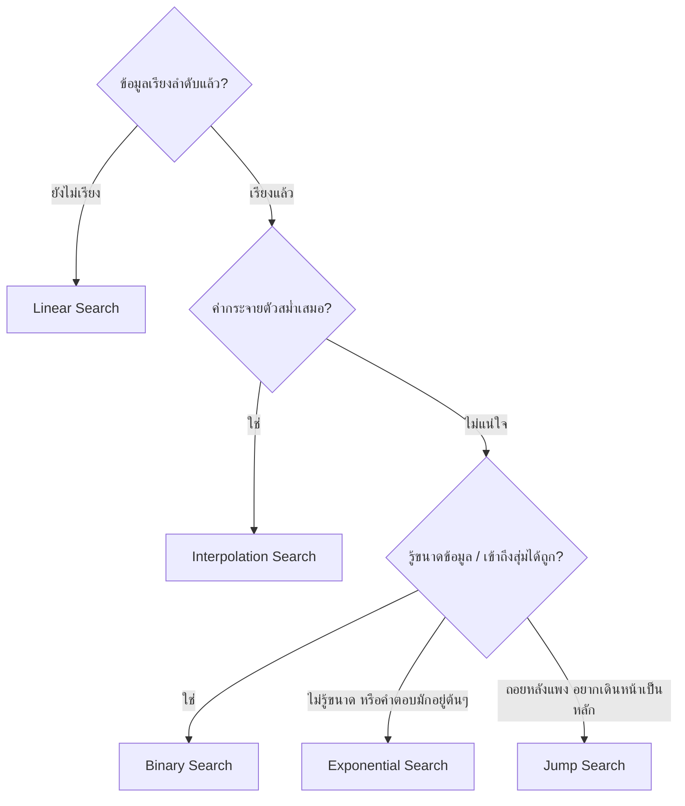
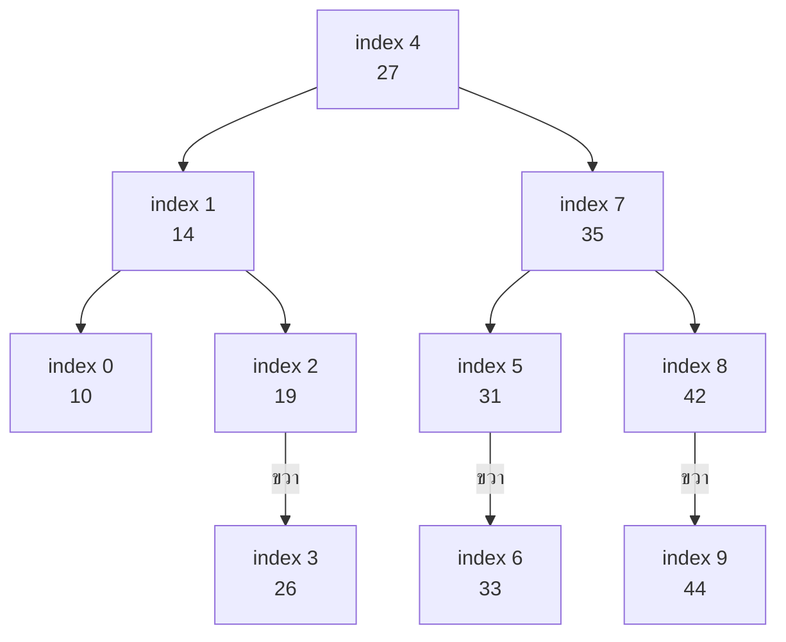
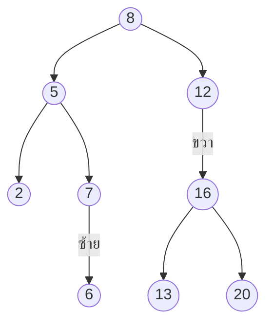
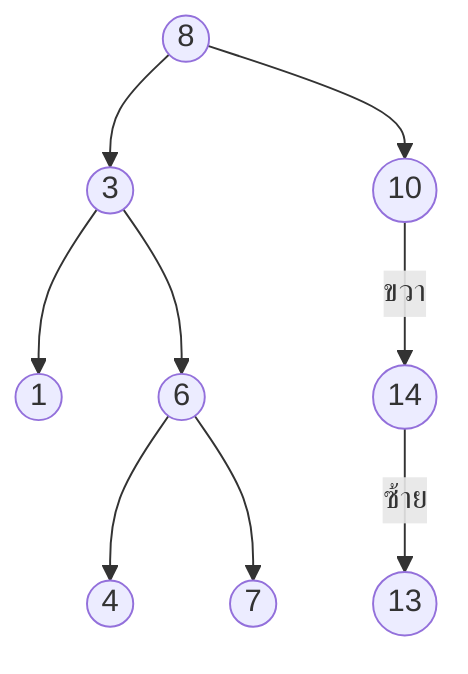

# บทที่ 8 — Searching Algorithm

Oct 10, 2026 · สรุปจากสไลด์ของ ผศ.ดร.สิลดา อินทรโสธรฉันท์ (78 หน้า)

ถัดไป: [[Ch9 Priority Queue]] · ชุดเดียวกัน: [[Ch10 Hashing]] · [[Ch11 Graph]] · [[Ch12 Sorting]] · พื้นฐาน BST: [[Ch6-8 Doubly Linked List, BST, Search]]

> [!abstract] บทนี้ต้องทำอะไรได้
> 1. อธิบายหลักการและเงื่อนไขการใช้งานของการค้นหาทั้ง 5 แบบ + Binary Search Tree
> 2. **trace ทีละรอบ** ได้ถูกต้อง ทั้งกรณีพบและไม่พบ (โจทย์เกือบทั้งหมดของบทนี้คือการ trace)
> 3. คำนวณ `mid` และ `pos` ได้แม่น รวมถึงกรณีเศษติดลบ
> 4. บอกจำนวนรอบ/จำนวนครั้งที่เปรียบเทียบได้โดยไม่ต้องไล่ทุกขั้น

---

## 0. ภาพรวมทั้งบท

เป้าหมายของทุกวิธีเหมือนกัน คือ **คืน index ของค่าที่ต้องการ** ถ้าไม่พบคืน `-1` (เพราะ index จริงเริ่มที่ 0 จึงไม่มีทางเป็น -1) สิ่งที่ต่างกันคือ "แต่ละครั้งที่เปรียบเทียบ ตัดข้อมูลทิ้งได้มากแค่ไหน"

| วิธี | ต้องเรียงก่อน? | แนวคิดหนึ่งบรรทัด | เวลา (กรณีแย่สุด) |
| --- | --- | --- | --- |
| Linear | ไม่ต้อง | ไล่ทีละช่องจากซ้ายไปขวา | $O(n)$ |
| Binary | ต้องเรียง | เทียบตัวกลาง ตัดทิ้งครึ่งหนึ่ง | $O(\log n)$ |
| Binary Search Tree | โครงสร้างเรียงอยู่ในตัว | เทียบ root แล้วเลี้ยวซ้าย/ขวา | $O(h)$ โดย h = ความสูงต้นไม้ |
| Interpolation | ต้องเรียง + กระจายสม่ำเสมอ | "เดา" ตำแหน่งจากสัดส่วนของค่า | ดีมากถ้าสม่ำเสมอ, แย่สุด $O(n)$ |
| Jump | ต้องเรียง | กระโดดทีละบล็อก แล้วไล่ linear ในบล็อก | $O(\sqrt{n})$ |
| Exponential | ต้องเรียง | กระโดดไกลขึ้นทีละเท่าตัว แล้ว binary ในช่วง | $O(\log n)$ |

> [!note] ที่มาของ Big-O
> สไลด์ระบุไว้ชัดเฉพาะ Linear = $O(n)$ และ Binary = $O(\log n)$ ค่าของวิธีอื่นในตารางเป็นความรู้เสริมมาตรฐาน ใส่ไว้เพื่อให้เปรียบเทียบได้



ชุดข้อมูลที่สไลด์ใช้ซ้ำตลอดบท (จำไว้เลย จะ trace เร็วขึ้นมาก)

**ชุด A** — ใช้กับ Linear, Binary, Interpolation

| index | 0 | 1 | 2 | 3 | 4 | 5 | 6 | 7 | 8 | 9 |
| --- | --- | --- | --- | --- | --- | --- | --- | --- | --- | --- |
| value | 10 | 14 | 19 | 26 | 27 | 31 | 33 | 35 | 42 | 44 |

**ชุด B** — ใช้กับ Interpolation (Example 5, 6)

| index | 0 | 1 | 2 | 3 | 4 |
| --- | --- | --- | --- | --- | --- |
| value | 2 | 3 | 5 | 7 | 9 |

**ชุด C** — ใช้กับ Jump Search (เลข Fibonacci 16 ตัว)

| index | 0 | 1 | 2 | 3 | 4 | 5 | 6 | 7 | 8 | 9 | 10 | 11 | 12 | 13 | 14 | 15 |
| --- | --- | --- | --- | --- | --- | --- | --- | --- | --- | --- | --- | --- | --- | --- | --- | --- |
| value | 0 | 1 | 1 | 2 | 3 | 5 | 8 | 13 | 21 | 34 | 55 | 89 | 144 | 233 | 377 | 610 |

**ชุด D** — ใช้กับ Exponential Search

| index | 0 | 1 | 2 | 3 | 4 | 5 | 6 | 7 | 8 | 9 | 10 | 11 | 12 | 13 | 14 | 15 |
| --- | --- | --- | --- | --- | --- | --- | --- | --- | --- | --- | --- | --- | --- | --- | --- | --- |
| value | 3 | 5 | 8 | 13 | 21 | 34 | 55 | 89 | 144 | 165 | 177 | 205 | 211 | 233 | 377 | 610 |

---

## 1. Linear Search (Sequential Search)

### แนวคิด

วิธีที่ง่ายที่สุด ไล่เทียบทีละค่าตั้งแต่ตัวแรกถึงตัวสุดท้าย

- เจอ → หยุดทันที แล้ว return index
- ไล่จนหมดแล้วไม่เจอ → return -1
- ใช้ได้กับข้อมูลที่ **ไม่ได้เรียง** (เป็นวิธีเดียวในบทนี้ที่ทำได้)
- Complexity = $O(n)$ ข้อมูลเพิ่มเท่าไร รอบการทำงานก็เพิ่มตามนั้น

### โค้ด (ตามสไลด์)

```java
int linearSearch(int[] A, int x) {
    for (int i = 0; i < A.length; i++) {
        if (A[i] == x) {      // พบแล้ว ส่งตำแหน่งกลับ
            return i;
        }
    }
    return -1;                // ไล่ครบแล้วไม่พบ
}
```

### ตัวอย่างจากสไลด์ — หา 33 ในชุด A

เทียบ 10, 14, 19, 26, 27, 31, **33** → พบที่ index 6 → `return 6` (เปรียบเทียบ 7 ครั้ง)

### ทริคและมุมมองที่เร็วกว่า

> [!tip] นับจำนวนครั้งโดยไม่ต้องไล่
> - พบที่ index `i` → เปรียบเทียบ **i + 1 ครั้ง**
> - ไม่พบ → เปรียบเทียบครบ **n ครั้ง**
> - Best = 1 ครั้ง (อยู่ตัวแรก), Worst = n ครั้ง, เฉลี่ยประมาณ (n + 1)/2 ครั้ง

> [!tip] ถ้าข้อมูลบังเอิญเรียงอยู่แล้ว
> หยุดได้เร็วขึ้นโดยเช็กเพิ่มว่า `A[i] > x` แล้ว return -1 ทันที (ไม่ต้องไล่จนสุด) แนวคิดนี้คือสิ่งที่ Jump Search ใช้ในขั้นไล่ในบล็อก

---

## 2. Binary Search

### แนวคิด

ใช้หลัก **Divide and Conquer** (แบ่งแยกและพิชิต): เทียบกับค่าที่อยู่ **ตรงกลาง** แล้วตัดครึ่งที่เป็นไปไม่ได้ทิ้ง

- ค่าที่หา **มากกว่า** ค่ากลาง → ทิ้งฝั่งซ้าย (ค่าน้อยกว่าทั้งหมด)
- ค่าที่หา **น้อยกว่า** ค่ากลาง → ทิ้งฝั่งขวา (ค่ามากกว่าทั้งหมด)
- **ข้อมูลต้องเรียงลำดับแล้วเท่านั้น** ได้ Complexity $O(\log n)$

### ตัวแปร

| ตัวแปร | ความหมาย |
| --- | --- |
| `low` | index ต่ำสุดของช่วงที่ยังสนใจ |
| `high` | index สูงสุดของช่วงที่ยังสนใจ |
| `mid` | ตำแหน่งกลางของช่วง |
| `S` | ค่าที่ต้องการค้นหา |
| `Data[]` | อาเรย์ที่เก็บข้อมูล (เรียงแล้ว) |

### ขั้นตอนมาตรฐาน (3 Step)

**Step 1** คำนวณตำแหน่งกลาง (ปัดเศษทิ้ง เช่น 4.5 → 4)

$$
\mathit{mid} = \mathit{low} + \left\lfloor \frac{\mathit{high} - \mathit{low}}{2} \right\rfloor
$$

**Step 2** เทียบ `Data[mid]` กับ `S`

| เงื่อนไข | ความหมาย | ทำอะไร |
| --- | --- | --- |
| `S == Data[mid]` | พบแล้ว | `return mid` |
| `S < Data[mid]` | คำตอบอยู่ฝั่งซ้าย → ตัดขวาทิ้ง | `high = mid - 1` |
| `S > Data[mid]` | คำตอบอยู่ฝั่งขวา → ตัดซ้ายทิ้ง | `low = mid + 1` |

**Step 3** ตรวจขนาดข้อมูลที่เหลือ

- `high >= low` → ยังมีข้อมูลเหลือ กลับไป Step 1
- `high < low` → ขนาดข้อมูลเป็น 0 ถือว่าไม่พบ `return -1`

### Example 1 — หา 31 ในชุด A (พบ)

| รอบ | low | high | mid | Data\[mid\] | เทียบกับ 31 | อัปเดต |
| --- | --- | --- | --- | --- | --- | --- |
| 1 | 0 | 9 | 0 + (9−0)/2 = 4 | 27 | 27 < 31 ตัดซ้าย | low = 4 + 1 = 5 |
| 2 | 5 | 9 | 5 + (9−5)/2 = 7 | 35 | 35 > 31 ตัดขวา | high = 7 − 1 = 6 |
| 3 | 5 | 6 | 5 + (6−5)/2 = 5 | 31 | เท่ากัน | **return 5** |

ภาพช่วงที่เหลือในแต่ละรอบ (ตัวหนา = mid, ~~ขีดฆ่า~~ = ถูกตัดทิ้ง)

| รอบ | 0 | 1 | 2 | 3 | 4 | 5 | 6 | 7 | 8 | 9 |
| --- | --- | --- | --- | --- | --- | --- | --- | --- | --- | --- |
| 1 | 10 | 14 | 19 | 26 | **27** | 31 | 33 | 35 | 42 | 44 |
| 2 | ~~10~~ | ~~14~~ | ~~19~~ | ~~26~~ | ~~27~~ | 31 | 33 | **35** | 42 | 44 |
| 3 | ~~10~~ | ~~14~~ | ~~19~~ | ~~26~~ | ~~27~~ | **31** | 33 | ~~35~~ | ~~42~~ | ~~44~~ |

### Example 2 — หา 15 ในชุด A (ไม่พบ)

| รอบ | low | high | mid | Data\[mid\] | เทียบกับ 15 | อัปเดต |
| --- | --- | --- | --- | --- | --- | --- |
| 1 | 0 | 9 | 4 | 27 | 27 > 15 ตัดขวา | high = 3 |
| 2 | 0 | 3 | 0 + (3−0)/2 = 1 | 14 | 14 < 15 ตัดซ้าย | low = 2 |
| 3 | 2 | 3 | 2 + (3−2)/2 = 2 | 19 | 19 > 15 ตัดขวา | high = 1 |
| จบ | 2 | 1 | – | – | high < low | **return -1** |

### โค้ด

```java
int binarySearch(int[] A, int x) {
    int low = 0, high = A.length - 1;        // index สุดท้ายคือ length - 1
    while (low <= high) {                    // ยังมีข้อมูลเหลือ
        int mid = low + (high - low) / 2;    // หารจำนวนเต็ม = ปัดทิ้ง
        if (A[mid] == x)      return mid;
        else if (A[mid] > x)  high = mid - 1;
        else                  low = mid + 1;
    }
    return -1;                               // high < low
}
```

> [!warning] จุดที่ต้องระวังในโค้ดของสไลด์ (หน้า 26)
> สไลด์เขียน `int low = 0, high = A.length` ซึ่งถ้าใช้ตามนั้น `mid` อาจชี้เกินขอบอาเรย์ได้ (เช่นหาค่าที่มากกว่าทุกตัว) ค่าที่ถูกต้องและตรงกับตัวอย่าง trace ในสไลด์เองคือ `high = A.length - 1` (ตัวอย่างใช้ high = 9 กับข้อมูล 10 ตัว) ถ้าข้อสอบให้ trace ให้ยึด `high = n − 1` ตามตัวอย่าง

### ทริคและมุมมองที่เร็วกว่า

> [!tip] ทริค 1 — วาด "ต้นไม้ของ mid" ครั้งเดียว ตอบได้ทุกคำถาม
> ลำดับของ mid ไม่ได้ขึ้นกับค่าที่หา ขึ้นกับ **ขนาดอาเรย์** เท่านั้น ดังนั้นถ้าโจทย์ถามหลายค่าบนอาเรย์เดิม ให้วาดต้นไม้นี้ครั้งเดียว แล้วการค้นหาแต่ละครั้งคือ **การเดินจาก root ลงมา** (น้อยกว่าไปซ้าย มากกว่าไปขวา) จำนวนรอบ = ระดับของโหนดที่ไปถึง

ต้นไม้ของ mid สำหรับชุด A (n = 10)



อ่านจากภาพ:

- หา 31 → 27 → 35 → 31 = **3 รอบ** (ตรงกับ Example 1)
- หา 15 → 27 → 14 → 19 → ต้องไปซ้ายของ 19 แต่ไม่มีโหนด → **ไม่พบ ใช้ 3 รอบ** (ตรงกับ Example 2)
- ค่าที่ต้องใช้ 4 รอบ (ลึกสุด) คือ 26, 33, 44 เท่านั้น
- ต้นไม้นี้คือ **Binary Search Tree ที่สมดุล** นั่นเอง — Binary Search บนอาเรย์กับการค้นใน BST คือเรื่องเดียวกัน

> [!tip] ทริค 2 — จำนวนรอบมากที่สุด
> $$\text{รอบมากสุด} = \lfloor \log_2 n \rfloor + 1$$
>
> | n | 10 | 16 | 100 | 1,000 | 1,000,000 |
> | --- | --- | --- | --- | --- | --- |
> | รอบมากสุด | 4 | 5 | 7 | 10 | 20 |
>
> คิดเร็ว: หาเลขยกกำลังของ 2 ที่ใหญ่ที่สุดซึ่งไม่เกิน n แล้วบวก 1 เช่น n = 10 → $2^3 = 8 \le 10$ → 3 + 1 = 4

> [!tip] ทริค 3 — คิด mid ในใจ
> `low + (high − low)/2` ให้ผลเท่ากับ `(low + high)/2` ปัดทิ้งเสมอ ตอนคิดมือใช้ `(low + high)/2` ได้เลย เช่น (5 + 9)/2 = 7 (สูตรแรกมีไว้กัน integer overflow ตอนเขียนโปรแกรมกับ index ที่ใหญ่มาก)

> [!tip] ทริค 4 — ตอนไม่พบ ค่าสุดท้ายบอกอะไร
> เมื่อจบด้วย `high < low` จะได้ `low = high + 1` เสมอ และ **`low` คือตำแหน่งที่ควรแทรกค่านั้น** เช่นหา 15 จบที่ low = 2 แปลว่า 15 ควรอยู่ระหว่าง index 1 (14) กับ index 2 (19) ใช้ตรวจคำตอบได้ทันทีว่า trace ถูกหรือไม่

---

## 3. Binary Search Tree (BST)

### นิยาม

BST คือโครงสร้างข้อมูลแบบต้นไม้ที่เก็บข้อมูลแบบ **เรียงลำดับอยู่ในตัว**

- แต่ละโหนดมีโหนดย่อยไม่เกิน 2 โหนด (ซ้าย, ขวา)
- โหนดย่อย **ทางซ้ายมีค่าน้อยกว่า** โหนดหลัก
- โหนดย่อย **ทางขวามีค่ามากกว่า** โหนดหลัก
- กฎนี้เป็นจริงกับ **ทั้ง subtree** ไม่ใช่แค่ลูกชั้นเดียว (ทุกตัวใน subtree ซ้ายของ 8 ต้องน้อยกว่า 8)
- ทำให้ค้นหา แทรก และลบได้อย่างมีประสิทธิภาพ

ต้นไม้ตัวอย่างในสไลด์ (หน้า 28) — subtree ซ้ายของ 8 มีแต่ค่าน้อยกว่า 8, subtree ขวามีแต่ค่ามากกว่า 8



### ขั้นตอนการค้นหา

1. เริ่มที่ root: `mid = root`
   - `S == mid.data` → พบ return
   - `S < mid.data` → ลงไปลูกทางซ้าย: `mid = mid.getLeft()`
   - `S > mid.data` → ลงไปลูกทางขวา: `mid = mid.getRight()`
2. ตรวจว่า `mid == null` หรือไม่ ถ้าเป็น null แปลว่าเลยโหนดปลาย (leaf) ไปแล้ว → ไม่พบ `return -1`

```java
Node search(Node root, int s) {
    Node mid = root;
    while (mid != null) {
        if (s == mid.getData())      return mid;          // พบ
        else if (s < mid.getData())  mid = mid.getLeft();  // ไปซ้าย
        else                         mid = mid.getRight(); // ไปขวา
    }
    return null;                                           // ไม่พบ (สไลด์ใช้ -1)
}
```

### ตัวอย่าง trace บนต้นไม้หน้า 29



| หา | เส้นทาง | ผล | จำนวนครั้งที่เทียบ |
| --- | --- | --- | --- |
| 7 | 8 (7<8 ไปซ้าย) → 3 (7>3 ไปขวา) → 6 (7>6 ไปขวา) → 7 | พบ | 4 |
| 13 | 8 (ไปขวา) → 10 (ไปขวา) → 14 (ไปซ้าย) → 13 | พบ | 4 |
| 9 | 8 (ไปขวา) → 10 (9<10 ไปซ้าย) → null | ไม่พบ | 2 |
| 5 | 8 (ไปซ้าย) → 3 (ไปขวา) → 6 (ไปซ้าย) → 4 (5>4 ไปขวา) → null | ไม่พบ | 4 |

> [!tip] ทริค BST
> - จำนวนครั้งที่เทียบเมื่อพบ = **ระดับของโหนดนั้น** (root = ระดับ 1) ไม่ต้องไล่ ดูจากภาพได้เลย
> - อ่านต้นไม้แบบ **Inorder (ซ้าย–ราก–ขวา)** จะได้ข้อมูลเรียงจากน้อยไปมากเสมอ ใช้ตรวจว่าต้นไม้ที่โจทย์ให้เป็น BST จริงไหม เช่นต้นไม้ข้างบน inorder = 1, 3, 4, 6, 7, 8, 10, 13, 14 ✓
> - ถ้าแทรกข้อมูลที่เรียงมาแล้วลง BST ต้นไม้จะเอียงเป็นเส้นตรง การค้นหาจะช้าเท่า Linear Search คือ $O(n)$ (ความรู้เสริม) BST จะเร็วระดับ $O(\log n)$ ก็ต่อเมื่อต้นไม้ค่อนข้างสมดุล

---

## 4. Interpolation Search

### แนวคิด

พัฒนาต่อจาก Binary Search แทนที่จะเปิดตรงกลางเสมอ ให้ **คำนวณตำแหน่งที่คาดว่าข้อมูลจะอยู่** เรียกว่า *probing position* (`pos`) เหมือนเปิดพจนานุกรมหาคำที่ขึ้นต้นด้วย ส เราจะเปิดค่อนไปท้ายเล่ม ไม่ใช่เปิดกลางเล่ม

เงื่อนไขที่ทำให้มีประสิทธิภาพ: ข้อมูลต้อง **เรียงแล้ว** และ **กระจายตัวสม่ำเสมอ**

### สูตร

$$
\mathit{pos} = \mathit{low} + \left[ \frac{(S - \mathit{Data}[\mathit{low}]) \times (\mathit{high} - \mathit{low})}{\mathit{Data}[\mathit{high}] - \mathit{Data}[\mathit{low}]} \right]
$$

อ่านสูตรให้เข้าใจ: เศษส่วน $\frac{S - Data[low]}{Data[high] - Data[low]}$ คือ "S อยู่ห่างจากค่าต่ำสุดเป็นสัดส่วนเท่าไรของช่วงค่า" (0 ถึง 1) เอาไปคูณความกว้างของช่วง index `(high − low)` แล้วบวกจุดเริ่ม `low`

### ขั้นตอนมาตรฐาน

**Step 1** คำนวณ `pos` แล้วตรวจว่าอยู่ในช่วง `[low, high]` หรือไม่ — ถ้า **อยู่นอกช่วง ถือว่าไม่พบ** `return -1`

**Step 2** ถ้าอยู่ในช่วง เทียบ `Data[pos]` กับ `S`

| เงื่อนไข | ทำอะไร |
| --- | --- |
| `S == Data[pos]` | `return pos` |
| `S < Data[pos]` | ตัดขวาทิ้ง `high = pos - 1` |
| `S > Data[pos]` | ตัดซ้ายทิ้ง `low = pos + 1` |

**Step 3** ถ้า `high >= low` กลับไป Step 1 ถ้า `high < low` → `return -1`

> [!warning] การปัดเศษ — จุดที่ทำให้ผิดบ่อยที่สุด
> ผลหารในวงเล็บ **ปัดเข้าหาศูนย์** (เหมือนการหารจำนวนเต็มใน Java)
> - ค่าบวก: 5.56 → 5, 2.857 → 2, 1.32 → 1
> - **ค่าลบ: −1.12 → −1, −0.5 → 0** (ไม่ใช่ −2 หรือ −1)
>
> ค่าลบเกิดเมื่อ `S < Data[low]` ซึ่งเจอได้หลังอัปเดต `low` ข้ามค่าที่หาไปแล้ว

### Example 3 — หา 31 ในชุด A (พบในรอบเดียว)

รอบที่ 1: low = 0, high = 9

$$
pos = 0 + \frac{(31-10)\times(9-0)}{44-10} = 0 + \frac{21 \times 9}{34} = \frac{189}{34} = 5.56 \rightarrow 5
$$

pos = 5 อยู่ในช่วง 0–9 → Data\[5\] = 31 เท่ากับค่าที่หา → **return 5**

เทียบกับ Binary Search ที่ใช้ 3 รอบ ข้อมูลชุดนี้กระจายค่อนข้างสม่ำเสมอ จึงเดาถูกตั้งแต่ครั้งแรก

### Example 4 — หา 15 ในชุด A (ไม่พบ เพราะ pos หลุดช่วง)

| รอบ | low | high | การคำนวณ pos | pos | ตรวจช่วง | Data\[pos\] | อัปเดต |
| --- | --- | --- | --- | --- | --- | --- | --- |
| 1 | 0 | 9 | 0 + (15−10)×(9−0)/(44−10) = 45/34 = 1.32 | 1 | อยู่ใน 0–9 | 14 < 15 | low = 2 |
| 2 | 2 | 9 | 2 + (15−19)×(9−2)/(44−19) = 2 + (−28/25) = 2 + (−1.12) → 2 − 1 | 1 | **ไม่อยู่ใน 2–9** | – | **return -1** |

### Example 5 — หา 7 ในชุด B (พบ)

| รอบ | low | high | การคำนวณ pos | pos | Data\[pos\] | อัปเดต |
| --- | --- | --- | --- | --- | --- | --- |
| 1 | 0 | 4 | 0 + (7−2)×(4−0)/(9−2) = 20/7 = 2.857 | 2 | 5 < 7 | low = 2 + 1 = 3 |
| 2 | 3 | 4 | 3 + (7−7)×(4−3)/(9−7) = 3 + 0/2 | 3 | 7 เท่ากัน | **return 3** |

### Example 6 — หา 4 ในชุด B (ไม่พบ เพราะ high < low)

| รอบ | low | high | การคำนวณ pos | pos | ตรวจช่วง | Data\[pos\] | อัปเดต |
| --- | --- | --- | --- | --- | --- | --- | --- |
| 1 | 0 | 4 | 0 + (4−2)×(4−0)/(9−2) = 8/7 = 1.142 | 1 | อยู่ใน 0–4 | 3 < 4 | low = 2 |
| 2 | 2 | 4 | 2 + (4−5)×(4−2)/(9−5) = 2 + (−2/4) = 2 + (−0.5) → 2 + 0 | 2 | อยู่ใน 2–4 | 5 > 4 | high = 1 |
| จบ | 2 | 1 | – | – | – | – | high < low → **return -1** |

> [!note] สองทางที่ "ไม่พบ"
> Interpolation จบแบบไม่พบได้ 2 แบบ และโจทย์ชอบถามว่าจบด้วยเหตุผลไหน
> 1. **pos อยู่นอกช่วง \[low, high\]** (Example 4)
> 2. **high < low** หลังอัปเดต (Example 6)

### โค้ด

```java
int interpolationSearch(int[] data, int s) {
    int low = 0, high = data.length - 1;
    while (high >= low) {
        if (data[high] == data[low]) {                 // กันหารด้วยศูนย์ (เสริม)
            return (data[low] == s) ? low : -1;
        }
        int pos = low + (s - data[low]) * (high - low) / (data[high] - data[low]);
        if (pos < low || pos > high) return -1;        // pos อยู่นอกช่วง
        if (data[pos] == s)      return pos;
        else if (s < data[pos])  high = pos - 1;
        else                     low = pos + 1;
    }
    return -1;
}
```

### ทริคและมุมมองที่เร็วกว่า

> [!tip] ทริค 1 — เช็กก่อนคำนวณ (ใช้ตรวจคำตอบ)
> ถ้า `S < Data[low]` หรือ `S > Data[high]` คำตอบสุดท้ายคือ **ไม่พบแน่นอน** เพราะข้อมูลเรียงอยู่ S จึงไม่มีทางอยู่ในช่วงนั้น
> - Example 4 รอบ 2: S = 15 < Data\[2\] = 19 → รู้ทันทีว่าไม่พบ
> - Example 6 รอบ 2: S = 4 < Data\[2\] = 5 → รู้ทันทีว่าไม่พบ
>
> แต่ตอน **เขียนวิธีทำ** ให้เขียนตามขั้นตอนของสไลด์ (คำนวณ pos → ตรวจช่วง → เทียบ) เพราะสองตัวอย่างนี้จบคนละแบบ ทริคนี้มีไว้ยืนยันว่าผลลัพธ์สุดท้ายถูก

> [!tip] ทริค 2 — ประมาณ pos ด้วยสัดส่วนก่อนคิดเลขจริง
> หา 31 ในช่วงค่า 10–44: 31 อยู่ราวๆ 21/34 ≈ 0.6 ของช่วง → 0.6 × 9 ≈ 5.4 → pos = 5 ถ้าคิดเลขแล้วได้ค่าห่างจากที่ประมาณมาก แปลว่าคิดผิด

> [!tip] ทริค 3 — เศษเป็นศูนย์ = เจอเลย
> ถ้า `S == Data[low]` ตัวเศษเป็น 0 ทำให้ `pos = low` และพบทันที (Example 5 รอบ 2) และถ้า `S == Data[high]` จะได้ `pos = high` พอดี

> [!warning] ทำไมต้อง "กระจายตัวสม่ำเสมอ"
> ลองหา 55 ในชุด C (Fibonacci ซึ่งค่าโตแบบก้าวกระโดด) ด้วย Interpolation: รอบแรก pos = 0 + 55×15/610 = 1.35 → 1, รอบถัดไปได้ pos = 3, 4, 5, 6, 7, 8, 9, 10 ขยับทีละช่องแทบทุกรอบ รวม **9 รอบ** กว่าจะเจอ (แทบไม่ต่างจาก Linear) ขณะที่ Binary ใช้แค่ 4 รอบ นี่คือกรณีแย่สุด $O(n)$ ของ Interpolation

---

## 5. Jump Search

### แนวคิด

รวมข้อดีของ Linear และ Binary: **กระโดด** ไปข้างหน้าทีละบล็อกขนาดคงที่ในข้อมูลที่เรียงแล้ว พอกระโดดเลยค่าที่หา ก็ถอยกลับมา **ค้นเชิงเส้น** เฉพาะในบล็อกที่เป็นไปได้

### ขั้นตอนมาตรฐาน (4 Step)

**Step 1** กำหนดขนาดบล็อก `m` ที่ใช้กระโดด

**Step 2** เทียบค่าที่หากับตำแหน่ง 0

| เงื่อนไข | ทำอะไร |
| --- | --- |
| `Data[0] == S` | `return 0` |
| `S > Data[0]` | กระโดดไปตำแหน่งถัดไป (ตามขนาดบล็อก) แล้วเทียบต่อ |
| `S < Data[0]` | น้อยกว่าตัวแรกสุด → ไม่พบ `return -1` |

**Step 3** เทียบค่าที่ตำแหน่งที่กระโดดมาถึง

- `S` มากกว่า → กระโดดต่อ
- `S` น้อยกว่า → **หยุด** แล้วไปค้นในบล็อกก่อนหน้า (Step 4)

**Step 4** ไล่เทียบทีละค่าในบล็อกนั้น

- พบ → return index
- ไล่จนหมดบล็อก (หรือเจอค่าที่มากกว่า S แล้ว) → `return -1`

### Example 7 — หา 55 ในชุด C

Step 1: ข้อมูล 16 ตัว แบ่งบล็อกเท่าๆ กัน ขนาด **4** → จุดกระโดดคือ index 0, 4, 8, 12

| จุดกระโดด | index 0 | index 4 | index 8 | index 12 |
| --- | --- | --- | --- | --- |
| ค่า | 0 | 3 | 21 | 144 |

| ขั้น | ตำแหน่ง | ค่า | เทียบกับ 55 | ทำอะไร |
| --- | --- | --- | --- | --- |
| Step 2 | 0 | 0 | 55 มากกว่า | กระโดดไป 0 + 4 = 4 |
| Step 3 รอบ 1 | 4 | 3 | 55 มากกว่า | กระโดดไป 4 + 4 = 8 |
| Step 3 รอบ 2 | 8 | 21 | 55 มากกว่า | กระโดดไป 8 + 4 = 12 |
| Step 3 รอบ 3 | 12 | 144 | 55 น้อยกว่า | หยุด → ค้นในบล็อก 8–11 |
| Step 4 | 9 | 34 | 55 มากกว่า | ขยับต่อ |
| Step 4 | 10 | 55 | ตรงกัน | **return 10** |

(ในบล็อก 8–11 เริ่มไล่ที่ index 9 เพราะ index 8 ถูกเทียบไปแล้วตอนกระโดด) รวมเปรียบเทียบ 6 ครั้ง

### Example 8 — หา 70 ในชุด C (ไม่พบ)

กระโดดเหมือนเดิม: index 0 (0), 4 (3), 8 (21), 12 (144 > 70 หยุด) → ค้นในบล็อก 8–11

| ตำแหน่ง | ค่า | เทียบกับ 70 | ทำอะไร |
| --- | --- | --- | --- |
| 9 | 34 | 70 มากกว่า | ขยับต่อ |
| 10 | 55 | 70 มากกว่า | ขยับต่อ |
| 11 | 89 | 70 น้อยกว่า | เลยไปแล้ว → **return -1** |

### โค้ด

```java
int jumpSearch(int[] data, int s, int m) {      // m = ขนาดบล็อก
    int n = data.length;
    if (data[0] == s) return 0;
    if (s < data[0])  return -1;
    int prev = 0, cur = m;
    while (cur < n && data[cur] < s) {            // กระโดดจนกว่าจะเลย
        prev = cur;
        cur += m;
    }
    if (cur < n && data[cur] == s) return cur;    // ตกตรงจุดกระโดดพอดี
    for (int i = prev + 1; i < Math.min(cur, n); i++) {   // ไล่ในบล็อก
        if (data[i] == s) return i;
        if (data[i] > s)  return -1;              // เลยแล้ว ไม่ต้องไล่ต่อ
    }
    return -1;
}
```

### ทริคและมุมมองที่เร็วกว่า

> [!tip] ทริค 1 — เขียนตารางจุดกระโดดก่อน แล้วชี้บล็อกได้ทันที
> เขียนเฉพาะค่าที่ index 0, m, 2m, 3m, … แล้วหา **จุดกระโดดแรกที่มีค่ามากกว่า S** บล็อกคำตอบคือบล็อกที่อยู่ก่อนหน้าจุดนั้น ไม่ต้องไล่เขียนทีละรอบ เช่นหา 13: จุดกระโดดคือ 0, 3, **21** → 21 > 13 ที่ index 8 → ค้นใน index 5–7

> [!tip] ทริค 2 — ขนาดบล็อกที่ดีที่สุดคือ √n
> กรณีแย่สุดเปรียบเทียบประมาณ $\frac{n}{m} + (m - 1)$ ครั้ง (กระโดด n/m ครั้ง + ไล่ในบล็อก m − 1 ครั้ง) ค่านี้น้อยที่สุดเมื่อ $m = \sqrt{n}$ ได้ประมาณ $2\sqrt{n}$ สไลด์เลือกขนาด 4 กับข้อมูล 16 ตัวก็เพราะ $\sqrt{16} = 4$

> [!tip] ทริค 3 — กรณีที่สไลด์ไม่ได้ยกตัวอย่าง
> - **ค่าที่หาตกตรงจุดกระโดดพอดี** (เช่นหา 21 ในชุด C) → เจอตอนกระโดดเลย ไม่ต้องเข้า Step 4
> - **กระโดดจนสุดอาเรย์แล้วยังไม่เจอค่าที่มากกว่า** (เช่นหา 400: index 12 = 144 ยังน้อยกว่า และ 12 + 4 = 16 เกินขอบ) → ค้นในบล็อกสุดท้าย index 13–15: 233, 377, 610 > 400 → ไม่พบ

---

## 6. Exponential Search

### แนวคิด

มี 2 ขั้นตอน

1. **หาช่วง** ที่ค่าที่หาน่าจะอยู่ โดยกระโดดไปที่ตำแหน่ง $2^i$ (i เริ่มจาก 1 และเพิ่มขึ้นทีละรอบ → ตำแหน่ง 2, 4, 8, 16, …) หยุดเมื่อค่าที่ตำแหน่งนั้น **มากกว่า** ค่าที่หา (คล้าย Jump Search แต่ระยะกระโดดเพิ่มเป็นเท่าตัว)
2. **Binary Search** ในช่วงที่ได้จากขั้นตอนที่ 1 โดย `low` = ตำแหน่งกระโดดก่อนหน้า, `high` = ตำแหน่งที่หยุด

### Example 9 — หา 55 ในชุด D

**ขั้นตอนที่ 1 หาช่วง**

| รอบ | ตำแหน่ง | ค่า | เทียบกับ 55 | ทำอะไร |
| --- | --- | --- | --- | --- |
| 1 | 0 | 3 | 55 มากกว่า | กระโดดไป $2^1 = 2$ |
| 2 | 2 | 8 | 55 มากกว่า | กระโดดไป $2^2 = 4$ |
| 3 | 4 | 21 | 55 มากกว่า | กระโดดไป $2^3 = 8$ |
| 4 | 8 | 144 | 55 น้อยกว่า | หยุด → **low = 4, high = 8** |

**ขั้นตอนที่ 2 Binary Search ในช่วง 4–8**

| รอบ | low | high | mid | Data\[mid\] | ผล |
| --- | --- | --- | --- | --- | --- |
| 1 | 4 | 8 | 4 + (8−4)/2 = 6 | 55 | ตรงกัน → **return 6** |

### Example 10 — หา 65 ในชุด D (ไม่พบ)

ขั้นตอนที่ 1 เหมือน Example 9 ทุกอย่าง (0 → 2 → 4 → 8, 144 > 65 หยุด) ได้ **low = 4, high = 8**

| รอบ | low | high | mid | Data\[mid\] | เทียบกับ 65 | อัปเดต |
| --- | --- | --- | --- | --- | --- | --- |
| 1 | 4 | 8 | 6 | 55 | 65 มากกว่า | low = 6 + 1 = 7 |
| 2 | 7 | 8 | 7 + (8−7)/2 = 7 | 89 | 65 น้อยกว่า | high = 7 − 1 = 6 |
| จบ | 7 | 6 | – | – | high < low | **return -1** |

### โค้ด (ตามรูปแบบของสไลด์)

```java
int exponentialSearch(int[] data, int s) {
    int n = data.length;
    if (data[0] == s) return 0;
    if (s < data[0])  return -1;
    int prev = 0, i = 1, cur = 2;                 // 2^1
    while (cur < n && data[cur] <= s) {           // ยังไม่เลย กระโดดต่อ
        prev = cur;
        i++;
        cur = (int) Math.pow(2, i);               // 2, 4, 8, 16, ...
    }
    int low = prev, high = Math.min(cur, n - 1);  // ถ้าเกินขอบให้ใช้ตัวสุดท้าย
    while (high >= low) {                         // Binary Search ในช่วง
        int mid = low + (high - low) / 2;
        if (data[mid] == s)      return mid;
        else if (s < data[mid])  high = mid - 1;
        else                     low = mid + 1;
    }
    return -1;
}
```

### ทริคและมุมมองที่เร็วกว่า

> [!tip] ทริค 1 — จุดกระโดดตายตัว ไม่ขึ้นกับข้อมูล
> ตำแหน่งที่ตรวจในขั้นที่ 1 คือ **0, 2, 4, 8, 16, …** เสมอ ให้วงค่าที่ตำแหน่งเหล่านี้ไว้เลย (ชุด D: 3, 8, 21, 144) แล้วดูว่า S ตกระหว่างคู่ไหน ก็ได้ `low`–`high` ทันที
>
> | S อยู่ในช่วงค่า | low | high |
> | --- | --- | --- |
> | 3 < S < 8 | 0 | 2 |
> | 8 ≤ S < 21 | 2 | 4 |
> | 21 ≤ S < 144 | 4 | 8 |
> | S ≥ 144 | 8 | 15 (ตัวสุดท้าย เพราะ 16 เกินขอบ) |

> [!tip] ทริค 2 — ทำไมถึงมีวิธีนี้ ทั้งที่มี Binary Search อยู่แล้ว
> - ถ้าคำตอบอยู่ **ใกล้ต้นอาเรย์** ที่ index i จะใช้เวลาแค่ $O(\log i)$ ไม่ใช่ $O(\log n)$ (ความรู้เสริม)
> - ใช้ได้กับข้อมูลที่ **ไม่รู้ขนาด** หรือยาวไม่จำกัด เพราะไม่ต้องรู้ `high` ตั้งแต่ต้น
> - ช่วงที่ต้อง binary ต่อมีขนาดประมาณครึ่งหนึ่งของตำแหน่งที่หยุด (เช่นหยุดที่ index 8 ก็ค้นแค่ช่วง 4–8)

> [!note] เทียบกับตำราทั่วไป
> ตำราส่วนใหญ่เริ่มกระโดดที่ index 1 แล้วคูณ 2 ไปเรื่อยๆ (1, 2, 4, 8, …) ส่วนสไลด์เทียบ index 0 ก่อน แล้วไป $2^1 = 2$ ทันที ผลลัพธ์สุดท้ายเหมือนกัน แต่ลำดับการเทียบต่างกันเล็กน้อย **ข้อสอบให้ยึดแบบสไลด์: 0 → 2 → 4 → 8**

---

## 7. เปรียบเทียบทุกวิธีบนโจทย์เดียวกัน

หา 55 ในชุด C (อยู่ที่ index 10, n = 16)

| วิธี | ลำดับตำแหน่งที่ถูกเปรียบเทียบ | จำนวนครั้ง |
| --- | --- | --- |
| Linear | 0, 1, 2, …, 10 | 11 |
| Binary | 7 (13) → 11 (89) → 9 (34) → 10 (55) | 4 |
| Interpolation | 1, 3, 4, 5, 6, 7, 8, 9, 10 | 9 |
| Jump (m = 4) | 0, 4, 8, 12 แล้วไล่ 9, 10 | 6 |
| Exponential | 0, 2, 4, 8 (16 เกินขอบ → ช่วง 8–15) แล้ว binary 11, 9, 10 | 7 |

ข้อสังเกต: Interpolation แย่ที่สุดในกลุ่มที่ต้องเรียง เพราะเลข Fibonacci ไม่ได้กระจายสม่ำเสมอ ส่วนบนชุด A ที่กระจายดี Interpolation หา 31 ได้ในรอบเดียว — **ไม่มีวิธีไหนดีที่สุดเสมอ ขึ้นกับลักษณะข้อมูล**

| | ข้อดี | ข้อจำกัด |
| --- | --- | --- |
| Linear | ง่ายสุด ใช้กับข้อมูลไม่เรียงได้ | ช้าเมื่อข้อมูลมาก |
| Binary | เร็วและคงที่ $O(\log n)$ | ต้องเรียงก่อน ต้องเข้าถึงตำแหน่งใดก็ได้ทันที |
| BST | แทรก/ลบ/ค้นได้ในโครงสร้างเดียว | ถ้าต้นไม้เอียงจะช้า |
| Interpolation | เร็วมากถ้าข้อมูลสม่ำเสมอ | ข้อมูลไม่สม่ำเสมอจะช้ามาก มีการคูณหารทุกรอบ |
| Jump | เดินหน้าเป็นหลัก ถอยหลังแค่ครั้งเดียว | ช้ากว่า Binary |
| Exponential | ดีเมื่อคำตอบอยู่ต้นๆ หรือไม่รู้ขนาดข้อมูล | ถ้าคำตอบอยู่ท้ายจะเทียบมากกว่า Binary เล็กน้อย |

---

## 8. ข้อสังเกตจากสไลด์ (จุดที่พิมพ์คลาดเคลื่อน)

| หน้า | ที่เขียนในสไลด์ | ที่ควรเป็น |
| --- | --- | --- |
| 26 | `high = A.length` | `high = A.length - 1` (ตรงกับตัวอย่างที่ใช้ high = 9) |
| 33 | "ตัดข้อมูลที่มีค่าน้อยกว่า Data\[mid\]" ในหัวข้อ Interpolation | Data\[pos\] |
| 36, 40 | "find the mid value" ในหัวข้อ Interpolation | หมายถึงหาค่า pos |
| 48 | `low = pos + 1 = 1 + 1 = 3` | `low = pos + 1 = 2 + 1 = 3` (ผลลัพธ์ 3 ถูกแล้ว) |
| 30 | บรรทัด complexity พูดถึง Linear กับ Binary | ไม่ได้ระบุ complexity ของ Interpolation ไว้ |

---

## 9. แบบฝึกหัดพร้อมเฉลย

ลองทำเองก่อน แล้วค่อยกดเปิดเฉลย

**ข้อ 1** ใช้ Binary Search หา (ก) 42 (ข) 12 (ค) 44 ในชุด A แสดงค่า low, high, mid ทุกรอบ

> [!success]- เฉลยข้อ 1
> **(ก) หา 42**
>
> | รอบ | low | high | mid | Data\[mid\] | อัปเดต |
> | --- | --- | --- | --- | --- | --- |
> | 1 | 0 | 9 | 4 | 27 < 42 | low = 5 |
> | 2 | 5 | 9 | 7 | 35 < 42 | low = 8 |
> | 3 | 8 | 9 | 8 | 42 | return 8 |
>
> **(ข) หา 12**
>
> | รอบ | low | high | mid | Data\[mid\] | อัปเดต |
> | --- | --- | --- | --- | --- | --- |
> | 1 | 0 | 9 | 4 | 27 > 12 | high = 3 |
> | 2 | 0 | 3 | 1 | 14 > 12 | high = 0 |
> | 3 | 0 | 0 | 0 | 10 < 12 | low = 1 |
> | จบ | 1 | 0 | – | – | high < low → return -1 |
>
> **(ค) หา 44** → mid = 4 (27), 7 (35), 8 (42), 9 (44) → return 9 ใช้ 4 รอบ ซึ่งเท่ากับจำนวนรอบมากสุดของ n = 10 พอดี (44 อยู่ชั้นล่างสุดของต้นไม้ mid)

**ข้อ 2** ใช้ Interpolation Search หา (ก) 35 (ข) 20 (ค) 5 ในชุด A

> [!success]- เฉลยข้อ 2
> **(ก) หา 35**
> - รอบ 1: pos = 0 + (35−10)×9/34 = 225/34 = 6.62 → 6, Data\[6\] = 33 < 35 → low = 7
> - รอบ 2: pos = 7 + (35−35)×(9−7)/(44−35) = 7 + 0 = 7, Data\[7\] = 35 → **return 7**
>
> **(ข) หา 20**
> - รอบ 1: pos = 0 + (20−10)×9/34 = 90/34 = 2.65 → 2, Data\[2\] = 19 < 20 → low = 3
> - รอบ 2: pos = 3 + (20−26)×(9−3)/(44−26) = 3 + (−36/18) = 3 − 2 = 1 ไม่อยู่ในช่วง 3–9 → **return -1**
>
> **(ค) หา 5**
> - รอบ 1: pos = 0 + (5−10)×9/34 = −45/34 = −1.32 → −1 ไม่อยู่ในช่วง 0–9 → **return -1** (น้อยกว่าตัวแรกสุด จึงหลุดช่วงตั้งแต่รอบแรก)

**ข้อ 3** ใช้ Jump Search (บล็อกขนาด 4) หา (ก) 13 (ข) 233 (ค) 400 ในชุด C

> [!success]- เฉลยข้อ 3
> **(ก) หา 13** — index 0 (0) → 4 (3) → 8 (21 > 13 หยุด) → ไล่ในบล็อก 4–7: index 5 (5), 6 (8), 7 (13) → **return 7** รวม 6 ครั้ง
>
> **(ข) หา 233** — index 0 → 4 (3) → 8 (21) → 12 (144 ยังน้อยกว่า) → 16 เกินขอบ → ไล่ในบล็อกสุดท้าย: index 13 (233) → **return 13** รวม 5 ครั้ง
>
> **(ค) หา 400** — กระโดดถึง index 12 (144) แล้วเกินขอบ → ไล่ 13 (233), 14 (377), 15 (610 > 400) → **return -1** รวม 7 ครั้ง

**ข้อ 4** ใช้ Exponential Search หา (ก) 205 (ข) 4 (ค) 13 ในชุด D

> [!success]- เฉลยข้อ 4
> **(ก) หา 205** — ขั้น 1: index 0 (3) → 2 (8) → 4 (21) → 8 (144 ยังน้อยกว่า) → 16 เกินขอบ จึงได้ low = 8, high = 15 · ขั้น 2: mid = 8 + (15−8)/2 = 11, Data\[11\] = 205 → **return 11**
>
> **(ข) หา 4** — ขั้น 1: index 0 (3 < 4) → 2 (8 > 4 หยุด) ได้ low = 0, high = 2 · ขั้น 2: mid = 1 (5 > 4) → high = 0; mid = 0 (3 < 4) → low = 1; high < low → **return -1**
>
> **(ค) หา 13** — ขั้น 1: index 0 (3) → 2 (8) → 4 (21 > 13 หยุด) ได้ low = 2, high = 4 · ขั้น 2: mid = 3, Data\[3\] = 13 → **return 3**

**ข้อ 5** จาก BST หน้า 29 (root = 8) ถ้าค้นหา 4 และ 11 จะผ่านโหนดใดบ้าง และเปรียบเทียบกี่ครั้ง

> [!success]- เฉลยข้อ 5
> - หา 4: 8 → 3 → 6 → 4 พบ เปรียบเทียบ 4 ครั้ง
> - หา 11: 8 (ไปขวา) → 10 (ไปขวา) → 14 (ไปซ้าย) → 13 (11 < 13 ไปซ้าย) → null ไม่พบ เปรียบเทียบ 4 ครั้ง

**ข้อ 6** อาเรย์เรียงแล้วมีข้อมูล 500 ตัว (ก) Binary Search ใช้มากที่สุดกี่รอบ (ข) ถ้าใช้ Jump Search ควรใช้บล็อกขนาดเท่าไร และแย่สุดเปรียบเทียบประมาณกี่ครั้ง

> [!success]- เฉลยข้อ 6
> (ก) $2^8 = 256 \le 500 < 512 = 2^9$ → $\lfloor \log_2 500 \rfloor + 1 = 8 + 1$ = **9 รอบ**
>
> (ข) $\sqrt{500} \approx 22$ → บล็อกขนาด 22 แย่สุดประมาณ 500/22 + 21 ≈ 23 + 21 = **44 ครั้ง** (เทียบกับ Linear 500 ครั้ง)

---

## 10. สรุปก่อนสอบ

> [!summary] จำ 10 ข้อนี้
> 1. ทุกวิธีคืน index เมื่อพบ และคืน **-1** เมื่อไม่พบ
> 2. Linear ใช้กับข้อมูลไม่เรียงได้ · พบที่ index i = เทียบ i + 1 ครั้ง
> 3. Binary: `mid = low + (high − low)/2` ปัดทิ้ง · น้อยกว่า → `high = mid − 1` · มากกว่า → `low = mid + 1`
> 4. Binary จบแบบไม่พบเมื่อ `high < low` · รอบมากสุด = $\lfloor \log_2 n \rfloor + 1$
> 5. BST: ซ้ายน้อยกว่า ขวามากกว่า · ไม่พบเมื่อเดินไปเจอ `null`
> 6. Interpolation: `pos = low + (S − Data[low]) × (high − low) / (Data[high] − Data[low])` ปัดเข้าหาศูนย์
> 7. Interpolation ไม่พบได้ 2 แบบ: **pos นอกช่วง** หรือ **high < low**
> 8. Jump: กระโดดทีละ m → เจอค่าที่มากกว่าแล้วถอยมาไล่ในบล็อกก่อนหน้า · m ที่ดีสุดคือ $\sqrt{n}$
> 9. Exponential: เทียบตำแหน่ง 0, 2, 4, 8, … → ได้ low/high → Binary Search ต่อ
> 10. Binary / Interpolation / Jump / Exponential **ต้องใช้กับข้อมูลที่เรียงแล้ว** เท่านั้น
