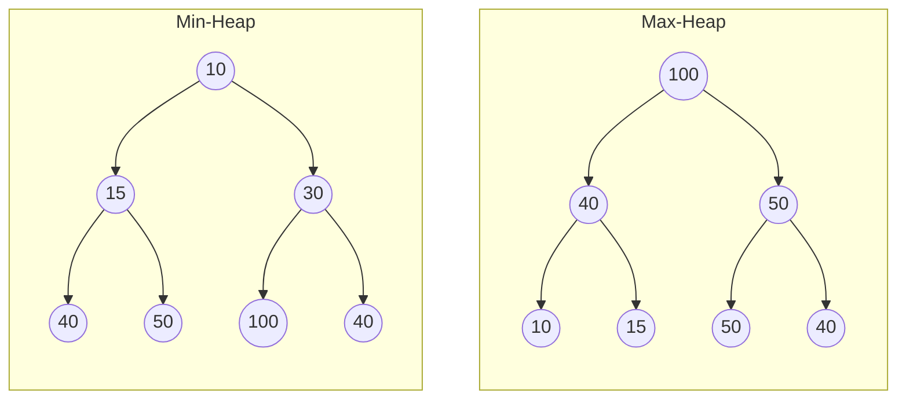
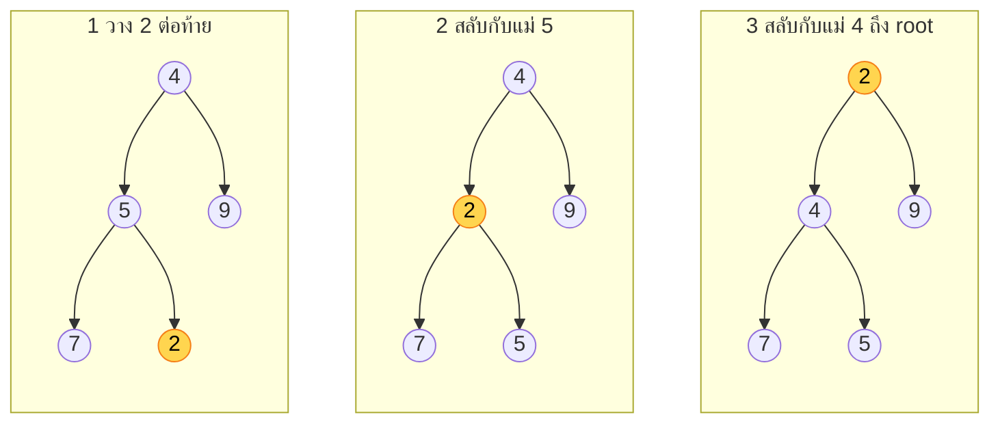
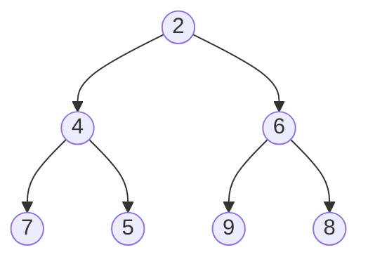
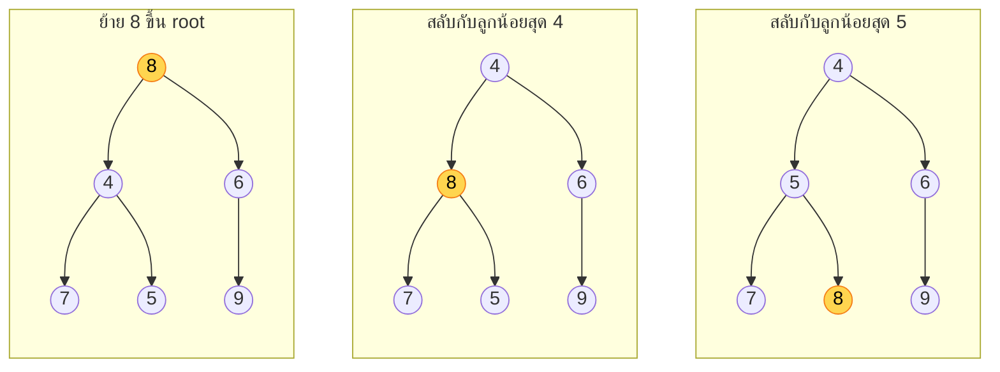
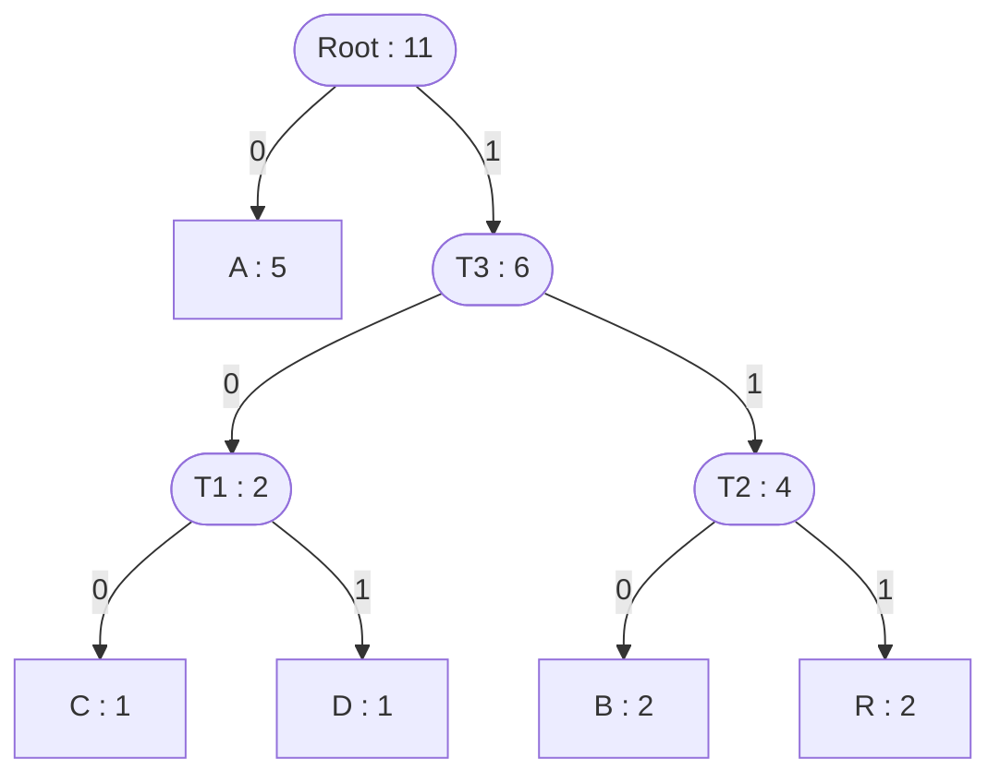

# บทที่ 9 — Priority Queue, Heap และ Huffman Coding

Oct 10, 2026 · สรุปจากสไลด์ของ ผศ.ดร.สิลดา อินทรโสธรฉันท์ (29 หน้า)

ก่อนหน้า: [[Ch8 Searching Algorithm]] · ถัดไป: [[Ch10 Hashing]] · ชุดเดียวกัน: [[Ch11 Graph]] · [[Ch12 Sorting]]

> [!abstract] บทนี้ต้องทำอะไรได้
> 1. อธิบายว่า Priority Queue ต่างจาก Queue ธรรมดาอย่างไร และ trace ลำดับเข้า–ออกได้
> 2. สร้าง **Min-Heap / Max-Heap** จากชุดข้อมูลทีละตัว (Up-Heap) และดึงค่าออก (Down-Heap) ได้
> 3. บอกหลักการและ Big-O ของ `insert`, `extract`, `peek` ทั้ง 3 รูปแบบการ implement
> 4. สร้าง **Huffman Tree** กำหนดรหัส และคำนวณจำนวนบิตก่อน–หลังบีบอัดได้

---

## 1. Concept — Priority Queue คืออะไร

Queue ทั่วไปใช้หลัก **FIFO** (มาก่อน ได้ก่อน) แต่ **Priority Queue** ให้คนที่มี **ความสำคัญสูงกว่า** ได้รับบริการก่อนเสมอ ไม่ว่าจะมาถึงเมื่อไร

| | Queue ธรรมดา | Priority Queue |
| --- | --- | --- |
| ใครออกก่อน | คนที่เข้ามาก่อน | คนที่ priority สูงสุด (หรือต่ำสุด แล้วแต่กำหนด) |
| ข้อมูลที่เก็บ | ค่า | คู่ **(Value, Priority)** |
| ถ้า priority เท่ากัน | – | กลับไปใช้ FIFO |

ตัวอย่างในชีวิตจริง

- **ห้องฉุกเฉิน (ER)** — ผู้ป่วยอาการหนักสุดได้รักษาก่อน ไม่ว่าจะมาถึงเมื่อไร
- **การขึ้นเครื่องบิน** — Business / First Class ขึ้นก่อน Economy
- **OS Task Scheduling** — Process ที่สำคัญกว่าได้ใช้ CPU ก่อน

### หลักการทำงาน 3 ข้อ

| การทำงาน | ความหมาย |
| --- | --- |
| **Enqueue / Push** (นำเข้า) | เพิ่มข้อมูลใหม่พร้อมค่าความสำคัญ โครงสร้างภายในจะจัดตำแหน่งให้เหมาะสม |
| **Dequeue / Pop** (นำออก) | ค้นหาและดึงข้อมูลที่ priority **สูงสุด** ออก แล้วปรับโครงสร้างใหม่รอคำสั่งถัดไป |
| **Tie-Breaking** (ความสำคัญเท่ากัน) | มักถอยกลับไปใช้ FIFO คือคนที่มาก่อนได้ออกก่อน |

### ตัวอย่างจากสไลด์ — คิวแผนกฉุกเฉิน

กำหนดให้ **ตัวเลขยิ่งน้อย = ความสำคัญยิ่งสูง** (1 คือวิกฤตที่สุด)

| ลำดับ | เหตุการณ์ | สถานะคิว (หัวคิวอยู่ซ้าย) | หมายเหตุ |
| --- | --- | --- | --- |
| 0 | เริ่มต้น | \[ \] | คิวว่าง |
| 1 | A เข้า (หกล้ม, P3) | \[A(P3)\] | |
| 2 | B เข้า (ปวดท้อง, P2) | \[B(P2), A(P3)\] | B แซงขึ้นหน้า |
| 3 | C เข้า (หัวใจวาย, P1) | \[C(P1), B(P2), A(P3)\] | C อยู่หน้าสุดทันที |
| 4 | หมอเรียก 1 คน (Dequeue) | \[B(P2), A(P3)\] | C ออก แม้มาทีหลังสุด |
| 5 | D เข้า (ไข้สูง, P2) | \[B(P2), D(P2), A(P3)\] | D เท่ากับ B จึงต่อหลัง B ตามลำดับการมา |

> [!tip] วิธี trace คิวแบบนี้ให้เร็ว
> ไม่ต้องจัดเรียงใหม่ทั้งคิวทุกครั้ง ให้ถามแค่ว่า "คนใหม่ต้องแทรกหลังใคร" → **แทรกต่อท้ายคนสุดท้ายที่ priority ดีกว่าหรือเท่ากับตัวเอง** (เท่ากันต้องอยู่หลัง เพราะมาทีหลัง)

---

## 2. Heap Data Structure

ในทางปฏิบัตินิยมสร้าง Priority Queue ด้วย **Binary Heap** เพราะทั้งเพิ่มและดึงข้อมูลทำได้ใน $O(\log n)$

### นิยาม

Heap คือ **Complete Binary Tree** (เติมโหนดทีละชั้นจากซ้ายไปขวา ไม่มีช่องโหว่) ที่มีคุณสมบัติลำดับระหว่างแม่กับลูก

| ชนิด | คุณสมบัติ | ค่าที่ Root |
| --- | --- | --- |
| **Min-Heap** | โหนดแม่ ≤ โหนดลูกเสมอ | ค่าน้อยที่สุด |
| **Max-Heap** | โหนดแม่ ≥ โหนดลูกเสมอ | ค่ามากที่สุด |

ตัวอย่างจากสไลด์ (ข้อมูลชุดเดียวกัน จัดได้ทั้งสองแบบ)



> [!warning] Heap ไม่ใช่ BST
> Heap กำหนดแค่ความสัมพันธ์ **แม่–ลูก** ไม่ได้กำหนดซ้าย–ขวา ลูกซ้ายจะมากกว่าหรือน้อยกว่าลูกขวาก็ได้ ดังนั้น Heap **ไม่ได้เรียงลำดับทั้งต้น** รู้แน่แค่ว่าตัวที่ root คือตัวที่น้อยสุด (หรือมากสุด)

### เก็บ Heap ในอาร์เรย์ (กุญแจสำคัญของการคิดเร็ว)

เพราะเป็น Complete Binary Tree จึงเก็บในอาร์เรย์ได้โดยอ่านทีละชั้นจากซ้ายไปขวา Root อยู่ที่ index 0

| ต้องการหา | สูตร (index เริ่มที่ 0) |
| --- | --- |
| แม่ของโหนด i | $\lfloor (i - 1) / 2 \rfloor$ |
| ลูกซ้ายของโหนด i | $2i + 1$ |
| ลูกขวาของโหนด i | $2i + 2$ |
| โหนดท้ายสุด | index $n - 1$ |
| ความสูงของต้นไม้ | $\lfloor \log_2 n \rfloor$ |

เช่น Min-Heap ด้านบน = `[10, 15, 30, 40, 50, 100, 40]` → ลูกของ index 1 (15) คือ index 3 (40) และ index 4 (50)

### A. การเพิ่มข้อมูล (Insertion) — อัลกอริทึม Up-Heap

1. นำข้อมูลใหม่ไปวาง **ต่อท้ายสุด** ของ Heap
2. เปรียบเทียบข้อมูลใหม่กับ **โหนดแม่**
3. ถ้าข้อมูลใหม่ **น้อยกว่า** แม่ (กรณี Min-Heap) ให้ **สลับตำแหน่ง**
4. ทำข้อ 2–3 ซ้ำขึ้นไปเรื่อยๆ จนกว่าข้อมูลใหม่จะมากกว่าหรือเท่ากับแม่ หรือขึ้นไปถึง Root

(Max-Heap ใช้ขั้นตอนเดียวกัน เปลี่ยนเงื่อนไขเป็น "ถ้ามากกว่าแม่ให้สลับ")

### ตัวอย่างจากสไลด์ — สร้าง Min-Heap จาก 4 5 9 7 2 8 6

| ใส่ | วางต่อท้ายแล้วได้ | Up-Heap | Heap หลังจบ (อาร์เรย์) |
| --- | --- | --- | --- |
| 4 | \[4\] | เป็น root ไม่ต้องทำ | \[4\] |
| 5 | \[4, 5\] | 5 > แม่ 4 ไม่สลับ | \[4, 5\] |
| 9 | \[4, 5, 9\] | 9 > แม่ 4 ไม่สลับ | \[4, 5, 9\] |
| 7 | \[4, 5, 9, 7\] | 7 > แม่ 5 ไม่สลับ | \[4, 5, 9, 7\] |
| 2 | \[4, 5, 9, 7, 2\] | 2 < แม่ 5 สลับ → 2 < แม่ 4 สลับ | \[2, 4, 9, 7, 5\] |
| 8 | \[2, 4, 9, 7, 5, 8\] | 8 < แม่ 9 สลับ → 8 > แม่ 2 หยุด | \[2, 4, 8, 7, 5, 9\] |
| 6 | \[2, 4, 8, 7, 5, 9, 6\] | 6 < แม่ 8 สลับ → 6 > แม่ 2 หยุด | \[2, 4, 6, 7, 5, 9, 8\] |

ภาพขั้นตอนตอนใส่ 2 (ตัวที่ขยับมากที่สุด)



Heap สุดท้ายหลังใส่ครบ 7 ตัว



### B. การดึงค่าน้อยที่สุดออก (Extract Minimum / Dequeue) — อัลกอริทึม Down-Heap

1. ดึงข้อมูลที่ **Root (index 0)** ออกไปใช้งาน
2. นำข้อมูล **ท้ายสุด** ของ Heap ขึ้นมาวางแทนที่ Root
3. เปรียบเทียบโหนดที่ Root กับ **ลูกทั้งสอง**
4. ถ้ามากกว่าลูก ให้สลับกับ **ลูกที่มีค่าน้อยที่สุด**
5. ทำข้อ 3–4 ซ้ำลงไปเรื่อยๆ จนกว่าจะน้อยกว่าลูกทั้งสอง หรือลงไปถึง Leaf

(Max-Heap: สลับกับ **ลูกที่มากที่สุด**)

### ตัวอย่างเสริม — ดึงค่าออกจาก Heap ที่เพิ่งสร้าง 2 ครั้ง

เริ่มจาก `[2, 4, 6, 7, 5, 9, 8]`

**ครั้งที่ 1** ดึง 2 ออก

| ขั้น | อาร์เรย์ | คำอธิบาย |
| --- | --- | --- |
| ย้ายตัวท้ายขึ้น root | \[**8**, 4, 6, 7, 5, 9\] | 8 (ตัวท้ายสุด) มาแทน 2 |
| เทียบกับลูก 4, 6 | \[4, **8**, 6, 7, 5, 9\] | ลูกน้อยสุดคือ 4 และ 8 > 4 → สลับ |
| เทียบกับลูก 7, 5 | \[4, 5, 6, 7, **8**, 9\] | ลูกน้อยสุดคือ 5 และ 8 > 5 → สลับ ถึง leaf หยุด |



**ครั้งที่ 2** ดึง 4 ออก → ย้าย 9 ขึ้น root: \[9, 5, 6, 7, 8\] → สลับกับ 5: \[5, 9, 6, 7, 8\] → สลับกับ 7: **\[5, 7, 6, 9, 8\]**

ค่าที่ออกมาตามลำดับ: 2, 4, … จะออกจากน้อยไปมากเสมอ — นี่คือหลักของ Heap Sort ใน [[Ch12 Sorting]]

### ทริคและมุมมองที่เร็วกว่า

> [!tip] ทริค 1 — ทำ Up-Heap / Down-Heap บนอาร์เรย์ ไม่ต้องวาดต้นไม้ทุกขั้น
> วาดต้นไม้เฉพาะตอนเริ่มและตอนจบ ระหว่างทางใช้สูตร index
> - ใส่ 2 ที่ index 4 → แม่คือ (4−1)/2 = **index 1** (ค่า 5) → สลับ → ตอนนี้อยู่ index 1 → แม่คือ **index 0** (ค่า 4) → สลับ
> - เส้นทาง Up-Heap ของตัวที่ index i คือ i → (i−1)/2 → … → 0 **ตายตัว** รู้ล่วงหน้าได้เลยว่าจะเทียบกับใครบ้าง

> [!tip] ทริค 2 — จำนวนการสลับมากสุด = ความสูงของต้นไม้
> ใส่หรือดึง 1 ครั้ง สลับได้ไม่เกิน $\lfloor \log_2 n \rfloor$ ครั้ง เช่น heap 7 ตัว สลับได้มากสุด 2 ครั้ง ถ้านับได้เกินนี้แปลว่าทำผิด นี่คือที่มาของ $O(\log n)$

> [!tip] ทริค 3 — ตรวจว่าอาร์เรย์เป็น Heap หรือไม่ภายในไม่กี่วินาที
> ไล่เฉพาะโหนดที่มีลูก คือ index 0 ถึง $\lfloor n/2 \rfloor - 1$ แล้วเช็กว่า `A[i]` ≤ `A[2i+1]` และ `A[i]` ≤ `A[2i+2]` (Min-Heap) เจอคู่เดียวที่ผิดก็ตอบได้ว่าไม่ใช่ heap
> เช่น `[3, 9, 5, 12, 10, 4, 8]` → index 2 (ค่า 5) มีลูกคือ index 5 (ค่า 4) → 5 > 4 **ไม่ใช่ Min-Heap**

> [!tip] ทริค 4 — ตอน Down-Heap ให้หา "ลูกที่ชนะ" ก่อน แล้วเทียบกับแม่ครั้งเดียว
> ข้อผิดพลาดยอดนิยมคือสลับกับลูกซ้ายทันทีโดยไม่ดูลูกขวา จำไว้ว่า Min-Heap สลับกับลูกที่ **น้อยกว่า** Max-Heap สลับกับลูกที่ **มากกว่า** เพื่อให้ตัวที่ขึ้นมาเป็นแม่ชนะลูกอีกตัวด้วย

> [!note] ลำดับการใส่ต่างกัน ได้ Heap ต่างกัน (ความรู้เสริม)
> ข้อมูลชุดเดียวกันสร้าง heap ได้หลายหน้าตา การใส่ทีละตัวแบบสไลด์ได้ `[2, 4, 6, 7, 5, 9, 8]` แต่ถ้าใช้วิธี build แบบ bottom-up (Heapify จากโหนดกลางลงมา) จะได้ `[2, 4, 6, 7, 5, 8, 9]` ซึ่งเป็น heap ที่ถูกต้องทั้งคู่ **ข้อสอบให้ทำแบบสไลด์ คือใส่ทีละตัวตามลำดับ**

---

## 3. Core Operations

แต่ละสมาชิกเก็บเป็นคู่ **(Value, Priority)** มี operation หลัก 3 ตัว

| Operation | ชื่ออื่น | ทำอะไร |
| --- | --- | --- |
| `insert(item, priority)` | `push()` | เพิ่มข้อมูลพร้อมระดับความสำคัญ |
| `extractMax()` / `extractMin()` | `pop()` | ดึงข้อมูลที่สำคัญสูงสุด/ต่ำสุดออกมาใช้ (คืนค่า **และลบ**) |
| `peek()` | `top()` | ดูข้อมูลที่สำคัญสูงสุด/ต่ำสุด โดย **ยังไม่ดึงออก** |

ฟังก์ชันเสริมที่ใช้บ่อย

| Operation | ทำอะไร | เวลา |
| --- | --- | --- |
| `isEmpty()` | ตรวจว่าคิวว่างหรือไม่ คืน true/false | $O(1)$ |
| `size()` | คืนจำนวนสมาชิกปัจจุบัน | $O(1)$ |
| `changePriority(item, new_priority)` | เปลี่ยนค่าความสำคัญ แล้ว Up-Heap หรือ Down-Heap ใหม่ | $O(\log n)$ |

### วิธี implement 3 แบบ

**แบบที่ 1 — Unordered (ใส่แบบไม่เรียง)** เน้นเพิ่มให้เร็วที่สุด ค่อยไปหาตัวสำคัญตอนดึงออก

- `insert` — $O(1)$ วางต่อท้าย Array / Linked List ทันที ไม่ต้องจัดเรียง
- `extract` — $O(n)$ วนสแกนหาตัวที่ priority สูงสุดตั้งแต่ต้นจนจบ ดึงออก แล้วขยับ Array ปิดช่องว่าง (หรือตัด Node)
- `peek` — $O(n)$ ต้องสแกนหาเหมือนกัน แต่ไม่ลบ

**แบบที่ 2 — Ordered (เรียงรอไว้เสมอ)** ยอมเสียเวลาตอนใส่ เพื่อดึงตัวสำคัญได้ทันที

- `insert` — $O(n)$ วนหาตำแหน่งที่ถูกต้องแล้วแทรก (แนวคิดเดียวกับ Insertion Sort) ถ้าเป็น Array ต้องเลื่อนตัวอื่นถอยหลัง
- `extract` — $O(1)$ ตัวสำคัญที่สุดอยู่หัวแถว (หรือท้ายแถว) เสมอ
- `peek` — $O(1)$ อ่านจากหัวแถว/ท้ายแถวตรงๆ

**แบบที่ 3 — Binary Heap**

- `insert` — $O(\log n)$ วางท้ายสุดแล้ว **Up-Heap**
- `extract` — $O(\log n)$ ดึง Root, ย้ายตัวท้ายสุดขึ้นมาแทน แล้ว **Down-Heap**
- `peek` — $O(1)$ อ่านค่าที่ Root ตรงๆ ไม่แตะโครงสร้าง

### ตารางเปรียบเทียบ (ออกสอบบ่อย)

| รูปแบบ | Insert | Extract | Peek | เหมาะกับสถานการณ์ |
| --- | --- | --- | --- | --- |
| Unordered Array / List | $O(1)$ | $O(n)$ | $O(n)$ | ใส่ถี่ๆ แต่ดึงออกนานๆ ครั้ง |
| Ordered Array / List | $O(n)$ | $O(1)$ | $O(1)$ | ข้อมูลน้อย หรืออ่าน/ดึงบ่อยแต่ใส่น้อย |
| **Binary Heap** | $O(\log n)$ | $O(\log n)$ | $O(1)$ | **สมดุลที่สุด** ใส่และดึงสลับกันตลอดเวลา |

> [!tip] วิธีจำตาราง
> Unordered กับ Ordered คือ "กระจกเงา" ของกัน — งานหนัก $O(n)$ ต้องเกิดที่ใดที่หนึ่ง จะจ่ายตอนใส่ (Ordered) หรือจ่ายตอนดึง (Unordered) ส่วน Heap แบ่งจ่ายทั้งสองฝั่งฝั่งละ $O(\log n)$
> ตัวเลขให้เห็นภาพ: ข้อมูล 1,000,000 ตัว → $O(n)$ ≈ ล้านขั้น แต่ $O(\log n)$ ≈ 20 ขั้น

### โค้ด Min-Heap (Java)

```java
class MinHeap {
    private int[] heap;
    private int size = 0;

    MinHeap(int capacity) { heap = new int[capacity]; }

    boolean isEmpty() { return size == 0; }
    int size()        { return size; }
    int peek()        { return heap[0]; }             // O(1)

    void insert(int x) {                              // O(log n)
        heap[size] = x;                               // 1) วางต่อท้าย
        int i = size++;
        while (i > 0 && heap[i] < heap[(i - 1) / 2]) {   // 2-3) น้อยกว่าแม่ → สลับ
            swap(i, (i - 1) / 2);
            i = (i - 1) / 2;                          // 4) ขยับขึ้นไปเทียบต่อ
        }
    }

    int extractMin() {                                // O(log n)
        int min = heap[0];                            // 1) ดึง root
        heap[0] = heap[--size];                       // 2) ตัวท้ายสุดขึ้นมาแทน
        int i = 0;
        while (true) {
            int left = 2 * i + 1, right = 2 * i + 2, smallest = i;
            if (left < size && heap[left] < heap[smallest])   smallest = left;
            if (right < size && heap[right] < heap[smallest]) smallest = right;
            if (smallest == i) break;                 // น้อยกว่าลูกทั้งสองแล้ว
            swap(i, smallest);                        // 4) สลับกับลูกที่น้อยที่สุด
            i = smallest;
        }
        return min;
    }

    private void swap(int a, int b) { int t = heap[a]; heap[a] = heap[b]; heap[b] = t; }
}
```

เปลี่ยนเป็น Max-Heap: กลับเครื่องหมาย `<` เป็น `>` ในการเทียบทั้ง 3 จุด

---

## 4. การนำไปใช้งานจริง

Priority Queue เป็นส่วนประกอบของอัลกอริทึมสำคัญหลายตัว

| อัลกอริทึม | ใช้ Priority Queue ทำอะไร | ดูต่อ |
| --- | --- | --- |
| Dijkstra's Shortest Path | เลือกโหนดที่ระยะสะสมน้อยที่สุดถัดไป | [[Ch11 Graph]] |
| A* Search | เลือกสถานะที่ค่าประมาณดีที่สุด | – |
| Huffman Coding | ดึงโหนดความถี่น้อยสุด 2 ตัวมารวมกัน | หัวข้อถัดไป |
| Heap Sort | ดึงค่ามากสุดออกทีละตัวไปไว้ท้ายอาร์เรย์ | [[Ch12 Sorting]] |

---

## 5. Huffman Coding

### แนวคิด

อัลกอริทึม **บีบอัดข้อมูลแบบไม่สูญเสีย** (Lossless Data Compression) หลักการคือ

> ข้อมูลที่ **ปรากฏบ่อยที่สุด** ใช้รหัสที่ **สั้นที่สุด** ข้อมูลที่ปรากฏน้อยใช้รหัสที่ยาวกว่า

ใช้ **Priority Queue (Min-Heap)** เป็นตัวช่วยสร้างต้นไม้ตัดสินใจที่เรียกว่า **Huffman Tree**

### ขั้นตอนมาตรฐาน (4 ขั้น)

1. **นับความถี่** ของแต่ละตัวอักษรในข้อมูลทั้งหมด
2. **สร้าง Min-Heap** — สร้าง Leaf Node ให้ทุกตัวอักษร โดย Priority = ความถี่ (ความถี่น้อยสุดอยู่บนสุด)
3. **สร้าง Huffman Tree** — `extractMin()` 2 ครั้ง ได้ 2 โหนดที่ความถี่น้อยสุด รวมเป็นโหนดใหม่ (ความถี่ = ผลบวก) แล้ว `insert()` กลับลง Heap ทำซ้ำจนเหลือโหนดเดียว (Root)
4. **กำหนดรหัส** — เริ่มจาก Root กิ่ง **ซ้าย = 0** กิ่ง **ขวา = 1** รหัสของแต่ละตัวอักษรคือลำดับ 0/1 จาก Root ถึง Leaf ของตัวนั้น

### ตัวอย่างจากสไลด์ — "ABRACADABRA" (11 ตัวอักษร)

**ขั้นที่ 1 นับความถี่**

| ตัวอักษร | A | B | R | C | D |
| --- | --- | --- | --- | --- | --- |
| ความถี่ | 5 | 2 | 2 | 1 | 1 |

**ขั้นที่ 2 ใส่ Min-Heap** (เรียงจากน้อยไปมาก): `[C:1, D:1, B:2, R:2, A:5]`

**ขั้นที่ 3 สร้าง Huffman Tree**

| รอบ | ดึงออก 2 ตัว | รวมเป็น | Heap หลังใส่กลับ |
| --- | --- | --- | --- |
| 1 | C:1 และ D:1 | **T1:2** | \[B:2, R:2, T1:2, A:5\] |
| 2 | B:2 และ R:2 | **T2:4** | \[T1:2, T2:4, A:5\] |
| 3 | T1:2 และ T2:4 | **T3:6** | \[A:5, T3:6\] |
| 4 | A:5 และ T3:6 | **Root:11** | เหลือโหนดเดียว → เสร็จ |



**ขั้นที่ 4 ตารางรหัส** (อ่านเลขบนกิ่งจาก Root ลงมา)

| ตัวอักษร | ความถี่ | เส้นทาง | รหัส | ความยาว |
| --- | --- | --- | --- | --- |
| A | 5 | ซ้าย | `0` | 1 bit |
| C | 1 | ขวา–ซ้าย–ซ้าย | `100` | 3 bits |
| D | 1 | ขวา–ซ้าย–ขวา | `101` | 3 bits |
| B | 2 | ขวา–ขวา–ซ้าย | `110` | 3 bits |
| R | 2 | ขวา–ขวา–ขวา | `111` | 3 bits |

**ผลการบีบอัด**

- ก่อนบีบอัด (ASCII): 11 ตัวอักษร × 8 bits = **88 bits**
- หลังบีบอัด: A (5×1) + B (2×3) + R (2×3) + C (1×3) + D (1×3) = 5 + 6 + 6 + 3 + 3 = **23 bits**
- ประหยัดไป (88 − 23)/88 = 65/88 ≈ **73.8%**
- A ที่พบบ่อยสุด (5 ครั้ง) ได้รหัสสั้นสุดคือ `0` ยาวเพียง 1 บิต

ข้อความที่เข้ารหัสแล้ว:

```text
A  B   R   A  C   A  D   A  B   R   A
0  110 111 0  100 0  101 0  110 111 0   →  01101110100010101101110  (23 bits)
```

### การถอดรหัส (Decode)

อ่านบิตทีละตัว เดินจาก Root ตามกิ่ง 0/1 พอถึง Leaf ก็ได้ตัวอักษร 1 ตัว แล้วกลับไปเริ่มที่ Root ใหม่ ทำได้โดยไม่ต้องมีตัวคั่น เพราะรหัส Huffman เป็น **prefix code** — ไม่มีรหัสของตัวใดเป็นส่วนขึ้นต้นของอีกตัว (ทุกตัวอักษรอยู่ที่ Leaf เท่านั้น)

เช่น `0110…` → `0` ถึง Leaf A · `1`→`1`→`0` ถึง Leaf B → ได้ "AB…"

### ทริคและมุมมองที่เร็วกว่า

> [!tip] ทริค 1 — หาจำนวนบิตรวมโดยไม่ต้องสร้างตารางรหัส
> **จำนวนบิตหลังบีบอัด = ผลรวมค่าของโหนดที่เกิดจากการรวมทุกโหนด** (โหนดภายในทั้งหมด รวม Root)
> ABRACADABRA: T1 + T2 + T3 + Root = 2 + 4 + 6 + 11 = **23** ✓
> เหตุผล: ตัวอักษรที่อยู่ลึก d ชั้น ถูกนับรวมอยู่ในโหนดภายใน d โหนดพอดี จึงเท่ากับ ความถี่ × ความยาวรหัส นั่นเอง
> ถ้าโจทย์ถามแค่ "ใช้กี่บิต / ประหยัดกี่เปอร์เซ็นต์" บวกเลขในคอลัมน์ "รวมเป็น" แล้วตอบได้เลย

> [!tip] ทริค 2 — ตรวจคำตอบ 4 จุด
> 1. ตัวอักษร n ชนิด ต้องรวม **n − 1 รอบ** พอดี (5 ชนิด → 4 รอบ)
> 2. ค่าที่ **Root = จำนวนตัวอักษรทั้งหมด** (11)
> 3. ตัวที่ความถี่มากกว่า ต้องได้รหัส **ไม่ยาวกว่า** ตัวที่ความถี่น้อยกว่า
> 4. ไม่มีรหัสใดเป็น prefix ของรหัสอื่น และผลรวมของ $2^{-\text{ความยาว}}$ ต้องเท่ากับ 1 พอดี: $\tfrac12 + 4 \times \tfrac18 = 1$ ✓

> [!tip] ทริค 3 — ความถี่เท่ากันจะเลือกตัวไหน
> หลังรอบที่ 1 ใน heap มี B:2, R:2, T1:2 เท่ากันสามตัว สไลด์ใช้หลัก Tie-Breaking แบบ FIFO คือ **ตัวที่อยู่ใน heap ก่อนออกก่อน** จึงได้ B กับ R ถ้าเลือกต่างออกไป (เช่น T1 กับ B) หน้าตาต้นไม้และรหัสจะเปลี่ยน แต่ **จำนวนบิตรวมยังเป็น 23 เท่าเดิม** (2 + 4 + 6 + 11) เพราะ Huffman ให้ผลที่ดีที่สุดเสมอ
> ในข้อสอบ: ยึดลำดับแบบสไลด์ และวางตัวที่ดึงออกก่อนไว้กิ่งซ้าย (0)

> [!tip] ทริค 4 — เทียบกับรหัสความยาวคงที่
> 5 ตัวอักษรต้องใช้อย่างน้อย 3 บิต/ตัว ($2^3 = 8 \ge 5$) → 11 × 3 = 33 bits Huffman (23 bits) ยังดีกว่า และเฉลี่ยใช้ 23/11 ≈ 2.09 bits ต่อตัวอักษร

---

## 6. ข้อสังเกตจากสไลด์ (จุดที่พิมพ์คลาดเคลื่อน)

| หน้า | ที่เขียนในสไลด์ | ที่ควรเป็น |
| --- | --- | --- |
| 10–13 | หัวข้อเขียนชุดข้อมูลว่า "4 5 9 72 8 6" | 4 5 9 **7 2** 8 6 (เจ็ดตัว) |
| 13 | ป้ายกำกับ "Input 8" (ซ้ำกับหน้า 12) | **Input 6** — ภาพแสดงการใส่ 6 แล้วสลับกับ 8 |
| 17–18 | อธิบาย insert/extract ด้วยคำว่า "ความสำคัญสูงกว่า" | เป็นคำอธิบายแบบทั่วไป (Max-Heap) ส่วนหน้า 8–9 อธิบายแบบ Min-Heap หลักการเดียวกัน กลับเครื่องหมาย |
| 29 | "A … จะได้รหัสสั้นที่สุดเพียงแค่ 0 บิตเดียว" | หมายถึงรหัส `0` ซึ่งยาว **1 บิต** |

---

## 7. แบบฝึกหัดพร้อมเฉลย

**ข้อ 1** สร้าง Min-Heap โดยใส่ 15, 10, 20, 8, 12, 5 ทีละตัว จากนั้น extractMin 2 ครั้ง แสดงอาร์เรย์ทุกขั้น

> [!success]- เฉลยข้อ 1
> | ใส่ | Up-Heap | Heap |
> | --- | --- | --- |
> | 15 | – | \[15\] |
> | 10 | 10 < 15 สลับ | \[10, 15\] |
> | 20 | 20 > 10 ไม่สลับ | \[10, 15, 20\] |
> | 8 | 8 < 15 สลับ → 8 < 10 สลับ | \[8, 10, 20, 15\] |
> | 12 | แม่คือ 10 → ไม่สลับ | \[8, 10, 20, 15, 12\] |
> | 5 | 5 < 20 สลับ → 5 < 8 สลับ | \[5, 10, 8, 15, 12, 20\] |
>
> extractMin ครั้งที่ 1: ได้ **5** → ย้าย 20 ขึ้น: \[20, 10, 8, 15, 12\] → ลูกน้อยสุดคือ 8 สลับ → **\[8, 10, 20, 15, 12\]**
>
> extractMin ครั้งที่ 2: ได้ **8** → ย้าย 12 ขึ้น: \[12, 10, 20, 15\] → ลูกน้อยสุดคือ 10 สลับ → \[10, 12, 20, 15\] → ลูกของ index 1 คือ 15 ซึ่งมากกว่า 12 หยุด → **\[10, 12, 20, 15\]**

**ข้อ 2** สร้าง Max-Heap โดยใส่ 3, 8, 5, 10, 1, 9 ทีละตัว แล้ว extractMax 1 ครั้ง

> [!success]- เฉลยข้อ 2
> \[3\] → ใส่ 8: \[8, 3\] → ใส่ 5: \[8, 3, 5\] → ใส่ 10: 10 > 3 สลับ, 10 > 8 สลับ → \[10, 8, 5, 3\] → ใส่ 1: \[10, 8, 5, 3, 1\] → ใส่ 9: 9 > 5 สลับ, 9 < 10 หยุด → **\[10, 8, 9, 3, 1, 5\]**
>
> extractMax: ได้ **10** → ย้าย 5 ขึ้น: \[5, 8, 9, 3, 1\] → ลูกมากสุดคือ 9 สลับ → **\[9, 8, 5, 3, 1\]**

**ข้อ 3** จากข้อมูล 4 5 9 7 2 8 6 ถ้าสร้างเป็น Max-Heap (ใส่ทีละตัว) จะได้อาร์เรย์อะไร

> [!success]- เฉลยข้อ 3
> \[4\] → \[5, 4\] → \[9, 4, 5\] → ใส่ 7: 7 > 4 สลับ → \[9, 7, 5, 4\] → ใส่ 2: \[9, 7, 5, 4, 2\] → ใส่ 8: 8 > 5 สลับ → \[9, 7, 8, 4, 2, 5\] → ใส่ 6: แม่คือ 8 ไม่สลับ → **\[9, 7, 8, 4, 2, 5, 6\]**

**ข้อ 4** คิว ER (เลขน้อย = สำคัญกว่า) ทำตามลำดับ: A(P2) เข้า, B(P3) เข้า, C(P1) เข้า, Dequeue, D(P1) เข้า, E(P2) เข้า, Dequeue, Dequeue — ใครได้รับการรักษาตามลำดับ และเหลือใครในคิว

> [!success]- เฉลยข้อ 4
> - หลัง 3 คนแรก: \[C(P1), A(P2), B(P3)\]
> - Dequeue → **C** · เหลือ \[A(P2), B(P3)\]
> - D(P1) เข้า → \[D(P1), A(P2), B(P3)\] · E(P2) เข้า (เท่ากับ A ต้องต่อหลัง A) → \[D(P1), A(P2), E(P2), B(P3)\]
> - Dequeue → **D** · Dequeue → **A**
> - ลำดับการรักษา: C, D, A · เหลือในคิว \[E(P2), B(P3)\]

**ข้อ 5** สร้าง Huffman Code ของข้อความ "MISSISSIPPI" และหาจำนวนบิตก่อน–หลังบีบอัด

> [!success]- เฉลยข้อ 5
> ความถี่: M:1, P:2, I:4, S:4 (รวม 11 ตัว) → Heap \[M:1, P:2, I:4, S:4\]
>
> | รอบ | ดึงออก | รวมเป็น | Heap |
> | --- | --- | --- | --- |
> | 1 | M:1, P:2 | T1:3 | \[T1:3, I:4, S:4\] |
> | 2 | T1:3, I:4 | T2:7 | \[S:4, T2:7\] |
> | 3 | S:4, T2:7 | Root:11 | เสร็จ |
>
> รหัส (ซ้าย = 0 คือตัวที่ดึงออกก่อน): S = `0`, M = `100`, P = `101`, I = `11`
>
> จำนวนบิต = 3 + 7 + 11 = **21 bits** (ตรวจ: S 4×1 + I 4×2 + M 1×3 + P 2×3 = 4 + 8 + 3 + 6 = 21 ✓)
> ก่อนบีบอัด 11 × 8 = 88 bits → ประหยัด 67/88 ≈ **76.1%**
>
> หมายเหตุ: รอบ 2 มี I กับ S เท่ากัน ถ้าเลือก S แทน I รหัสของ I กับ S จะสลับกัน แต่ได้ 21 bits เท่าเดิม

**ข้อ 6** ตัวอักษร 6 ชนิดมีความถี่ a:45, b:13, c:12, d:16, e:9, f:5 ถ้าใช้ Huffman Code จะใช้ทั้งหมดกี่บิต และประหยัดกว่ารหัสความยาวคงที่ 3 บิตเท่าไร

> [!success]- เฉลยข้อ 6
> รวมทีละรอบ: f:5 + e:9 = **14** → c:12 + b:13 = **25** → 14 + d:16 = **30** → 25 + 30 = **55** → a:45 + 55 = **100**
>
> จำนวนบิต = 14 + 25 + 30 + 55 + 100 = **224 bits**
> ความยาวรหัส: a = 1, b = c = d = 3, e = f = 4 (ตรวจ: 45 + 39 + 36 + 48 + 36 + 20 = 224 ✓)
> รหัสคงที่ 3 บิต: 100 × 3 = 300 bits → Huffman ประหยัดกว่า 76 bits (ประมาณ 25%)

**ข้อ 7** ระบบหนึ่งรับงานเข้ามาวินาทีละหลายพันงาน แต่ดึงงานที่สำคัญที่สุดออกมาประมวลผลเพียงชั่วโมงละครั้ง ควร implement Priority Queue แบบใด เพราะอะไร

> [!success]- เฉลยข้อ 7
> **Unordered Array / List** เพราะ insert เป็น $O(1)$ เหมาะกับการใส่ถี่มาก ส่วน extract ที่เป็น $O(n)$ เกิดนานๆ ครั้งจึงรับได้ (ถ้าการใส่และดึงเกิดสลับกันถี่พอๆ กัน จึงควรใช้ Binary Heap)

---

## 8. สรุปก่อนสอบ

> [!summary] จำ 10 ข้อนี้
> 1. Priority Queue = ออกตาม **ความสำคัญ** ไม่ใช่ลำดับการมา · เท่ากันใช้ FIFO
> 2. Heap = Complete Binary Tree + กฎแม่–ลูก (Min: แม่ ≤ ลูก, Max: แม่ ≥ ลูก)
> 3. อาร์เรย์: แม่ = (i − 1)/2 · ลูกซ้าย = 2i + 1 · ลูกขวา = 2i + 2
> 4. **Insert = วางท้ายสุด + Up-Heap** (เทียบกับแม่ สลับขึ้น)
> 5. **Extract = เอา root ออก + ย้ายตัวท้ายขึ้น root + Down-Heap** (สลับกับลูกที่น้อยสุด/มากสุด)
> 6. Heap: insert $O(\log n)$, extract $O(\log n)$, peek $O(1)$
> 7. Unordered: insert $O(1)$, extract $O(n)$ · Ordered: insert $O(n)$, extract $O(1)$
> 8. Huffman: นับความถี่ → Min-Heap → ดึง 2 ตัวน้อยสุดมารวมแล้วใส่กลับ → ซ้าย 0 ขวา 1
> 9. ตัวที่พบบ่อยได้รหัสสั้น · จำนวนบิตรวม = ผลบวกของโหนดที่รวมขึ้นมาทุกโหนด
> 10. ใช้ใน Dijkstra, A*, Huffman Coding, Heap Sort
