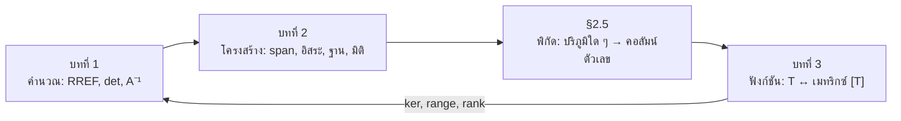
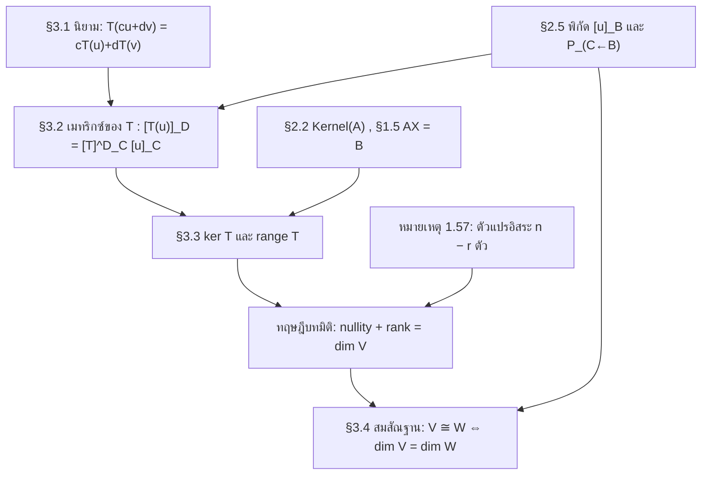
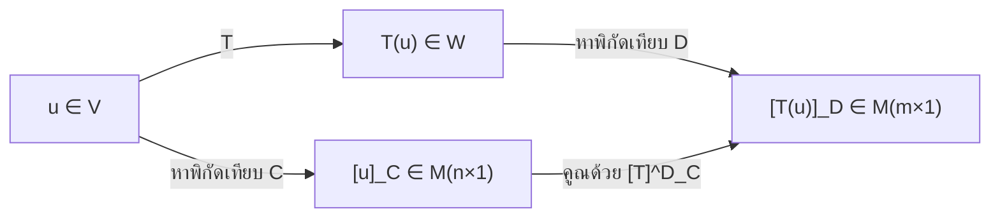
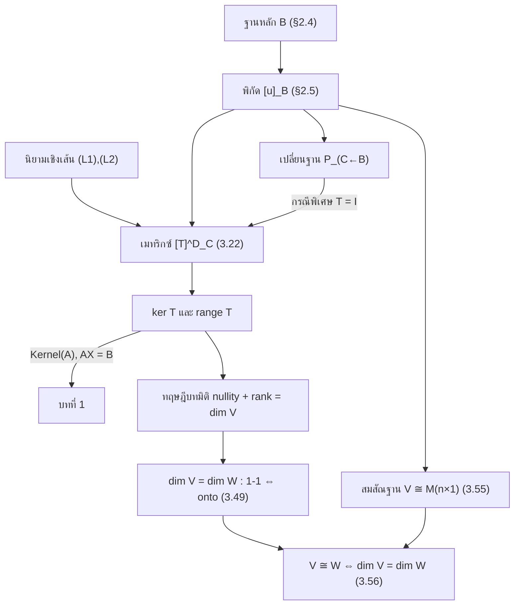

# สรุปพีชคณิตเชิงเส้น SC402101 — Lecture 1–7
## เมทริกซ์ · ระบบสมการเชิงเส้น · ปริภูมิเวกเตอร์ · พิกัดและการเปลี่ยนฐาน · การแปลงเชิงเส้น

*เอกสารสรุปเชิงคณิตศาสตร์บริสุทธิ์ พร้อมบทพิสูจน์ การเชื่อมโยงแนวคิด และคลังกลยุทธ์การแก้โจทย์ — เขียนสมการด้วย LaTeX (`$…$`, `$$…$$`) และ callout ที่เปิดใน Obsidian ได้โดยตรง*

> [!info] สารบัญ
> - [[#ภาค 0 — แผนที่ความคิด เนื้อหาทั้งหมดนี้เชื่อมกันอย่างไร|ภาค 0 — แผนที่ความคิด]]
> - [[#ภาค I — บทที่ 1 เมทริกซ์และระบบสมการเชิงเส้น|ภาค I — บทที่ 1 เมทริกซ์และระบบสมการเชิงเส้น]] (Lecture 1–3)
> - [[#ภาค II — บทที่ 2 ปริภูมิเวกเตอร์|ภาค II — บทที่ 2 ปริภูมิเวกเตอร์]] (Lecture 4–6) รวม [[#§2.5 พิกัดและการเปลี่ยนฐานหลัก (Lecture 6)|§2.5 พิกัดและการเปลี่ยนฐาน]]
> - [[#ภาค III — บทที่ 3 การแปลงเชิงเส้น (Linear Transformations)|ภาค III — บทที่ 3 การแปลงเชิงเส้น]] (Lecture 7 + ส่วนที่เหลือของบท)
> - [[#ภาค IV — คลังโจทย์แยกกลุ่ม พร้อมกลยุทธ์การแก้|ภาค IV — คลังโจทย์ 16 กลุ่ม (A–P)]]
> - [[#ภาค V — เช็คลิสต์ทบทวนและข้อผิดพลาดที่พบบ่อย|ภาค V — เช็คลิสต์และข้อผิดพลาด]]

---

# ภาค 0 — แผนที่ความคิด เนื้อหาทั้งหมดนี้เชื่อมกันอย่างไร

ก่อนลงรายละเอียด ขอให้จับ **แกนกลางเส้นเดียว** ที่ร้อยเนื้อหาทั้ง 5 lecture เข้าด้วยกันให้ได้ก่อน เพราะถ้าจับแกนนี้ได้ ทุกทฤษฎีบทจะกลายเป็นเรื่องเดียวกันที่มองจากคนละมุม

### เส้นเรื่องหลัก

> **ทุกคำถามในบทที่ 2 ถูกแปลกลับเป็นคำถามเดียวของบทที่ 1 เสมอ นั่นคือ "ระบบสมการเชิงเส้น $AX = B$ มีผลเฉลยหรือไม่ และมีกี่ชุด"**

ดูให้ชัด ๆ ว่าเนื้อหาไหลไปอย่างไร:

```
        ระบบสมการเชิงเส้น (สิ่งที่เราอยากแก้)
                    │
                    ▼
        เขียนย่อเป็น  AX = B  ←──── §1.1 เมทริกซ์ + การดำเนินการ
                    │
        ┌───────────┴────────────┐
        ▼                        ▼
  ทาง "ผกผัน"              ทาง "ลดรูป"
  X = A⁻¹B                  [A|B] ~ REF/RREF
  §1.2 inverse              §1.4 การดำเนินการตามแถว
        │                        │
        ▼                        │
  det A ≠ 0 ?  ──── §1.3 ───────┤
        │                        │
        └────────┬───────────────┘
                 ▼
     ทฤษฎีบทเทียบเท่า (Invertible Matrix Theorem)
     A ไม่เอกฐาน ⟺ det A ≠ 0 ⟺ A ~ Iₙ ⟺ AX = B มีผลเฉลยเดียว
                 │
                 ▼
        §1.5 การจำแนก 3 กรณี: ไม่มีผลเฉลย / เดียว / อนันต์
                 │
                 ▼
   ═══════════ บทที่ 2 : เปลี่ยนมุมมองเป็น "โครงสร้าง" ═══════════
                 │
     เซตของผลเฉลย มีโครงสร้างอะไร ? ──▶ ปริภูมิเวกเตอร์ §2.1
     เซตย่อยแบบไหนที่ยังเป็นปริภูมิ ? ──▶ ปริภูมิย่อย §2.2
     สร้างปริภูมิจากเวกเตอร์ไม่กี่ตัว ? ──▶ span §2.3
     ใช้เวกเตอร์กี่ตัวถึงจะ "พอดี" ? ──▶ อิสระเชิงเส้น + ฐานหลัก §2.4
                 │
                 ▼
              มิติ (dimension)
```

### สี่คำถามที่กลับมาซ้ำ ๆ ตลอดเอกสาร

| คำถามเชิงโครงสร้าง (บทที่ 2) | แปลเป็นระบบสมการ (บทที่ 1) | ผลลัพธ์ที่ต้องดู |
|---|---|---|
| $u$ เป็นผลรวมเชิงเส้นของ $v_1,\dots,v_n$ ไหม | $c_1v_1+\cdots+c_nv_n = u$ (RHS เป็น**ค่าคงตัว**) | มีผลเฉลย = ใช่ |
| $\{v_1,\dots,v_n\}$ แผ่ทั่ว $V$ ไหม | $c_1v_1+\cdots+c_nv_n = u$ (RHS เป็น**ตัวแปรทั่วไป**) | มีผลเฉลย**ทุก** RHS = ใช่ |
| $\{v_1,\dots,v_n\}$ อิสระเชิงเส้นไหม | $c_1v_1+\cdots+c_nv_n = \theta_V$ (RHS เป็น**ศูนย์**) | มีเฉพาะผลเฉลยชัด = ใช่ |
| $\{v_1,\dots,v_n\}$ เป็นฐานหลักไหม | ทั้งสองข้อบน | มีผลเฉลย**เดียว**ทุก RHS = ใช่ |

**สังเกตให้ดี** — สามคำถามนี้คือระบบสมการ**เดียวกัน** ต่างกันแค่ฝั่งขวา! นี่คือเหตุผลที่ตัวอย่าง 2.4.5 ในเอกสารบอกว่า "เป็นระบบสมการเชิงเส้นเช่นเดียวกับตัวอย่าง 2.4.4" และเหตุผลที่ตัวอย่าง 2.4.17 ใช้ผลจาก 2.3.11 กับ 2.4.4 มาต่อกันได้ทันที

**เทคนิคทองคำที่ตามมา:** ถ้าจำนวนเวกเตอร์ = มิติของปริภูมิ ระบบจะเป็นระบบจัตุรัส ⟹ **ใช้ดีเทอร์มิแนนต์ตัดสินได้ทันทีในบรรทัดเดียว** (เอกสารใช้ท่านี้ใน ตัวอย่าง 2.4.1, 2.4.4, 2.4.8, 2.4.9, 2.4.10, 2.4.12, 2.4.13, 2.4.27 — เกือบทุกข้อในหัวข้อ 2.4!)

### ส่วนขยาย: บทที่ 2.5–3 ต่อเส้นเรื่องนี้อย่างไร

บทที่ 3 เปลี่ยนคำถามทั้ง 4 ข้อในตารางข้างบนให้เป็น **คำถามเกี่ยวกับฟังก์ชัน** $T_A(X)=AX$

| คำถามเชิงโครงสร้าง (บทที่ 2) | คำถามเชิงฟังก์ชัน (บทที่ 3) |
|---|---|
| $u\in\operatorname{span}\{v_1,\dots,v_n\}$ ไหม | $u\in\operatorname{range}(T_A)$ ไหม |
| $\{v_1,\dots,v_n\}$ แผ่ทั่วไหม | $T_A$ ทั่วถึงไหม |
| $\{v_1,\dots,v_n\}$ อิสระเชิงเส้นไหม | $\ker(T_A)=\{\bar0\}$ ไหม (หนึ่งต่อหนึ่ง) |
| เป็นฐานหลักไหม | $T_A$ เป็นสมสัณฐานไหม |

และ §2.5 (พิกัด) คือสะพานที่ทำให้ **ทุกปริภูมิมิติ $n$ ถูกแปลงเป็นคอลัมน์ตัวเลขได้** — ดังนั้นเครื่องมือคำนวณของบทที่ 1 (RREF, det, inverse) จึงใช้ได้กับพหุนาม เมทริกซ์ และปริภูมินามธรรมทุกชนิด



---

# ภาค I — บทที่ 1 เมทริกซ์และระบบสมการเชิงเส้น

## §1.1 เมทริกซ์และการดำเนินการบนเมทริกซ์

### 1.1.1 นิยามและชนิดของเมทริกซ์

**บทนิยาม.** ให้ $m,n \in \mathbb{Z}^+$ เมทริกซ์เหนือ $\mathbb{R}$ ที่มี $m$ แถว $n$ หลัก คือการจัดเรียง

$$A = \begin{bmatrix} a_{11} & a_{12} & \cdots & a_{1n} \\ a_{21} & a_{22} & \cdots & a_{2n} \\ \vdots & \vdots & \ddots & \vdots \\ a_{m1} & a_{m2} & \cdots & a_{mn}\end{bmatrix} = [a_{ij}]_{m\times n}, \qquad a_{ij}\in\mathbb{R}$$

เรียก $m\times n$ ว่า **มิติ/อันดับ (order)** และเรียก $a_{ij}$ ว่าสมาชิกในแถวที่ $i$ หลักที่ $j$

> **มุมมองที่ลึกกว่า (แบบ Gilbert Strang):** เมทริกซ์ไม่ใช่แค่ "ตารางตัวเลข" แต่คือ **ฟังก์ชัน** $A:\mathbb{R}^n\to\mathbb{R}^m$ ที่กระทำกับเวกเตอร์ ตารางตัวเลขคือแค่ *การเขียนแทน* ฟังก์ชันนั้นเมื่อเลือกฐานหลักแล้ว มุมมองนี้จะอธิบายทันทีว่าทำไมการคูณเมทริกซ์ถึงนิยามแบบแปลก ๆ (เพราะมันคือ **การประกอบฟังก์ชัน**) และทำไม $AB \neq BA$ (เพราะ "ใส่ถุงเท้าก่อนใส่รองเท้า" ≠ "ใส่รองเท้าก่อนใส่ถุงเท้า")

**ตัวอย่าง 1.1–1.2 (จากเอกสาร).** $A = \begin{bmatrix}1&2&0\\-1&3&5\end{bmatrix}_{2\times3}$ มีเมทริกซ์แถว $[1\ 2\ 0], [-1\ 3\ 5]$ และเมทริกซ์หลัก $\begin{bmatrix}1\\-1\end{bmatrix},\begin{bmatrix}2\\3\end{bmatrix},\begin{bmatrix}0\\5\end{bmatrix}$

**ชนิดของเมทริกซ์ที่ต้องจำ** (ทั้งหมดนิยามด้วยเงื่อนไขบน $a_{ij}$ — ให้จำเป็น "เงื่อนไข" ไม่ใช่ "รูปภาพ"):

| ชนิด | เงื่อนไข | ตัวอย่าง |
|---|---|---|
| เมทริกซ์ศูนย์ $\bar{0}_{m\times n}$ | $a_{ij}=0$ ทุก $i,j$ | $\bar{0}_{3\times2}$ |
| จัตุรัสอันดับ $n$ | $m=n$ | $\begin{bmatrix}1&0\\3&2\end{bmatrix}$ |
| สามเหลี่ยมบน | $i>j \Rightarrow a_{ij}=0$ | $\begin{bmatrix}2&1&1\\0&-4&3\\0&0&-3\end{bmatrix}$ |
| สามเหลี่ยมล่าง | $i<j \Rightarrow a_{ij}=0$ | $\begin{bmatrix}2&0&0\\1&-4&0\\1&3&3\end{bmatrix}$ |
| ทแยงมุม | $i\neq j \Rightarrow a_{ij}=0$ | $\begin{bmatrix}2&0&0\\0&-4&0\\0&0&-3\end{bmatrix}$ |
| เอกลักษณ์ $I_n$ | ทแยงมุม + $a_{ii}=1$ | $I_3$ |
| สมมาตร | $a_{ij}=a_{ji}$ ทุก $1\le i,j\le n$ | $\begin{bmatrix}1&2&3\\2&-1&4\\3&4&-13\end{bmatrix}$ |

**ข้อสังเกตเชิงตรรกะที่ควรตระหนัก:** "ทแยงมุม = สามเหลี่ยมบน **และ** สามเหลี่ยมล่าง" นี่เป็นตัวอย่างที่ดีของการนิยามด้วยการตัดกัน (intersection) ของสองคลาส และจะให้ผลตามมาทันทีในเรื่องดีเทอร์มิแนนต์ (สมบัติข้อ 7)

### 1.1.2 การดำเนินการและสมบัติเชิงพีชคณิต

**บทนิยาม 1.3 (การเท่ากัน).** $A=[a_{ij}]_{m\times n}, B=[b_{ij}]_{m\times n}$ จะได้ $A=B$ ก็ต่อเมื่อ $a_{ij}=b_{ij}$ ทุก $i,j$

**บทนิยาม 1.4.** $A+B = [a_{ij}+b_{ij}]_{m\times n}$, $cA = [ca_{ij}]_{m\times n}$, $A^T = [c_{ji}]_{n\times m}$ เมื่อ $c_{ji}=a_{ij}$

**หมายเหตุ 1.5 (จุดที่นักศึกษาพลาดบ่อย):**
1. การบวกนิยามได้ **ก็ต่อเมื่อ** อันดับเท่ากันเท่านั้น
2. เขียนสเกลาร์ไว้ซ้ายเสมอ: $cA$ ไม่ใช่ $Ac$
3. $A$ อันดับ $m\times n$ ⟹ $A^T$ อันดับ $n\times m$ (สลับ!)

---

### ⭐ ทฤษฎีบท 1.8 — และเหตุผลที่มันสำคัญกว่าที่คิด

**ทฤษฎีบท 1.8.** ให้ $A,B,C$ เป็นเมทริกซ์อันดับ $m\times n$ และ $c,d\in\mathbb{R}$ จะได้ว่า

1. $A+B$ และ $cA$ มีอันดับ $m\times n$ *(สมบัติปิด)*
2. $A+B=B+A$ *(สลับที่)*
3. $(A+B)+C = A+(B+C)$ *(เปลี่ยนกลุ่ม)*
4. $A + \bar{0}_{m\times n} = \bar{0}_{m\times n} + A = A$ *(เอกลักษณ์การบวก)*
5. $A + (-A) = (-A) + A = \bar{0}_{m\times n}$ *(ตัวผกผันการบวก)*
6. $c(A+B) = cA+cB$
7. $(c+d)A = cA+dA$
8. $(cd)A = c(dA)$
9. $1A = A$ และ $0A = \bar{0}_{m\times n}$

เอกสารเขียนว่า "บทพิสูจน์ แบบฝึกหัด" — เราจะพิสูจน์ให้ครบที่นี่

**บทพิสูจน์.** หลักการเดียวที่ใช้คือ: *สมบัติของเมทริกซ์สืบทอดจากสมบัติของจำนวนจริงในแต่ละตำแหน่ง* กลยุทธ์มาตรฐานคือ "ดูสมาชิกตำแหน่ง $(i,j)$"

**(2)** ให้ $1\le i\le m, 1\le j\le n$ พิจารณาสมาชิกตำแหน่ง $(i,j)$ ของ $A+B$:
$$[A+B]_{ij} = a_{ij}+b_{ij} \overset{(\ast)}{=} b_{ij}+a_{ij} = [B+A]_{ij}$$
โดย $(\ast)$ ใช้สมบัติการสลับที่ของการบวกใน $\mathbb{R}$ เนื่องจากสมาชิกทุกตำแหน่งเท่ากันและอันดับเท่ากัน โดยบทนิยาม 1.3 จึงได้ $A+B = B+A$ $\blacksquare$

**(3)** $[(A+B)+C]_{ij} = (a_{ij}+b_{ij})+c_{ij} = a_{ij}+(b_{ij}+c_{ij}) = [A+(B+C)]_{ij}$ (ใช้ associativity ใน $\mathbb{R}$) $\blacksquare$

**(4)** $[A+\bar{0}]_{ij} = a_{ij}+0 = a_{ij} = [A]_{ij}$ $\blacksquare$

**(5)** นิยาม $-A := (-1)A = [-a_{ij}]$ จะได้ $[A+(-A)]_{ij} = a_{ij}+(-a_{ij}) = 0 = [\bar{0}]_{ij}$ $\blacksquare$

**(6)** $[c(A+B)]_{ij} = c(a_{ij}+b_{ij}) = ca_{ij}+cb_{ij} = [cA+cB]_{ij}$ (แจกแจงใน $\mathbb{R}$) $\blacksquare$

**(7)** $[(c+d)A]_{ij} = (c+d)a_{ij} = ca_{ij}+da_{ij} = [cA+dA]_{ij}$ $\blacksquare$

**(8)** $[(cd)A]_{ij} = (cd)a_{ij} = c(da_{ij}) = [c(dA)]_{ij}$ $\blacksquare$

**(9)** $[1A]_{ij} = 1\cdot a_{ij} = a_{ij}$ และ $[0A]_{ij} = 0\cdot a_{ij} = 0$ $\blacksquare$

> [!important] 🔗 การเชื่อมโยงสำคัญที่สุดของทั้งเอกสาร
>
> **เปิดไปดูสัจพจน์ (VS1)–(VS10) ในหัวข้อ 2.1.2 แล้วเทียบกับทฤษฎีบท 1.8 ทีละข้อ**
>
> | ทฤษฎีบท 1.8 | สัจพจน์ปริภูมิเวกเตอร์ |
> |---|---|
> | ข้อ 1 (ปิดบวก) | (VS1) |
> | ข้อ 2 | (VS2) |
> | ข้อ 3 | (VS3) |
> | ข้อ 4 | (VS4) โดย $\theta_V = \bar{0}_{m\times n}$ |
> | ข้อ 5 | (VS5) |
> | ข้อ 1 (ปิดคูณ) | (VS6) |
> | ข้อ 6 | (VS7) |
> | ข้อ 7 | (VS8) |
> | ข้อ 8 | (VS9) |
> | ข้อ 9 | (VS10) |
>
> **ตรงกันหมดพอดี 10 ข้อ** นั่นแปลว่า ทฤษฎีบท 1.8 ที่ดูเหมือนเป็น "สมบัติน่าเบื่อ" แท้จริงแล้วคือ **บทพิสูจน์ว่า $(\mathbb{M}_{m\times n}, +, \cdot)$ เป็นปริภูมิเวกเตอร์เหนือ $\mathbb{R}$** ซึ่งเป็นตัวอย่างที่ 4 ในตัวอย่าง 2.7 — เอกสารพิสูจน์ไปแล้วตั้งแต่หน้า 10 โดยที่ยังไม่ได้บอกชื่อ!
>
> นี่คือวิธีคิดแบบพีชคณิตนามธรรม: **เราไม่ได้เจอสมบัติเหล่านี้โดยบังเอิญ แต่เรานิยามโครงสร้างขึ้นมาจากสมบัติที่พบซ้ำ ๆ** ($\mathbb{R}^n$, $\mathbb{M}_{m\times n}$, $P_n$ ล้วนมีสมบัติชุดเดียวกัน จึงคุ้มค่าที่จะตั้งชื่อรวมว่า "ปริภูมิเวกเตอร์" แล้วพิสูจน์ทฤษฎีบทครั้งเดียวใช้ได้หมด)

---

### ทฤษฎีบท 1.10 (สมบัติของทรานสโพส)

ให้ $A,B$ อันดับ $m\times n$ และ $c\in\mathbb{R}$ จะได้ $(A^T)^T = A$, $(cA)^T = cA^T$, $(A+B)^T = A^T+B^T$

**บทพิสูจน์.** ให้ $A^T = [\alpha_{ij}]_{n\times m}$ โดยนิยาม $\alpha_{ij} = a_{ji}$

**(1)** ให้ $(A^T)^T = [\beta_{ij}]_{m\times n}$ จะได้ $\beta_{ij} = \alpha_{ji} = a_{ij}$ ดังนั้น $(A^T)^T = A$ $\blacksquare$

**(2)** $[(cA)^T]_{ij} = [cA]_{ji} = c\,a_{ji} = c\,[A^T]_{ij} = [cA^T]_{ij}$ $\blacksquare$

**(3)** $[(A+B)^T]_{ij} = [A+B]_{ji} = a_{ji}+b_{ji} = [A^T]_{ij}+[B^T]_{ij} = [A^T+B^T]_{ij}$ $\blacksquare$

ตัวอย่าง 1.9 ในเอกสารตรวจสอบข้อ 2 และ 3 ด้วยตัวเลขจริง ($A = \begin{bmatrix}1&0&3\\-2&5&4\end{bmatrix}$) — **แต่ระวัง!** การตรวจด้วยตัวเลขไม่ใช่บทพิสูจน์ มันเป็นแค่การ "ยืนยันว่าไม่ผิด" ในกรณีเดียว

---

### บทนิยาม 1.11 (การคูณเมทริกซ์) — หัวใจของทั้งวิชา

ให้ $A = [a_{ij}]_{m\times \boxed{n}}$ และ $B = [b_{ij}]_{\boxed{n}\times p}$ (มิติในกล่องต้องเท่ากัน!) นิยาม $AB = [c_{ij}]_{m\times p}$ โดย

$$c_{ij} = \sum_{k=1}^{n} a_{ik}b_{kj} = a_{i1}b_{1j}+a_{i2}b_{2j}+\cdots+a_{in}b_{nj}$$

**เทคนิคจำมิติ:** $(m\times \underline{n})(\underline{n}\times p) = m\times p$ — "ตัวในต้องเท่า ตัวนอกคือคำตอบ"

**ทำไมนิยามแบบนี้?** เพราะเราต้องการให้ $(AB)x = A(Bx)$ นั่นคือ **การคูณเมทริกซ์ = การประกอบการแปลงเชิงเส้น** ถ้าคุณยอมรับว่า $A$ คือฟังก์ชัน สูตรนี้ถูกบังคับให้เป็นแบบนี้แบบไม่มีทางเลือกอื่น

**ตัวอย่าง 1.12.** $\begin{bmatrix}-1&3&1\\5&0&4\end{bmatrix}\begin{bmatrix}1&2\\3&0\\1&-1\end{bmatrix} = \begin{bmatrix}9&-3\\9&6\end{bmatrix}$

ตรวจ $c_{11}$: $(-1)(1)+(3)(3)+(1)(1) = -1+9+1 = 9$ ✓

### ทฤษฎีบท 1.14 (สมบัติการคูณ)

1. $(AB)C = A(BC)$
2. $A(B+C) = AB+AC$
3. $(A+B)C = AC+BC$
4. $(AB)^T = B^TA^T$

**บทพิสูจน์.**

**(1) การเปลี่ยนกลุ่ม** ให้ $A$ อันดับ $m\times n$, $B$ อันดับ $n\times p$, $C$ อันดับ $p\times q$

$$[(AB)C]_{ij} = \sum_{l=1}^{p}[AB]_{il}\,c_{lj} = \sum_{l=1}^{p}\left(\sum_{k=1}^{n}a_{ik}b_{kl}\right)c_{lj} = \sum_{l=1}^{p}\sum_{k=1}^{n}a_{ik}b_{kl}c_{lj}$$

$$[A(BC)]_{ij} = \sum_{k=1}^{n}a_{ik}[BC]_{kj} = \sum_{k=1}^{n}a_{ik}\left(\sum_{l=1}^{p}b_{kl}c_{lj}\right) = \sum_{k=1}^{n}\sum_{l=1}^{p}a_{ik}b_{kl}c_{lj}$$

ผลบวกจำกัดสลับลำดับได้ (finite double sum) ทั้งสองจึงเท่ากันทุกตำแหน่ง $\blacksquare$

**(2)** $[A(B+C)]_{ij} = \sum_{k}a_{ik}(b_{kj}+c_{kj}) = \sum_{k}a_{ik}b_{kj}+\sum_{k}a_{ik}c_{kj} = [AB]_{ij}+[AC]_{ij}$ $\blacksquare$

**(3)** พิสูจน์ทำนองเดียวกัน $\blacksquare$

**(4)** ให้ $A$ อันดับ $m\times n$, $B$ อันดับ $n\times p$ ⟹ $(AB)^T$ อันดับ $p\times m$ และ $B^TA^T$ เป็น $(p\times n)(n\times m) = p\times m$ ✓ (มิติตรงกัน — สังเกตว่าถ้าเขียน $A^TB^T$ มิติจะไม่นิยาม!)

$$[(AB)^T]_{ij} = [AB]_{ji} = \sum_{k=1}^{n}a_{jk}b_{ki} = \sum_{k=1}^{n}[B^T]_{ik}[A^T]_{kj} = [B^TA^T]_{ij} \quad\blacksquare$$

> **สังเกตความงามของบทพิสูจน์ (4):** เหตุผลที่ต้อง**สลับลำดับ** ไม่ใช่เรื่องบังเอิญ แต่มาจากมิติบังคับ — ตัวชี้ $k$ ต้องเป็นตัววิ่งของทั้งสองฝั่ง จึงต้องจับ $B^T$ ไว้หน้า

**หมายเหตุ 1.15 (สำคัญมาก).** โดยทั่วไป $AB \neq BA$ และ $(AB)^T \neq A^TB^T$

ตัวอย่าง 1.13 ในเอกสารแสดงชัด: $A=\begin{bmatrix}3&-1\\2&1\end{bmatrix}, B=\begin{bmatrix}-1&0\\1&1\end{bmatrix}$ ได้ $AB = \begin{bmatrix}-4&-1\\-1&1\end{bmatrix}$ แต่ $BA = \begin{bmatrix}-3&1\\5&0\end{bmatrix}$

> **มุมมองพีชคณิตนามธรรม:** $(\mathbb{M}_n(\mathbb{R}), +, \times)$ เป็น **ริง (ring) ที่มีเอกลักษณ์แต่ไม่สลับที่** และยิ่งกว่านั้นยัง**มีตัวหารศูนย์** เช่น $\begin{bmatrix}1&0\\0&0\end{bmatrix}\begin{bmatrix}0&0\\0&1\end{bmatrix} = \bar{0}$ ทั้งที่ไม่มีตัวไหนเป็นศูนย์ ⟹ **กฎการตัดออก (cancellation law) ใช้ไม่ได้!** $AB = AC \nRightarrow B = C$ นี่เป็นกับดักที่นักศึกษาพลาดบ่อยที่สุดในการพิสูจน์

---

## §1.2 ตัวผกผันของเมทริกซ์

**บทนิยาม 1.16.** ให้ $A$ เป็นเมทริกซ์จัตุรัสอันดับ $n$
1. ถ้ามีเมทริกซ์ $B$ ที่ $AB = BA = I_n$ เรียก $B$ ว่า **ตัวผกผัน (inverse)** ของ $A$
2. ถ้า $A$ มีตัวผกผัน เรียก $A$ ว่า **เมทริกซ์ไม่เอกฐาน (non-singular)** เขียน $A^{-1}$ โดย $AA^{-1}=A^{-1}A=I_n$
3. ถ้า $A$ ไม่มีตัวผกผัน เรียก $A$ ว่า **เมทริกซ์เอกฐาน (singular)**

**หมายเหตุ 1.17.** ถ้า $A$ มีตัวผกผัน ตัวผกผันนั้นมีอันดับ $n$ และ **มีเพียงตัวเดียวเท่านั้น**

**บทพิสูจน์ (ความเป็นหนึ่งเดียว — เอกสารกล่าวไว้แต่ไม่ได้พิสูจน์).**

สมมติ $B$ และ $C$ ต่างเป็นตัวผกผันของ $A$ นั่นคือ
$$AB = BA = I_n \quad\text{และ}\quad AC = CA = I_n$$
พิจารณา
$$B = BI_n = B(AC) \overset{\text{ทฤษฎีบท 1.14(1)}}{=} (BA)C = I_nC = C$$
ดังนั้น $B = C$ ตัวผกผันจึงมีได้เพียงตัวเดียว $\blacksquare$

> **ไอเดียของบทพิสูจน์นี้ (จำไว้ใช้ได้ตลอดชีวิต):** "แทรก $I$ เข้าไปตรงกลาง แล้วใช้ associativity ย้ายวงเล็บ" — เทคนิคเดียวกันนี้ใช้พิสูจน์ความเป็นหนึ่งเดียวของเอกลักษณ์ในกรุป มอนอยด์ และริงได้ทั้งหมด

### สูตรตัวผกผันเมทริกซ์อันดับ 2

ให้ $A = \begin{bmatrix}a&b\\c&d\end{bmatrix}$
- ถ้า $\underbrace{ad-bc}_{=\det A} \neq 0$ แล้ว $A$ ไม่เอกฐาน และ $\displaystyle A^{-1} = \frac{1}{ad-bc}\begin{bmatrix}d&-b\\-c&a\end{bmatrix}$
- ถ้า $ad-bc = 0$ แล้ว $A$ เอกฐาน

**บทพิสูจน์ (ทิศทางแรก — ตรวจโดยตรง).** ให้ $\Delta = ad-bc \neq 0$ และ $B = \frac{1}{\Delta}\begin{bmatrix}d&-b\\-c&a\end{bmatrix}$
$$AB = \frac{1}{\Delta}\begin{bmatrix}a&b\\c&d\end{bmatrix}\begin{bmatrix}d&-b\\-c&a\end{bmatrix} = \frac{1}{\Delta}\begin{bmatrix}ad-bc & -ab+ba\\ cd-dc & -cb+da\end{bmatrix} = \frac{1}{\Delta}\begin{bmatrix}\Delta&0\\0&\Delta\end{bmatrix} = I_2$$
คำนวณ $BA = I_2$ ทำนองเดียวกัน $\blacksquare$

**บทพิสูจน์ (ทิศทางกลับ — contrapositive).** สมมติ $ad-bc=0$ แต่ $A$ มีตัวผกผัน $A^{-1}$ จากสมบัติ $\det(AB) = \det A\det B$ (สมบัติข้อ 8 ใน §1.3) จะได้
$$1 = \det I_2 = \det(AA^{-1}) = \det(A)\det(A^{-1}) = 0\cdot\det(A^{-1}) = 0$$
เกิดข้อขัดแย้ง ดังนั้น $A$ ต้องเป็นเมทริกซ์เอกฐาน $\blacksquare$

**ตัวอย่าง 1.19 (จากเอกสาร) — สังเกตรูปแบบการเขียนคำตอบที่ควรเลียนแบบ**

| เมทริกซ์ | $\det$ | สรุป |
|---|---|---|
| $A = \begin{bmatrix}3&1\\-1&-2\end{bmatrix}$ | $(3)(-2)-(-1)(1) = -5 \neq 0$ | non-singular, $A^{-1} = \frac{1}{-5}\begin{bmatrix}-2&-1\\1&3\end{bmatrix} = \begin{bmatrix}2/5&1/5\\-1/5&-3/5\end{bmatrix}$ |
| $B = \begin{bmatrix}3&-6\\-1&2\end{bmatrix}$ | $3(2)-(-1)(-6) = 0$ | **singular** ไม่มี inverse |
| $C = \begin{bmatrix}1&2\\1&3\end{bmatrix}$ | $3-2 = 1 \neq 0$ | $C^{-1} = \begin{bmatrix}3&-2\\-1&1\end{bmatrix}$ |

### การประยุกต์: แก้ระบบสมการด้วย $A^{-1}$

**หลักการ.** ระบบ $AX = C$ เมื่อ $A$ ไม่เอกฐาน:
$$AX = C \;\Longrightarrow\; A^{-1}(AX) = A^{-1}C \;\Longrightarrow\; (A^{-1}A)X = A^{-1}C \;\Longrightarrow\; I_nX = A^{-1}C \;\Longrightarrow\; X = A^{-1}C$$

**สังเกตแต่ละขั้นตอนใช้อะไร:** คูณซ้ายทั้งสองข้าง → associativity (ทฤษฎีบท 1.14) → นิยาม inverse → สมบัติเอกลักษณ์การคูณ **ห้ามข้ามขั้น** และ**ห้ามคูณข้างขวา** เพราะ $XA^{-1}$ อาจนิยามไม่ได้ หรือได้คนละคำตอบ

**ตัวอย่าง 1.20.** $\begin{cases}3x+4y=-1\\2x-5y=7\end{cases}$ ⟹ $A = \begin{bmatrix}3&4\\2&-5\end{bmatrix}$, $\det A = -15-8 = -23 \neq 0$

$$\begin{bmatrix}x\\y\end{bmatrix} = \frac{1}{-23}\begin{bmatrix}-5&-4\\-2&3\end{bmatrix}\begin{bmatrix}-1\\7\end{bmatrix} = -\frac{1}{23}\begin{bmatrix}-23\\23\end{bmatrix} = \begin{bmatrix}1\\-1\end{bmatrix}$$

**ตัวอย่าง 1.21.** $\begin{cases}x+7y=16\\-3x+y=-4\end{cases}$, $\det A = 1+21 = 22$, $\begin{bmatrix}x\\y\end{bmatrix} = \frac{1}{22}\begin{bmatrix}1&-7\\3&1\end{bmatrix}\begin{bmatrix}16\\-4\end{bmatrix} = \frac{1}{22}\begin{bmatrix}44\\44\end{bmatrix} = \begin{bmatrix}2\\2\end{bmatrix}$

> **ข้อจำกัดที่ต้องรู้:** วิธีนี้ใช้ได้**เฉพาะ**เมื่อ (ก) ระบบเป็นจัตุรัส และ (ข) $A$ ไม่เอกฐาน เท่านั้น ถ้าเจอระบบ $3\times4$ หรือ $\det A = 0$ **ต้องเปลี่ยนไปใช้การกำจัดแบบเกาส์** (§1.5) ซึ่งใช้ได้ทุกกรณีเสมอ นี่คือเหตุผลที่การกำจัดแบบเกาส์เป็น "อาวุธหลัก" ส่วน $A^{-1}$ เป็น "ทางลัดเฉพาะกิจ"

### ทฤษฎีบทเสริมที่ควรรู้ (พร้อมบทพิสูจน์)

**ทฤษฎีบท.** ถ้า $A,B$ ไม่เอกฐานอันดับ $n$ แล้ว
(i) $(A^{-1})^{-1} = A$ &nbsp;&nbsp; (ii) $(AB)^{-1} = B^{-1}A^{-1}$ &nbsp;&nbsp; (iii) $(A^T)^{-1} = (A^{-1})^T$

**บทพิสูจน์.**
(i) จาก $AA^{-1} = A^{-1}A = I_n$ อ่านสมการนี้ในมุมมองของ $A^{-1}$ จะเห็นว่า $A$ สอดคล้องนิยามตัวผกผันของ $A^{-1}$ พอดี โดยความเป็นหนึ่งเดียวจึงได้ $(A^{-1})^{-1}=A$ $\blacksquare$

(ii) พิจารณา $(AB)(B^{-1}A^{-1}) = A(BB^{-1})A^{-1} = AI_nA^{-1} = AA^{-1} = I_n$ และ $(B^{-1}A^{-1})(AB) = B^{-1}(A^{-1}A)B = B^{-1}B = I_n$ ดังนั้น $B^{-1}A^{-1}$ เป็นตัวผกผันของ $AB$ $\blacksquare$

(iii) $A^T(A^{-1})^T \overset{\text{ทฤษฎีบท 1.14(4)}}{=} (A^{-1}A)^T = I_n^T = I_n$ ทำนองเดียวกัน $(A^{-1})^TA^T = I_n$ $\blacksquare$

> **จำเป็นภาพ:** $(AB)^{-1} = B^{-1}A^{-1}$ คือ "**กฎถุงเท้า-รองเท้า**" ใส่ถุงเท้าแล้วใส่รองเท้า → ถอดต้องถอดรองเท้าก่อน สังเกตว่ามันสลับลำดับ**เหมือน** $(AB)^T = B^TA^T$ ไม่ใช่เรื่องบังเอิญ ทั้งคู่เป็น anti-homomorphism

---

## §1.3 ดีเทอร์มิแนนท์

### 1.3.1 ความหมาย

**ดีเทอร์มิแนนท์** คือฟังก์ชัน $\det(\cdot):\mathbb{M}\to\mathbb{R}$ จากเซตของเมทริกซ์จัตุรัสไปยังจำนวนจริง เขียน $\det A$ หรือ $|A|$

**บทบาทหลัก:** ตัดสินว่าเมทริกซ์เอกฐานหรือไม่
$$\det A = 0 \iff A \text{ เอกฐาน} \qquad\qquad \det A \neq 0 \iff A \text{ ไม่เอกฐาน}$$

**สูตรของไลบ์นิซ (Leibniz formula)** — นิยามที่เป็นทางการที่สุด:
$$\det(A) = \sum_{\tau\in S_n}\operatorname{sgn}(\tau)\prod_{i=1}^{n}a_{i,\tau(i)} = \sum_{\sigma\in S_n}\operatorname{sgn}(\sigma)\prod_{i=1}^{n}a_{\sigma(i),i}$$

เมื่อ $S_n$ คือกรุปการจัดเรียง (permutation group) ของ $\{1,\dots,n\}$ และ $\operatorname{sgn}(\tau)\in\{+1,-1\}$

> **ทำไมต้องรู้สูตรนี้ ทั้งที่ไม่เคยใช้คำนวณจริง?** เพราะสูตรนี้อธิบายทุกอย่างที่เหลือ:
> - **มี $n!$ พจน์** — บอกว่าทำไมการคำนวณตรงถึงเป็นไปไม่ได้เมื่อ $n$ ใหญ่ ($10! = 3{,}628{,}800$) จึงต้องใช้การลดรูปแทน
> - **แต่ละพจน์เลือกสมาชิกแถวละตัว หลักละตัว** — บอกทันทีว่าถ้าแถวใดเป็นศูนย์หมด ทุกพจน์จะมีตัวประกอบ 0 ⟹ **สมบัติข้อ 1**
> - **สมมาตรระหว่างสองสูตร** ($\tau(i)$ vs $\sigma(i)$) — คือบทพิสูจน์ของ **สมบัติข้อ 2** ($\det A = \det A^T$) โดยตรง
> - **$\operatorname{sgn}$ เปลี่ยนเครื่องหมายเมื่อสลับ** — คือ **สมบัติข้อ 3**

**กรณีเฉพาะที่ใช้จริง (Note ในเอกสาร: "สูตรคูณลง ลบคูณขึ้น ใช้สำหรับขนาด 2×2 และ 3×3 เท่านั้น"):**

$$n=2:\quad A = \begin{bmatrix}a&b\\c&d\end{bmatrix} \Rightarrow \det A = ad-bc$$

$$n=3:\quad A=\begin{bmatrix}a&b&c\\d&e&f\\g&h&i\end{bmatrix} \Rightarrow \det A = aei+bfg+cdh-ceg-bdi-afh$$

> ⚠️ **คำเตือนสำคัญ:** กฎสามเหลี่ยม/กฎซาร์รูส (Sarrus) **ใช้ไม่ได้กับ $4\times4$ ขึ้นไป** เด็ดขาด นักศึกษาจำนวนมากลากเส้นทแยงต่อสำหรับ $4\times4$ แล้วได้คำตอบผิด — สำหรับ $n\ge4$ ต้องใช้**การลดรูปเป็นสามเหลี่ยมบน** (ดูตัวอย่าง 1.25, 1.26) หรือการกระจายแบบลาปลาซ

**ตัวอย่าง 1.22 (จากเอกสาร):**

| | $\det$ | เหตุผลเชิงเทคนิค |
|---|---|---|
| $A=\begin{bmatrix}1&2\\-2&-4\end{bmatrix}$ | $-4+4 = 0$ | แถว 2 = $-2\times$แถว 1 (สมบัติ 4 นัยหนึ่ง) |
| $B=\begin{bmatrix}0&1\\-3&7\end{bmatrix}$ | $0-(-3) = 3$ | |
| $C=\begin{bmatrix}0&0&0\\1&3&5\\-1&2&1\end{bmatrix}$ | $0$ | **แถวศูนย์** — ใช้สมบัติ 1 ไม่ต้องคำนวณ |
| $D=\begin{bmatrix}-1&1&3\\0&2&4\\0&-2&1\end{bmatrix}$ | $-10$ | กระจายตามหลักแรก: $-1(2+8) = -10$ |
| $E=\begin{bmatrix}10&0&0\\0&15&0\\0&0&-1\end{bmatrix}$ | $-150$ | **ทแยงมุม** — คูณทแยงมุมเลย (สมบัติ 7) |

### 1.3.2 สมบัติของดีเทอร์มิแนนท์ (10 ข้อ) — และการพิสูจน์แบบรวบยอด

ให้ $A,B$ เป็นเมทริกซ์จัตุรัสอันดับ $n$

1. ถ้าสมาชิกทุกตัวในแถวใดแถวหนึ่ง หรือหลักใดหลักหนึ่งเป็นศูนย์หมด แล้ว $\det A = 0$
2. $\det A = \det(A^T)$
3. ถ้า $B$ เกิดจากการ**สลับสองแถว** (หรือสองหลัก) ของ $A$ แล้ว $\det B = -\det A$
4. ถ้าสมาชิกในสองแถว (หรือสองหลัก) ของ $A$ **เหมือนกัน** แล้ว $\det A = 0$
5. ถ้า $B$ เกิดจาก**คูณแถวหนึ่งด้วย $k$** แล้ว $\det B = k\det A$
6. **ค่า $\det$ ไม่เปลี่ยน** ถ้านำ $k$ เท่าของแถวที่ $r$ ไปบวกกับแถวที่ $s$
7. $\det$ ของเมทริกซ์สามเหลี่ยมบน/ล่าง = **ผลคูณของสมาชิกทแยงมุมหลัก**
8. $\det(AB) = (\det A)(\det B)$
9. $\det(kA) = k^n\det A$
10. ถ้า $A^{-1}$ หาค่าได้ แล้ว $\det(A^{-1}) = \dfrac{1}{\det A}$

**บทพิสูจน์ (แนวทางรวบยอด).** ทั้งหมดสืบจาก 3 คุณสมบัติแกนของ $\det$ ในฐานะฟังก์ชันของ**แถว**:

- **(M) เชิงเส้นหลายเชิง (multilinear):** $\det$ เป็นเชิงเส้นในแต่ละแถวเมื่อคงแถวอื่นไว้
- **(A) สลับกัน (alternating):** ถ้าสองแถวเหมือนกัน $\det = 0$
- **(N) นอร์มัลไลซ์:** $\det I_n = 1$

**(1)** จาก (M): ถ้าแถวที่ $i$ เป็น $\bar{0} = 0\cdot\bar{0}$ ดึงสเกลาร์ $0$ ออกมาได้ ⟹ $\det A = 0\cdot\det(\cdot) = 0$ (กรณีหลัก ใช้สมบัติ 2 ต่อ) $\blacksquare$

**(4)** คือคุณสมบัติ (A) โดยตรง $\blacksquare$

**(3)** ให้แถว $i,j$ คือ $u,v$ พิจารณาเมทริกซ์ที่แถว $i$ และ $j$ ต่างเป็น $u+v$ โดย (A) ได้ $\det = 0$ กระจายด้วย (M):
$$0 = \det(\ldots,u+v,\ldots,u+v,\ldots) = \underbrace{\det(u,\ldots,u)}_{=0}+\det(u,\ldots,v)+\det(v,\ldots,u)+\underbrace{\det(v,\ldots,v)}_{=0}$$
ดังนั้น $\det(u,\ldots,v) = -\det(v,\ldots,u)$ $\blacksquare$

**(5)** คือ (M) โดยตรง (ดึงสเกลาร์ออกจากแถวเดียว) $\blacksquare$

**(6)** จาก (M) แยกแถวที่ $s$: $\det(\ldots,r,\ldots,s+kr,\ldots) = \det(\ldots,r,\ldots,s,\ldots)+k\underbrace{\det(\ldots,r,\ldots,r,\ldots)}_{=0 \text{ โดย (A)}} = \det A$ $\blacksquare$

**(9)** จาก (M) ดึงสเกลาร์ $k$ ออกจากทั้ง $n$ แถว: $\det(kA) = \underbrace{k\cdot k\cdots k}_{n \text{ ตัว}}\det A = k^n\det A$ $\blacksquare$
> ⚠️ **กับดักคลาสสิก:** นักศึกษามักเขียน $\det(kA) = k\det A$ ผิด! เพราะการคูณ $kA$ คูณ**ทุกแถว** ไม่ใช่แถวเดียว

**(7)** สำหรับเมทริกซ์สามเหลี่ยมบน สูตรไลบ์นิซ: พจน์ $\prod a_{i,\tau(i)}$ จะไม่เป็นศูนย์ก็ต่อเมื่อ $\tau(i)\ge i$ ทุก $i$ ซึ่งการจัดเรียงเดียวที่ทำได้คือ $\tau = \text{id}$ (พิสูจน์ด้วยการอุปนัยถอยหลังจาก $i=n$) ดังนั้นเหลือพจน์เดียว $\prod a_{ii}$ $\blacksquare$

**(10)** จาก (8): $1 = \det I_n = \det(AA^{-1}) = \det A\cdot\det A^{-1}$ ⟹ $\det A^{-1} = 1/\det A$ (สังเกตว่าเป็นเหตุผลว่าทำไม $\det A \neq 0$ จำเป็น) $\blacksquare$

### ⭐ วิธีคำนวณ $\det$ ที่ทรงพลังที่สุด: ลดรูปเป็นสามเหลี่ยมบน

**กลยุทธ์ (Gaussian elimination for determinants):** ใช้สมบัติ 6 (ซึ่ง**ไม่เปลี่ยนค่า**) เป็นตัวหลัก แล้วอ่านคำตอบจากสมบัติ 7

**ตัวอย่าง 1.25 (จากเอกสาร).** $A = \begin{bmatrix}1&2&3&4\\2&5&2&1\\3&6&0&2\\1&1&1&1\end{bmatrix}$

$$\overset{\substack{R_2-2R_1\\R_3-3R_1\\R_4-R_1}}{=}\begin{vmatrix}1&2&3&4\\0&1&-4&-7\\0&0&-9&-10\\0&-1&-2&-3\end{vmatrix} \overset{R_4+R_2}{=}\begin{vmatrix}1&2&3&4\\0&1&-4&-7\\0&0&-9&-10\\0&0&-6&-10\end{vmatrix} \overset{R_4-\frac{2}{3}R_3}{=}\begin{vmatrix}1&2&3&4\\0&1&-4&-7\\0&0&-9&-10\\0&0&0&-\frac{10}{3}\end{vmatrix}$$

$$= (1)(1)(-9)\left(-\tfrac{10}{3}\right) = 30$$

**ตัวอย่าง 1.26.** $A = \begin{bmatrix}2&3&1&5\\4&7&2&10\\2&5&3&6\\6&9&4&16\end{bmatrix} \to \cdots \to \begin{vmatrix}2&3&1&5\\0&1&0&0\\0&0&2&1\\0&0&0&\frac12\end{vmatrix} = (2)(1)(2)\left(\tfrac12\right) = 2$

> [!important] 🎯 เทคนิคที่ต้องระวังที่สุดในการหา $\det$ ด้วยแถว
>
> การดำเนินการตามแถว 3 แบบ **มีผลต่อ $\det$ ไม่เท่ากัน** ต้อง "จ่ายค่าปรับ" ต่างกัน:
>
> | การดำเนินการ | ผลต่อ $\det$ | คำแนะนำ |
> |---|---|---|
> | $R_j + kR_i \to R_j$ | **ไม่เปลี่ยน** ✅ | **ใช้ตัวนี้เป็นหลัก** ปลอดภัยที่สุด |
> | $R_i \leftrightarrow R_j$ | $\times(-1)$ | ใช้ได้ แต่ต้องนับจำนวนครั้ง |
> | $kR_i \to R_i$ | $\times k$ | **หลีกเลี่ยง** ในการหา det! ต้องหาร $k$ กลับ |
>
> **นี่คือความต่างสำคัญระหว่าง "หา $\det$" กับ "แก้ระบบสมการ"** — ตอนแก้ระบบสมการ เราคูณแถวได้อย่างอิสระเพราะผลเฉลยไม่เปลี่ยน แต่ตอนหา $\det$ การคูณแถวทำให้ค่าเปลี่ยน! สังเกตในตัวอย่าง 1.25 ว่าเอกสารเลือกใช้ $R_4-\frac23R_3$ (ตัวปลอดภัย) แทนที่จะทำให้เป็น 1 ก่อน

**ตัวอย่าง 1.23–1.24 (การใช้สมบัติแทนการคำนวณ)** — ตัวอย่างชุดนี้ฝึกให้ "มองออกโดยไม่ต้องคำนวณ":

| โจทย์ | คำตอบ | สมบัติที่ใช้ |
|---|---|---|
| $\begin{bmatrix}1&2&3\\4&5&6\\0&0&0\end{bmatrix}$ | $\det = 0$ | ข้อ 1 (แถวศูนย์) |
| $\begin{bmatrix}1&2&3\\5&-5&1\\5&-5&1\end{bmatrix}$ | $\det = 0$ | ข้อ 4 (สองแถวเหมือนกัน) |
| $B$ ได้จากสลับแถวของ $A$ | $\det B = -\det A$ | ข้อ 3 |
| $B = A^T$ | $\det B = \det A$ | ข้อ 2 |
| แถวหนึ่งของ $B$ = 2 เท่าแถวของ $A$ | $\det B = 2\det A$ | ข้อ 5 |
| $B$ ได้จากคูณ 3 แถวด้วย $2,-1,3$ | $\det B = (2)(-1)(3)\det A$ | ข้อ 5 (สามครั้ง) |
| สามเหลี่ยมบน $\begin{bmatrix}1&2&3\\0&5&6\\0&0&9\end{bmatrix}$ | $(1)(5)(9)=45$ | ข้อ 7 |

---

## §1.4 การดำเนินการตามแถวมูลฐาน

นี่คือ **หัวใจทางอัลกอริทึม** ของทั้งบทที่ 1 ทุกอย่าง (หา inverse, หา det, แก้ระบบ) รวมศูนย์อยู่ที่เครื่องมือชิ้นเดียวนี้

**บทนิยาม 1.27.** การดำเนินการตามแถวมูลฐาน (elementary row operation) มี 3 แบบ:

| แบบ | สัญลักษณ์ | เงื่อนไข |
|---|---|---|
| I. สลับแถวที่ $i$ และ $j$ | $R_i \leftrightarrow R_j$ | $i \neq j$ |
| II. คูณแถวที่ $i$ ด้วย $k$ | $kR_i \to R_i$ | $k \neq 0$ ⚠️ |
| III. บวก $k$ เท่าของแถว $i$ เข้ากับแถว $j$ | $R_j + kR_i \to R_j$ | $i \neq j$ (และ $k\neq 0$) |

> **ทำไมต้องมีเงื่อนไข $k \neq 0$ ในแบบ II?** เพราะถ้า $k = 0$ แถวนั้นจะกลายเป็นแถวศูนย์ และเรา **ย้อนกลับไม่ได้** — ข้อมูลหายไปถาวร การกำหนดว่า $k\neq0$ ทำให้ทุกการดำเนินการ **ผันกลับได้ (invertible)** ซึ่งเป็นรากฐานที่ทำให้ $\sim$ เป็นความสัมพันธ์สมมูลและทำให้ทฤษฎีบท 1.45 (ระบบสมมูลมีผลเฉลยเหมือนกัน) เป็นจริง!

**การดำเนินการผกผันของแต่ละแบบ:**

$$R_i\leftrightarrow R_j \;\xrightarrow{\text{ผกผัน}}\; R_i\leftrightarrow R_j, \qquad kR_i \;\xrightarrow{\text{ผกผัน}}\; \tfrac{1}{k}R_i, \qquad R_j+kR_i \;\xrightarrow{\text{ผกผัน}}\; R_j-kR_i$$

**ตัวอย่าง 1.28.** $A = \begin{bmatrix}2&1&-1\\4&3&0\\-2&-2&1\end{bmatrix}$

- $R_3+R_1 \to R_3$: $\;C = \begin{bmatrix}2&1&-1\\4&3&0\\0&-1&0\end{bmatrix}$
- $2R_1 \to R_1$: $\;D = \begin{bmatrix}4&2&-2\\4&3&0\\-2&-2&1\end{bmatrix}$

**ตัวอย่าง 1.29** (ทำต่อเนื่องสองครั้ง) — ประเด็นสำคัญคือ **ลำดับสำคัญ** ทำครั้งแรกให้เสร็จ แล้วเอาผลลัพธ์ไปทำครั้งที่สอง ไม่ใช่ทำทั้งสองครั้งบนเมทริกซ์เดิม

### บทนิยาม 1.30 (สมมูลตามแถว)

$A \sim B$ ("$A$ สมมูลตามแถวกับ $B$") ก็ต่อเมื่อ $B$ ได้จากการดำเนินการตามแถวบน $A$ ต่อเนื่องกัน $k$ ครั้ง นั่นคือ
$$A \sim B_1 \sim B_2 \sim \cdots \sim B_{k-1} \sim B$$

**ทฤษฎีบท (สมบัติของ $\sim$).** $\sim$ เป็น **ความสัมพันธ์สมมูล (equivalence relation)** บน $\mathbb{M}_{m\times n}$

**บทพิสูจน์.**
- **สะท้อน:** $A \sim A$ โดยใช้ $1\cdot R_1 \to R_1$ (การดำเนินการแบบ II ที่ $k=1$) $\checkmark$
- **สมมาตร:** ถ้า $A\sim B$ ผ่านลำดับ $e_1,\dots,e_k$ แล้ว $B\sim A$ ผ่าน $e_k^{-1},\dots,e_1^{-1}$ (ทุกการดำเนินการผันกลับได้ตามที่แสดงข้างต้น) $\checkmark$
- **ถ่ายทอด:** ถ้า $A\sim B$ ผ่าน $e_1,\dots,e_k$ และ $B\sim C$ ผ่าน $f_1,\dots,f_l$ แล้ว $A\sim C$ ผ่าน $e_1,\dots,e_k,f_1,\dots,f_l$ $\checkmark$ $\blacksquare$

> **นัยสำคัญ:** ความสัมพันธ์สมมูลแบ่ง $\mathbb{M}_{m\times n}$ ออกเป็น **ชั้นสมมูล (equivalence classes)** และทฤษฎีบท 1.53 บอกว่าแต่ละชั้นมี **ตัวแทนมาตรฐานหนึ่งเดียว** คือเมทริกซ์ RREF นี่คือแนวคิด "canonical form" ที่พบทั่วพีชคณิตนามธรรม (เทียบได้กับ Jordan form, Smith normal form)

**ตัวอย่าง 1.31.** $A = \begin{bmatrix}1&2&3\\4&5&6\\7&8&9\end{bmatrix} \xrightarrow{2R_1} \begin{bmatrix}2&4&6\\4&5&6\\7&8&9\end{bmatrix} \xrightarrow{R_3\leftrightarrow R_1}\begin{bmatrix}7&8&9\\4&5&6\\2&4&6\end{bmatrix} \xrightarrow{R_3-2R_2}\begin{bmatrix}7&8&9\\4&5&6\\-6&-6&-6\end{bmatrix} = B$

### บทนิยาม 1.32 (เมทริกซ์มูลฐาน)

**เมทริกซ์มูลฐาน (elementary matrix)** คือเมทริกซ์ที่ได้จากการดำเนินการตามแถวบนเมทริกซ์เอกลักษณ์ $I_n$ **เพียงครั้งเดียว**

**ตัวอย่าง 1.33.** จาก $I_4$:
$$E_1 = \begin{bmatrix}0&0&0&1\\0&1&0&0\\0&0&1&0\\1&0&0&0\end{bmatrix}\;(R_1\leftrightarrow R_4),\quad E_2 = \begin{bmatrix}-2&0&0&0\\0&1&0&0\\0&0&1&0\\0&0&0&1\end{bmatrix}\;(-2R_1),\quad E_3 = \begin{bmatrix}1&0&0&0\\0&1&0&0\\0&0&1&0\\0&0&-2&1\end{bmatrix}\;(R_4-2R_3)$$

---

### ⭐⭐ ทฤษฎีบท 1.34 — ทฤษฎีบทที่เปลี่ยน "อัลกอริทึม" ให้เป็น "พีชคณิต"

**ทฤษฎีบท 1.34.** ให้ $A,B$ อันดับ $m\times n$ จะได้ว่า $B$ เป็นเมทริกซ์ที่ได้จากการดำเนินการตามแถวบน $A$ **หนึ่งครั้ง** ก็ต่อเมื่อ
$$\boxed{B = EA}$$
โดย $E$ คือเมทริกซ์มูลฐานที่ได้จากการดำเนินการตามแถวแบบเดียวกันบน $I_m$

**บทพิสูจน์.** ($\Rightarrow$) พิจารณาแยกตามชนิดการดำเนินการ กุญแจสำคัญคือข้อสังเกตว่า **แถวที่ $i$ ของ $EA$ = (แถวที่ $i$ ของ $E$) $\cdot A$** และการคูณเวกเตอร์แถว $e_i^T$ (แถวที่ $i$ ของ $I_m$) กับ $A$ ให้แถวที่ $i$ ของ $A$ พอดี

*แบบ III:* ให้ $e$ คือ $R_j+kR_i$ ได้ $E = I_m$ ที่แถวที่ $j$ ถูกแทนด้วย $e_j^T + ke_i^T$ ดังนั้น
$$[EA]_{\text{แถว }j} = (e_j^T+ke_i^T)A = e_j^TA+k\,e_i^TA = (\text{แถว }j\text{ ของ }A)+k(\text{แถว }i\text{ ของ }A)$$
ซึ่งตรงกับผลของ $e$ บน $A$ พอดี ส่วนแถวอื่น $[EA]_{\text{แถว }l} = e_l^TA = (\text{แถว }l$ ของ $A)$ ไม่เปลี่ยน ✓

*แบบ I, II:* ทำนองเดียวกัน (แถวถูกสลับ / ถูกคูณด้วย $k$) ✓

($\Leftarrow$) ย้อนขั้นตอนข้างต้น $\blacksquare$

**ตัวอย่าง 1.35 (จากเอกสาร).** $A = \begin{bmatrix}2&3&5\\1&-2&2\\-1&1&0\\2&0&0\end{bmatrix}_{4\times3}$ กับการดำเนินการ $R_3\leftrightarrow R_1$, $R_2+3R_1$, $-2R_4$

$$E_1A = \begin{bmatrix}-1&1&0\\1&-2&2\\2&3&5\\2&0&0\end{bmatrix},\qquad E_2A = \begin{bmatrix}2&3&5\\7&7&17\\-1&1&0\\2&0&0\end{bmatrix},\qquad E_3A = \begin{bmatrix}2&3&5\\1&-2&2\\-1&1&0\\-4&0&0\end{bmatrix}$$

**ผลอันเป็นแก่นสาร:** สังเกตว่าผลลัพธ์ตรงกับการทำ row operation บน $A$ โดยตรง — **การดำเนินการตามแถวถูกแปลงเป็นการคูณเมทริกซ์ทางซ้าย** นี่คือสะพานเชื่อมระหว่าง "ขั้นตอนวิธี" กับ "โครงสร้างพีชคณิต"

### ทฤษฎีบท 1.36 (แบบทั่วไป)

$A \sim B$ ก็ต่อเมื่อ $\;B = E_kE_{k-1}\cdots E_2E_1A\;$ เมื่อ $E_1,\dots,E_k$ เป็นเมทริกซ์มูลฐาน

**บทพิสูจน์ (อุปนัยบนจำนวนครั้ง $k$).** ถ้า $A\sim B$ มีขั้นกลาง $A\sim B_1\sim\cdots\sim B_{k-1}\sim B$ โดยทฤษฎีบท 1.34:
$$B_1 = E_1A,\quad B_2 = E_2B_1 = E_2E_1A,\quad\ldots,\quad B = E_kB_{k-1} = E_kE_{k-1}\cdots E_1A \quad\blacksquare$$

> ⚠️ **สังเกตลำดับ!** $E_1$ (ทำก่อน) อยู่**ขวาสุด** ติดกับ $A$ ส่วน $E_k$ (ทำหลังสุด) อยู่**ซ้ายสุด** เหมือนการประกอบฟังก์ชัน $f_k\circ\cdots\circ f_1$

### ⭐ ทฤษฎีบท 1.37 (ทฤษฎีบทเทียบเท่าเวอร์ชันแรก)

$A$ เป็นเมทริกซ์จัตุรัสอันดับ $n$ จะได้ว่า
$$A \text{ ไม่เอกฐาน} \iff A \sim I_n \quad\text{(นั่นคือ } A\sim X_1\sim X_2\sim\cdots\sim I_n\text{)}$$

**หมายเหตุ 1.38 และการหา $A^{-1}$ — เหตุผลเบื้องหลังอัลกอริทึม**

1. **เมทริกซ์มูลฐานทุกตัวเป็นเมทริกซ์ไม่เอกฐาน** (เพราะการดำเนินการทุกแบบผันกลับได้)

2. ถ้า $A \sim I_n$ แล้วมี $E_1,\dots,E_k$ ที่
$$I_n = E_kE_{k-1}\cdots E_2E_1A$$
คูณ $A^{-1}$ ทางขวาทั้งสองข้าง:
$$A^{-1} = E_kE_{k-1}\cdots E_2E_1 = E_kE_{k-1}\cdots E_2E_1I_n$$

**อ่านสมการคู่นี้ให้ดี — นี่คือหัวใจของอัลกอริทึม:**

$$\underbrace{E_k\cdots E_1 \cdot A = I_n}_{\text{ทำ row ops บน } A \text{ ได้ } I_n} \qquad\text{และ}\qquad \underbrace{E_k\cdots E_1\cdot I_n = A^{-1}}_{\text{ทำ row ops \textbf{ชุดเดียวกัน} บน } I_n \text{ ได้ } A^{-1}}$$

ดังนั้นถ้าเราวาง $A$ กับ $I_n$ ไว้ข้างกัน (เมทริกซ์แต่งเติม) แล้วทำ row ops ชุดเดียวกันทีเดียว:

$$\boxed{\;[\,A \mid I_n\,] \;\sim\; \cdots \;\sim\; [\,I_n \mid B\,] \quad\Longrightarrow\quad B = A^{-1}\;}$$

> **นี่คือความงามของทฤษฎีบท 1.34** — ถ้าไม่มีทฤษฎีบทนี้ อัลกอริทึม $[A|I]\to[I|A^{-1}]$ จะดูเหมือน "เวทมนตร์" แต่เมื่อรู้ว่า row operation = การคูณด้วย $E$ ทางซ้าย มันกลายเป็นแค่พีชคณิตธรรมดา

**ตัวอย่าง 1.39.** $A = \begin{bmatrix}2&1&3\\1&0&1\\3&1&1\end{bmatrix}$

$$\left[\begin{array}{ccc|ccc}2&1&3&1&0&0\\1&0&1&0&1&0\\3&1&1&0&0&1\end{array}\right] \xrightarrow{R_1\leftrightarrow R_2} \left[\begin{array}{ccc|ccc}1&0&1&0&1&0\\2&1&3&1&0&0\\3&1&1&0&0&1\end{array}\right] \xrightarrow{\substack{R_2-2R_1\\R_3-3R_1}} \left[\begin{array}{ccc|ccc}1&0&1&0&1&0\\0&1&1&1&-2&0\\0&1&-2&0&-3&1\end{array}\right]$$

$$\xrightarrow{R_3-R_2}\left[\begin{array}{ccc|ccc}1&0&1&0&1&0\\0&1&1&1&-2&0\\0&0&-3&-1&-1&1\end{array}\right] \xrightarrow{-\frac13R_3}\left[\begin{array}{ccc|ccc}1&0&1&0&1&0\\0&1&1&1&-2&0\\0&0&1&\frac13&\frac13&-\frac13\end{array}\right] \xrightarrow{\substack{R_1-R_3\\R_2-R_3}}\left[\begin{array}{ccc|ccc}1&0&0&-\frac13&\frac23&\frac13\\0&1&0&\frac23&-\frac73&\frac13\\0&0&1&\frac13&\frac13&-\frac13\end{array}\right]$$

$$\therefore\; A^{-1} = \frac{1}{3}\begin{bmatrix}-1&2&1\\2&-7&1\\1&1&-1\end{bmatrix}$$

**ตัวอย่าง 1.40** ($4\times4$) — ผลลัพธ์: $A = \begin{bmatrix}1&2&0&1\\0&1&1&0\\2&1&1&0\\1&0&0&1\end{bmatrix} \Rightarrow A^{-1} = \begin{bmatrix}0&-\frac12&\frac12&0\\\frac12&0&0&-\frac12\\-\frac12&1&0&\frac12\\0&\frac12&-\frac12&1\end{bmatrix}$

> [!important] 🎯 กลยุทธ์การหา inverse ให้แม่นและเร็ว
>
> 1. **ตรวจก่อนทำ:** ถ้าเป็น $2\times2$ ใช้สูตรลัด ถ้า $3\times3$ ขึ้นไป **หา $\det$ ก่อน** ถ้า $\det = 0$ จบเลย ประหยัดเวลา 10 นาที
> 2. **ลำดับการทำ:** ทำให้เป็น REF ก่อน (ล่างซ้ายเป็นศูนย์) → ทำ leading 1 → แล้วค่อยไล่ขึ้นเป็น RREF
> 3. **เลือกตัวนำอย่างฉลาด:** ถ้า $a_{11} \neq 1$ ให้มองหาแถวที่ขึ้นต้นด้วย 1 แล้ว**สลับขึ้นมา** (เหมือนตัวอย่าง 1.39 ที่สลับ $R_1\leftrightarrow R_2$) ดีกว่าคูณ $\frac12$ ทันทีซึ่งจะสร้างเศษส่วนทั้งแถว
> 4. **เลื่อนเศษส่วนไปทีหลังสุด** ยิ่งคำนวณด้วยจำนวนเต็มได้นานเท่าไร ยิ่งพลาดน้อย
> 5. **ตรวจคำตอบเสมอ:** คำนวณ $AA^{-1}$ ต้องได้ $I_n$ (เอกสารเขียน "ตรวจสอบ $AA^{-1} = \_\_ = I_3$" ไว้ให้ทำ)

### ทฤษฎีบท 1.41 (การตรวจสอบเอกฐานโดยไม่ต้องหา det)

$A$ จัตุรัสอันดับ $n$ จะได้ว่า $A$ **เอกฐาน** ก็ต่อเมื่อ $A$ สมมูลตามแถวกับเมทริกซ์ $B$ ซึ่ง**มีสมาชิกเป็นศูนย์ทั้งหมดอย่างน้อยหนึ่งแถว**

**บทพิสูจน์.** ($\Leftarrow$) สมมติ $A\sim B$ โดย $B$ มีแถวศูนย์ จากสมบัติ det ข้อ 1 ได้ $\det B = 0$ และเนื่องจากการดำเนินการตามแถวเปลี่ยน $\det$ ได้เพียง (ก) เครื่องหมาย (ข) คูณด้วย $k\neq0$ (ค) ไม่เปลี่ยน — ทุกกรณี $\det A = c\det B$ โดย $c\neq0$ ดังนั้น $\det A = 0$ ⟹ $A$ เอกฐาน

($\Rightarrow$) contrapositive: ถ้า $A$ ไม่มีแถวศูนย์ในทุกรูปสมมูล แล้ว RREF ของ $A$ ต้องมี leading 1 ครบ $n$ แถว ซึ่งบังคับให้ RREF $= I_n$ ⟹ $A\sim I_n$ ⟹ (ทฤษฎีบท 1.37) $A$ ไม่เอกฐาน $\blacksquare$

**ตัวอย่าง 1.42.** $A = \begin{bmatrix}1&2&-3\\1&-2&1\\5&-2&-3\end{bmatrix} \xrightarrow{\substack{R_2-R_1\\R_3-5R_1}}\begin{bmatrix}1&2&-3\\0&-4&4\\0&-12&12\end{bmatrix}\xrightarrow{R_3-3R_2}\begin{bmatrix}1&2&-3\\0&-4&4\\0&0&0\end{bmatrix}$

เกิดแถวศูนย์ ⟹ โดยทฤษฎีบท 1.41 ได้ว่า $A$ เป็นเมทริกซ์เอกฐาน (ไม่มี inverse)

---

## §1.5 ระบบสมการเชิงเส้น

### 1.5.1–1.5.2 มโนภาพเชิงเรขาคณิตและรูปทั่วไป

**กรณี 2 ตัวแปร 2 สมการ** เส้นตรงสองเส้นบนระนาบมีได้ 3 กรณี:

| กรณี | ภาพ | ตัวอย่าง | จำนวนผลเฉลย |
|---|---|---|---|
| 1 | เส้นขนาน | $2x+y=1,\; 4x+2y=-1$ | **ไม่มี** |
| 2 | ตัดกัน 1 จุด | $x+y=-2,\; 2x+3y=1$ | **หนึ่งเดียว** |
| 3 | ทับกันสนิท | $2x+y=1,\; 4x+2y=2$ | **อนันต์** |

> **นี่คือทฤษฎีบทที่ลึกซึ้งที่สุดของบทที่ 1 ในรูปที่ง่ายที่สุด:** ระบบสมการเชิงเส้นมีผลเฉลย **0, 1, หรือ $\infty$ ชุดเท่านั้น — ไม่มีทางมี 2 หรือ 5 ชุด**
>
> **บทพิสูจน์ (ทำไมไม่มี "2 ชุด"?)** สมมติ $X_1 \neq X_2$ ต่างเป็นผลเฉลยของ $AX=B$ ให้ $t\in\mathbb{R}$ ใด ๆ พิจารณา $X_t = X_1 + t(X_2-X_1)$
> $$AX_t = AX_1 + tA(X_2-X_1) = B + t(AX_2-AX_1) = B + t(B-B) = B$$
> ดังนั้น $X_t$ เป็นผลเฉลยสำหรับทุก $t\in\mathbb{R}$ ซึ่งมีจำนวนอนันต์ (เพราะ $X_2-X_1\neq\bar0$ ทำให้ $X_t$ แตกต่างกันทั้งหมด) $\blacksquare$
>
> ทั้งหมดนี้เป็นผลจาก **ความเป็นเชิงเส้น** — เป็นเหตุผลเดียวกับที่ทำให้เซตผลเฉลยของระบบเอกพันธ์เป็น**ปริภูมิย่อย** ในบทที่ 2

**รูปทั่วไป ($m$ สมการ $n$ ตัวแปร):**
$$\begin{cases}a_{11}x_1+a_{12}x_2+\cdots+a_{1n}x_n = b_1\\ a_{21}x_1+a_{22}x_2+\cdots+a_{2n}x_n = b_2\\ \qquad\qquad\vdots\\ a_{m1}x_1+a_{m2}x_2+\cdots+a_{mn}x_n = b_m\end{cases} \qquad\Longleftrightarrow\qquad AX = B$$

$$A = [a_{ij}]_{m\times n}\;\text{(เมทริกซ์สัมประสิทธิ์)},\quad X = [x_j]_{n\times1}\;\text{(เมทริกซ์ตัวแปร)},\quad B = [b_i]_{m\times1}\;\text{(เมทริกซ์ค่าคงตัว)}$$

**การจำแนกระบบ:**
- **ระบบที่มีความขัดแย้ง (inconsistent)** = ไม่มีผลเฉลย
- **ระบบที่ไม่มีความขัดแย้ง (consistent)** = มีผลเฉลย (หมายเหตุ 1.43: อาจมี 1 ชุด หรืออนันต์)

### 1.5.3 ระบบสมการเชิงเส้นเอกพันธ์

**ระบบเอกพันธ์ (homogeneous)** คือระบบที่ $b_i = 0$ ทุก $i$ นั่นคือ $AX = \bar{0}$

**ข้อเท็จจริงพื้นฐาน:** ระบบเอกพันธ์ **เป็นระบบที่ไม่มีความขัดแย้งเสมอ** เพราะ $(0,0,\dots,0)$ เป็นผลเฉลยเสมอ (แทนค่าดูจะเห็นว่าทุกสมการเป็นจริง) เรียกผลเฉลยนี้ว่า **ผลเฉลยชัด (trivial solution)**

> **ดังนั้นคำถามที่มีความหมายจริง ๆ สำหรับระบบเอกพันธ์ไม่ใช่ "มีผลเฉลยไหม" (มีเสมอ) แต่คือ "มีผลเฉลยอื่นนอกจากผลเฉลยชัดหรือไม่"** ← และคำถามนี้แหละคือ **นิยามของการเป็นอิสระเชิงเส้น** ในบทที่ 2 พอดีเป๊ะ!

**ทฤษฎีบทเสริม (สำคัญมากสำหรับบทที่ 2 — เอกสารใช้โดยปริยาย).** ระบบเอกพันธ์ที่มี **สมการน้อยกว่าตัวแปร** ($m<n$) มีผลเฉลยที่ไม่ใช่ผลเฉลยชัดเสมอ

**บทพิสูจน์.** ลดรูป $[A\mid\bar0]$ เป็น RREF ให้ $r$ = จำนวนแถวที่ไม่เป็นศูนย์ = จำนวนตัวนำ 1 จะได้ $r \le m < n$ ดังนั้นมีตัวแปรที่ไม่มีตัวนำ 1 กำกับ (ตัวแปรอิสระ) อย่างน้อย $n-r \ge n-m > 0$ ตัว เลือกให้ตัวแปรอิสระตัวหนึ่งเป็น $t \neq 0$ จะได้ผลเฉลยที่ไม่ใช่ผลเฉลยชัด $\blacksquare$

**ผลตามมาที่ใช้บ่อยในบทที่ 2:** เวกเตอร์ $n$ ตัวใน $\mathbb{R}^m$ เมื่อ $n>m$ **ไม่มีทางเป็นอิสระเชิงเส้น** (สอดคล้องกับทฤษฎีบท 2.4.2 (v))

### 1.5.4 เมทริกซ์แต่งเติมและการลดรูป

**เมทริกซ์แต่งเติม (augmented matrix):**
$$[A\mid B] = \left[\begin{array}{cccc|c}a_{11}&a_{12}&\cdots&a_{1n}&b_1\\a_{21}&a_{22}&\cdots&a_{2n}&b_2\\\vdots&\vdots&&\vdots&\vdots\\a_{m1}&a_{m2}&\cdots&a_{mn}&b_m\end{array}\right]$$

**ตัวอย่าง 1.44.** $\begin{cases}2x+y=5\\-4x+6y=-2\end{cases} \Rightarrow \left[\begin{array}{cc|c}2&1&5\\-4&6&-2\end{array}\right]$

⚠️ **จุดพลาดคลาสสิก:** ในข้อ 2 ของตัวอย่าง 1.44 ระบบคือ $x+y+z=6,\;2x+2z=4,\;y+z=2,\;x=4$ — สังเกตว่าสมการที่ 2 **ไม่มี $y$** และสมการที่ 4 มีแค่ $x$ ต้องเติม **0** ให้ครบทุกหลัก:
$$\left[\begin{array}{ccc|c}1&1&1&6\\2&\mathbf{0}&2&4\\ \mathbf{0}&1&1&2\\1&\mathbf{0}&\mathbf{0}&4\end{array}\right]$$
**เขียนหัวหลัก $x\;y\;z$ กำกับไว้เสมอ** (เอกสารทำแบบนี้ตลอดทุกข้อ — เลียนแบบนิสัยนี้ไว้!)

### ⭐ ทฤษฎีบท 1.45 (ทฤษฎีบทที่รับรองความถูกต้องของทุกอย่าง)

ให้ $AX=B$ และ $CX=D$ เป็นระบบที่มี $m$ สมการ $n$ ตัวแปร ถ้า $[A\mid B] \sim [C\mid D]$ แล้วทั้งสองระบบ **มีผลเฉลยเหมือนกัน**

**บทพิสูจน์.** พอที่จะพิสูจน์กรณี row operation ครั้งเดียว (แล้วอุปนัย) โดยทฤษฎีบท 1.34 มี $E$ ไม่เอกฐานที่ $[C\mid D] = E[A\mid B]$ นั่นคือ $C = EA$ และ $D = EB$

($\subseteq$) ให้ $X_0$ เป็นผลเฉลยของ $AX=B$ นั่นคือ $AX_0 = B$ คูณ $E$ ทางซ้าย: $(EA)X_0 = EB$ ⟹ $CX_0 = D$ ✓

($\supseteq$) ให้ $X_0$ สอดคล้อง $CX_0 = D$ นั่นคือ $EAX_0 = EB$ เนื่องจาก $E$ ไม่เอกฐาน คูณ $E^{-1}$ ทางซ้าย: $AX_0 = B$ ✓ $\blacksquare$

> **นี่คือเหตุผลที่ "การกำจัดแบบเกาส์" ใช้ได้!** ถ้าไม่มีทฤษฎีบทนี้ เราไม่มีสิทธิ์เปลี่ยนเมทริกซ์แล้วอ้างว่าคำตอบเหมือนเดิม และสังเกตว่า **บทพิสูจน์ต้องใช้ $E$ ผันกลับได้** ($E^{-1}$ มีจริง) ในทิศทาง $\supseteq$ — นี่คือจุดที่เงื่อนไข $k\neq0$ ในบทนิยาม 1.27 ออกฤทธิ์!

### บทนิยาม 1.46 (รูปขั้นบันไดตามแถว — REF)

เมทริกซ์ $A$ อยู่ในรูป **ขั้นบันไดตามแถว (row echelon form)** ก็ต่อเมื่อ:

- **(R1)** แถวที่มีสมาชิกเป็นศูนย์ทั้งหมด (ถ้ามี) อยู่ **ส่วนล่างสุด**
- **(R2)** สมาชิกตัวแรกของแต่ละแถวที่ไม่เป็นศูนย์ทั้งหมดต้องเป็น **1** (เรียก **ตัวนำ 1 / leading 1**)
- **(R3)** ตัวนำ 1 ของแต่ละแถวปรากฏอยู่ในหลักทางขวามือของตัวนำ 1 ในแถวถัดขึ้นไปที่อยู่ติดกัน

**ตัวอย่าง 1.47 (แบบฝึกวินิจฉัย — ต้องบอกได้ว่าละเมิดข้อไหน):**

1. $\left[\begin{array}{ccc|c}1&3&1&2\\0&1&0&4\\0&0&\mathbf{2}&5\\0&0&0&0\end{array}\right]$ — ❌ **ไม่เป็น** — ตัวแรกที่ไม่เป็น 0 ของแถว 3 คือ **2** ไม่ใช่ 1 → ละเมิด **(R2)**
2. $\left[\begin{array}{ccc|c}1&3&1&2\\0&0&1&4\\\mathbf{0}&\mathbf{0}&\mathbf{0}&\mathbf{0}\\0&0&1&0\end{array}\right]$ — ❌ **ไม่เป็น** — แถวศูนย์ไม่อยู่ล่างสุด → ละเมิด **(R1)**
3. $\left[\begin{array}{ccc|c}0&1&3&2\\0&0&1&4\\0&0&0&0\end{array}\right]$ — ✅ **เป็น** — สอดคล้อง (R1)–(R3) ครบ
4. $\left[\begin{array}{ccc|c}0&\mathbf{2}&3&4\\0&0&1&2\\0&0&0&0\\0&0&0&0\end{array}\right]$ — ❌ **ไม่เป็น** — ตัวแรกของแถว 1 คือ 2 → ละเมิด **(R2)**

### ระเบียบวิธีการกำจัดแบบเกาส์ (Gaussian elimination)

- **ขั้นตอนที่ 1** เขียนระบบสมการให้อยู่ในรูปเมทริกซ์แต่งเติม $[A\mid B]$
- **ขั้นตอนที่ 2** ใช้การดำเนินการตามแถวมูลฐาน จนได้รูปขั้นบันไดตามแถว (REF)
- **ขั้นตอนที่ 3** เปลี่ยนกลับเป็นระบบสมการ แล้วหาผลเฉลยด้วย **การแทนค่าย้อนกลับ (back substitution)**

**ตัวอย่าง 1.49.** $\begin{cases}2x+2y=6\\x+y+z=1\\3x+4y-z=13\end{cases}$

$$\left[\begin{array}{ccc|c}2&2&0&6\\1&1&1&1\\3&4&-1&13\end{array}\right]\xrightarrow{\frac12R_1}\left[\begin{array}{ccc|c}1&1&0&3\\1&1&1&1\\3&4&-1&13\end{array}\right]\xrightarrow{\substack{R_2-R_1\\R_3-3R_1}}\left[\begin{array}{ccc|c}1&1&0&3\\0&0&1&-2\\0&1&-1&4\end{array}\right]\xrightarrow{R_2\leftrightarrow R_3}\left[\begin{array}{ccc|c}\mathbf{1}&1&0&3\\0&\mathbf{1}&-1&4\\0&0&\mathbf{1}&-2\end{array}\right]$$

ได้ระบบ $\begin{cases}x+y=3\\y-z=4\\z=-2\end{cases}$ แทนค่าย้อนกลับ: $y = 4+z = 2$, $x = 3-y = 1$

$$\therefore\; (x,y,z) = (1,2,-2)$$

**ตัวอย่าง 1.50.** $\begin{cases}x-y+z=8\\2x+3y-z=-2\\3x-2y-9z=9\end{cases}$ → REF $\left[\begin{array}{ccc|c}1&-1&1&8\\0&1&-12&-15\\0&0&1&1\end{array}\right]$ → $z=1,\;y=-15+12=-3,\;x=8+y-z=4$

$$\therefore\; (x,y,z) = (4,-3,1)$$

### บทนิยาม 1.51 (รูปขั้นบันไดลดรูปตามแถว — RREF)

RREF = REF + เงื่อนไขเพิ่ม:
- **(R4)** สมาชิกที่อยู่ในหลักเดียวกันกับตัวนำ 1 ของแต่ละแถว **ต้องเป็นศูนย์ทั้งหมด**

**ตัวอย่าง 1.52.** จากตัวอย่าง 1.49 ทำต่อ:
$$\left[\begin{array}{ccc|c}1&1&0&3\\0&1&-1&4\\0&0&1&-2\end{array}\right]\xrightarrow{R_1-R_2}\left[\begin{array}{ccc|c}1&0&1&-1\\0&1&-1&4\\0&0&1&-2\end{array}\right]\xrightarrow{\substack{R_1-R_3\\R_2+R_3}}\left[\begin{array}{ccc|c}1&0&0&1\\0&1&0&2\\0&0&1&-2\end{array}\right]$$

**อ่านคำตอบได้ทันทีโดยไม่ต้องแทนค่าย้อนกลับ:** $x=1,\;y=2,\;z=-2$

> **Gaussian vs Gauss-Jordan — เลือกอันไหน?**
>
> | | Gaussian (REF) | Gauss–Jordan (RREF) |
> |---|---|---|
> | หยุดที่ | สามเหลี่ยมบน | ทแยงมุม |
> | อ่านคำตอบ | ต้องแทนค่าย้อนกลับ | อ่านตรง ๆ |
> | จำนวนการดำเนินการ | น้อยกว่า (~$n^3/3$) | มากกว่า (~$n^3/2$) |
> | เหมาะกับ | ระบบมีผลเฉลยเดียว, คำนวณด้วยมือ | ระบบมีอนันต์ผลเฉลย, หา $A^{-1}$ |
>
> **คำแนะนำเชิงปฏิบัติ:** ถ้าโจทย์มีตัวแปรอิสระ (ผลเฉลยอนันต์) **ต้องทำถึง RREF** เท่านั้น เพราะจะเห็นชัดว่าตัวแปรไหนอิสระและแต่ละตัวเขียนในรูปพารามิเตอร์อย่างไร (เทียบตัวอย่าง 1.56 กับ 1.58–1.60 ในเอกสาร)

**ทฤษฎีบท 1.53.** ทุก ๆ เมทริกซ์อันดับ $m\times n$ จะสมมูลตามแถวกับเมทริกซ์ที่อยู่ในรูปขั้นบันไดลดรูปตามแถว

> **ข้อควรรู้เพิ่มเติม (ที่เอกสารไม่ได้กล่าว แต่สำคัญ):** RREF ของเมทริกซ์แต่ละตัว **มีเพียงตัวเดียวเท่านั้น (unique)** ในขณะที่ REF **ไม่ unique** (ขึ้นกับลำดับการดำเนินการ) นี่คือเหตุผลที่ RREF ถูกเรียกว่า "canonical form" และเป็นเหตุผลที่ **rank** (= จำนวนตัวนำ 1 ใน RREF) เป็นสิ่งที่นิยามได้ดี ไม่ขึ้นกับวิธีคำนวณ

### 1.5.5 การจำแนกกรณี — สรุปด้วยหมายเหตุ 1.57

ให้ระบบ $AX = B$ โดย $A$ อันดับ $m\times n$ และ $[A\mid B]\sim[C\mid D]$ (RREF) จะได้:

**เกณฑ์ที่ 1 — ตรวจความขัดแย้ง:**
$$\text{ถ้ามีแถวรูป } [\,0\;\;0\;\cdots\;0 \mid c\,] \text{ โดย } c\neq0 \;\Longrightarrow\; \textbf{ไม่มีผลเฉลย}$$
เพราะแถวนี้แปลว่า $0x_1+0x_2+\cdots+0x_n = c \neq 0$ ⟹ $0 = c$ ซึ่งเป็นเท็จ

**เกณฑ์ที่ 2 — นับ rank:** ให้ $r$ = จำนวนแถวที่ไม่เป็นศูนย์ใน $C$ (= จำนวนตัวนำ 1)

| เงื่อนไข | ผลลัพธ์ |
|---|---|
| มีแถวขัดแย้ง | ไม่มีผลเฉลย (inconsistent) |
| ไม่มีแถวขัดแย้ง และ $r = n$ | **มีผลเฉลยเพียงชุดเดียว** |
| ไม่มีแถวขัดแย้ง และ $r < n$ | **มีผลเฉลยเป็นอนันต์** โดยมีตัวแปรอิสระ $n-r$ ตัว |

**บทพิสูจน์ (กรณี $r=n$).** ถ้าไม่มีแถวขัดแย้งและ $r=n$ แสดงว่าทุกหลักของ $C$ (ทั้ง $n$ หลัก) มีตัวนำ 1 และตามเงื่อนไข (R3),(R4) ตัวนำ 1 ในหลักที่ $j$ ต้องอยู่ในแถวที่ $j$ และหลักนั้นเป็นศูนย์ที่เหลือ นั่นคือส่วน $C$ เป็น $\begin{bmatrix}I_n\\ \bar0\end{bmatrix}$ อ่านได้ $x_j = d_j$ ทันที ซึ่งกำหนดค่าเดียว $\blacksquare$

**ตัวอย่าง 1.54** (ผลเฉลยเดียว, 4 สมการ 3 ตัวแปร): $\begin{cases}x-2y+z=0\\2x+2y-3z=-3\\y-z=-1\\-x+4y+2z=13\end{cases}$

RREF $= \left[\begin{array}{ccc|c}1&0&0&1\\0&1&0&2\\0&0&1&3\\0&0&0&0\end{array}\right]$ ⟹ $r = 3 = n$ ⟹ ผลเฉลยเดียว $(x,y,z)=(1,2,3)$

> Note ในเอกสารเขียนไว้ตรงจุดนี้: "ทุกหลักมีตัวนำ 1 และไม่มีข้อขัดแย้ง ⟹ ระบบสมการมีคำตอบชุดเดียว" — จำประโยคนี้ไว้

**ตัวอย่าง 1.55** (ไม่มีผลเฉลย): $\begin{cases}x+y+z=6\\2x-y-z=3\\x+2y+2z=0\end{cases}$

$$\to\left[\begin{array}{ccc|c}1&0&0&3\\0&1&1&3\\ \mathbf{0}&\mathbf{0}&\mathbf{0}&\mathbf{-9}\end{array}\right]\;\Rightarrow\; 0 = -9 \;\text{เกิดข้อขัดแย้ง}\;\Rightarrow\;\textbf{ระบบไม่มีผลเฉลย}$$

**ตัวอย่าง 1.56** (อนันต์ผลเฉลย + การเขียนคำตอบด้วยพารามิเตอร์): $\begin{cases}6x-y-z=4\\-12x+2y+2z=-8\\12x+y+z=3\end{cases}$

$$[A\mid B]\sim\left[\begin{array}{ccc|c}1&-\frac16&-\frac16&\frac23\\0&1&1&-\frac53\\0&0&\mathbf{0}&0\end{array}\right]$$

$r=2 < 3=n$ ⟹ มีตัวแปรอิสระ $3-2=1$ ตัว ให้ $z = t$, $t\in\mathbb{R}$:
$$y = -\tfrac53 - t, \qquad x = \tfrac23+\tfrac16 y+\tfrac16 z = \tfrac23+\tfrac16\left(-\tfrac53-t\right)+\tfrac16 t = \tfrac{7}{18}$$

**คำศัพท์สำคัญ 3 คำ:**
- **พารามิเตอร์ (parameter):** ตัวแปร $t$ ที่เป็นจำนวนจริงใด ๆ
- **ผลเฉลยบริบูรณ์ (complete solution):** ผลเฉลยที่มีพารามิเตอร์ = คำตอบทั้งชุด
- **ผลเฉลยเฉพาะ (particular solution):** แทนค่า $t$ ค่าหนึ่ง เช่น $t=0 \Rightarrow (x,y,z)=\left(\frac{7}{18},-\frac53,0\right)$ และ $t=-\frac53 \Rightarrow \left(\frac{1}{18},0,-\frac53\right)$

**ตัวอย่าง 1.58–1.60 (การอ่านคำตอบจาก RREF ที่ให้มาแล้ว)** — โจทย์ประเภทนี้ทดสอบ "ทักษะการอ่าน" ล้วน ๆ

*ตัวอย่าง 1.58 (2):* $\left[\begin{array}{cccc|c}1&0&0&1&0\\0&1&1&2&0\\0&0&1&1&0\end{array}\right]$ ตัวแปร $x,y,z,w$

หลักที่มีตัวนำ 1: หลัก 1, 2, 3 ⟹ ตัวแปรนำ = $x,y,z$; **ตัวแปรอิสระ = $w$** ให้ $w=t$:
$$z = -t,\quad y = -z-2w = t-2t = -t,\quad x = -w = -t$$
$$\therefore\;\text{เซตคำตอบ} = \{(-t,-t,-t,t) : t\in\mathbb{R}\} = \{t(-1,-1,-1,1) : t\in\mathbb{R}\}$$

*ตัวอย่าง 1.60 (1):* $\left[\begin{array}{ccccc|c}0&1&0&1&0&0\\0&0&0&1&1&0\\0&0&0&0&1&0\\0&0&0&0&0&0\end{array}\right]$ ตัวแปร $x,y,z,w,v$

ตัวนำ 1 อยู่หลัก 2, 4, 5 ⟹ **ตัวแปรอิสระ = $x$ และ $z$** (สองตัว) ให้ $x=\lambda, z=t$:
$$v=0,\quad w=-v=0,\quad y=-w=0$$
$$\therefore\;\{(\lambda,0,t,0,0)\} = \{\lambda(1,0,0,0,0)+t(0,0,1,0,0) : \lambda,t\in\mathbb{R}\}$$

> [!important] 🔗 สังเกตรูปแบบคำตอบให้ดี — นี่คือประตูสู่บทที่ 2!
>
> คำตอบของระบบเอกพันธ์ออกมาในรูป
> $$\lambda\,v_1 + t\,v_2 \qquad(\lambda,t\in\mathbb{R})$$
> ซึ่งก็คือ $\operatorname{span}\{v_1,v_2\}$ พอดี!
>
> - **เซตผลเฉลยของระบบเอกพันธ์ = ปริภูมิย่อย** (ตัวอย่าง 2.19: Kernel$(A)$)
> - **จำนวนพารามิเตอร์ = มิติของปริภูมิผลเฉลย** = $n - r$
> - **เวกเตอร์ที่คูณพารามิเตอร์ = ฐานหลักของปริภูมิผลเฉลย**
>
> ตัวอย่าง 1.60 กำลังหาฐานหลักและมิติของ Kernel$(A)$ อยู่ **โดยที่ยังไม่ได้เรียนคำว่า "มิติ"!** เมื่อไปถึงตัวอย่าง 2.21–2.22 คุณจะเห็นเนื้อหาเดียวกันในภาษาที่เป็นทางการขึ้น

---

## 🏆 บทสรุปบทที่ 1: ทฤษฎีบทเทียบเท่าเมทริกซ์ไม่เอกฐาน

ทุกสิ่งที่เรียนมาทั้งบทมาบรรจบกันที่ทฤษฎีบทเดียวนี้ **ให้ $A$ เป็นเมทริกซ์จัตุรัสอันดับ $n$ ข้อความต่อไปนี้สมมูลกันทั้งหมด:**

| # | ข้อความ | มาจากหัวข้อ |
|---|---|---|
| 1 | $A$ เป็นเมทริกซ์ไม่เอกฐาน ($A^{-1}$ มีจริง) | §1.2 บทนิยาม 1.16 |
| 2 | $\det A \neq 0$ | §1.3 |
| 3 | $A \sim I_n$ | §1.4 ทฤษฎีบท 1.37 |
| 4 | $A$ เขียนเป็นผลคูณของเมทริกซ์มูลฐานได้ | §1.4 ทฤษฎีบท 1.36 |
| 5 | RREF ของ $A$ คือ $I_n$ | §1.5 |
| 6 | $A$ ไม่สมมูลกับเมทริกซ์ที่มีแถวศูนย์ | §1.4 ทฤษฎีบท 1.41 |
| 7 | $AX=\bar0$ มีเฉพาะผลเฉลยชัด | §1.5.3 |
| 8 | $AX=B$ มีผลเฉลยเดียวสำหรับทุก $B$ | §1.5 หมายเหตุ 1.57 |
| 9 | $\operatorname{rank}(A) = n$ | §1.5 |
| **10** | **หลักของ $A$ เป็นอิสระเชิงเส้น** | **§2.4** ⭐ |
| **11** | **หลักของ $A$ แผ่ทั่ว $\mathbb{R}^n$** | **§2.3** ⭐ |
| **12** | **หลักของ $A$ เป็นฐานหลักของ $\mathbb{R}^n$** | **§2.4** ⭐ |
| **13** | $\operatorname{Kernel}(A) = \{\bar0\}$ นั่นคือ $\dim\operatorname{Kernel}(A)=0$ | **§2.2** ⭐ |

**สามแถวสุดท้าย (10–13) คือเนื้อหาบทที่ 2 ทั้งหมด** — บทที่ 2 ไม่ใช่เรื่องใหม่ แต่คือ **การอ่านทฤษฎีบทนี้ใหม่ในภาษาของโครงสร้าง**

---
---

# ภาค II — บทที่ 2 ปริภูมิเวกเตอร์

## §2.1.1 ฟีลด์ (Field)

**บทนิยาม.** ให้ $F$ เป็นเซตไม่ว่าง พร้อมการดำเนินการทวิภาค $+$ และ $\cdot$ เรียก $(F,+,\cdot)$ ว่า **ฟีลด์ (field)** ถ้าสำหรับทุก $x,y,z\in F$

**หมู่การบวก (SF1–SF5):**
| | เงื่อนไข | ชื่อ |
|---|---|---|
| (SF1) | $x+y\in F$ | ปิด |
| (SF2) | $x+y = y+x$ | สลับที่ |
| (SF3) | $x+(y+z)=(x+y)+z$ | เปลี่ยนกลุ่ม |
| (SF4) | มี $0\in F$ ที่ $x+0=x$ | เอกลักษณ์การบวก |
| (SF5) | ทุก $x$ มี $-x\in F$ ที่ $x+(-x)=0$ | ตัวผกผันการบวก |

**หมู่การคูณ (SF6–SF10):**
| | เงื่อนไข | ชื่อ |
|---|---|---|
| (SF6) | $x\cdot y\in F$ | ปิด |
| (SF7) | $x\cdot y = y\cdot x$ | สลับที่ |
| (SF8) | $x\cdot(y\cdot z)=(x\cdot y)\cdot z$ | เปลี่ยนกลุ่ม |
| (SF9) | มี $1\in F$ ที่ $1\cdot x = x$ | เอกลักษณ์การคูณ |
| (SF10) | ทุก $x\neq 0$ มี $x^{-1}\in F$ ที่ $x\cdot x^{-1}=1$ | ⭐ **ตัวผกผันการคูณ** |

**เชื่อมสองหมู่:** (SF11) $x\cdot(y+z) = x\cdot y + x\cdot z$ (แจกแจง)

เรียกสมาชิกใน $F$ ว่า **สเกลาร์ (scalar)**

**ตัวอย่าง 2.2 (จากเอกสาร).**
- $(\mathbb{R},+,\cdot)$ **เป็นฟีลด์** ภายใต้การบวกและคูณปกติ ✓
- $(\mathbb{Q},+,\cdot)$ **เป็นฟีลด์** ✓ (จำนวนตรรกยะหารกันแล้วยังเป็นตรรกยะ)
- $(\mathbb{Z},+,\cdot)$ **ไม่เป็นฟีลด์** ✗ เพราะขาด **(SF10)** — เช่น $2\in\mathbb{Z}$ แต่ $2^{-1}=\frac12\notin\mathbb{Z}$

> [!important] ทำไมต้องกำหนดให้สเกลาร์มาจาก "ฟีลด์" ไม่ใช่แค่ "เซตของจำนวน"?
>
> เพราะ **(SF10) คือใบอนุญาตให้หาร** ถ้าไม่มี (SF10) ทุกอย่างในบทที่ 1–2 จะพังทันที:
>
> 1. **การดำเนินการตามแถวแบบ II** ($kR_i$ และการผกผัน $\frac1k R_i$) ต้องหารได้ ⟹ ถ้าใช้ $\mathbb{Z}$ เป็นสเกลาร์ เมทริกซ์ $[2]$ จะ "ผกผันไม่ได้" ทั้งที่ $\det = 2 \neq 0$
> 2. **การทำ leading 1** ต้องหารด้วยตัวนำ ⟹ REF/RREF จะสร้างไม่ได้
> 3. **สูตร $A^{-1} = \frac{1}{ad-bc}[\cdots]$** ต้องหารด้วย $\det$
> 4. **ทฤษฎีบท 2.10 ข้อ 3** ($cu=\theta_V \Rightarrow c=0$ หรือ $u=\theta_V$) พิสูจน์ไม่ได้ถ้าไม่มี $c^{-1}$
>
> **หมายเหตุ 2.3 ในเอกสารกำหนดชัด:** ปริภูมิเวกเตอร์ในวิชานี้จะพิจารณาเหนือฟีลด์ $\mathbb{R}$ เท่านั้น เขียนย่อ $(V,\oplus,\odot)$

---

## §2.1.2 ปริภูมิเวกเตอร์ (Vector Space)

**บทนิยาม.** ให้ $V$ เป็นเซตไม่ว่าง $F$ เป็นฟีลด์ พร้อมการดำเนินการ 2 ชนิด:
- $\oplus$ : การบวกระหว่างสมาชิกของ $V$ (เวกเตอร์ $\oplus$ เวกเตอร์ = เวกเตอร์)
- $\odot$ : การคูณด้วยสเกลาร์ ระหว่างสมาชิกของ $F$ กับ $V$ (สเกลาร์ $\odot$ เวกเตอร์ = เวกเตอร์)

เรียก $(V,\oplus,\odot,F)$ ว่า **ปริภูมิเวกเตอร์เหนือ $F$** ถ้าสอดคล้องกับสัจพจน์ทั้ง 10 ข้อ:

### สมบัติการบวกเวกเตอร์
| | เงื่อนไข | ชื่อ |
|---|---|---|
| **(VS1)** | $u\oplus v\in V$ ทุก $u,v\in V$ | สมบัติปิด (closure) |
| **(VS2)** | $u\oplus v = v\oplus u$ | สลับที่ (commutative) |
| **(VS3)** | $u\oplus(v\oplus w)=(u\oplus v)\oplus w$ | เปลี่ยนกลุ่ม (associative) |
| **(VS4)** | มี $\theta_V\in V$ ที่ $u\oplus\theta_V = u$ ทุก $u$ | เอกลักษณ์การบวก |
| **(VS5)** | ทุก $u\in V$ มี $-u\in V$ ที่ $u\oplus(-u)=\theta_V$ | ตัวผกผันการบวก |

### สมบัติการคูณด้วยสเกลาร์
| | เงื่อนไข | ชื่อ |
|---|---|---|
| **(VS6)** | $c\odot u\in V$ ทุก $u\in V, c\in F$ | ปิดภายใต้คูณสเกลาร์ |
| **(VS7)** | $c\odot(u\oplus v)=(c\odot u)\oplus(c\odot v)$ | แจกแจง (บนเวกเตอร์) |
| **(VS8)** | $(c+d)\odot u = (c\odot u)\oplus(d\odot u)$ | แจกแจง (บนสเกลาร์) |
| **(VS9)** | $(cd)\odot u = c\odot(d\odot u)$ | เปลี่ยนกลุ่มผสม |
| **(VS10)** | มี $1\in F$ ที่ $1\odot u = u$ | เอกลักษณ์สเกลาร์ |

> [!important] ⚠️ กับดักที่ทำให้นักศึกษาพลาดมากที่สุดในหัวข้อนี้
>
> **สัญลักษณ์ $\oplus$ และ $\odot$ ไม่จำเป็นต้องเป็นการบวกคูณปกติ!** เอกสารจงใจใช้สัญลักษณ์แปลกเพื่อเตือนความจำ ตัวอย่าง 2.4 นิยาม $x\oplus y = xy$ (คูณกัน!) และ $a\odot x = x^a$ (ยกกำลัง!)
>
> **เวลาตรวจสอบสัจพจน์ ต้องแทนนิยามที่โจทย์ให้เสมอ ห้ามใช้สามัญสำนึกจากจำนวนจริง**

### ตัวอย่าง 2.4 — ตัวอย่างคลาสสิกที่ต้องเข้าใจให้ลึก

**โจทย์.** $V = \{x\in\mathbb{R} : x>0\}$ กับ $\;x\oplus y = xy\;$ และ $\;a\odot x = x^a$ จงตรวจว่า $(V,\oplus,\odot)$ เป็นปริภูมิเวกเตอร์หรือไม่

**วิธีทำ.** ให้ $u,v,w\in V$ และ $c,d\in\mathbb{R}$

| สัจพจน์ | ต้องแสดงว่า | บทพิสูจน์ |
|---|---|---|
| (VS1) | $u\oplus v\in V$ | $u\oplus v = uv\in\mathbb{R}$ และ $u>0,v>0 \Rightarrow uv>0$ ✓ |
| (VS2) | $u\oplus v = v\oplus u$ | $uv = vu$ (สลับที่ใน $\mathbb{R}$) ✓ |
| (VS3) | $u\oplus(v\oplus w)=(u\oplus v)\oplus w$ | $u(vw)=(uv)w$ ✓ |
| (VS4) | มี $\theta_V$ | เลือก $\theta_V = \mathbf{1}$ (ไม่ใช่ 0!) จะได้ $u\oplus1 = u\cdot1 = u$ ✓ |
| (VS5) | มี $-u$ | เลือก $-u = \dfrac{1}{u}$ (มีจริงเพราะ $u>0$) ได้ $u\oplus\frac1u = u\cdot\frac1u = 1 = \theta_V$ ✓ |
| (VS6) | $c\odot u\in V$ | $c\odot u = u^c$ และ $u>0 \Rightarrow u^c>0$ ✓ |
| (VS7) | $c\odot(u\oplus v)=(c\odot u)\oplus(c\odot v)$ | $(uv)^c = u^cv^c = (c\odot u)\oplus(c\odot v)$ ✓ |
| (VS8) | $(c+d)\odot u = (c\odot u)\oplus(d\odot u)$ | $u^{c+d}=u^cu^d$ ✓ |
| (VS9) | $(cd)\odot u = c\odot(d\odot u)$ | $u^{cd}=(u^d)^c$ ✓ |
| (VS10) | $1\odot u = u$ | $u^1 = u$ ✓ |

**สรุป:** $(V,\oplus,\odot)$ **เป็นปริภูมิเวกเตอร์** $\blacksquare$

> [!important] 💡 ทำไมตัวอย่างนี้ถึงสวยงามและ "ไม่บังเอิญ"
>
> ลองพิจารณาฟังก์ชัน $\varphi:(\mathbb{R}^+,\oplus,\odot) \to (\mathbb{R},+,\cdot)$ ที่ $\varphi(x)=\ln x$ จะได้
> $$\varphi(x\oplus y)=\ln(xy)=\ln x+\ln y = \varphi(x)+\varphi(y), \qquad \varphi(a\odot x)=\ln(x^a)=a\ln x = a\varphi(x)$$
> นั่นคือ $\varphi$ เป็น **สมสัณฐาน (isomorphism)** ของปริภูมิเวกเตอร์ — $\mathbb{R}^+$ ภายใต้การคูณ **คือ** $\mathbb{R}$ ภายใต้การบวก ปลอมตัวมา!
>
> - $\theta_V=1$ เพราะ $\ln 1 = 0$
> - $-u = \frac1u$ เพราะ $\ln\frac1u = -\ln u$
> - $\dim = 1$ (ฐานหลักคือ $\{e\}$ หรือ $\{2\}$ หรืออะไรก็ได้ที่ $\neq 1$)
>
> **บทเรียน:** ปริภูมิเวกเตอร์ไม่ใช่ "ลูกศร" แต่คือ **โครงสร้าง** สิ่งใดก็ตามที่มีโครงสร้างนี้ เราใช้ทฤษฎีบททั้งหมดของพีชคณิตเชิงเส้นกับมันได้ทันที

### ตัวอย่าง 2.5 — เมื่อสัจพจน์พังแม้เซตจะเหมือนเดิม

**โจทย์.** $V=\{x\in\mathbb{R}:x>0\}$ (เซตเดิม!) แต่คราวนี้ $x\oplus y = x+y$ และ $a\odot x = x^a$

**วิธีทำ (มีสองทางเลือก — เลือกทางไหนก็ได้ แต่ต้องยกตัวอย่างค้านให้ชัด):**

**ทางที่ 1: ล้มที่ (VS4)/(VS5)** เอกลักษณ์การบวกภายใต้ $+$ ปกติคือ $0$ แต่ $0\notin V$ (เพราะ $V$ ต้องการ $x>0$) ⟹ ขาด (VS4) ⟹ **ไม่เป็นปริภูมิเวกเตอร์**

**ทางที่ 2: ล้มที่ (VS8)** ต้องแสดง $(c+d)\odot u = (c\odot u)\oplus(d\odot u)$ ไม่จริง เลือกตัวอย่างค้าน $u=1, c=0, d=0$:
$$\text{LHS} = (0+0)\odot 1 = 1^0 = 1$$
$$\text{RHS} = (0\odot 1)\oplus(0\odot 1) = 1^0 + 1^0 = 1+1 = 2$$
$1\neq2$ ⟹ (VS8) ไม่เป็นจริง ⟹ **$(V,\oplus,\odot)$ ไม่เป็นปริภูมิเวกเตอร์** $\blacksquare$

> [!important] 🎯 หลักการเชิงตรรกะที่สำคัญที่สุดของหัวข้อนี้
>
> | จะพิสูจน์ว่า **เป็น** | จะพิสูจน์ว่า **ไม่เป็น** |
> |---|---|
> | ต้องแสดงครบ **ทั้ง 10 ข้อ** | แสดงเพียง **ข้อเดียว** ที่ล้ม |
> | ใช้ตัวแปรทั่วไป $u,v,w$ | ใช้ **ตัวอย่างค้าน (counterexample)** ที่เป็นตัวเลขเจาะจง |
> | ("ทุก" — universal) | ("มีอยู่" — existential ของ negation) |
>
> การปฏิเสธของ "$\forall u,v$ : $P(u,v)$" คือ "$\exists u,v$ : $\neg P(u,v)$" — จึงต้องยกตัวเลขจริงมา **ห้ามพูดลอย ๆ ว่า "มันไม่จริง"**

### ตัวอย่าง 2.7 — ปริภูมิเวกเตอร์มาตรฐานที่ต้องจำให้ขึ้นใจ

| ปริภูมิ | นิยาม | การดำเนินการ |
|---|---|---|
| $\mathbb{R}^n$ | $\{(x_1,\dots,x_n):x_i\in\mathbb{R}\}$ | บวก/คูณทีละตำแหน่ง |
| $P_n$ | พหุนามดีกรี **น้อยกว่าหรือเท่ากับ** $n$ | บวก/คูณสัมประสิทธิ์ |
| $P$ | พหุนามทั้งหมด (ทุกดีกรี) | บวก/คูณสัมประสิทธิ์ |
| $\mathbb{M}_{m\times n}$ | เมทริกซ์อันดับ $m\times n$ | ⭐ **บทนิยาม 1.4 + ทฤษฎีบท 1.8** |

### ตัวอย่าง 2.8 — เส้นตรงผ่านจุดกำเนิด vs ไม่ผ่านจุดกำเนิด

1. $V_1 = \{(x,y)\in\mathbb{R}^2 : y = 6x+1\}$ **ไม่เป็น** ปริภูมิเวกเตอร์
   **เหตุผล:** $(0,1)\in V_1$ แต่ $(0,1)+(0,1)=(0,2)\notin V_1$ (เพราะ $2 \neq 6(0)+1=1$) ⟹ ขาด (VS1)

2. $V_2 = \{(x,y)\in\mathbb{R}^2 : y=6x\}$ **เป็น** ปริภูมิเวกเตอร์
   ตรวจ (VS1): ให้ $(x_1,y_1),(x_2,y_2)\in V_2$ นั่นคือ $y_1=6x_1, y_2=6x_2$
   $$(x_1,y_1)+(x_2,y_2)=(x_1+x_2,\;y_1+y_2)\quad\text{และ}\quad y_1+y_2 = 6x_1+6x_2 = 6(x_1+x_2)\;\checkmark$$

> **สรุปเป็นกฎที่ใช้ได้ทันที:** เส้นตรง/ระนาบ **ผ่านจุดกำเนิด** = ปริภูมิ; **ไม่ผ่านจุดกำเนิด** = ไม่เป็นปริภูมิ (เพราะขาดเวกเตอร์ศูนย์) — เป็นทางลัดที่ใช้ตอบข้อสอบได้ในบรรทัดเดียว

### ตัวอย่าง 2.9 — เมื่อข้อจำกัดดีกรีทำให้พัง

$P_2^* = \{p(x)=a_2x^2+a_1x+a_0 : a_2 \neq 0\}$ (พหุนามดีกรี **เท่ากับ** 2 พอดี)

**ไม่เป็นปริภูมิเวกเตอร์** เพราะ $x^2, -x^2 \in P_2^*$ แต่ $x^2+(-x^2) = 0 \notin P_2^*$ (ศูนย์ไม่มีดีกรี 2) ⟹ ขาด (VS1)

> **บทเรียน:** สังเกตความต่างของคำ "**น้อยกว่าหรือเท่ากับ** $n$" (= $P_n$ เป็นปริภูมิ ✓) กับ "**เท่ากับ** $n$" (= $P_n^*$ ไม่เป็น ✗) — โจทย์ข้อสอบมักหลอกตรงนี้!

### ⭐ ทฤษฎีบท 2.10 (สมบัติพื้นฐานที่ต้องพิสูจน์จากสัจพจน์เท่านั้น)

ให้ $(V,+,\cdot)$ เป็นปริภูมิเวกเตอร์ $u\in V$ และ $c$ เป็นสเกลาร์ จะได้ว่า

1. $0u = \theta_V$
2. $c\,\theta_V = \theta_V$
3. ถ้า $cu = \theta_V$ แล้ว $c=0$ หรือ $u=\theta_V$
4. $(-1)u = -u$
5. $-(-u) = u$

**บทพิสูจน์ (เอกสารไม่ได้ให้ — นี่คือแบบฝึกหัดพิสูจน์ที่ดีที่สุดของบทนี้)**

*ก่อนอื่น: บทตั้งช่วย (การตัดออก).* ถ้า $a+b = a+c$ ใน $V$ แล้ว $b=c$
**พิสูจน์:** $b = b+\theta_V = b+(a+(-a)) = (b+a)+(-a) = (a+b)+(-a) = (a+c)+(-a) = (c+a)+(-a) = c+(a+(-a)) = c+\theta_V = c$ ✓ *(ใช้ VS2, VS3, VS4, VS5)*

**(1) $0u=\theta_V$**
$$0u = (0+0)u \overset{\text{(VS8)}}{=} 0u + 0u$$
และ $0u = 0u+\theta_V$ โดย (VS4) ดังนั้น $\;0u+\theta_V = 0u+0u\;$ โดยการตัดออก ได้ $\theta_V = 0u$ $\blacksquare$

**(2) $c\theta_V=\theta_V$**
$$c\theta_V = c(\theta_V+\theta_V) \overset{\text{(VS7)}}{=} c\theta_V + c\theta_V$$
และ $c\theta_V = c\theta_V+\theta_V$ ตัดออกได้ $\theta_V = c\theta_V$ $\blacksquare$

**(3) ถ้า $cu=\theta_V$ แล้ว $c=0$ หรือ $u=\theta_V$**
สมมติ $cu=\theta_V$ และ $c\neq0$ เนื่องจาก $\mathbb{R}$ เป็นฟีลด์ จึงมี $c^{-1}$ (⟸ **(SF10) ออกฤทธิ์ตรงนี้!**)
$$u \overset{\text{(VS10)}}{=} 1u = (c^{-1}c)u \overset{\text{(VS9)}}{=} c^{-1}(cu) = c^{-1}\theta_V \overset{\text{ข้อ 2}}{=} \theta_V$$
ดังนั้น $u=\theta_V$ $\blacksquare$

**(4) $(-1)u = -u$**
$$u + (-1)u \overset{\text{(VS10)}}{=} 1u+(-1)u \overset{\text{(VS8)}}{=} (1+(-1))u = 0u \overset{\text{ข้อ 1}}{=} \theta_V$$
เนื่องจากตัวผกผันการบวกมีเพียงตัวเดียว (พิสูจน์ด้วยการตัดออกเช่นกัน) จึงได้ $(-1)u = -u$ $\blacksquare$

**(5) $-(-u)=u$**
จาก (VS5): $(-u)+u = u+(-u) = \theta_V$ อ่านสมการนี้ในมุมของ $-u$ จะเห็นว่า $u$ คือตัวผกผันการบวกของ $-u$ โดยความเป็นหนึ่งเดียวจึงได้ $-(-u)=u$ $\blacksquare$

> **ทำไมทฤษฎีบท 2.10 ถึงไม่ "ชัดเจนอยู่แล้ว"?** เพราะเรากำลังอยู่ในโลกนามธรรม ที่ $\theta_V$ อาจเป็นเลข **1** (ตัวอย่าง 2.4) และ $0u$ อาจหมายถึง $u^0$ ทุกอย่างต้องพิสูจน์จากสัจพจน์ 10 ข้อเท่านั้น **ห้ามใช้สัญชาตญาณจาก $\mathbb{R}$** นี่คือหัวใจของ "คณิตศาสตร์บริสุทธิ์"
>
> ตรวจสอบกับตัวอย่าง 2.4: ข้อ 1 บอก $0\odot u = \theta_V$ แปลว่า $u^0 = 1$ ✓ ข้อ 4 บอก $(-1)\odot u = -u$ แปลว่า $u^{-1}=\frac1u$ ✓ — ทฤษฎีบทเป็นจริงจริง ๆ!

---

## §2.2 ปริภูมิย่อย (Subspace)

**บทนิยาม 2.11.** ให้ $(V,+,\cdot)$ เป็นปริภูมิเวกเตอร์เหนือ $F$ และ $\emptyset \neq W\subseteq V$ ถ้า $(W,+,\cdot)$ เป็นปริภูมิเวกเตอร์เหนือ $F$ (ภายใต้การดำเนินการเดิม) แล้วเรียก $W$ ว่า **ปริภูมิย่อย (subspace)** ของ $V$

**ตัวอย่าง 2.12.** $\{\theta_V\}$ และ $V$ เองเป็นปริภูมิย่อยของ $V$ เสมอ (เรียกว่า **ปริภูมิย่อยชัด/trivial subspaces**)

### การวิเคราะห์: ทำไมไม่ต้องตรวจครบ 10 ข้อ?

เอกสารทำการวิเคราะห์ที่ยอดเยี่ยมมาก — ให้ $W\subseteq V$, $W\neq\emptyset$ พิจารณาทีละข้อ:

| สัจพจน์ | สืบทอดจาก $V$ ได้เลยไหม? | เหตุผล |
|---|---|---|
| (VS1) ปิด | ❌ **ไม่ทราบ** | $W$ อาจไม่ปิด |
| (VS2) สลับที่ | ✅ ทราบ | $u,v\in W\subseteq V$ |
| (VS3) เปลี่ยนกลุ่ม | ✅ ทราบ | $u,v,w\in W\subseteq V$ |
| (VS4) มี $\theta$ | ❌ **ไม่ทราบ** | $\theta_V$ อาจไม่อยู่ใน $W$ |
| (VS5) มี $-u$ | ❌ **ไม่ทราบ** | $-u$ อาจไม่อยู่ใน $W$ |
| (VS6) ปิดคูณ | ❌ **ไม่ทราบ** | $W$ อาจไม่ปิด |
| (VS7)–(VS9) แจกแจง | ✅ ทราบ | เป็นสมการที่จริงใน $V$ อยู่แล้ว |
| (VS10) $1u=u$ | ✅ ทราบ | ใช้ฟีลด์เดียวกัน |

**ข้อสังเกตสำคัญ:** สัจพจน์ที่เป็น **"สมการ" (identity)** จะสืบทอดฟรี เพราะมันจริงสำหรับสมาชิกทุกตัวของ $V$ อยู่แล้ว ส่วนสัจพจน์ที่เป็น **"การมีอยู่" (existence) หรือ "ความปิด" (closure)** ไม่สืบทอด เพราะพูดถึงว่าสมาชิกบางตัว *อยู่ใน* เซตหรือไม่

เหลือต้องตรวจ 4 ข้อ: (VS1), (VS4), (VS5), (VS6) — แต่ทฤษฎีบทถัดไปบอกว่าจริง ๆ แค่ 2 ข้อก็พอ

### ⭐ ทฤษฎีบท 2.13 (เกณฑ์ทดสอบปริภูมิย่อย 2 เงื่อนไข)

ให้ $(V,+,\cdot)$ เป็นปริภูมิเวกเตอร์ $W\subseteq V$, $W\neq\emptyset$ จะได้ว่า $W$ เป็นปริภูมิย่อยของ $V$ **ก็ต่อเมื่อ**

- **(SS1)** $u+v\in W$ สำหรับทุก $u,v\in W$
- **(SS2)** $au\in W$ สำหรับทุก $a\in\mathbb{R}$ และ $u\in W$

**บทพิสูจน์.** ($\Rightarrow$) ชัดเจนจากนิยาม

($\Leftarrow$) สมมติ (SS1),(SS2) เป็นจริง ต้องแสดงว่า (VS4) และ (VS5) ตามมา

*(VS4):* เนื่องจาก $W\neq\emptyset$ จึงมี $u_0\in W$ โดย (SS2) ที่ $a=0$: $\;0u_0\in W$ และโดยทฤษฎีบท 2.10(1) ได้ $0u_0 = \theta_V$ ดังนั้น $\theta_V\in W$ ✓

*(VS5):* ให้ $u\in W$ โดย (SS2) ที่ $a=-1$: $\;(-1)u\in W$ และโดยทฤษฎีบท 2.10(4) ได้ $(-1)u = -u$ ดังนั้น $-u\in W$ ✓

ส่วน (VS2),(VS3),(VS7)–(VS10) สืบทอดจาก $V$ ตามตารางข้างต้น $\blacksquare$

> **สังเกตความสวยงาม:** ทฤษฎีบท 2.10 ที่พิสูจน์ไปข้างต้น ถูกใช้ตรงนี้พอดี — นั่นคือเหตุผลที่ทฤษฎีบท 2.10 ถูกวางไว้ก่อน §2.2 ไม่ใช่การเรียงมั่ว

### ทฤษฎีบท 2.14 (เกณฑ์ทดสอบเงื่อนไขเดียว)

$W$ เป็นปริภูมิย่อยของ $V$ ก็ต่อเมื่อ $\;\boxed{au+bv\in W}\;$ สำหรับทุก $a,b\in\mathbb{R}$ และ $u,v\in W$

**บทพิสูจน์.** ($\Rightarrow$) จาก (SS2) ได้ $au,bv\in W$ จาก (SS1) ได้ $au+bv\in W$

($\Leftarrow$) เลือก $a=b=1$ ได้ (SS1); เลือก $b=0$ ได้ $au+0v = au+\theta_V = au\in W$ ได้ (SS2) $\blacksquare$

> [!important] 🎯 กลยุทธ์มาตรฐาน 4 ขั้น สำหรับ "จงตรวจสอบว่า $W$ เป็นปริภูมิย่อยหรือไม่"
>
> **ขั้น 0 (ตรวจไม่ว่าง + ทางลัดตัดจบ):** แสดงว่า $\theta_V\in W$
> - ถ้า $\theta_V\notin W$ ⟹ **จบทันที ไม่เป็นปริภูมิย่อย** (ประหยัดเวลามาก!)
> - ถ้า $\theta_V\in W$ ⟹ ผ่าน และได้ $W\neq\emptyset$ ฟรี
>
> **ขั้น 1:** ให้ $u,v\in W$ และ $a,b\in\mathbb{R}$ — **เขียนเงื่อนไขที่ $u,v$ ต้องสอดคล้องออกมาให้ชัด**
>
> **ขั้น 2:** คำนวณ $au+bv$ ในรูปพิกัด
>
> **ขั้น 3:** ตรวจว่า $au+bv$ สอดคล้องเงื่อนไขนิยามของ $W$ หรือไม่ (แทนเข้าไปให้เห็นว่าเท่ากับ 0 หรือเป็นรูปที่ต้องการ)

### ตัวอย่าง 2.15 — สองข้อที่ต่างกันแค่ตัวเลขเดียว แต่คำตอบตรงข้าม

**(i) $W_1 = \{(x,y)\in\mathbb{R}^2 : 2x-3y=0\}$**

*ขั้น 0:* $2(0)-3(0)=0$ ✓ ดังนั้น $(0,0)\in W_1$ ⟹ $W_1\neq\emptyset$

*ขั้น 1–3:* ให้ $u=(x_1,y_1), v=(x_2,y_2)\in W_1$ และ $a,b\in\mathbb{R}$ นั่นคือ $2x_1-3y_1=0$ และ $2x_2-3y_2=0$
$$au+bv = a(x_1,y_1)+b(x_2,y_2) = (ax_1+bx_2,\;ay_1+by_2)$$
ตรวจเงื่อนไข:
$$2(ax_1+bx_2)-3(ay_1+by_2) = a\underbrace{(2x_1-3y_1)}_{=0}+b\underbrace{(2x_2-3y_2)}_{=0} = a(0)+b(0) = 0\;\checkmark$$
ดังนั้น $au+bv\in W_1$ ⟹ โดยทฤษฎีบท 2.14 **$W_1$ เป็นปริภูมิย่อยของ $\mathbb{R}^2$** $\blacksquare$

**(ii) $W_2 = \{(x,y)\in\mathbb{R}^2 : x+2y=1\}$**

*ขั้น 0:* $0+2(0)=0\neq1$ ⟹ $(0,0)\notin W_2$ ⟹ **$W_2$ ไม่เป็นปริภูมิย่อย** $\blacksquare$

*(หรือยกตัวอย่างค้าน: $(1,0),(-1,1)\in W_2$ แต่ $(1,0)+(-1,1) = (0,1)$ และ $0+2(1)=2\neq1$ ⟹ ไม่ปิด)*

> **จุดสังเกตเชิงโครงสร้าง:** ต่างกันแค่ **ฝั่งขวาเป็น 0 หรือไม่** ⟹ **สมการเอกพันธ์ = ปริภูมิย่อย; สมการไม่เอกพันธ์ = ไม่เป็น** นี่คือ §1.5.3 กลับมาในรูปแบบใหม่!

### ตัวอย่าง 2.16 — กรณี $\mathbb{R}^3$

**(i) $W_1 = \{(x,2y,0):x,y\in\mathbb{R}\}$** — สังเกตว่านิยามนี้เป็นแบบ **พารามิเตอร์** ไม่ใช่แบบสมการ

$(0,0,0) = (0,2(0),0)\in W_1$ ✓ ให้ $u=(x_1,2y_1,0), v=(x_2,2y_2,0)$:
$$au+bv = (ax_1+bx_2,\;2(ay_1+by_2),\;0)\in W_1\;\checkmark$$
**เป็นปริภูมิย่อย** (สังเกตว่ารูปแบบ "ตำแหน่งที่ 2 หาร 2 ลงตัว, ตำแหน่งที่ 3 เป็น 0" ยังคงอยู่)

**(ii) $W_2 = \{(x,y,z)\in\mathbb{R}^3 : z=2x-7y\}$**

$0 = 2(0)-7(0)$ ✓ ให้ $u=(x_1,y_1,z_1),v=(x_2,y_2,z_2)\in W_2$ (นั่นคือ $z_1=2x_1-7y_1$, $z_2=2x_2-7y_2$):
$$az_1+bz_2 = a(2x_1-7y_1)+b(2x_2-7y_2) = 2(ax_1+bx_2)-7(ay_1+by_2)\;\checkmark$$
**เป็นปริภูมิย่อย** (คือระนาบผ่านจุดกำเนิดใน $\mathbb{R}^3$)

### ตัวอย่าง 2.18 — กรณีปริภูมิเมทริกซ์

$$V = \left\{\begin{bmatrix}x & x-2y\\ x+y+z & y-z\end{bmatrix}\in\mathbb{M}_{2\times2} : x,y,z\in\mathbb{R}\right\}$$

**วิธีคิด:** เมทริกซ์นี้ถูกกำหนดโดยพารามิเตอร์ 3 ตัว ให้ $U,V'\in V$ โดย
$$U = \begin{bmatrix}x_1&x_1-2y_1\\x_1+y_1+z_1&y_1-z_1\end{bmatrix},\qquad V' = \begin{bmatrix}x_2&x_2-2y_2\\x_2+y_2+z_2&y_2-z_2\end{bmatrix}$$
คำนวณ $aU+bV'$ แล้ว **ตั้งพารามิเตอร์ใหม่** $X = ax_1+bx_2,\;Y=ay_1+by_2,\;Z=az_1+bz_2$ จะได้
$$aU+bV' = \begin{bmatrix}X & X-2Y\\ X+Y+Z & Y-Z\end{bmatrix}\in V\;\checkmark$$

> **🔑 เทคนิคที่ต้องเรียนรู้จากข้อนี้:** เมื่อ $W$ ถูกนิยามด้วยพารามิเตอร์ **ให้ตั้งชื่อพารามิเตอร์ใหม่ของผลลัพธ์** แล้วแสดงว่ามันมีรูปแบบเดียวกัน — วิธีนี้ใช้ได้ทุกครั้ง และเป็นสะพานตรงไปสู่ §2.3 (span) เพราะจริง ๆ แล้ว
> $$V = \operatorname{span}\left\{\begin{bmatrix}1&1\\1&0\end{bmatrix},\begin{bmatrix}0&-2\\1&1\end{bmatrix},\begin{bmatrix}0&0\\1&-1\end{bmatrix}\right\}$$
> และทฤษฎีบท 2.36 จะบอกว่าเป็นปริภูมิย่อยทันทีโดยไม่ต้องคำนวณ!

### ⭐ ตัวอย่าง 2.19–2.22: ปริภูมิสู่ศูนย์ (Null space / Kernel)

**บทนิยาม.** ให้ $AX = \bar0_{m\times1}$ เป็นระบบเอกพันธ์ ($A$ อันดับ $m\times n$) นิยาม
$$\operatorname{Kernel}(A) = \{X\in\mathbb{M}_{n\times1} : AX = \bar0_{m\times1}\}$$

**ทฤษฎีบท (ตัวอย่าง 2.19).** $\operatorname{Kernel}(A)$ เป็นปริภูมิย่อยของ $\mathbb{M}_{n\times1}$

**บทพิสูจน์.**
*ไม่ว่าง:* $A\,\bar0_{n\times1} = \bar0_{m\times1}$ ดังนั้น $\bar0_{n\times1}\in\operatorname{Kernel}(A)$ ⟹ $\operatorname{Kernel}(A)\neq\emptyset$ ✓

*ปิด:* ให้ $X_1,X_2\in\operatorname{Kernel}(A)$ และ $a,b\in\mathbb{R}$ นั่นคือ $AX_1=\bar0$ และ $AX_2=\bar0$
$$A(aX_1+bX_2) \overset{\text{ทฤษฎีบท 1.14(2)}}{=} A(aX_1)+A(bX_2) = a(AX_1)+b(AX_2) = a\bar0+b\bar0 = \bar0_{m\times1}$$
ดังนั้น $aX_1+bX_2\in\operatorname{Kernel}(A)$ โดยทฤษฎีบท 2.14 จึงเป็นปริภูมิย่อย $\blacksquare$

> **นี่คือการพิสูจน์อย่างเป็นทางการของสิ่งที่เราสังเกตไว้ในตัวอย่าง 1.58–1.60!** และสังเกตว่า **บทพิสูจน์ใช้แค่สมบัติการแจกแจงของการคูณเมทริกซ์** (ทฤษฎีบท 1.14) — ความเชื่อมโยงข้ามบทที่ชัดเจนที่สุด

**ตัวอย่าง 2.21.** $A = \begin{bmatrix}1&-5\\-3&15\end{bmatrix}$

$$[A\mid\bar0] = \left[\begin{array}{cc|c}1&-5&0\\-3&15&0\end{array}\right]\xrightarrow{R_2+3R_1}\left[\begin{array}{cc|c}1&-5&0\\0&0&0\end{array}\right]$$

$r=1<2=n$ ⟹ ตัวแปรอิสระ 1 ตัว ให้ $y=t$ จาก $x-5y=0$ ได้ $x=5t$
$$\operatorname{Kernel}(A) = \left\{\begin{bmatrix}5t\\t\end{bmatrix} : t\in\mathbb{R}\right\} = \left\{t\begin{bmatrix}5\\1\end{bmatrix} : t\in\mathbb{R}\right\} = \operatorname{span}\left\{\begin{bmatrix}5\\1\end{bmatrix}\right\}$$

**ตัวอย่าง 2.22.** $B = \begin{bmatrix}1&1&1&0\\2&1&0&1\end{bmatrix}_{2\times4}$

RREF ⟹ ตัวแปรอิสระ 2 ตัว ให้ $z=s, w=t$ แก้ย้อนกลับ:
$$\operatorname{Kernel}(B) = \left\{s\begin{bmatrix}1\\-2\\1\\0\end{bmatrix}+t\begin{bmatrix}-1\\1\\0\\1\end{bmatrix} : s,t\in\mathbb{R}\right\}$$

> **สังเกต:** $\dim\operatorname{Kernel}(B) = 2 = n - r = 4-2$ ✓ — นี่คือ **ทฤษฎีบทอันดับและมิติสู่ศูนย์ (Rank-Nullity Theorem)** $\;\operatorname{rank}(A)+\dim\operatorname{Kernel}(A) = n\;$ ซึ่งซ่อนอยู่ในหมายเหตุ 1.57 ตั้งแต่บทที่ 1 แล้ว!

---

## §2.3 ผลการแผ่ของเซตของเวกเตอร์

### 2.3.1 ผลรวมเชิงเส้น (Linear combination)

**บทนิยาม 2.23.** ให้ $V$ เป็นปริภูมิเวกเตอร์ และ $v_1,\dots,v_n\in V$ จะกล่าวว่า $u\in V$ เป็น **ผลรวมเชิงเส้น** ของ $v_1,\dots,v_n$ ถ้ามีสเกลาร์ $c_1,\dots,c_n$ ที่ทำให้
$$u = c_1v_1+c_2v_2+\cdots+c_nv_n$$

> [!important] 🔑 การแปลโจทย์ให้เป็นระบบสมการ (ทักษะที่สำคัญที่สุดของบทที่ 2)
>
> คำถาม "$u$ เป็นผลรวมเชิงเส้นของ $v_1,\dots,v_n$ หรือไม่" **แปลตรงตัว** ได้เป็น
> $$\text{ระบบสมการ } \;c_1v_1+\cdots+c_nv_n = u\; \text{ (ตัวแปรคือ } c_1,\dots,c_n\text{) มีผลเฉลยหรือไม่}$$
> ในรูปเมทริกซ์: $\;[\,v_1\;v_2\;\cdots\;v_n\,]\begin{bmatrix}c_1\\\vdots\\c_n\end{bmatrix} = u\;$ นั่นคือ **เขียนเวกเตอร์เป็นหลัก แล้วแก้ $AC=u$**
>
> - มีผลเฉลย ⟹ **เป็น** ผลรวมเชิงเส้น
> - ระบบขัดแย้ง ⟹ **ไม่เป็น** ผลรวมเชิงเส้น

**ตัวอย่าง 2.24.** $(1,2)$ เป็นผลรวมเชิงเส้นของ $(1,0),(0,1)$ ไหม?
$$(1,2) = a(1,0)+b(0,1) = (a,b) \;\Rightarrow\; a=1, b=2$$
**เป็น** โดย $(1,2) = 1(1,0)+2(0,1)$ ✓

**ตัวอย่าง 2.25 / 2.3.1.** $(1,2)$ เป็นผลรวมเชิงเส้นของ $(2,1),(3,1)$ ไหม?
$$(1,2) = a(2,1)+b(3,1) = (2a+3b,\;a+b) \;\Rightarrow\; \begin{cases}2a+3b=1\\a+b=2\end{cases}$$
จาก $(2)\times2$: $2a+2b=4$ ลบด้วย $(1)$: $-b = 3$ ⟹ $b=-3$, $a=5$
$$\therefore\;(1,2)=5(2,1)+(-3)(3,1)\;\;\textbf{เป็น}\;\checkmark$$

**ตัวอย่าง 2.26 / 2.3.2.** $(1,2)$ เป็นผลรวมเชิงเส้นของ $(2,1),(4,2)$ ไหม?
$$\begin{cases}2a+4b=1\\a+2b=2\end{cases} \;\overset{(2)\times2}{\Longrightarrow}\; \begin{cases}2a+4b=1\\2a+4b=4\end{cases}\;\Rightarrow\; 1=4 \;\text{เกิดข้อขัดแย้ง}$$
$$\therefore\;(1,2)\;\textbf{ไม่เป็น}\;\text{ผลรวมเชิงเส้นของ }(2,1),(4,2)$$

> **ทำไมข้อนี้ถึงล้ม?** เพราะ $(4,2)=2(2,1)$ — เวกเตอร์สองตัวนี้ **ขนานกัน** ผลรวมเชิงเส้นทั้งหมดของมันจึงอยู่บนเส้นตรง $y=\frac12x$ เท่านั้น แต่ $(1,2)$ ไม่อยู่บนเส้นนั้น
>
> **บทเรียนสำคัญ:** ก่อนคำนวณ **ให้มองก่อนว่าเวกเตอร์ที่ให้มาซ้ำซ้อนกันไหม** จะประหยัดเวลามาก

**ตัวอย่าง 2.27 / 2.3.3.** $(0,0)$ เป็นผลรวมเชิงเส้นของ $(2,1),(3,1)$ ไหม?

**เป็นเสมอ!** เพราะ $(0,0) = 0(2,1)+0(3,1)$

> **จำไว้:** $\theta_V$ เป็นผลรวมเชิงเส้นของเซตใดก็ได้เสมอ (ใช้สเกลาร์ 0 ทั้งหมด) ⟹ **คำถามนี้ไม่มีความหมาย** สำหรับ $\theta_V$ ... **เว้นแต่** เราจะถามว่า "มีวิธีอื่นนอกจากใช้ 0 ทั้งหมดไหม" ← **นี่แหละคือคำถามเรื่องอิสระเชิงเส้น!** (§2.4)

**ตัวอย่าง 2.29.** $\begin{bmatrix}1&-1\\-3&2\end{bmatrix}$ เป็นผลรวมเชิงเส้นของ $\begin{bmatrix}-1&1\\0&0\end{bmatrix},\begin{bmatrix}0&0\\2&1\end{bmatrix},\begin{bmatrix}0&0\\0&5\end{bmatrix}$ ไหม?

$$a\begin{bmatrix}-1&1\\0&0\end{bmatrix}+b\begin{bmatrix}0&0\\2&1\end{bmatrix}+c\begin{bmatrix}0&0\\0&5\end{bmatrix} = \begin{bmatrix}-a&a\\2b&b+5c\end{bmatrix} = \begin{bmatrix}1&-1\\-3&2\end{bmatrix}$$

เทียบตำแหน่งต่อตำแหน่ง: $-a=1 \Rightarrow a=-1$; $2b=-3\Rightarrow b=-\frac32$; $b+5c=2 \Rightarrow 5c = 2+\frac32 = \frac72 \Rightarrow c=\frac{7}{10}$

ตรวจตำแหน่ง (1,2): $a=-1$ ✓ **เป็นผลรวมเชิงเส้น**

> **เทคนิคสำหรับปริภูมิเมทริกซ์และพหุนาม:** ใช้ **การเทียบสัมประสิทธิ์/เทียบตำแหน่ง** เพื่อแปลงเป็นระบบสมการ นี่คือการใช้ **บทนิยาม 1.3 (การเท่ากันของเมทริกซ์)** จากบทที่ 1 โดยตรง

### 2.3.2 ผลการแผ่ (Span)

**บทนิยาม 2.30.** ให้ $V$ เป็นปริภูมิเวกเตอร์ $v_1,\dots,v_n\in V$ นิยาม
$$\operatorname{span}\{v_1,\dots,v_n\} = \{c_1v_1+c_2v_2+\cdots+c_nv_n : c_1,\dots,c_n\in\mathbb{R}\}$$

กรณีทั่วไป สำหรับ $\emptyset\neq S\subseteq V$:
$$\operatorname{span}S = \{c_1v_1+\cdots+c_nv_n : v_i\in S,\; c_i\in\mathbb{R},\; n\in\mathbb{N}\}$$

**ตัวอย่าง 2.31 / 2.3.5.** $\operatorname{span}\{(1,2)\} = \{a(1,2):a\in\mathbb{R}\} = \{(a,2a):a\in\mathbb{R}\}$

**เชิงเรขาคณิต:** คือ**เส้นตรงผ่านจุดกำเนิดและจุด $(1,2)$** นั่นคือเส้น $y=2x$
เวกเตอร์ที่อยู่ใน span นี้: $(0,0),(1,2),(2,4),(-1,-2),\dots$ ✓ (แต่ $(1,1)\notin$)

> **หมายเหตุทั่วไป:** ถ้า $v\neq\theta$ เป็นเวกเตอร์ใน $\mathbb{R}^2$ แล้ว $\operatorname{span}\{v\} = \{cv:c\in\mathbb{R}\}$ คือ **เส้นตรงผ่านจุดกำเนิดและจุด $v$**

**ตัวอย่าง 2.32.** $\operatorname{span}\{(1,2),(3,1)\} = \{(a+3b,\;2a+b) : a,b\in\mathbb{R}\}$ *(ซึ่งจริง ๆ คือ $\mathbb{R}^2$ ทั้งหมด — พิสูจน์ในตัวอย่าง 2.38)*

**ตัวอย่าง 2.33.** $\operatorname{span}\{(1,0,2),(2,3,-1)\} = \{(a+2b,\;3b,\;2a-b):a,b\in\mathbb{R}\}$ = **ระนาบผ่านจุดกำเนิด** ใน $\mathbb{R}^3$

*คำถามต่อเนื่อง:* $(-3,-6,4)\in\operatorname{span}\{(1,0,2),(2,3,-1)\}$ ไหม?
$$(-3,-6,4) = a(1,0,2)+b(2,3,-1):\quad 3b=-6\Rightarrow b=-2;\quad a+2(-2)=-3\Rightarrow a=1$$
ตรวจ: $2(1)-(-2) = 4$ ✓ **ใช่** โดย $(-3,-6,4) = 1(1,0,2)+(-2)(2,3,-1)$

**ตัวอย่าง 2.35.** $e_1=(1,0,0), e_2=(0,1,0), e_3=(0,0,1)$
$$\operatorname{span}\{e_1,e_2,e_3\} = \{a(1,0,0)+b(0,1,0)+c(0,0,1)\} = \{(a,b,c):a,b,c\in\mathbb{R}\} = \mathbb{R}^3\;\blacksquare$$

### ⭐ ทฤษฎีบท 2.36 / 2.3.1–2.3.2 (span เป็นปริภูมิย่อยเสมอ)

ให้ $V$ เป็นปริภูมิเวกเตอร์ ถ้า $v_1,\dots,v_n\in V$ แล้ว $\operatorname{span}\{v_1,\dots,v_n\}$ เป็นปริภูมิย่อยของ $V$

**บทพิสูจน์ (กรณี $n=2$ ตามที่เอกสารทำ แล้วขยายทั่วไป).** ให้ $W=\operatorname{span}\{u,v\} = \{au+bv : a,b\in\mathbb{R}\}$

*ไม่ว่าง:* เนื่องจาก $V$ เป็นปริภูมิเวกเตอร์ จึงมี $\theta_V\in V$ และ
$$\theta_V = 0u+0v \in W \quad\text{(ใช้ทฤษฎีบท 2.10(1))}$$
ดังนั้น $W\neq\emptyset$ ✓

*ปิด:* ให้ $\alpha,\beta\in\mathbb{R}$ และ $w_1,w_2\in W$ จะมี $a_1,b_1,a_2,b_2\in\mathbb{R}$ ที่
$$w_1 = a_1u+b_1v, \qquad w_2 = a_2u+b_2v$$
พิจารณา
$$\alpha w_1+\beta w_2 = \alpha(a_1u+b_1v)+\beta(a_2u+b_2v) \overset{\text{(VS7)}}{=} (\alpha a_1)u+(\alpha b_1)v+(\beta a_2)u+(\beta b_2)v$$
$$\overset{\text{(VS2),(VS3),(VS8)}}{=} \underbrace{(\alpha a_1+\beta a_2)}_{\in\mathbb{R}}u+\underbrace{(\alpha b_1+\beta b_2)}_{\in\mathbb{R}}v \in W\;\checkmark$$
โดยทฤษฎีบท 2.14 ได้ว่า $W$ เป็นปริภูมิย่อยของ $V$ $\blacksquare$

*(กรณีทั่วไป $n$ ตัว ใช้บทพิสูจน์เดียวกันแต่เขียน $\sum_{i=1}^{n}$ แทน)*

### หมายเหตุ 2.37 — สามข้อที่ต้องเข้าใจ

**1. $\operatorname{span}\{v_1,\dots,v_n\}$ เป็นปริภูมิย่อย "ที่เล็กที่สุด" ที่มี $v_1,\dots,v_n$**
กล่าวคือ ถ้า $W$ เป็นปริภูมิย่อยของ $V$ ที่บรรจุ $v_1,\dots,v_n$ แล้ว $\operatorname{span}\{v_1,\dots,v_n\}\subseteq W$

**บทพิสูจน์.** ให้ $W$ เป็นปริภูมิย่อยที่ $v_1,\dots,v_n\in W$ ให้ $u\in\operatorname{span}\{v_1,\dots,v_n\}$ ใด ๆ นั่นคือ $u = \sum c_iv_i$
เนื่องจาก $W$ ปิดภายใต้การคูณสเกลาร์ ได้ $c_iv_i\in W$ ทุก $i$ และเนื่องจาก $W$ ปิดภายใต้การบวก (ใช้ซ้ำ $n-1$ ครั้ง) ได้ $\sum c_iv_i\in W$ ดังนั้น $u\in W$ $\blacksquare$

> **ความหมาย:** $\operatorname{span}S$ คือ "**การปิดคลุมเชิงเส้น (linear closure)**" ของ $S$ — เป็นสิ่งที่ได้จากการเติม $S$ ให้กลายเป็นปริภูมิย่อยด้วยของน้อยที่สุดที่จำเป็น เทียบได้กับ "กรุปย่อยที่ถูกก่อกำเนิด" ในทฤษฎีกรุป

**2. ถ้า $V = \operatorname{span}\{v_1,\dots,v_n\}$ จะกล่าวว่าเซต $\{v_1,\dots,v_n\}$ **แผ่ทั่วปริภูมิเวกเตอร์ (span the vector space)** $V$**

นั่นคือ **สำหรับทุกเวกเตอร์ $u\in V$** จะมีสเกลาร์ $c_1,\dots,c_n$ ที่ $u = c_1v_1+\cdots+c_nv_n$

**3.** กรณีทั่วไป: $\emptyset\neq S\subseteq V$ ถ้า $V=\operatorname{span}S$ จะกล่าวว่า $S$ แผ่ทั่ว $V$

> [!important] ⚠️ ความต่างที่ทำให้พลาดบ่อยที่สุด
>
> | คำถาม | ปริมาณตัวบ่งชี้ | RHS ของระบบ |
> |---|---|---|
> | "$u\in\operatorname{span}S$ ไหม" | $\exists$ (มีอยู่) | **ค่าคงตัวเจาะจง** เช่น $(1,2)$ |
> | "$S$ แผ่ทั่ว $V$ ไหม" | $\forall u\in V,\;\exists c_i$ | **ตัวแปรทั่วไป** $(x,y)$ หรือ $(x,y,z)$ |
>
> **ข้อผิดพลาดคลาสสิก:** ตอบว่า "แผ่ทั่ว" หลังจากตรวจแค่เวกเตอร์ตัวเดียว — ต้องใช้ $(x,y,z)$ ทั่วไปเสมอ!

### ⭐⭐ ตัวอย่าง 2.38–2.43: กลยุทธ์ตรวจสอบ "แผ่ทั่ว"

**ตัวอย่าง 2.38 / 2.3.9.** $\{(2,1),(1,2)\}$ แผ่ทั่ว $\mathbb{R}^2$ ไหม?

*วิธีทำ:* ให้ $(x,y)\in\mathbb{R}^2$ **ใด ๆ** จะหาสเกลาร์ $a,b\in\mathbb{R}$ ที่ $a(2,1)+b(1,2) = (x,y)$
$$(2a+b,\;a+2b) = (x,y) \;\Rightarrow\; \begin{cases}2a+b=x \quad(1)\\ a+2b=y \quad(2)\end{cases}$$
$(1)\times2 - (2)$: $\;4a+2b-a-2b = 2x-y \Rightarrow 3a = 2x-y \Rightarrow \boxed{a = \frac{2x-y}{3}}$
แทนใน $(2)$: $\;b = \frac{y-a}{2}\cdot$ ... หรือใช้ $(2)\times2-(1)$: $3b = 2y-x \Rightarrow \boxed{b=\frac{2y-x}{3}}$

**หา $a,b$ ได้เสมอสำหรับทุก $(x,y)$** ดังนั้น
$$(x,y) = \frac{2x-y}{3}(2,1)+\frac{2y-x}{3}(1,2) \;\Longrightarrow\; \{(2,1),(1,2)\}\;\textbf{แผ่ทั่ว }\mathbb{R}^2\;\blacksquare$$

**ตัวอย่าง 2.39 / 2.3.10.** $\{(2,1,0),(3,1,0)\}$ แผ่ทั่ว $\mathbb{R}^3$ ไหม?

$$a(2,1,0)+b(3,1,0) = (2a+3b,\;a+b,\;\mathbf{0}) = (x,y,z) \;\Rightarrow\; \begin{cases}2a+3b=x\\a+b=y\\ \mathbf{0=z}\end{cases}$$

เลือก $z=1$ จะได้ $0=1$ ซึ่งเป็นเท็จ ⟹ ระบบขัดแย้ง ⟹ **ไม่แผ่ทั่ว $\mathbb{R}^3$** $\blacksquare$

> **มองเชิงเรขาคณิต:** เวกเตอร์ทั้งสองอยู่บนระนาบ $z=0$ ผลรวมเชิงเส้นจึงอยู่บนระนาบนั้นตลอด ไม่มีทางออกไปแตะ $(0,0,1)$ ได้
>
> **เทคนิคเชิงมิติ (ทางลัดที่ทรงพลัง):** เวกเตอร์ 2 ตัวไม่มีทางแผ่ทั่ว $\mathbb{R}^3$ ได้เลย เพราะ $\dim\mathbb{R}^3=3 > 2$ (ทฤษฎีบท 2.4.2) — **เห็นปุ๊บตอบได้ทันที** แต่ในการสอบควรเขียนบทพิสูจน์ประกอบด้วย

**ตัวอย่าง 2.40 / 2.3.11.** $\{(1,2,0),(3,1,0),(1,2,3)\}$ แผ่ทั่ว $\mathbb{R}^3$ ไหม?

$$a(1,2,0)+b(3,1,0)+c(1,2,3) = (a+3b+c,\;2a+b+2c,\;3c) = (x,y,z)$$

$$\begin{cases}a+3b+c=x\\2a+b+2c=y\\3c=z\end{cases} \qquad [A\mid B] = \left[\begin{array}{ccc|c}1&3&1&x\\2&1&2&y\\0&0&3&z\end{array}\right]$$

**⭐ ทางลัดที่ต้องใช้:** เนื่องจากเป็น**ระบบจัตุรัส** $3\times3$ ให้ตรวจ $\det$ ก่อน
$$\det\begin{bmatrix}1&3&1\\2&1&2\\0&0&3\end{bmatrix} \overset{\text{กระจายแถว 3}}{=} 3\det\begin{bmatrix}1&3\\2&1\end{bmatrix} = 3(1-6) = -15 \neq 0$$

$\det \neq 0$ ⟹ (ทฤษฎีบทเทียบเท่า!) ระบบมีผลเฉลย**เดียว**สำหรับทุก RHS ⟹ **แผ่ทั่ว $\mathbb{R}^3$** $\blacksquare$

> [!important] 🏆 นี่คือเทคนิคที่ทรงพลังที่สุดของทั้งบท: **เกณฑ์ดีเทอร์มิแนนต์**
>
> **เมื่อจำนวนเวกเตอร์ = มิติของปริภูมิ** เมทริกซ์สัมประสิทธิ์จะเป็นจัตุรัส และเราตอบได้ 3 คำถามพร้อมกันในบรรทัดเดียว:
>
> $$\det[v_1\;v_2\;\cdots\;v_n] \neq 0 \iff \begin{cases}\text{แผ่ทั่ว} & \checkmark\\ \text{อิสระเชิงเส้น} & \checkmark\\ \text{เป็นฐานหลัก} & \checkmark\end{cases}$$
>
> **เหตุผล (ย้อนกลับไปดูทฤษฎีบทเทียบเท่าท้ายบทที่ 1):**
> - แผ่ทั่ว = $AX=B$ มีผลเฉลย**ทุก** $B$ = ข้อ 8
> - อิสระเชิงเส้น = $AX=\bar0$ มีเฉพาะผลเฉลยชัด = ข้อ 7
> - ทั้งคู่ ⟺ $\det A\neq0$ = ข้อ 2
>
> เอกสารใช้ท่านี้ใน 2.3.11, 2.3.13, 2.4.1, 2.4.4, 2.4.6, 2.4.8, 2.4.9, 2.4.10, 2.4.12, 2.4.13, 2.4.27 — **แทบทุกข้อ!**

**ตัวอย่าง 2.41 / 2.3.12.** $\{1,x,x^2\}$ แผ่ทั่ว $P_2$ ไหม?

ให้ $p(x) = ax^2+bx+c \in P_2$ ใด ๆ จะได้ $p(x) = c\cdot 1+b\cdot x+a\cdot x^2$ ทันที ⟹ **แผ่ทั่ว** ✓
*(นี่คือฐานหลักธรรมชาติของ $P_2$)*

**ตัวอย่าง 2.42 / 2.3.13.** $\{1-x^2,\;1+x,\;x^2\}$ แผ่ทั่ว $P_2$ ไหม?

ให้ $ax^2+bx+c\in P_2$ หา $\alpha,\beta,\gamma\in\mathbb{R}$ ที่
$$ax^2+bx+c = \alpha(1-x^2)+\beta(1+x)+\gamma x^2 = (-\alpha+\gamma)x^2+\beta x+(\alpha+\beta)$$
เทียบสัมประสิทธิ์:
$$\begin{cases}-\alpha+\gamma = a & (x^2)\\ \beta = b & (x^1)\\ \alpha+\beta = c & (x^0)\end{cases}$$
$$\det\begin{bmatrix}-1&0&1\\0&1&0\\1&1&0\end{bmatrix} = -1 \neq 0 \;\Longrightarrow\; \textbf{แผ่ทั่ว } P_2 \;\blacksquare$$

*(แก้ตรง ๆ ก็ได้: $\beta=b$, $\alpha = c-\beta = c-b$, $\gamma = a+\alpha = a+c-b$)*

**ตัวอย่าง 2.3.14 (เอกสารทิ้งไว้ให้ทำ — "ฝาก!!!").** $\{1-x^2,\;1+x\}$ แผ่ทั่ว $P_2$ ไหม?

**วิธีคิด (ตอบ: ไม่แผ่ทั่ว):** ให้ $ax^2+bx+c$ และหา $\alpha,\beta$:
$$\alpha(1-x^2)+\beta(1+x) = -\alpha x^2+\beta x+(\alpha+\beta) = ax^2+bx+c$$
$$\Rightarrow\; \alpha = -a,\quad \beta = b,\quad \alpha+\beta = c \;\Rightarrow\; \boxed{-a+b = c}$$
นี่เป็น**เงื่อนไขบังคับ**! เลือก $a=b=c=1$ (นั่นคือ $p(x)=x^2+x+1$) จะได้ $-1+1 = 0 \neq 1$ ⟹ ระบบขัดแย้ง

$$\therefore\; x^2+x+1 \notin \operatorname{span}\{1-x^2,1+x\} \;\Longrightarrow\; \textbf{ไม่แผ่ทั่ว } P_2\;\blacksquare$$

> **ทางลัด:** $\dim P_2 = 3$ แต่มีเวกเตอร์แค่ 2 ตัว ⟹ ไม่มีทางแผ่ทั่วได้ (ทฤษฎีบท 2.4.3)

**ตัวอย่าง 2.43 / 2.3.15.** $\left\{\begin{bmatrix}0&1\\1&1\end{bmatrix},\begin{bmatrix}1&0\\1&1\end{bmatrix},\begin{bmatrix}1&1\\0&1\end{bmatrix},\begin{bmatrix}1&1\\1&0\end{bmatrix}\right\}$ แผ่ทั่ว $\mathbb{M}_{2\times2}$ ไหม?

ให้ $\begin{bmatrix}x&y\\z&w\end{bmatrix}\in\mathbb{M}_{2\times2}$ และ $a,b,c,d\in\mathbb{R}$ ที่
$$\begin{bmatrix}x&y\\z&w\end{bmatrix} = a\begin{bmatrix}0&1\\1&1\end{bmatrix}+b\begin{bmatrix}1&0\\1&1\end{bmatrix}+c\begin{bmatrix}1&1\\0&1\end{bmatrix}+d\begin{bmatrix}1&1\\1&0\end{bmatrix}$$

เทียบทีละตำแหน่ง:
$$\begin{cases} b+c+d = x & (1,1)\\ a\;\;\;+c+d = y & (1,2)\\ a+b\;\;\;+d = z & (2,1)\\ a+b+c\;\;\; = w & (2,2)\end{cases}$$

$$\left[\begin{array}{cccc|c}0&1&1&0&w\\0&1&1&1&x\\1&1&0&1&z\\1&0&1&1&y\end{array}\right]\sim\cdots\sim\left[\begin{array}{cccc|c}1&1&1&0&w\\0&1&1&1&x\\0&0&1&-1&w-z\\0&0&0&1&\frac{x+y+z-2w}{3}\end{array}\right]$$

ได้ตัวนำ 1 ครบ 4 หลัก ⟹ $r=4=n$ ⟹ **มีผลเฉลยเสมอ (และเป็นผลเฉลยเดียว)** ⟹ **แผ่ทั่ว $\mathbb{M}_{2\times2}$** ✓

แทนค่าย้อนกลับได้ $d = \frac{x+y+z-2w}{3}$, $c = \frac{\cdots}{3}$, ...

**ตัวอย่าง 2.44 / 2.3.16.** ตรวจว่า $\begin{bmatrix}-17\\-6\\11\end{bmatrix}\in\operatorname{span}\left\{\begin{bmatrix}1\\2\\1\end{bmatrix},\begin{bmatrix}-2\\0\\2\end{bmatrix}\right\}$ หรือไม่

$$a\begin{bmatrix}1\\2\\1\end{bmatrix}+b\begin{bmatrix}-2\\0\\2\end{bmatrix} = \begin{bmatrix}a-2b\\2a\\a+2b\end{bmatrix} = \begin{bmatrix}-17\\-6\\11\end{bmatrix}$$

จากแถว 2: $2a=-6 \Rightarrow a=-3$
จากแถว 1: $-3-2b = -17 \Rightarrow -2b = -14 \Rightarrow b=7$
**ตรวจแถว 3 (ห้ามลืม!):** $a+2b = -3+14 = 11$ ✓

$$\therefore\; \begin{bmatrix}-17\\-6\\11\end{bmatrix} = (-3)\begin{bmatrix}1\\2\\1\end{bmatrix}+7\begin{bmatrix}-2\\0\\2\end{bmatrix} \in \operatorname{span}\{\cdots\}\;\blacksquare$$

> ⚠️ **กับดักร้ายแรง:** เมื่อแก้ระบบด้วยการแทนค่า (ไม่ใช่เมทริกซ์) **ต้องตรวจสมการที่เหลือทุกสมการเสมอ** ถ้าข้ามไป คุณอาจตอบ "ใช่" ทั้งที่ระบบขัดแย้ง เอกสารในตัวอย่าง 2.3.17(ii) แสดงกรณีที่ตรวจแล้วขัดแย้งพอดี

**ตัวอย่าง 2.3.17.** ให้ $f = ?, g = ?$ เป็นพหุนามใน $P_2$ ตรวจว่าเป็นผลรวมเชิงเส้นหรือไม่
- (i) ระบบไม่ขัดแย้ง ⟹ **เป็น** ผลรวมเชิงเส้น ✓
- (ii) ระบบขัดแย้ง ⟹ **ไม่เป็น** ผลรวมเชิงเส้น ✗

---

## §2.4 การเป็นอิสระเชิงเส้น ฐานหลัก และมิติ

### 2.4.1 การเป็นอิสระเชิงเส้น (Linear Independence)

**บทนิยาม 2.4.1.** ให้ $S=\{v_1,v_2,\dots,v_n\}$ เป็นเซตของเวกเตอร์ในปริภูมิเวกเตอร์ $V$

1. เรียก $S$ ว่า **อิสระเชิงเส้น (linearly independent)** ถ้า สำหรับ $c_1,\dots,c_n\in\mathbb{R}$ ที่ทำให้
$$c_1v_1+c_2v_2+\cdots+c_nv_n = \theta_V$$
แล้ว **ต้องได้** $c_1=c_2=\cdots=c_n=0$ เท่านั้น

2. เรียก $S$ ว่า **ไม่เป็นอิสระเชิงเส้น (linearly dependent)** ถ้ามี $c_1,\dots,c_n\in\mathbb{R}$ ที่ **อย่างน้อย 1 ตัวไม่เป็นศูนย์** ที่ทำให้
$$c_1v_1+\cdots+c_nv_n = \theta_V$$

> [!important] 📌 บันทึกลายมือในเอกสาร (สำคัญมาก — ให้ท่องได้)
>
> **"การตรวจสอบว่า $S$ เป็นอิสระเชิงเส้น: สร้างผลรวมเชิงเส้นของสมาชิกใน $S$ ให้เท่ากับ $\theta_V$ แล้วแสดงให้ได้ว่าสเกลาร์ทุกตัวเป็น 0 ทั้งหมด"**
>
> โครงสร้างเชิงตรรกะ: $\;\left(\sum c_iv_i = \theta_V\right) \Longrightarrow \left(\forall i: c_i=0\right)$
>
> **สังเกตว่ามันเป็นข้อความ "ถ้า-แล้ว" (implication) ไม่ใช่ "มีอยู่"** — เวลาพิสูจน์ต้องเริ่มจากสมมติฝั่งซ้าย แล้วอนุมานไปฝั่งขวา ห้ามเริ่มจาก "ให้ $c_i=0$"! (นั่นคือการสมมติสิ่งที่จะพิสูจน์)

### กลยุทธ์การตรวจสอบอิสระเชิงเส้น (3 ระดับ)

**ระดับ 1 — ระบบจัตุรัส:** ใช้ $\det$
$$\det[v_1\;\cdots\;v_n] \neq 0 \iff \text{อิสระเชิงเส้น}$$

**ระดับ 2 — ระบบไม่จัตุรัส:** ลดรูป $[A\mid\bar0]$ เป็น RREF แล้วนับ $r$
- $r = n$ (จำนวนเวกเตอร์) ⟹ อิสระเชิงเส้น
- $r < n$ ⟹ **ไม่**อิสระเชิงเส้น (มีตัวแปรอิสระ ⟹ มีผลเฉลยไม่ชัด)

**ระดับ 3 — ทางลัดด้วยตา:**
- มี $\theta_V$ อยู่ในเซต ⟹ **ไม่**อิสระเสมอ (เพราะ $1\cdot\theta_V + 0\cdot v_2+\cdots = \theta_V$)
- มีเวกเตอร์ซ้ำกัน หรือขนานกัน ⟹ **ไม่**อิสระ
- จำนวนเวกเตอร์ $>$ มิติ ⟹ **ไม่**อิสระ (ทฤษฎีบท 2.4.2(v))

### ตัวอย่างการคำนวณ (จากเอกสาร)

**ตัวอย่าง 2.4.1.** $S=\{(2,1),(3,1)\}\subseteq\mathbb{R}^2$

ให้ $a,b\in\mathbb{R}$ ที่ $a(2,1)+b(3,1) = (0,0)$
$$\Rightarrow (2a+3b,\;a+b)=(0,0) \Rightarrow \begin{cases}2a+3b=0\\a+b=0\end{cases}$$
$$\det\begin{bmatrix}2&3\\1&1\end{bmatrix} = 2-3 = -1\neq0 \;\Longrightarrow\; \text{มีเฉพาะผลเฉลยชัด } a=b=0$$
$$\therefore\; S \;\textbf{เป็นอิสระเชิงเส้น}\;\blacksquare$$

*(หรือแก้ตรง: จากเมทริกซ์ $\begin{bmatrix}2&3\\1&1\end{bmatrix}^{-1}$ มีจริง ⟹ $\begin{bmatrix}a\\b\end{bmatrix} = A^{-1}\begin{bmatrix}0\\0\end{bmatrix} = \begin{bmatrix}0\\0\end{bmatrix}$)*

**ตัวอย่าง 2.4.2.** เซตที่มีเวกเตอร์ขนานกัน — $\det = 4-4 = 0$ ⟹ มีตัวแปรอิสระ ⟹ **ไม่อิสระเชิงเส้น** พร้อมยกตัวอย่างสเกลาร์ที่ไม่เป็นศูนย์ประกอบ

**ตัวอย่าง 2.4.4.** $S=\{(1,2,0),(3,1,0),(1,2,3)\}\subseteq\mathbb{R}^3$

$$a(1,2,0)+b(3,1,0)+c(1,2,3) = (0,0,0) \Rightarrow \begin{cases}a+3b+c=0\\2a+b+2c=0\\3c=0\end{cases}$$

$$\det\begin{bmatrix}1&3&1\\2&1&2\\0&0&3\end{bmatrix} = 3-18 = -15 \neq 0 \;\Longrightarrow\; a=b=c=0 \;\Longrightarrow\; \textbf{อิสระเชิงเส้น}\;\blacksquare$$

**ตัวอย่าง 2.4.5.** $S = \left\{\begin{bmatrix}1\\2\\0\end{bmatrix},\begin{bmatrix}3\\1\\0\end{bmatrix},\begin{bmatrix}1\\2\\3\end{bmatrix}\right\}\subseteq\mathbb{M}_{3\times1}$

**เอกสารสังเกตอย่างเฉียบคม:** "จะเห็นได้ว่าเป็นระบบสมการเชิงเส้นเช่นเดียวกับตัวอย่าง 2.4.4" ⟹ **อิสระเชิงเส้น**

> **บทเรียนสำคัญ:** $\mathbb{R}^3$ กับ $\mathbb{M}_{3\times1}$ เป็น**ปริภูมิเดียวกันในรูปลักษณ์ต่างกัน** (isomorphic) — เขียนแนวนอน vs แนวตั้งเท่านั้น! ระบบสมการที่ได้จึงเหมือนกันเป๊ะ **ไม่ต้องคำนวณซ้ำ**

**ตัวอย่าง 2.4.6.** $S_6 = \left\{\begin{bmatrix}1\\-2\\3\end{bmatrix},\begin{bmatrix}5\\6\\-1\end{bmatrix},\begin{bmatrix}3\\2\\1\end{bmatrix}\right\}$

$$\begin{cases}a+5b+3c=0\\-2a+6b+2c=0\\3a-b+c=0\end{cases}\qquad \det\begin{bmatrix}1&5&3\\-2&6&2\\3&-1&1\end{bmatrix} = 6+30+6-54+2+10 = 42-42 = \mathbf{0}$$

$\det = 0$ ⟹ มีผลเฉลยไม่ชัด ลดรูปหาผลเฉลย:
$$\left[\begin{array}{ccc|c}1&5&3&0\\-2&6&2&0\\3&-1&1&0\end{array}\right]\xrightarrow{\substack{R_2+2R_1\\R_3-3R_1}}\left[\begin{array}{ccc|c}1&5&3&0\\0&16&8&0\\0&-16&-8&0\end{array}\right]\xrightarrow{\substack{R_3+R_2\\ \frac{1}{16}R_2}}\left[\begin{array}{ccc|c}1&5&3&0\\0&1&\frac12&0\\0&0&0&0\end{array}\right]$$

ให้ $c=t$: $\;b = -\frac12 t,\;\; a = -5b-3c = \frac52 t - 3t = -\frac12 t$

เลือก $t=2$: $a=-1, b=-1, c=2$ ⟹
$$\begin{bmatrix}0\\0\\0\end{bmatrix} = (-1)\begin{bmatrix}1\\-2\\3\end{bmatrix}+(-1)\begin{bmatrix}5\\6\\-1\end{bmatrix}+2\begin{bmatrix}3\\2\\1\end{bmatrix}$$

$$\therefore\; S_6\;\textbf{ไม่เป็นอิสระเชิงเส้น}\;\blacksquare$$

> **⭐ สังเกตขั้นตอนสุดท้าย — นี่คือสิ่งที่ทำให้บทพิสูจน์สมบูรณ์:** ไม่ใช่แค่บอกว่า "$\det=0$ จึงไม่อิสระ" แต่ต้อง**แสดงสเกลาร์ที่ไม่เป็นศูนย์จริง ๆ** ออกมา (เลือก $t$ ที่ทำให้เป็นจำนวนเต็มสวย ๆ) — นี่คือการยืนยันตามนิยามข้อ 2

**ตัวอย่าง 2.4.8.** $\{1-x^2,\;1+x,\;x^2\}\subseteq P_2$

$$a(1-x^2)+b(1+x)+cx^2 = 0x^2+0x+0$$
$$\Rightarrow (-a+c)x^2+bx+(a+b) = 0 \Rightarrow \begin{cases}a+b=0 & (x^0)\\ b=0 & (x^1)\\ -a+c=0 & (x^2)\end{cases}$$

$$\det\begin{bmatrix}1&1&0\\0&1&0\\-1&0&1\end{bmatrix} = 1 \neq 0 \;\Rightarrow\; a=b=c=0 \;\Rightarrow\; \textbf{อิสระเชิงเส้นใน } P_2\;\blacksquare$$

**ตัวอย่าง 2.4.9 vs 2.4.10 — คู่เปรียบเทียบที่สอนได้ดีที่สุด**

| | 2.4.9 | 2.4.10 |
|---|---|---|
| เมทริกซ์สัมประสิทธิ์ | $\begin{bmatrix}1&1&-2\\0&1&4\\1&0&5\end{bmatrix}$ | $\begin{bmatrix}1&1&-1\\0&1&4\\1&0&5\end{bmatrix}$ |
| $\det$ | $5-4-2 = -1 \neq 0$ | $5-4-1 = \mathbf{0}$ |
| ผล | **อิสระเชิงเส้น** ✓ | **ไม่อิสระเชิงเส้น** ✗ |

**ต่างกันแค่ตัวเลขเดียว!** ($-2$ vs $-1$) แต่ผลลัพธ์ตรงข้ามกันสิ้นเชิง — แสดงให้เห็นว่า $\det$ เป็น "เส้นแบ่ง" ที่คมมาก

**ตัวอย่าง 2.4.12.** $\left\{\begin{bmatrix}0&1\\1&1\end{bmatrix},\begin{bmatrix}1&0\\1&1\end{bmatrix},\begin{bmatrix}1&1\\0&1\end{bmatrix},\begin{bmatrix}1&1\\1&0\end{bmatrix}\right\}$

$$\begin{cases}b+c+d=0\\a\;+c+d=0\\a+b\;+d=0\\a+b+c\;=0\end{cases} \qquad \det\begin{bmatrix}0&1&1&1\\1&0&1&1\\1&1&0&1\\1&1&1&0\end{bmatrix} = -3 \neq 0$$

$\det\neq0$ ⟹ **อิสระเชิงเส้น** ✓

**ตัวอย่าง 2.4.13.** $\left\{\begin{bmatrix}0&1\\1&0\end{bmatrix},\begin{bmatrix}1&0\\1&1\end{bmatrix},\begin{bmatrix}1&1\\0&1\end{bmatrix},\begin{bmatrix}1&1\\1&1\end{bmatrix}\right\}$

$$a\begin{bmatrix}0&1\\1&0\end{bmatrix}+b\begin{bmatrix}1&0\\1&1\end{bmatrix}+c\begin{bmatrix}1&1\\0&1\end{bmatrix}+d\begin{bmatrix}1&1\\1&1\end{bmatrix} = \begin{bmatrix}b+c+d & a+c+d\\ a+b+d & b+c+d\end{bmatrix} = \begin{bmatrix}0&0\\0&0\end{bmatrix}$$

$$\Rightarrow \begin{bmatrix}0\\0\\0\\0\end{bmatrix} = \begin{bmatrix}0&1&1&1\\1&0&1&1\\1&1&0&1\\0&1&1&1\end{bmatrix}\begin{bmatrix}a\\b\\c\\d\end{bmatrix} \qquad (*)$$

$$\det\begin{bmatrix}0&1&1&1\\1&0&1&1\\1&1&0&1\\0&1&1&1\end{bmatrix} = 0 \quad\text{(แถว 1 กับแถว 4 เหมือนกัน — สมบัติ det ข้อ 4!)}$$

เนื่องจากเมทริกซ์สัมประสิทธิ์ของระบบเอกพันธ์ $(*)$ มี $\det = 0$ ⟹ **มีผลเฉลยอื่นที่ไม่ใช่ผลเฉลยชัด** ⟹ **ไม่เป็นเซตอิสระเชิงเส้น**

**หมายเหตุ (การยืนยัน):** เลือก $a=1,b=1,c=1,d=-2$:
$$\begin{bmatrix}0&0\\0&0\end{bmatrix} = (1)\begin{bmatrix}0&1\\1&0\end{bmatrix}+(1)\begin{bmatrix}1&0\\1&1\end{bmatrix}+(1)\begin{bmatrix}1&1\\0&1\end{bmatrix}+(-2)\begin{bmatrix}1&1\\1&1\end{bmatrix}\;\checkmark$$

> **สังเกตความสวยงาม:** สมการที่ (1,1) และ (2,2) ให้ $b+c+d=0$ **เหมือนกัน** ⟹ จริง ๆ มีแค่ 3 สมการอิสระ แต่มี 4 ตัวแปร ⟹ ต้องมีผลเฉลยไม่ชัดแน่นอน (ตามทฤษฎีบทใน §1.5.3 ที่เราพิสูจน์ไว้!) — **มองออกก่อนคำนวณ $\det$ ด้วยซ้ำ**

### ⭐ ทฤษฎีบท 2.4.1 (การพึ่งพา = การเขียนตัวหนึ่งด้วยตัวที่เหลือ)

ให้ $V$ เป็นปริภูมิเวกเตอร์ และ $S=\{u_1,\dots,u_n\}\subseteq V$ โดยที่ $S$ **ไม่มีสมาชิกเป็นเวกเตอร์ศูนย์** จะได้ว่า

$$S \text{ ไม่เป็นอิสระเชิงเส้น} \iff \text{มีเวกเตอร์ใน } S \text{ ที่เป็นผลรวมเชิงเส้นของเวกเตอร์ที่เหลือใน } S$$

**บทพิสูจน์.**

($\Rightarrow$) สมมติ $S$ ไม่อิสระ จะมี $c_1,\dots,c_n$ ที่ไม่เป็นศูนย์ทั้งหมด และ $\sum_{i=1}^n c_iu_i = \theta_V$
ให้ $j$ เป็นดัชนีที่ $c_j\neq0$ (มีอยู่แน่นอน) แยกพจน์ที่ $j$ ออกมา:
$$c_ju_j = -\sum_{i\neq j}c_iu_i$$
เนื่องจาก $c_j\neq0$ และ $\mathbb{R}$ เป็นฟีลด์ จึงคูณ $c_j^{-1}$ ได้:
$$u_j = \sum_{i\neq j}\left(-\frac{c_i}{c_j}\right)u_i$$
นั่นคือ $u_j$ เป็นผลรวมเชิงเส้นของเวกเตอร์ที่เหลือ ✓

($\Leftarrow$) สมมติมี $j$ ที่ $u_j = \sum_{i\neq j}d_iu_i$ ย้ายข้าง:
$$\sum_{i\neq j}d_iu_i + (-1)u_j = \theta_V$$
สัมประสิทธิ์ของ $u_j$ คือ $-1 \neq 0$ ⟹ มีสเกลาร์อย่างน้อยหนึ่งตัวที่ไม่เป็นศูนย์ ⟹ $S$ ไม่อิสระเชิงเส้น $\blacksquare$

> [!important] 💡 ความหมายที่แท้จริงของ "อิสระเชิงเส้น"
>
> **อิสระเชิงเส้น = ไม่มีเวกเตอร์ตัวไหนซ้ำซ้อน (redundant)** ทุกตัวให้ข้อมูลใหม่ที่ตัวอื่นให้ไม่ได้
>
> **ไม่อิสระ = มีตัวที่ "ฟุ่มเฟือย"** สามารถลบทิ้งได้โดย span ไม่เปลี่ยน
>
> นี่คือเหตุผลที่ **ฐานหลัก = spanning set ที่เล็กที่สุด = independent set ที่ใหญ่ที่สุด** (ตามที่ลายมือในหน้า 100 เขียนไว้)
>
> **⚠️ ระวังเงื่อนไข "ไม่มี $\theta_V$":** ถ้ามี $\theta_V$ ในเซต ทฤษฎีบทนี้อาจล้ม เช่น $S = \{\theta_V\}$ ไม่อิสระเชิงเส้น (เพราะ $1\cdot\theta_V=\theta_V$) แต่ไม่มี "เวกเตอร์ที่เหลือ" ให้เขียนเป็นผลรวมเชิงเส้นได้

**ตัวอย่าง 2.4.14–2.4.16** ใช้ทฤษฎีบท 2.4.1 ยืนยันผลจาก 2.4.6, 2.4.10, 2.4.13 โดยแสดงตัวที่เขียนได้ด้วยตัวอื่นออกมาชัด ๆ

---

### 2.4.2 ฐานหลักและมิติ (Basis and Dimension)

**บทนิยาม 2.4.2.** ให้ $V$ เป็นปริภูมิเวกเตอร์ และ $S=\{v_1,\dots,v_n\}\subseteq V$ เรียก $S$ ว่า **ฐานหลัก (basis)** สำหรับ $V$ ก็ต่อเมื่อ

- **(i)** $S$ เป็น **อิสระเชิงเส้น**
- **(ii)** $S$ **แผ่ทั่ว** $V$ นั่นคือ $\operatorname{span}S = V$

> **ท่องให้ขึ้นใจ:** **ฐานหลัก = อิสระ + แผ่ทั่ว** สองเงื่อนไขนี้เป็น "แรงตึงคู่ตรงข้าม":
> - **แผ่ทั่ว** ต้องการเวกเตอร์ **มากพอ** (ไม่ขาด)
> - **อิสระ** ต้องการเวกเตอร์ **ไม่มากเกิน** (ไม่เกิน)
>
> ฐานหลักจึงคือจุด **"พอดี"** — และจำนวนเวกเตอร์ที่พอดีนี้คือสิ่งที่เราเรียกว่า **มิติ**

### ฐานหลักธรรมชาติ (Natural / Standard basis) — ต้องจำ

| ปริภูมิ | ฐานหลักธรรมชาติ | จำนวนสมาชิก | มิติ |
|---|---|---|---|
| $\mathbb{R}^n$ | $\{(1,0,\dots,0),(0,1,\dots,0),\dots,(0,\dots,0,1)\}$ | $n$ | $\dim\mathbb{R}^n = n$ |
| $P_n$ | $\{1,x,x^2,\dots,x^n\}$ | $n+1$ | $\dim P_n = n+1$ |
| $\mathbb{M}_{m\times n}$ | $\{E_{ij}\}$ โดย $E_{ij}$ มี 1 ที่ตำแหน่ง $(i,j)$ ที่เหลือเป็น 0 | $mn$ | $\dim\mathbb{M}_{m\times n} = mn$ |
| $\mathbb{M}_{m\times1}$ | $\{e_1,\dots,e_m\}$ (เวกเตอร์หลัก) | $m$ | $\dim\mathbb{M}_{m\times1}=m$ |

ตัวอย่างเช่น $\mathbb{R}^2$: $\{(1,0),(0,1)\}$ &nbsp;•&nbsp; $\mathbb{R}^4$: $\{(1,0,0,0),(0,1,0,0),(0,0,1,0),(0,0,0,1)\}$ &nbsp;•&nbsp; $P_2$: $\{1,x,x^2\}$ &nbsp;•&nbsp; $\mathbb{M}_{2\times2}$: $\left\{\begin{bmatrix}1&0\\0&0\end{bmatrix},\begin{bmatrix}0&1\\0&0\end{bmatrix},\begin{bmatrix}0&0\\1&0\end{bmatrix},\begin{bmatrix}0&0\\0&1\end{bmatrix}\right\}$

> **บันทึกลายมือในเอกสาร:** "เวกเตอร์เดียวมีฐานได้หลายฐาน แต่ละฐานมีจำนวนสมาชิกเท่ากัน" — **ฐานหลักไม่ unique แต่จำนวนสมาชิก unique** นี่คือเนื้อหาของทฤษฎีบท 2.4.2(vi)

### ตัวอย่าง 2.4.17–2.4.22 — การประกอบผลจากสองหัวข้อ

**ยุทธศาสตร์:** ตรวจสองเงื่อนไข โดย**ใช้ผลที่พิสูจน์ไว้แล้ว**ในหัวข้อ 2.3 (แผ่ทั่ว) และ 2.4.1 (อิสระ)

| ตัวอย่าง | เซต | แผ่ทั่ว? | อิสระ? | เป็นฐานหลัก? |
|---|---|---|---|---|
| 2.4.17 | $\{(1,2,0),(3,1,0),(1,2,3)\}$ ใน $\mathbb{R}^3$ | ✓ (จาก 2.3.11) | ✓ (จาก 2.4.4) | ✅ **ใช่** |
| 2.4.18 | $\{1-x^2,1+x,x^2\}$ ใน $P_2$ | ✓ (จาก 2.3.13) | ✓ (จาก 2.4.8) | ✅ **ใช่** |
| 2.4.19 | $\{\cdots\}$ ใน $P_2$ | — | ✗ (จาก 2.4.10) | ❌ **ไม่ใช่** |
| 2.4.20 | 4 เมทริกซ์ ใน $\mathbb{M}_{2\times2}$ | ✓ (จาก 2.3.15) | ✓ (จาก 2.4.12) | ✅ **ใช่** |
| 2.4.21 | 4 เมทริกซ์ ใน $\mathbb{M}_{2\times2}$ | — | ✗ (จาก 2.4.13) | ❌ **ไม่ใช่** |
| 2.4.22 | $S_6$ ใน $\mathbb{M}_{3\times1}$ | — | ✗ (จาก 2.4.6) | ❌ **ไม่ใช่** |

> **⭐ กลยุทธ์ประหยัดเวลาในการสอบ:** ถ้าตรวจ**อิสระเชิงเส้นแล้วไม่ผ่าน จบทันที** ไม่ต้องตรวจแผ่ทั่ว! (ตัวอย่าง 2.4.19, 2.4.21, 2.4.22 ทำแบบนี้) เพราะฐานหลักต้องผ่านทั้งสองเงื่อนไข ล้มข้อเดียวก็จบ
>
> **ทำไมตรวจอิสระก่อน?** เพราะระบบเอกพันธ์ ($RHS = \bar0$) แก้ง่ายกว่าระบบที่มี RHS เป็นตัวแปรทั่วไป

### ⭐⭐ ทฤษฎีบท 2.4.2 (ทฤษฎีบทโครงสร้างของฐานหลัก)

ให้ $S=\{u_1,u_2,\dots,u_n\}$ เป็นฐานหลักสำหรับปริภูมิเวกเตอร์ $V$ จะได้ว่า

**(i)** สำหรับแต่ละเวกเตอร์ใน $V$ สามารถเขียนเป็นผลรวมเชิงเส้นของเวกเตอร์ใน $S$ ได้ **เพียงแบบเดียวเท่านั้น**

**(ii)** ถ้า $S_1=\{v_1,\dots,v_m\}$ และ $\operatorname{span}S_1 = V$ แล้วจะมี**เซตย่อยของ $S_1$** ที่เป็นฐานหลักสำหรับ $V$

**(iii)** ถ้า $S_2 = \{v_1,\dots,v_k\}$ เป็นอิสระเชิงเส้น แล้ว $k \le n$

**(iv)** ถ้า $S_3=\{v_1,\dots,v_m\}$ เป็นอิสระเชิงเส้น และ $m<n$ แล้ว $S_3$ **ไม่เป็นฐานหลัก**สำหรับ $V$

**(v)** ถ้า $S_4=\{v_1,\dots,v_k\}\subseteq V$ และ $k>n$ แล้ว $S_4$ **ไม่เป็นอิสระเชิงเส้น**

**(vi)** ถ้า $S_5$ เป็นฐานหลักสำหรับ $V$ แล้ว $n(S_5) = n(S)$ *(จำนวนสมาชิกเท่ากัน)*

### บทพิสูจน์ข้อ (i) — บทพิสูจน์ที่เอกสารเขียนไว้ (หน้า 101) เรียบเรียงใหม่ให้สมบูรณ์

**อ้าง:** ทุก $u\in V$ เขียนเป็นผลรวมเชิงเส้นของสมาชิกใน $S$ ได้แบบเดียว

**บทพิสูจน์.** ให้ $u\in V$

*ส่วนที่ 1 — การมีอยู่ (existence):*
เนื่องจาก $S$ เป็นฐานหลักของ $V$ ดังนั้น $S$ แผ่ทั่ว $V$ นั่นคือมี $a_1,\dots,a_n\in\mathbb{R}$ ที่
$$u = \sum_{i=1}^{n}a_iu_i$$
ดังนั้น $u$ เขียนเป็นผลรวมเชิงเส้นของสมาชิกใน $S$ ได้ ✓

*ส่วนที่ 2 — ความเป็นหนึ่งเดียว (uniqueness):*
สมมติว่ามีอีกวิธีหนึ่ง คือมี $b_1,\dots,b_n\in\mathbb{R}$ ที่ $u = \sum_{i=1}^{n}b_iu_i$ ด้วย ดังนั้น
$$\sum_{i=1}^{n}a_iu_i - \sum_{i=1}^{n}b_iu_i = u - u = \theta_V$$
$$\Longrightarrow\quad \sum_{i=1}^{n}(a_i-b_i)u_i = \theta_V$$
เนื่องจาก $S$ เป็นฐานหลัก จึง**เป็นอิสระเชิงเส้น** โดยบทนิยาม 2.4.1 ได้ว่า
$$a_i - b_i = 0 \quad\text{สำหรับทุก } i=1,2,\dots,n$$
นั่นคือ $a_i = b_i$ ทุก $i$ ทั้งสองวิธีจึงเป็นวิธีเดียวกัน

$\therefore\;u$ เขียนเป็นผลรวมเชิงเส้นของ $S$ ได้เพียงแบบเดียวเท่านั้น $\blacksquare$

> **โครงสร้างบทพิสูจน์นี้เป็นแม่แบบมาตรฐาน:** จะพิสูจน์ "มีเพียงหนึ่งเดียว" ให้**สมมติว่ามีสอง แล้วแสดงว่าทั้งสองเท่ากัน** — เหมือนบทพิสูจน์หมายเหตุ 1.17 (inverse unique) เป๊ะ
>
> **สังเกต:** ส่วนที่ 1 ใช้ "**แผ่ทั่ว**" และส่วนที่ 2 ใช้ "**อิสระ**" — สองเงื่อนไขของฐานหลักถูกใช้คนละหน้าที่พอดี นี่คือเหตุผลที่นิยามฐานหลักต้องมีทั้งสองข้อ!

### บทพิสูจน์ข้อ (iii)/(v) — บทตั้งการแลกเปลี่ยนของสไตนิทซ์ (Steinitz Exchange Lemma)

**บทตั้ง.** ถ้า $\{u_1,\dots,u_n\}$ แผ่ทั่ว $V$ และ $\{v_1,\dots,v_k\}\subseteq V$ เป็นอิสระเชิงเส้น แล้ว $k\le n$

**บทพิสูจน์ (แนวคิด — ใช้เครื่องมือจากบทที่ 1!).** เนื่องจาก $\{u_i\}$ แผ่ทั่ว $V$ แต่ละ $v_j$ เขียนได้เป็น
$$v_j = \sum_{i=1}^{n}a_{ij}u_i, \qquad j=1,\dots,k$$
สมมติเพื่อหาข้อขัดแย้งว่า $k>n$ พิจารณาระบบเอกพันธ์
$$\sum_{j=1}^{k}c_jv_j = \theta_V \;\Longleftrightarrow\; \sum_{i=1}^{n}\left(\sum_{j=1}^{k}a_{ij}c_j\right)u_i = \theta_V$$
ระบบ $\sum_{j=1}^{k}a_{ij}c_j = 0$ ($i=1,\dots,n$) เป็นระบบเอกพันธ์ที่มี **$n$ สมการ $k$ ตัวแปร** โดย $k>n$
โดย**ทฤษฎีบทใน §1.5.3** (สมการน้อยกว่าตัวแปร ⟹ มีผลเฉลยไม่ชัด) จะมี $(c_1,\dots,c_k)\neq(0,\dots,0)$ ที่ทำให้ $\sum c_jv_j=\theta_V$
ขัดแย้งกับ $\{v_j\}$ อิสระเชิงเส้น $\blacksquare$

**ข้อ (v)** คือ contrapositive ของบทตั้งนี้; **ข้อ (vi)** ตามมาโดยใช้บทตั้งสองทาง: ถ้า $S,S_5$ ต่างเป็นฐานหลัก ได้ $n(S_5)\le n(S)$ และ $n(S)\le n(S_5)$ ⟹ เท่ากัน $\blacksquare$

> **🏆 นี่คือจุดที่บทที่ 1 กับบทที่ 2 บรรจบกันอย่างสมบูรณ์แบบ** — ทฤษฎีบทที่ลึกที่สุดของบทที่ 2 (มิติมีค่าเดียว) พิสูจน์ด้วยข้อเท็จจริงพื้นฐานที่สุดของบทที่ 1 (ระบบเอกพันธ์ที่มีตัวแปรมากกว่าสมการมีผลเฉลยไม่ชัด)

**ตัวอย่าง 2.4.23** ในเอกสารสาธิตทุกข้อของทฤษฎีบท 2.4.2 ด้วย $S_0 = \left\{\begin{bmatrix}1\\2\\0\end{bmatrix},\begin{bmatrix}1\\1\\0\end{bmatrix},\begin{bmatrix}0\\0\\1\end{bmatrix}\right\}$ ซึ่งเป็นฐานหลักของ $\mathbb{M}_{3\times1}$:
- **(i)** ถ้าเขียนเวกเตอร์เดียวกันสองแบบ ⟹ สัมประสิทธิ์ต้องเท่ากัน ($a=k, b=l, c=m$)
- **(ii)** $S_1$ ที่มี 4 ตัวและ $\operatorname{span}S_1 = \mathbb{M}_{3\times1}$ ⟹ มีเซตย่อย 3 ตัว ($S, T, U$) ที่เป็นฐานหลัก — **ฐานหลักไม่ unique!**
- **(v)** $S_2$ ที่มี $k=4 > 3 = n$ ⟹ ไม่อิสระเชิงเส้น
- **(iv)** $S_3$ ที่มี 2 ตัว อิสระเชิงเส้น แต่ $2 < 3$ ⟹ ไม่เป็นฐานหลัก (มีเวกเตอร์ใน $\mathbb{M}_{3\times1}$ ที่เขียนด้วยสองตัวนั้นไม่ได้)

### บทนิยาม 2.4.3 (มิติ)

ให้ $V$ เป็นปริภูมิเวกเตอร์ เรียก **จำนวนเวกเตอร์ในฐานหลัก**สำหรับ $V$ ว่า **มิติ (dimension)** ของ $V$ เขียน $\dim V$

**หมายเหตุ:**
1. ถ้า $S=\{u_1,\dots,u_n\}$ เป็นฐานหลักสำหรับ $V$ แล้ว $\dim V = n$ และเรียก $V$ ว่า **ปริภูมิเวกเตอร์มิติจำกัด (finite dimensional)**
2. ถ้าฐานหลักเป็นเซตอนันต์ เรียกว่า **มิติอนันต์ (infinite dimensional)** *(ไม่กล่าวถึงในวิชานี้ — เช่น $P$ (พหุนามทุกดีกรี) เป็นมิติอนันต์)*
3. กรณี $V=\{\theta_V\}$ กำหนดให้ $\dim V = 0$

> **ทฤษฎีบท 2.4.2(vi) คือ "ใบรับรอง" ที่ทำให้บทนิยามนี้ถูกต้อง (well-defined)** — ถ้าฐานหลักต่างกันมีจำนวนสมาชิกต่างกัน คำว่า "มิติ" จะไร้ความหมายทันที

**ตัวอย่าง 2.4.24.**
$$\dim\mathbb{R}^n = n,\qquad \dim P_n = n+1,\qquad \dim\mathbb{M}_{m\times n} = m\times n,\qquad \dim\mathbb{M}_{m\times1} = m$$

### ⭐⭐ ทฤษฎีบท 2.4.3 (ทฤษฎีบทประหยัดแรง — ตรวจแค่ครึ่งเดียวก็พอ!)

ให้ $V$ เป็นปริภูมิเวกเตอร์ที่ $\dim V = n$ และ $S=\{u_1,\dots,u_n\}$ เป็นเซตของเวกเตอร์ใน $V$ ที่มี **$n(S) = n$** (จำนวนเท่ากับมิติพอดี) จะได้ว่า

- **(i)** ถ้า $S$ เป็นอิสระเชิงเส้น แล้ว $S$ **แผ่ทั่ว** $V$ *(ได้ฟรี!)*
- **(ii)** ถ้า $S$ แผ่ทั่ว $V$ แล้ว $S$ **เป็นอิสระเชิงเส้น** *(ได้ฟรี!)*
- **(iii)** ถ้า $S$ เป็นอิสระเชิงเส้น **หรือ** $S$ แผ่ทั่ว $V$ แล้ว $S$ **เป็นฐานหลัก**สำหรับ $V$

> [!important] 🏆 นี่คือทฤษฎีบทที่ประหยัดเวลาสอบมากที่สุด
>
> **เมื่อจำนวนเวกเตอร์เท่ากับมิติพอดี — ตรวจเงื่อนไขเดียวก็พอ!**
>
> $$\underbrace{n(S) = \dim V}_{\text{เช็คก่อน}} \;+\; \underbrace{\text{อิสระเชิงเส้น}}_{\text{ตรวจแค่นี้}} \;\Longrightarrow\; \boxed{S \text{ เป็นฐานหลัก}}$$
>
> **และเนื่องจาก "อิสระเชิงเส้น" ตรวจด้วย $\det$ ได้ ⟹ ตอบคำถาม "เป็นฐานหลักไหม" ได้ในสองบรรทัด!**

**ตัวอย่าง 2.4.25.** $\{1-x^2,\;x+4x^2,\;-1+5x^2\}$ (หรือทำนองนี้) เป็นฐานหลักสำหรับ $P_2$ ไหม?

*วิธีทำ:*
1. จากตัวอย่าง 2.4.9 ได้ว่าเซตนี้ **เป็นอิสระเชิงเส้น** ($\det = -1 \neq 0$)
2. $n(S) = 3 = \dim P_2$ ✓
3. โดยทฤษฎีบท 2.4.3(iii) ⟹ **เป็นฐานหลักสำหรับ $P_2$** $\blacksquare$

**ตัวอย่าง 2.4.26.** เซต 3 เมทริกซ์ใน $\mathbb{M}_{3\times1}$ — อิสระเชิงเส้น (จาก 2.4.9) และ $n(S)=3=\dim\mathbb{M}_{3\times1}$ ⟹ **เป็นฐานหลัก**

**ตัวอย่าง 2.4.27.** $S=\{(2,1),(-1,1)\}$ เป็นฐานหลักสำหรับ $\mathbb{R}^2$ ไหม?

*วิธีทำ:* เนื่องจาก $n(S) = 2 = \dim\mathbb{R}^2$ ดังนั้น**ตรวจเฉพาะอิสระเชิงเส้นอย่างเดียว**

ให้ $a,b\in\mathbb{R}$ ที่ $a(2,1)+b(-1,1) = (0,0)$
$$\Rightarrow \begin{cases}2a-b=0\\a+b=0\end{cases}\qquad \det\begin{bmatrix}2&-1\\1&1\end{bmatrix} = 2-(-1) = 3 \neq 0$$
$\Rightarrow$ ผลเฉลยของระบบคือ $a=b=0$ $\Rightarrow$ $S$ เป็นอิสระเชิงเส้นใน $\mathbb{R}^2$

โดยทฤษฎีบท 2.4.3 สรุปว่า **$S$ เป็นฐานหลักของ $\mathbb{R}^2$** $\blacksquare$

### ⭐ ตัวอย่าง 2.4.29 — โจทย์บูรณาการปลายทาง (โจทย์สอบสไตล์นี้ออกแน่นอน)

**โจทย์.** กำหนดให้ $\;\mathbb{W} = \left\{\begin{bmatrix}a&b\\-b&c\end{bmatrix}\in\mathbb{M}_{2\times2} : a,b,c\in\mathbb{R}\right\}\;$ เป็นปริภูมิย่อยของ $\mathbb{M}_{2\times2}$
จงหา **ฐานหลักสำหรับ $\mathbb{W}$** และ **$\dim\mathbb{W}$**

**วิธีทำ.**

**ขั้นที่ 1 — แตกเป็น span (เทคนิคหลัก!):** พิจารณา
$$\mathbb{W} = \left\{\begin{bmatrix}a&b\\-b&c\end{bmatrix} : a,b,c\in\mathbb{R}\right\} = \left\{\begin{bmatrix}a&0\\0&0\end{bmatrix}+\begin{bmatrix}0&b\\-b&0\end{bmatrix}+\begin{bmatrix}0&0\\0&c\end{bmatrix} : a,b,c\in\mathbb{R}\right\}$$
$$= \left\{a\begin{bmatrix}1&0\\0&0\end{bmatrix}+b\begin{bmatrix}0&1\\-1&0\end{bmatrix}+c\begin{bmatrix}0&0\\0&1\end{bmatrix} : a,b,c\in\mathbb{R}\right\} = \operatorname{span}\left\{\begin{bmatrix}1&0\\0&0\end{bmatrix},\begin{bmatrix}0&1\\-1&0\end{bmatrix},\begin{bmatrix}0&0\\0&1\end{bmatrix}\right\}$$

นั่นคือ $B = \left\{\begin{bmatrix}1&0\\0&0\end{bmatrix},\begin{bmatrix}0&1\\-1&0\end{bmatrix},\begin{bmatrix}0&0\\0&1\end{bmatrix}\right\}$ **แผ่ทั่ว $\mathbb{W}$** $\;\;(\ast)$

**ขั้นที่ 2 — แสดงว่า $B$ อิสระเชิงเส้น:** ให้ $a,b,c\in\mathbb{R}$ ที่
$$a\begin{bmatrix}1&0\\0&0\end{bmatrix}+b\begin{bmatrix}0&1\\-1&0\end{bmatrix}+c\begin{bmatrix}0&0\\0&1\end{bmatrix} = \begin{bmatrix}0&0\\0&0\end{bmatrix}$$
$$\Longrightarrow \begin{bmatrix}a&b\\-b&c\end{bmatrix} = \begin{bmatrix}0&0\\0&0\end{bmatrix} \Longrightarrow a=b=c=0$$
เพราะฉะนั้น $B$ **เป็นเซตอิสระเชิงเส้น** $\;\;(\ast\ast)$

**ขั้นที่ 3 — สรุป:** จาก $(\ast)$ และ $(\ast\ast)$ ได้ว่า
$$\boxed{B = \left\{\begin{bmatrix}1&0\\0&0\end{bmatrix},\begin{bmatrix}0&1\\-1&0\end{bmatrix},\begin{bmatrix}0&0\\0&1\end{bmatrix}\right\} \text{ เป็นฐานหลักสำหรับ } \mathbb{W} \quad\text{และ}\quad \dim\mathbb{W} = 3}$$

> [!important] 🔑 เทคนิค "แตกพารามิเตอร์เป็น span" — ใช้ได้กับทุกโจทย์หาฐานหลักของปริภูมิย่อย
>
> **ขั้นตอนมาตรฐาน 3 ขั้น:**
> 1. **แยกพารามิเตอร์:** เขียนสมาชิกทั่วไปของ $W$ แล้วแยกผลบวกตามพารามิเตอร์แต่ละตัว
> 2. **ดึงพารามิเตอร์ออก:** ได้ $a\cdot(\text{เวกเตอร์}) + b\cdot(\text{เวกเตอร์}) + \cdots$ ⟹ ได้ spanning set ทันที
> 3. **ตรวจอิสระ:** ปกติจะอิสระอยู่แล้วเพราะแต่ละพารามิเตอร์ควบคุมตำแหน่งคนละที่ (แต่ต้องเขียนบทพิสูจน์ประกอบ)
>
> **จำนวนพารามิเตอร์อิสระ = มิติ** (ในกรณีที่เวกเตอร์ที่ได้เป็นอิสระเชิงเส้น)
>
> ⚠️ **ระวัง:** ถ้าพารามิเตอร์ตัวหนึ่งขึ้นกับอีกตัว spanning set ที่ได้อาจไม่อิสระ ต้องตัดตัวซ้ำซ้อนออก ⟹ **ต้องตรวจขั้นที่ 3 เสมอ ห้ามข้าม**

---

## §2.5 พิกัดและการเปลี่ยนฐานหลัก (Lecture 6)

> [!abstract] ภาพรวมของหัวข้อนี้ในสองประโยค
> ฐานหลักคือ **ระบบพิกัด** ของปริภูมิเวกเตอร์ เมื่อเลือกฐานหลักแล้ว เวกเตอร์ทุกตัว (จะเป็นพหุนาม เมทริกซ์ หรืออะไรก็ตาม) จะถูกแทนด้วย **คอลัมน์ของตัวเลข $n$ ตัว** ได้เพียงแบบเดียว
> และถ้าเปลี่ยนฐานหลัก ตัวเลขชุดนั้นจะเปลี่ยนไปด้วย **การคูณเมทริกซ์ตัวเดียว** คือเมทริกซ์เปลี่ยนฐานหลัก

### 2.5.1 พิกัด (Coordinates)

ในหัวข้อนี้พิจารณาเฉพาะปริภูมิเวกเตอร์ $V$ ที่มีมิติจำกัด $n$ เหนือฟีลด์ $\mathbb{R}$

**บทนิยาม 2.73 (ฐานหลักลำดับและพิกัด).** ให้ $B=\{v_1,v_2,\dots,v_n\}$ เป็น **ฐานหลักลำดับ (ordered basis)** สำหรับ $V$ (เป็นฐานหลัก และ **ถือลำดับของเวกเตอร์เป็นสำคัญ**) และ $u\in V$ ถ้า

$$u=c_1v_1+c_2v_2+\cdots+c_nv_n$$

เรียก $\begin{bmatrix}c_1\\c_2\\\vdots\\c_n\end{bmatrix}$ ว่า **พิกัด (coordinate)** ของ $u$ เทียบกับฐานหลักลำดับ $B$ เขียนแทนด้วย

$$[u]_B=\begin{bmatrix}c_1\\c_2\\\vdots\\c_n\end{bmatrix}\in\mathbb{M}_{n\times1}$$

> [!tip] เข้าใจง่าย ๆ: พิกัด = "ที่อยู่" ของเวกเตอร์
> นึกถึงการบอกทางในเมือง: "เดินไปทางตะวันออก 3 ช่วงตึก แล้วขึ้นเหนือ 2 ช่วงตึก" คำตอบ $(3,2)$ **ขึ้นกับว่าเลือกทิศอ้างอิงอะไร** ถ้าเปลี่ยนไปใช้ทิศ "ตะวันออกเฉียงเหนือ" คำตอบจะเปลี่ยน ทั้งที่จุดหมายยังเป็นจุดเดิม
> - เวกเตอร์ $u$ = จุดหมาย (ไม่เปลี่ยน)
> - ฐานหลัก $B$ = ทิศอ้างอิง
> - $[u]_B$ = คำบอกทาง (เปลี่ยนตามฐาน)

> [!warning] ทำไม "ลำดับ" สำคัญ
> เซต $\{(1,2),(0,1)\}$ กับ $\{(0,1),(1,2)\}$ เป็นเซตเดียวกัน แต่เป็น **ฐานหลักลำดับคนละตัว** เพราะพิกัดคือ "รายการตัวเลขที่เรียงลำดับ" สลับฐานเมื่อไร พิกัดก็สลับตำแหน่งตาม (ดูตัวอย่าง 2.75 กับ 2.76)

**ความเชื่อมโยงกับ §2.4:** คำว่า "พิกัดมีได้แบบเดียว" คือ **ทฤษฎีบท 2.4.2 (i)** ที่พิสูจน์ไปแล้ว — เพราะฐานหลัก **แผ่ทั่ว** (จึงมีพิกัด) และ **อิสระเชิงเส้น** (จึงมีแบบเดียว) นิยาม 2.73 จึงใช้ได้โดยไม่กำกวม

#### วิธีหาพิกัด = แก้ระบบสมการ (กลุ่ม G เดิม!)

การหา $[u]_B$ คือการตอบคำถาม "$u$ เป็นผลรวมเชิงเส้นของ $v_1,\dots,v_n$ **อย่างไร**" ซึ่งเป็นโจทย์กลุ่ม G ที่ฝึกมาแล้ว ต่างกันแค่ว่า **ครั้งนี้รู้แน่ว่ามีคำตอบเดียวเสมอ** เพราะ $B$ เป็นฐานหลัก

**ตัวอย่าง 2.74.** พิกัดของ $(1,-3)$ เทียบกับฐานธรรมชาติ $B=\{(1,0),(0,1)\}$

$$(1,-3)=1(1,0)+(-3)(0,1)\quad\Longrightarrow\quad[(1,-3)]_B=\begin{bmatrix}1\\-3\end{bmatrix}$$

> เทียบกับฐานธรรมชาติ พิกัด = ตัวเลขของเวกเตอร์เองเลย (นี่คือเหตุผลที่เราเคยชินจนลืมว่ามันคือ "พิกัดเทียบกับฐาน")

**ตัวอย่าง 2.75.** เทียบกับ $B_1=\{(1,2),(0,1)\}$: หา $a,b$ ที่

$$(1,-3)=a(1,2)+b(0,1)=(a,\;2a+b)\;\Rightarrow\;a=1,\;b=-3-2(1)=-5\;\Rightarrow\;[(1,-3)]_{B_1}=\begin{bmatrix}1\\-5\end{bmatrix}$$

**ตัวอย่าง 2.76.** เทียบกับ $B_2=\{(0,1),(1,2)\}$ (เวกเตอร์ชุดเดิม แค่สลับลำดับ):

$$(1,-3)=a(0,1)+b(1,2)=(b,\;a+2b)\;\Rightarrow\;b=1,\;a=-5\;\Rightarrow\;[(1,-3)]_{B_2}=\begin{bmatrix}-5\\1\end{bmatrix}$$

พิกัดสลับตำแหน่งตามลำดับของฐาน ✓

**ตัวอย่าง 2.77.** $B_3=\{1,\;1+x,\;x^2-1,\;2x+x^3\}$ ฐานลำดับของ $P_3$ หา $[2x^3+x^2+5x+5]_{B_3}$

$$2x^3+x^2+5x+5=a(1)+b(1+x)+c(x^2-1)+d(2x+x^3)=dx^3+cx^2+(b+2d)x+(a+b-c)$$

เทียบสัมประสิทธิ์ **เริ่มจากกำลังสูงสุด** (ระบบเป็นสามเหลี่ยม แก้ย้อนได้ทันที):

$$d=2,\quad c=1,\quad b=5-2d=1,\quad a=5-b+c=5\qquad\Longrightarrow\qquad[p(x)]_{B_3}=\begin{bmatrix}5\\1\\1\\2\end{bmatrix}$$

**ตัวอย่าง 2.78.** $B_4=\left\{\begin{bmatrix}0&1\\1&0\end{bmatrix},\begin{bmatrix}1&0\\1&1\end{bmatrix},\begin{bmatrix}1&1\\0&1\end{bmatrix},\begin{bmatrix}1&0\\1&0\end{bmatrix}\right\}$ หา $[P]_{B_4}$ เมื่อ $P=\begin{bmatrix}-1&2\\-1&0\end{bmatrix}$

$$a\begin{bmatrix}0&1\\1&0\end{bmatrix}+b\begin{bmatrix}1&0\\1&1\end{bmatrix}+c\begin{bmatrix}1&1\\0&1\end{bmatrix}+d\begin{bmatrix}1&0\\1&0\end{bmatrix}=\begin{bmatrix}b+c+d&a+c\\a+b+d&b+c\end{bmatrix}=\begin{bmatrix}-1&2\\-1&0\end{bmatrix}$$

ได้ระบบ $b+c+d=-1,\;a+c=2,\;a+b+d=-1,\;b+c=0$ แก้ด้วยเมทริกซ์แต่งเติมได้ $a=c=1,\;b=d=-1$

$$[P]_{B_4}=\begin{bmatrix}1\\-1\\1\\-1\end{bmatrix}$$

*(ตรวจ: สมการแรก $-1+1-1=-1$ ✓ — การแทนค่ากลับเป็นนิสัยที่ต้องมี)*

---

### ⭐ ทฤษฎีบท 2.79 (พิกัดเป็นเชิงเส้น)

ให้ $B$ เป็นฐานหลักลำดับสำหรับ $V$ จะได้ว่า

1. พิกัดของ $u$ เทียบกับ $B$ มีเพียงแบบเดียว
2. $[cu+dv]_B=c[u]_B+d[v]_B$ สำหรับทุก $u,v\in V$ และสเกลาร์ $c,d$
3. $[u]_B=\mathbf{0}_{n\times1}$ ก็ต่อเมื่อ $u=\theta_V$

**บทพิสูจน์.** ให้ $B=\{v_1,\dots,v_n\}$

**(1)** คือทฤษฎีบท 2.4.2 (i) โดยตรง $\blacksquare$

**(2)** ให้ $[u]_B=(a_1,\dots,a_n)^T$ และ $[v]_B=(b_1,\dots,b_n)^T$ นั่นคือ $u=\sum a_iv_i$ และ $v=\sum b_iv_i$ จะได้

$$cu+dv=c\sum_{i=1}^{n}a_iv_i+d\sum_{i=1}^{n}b_iv_i=\sum_{i=1}^{n}(ca_i+db_i)\,v_i$$

ดังนั้นโดยนิยาม (และความเป็นหนึ่งเดียวจากข้อ 1)

$$[cu+dv]_B=\begin{bmatrix}ca_1+db_1\\\vdots\\ca_n+db_n\end{bmatrix}=c\begin{bmatrix}a_1\\\vdots\\a_n\end{bmatrix}+d\begin{bmatrix}b_1\\\vdots\\b_n\end{bmatrix}=c[u]_B+d[v]_B\qquad\blacksquare$$

**(3)** $[u]_B=\mathbf{0}\iff u=0v_1+\cdots+0v_n=\theta_V$ $\blacksquare$

> [!important] 🔗 ทฤษฎีบทนี้คือหัวใจที่เชื่อมบทที่ 2 เข้ากับบทที่ 3
> ข้อ (2) บอกว่า **ฟังก์ชัน $u\mapsto[u]_B$ เป็นการแปลงเชิงเส้น** (นิยาม 3.1) ข้อ (3) บอกว่า **เคอร์เนลของมันคือ $\{\theta_V\}$** (จึงหนึ่งต่อหนึ่ง ตามทฤษฎีบท 3.39)
> เมื่อไปถึง §3.4 เราจะเห็นว่า นี่คือบทพิสูจน์ว่า **ทุกปริภูมิมิติ $n$ "เหมือน" $\mathbb{M}_{n\times1}$** (ทฤษฎีบท 3.55)

**ตัวอย่าง 2.80.** $B=\{1,\;1+x,\;x^2-1,\;2x+x^3\}$ ฐานลำดับของ $P_3$

**(1)** หา $[3x^3+x^2+5x]_B$: เทียบสัมประสิทธิ์ของ $dx^3+cx^2+(b+2d)x+(a+b-c)$

$$d=3,\;c=1,\;b=5-2(3)=-1,\;a=-b+c=2\quad\Longrightarrow\quad[3x^3+x^2+5x]_B=\begin{bmatrix}2\\-1\\1\\3\end{bmatrix}$$

หา $[-x^3-4x^2]_B$: $d=-1,\;c=-4,\;b=-2d=2,\;a=-b+c=-6$

$$[-x^3-4x^2]_B=\begin{bmatrix}-6\\2\\-4\\-1\end{bmatrix}$$

**(2)** $2[3x^3+x^2+5x]_B+6[-x^3-4x^2]_B=2\begin{bmatrix}2\\-1\\1\\3\end{bmatrix}+6\begin{bmatrix}-6\\2\\-4\\-1\end{bmatrix}=\begin{bmatrix}-32\\10\\-22\\0\end{bmatrix}$

**(3)** $[2(3x^3+x^2+5x)+6(-x^3-4x^2)]_B$ — **ไม่ต้องกระจายพหุนามแล้วแก้ระบบใหม่** ใช้ทฤษฎีบท 2.79 (2):

$$[2(3x^3+x^2+5x)+6(-x^3-4x^2)]_B=2[3x^3+x^2+5x]_B+6[-x^3-4x^2]_B=\begin{bmatrix}-32\\10\\-22\\0\end{bmatrix}$$

> ข้อ (2) กับ (3) ให้คำตอบเดียวกัน — นี่คือการ "เห็น" ทฤษฎีบท 2.79 (2) ด้วยตัวเลข
> *ตรวจสอบ:* พหุนามในข้อ 3 คือ $6x^3+2x^2+10x-6x^3-24x^2=-22x^2+10x$ และ $-32(1)+10(1+x)-22(x^2-1)+0=-22x^2+10x$ ✓

**(4)** หา $p(x)$ ที่ $[p(x)]_B=(-3,2,0,9)^T$ — ทิศทางกลับ **ง่ายกว่ามาก** แค่ "ประกอบร่างคืน":

$$p(x)=(-3)(1)+2(1+x)+0(x^2-1)+9(2x+x^3)=9x^3+20x-1$$

> [!tip] สองทิศทางของพิกัด
> - **เวกเตอร์ → พิกัด** ($u\mapsto[u]_B$): ต้อง **แก้ระบบสมการ** (ยาก)
> - **พิกัด → เวกเตอร์** ($[u]_B\mapsto u$): แค่ **คูณแล้วบวก** (ง่าย)

---

### ทฤษฎีบท 2.81–2.83 (ทำงานกับพิกัดแทนเวกเตอร์จริงได้)

**ทฤษฎีบท 2.81.** ให้ $B$ เป็นฐานลำดับของ $V$ และ $D=\{v_1,\dots,v_k\}\subseteq V$ จะได้ว่า $D$ อิสระเชิงเส้น $\iff\{[v_1]_B,\dots,[v_k]_B\}$ อิสระเชิงเส้น (ใน $\mathbb{M}_{n\times1}$)

**บทพิสูจน์.** สำหรับสเกลาร์ $c_1,\dots,c_k$ ใด ๆ

$$\sum_{i=1}^{k}c_iv_i=\theta_V\;\overset{\text{2.79 (3)}}{\iff}\;\Big[\sum_{i=1}^{k}c_iv_i\Big]_B=\mathbf{0}\;\overset{\text{2.79 (2)}}{\iff}\;\sum_{i=1}^{k}c_i[v_i]_B=\mathbf{0}$$

ดังนั้นชุดสเกลาร์ที่ทำให้ผลรวมเป็นศูนย์ **เป็นชุดเดียวกันทุกประการ** ทั้งสองฝั่ง ฝั่งหนึ่งมีแต่ผลเฉลยชัดก็ต่อเมื่ออีกฝั่งมีแต่ผลเฉลยชัด $\blacksquare$

**ทฤษฎีบท 2.82.** $D=\{v_1,\dots,v_k\}$ เป็นฐานหลักของ $V$ $\iff\{[v_1]_B,\dots,[v_k]_B\}$ เป็นฐานหลักของ $\mathbb{M}_{n\times1}$

**บทพิสูจน์.** ทั้ง $V$ และ $\mathbb{M}_{n\times1}$ มีมิติ $n$ โดยทฤษฎีบท 2.4.2 (vi) และ 2.4.3 เซต $k$ ตัวเป็นฐานหลัก $\iff k=n$ และอิสระเชิงเส้น เงื่อนไข "$k=n$" เหมือนกันทั้งสองฝั่ง และ "อิสระเชิงเส้น" สมมูลกันโดยทฤษฎีบท 2.81 $\blacksquare$

**ทฤษฎีบท 2.83.** ถ้า $B$ และ $D=\{v_1,\dots,v_n\}$ ต่างเป็นฐานลำดับของ $V$ แล้ว

$$P=\Big[\;[v_1]_B\;\;[v_2]_B\;\;\cdots\;\;[v_n]_B\;\Big]$$

เป็นเมทริกซ์ไม่เอกฐาน ($\det P\ne0\iff P^{-1}$ หาได้)

**บทพิสูจน์.** โดยทฤษฎีบท 2.82 หลักทั้ง $n$ ของ $P$ เป็นฐานหลักของ $\mathbb{M}_{n\times1}$ จึงอิสระเชิงเส้น โดยทฤษฎีบทเทียบเท่า (ข้อ 10 ↔ ข้อ 1) $P$ ไม่เอกฐาน $\blacksquare$

**ตัวอย่าง 2.84.** $B$ = ฐานธรรมชาติของ $\mathbb{R}^3$ และ $D=\{(1,2,0),(3,1,0)\}$ อิสระเชิงเส้น ⟹ $\left\{\begin{bmatrix}1\\2\\0\end{bmatrix},\begin{bmatrix}3\\1\\0\end{bmatrix}\right\}$ อิสระเชิงเส้นใน $\mathbb{M}_{3\times1}$ และเนื่องจาก $D'=\{(1,2,0),(3,1,0),(1,2,3)\}$ เป็นฐานลำดับของ $\mathbb{R}^3$

$$P=\begin{bmatrix}1&3&1\\2&1&2\\0&0&3\end{bmatrix}\quad\text{ไม่เอกฐาน}\quad(\det P=-15\ne0\;\text{สอดคล้องตัวอย่าง 2.4.4})$$

> [!tip] ประโยชน์จริงในการทำโจทย์
> ทฤษฎีบท 2.81–2.82 อนุญาตให้ **แปลงปัญหาในปริภูมิแปลก ๆ ($P_n$, $\mathbb{M}_{m\times n}$) มาเป็นปัญหาเรื่องคอลัมน์ตัวเลข** แล้วใช้ $\det$ หรือ RREF ได้ทันที
> เช่น ตรวจว่า $\{1+x,\;x+x^2,\;1+x^2\}$ อิสระเชิงเส้นใน $P_2$ ไหม → เขียนพิกัดเทียบ $\{1,x,x^2\}$ เป็นหลักของเมทริกซ์ $\begin{bmatrix}1&0&1\\1&1&0\\0&1&1\end{bmatrix}$ มี $\det=2\ne0$ → อิสระ (และเป็นฐานหลักของ $P_2$)
> **นี่คือเหตุผลที่ตลอด §2.4 เราแปลงทุกอย่างเป็นเมทริกซ์สัมประสิทธิ์ได้** — ตอนนี้เรามีทฤษฎีบทรองรับอย่างเป็นทางการแล้ว

---

### 2.5.2 การเปลี่ยนฐานหลัก (Change of Basis)

**คำถาม:** ถ้ารู้ $[u]_B$ แล้ว จะหา $[u]_C$ (พิกัดเทียบอีกฐานหนึ่ง) โดยไม่ต้องย้อนไปหา $u$ ได้ไหม?

ให้ $B=\{v_1,\dots,v_n\}$ (ฐาน **เก่า**) และ $C=\{u_1,\dots,u_n\}$ (ฐาน **ใหม่**) และเขียนเวกเตอร์ในฐานเก่าแต่ละตัวด้วยฐานใหม่

$$v_i=a_{1i}u_1+a_{2i}u_2+\cdots+a_{ni}u_n\qquad\Longleftrightarrow\qquad[v_i]_C=\begin{bmatrix}a_{1i}\\a_{2i}\\\vdots\\a_{ni}\end{bmatrix}$$

ถ้า $[u]_B=(c_1,\dots,c_n)^T$ นั่นคือ $u=\sum c_iv_i$ ใช้ทฤษฎีบท 2.79 (2):

$$[u]_C=\Big[\sum_{i=1}^nc_iv_i\Big]_C=\sum_{i=1}^nc_i[v_i]_C=\Big[\;[v_1]_C\;\;[v_2]_C\;\;\cdots\;\;[v_n]_C\;\Big]\begin{bmatrix}c_1\\\vdots\\c_n\end{bmatrix}$$

(ขั้นสุดท้ายคือ **"ผลคูณเมทริกซ์ = ผลรวมเชิงเส้นของหลัก"** ซึ่งตรงจากบทนิยาม 1.11)

> [!important] สูตรหลัก — จำให้ขึ้นใจ
> $$[u]_C=P_{C\leftarrow B}\,[u]_B\qquad\text{เมื่อ}\qquad P_{C\leftarrow B}=\Big[\;[v_1]_C\;\;[v_2]_C\;\;\cdots\;\;[v_n]_C\;\Big]$$
> เรียก $P_{C\leftarrow B}$ ว่า **เมทริกซ์เปลี่ยนฐานหลักจากฐานลำดับ $B$ ไปยังฐานลำดับ $C$** (transition matrix)
> **Note จากลายมือในเอกสาร:** "การสร้างเมทริกซ์ $P$: หาพิกัดของสมาชิกทุกตัวใน **ฐานเก่า** เทียบกับ **ฐานใหม่** แล้วนำมาเรียงเป็นหลักของเมทริกซ์ $P$"

> [!tip] เทคนิคจำทิศทางลูกศร
> เขียน $P_{C\leftarrow B}$ ให้ลูกศร **ชี้จากขวาไปซ้าย** เพราะมันกิน $[u]_B$ จากทางขวา แล้วคาย $[u]_C$ ออกทางซ้าย
> $$[u]_C=P_{C\leftarrow \boxed{B}}\,[u]_{\boxed{B}}$$
> ตัวห้อยที่ "ชนกัน" ต้องเป็นตัวเดียวกันเสมอ (เหมือนการตัดหน่วยในฟิสิกส์) จึงเขียนต่อกันได้เป็นลูกโซ่
> $$P_{D\leftarrow B}=P_{D\leftarrow C}\,P_{C\leftarrow B}$$

**สมบัติของ $P_{C\leftarrow B}$ (พร้อมบทพิสูจน์):**

**(ก) $P_{C\leftarrow B}$ ไม่เอกฐาน** — เพราะหลักของมันคือพิกัดของฐานหลัก $B$ เทียบกับ $C$ ใช้ทฤษฎีบท 2.83 (สลับบทบาท $B,C$) $\blacksquare$

**(ข) มี $P$ เพียงตัวเดียวที่ $[u]_C=P[u]_B$ ทุก $u$** — ถ้า $Q$ ก็ทำได้เช่นกัน แทน $u=v_i$ ซึ่ง $[v_i]_B=e_i$ (หลักที่ $i$ ของ $I_n$) จะได้ หลักที่ $i$ ของ $Q$ $=Qe_i=[v_i]_C$ = หลักที่ $i$ ของ $P$ ทุก $i$ ⟹ $Q=P$ $\blacksquare$

**(ค) $P_{B\leftarrow C}=(P_{C\leftarrow B})^{-1}$** — จาก $[u]_C=P_{C\leftarrow B}[u]_B$ คูณ $(P_{C\leftarrow B})^{-1}$ ทางซ้าย (มีจริงโดย (ก)):

$$[u]_B=(P_{C\leftarrow B})^{-1}[u]_C\quad\text{ทุก }u$$

โดยความเป็นหนึ่งเดียวใน (ข) (สลับบทบาท) จึงได้ $P_{B\leftarrow C}=(P_{C\leftarrow B})^{-1}$ $\blacksquare$

**หมายเหตุ 2.85.** หา $P_{B\leftarrow C}$ ได้สองทาง: (1) ทำตามนิยามโดยตรง (หา $[u_i]_B$) หรือ (2) หาอินเวอร์สของ $P_{C\leftarrow B}$

### ⭐ เทคนิคคำนวณ $P_{C\leftarrow B}$ ใน $\mathbb{R}^n$ อย่างรวดเร็ว

ให้ $M_B$ = เมทริกซ์ที่เอาเวกเตอร์ของ $B$ มาเป็น **หลัก** (ในพิกัดธรรมชาติ) และ $E$ = ฐานธรรมชาติ

| สิ่งที่ต้องการ | สูตร | เหตุผล |
|---|---|---|
| $P_{E\leftarrow B}$ | $M_B$ (เขียนเวกเตอร์ของ $B$ เป็นหลักได้เลย) | พิกัดเทียบฐานธรรมชาติ = ตัวเวกเตอร์เอง |
| $P_{B\leftarrow E}$ | $M_B^{-1}$ | สมบัติ (ค) |
| $P_{C\leftarrow B}$ | $M_C^{-1}M_B$ | ลูกโซ่ $P_{C\leftarrow E}P_{E\leftarrow B}$ |
| $P_{C\leftarrow B}$ (ไม่ต้องหาอินเวอร์ส) | ลดรูป $[\,M_C\mid M_B\,]\sim[\,I_n\mid P_{C\leftarrow B}\,]$ | แก้ $n$ ระบบที่มีเมทริกซ์สัมประสิทธิ์ $M_C$ พร้อมกัน |

> [!tip] ท่องว่า "**ใหม่ | เก่า** → **$I$ | คำตอบ**"
> วางฐาน **ใหม่** ไว้ซ้าย ฐาน **เก่า** ไว้ขวา ลดรูปจนซ้ายเป็น $I$ ส่วนขวาคือ $P_{\text{ใหม่}\leftarrow\text{เก่า}}$
> เป็นอัลกอริทึมเดียวกับ $[A\mid I]\sim[I\mid A^{-1}]$ ใน §1.4 เป๊ะ (กรณีพิเศษ: ฐานเก่า = $E$ ทำให้ขวาเป็น $I$ และได้ $M_C^{-1}$)

### ตัวอย่าง 2.86 — ทำครบทั้ง 6 ข้อ

กำหนดฐานลำดับของ $\mathbb{R}^4$

$$B=\{e_1,e_2,e_3,e_4\},\quad C=\{(1,0,0,0),(1,1,0,0),(-1,0,1,0),(0,2,0,1)\},\quad D=\{(1,0,0,0),(0,1,0,0),(0,1,1,0),(2,0,0,1)\}$$

$$M_C=\begin{bmatrix}1&1&-1&0\\0&1&0&2\\0&0&1&0\\0&0&0&1\end{bmatrix},\qquad M_D=\begin{bmatrix}1&0&0&2\\0&1&1&0\\0&0&1&0\\0&0&0&1\end{bmatrix}$$

**(1) $P_{C\leftarrow B}$** — หาพิกัดของฐานเก่า ($e_i$) เทียบฐานใหม่ ($C$) ตามที่เอกสารทำ เช่น $(0,0,0,1)=a(1,0,0,0)+b(1,1,0,0)+c(-1,0,1,0)+d(0,2,0,1)$ ได้ $d=1,\;c=0,\;b=-2,\;a=2$ ทำครบทั้ง 4 ตัว:

$$P_{C\leftarrow B}=\begin{bmatrix}1&-1&1&2\\0&1&0&-2\\0&0&1&0\\0&0&0&1\end{bmatrix}\;(=M_C^{-1})$$

**(2) $P_{D\leftarrow B}$** $=M_D^{-1}$ — เช่น $(0,0,1,0)=a d_1+b d_2+c d_3+d d_4$: $d=0,\;c=1,\;b+c=0\Rightarrow b=-1,\;a+2d=0\Rightarrow a=0$ และ $(0,0,0,1)$: $d=1,c=0,b=0,a=-2$

$$P_{D\leftarrow B}=\begin{bmatrix}1&0&0&-2\\0&1&-1&0\\0&0&1&0\\0&0&0&1\end{bmatrix}$$

**(3) $P_{B\leftarrow C}$** — พิกัดเทียบฐานธรรมชาติคือตัวเวกเตอร์เอง จึงเขียนเวกเตอร์ของ $C$ เป็นหลักได้เลย

$$P_{B\leftarrow C}=M_C=\begin{bmatrix}1&1&-1&0\\0&1&0&2\\0&0&1&0\\0&0&0&1\end{bmatrix}=(P_{C\leftarrow B})^{-1}$$

**(4) $P_{D\leftarrow C}$** — หาพิกัดของเวกเตอร์ใน $C$ (เก่า) เทียบ $D$ (ใหม่)

| เวกเตอร์ใน $C$ | เขียนด้วย $D$ | พิกัด |
|---|---|---|
| $(1,0,0,0)$ | $1d_1$ | $(1,0,0,0)^T$ |
| $(1,1,0,0)$ | $1d_1+1d_2$ | $(1,1,0,0)^T$ |
| $(-1,0,1,0)$ | $-1d_1-1d_2+1d_3$ | $(-1,-1,1,0)^T$ |
| $(0,2,0,1)$ | $-2d_1+2d_2+0d_3+1d_4$ | $(-2,2,0,1)^T$ |

$$P_{D\leftarrow C}=\begin{bmatrix}1&1&-1&-2\\0&1&-1&2\\0&0&1&0\\0&0&0&1\end{bmatrix}\qquad(\text{ตรวจ: }=M_D^{-1}M_C=P_{D\leftarrow B}P_{B\leftarrow C}\;\checkmark)$$

**(5) $P_{C\leftarrow D}$** $=(P_{D\leftarrow C})^{-1}=M_C^{-1}M_D$

$$P_{C\leftarrow D}=\begin{bmatrix}1&-1&0&4\\0&1&1&-2\\0&0&1&0\\0&0&0&1\end{bmatrix}$$

*ตรวจหลักที่ 4:* $(2,0,0,1)=4c_1-2c_2+0c_3+1c_4=(4-2,\;-2+2,\;0,\;1)=(2,0,0,1)$ ✓

**(6) $u=(2,5,-1,3)$**

$$[u]_B=\begin{bmatrix}2\\5\\-1\\3\end{bmatrix},\qquad[u]_C=P_{C\leftarrow B}[u]_B=\begin{bmatrix}2\\-1\\-1\\3\end{bmatrix},\qquad[u]_D=P_{D\leftarrow C}[u]_C=\begin{bmatrix}-4\\6\\-1\\3\end{bmatrix}$$

*ตรวจ $[u]_D$:* $-4(1,0,0,0)+6(0,1,0,0)-1(0,1,1,0)+3(2,0,0,1)=(2,5,-1,3)$ ✓

> [!note] ลองสังเกต
> ในข้อ 6 คำนวณ $[u]_D$ ได้สองเส้นทาง: $P_{D\leftarrow B}[u]_B$ หรือ $P_{D\leftarrow C}[u]_C$ — ต้องได้เท่ากัน เพราะ $P_{D\leftarrow B}=P_{D\leftarrow C}P_{C\leftarrow B}$ นี่เป็นวิธีตรวจคำตอบที่ดีมาก

### แบบฝึกหัดย้อนกลับ (จาก Lecture 6): รู้ $P$ แล้วหาฐาน

**Exercise 1.** $P=\begin{bmatrix}1&1&0\\1&0&2\\0&2&1\end{bmatrix}$ เป็นเมทริกซ์เปลี่ยนฐานจาก $B$ ไปยังฐานธรรมชาติ $E$ ของ $\mathbb{R}^3$ จงหา $B$

**คิด:** $P=P_{E\leftarrow B}$ มีหลักคือ $[v_i]_E$ = ตัวเวกเตอร์ $v_i$ เอง ⟹ **อ่านหลักออกมาเป็นฐานได้เลย**

$$B=\{(1,1,0),\;(1,0,2),\;(0,2,1)\}$$

**Exercise 2.** $P=\begin{bmatrix}0&2\\2&1\end{bmatrix}$ เป็นเมทริกซ์เปลี่ยนฐานจากฐานธรรมชาติ $E$ ไปยัง $C$ ของ $\mathbb{M}_{1\times2}$ จงหา $C$

**คิด:** $P=P_{C\leftarrow E}$ ทิศทาง **ผิดด้าน** — ต้องกลับด้านก่อน

$$P_{E\leftarrow C}=(P_{C\leftarrow E})^{-1}=\frac{1}{-4}\begin{bmatrix}1&-2\\-2&0\end{bmatrix}=\begin{bmatrix}-\tfrac14&\tfrac12\\\tfrac12&0\end{bmatrix}$$

หลักของ $P_{E\leftarrow C}$ คือ $[u_1]_E,[u_2]_E$ ดังนั้น

$$C=\left\{\big[-\tfrac14\;\;\tfrac12\big],\;\big[\tfrac12\;\;0\big]\right\}$$

> [!warning] กับดักที่พบบ่อยที่สุดในหัวข้อนี้
> สับสนทิศทาง $P_{C\leftarrow B}$ กับ $P_{B\leftarrow C}$ — **ถามตัวเองเสมอว่า "หลักของเมทริกซ์นี้คือพิกัดของเวกเตอร์ฐานไหน เทียบกับฐานไหน"**
> หลักของ $P_{C\leftarrow B}$ = พิกัดของ **$B$** (ตัวขวา/ฐานเก่า) เทียบกับ **$C$** (ตัวซ้าย/ฐานใหม่)

> [!important] 🔗 เชื่อมไปข้างหน้า
> ในบทที่ 3 เราจะเห็นว่า $P_{C\leftarrow B}$ ก็คือ **เมทริกซ์ของการแปลงเอกลักษณ์** $I_V:V\to V$ เทียบฐาน $B$ ไป $C$ นั่นคือ $P_{C\leftarrow B}=[I_V]^C_B$ — การเปลี่ยนฐานเป็นเพียงกรณีพิเศษของ "เมทริกซ์ของการแปลงเชิงเส้น" (§3.2)

---
---

# ภาค III — บทที่ 3 การแปลงเชิงเส้น (Linear Transformations)

> [!abstract] บทนี้ในหนึ่งย่อหน้า
> สองบทแรกศึกษา "**สิ่งของ**" (เมทริกซ์ ปริภูมิเวกเตอร์) บทนี้ศึกษา "**ความสัมพันธ์ระหว่างสิ่งของ**" คือ ฟังก์ชันจากปริภูมิหนึ่งไปอีกปริภูมิหนึ่งที่ **รักษาโครงสร้าง** (การบวกและการคูณสเกลาร์) ไว้ แล้วจะพบข้อเท็จจริงที่น่าทึ่งสามข้อ
> 1. **ทุกการแปลงเชิงเส้นระหว่างปริภูมิมิติจำกัด = การคูณด้วยเมทริกซ์** (เมื่อเลือกฐานหลักแล้ว) — §3.2
> 2. **ระบบสมการ $AX=B$ ทั้งหมดในบทที่ 1 คือการถามเรื่องเคอร์เนลและเรนจ์ของการแปลง $X\mapsto AX$** — §3.3
> 3. **ปริภูมิมิติ $n$ ทุกตัว "เหมือนกัน" หมด** — ต่างกันแค่หน้าตา — §3.4

## แผนที่บทที่ 3 และการเชื่อมกับบทก่อนหน้า



| แนวคิดในบทที่ 3 | "ตัวตนเดิม" ที่เคยเจอมาแล้ว |
|---|---|
| การแปลงเชิงเส้น $T(X)=AX$ | การคูณเมทริกซ์ (§1.1) + ทฤษฎีบท 1.14 (แจกแจง) |
| เมทริกซ์ของ $T$ เทียบฐาน | พิกัด (§2.5.1) |
| เมทริกซ์ของการแปลงเอกลักษณ์ $[I_V]^C_B$ | เมทริกซ์เปลี่ยนฐาน $P_{C\leftarrow B}$ (§2.5.2) |
| $\ker T$ | $\operatorname{Kernel}(A)$ / เซตผลเฉลยของ $AX=\bar0$ (§1.5.3, §2.2) |
| $\operatorname{range} T$ | เซตของ $B$ ที่ทำให้ $AX=B$ มีผลเฉลย (§1.5) = span ของหลักของ $A$ (§2.3) |
| $T$ หนึ่งต่อหนึ่ง | $AX=\bar0$ มีเฉพาะผลเฉลยชัด / หลักของ $A$ อิสระเชิงเส้น (§2.4) |
| $T$ ทั่วถึง | หลักของ $A$ แผ่ทั่ว (§2.3) |
| $\operatorname{rank}T$, $\operatorname{nullity}T$ | จำนวนตัวนำ 1 ($r$) และจำนวนตัวแปรอิสระ ($n-r$) (หมายเหตุ 1.57) |
| สมสัณฐาน | $\mathbb{R}^3$ กับ $\mathbb{M}_{3\times1}$ "เหมือนกัน" (ตัวอย่าง 2.4.5), $\mathbb{R}^+$ กับ $\mathbb{R}$ (ตัวอย่าง 2.4) |

---

## §3.1 การแปลงเชิงเส้น

**บทนิยาม 3.1.** ให้ $V$ และ $W$ เป็นปริภูมิเวกเตอร์เหนือ $\mathbb{R}$ และ $T:V\to W$ เป็นฟังก์ชัน เรียก $T$ ว่า **การแปลงเชิงเส้น (linear transformation)** จาก $V$ ไปยัง $W$ ก็ต่อเมื่อ

- **(L1)** $T(u+v)=T(u)+T(v)$ สำหรับทุก $u,v\in V$ *(รักษาการบวก)*
- **(L2)** $T(cu)=cT(u)$ สำหรับทุก $u\in V$ และ $c\in\mathbb{R}$ *(รักษาการคูณสเกลาร์)*

> [!tip] เข้าใจง่าย ๆ: "ทำก่อนหรือทำหลังก็ได้ผลเท่ากัน"
> (L1) บอกว่า **"บวกก่อนแล้วแปลง" = "แปลงก่อนแล้วบวก"** และ (L2) บอกว่า **"ขยายก่อนแล้วแปลง" = "แปลงก่อนแล้วขยาย"**
> เหมือนเครื่องถ่ายเอกสารที่ย่อ 50%: จะย่อภาพสองภาพแล้วต่อกัน หรือต่อภาพก่อนแล้วค่อยย่อ ผลเหมือนกัน — เครื่องนี้เป็น "เชิงเส้น"
> แต่ฟังก์ชัน $f(x)=x^2$ ไม่ใช่: $(1+1)^2=4\ne1^2+1^2=2$

> [!note] มุมมองพีชคณิตนามธรรม
> ในภาษาของพีชคณิตนามธรรม การแปลงเชิงเส้นคือ **โฮโมมอร์ฟิซึม (homomorphism)** ของปริภูมิเวกเตอร์ — ฟังก์ชันที่ "เคารพ" การดำเนินการทั้งสอง แนวคิดเดียวกันนี้พบในกรุป (group homomorphism) และริง (ring homomorphism) หลักการคือ **เมื่อนิยามโครงสร้างแล้ว สิ่งที่ควรศึกษาต่อคือฟังก์ชันที่รักษาโครงสร้างนั้น**

**หมายเหตุ 3.2 (คำศัพท์).**
1. ถ้า $T:V\to W$ แล้ว $V$ = **โดเมน**, $T(V)=\{T(v)\mid v\in V\}$ = **เรนจ์ (range)** $\subseteq W$ และ $T(v)$ = **ภาพ (image)** ของ $v$
2. ถ้า $T:V\to V$ (ปริภูมิเดิม) เรียกว่า **การแปลงเชิงเส้นบน $V$** หรือ **ตัวดำเนินการเชิงเส้น (linear operator)** บน $V$

### ⭐ ทฤษฎีบท 3.3 (เกณฑ์ทดสอบเงื่อนไขเดียว)

$T:V\to W$ เป็นการแปลงเชิงเส้น ก็ต่อเมื่อ

$$T(cu+dv)=cT(u)+dT(v)\qquad\text{สำหรับทุก }u,v\in V\text{ และ }c,d\in\mathbb{R}$$

**บทพิสูจน์.** ($\Rightarrow$) สมมติ $T$ สอดคล้อง (L1),(L2)

$$T(cu+dv)\overset{\text{(L1)}}{=}T(cu)+T(dv)\overset{\text{(L2)}}{=}cT(u)+dT(v)$$

($\Leftarrow$) สมมติ $T(cu+dv)=cT(u)+dT(v)$ ทุก $u,v,c,d$
- เลือก $c=d=1$: $T(u+v)=T(u)+T(v)$ ได้ (L1)
- เลือก $d=0$: $T(cu+0v)=cT(u)+0T(v)$ โดยทฤษฎีบท 2.10 (1) $0v=\theta_V$ และ $0T(v)=\theta_W$ จึงได้ $T(cu)=cT(u)$ คือ (L2) $\blacksquare$

> [!important] 🔗 เทียบกับทฤษฎีบท 2.14
> ทฤษฎีบท 2.14 (ปริภูมิย่อย): "$au+bv\in W$" — **ผลรวมเชิงเส้นอยู่ในเซต**
> ทฤษฎีบท 3.3 (การแปลงเชิงเส้น): "$T(au+bv)=aT(u)+bT(v)$" — **ผลรวมเชิงเส้นผ่านฟังก์ชันได้**
> ทั้งสองคือ "เกณฑ์รวบสองเงื่อนไขเป็นหนึ่ง" ด้วยเทคนิคเดียวกัน (เลือก $a=b=1$ และ $b=0$) — **เขียนบทพิสูจน์แบบเดียวกันได้เลย**

### ⭐ ทฤษฎีบท 3.4 (เวกเตอร์ศูนย์ไปเวกเตอร์ศูนย์)

1. ถ้า $T:V\to W$ เป็นการแปลงเชิงเส้น แล้ว $T(\theta_V)=\theta_W$
2. ถ้า $T(u)=\theta_W$ ทุก $u\in V$ แล้ว $T$ เป็นการแปลงเชิงเส้น *(การแปลงศูนย์ — zero transformation)*

**บทพิสูจน์.**

**(1)** เนื่องจาก $\theta_V=0\cdot\theta_V$ (ทฤษฎีบท 2.10 (1))

$$T(\theta_V)=T(0\cdot\theta_V)\overset{\text{(L2)}}{=}0\cdot T(\theta_V)\overset{\text{2.10 (1)}}{=}\theta_W\qquad\blacksquare$$

**(2)** ให้ $u,v\in V$ และ $c,d\in\mathbb{R}$ จะได้ $T(cu+dv)=\theta_W$ และ $cT(u)+dT(v)=c\theta_W+d\theta_W=\theta_W$ (ทฤษฎีบท 2.10 (2)) ดังนั้นเท่ากัน โดยทฤษฎีบท 3.3 $T$ เป็นการแปลงเชิงเส้น $\blacksquare$

> [!warning] ใช้ข้อ (1) ในรูป **แย้งสลับที่ (contrapositive)** — ลายมือในเอกสารเน้นไว้
> $$T(\theta_V)\ne\theta_W\;\Longrightarrow\;T\text{ ไม่เป็นการแปลงเชิงเส้น}$$
> เป็น **ด่านตรวจแรก** ที่เร็วที่สุด (ตัวอย่าง 3.15: $T(0,0)=(0,1)\ne(0,0)$ จบในบรรทัดเดียว)
> ⚠️ แต่ **ผ่านด่านนี้ไม่ได้แปลว่าเป็นเชิงเส้น!** เช่น $T(x,y)=(x^3,y)$ ส่ง $(0,0)\mapsto(0,0)$ แต่ไม่เชิงเส้น (ตัวอย่าง 3.16)

### ทฤษฎีบทเสริมที่ใช้บ่อย (พร้อมบทพิสูจน์)

**(ก) $T(-u)=-T(u)$ และ $T(u-v)=T(u)-T(v)$**
$$T(-u)=T((-1)u)=(-1)T(u)=-T(u)\quad\text{(ทฤษฎีบท 2.10 (4))}\qquad T(u-v)=T(u)+T(-v)=T(u)-T(v)\qquad\blacksquare$$

**(ข) $T$ รักษาผลรวมเชิงเส้นทุกความยาว**
$$T\Big(\sum_{i=1}^{k}c_iv_i\Big)=\sum_{i=1}^{k}c_iT(v_i)$$
*พิสูจน์ด้วยอุปนัยบน $k$:* กรณี $k=1$ คือ (L2) สมมติจริงที่ $k$ แล้ว
$$T\Big(\sum_{i=1}^{k+1}c_iv_i\Big)=T\Big(\sum_{i=1}^{k}c_iv_i\Big)+T(c_{k+1}v_{k+1})=\sum_{i=1}^{k}c_iT(v_i)+c_{k+1}T(v_{k+1})\qquad\blacksquare$$

**(ค) ⭐ การแปลงเชิงเส้นถูกกำหนดโดยค่าบนฐานหลัก** — ถ้า $\{v_1,\dots,v_n\}$ เป็นฐานหลักของ $V$ และ $T,S:V\to W$ เชิงเส้นที่ $T(v_i)=S(v_i)$ ทุก $i$ แล้ว $T=S$

*พิสูจน์:* ให้ $u\in V$ เขียน $u=\sum c_iv_i$ จาก (ข) $T(u)=\sum c_iT(v_i)=\sum c_iS(v_i)=S(u)$ $\blacksquare$

> [!tip] ความหมายของ (ค) — สำคัญมาก
> **ถ้ารู้ว่า $T$ ส่งเวกเตอร์ฐานหลักไปไหน ก็รู้ $T$ ทั้งหมด** เหมือนรู้ว่าแป้นพิมพ์แต่ละปุ่มพิมพ์อะไร ก็รู้ว่าทุกคำจะออกมาเป็นอะไร
> นี่คือเหตุผลที่เมทริกซ์ $m\times n$ (ซึ่งเก็บแค่ $T(v_1),\dots,T(v_n)$) บรรจุข้อมูลของ $T$ ได้ครบ — ประตูสู่ §3.2

### ตัวอย่างการแปลงเชิงเส้นที่ต้องรู้จัก (ตัวอย่าง 3.5–3.14)

แม่แบบบทพิสูจน์ที่เอกสารใช้ทุกข้อ: ให้ $u,v\in V$ และ $\alpha,\beta\in\mathbb{R}$ คำนวณ $T(\alpha u+\beta v)$ แล้วจัดรูปจนได้ $\alpha T(u)+\beta T(v)$

**ตัวอย่าง 3.5.** $T:\mathbb{R}^2\to\mathbb{R}^2$, $T((x,y))=(5x,5y)$ ให้ $(a,b),(c,d)\in\mathbb{R}^2$ และ $\alpha,\beta\in\mathbb{R}$

$$\begin{aligned}T(\alpha(a,b)+\beta(c,d))&=T((\alpha a+\beta c,\;\alpha b+\beta d))\\&=(5(\alpha a+\beta c),\;5(\alpha b+\beta d))\\&=(5\alpha a,5\alpha b)+(5\beta c,5\beta d)\\&=\alpha(5a,5b)+\beta(5c,5d)\\&=\alpha T((a,b))+\beta T((c,d))\end{aligned}$$

ดังนั้น $T$ เป็นการแปลงเชิงเส้นบน $\mathbb{R}^2$ $\blacksquare$ (เชิงเรขาคณิต: ขยายทุกเวกเตอร์ 5 เท่า)

**ตัวอย่าง 3.7 (กรณีทั่วไปของ 3.5, 3.6).** $T:V\to V$, $T(v)=kv$ บนปริภูมิใด ๆ

$$T(\alpha u+\beta v)=k(\alpha u+\beta v)=k\alpha u+k\beta v=\alpha(ku)+\beta(kv)=\alpha T(u)+\beta T(v)\qquad\blacksquare$$

*(สังเกต: ใช้แค่สัจพจน์ VS7, VS9 และการสลับที่ใน $\mathbb{R}$ — จึงจริงในทุกปริภูมิ)*

**หมายเหตุ 3.8.** $k=1$: **ฟังก์ชันเอกลักษณ์** $\;\cdot\;$ $k>1$: **การขยาย (dilation)** $\;\cdot\;$ $0<k<1$: **การหด (contraction)** — ตัวอย่าง 3.6 คือ $k=\tfrac12$

**ตัวอย่าง 3.9–3.14 (การฉาย — projection).** ทำตามแม่แบบเดียวกันได้ว่าเป็นเชิงเส้นทั้งหมด

| การแปลง | ชื่อ | ภาพเชิงเรขาคณิต |
|---|---|---|
| $T(x,y)=(x,0)$ | การฉายบนแกน $X$ ใน $\mathbb{R}^2$ | ส่องไฟจากด้านบน ดูเงาบนแกน $X$ |
| $T(x,y)=(0,y)$ | การฉายบนแกน $Y$ ใน $\mathbb{R}^2$ | เงาบนแกน $Y$ |
| $T(x,y,z)=(x,y,0)$ | การฉายบนระนาบ $XY$ ใน $\mathbb{R}^3$ | เงาบนพื้น |
| $T(x,y,z)=(x,0,0)$ | การฉายบนแกน $X$ ใน $\mathbb{R}^3$ | เงาบนแกน $X$ |

**ตัวอย่าง 3.18.** $T:\mathbb{M}_{2\times1}\to\mathbb{M}_{3\times1}$, $T\left(\begin{bmatrix}x\\y\end{bmatrix}\right)=\begin{bmatrix}x-2y\\x+y\\3y\end{bmatrix}$

$$T\left(\alpha\begin{bmatrix}x\\y\end{bmatrix}+\beta\begin{bmatrix}z\\w\end{bmatrix}\right)=\begin{bmatrix}(\alpha x+\beta z)-2(\alpha y+\beta w)\\(\alpha x+\beta z)+(\alpha y+\beta w)\\3(\alpha y+\beta w)\end{bmatrix}=\alpha\begin{bmatrix}x-2y\\x+y\\3y\end{bmatrix}+\beta\begin{bmatrix}z-2w\\z+w\\3w\end{bmatrix}=\alpha T\left(\begin{bmatrix}x\\y\end{bmatrix}\right)+\beta T\left(\begin{bmatrix}z\\w\end{bmatrix}\right)$$

เป็นการแปลงเชิงเส้น $\blacksquare$

### ตัวอย่างที่ **ไม่** เป็นการแปลงเชิงเส้น (ตัวอย่าง 3.15–3.17, Quiz #2)

หลักการ (เหมือนตัวอย่าง 2.5): จะแสดงว่า **ไม่เป็น** ต้องยก **ตัวอย่างค้านที่เป็นตัวเลข** มาหนึ่งชุด

**ตัวอย่าง 3.15.** $T(x,y)=(x,\;y+1)$ — **วิธีเร็ว:** $T(0,0)=(0,1)\ne(0,0)$ ⟹ โดยทฤษฎีบท 3.4 (1) ไม่เชิงเส้น
*(วิธีของเอกสาร: $T(1(1,0)+1(0,1))=T(1,1)=(1,2)$ แต่ $T(1,0)+T(0,1)=(1,1)+(0,2)=(1,3)$ ไม่เท่ากัน)*

**ตัวอย่าง 3.16.** $T(x,y)=(x^3,\;y)$ — ผ่านด่าน $\theta$ แต่ล้มที่ (L2): เลือก $u=(1,1)$, $c=2$

$$T(2(1,1))=T(2,2)=(8,2)\qquad\text{แต่}\qquad 2T(1,1)=2(1,1)=(2,2)$$

**ตัวอย่าง 3.17.** $T(x,y)=(x,\;\sin y)$ — เลือก $u=v=(0,\tfrac{\pi}{4})$

$$T(u+v)=T(0,\tfrac{\pi}{2})=(0,1)\qquad\text{แต่}\qquad T(u)+T(v)=2(0,\tfrac{\sqrt2}{2})=(0,\sqrt2)$$

**Quiz #2.** $T:\mathbb{R}^2\to\mathbb{R}^3$, $T(a,b)=(-2a,\;a-3b,\;ab)$ — พจน์ $ab$ เป็น **ผลคูณของตัวแปร** น่าสงสัย ลองที่ $u=(1,1)$, $c=2$:

$$T(2,2)=(-4,\;-4,\;4)\qquad\text{แต่}\qquad 2T(1,1)=2(-2,\;-2,\;1)=(-4,\;-4,\;2)$$

ไม่เท่ากัน ⟹ **ไม่เป็นการแปลงเชิงเส้น** $\blacksquare$

> [!tip] 🎯 ดูสูตรแล้วเดาได้ทันที (แล้วค่อยพิสูจน์)
> $T$ จาก $\mathbb{R}^n$ ไป $\mathbb{R}^m$ เป็นเชิงเส้น **ก็ต่อเมื่อ** แต่ละพิกัดของ $T(x)$ อยู่ในรูป $a_1x_1+a_2x_2+\cdots+a_nx_n$ (ผลรวมเชิงเส้นของตัวแปร **ไม่มีค่าคงตัว**)
> สัญญาณอันตรายที่ทำให้ **ไม่เชิงเส้น**:
> | สัญญาณ | ตัวอย่าง | ล้มที่ |
> |---|---|---|
> | ค่าคงตัวบวกเพิ่ม | $y+1$ | $T(\theta)\ne\theta$ |
> | ยกกำลัง | $x^2,\;x^3$ | (L2) ด้วย $c=2$ หรือ $c=-1$ |
> | ผลคูณของตัวแปร | $ab,\;xy$ | (L2) ด้วย $c=2$ |
> | ฟังก์ชันไม่เชิงเส้น | $\sin y,\;e^x,\;\lvert x\rvert$ | (L1) หรือ (L2) |

---

## §3.2 เมทริกซ์ของการแปลงเชิงเส้น

### 3.2.1 การแปลงเชิงเมทริกซ์ (กรณี $\mathbb{M}_{n\times1}\to\mathbb{M}_{m\times1}$)

จากตัวอย่าง 3.18 สังเกตว่า

$$T\left(\begin{bmatrix}x\\y\end{bmatrix}\right)=\begin{bmatrix}x-2y\\x+y\\3y\end{bmatrix}=\underbrace{\begin{bmatrix}1&-2\\1&1\\0&3\end{bmatrix}}_{A\;(3\times2)}\begin{bmatrix}x\\y\end{bmatrix}$$

> ⚠️ ตำราฉบับพิมพ์เขียน $A$ ผิดเป็น $\begin{bmatrix}1&-1\\-1&0\\5&0\end{bmatrix}$ — Lecture 7 แก้ด้วยลายมือเป็น $\begin{bmatrix}1&-2\\1&1\\0&3\end{bmatrix}$ ซึ่งถูกต้อง

**กรณีทั่วไป:** ถ้า $T:\mathbb{M}_{n\times1}\to\mathbb{M}_{m\times1}$ เป็นการแปลงเชิงเส้น จะมีเมทริกซ์ $A$ อันดับ $m\times n$ ที่

$$T(u)=Au\qquad\text{สำหรับทุก }u\in\mathbb{M}_{n\times1}$$

เรียก $T$ ว่า **การแปลงเชิงเมทริกซ์ (matrix transformation)**

> [!note] สังเกตมิติ
> $T$ ไปจากปริภูมิมิติ $n$ ไปมิติ $m$ ⟹ $A$ มีขนาด $m\times n$ (**ปลายทาง × ต้นทาง**) — กลับด้านกับที่คาด เพราะ $A$ ต้องคูณเวกเตอร์ $n\times1$ ทางขวาแล้วได้ $m\times1$

**ทำไม $X\mapsto AX$ เป็นเชิงเส้นเสมอ?** เพราะ **ทฤษฎีบท 1.14 (2)** และสมบัติการคูณสเกลาร์:

$$A(cu+dv)=A(cu)+A(dv)=c(Au)+d(Av)$$

— บทพิสูจน์บรรทัดเดียว และเป็นบรรทัดเดียวกับที่ใช้พิสูจน์ว่า $\operatorname{Kernel}(A)$ เป็นปริภูมิย่อยในตัวอย่าง 2.19!

### ⭐ เทคนิคหา $A$ ที่เร็วที่สุด: หลักที่ $j$ = $T(e_j)$

เพราะ $Ae_j$ = หลักที่ $j$ ของ $A$ (คูณเมทริกซ์กับเวกเตอร์หน่วย "ดึงหลัก" ออกมา) ดังนั้น

$$A=\Big[\;T(e_1)\;\;T(e_2)\;\;\cdots\;\;T(e_n)\;\Big]$$

> [!tip] วิธีที่เร็วกว่านั้นอีก: อ่านสัมประสิทธิ์
> เขียนแต่ละพิกัดของ $T(x)$ ให้ตัวแปรเรียงลำดับ $x_1,x_2,\dots$ (เติม 0 ให้ตัวที่หายไป) แล้ว **ยกสัมประสิทธิ์มาเป็นแถว**
> เหมือนการสร้างเมทริกซ์สัมประสิทธิ์ของระบบสมการใน §1.5 ทุกประการ!

**ตัวอย่าง 3.19.** $T\left(\begin{bmatrix}x_1\\x_2\end{bmatrix}\right)=\begin{bmatrix}x_1+x_2\\x_1-x_2\end{bmatrix}$

$$T(e_1)=\begin{bmatrix}1\\1\end{bmatrix},\;T(e_2)=\begin{bmatrix}1\\-1\end{bmatrix}\;\Longrightarrow\;A=\begin{bmatrix}1&1\\1&-1\end{bmatrix}$$

*(เอกสารทำโดยสมมติ $A=\begin{bmatrix}a&b\\c&d\end{bmatrix}$ แล้วแทน $e_1,e_2$ — เป็นวิธีเดียวกัน)*

**ตัวอย่าง 3.20.** $T\left(\begin{bmatrix}x_1\\x_2\end{bmatrix}\right)=\begin{bmatrix}x_1-x_2\\2x_2\\0\end{bmatrix}\;\Longrightarrow\;A=\begin{bmatrix}1&-1\\0&2\\0&0\end{bmatrix}_{3\times2}$

**ตัวอย่าง 3.21.** $T\left(\begin{bmatrix}x_1\\x_2\\x_3\end{bmatrix}\right)=\begin{bmatrix}x_1+2x_2+0x_3\\x_1-x_2+x_3\end{bmatrix}\;\Longrightarrow\;A=\begin{bmatrix}1&2&0\\1&-1&1\end{bmatrix}_{2\times3}$

### 3.2.2 กรณีทั่วไป: เมทริกซ์เทียบฐานหลักลำดับ

**ปัญหา:** ถ้า $T:P_1\to P_2$ หรือ $T:\mathbb{M}_{2\times2}\to\mathbb{M}_{2\times2}$ จะ "คูณเมทริกซ์กับพหุนาม" ได้อย่างไร?
**คำตอบ:** ใช้ **พิกัด** (§2.5) แปลงทุกอย่างเป็นคอลัมน์ตัวเลขก่อน

ให้ $\dim V=n$, $\dim W=m$, $C=\{v_1,\dots,v_n\}$ ฐานลำดับของ $V$ และ $D=\{u_1,\dots,u_m\}$ ฐานลำดับของ $W$ เราต้องการ $A$ ขนาด $m\times n$ ที่

$$[T(u)]_D=A\,[u]_C\qquad\text{สำหรับทุก }u\in V$$

เนื่องจาก $T(v_i)\in W$ จึงเขียนได้แบบเดียว $T(v_i)=a_{1i}u_1+\cdots+a_{mi}u_m$ นั่นคือ $[T(v_i)]_D=(a_{1i},\dots,a_{mi})^T$

### ⭐⭐ ทฤษฎีบท 3.22 (Matrix Representation Theorem)

ถ้า $T:V\to W$ เป็นการแปลงเชิงเส้น แล้วมีเมทริกซ์ $A$ อันดับ $m\times n$ **เพียงเมทริกซ์เดียว** ที่

$$[T(u)]_D=A\,[u]_C\qquad\text{สำหรับทุก }u\in V$$

และ $A=\Big[\;[T(v_1)]_D\;\;[T(v_2)]_D\;\;\cdots\;\;[T(v_n)]_D\;\Big]$

**บทพิสูจน์.** *(ส่วนที่เอกสารเว้นว่างไว้ในหน้า 120)*

*การมีอยู่:* ให้ $A$ เป็นเมทริกซ์ข้างต้น และ $u\in V$ โดย $[u]_C=(c_1,\dots,c_n)^T$ นั่นคือ $u=\sum_{i=1}^nc_iv_i$

$$[T(u)]_D=\Big[T\Big(\sum_{i=1}^nc_iv_i\Big)\Big]_D\overset{\text{เสริม (ข)}}{=}\Big[\sum_{i=1}^nc_iT(v_i)\Big]_D\overset{\text{2.79 (2)}}{=}\sum_{i=1}^nc_i[T(v_i)]_D=A\begin{bmatrix}c_1\\\vdots\\c_n\end{bmatrix}=A[u]_C$$

(ขั้นสุดท้าย: ผลรวมเชิงเส้นของหลักของ $A$ ด้วยสัมประสิทธิ์ $c_i$ = $A$ คูณเวกเตอร์ $(c_1,\dots,c_n)^T$)

*ความเป็นหนึ่งเดียว:* สมมติ $A'$ สอดคล้องเงื่อนไขเช่นกัน แทน $u=v_i$ ซึ่ง $[v_i]_C=e_i$:

$$\text{หลักที่ }i\text{ ของ }A'=A'e_i=A'[v_i]_C=[T(v_i)]_D=\text{หลักที่ }i\text{ ของ }A$$

ทุก $i$ ⟹ $A'=A$ $\blacksquare$

**หมายเหตุ 3.23 (สัญลักษณ์).** เรียก $A$ ว่า **เมทริกซ์ของ $T$ เทียบกับฐานลำดับ $C$ ไปยัง $D$** เขียน $[T]^D_C$

$$\boxed{\;[T(u)]_D=[T]^D_C\,[u]_C\;}$$

กรณี $V=W$ และ $C=D$ เขียนย่อ $[T]_C$

> [!tip] เทคนิคจำสัญลักษณ์ $[T]^D_C$
> **ตัวล่าง ($C$) = ฐานของขาเข้า** (ชนกับ $[u]_C$ ทางขวา) **ตัวบน ($D$) = ฐานของขาออก**
> $$[T(u)]_{\boxed D}=[T]^{\boxed D}_{\boxed C}[u]_{\boxed C}$$
> ตัวที่ "ชนกัน" ต้องตรงกันเสมอ — เหมือน $P_{C\leftarrow B}[u]_B$ ใน §2.5

**ทฤษฎีบท 3.24 (บทกลับ).** ถ้า $A$ เป็นเมทริกซ์ $m\times n$ ใด ๆ จะมีการแปลงเชิงเส้น $T:V\to W$ **เพียงตัวเดียว** ที่ $[T]^D_C=A$

**บทพิสูจน์.** *การมีอยู่:* นิยาม $T(u)$ = เวกเตอร์ใน $W$ ที่มีพิกัด $A[u]_C$ นั่นคือ

$$T(u)=\sum_{j=1}^{m}\big(A[u]_C\big)_j\,u_j$$

$T$ เป็นเชิงเส้น เพราะ $u\mapsto[u]_C$ เชิงเส้น (2.79 (2)) การคูณ $A$ เชิงเส้น และ "ประกอบร่างจากพิกัด" ก็เชิงเส้น จึงประกอบกันเป็นเชิงเส้น และ $[T(v_i)]_D=Ae_i$ = หลักที่ $i$ ของ $A$ ⟹ $[T]^D_C=A$

*ความเป็นหนึ่งเดียว:* ถ้า $T,S$ มีเมทริกซ์เดียวกัน แล้ว $[T(v_i)]_D=[S(v_i)]_D$ ⟹ $T(v_i)=S(v_i)$ ทุก $i$ ⟹ $T=S$ โดยทฤษฎีบทเสริม (ค) $\blacksquare$

> [!important] 💡 ทฤษฎีบท 3.22 + 3.24 รวมกัน = "การแปลงเชิงเส้น ↔ เมทริกซ์" จับคู่หนึ่งต่อหนึ่ง
> เมื่อ **เลือกฐานหลักแล้ว** การแปลงเชิงเส้น $V\to W$ ทุกตัวสมนัยกับเมทริกซ์ $m\times n$ หนึ่งตัวพอดี และกลับกัน
> **"เมทริกซ์คือการแปลงเชิงเส้นที่ถูกเขียนลงบนกระดาษด้วยระบบพิกัดที่เลือก"** — นี่คือมุมมองของ Gilbert Strang ที่กล่าวไว้ตั้งแต่ §1.1

### แผนภาพสลับที่ (Commutative diagram)



**อ่านแผนภาพ:** จาก $u$ ไป $[T(u)]_D$ มีสองเส้นทาง — **"แปลงก่อนแล้วหาพิกัด"** หรือ **"หาพิกัดก่อนแล้วคูณเมทริกซ์"** — ได้ผลเท่ากันเสมอ เส้นทางล่างคือสิ่งที่คอมพิวเตอร์ทำได้ (คูณตัวเลข)

### ⭐ ขั้นตอนหา $[T]^D_C$ (3 ขั้น)

1. หา $T(v_i)$ สำหรับทุกเวกเตอร์ $v_i$ ในฐาน **ต้นทาง** $C$
2. หาพิกัด $[T(v_i)]_D$ เทียบกับฐาน **ปลายทาง** $D$ (แก้ระบบสมการ — ทักษะ §2.5)
3. เรียงเป็นหลัก: $[T]^D_C=\Big[\;[T(v_1)]_D\;\;[T(v_2)]_D\;\;\cdots\;\;[T(v_n)]_D\;\Big]$

### ตัวอย่าง 3.25 (ครบทั้งสองข้อ)

$T:P_1\to P_2$, $T(p(x))=xp(x)+p(0)$ ฐาน $C=\{x+1,\;x-1\}$ ของ $P_1$ และ $D=\{x^2+1,\;x-1,\;x+1\}$ ของ $P_2$

**(1) หา $[T]^D_C$**

*ขั้น 1–2 สำหรับ $v_1=x+1$:* $\;p(0)=1$ ดังนั้น $T(x+1)=x(x+1)+1=x^2+x+1$ หาพิกัดเทียบ $D$:

$$x^2+x+1=a(x^2+1)+b(x-1)+c(x+1)=ax^2+(b+c)x+(a-b+c)$$

$$a=1,\quad b+c=1,\quad -b+c=0\;\Rightarrow\;b=c=\tfrac12\qquad\Longrightarrow\qquad[T(x+1)]_D=\begin{bmatrix}1\\\tfrac12\\\tfrac12\end{bmatrix}$$

*สำหรับ $v_2=x-1$:* $\;p(0)=-1$ ดังนั้น $T(x-1)=x(x-1)-1=x^2-x-1$

$$a=1,\quad b+c=-1,\quad -b+c=-2\;\Rightarrow\;c=-\tfrac32,\;b=\tfrac12\qquad\Longrightarrow\qquad[T(x-1)]_D=\begin{bmatrix}1\\\tfrac12\\-\tfrac32\end{bmatrix}$$

*ขั้น 3:*

$$[T]^D_C=\begin{bmatrix}1&1\\\tfrac12&\tfrac12\\\tfrac12&-\tfrac32\end{bmatrix}_{3\times2}$$

**(2) หา $T(-3x+3)$ โดยใช้เมทริกซ์** — เดินเส้นทางล่างของแผนภาพ

$$-3x+3=-3(x-1)=0(x+1)+(-3)(x-1)\;\Longrightarrow\;[-3x+3]_C=\begin{bmatrix}0\\-3\end{bmatrix}$$

$$[T(-3x+3)]_D=[T]^D_C[-3x+3]_C=\begin{bmatrix}1&1\\\tfrac12&\tfrac12\\\tfrac12&-\tfrac32\end{bmatrix}\begin{bmatrix}0\\-3\end{bmatrix}=\begin{bmatrix}-3\\-\tfrac32\\\tfrac92\end{bmatrix}$$

ประกอบร่างคืนจากพิกัด:

$$T(-3x+3)=-3(x^2+1)-\tfrac32(x-1)+\tfrac92(x+1)=-3x^2+3x+3$$

*ตรวจด้วยนิยามโดยตรง:* $x(-3x+3)+3=-3x^2+3x+3$ ✓

### ตัวอย่าง 3.26 (ย้อนกลับ: รู้เมทริกซ์ หาสูตร $T$)

$A=[T]^D_C=\begin{bmatrix}0&0\\-3&6\\16&8\end{bmatrix}$, $\;C=\left\{\begin{bmatrix}1\\3\end{bmatrix},\begin{bmatrix}-2\\4\end{bmatrix}\right\}$, $\;D=\left\{\begin{bmatrix}1\\1\\1\end{bmatrix},\begin{bmatrix}2\\2\\0\end{bmatrix},\begin{bmatrix}3\\0\\0\end{bmatrix}\right\}$

**ขั้น 1: หาพิกัดของ $\begin{bmatrix}x\\y\end{bmatrix}$ ทั่วไปเทียบ $C$**

$$\begin{bmatrix}x\\y\end{bmatrix}=a\begin{bmatrix}1\\3\end{bmatrix}+b\begin{bmatrix}-2\\4\end{bmatrix}\;\Rightarrow\;\begin{cases}a-2b=x\\3a+4b=y\end{cases}\;\Rightarrow\;a=\frac{2x+y}{5},\;b=\frac{-3x+y}{10}$$

**ขั้น 2: คูณเมทริกซ์**

$$[T(u)]_D=\begin{bmatrix}0&0\\-3&6\\16&8\end{bmatrix}\begin{bmatrix}\frac{2x+y}{5}\\\frac{-3x+y}{10}\end{bmatrix}=\begin{bmatrix}0\\-3x\\4x+4y\end{bmatrix}$$

*(แถว 2: $-3\cdot\frac{2x+y}{5}+6\cdot\frac{-3x+y}{10}=\frac{-6x-3y-9x+3y}{5}=-3x$ ✓)*

**ขั้น 3: ประกอบร่างคืนด้วยฐาน $D$**

$$T\left(\begin{bmatrix}x\\y\end{bmatrix}\right)=0\begin{bmatrix}1\\1\\1\end{bmatrix}+(-3x)\begin{bmatrix}2\\2\\0\end{bmatrix}+(4x+4y)\begin{bmatrix}3\\0\\0\end{bmatrix}=\begin{bmatrix}6x+12y\\-6x\\0\end{bmatrix}$$

*ตรวจ:* $T\left(\begin{bmatrix}1\\3\end{bmatrix}\right)=\begin{bmatrix}42\\-6\\0\end{bmatrix}$ และหลักแรกของ $A$ ให้ $0\begin{bmatrix}1\\1\\1\end{bmatrix}-3\begin{bmatrix}2\\2\\0\end{bmatrix}+16\begin{bmatrix}3\\0\\0\end{bmatrix}=\begin{bmatrix}42\\-6\\0\end{bmatrix}$ ✓

### หมายเหตุ 3.27 — เมทริกซ์ตัวแทนฐานมาตรฐาน

ถ้า $T:\mathbb{M}_{n\times1}\to\mathbb{M}_{m\times1}$ และใช้ฐานธรรมชาติ $E_n,E_m$ แล้ว $[u]_{E_n}=u$ และ $[T(u)]_{E_m}=T(u)$ ดังนั้น

$$T(u)=[T]^{E_m}_{E_n}\,u$$

เรียก $[T]^{E_m}_{E_n}$ ว่า **เมทริกซ์ตัวแทนฐานมาตรฐาน (standard matrix representation)** — คือ $A$ ใน §3.2.1 นั่นเอง (§3.2.1 เป็นกรณีพิเศษของ §3.2.2)

**ตัวอย่าง 3.28.** $T\left(\begin{bmatrix}x_1\\x_2\\x_3\end{bmatrix}\right)=\begin{bmatrix}x_1+x_2\\x_2-x_3\end{bmatrix}$

$$T(e_1)=\begin{bmatrix}1\\0\end{bmatrix},\;T(e_2)=\begin{bmatrix}1\\1\end{bmatrix},\;T(e_3)=\begin{bmatrix}0\\-1\end{bmatrix}\;\Longrightarrow\;[T]^{E_2}_{E_3}=\begin{bmatrix}1&1&0\\0&1&-1\end{bmatrix}$$

### ตัวอย่าง 3.29 — การแปลงเดียว เมทริกซ์ได้หลายหน้าตา

$T:\mathbb{M}_{2\times2}\to\mathbb{M}_{2\times2}$, $T(A)=A^T$ ใช้สัญลักษณ์ $E_{11}=\begin{bmatrix}1&0\\0&0\end{bmatrix},E_{12}=\begin{bmatrix}0&1\\0&0\end{bmatrix},E_{21}=\begin{bmatrix}0&0\\1&0\end{bmatrix},E_{22}=\begin{bmatrix}0&0\\0&1\end{bmatrix}$

$$E=\{E_{11},E_{12},E_{21},E_{22}\},\qquad S=\{E_{11},E_{22},E_{12},E_{21}\}$$

การทรานสโพส: $T(E_{11})=E_{11},\;T(E_{12})=E_{21},\;T(E_{21})=E_{12},\;T(E_{22})=E_{22}$

> [!tip] เคล็ดลับ: เมื่อฐานปลายทางเป็นเมทริกซ์หน่วย การหาพิกัดคือ "ดูว่าเป็นตัวที่เท่าไรในฐาน"
> เช่น $E_{21}$ อยู่ลำดับที่ 3 ใน $E$ แต่อยู่ลำดับที่ 4 ใน $S$ ⟹ $[E_{21}]_E=e_3$, $[E_{21}]_S=e_4$

**(1) $[T]_E$** (ขาเข้า $E$ ขาออก $E$): หลัก = $[E_{11}]_E,[E_{21}]_E,[E_{12}]_E,[E_{22}]_E=e_1,e_3,e_2,e_4$

$$[T]_E=\begin{bmatrix}1&0&0&0\\0&0&1&0\\0&1&0&0\\0&0&0&1\end{bmatrix}$$

**(2) $[T]^S_E$** (ขาเข้า $E$ ขาออก $S$): หลัก = $[E_{11}]_S,[E_{21}]_S,[E_{12}]_S,[E_{22}]_S=e_1,e_4,e_3,e_2$

$$[T]^S_E=\begin{bmatrix}1&0&0&0\\0&0&0&1\\0&0&1&0\\0&1&0&0\end{bmatrix}$$

**(3) $[T]^E_S$** (ขาเข้า $S$ ขาออก $E$): ภาพของ $E_{11},E_{22},E_{12},E_{21}$ คือ $E_{11},E_{22},E_{21},E_{12}$ พิกัดเทียบ $E$ = $e_1,e_4,e_3,e_2$

$$[T]^E_S=\begin{bmatrix}1&0&0&0\\0&0&0&1\\0&0&1&0\\0&1&0&0\end{bmatrix}$$

**(4) $[T]_S$** (ขาเข้า $S$ ขาออก $S$): ภาพ $E_{11},E_{22},E_{21},E_{12}$ พิกัดเทียบ $S$ = $e_1,e_2,e_4,e_3$

$$[T]_S=\begin{bmatrix}1&0&0&0\\0&1&0&0\\0&0&0&1\\0&0&1&0\end{bmatrix}$$

> [!note] บทเรียนจากตัวอย่าง 3.29
> $T$ **ตัวเดียว** แต่มีเมทริกซ์ **ต่างกัน** ตามฐานที่เลือก — เหมือนคนคนเดียวถ่ายรูปจากคนละมุม
> สิ่งที่ **ไม่เปลี่ยน** ไม่ว่าเลือกฐานใด (เมื่อฐานขาเข้า = ฐานขาออก) เช่น $\det[T]_E=\det[T]_S=-1$ เรียกว่า **ค่ายืนยง (invariant)** — จะเป็นหัวใจของบทที่ 4 (ค่าเจาะจง)

---

### 3.2.3 เสริม: เชื่อมโยงเมทริกซ์ของการแปลงกับการเปลี่ยนฐานและการคูณเมทริกซ์

*(หัวข้อนี้ไม่มีในตำรา แต่ช่วยให้เห็นว่าทุกอย่างเป็นเรื่องเดียวกัน)*

**(ก) การเปลี่ยนฐาน = เมทริกซ์ของการแปลงเอกลักษณ์**
ให้ $I_V:V\to V$, $I_V(u)=u$ ใช้ฐาน $B$ ขาเข้า และ $C$ ขาออก:

$$[I_V]^C_B=\Big[\;[I_V(v_1)]_C\;\cdots\;[I_V(v_n)]_C\;\Big]=\Big[\;[v_1]_C\;\cdots\;[v_n]_C\;\Big]=P_{C\leftarrow B}$$

และสมการ $[I_V(u)]_C=[I_V]^C_B[u]_B$ ก็คือ $[u]_C=P_{C\leftarrow B}[u]_B$ นั่นเอง

**(ข) การประกอบการแปลง ↔ การคูณเมทริกซ์** — ถ้า $T:U\to V$ และ $S:V\to W$ เชิงเส้น ฐาน $B,C,D$ ของ $U,V,W$ แล้ว

$$[S\circ T]^D_B=[S]^D_C\,[T]^C_B$$

*พิสูจน์:* $[S(T(u))]_D=[S]^D_C[T(u)]_C=[S]^D_C[T]^C_B[u]_B$ ทุก $u$ โดยความเป็นหนึ่งเดียวในทฤษฎีบท 3.22 ได้ผลตามต้องการ $\blacksquare$

> [!important] 🔗 นี่คือคำตอบของคำถามตั้งแต่ §1.1: "ทำไมการคูณเมทริกซ์นิยามแปลก ๆ?"
> เพราะ **การคูณเมทริกซ์ถูกออกแบบมาให้ตรงกับการประกอบฟังก์ชัน** และจึงได้ทันทีว่า
> - การคูณเมทริกซ์เปลี่ยนกลุ่มได้ (ทฤษฎีบท 1.14 (1)) เพราะการประกอบฟังก์ชันเปลี่ยนกลุ่มได้
> - การคูณเมทริกซ์สลับที่ไม่ได้ (หมายเหตุ 1.15) เพราะ "หมุนแล้วฉาย" ≠ "ฉายแล้วหมุน"
> - $P_{D\leftarrow B}=P_{D\leftarrow C}P_{C\leftarrow B}$ เพราะ $I_V\circ I_V=I_V$

**(ค) การเปลี่ยนฐานของตัวดำเนินการ (ตัวอย่างนำร่องสู่บทที่ 4)** — ถ้า $T:V\to V$ และ $B,C$ เป็นฐานของ $V$ ให้ $P=P_{B\leftarrow C}$ แล้ว

$$[T]_C=P^{-1}\,[T]_B\,P$$

*พิสูจน์:* $T=I_V\circ T\circ I_V$ ใช้ (ข): $[T]_C=[I_V]^C_B[T]_B[I_V]^B_C=P_{C\leftarrow B}[T]_BP_{B\leftarrow C}=P^{-1}[T]_BP$ $\blacksquare$

เมทริกซ์สองตัวที่สัมพันธ์กันแบบนี้เรียกว่า **คล้ายกัน (similar)** และจากสมบัติ det ข้อ 8, 10: $\det[T]_C=\det P^{-1}\det[T]_B\det P=\det[T]_B$ — อธิบายว่าทำไม det ในตัวอย่าง 3.29 (1) กับ (4) เท่ากัน

---

## §3.3 เคอร์เนลและภาพของการแปลงเชิงเส้น

> [!abstract] ความคิดหลักของหัวข้อนี้
> การแปลงเชิงเส้นมี "ตัวชี้วัด" สองตัว
> - **เคอร์เนล** $\ker T$ — เวกเตอร์ที่ถูก **บีบหายไปเป็นศูนย์** (วัดว่า $T$ "ทำข้อมูลหาย" แค่ไหน) → บอกว่า $T$ **หนึ่งต่อหนึ่ง** ไหม
> - **เรนจ์** $\operatorname{range}T$ — เวกเตอร์ที่ $T$ **ไปถึงได้** (วัดว่า $T$ "ครอบคลุม" แค่ไหน) → บอกว่า $T$ **ทั่วถึง** ไหม
> และ **ทฤษฎีบทมิติ** บอกว่าสองตัวนี้ถ่วงดุลกันพอดี: ข้อมูลที่หาย + ข้อมูลที่เหลือ = ข้อมูลทั้งหมด

### 3.3.1 ฟังก์ชันหนึ่งต่อหนึ่ง

**บทนิยาม 3.30.** $T:V\to W$ เป็น **ฟังก์ชันหนึ่งต่อหนึ่ง (one-to-one / injective)** ถ้า สำหรับ $u,v\in V$

$$T(u)=T(v)\;\Longrightarrow\;u=v$$

(เวกเตอร์ต่างกัน ต้องไปคนละที่ — "ไม่มีการชนกัน")

**ตัวอย่าง 3.31.** $T\left(\begin{bmatrix}x_1\\x_2\end{bmatrix}\right)=\begin{bmatrix}x_1+x_2\\x_1-x_2\end{bmatrix}$ — สมมติ $T\left(\begin{bmatrix}x_1\\x_2\end{bmatrix}\right)=T\left(\begin{bmatrix}y_1\\y_2\end{bmatrix}\right)$

$$x_1+x_2=y_1+y_2,\qquad x_1-x_2=y_1-y_2$$

บวกสองสมการ: $2x_1=2y_1\Rightarrow x_1=y_1$ แทนกลับได้ $x_2=y_2$ ⟹ **หนึ่งต่อหนึ่ง** $\blacksquare$

**ตัวอย่าง 3.32.** $T\left(\begin{bmatrix}x_1\\x_2\end{bmatrix}\right)=\begin{bmatrix}x_1\\x_2\\0\end{bmatrix}$ — ถ้า $\begin{bmatrix}x_1\\x_2\\0\end{bmatrix}=\begin{bmatrix}y_1\\y_2\\0\end{bmatrix}$ เทียบตำแหน่งได้ $x_1=y_1,x_2=y_2$ ⟹ **หนึ่งต่อหนึ่ง** (ฝัง $\mathbb{R}^2$ ลงใน $\mathbb{R}^3$)

**ตัวอย่าง 3.33.** $T\left(\begin{bmatrix}x_1\\x_2\\x_3\end{bmatrix}\right)=\begin{bmatrix}x_1\\x_2\end{bmatrix}$ — ตัวอย่างค้าน: $T\left(\begin{bmatrix}0\\0\\1\end{bmatrix}\right)=T\left(\begin{bmatrix}0\\0\\0\end{bmatrix}\right)=\begin{bmatrix}0\\0\end{bmatrix}$ แต่ $\begin{bmatrix}0\\0\\1\end{bmatrix}\ne\begin{bmatrix}0\\0\\0\end{bmatrix}$ ⟹ **ไม่หนึ่งต่อหนึ่ง** (พิกัดที่ 3 "หายไป")

### 3.3.2 เคอร์เนล

**บทนิยาม 3.34.** **เคอร์เนล (kernel)** ของ $T:V\to W$

$$\ker(T)=\{u\in V:T(u)=\theta_W\}$$

**หมายเหตุ 3.35.** $\ker(T)\ne\emptyset$ เสมอ เพราะ $T(\theta_V)=\theta_W$ (ทฤษฎีบท 3.4) จึงมี $\theta_V\in\ker(T)$

> [!important] 🔗 เคอร์เนลไม่ใช่เรื่องใหม่
> ถ้า $T(X)=AX$ แล้ว
> $$\ker(T)=\{X:AX=\bar0\}=\operatorname{Kernel}(A)\quad(\text{ตัวอย่าง 2.19})$$
> = **เซตผลเฉลยของระบบเอกพันธ์** ใน §1.5.3 วิธีหาจึงเหมือนตัวอย่าง 2.21–2.22 ทุกประการ: ลดรูป $[A\mid\bar0]$ → ตั้งพารามิเตอร์ → เขียนเป็น span

**ตัวอย่าง 3.36.** $T\left(\begin{bmatrix}x_1\\x_2\\x_3\end{bmatrix}\right)=\begin{bmatrix}x_1\\x_2\end{bmatrix}$ — $T(u)=\bar0\iff x_1=x_2=0$ ($x_3$ อิสระ)

$$\ker(T)=\left\{\begin{bmatrix}0\\0\\t\end{bmatrix}:t\in\mathbb{R}\right\}=\operatorname{span}\left\{\begin{bmatrix}0\\0\\1\end{bmatrix}\right\}\qquad(\text{แกน }Z\text{ ทั้งแกน})$$

**ทฤษฎีบท 3.37.** ถ้า $T:V\to W$ เป็นการแปลงเชิงเส้น แล้ว $\ker(T)$ เป็นปริภูมิย่อยของ $V$

**บทพิสูจน์.** ไม่ว่าง: $\theta_V\in\ker(T)$ (หมายเหตุ 3.35) ให้ $u,v\in\ker(T)$ และ $a,b\in\mathbb{R}$

$$T(au+bv)=aT(u)+bT(v)=a\theta_W+b\theta_W=\theta_W$$

ดังนั้น $au+bv\in\ker(T)$ โดยทฤษฎีบท 2.14 เป็นปริภูมิย่อย $\blacksquare$ *(บทพิสูจน์เดียวกับตัวอย่าง 2.19 แค่เปลี่ยน $A(\cdot)$ เป็น $T(\cdot)$)*

**ตัวอย่าง 3.38.** $T\left(\begin{bmatrix}x_1\\x_2\\x_3\\x_4\end{bmatrix}\right)=\begin{bmatrix}x_1+x_2\\x_3+x_4\end{bmatrix}$ หา $\ker(T)$ และ $\dim\ker(T)$

$T(u)=\bar0\iff x_1+x_2=0$ และ $x_3+x_4=0$ ให้ $x_2=s$, $x_4=t$ ได้ $x_1=-s$, $x_3=-t$

$$\ker(T)=\left\{s\begin{bmatrix}-1\\1\\0\\0\end{bmatrix}+t\begin{bmatrix}0\\0\\-1\\1\end{bmatrix}:s,t\in\mathbb{R}\right\}=\operatorname{span}\left\{\begin{bmatrix}-1\\1\\0\\0\end{bmatrix},\begin{bmatrix}0\\0\\-1\\1\end{bmatrix}\right\}$$

สองเวกเตอร์นี้อิสระเชิงเส้น (ตำแหน่งที่ 2 และ 4 ของแต่ละตัวถูกควบคุมโดยพารามิเตอร์คนละตัว) จึงเป็นฐานหลัก ⟹ $\dim\ker(T)=2$

### ⭐⭐ ทฤษฎีบท 3.39 (เกณฑ์หนึ่งต่อหนึ่งด้วยเคอร์เนล)

$T:V\to W$ เชิงเส้น จะได้ว่า $T$ หนึ่งต่อหนึ่ง $\iff\ker(T)=\{\theta_V\}$

**บทพิสูจน์.**
($\Rightarrow$) ให้ $u\in\ker(T)$ จะได้ $T(u)=\theta_W=T(\theta_V)$ เนื่องจาก $T$ หนึ่งต่อหนึ่ง จึงได้ $u=\theta_V$ ดังนั้น $\ker(T)=\{\theta_V\}$

($\Leftarrow$) สมมติ $T(u)=T(v)$ จะได้ $T(u-v)=T(u)-T(v)=\theta_W$ (ทฤษฎีบทเสริม (ก)) ดังนั้น $u-v\in\ker(T)=\{\theta_V\}$ นั่นคือ $u=v$ $\blacksquare$

> [!tip] ทำไมทฤษฎีบทนี้ประหยัดแรงมาก
> นิยามหนึ่งต่อหนึ่งต้องตรวจ **ทุกคู่** $u,v$ แต่ทฤษฎีบทนี้บอกว่า **ตรวจแค่ว่าอะไรไปที่ศูนย์บ้าง** ก็พอ เพราะความเป็นเชิงเส้นทำให้ "การชนกันที่ใดก็ได้" ย้ายมาดูที่ศูนย์ได้เสมอ ($T(u)=T(v)\iff T(u-v)=\theta$)
> เชื่อมกับบทที่ 1: **ถ้าระบบ $AX=\bar0$ มีผลเฉลยเดียว แล้วระบบ $AX=B$ มีผลเฉลยไม่เกินหนึ่งชุดทุก $B$** — นี่คือเหตุผลเดียวกับบทพิสูจน์ "ไม่มีทางมี 2 ผลเฉลย" ใน §1.5.1

**ตัวอย่าง 3.40.** $T\left(\begin{bmatrix}x_1\\x_2\end{bmatrix}\right)=\begin{bmatrix}x_1+x_2\\x_1-x_2\end{bmatrix}$ — ระบบ $x_1+x_2=0,\;x_1-x_2=0$ มี $\det\begin{bmatrix}1&1\\1&-1\end{bmatrix}=-2\ne0$ ⟹ มีเฉพาะผลเฉลยชัด

$$\ker(T)=\{\bar0\}\;\Longrightarrow\;T\text{ หนึ่งต่อหนึ่ง (ทฤษฎีบท 3.39)}$$

(ผลเดียวกับตัวอย่าง 3.31 แต่ใช้แรงน้อยกว่า)

### 3.3.3 ภาพและเรนจ์

**บทนิยาม 3.41.** ให้ $T:V\to W$ เชิงเส้น และ $S\subseteq V$
1. **ภาพ (image)** ของ $S$: $T(S)=\{T(v):v\in S\}$
2. **เรนจ์**: $\operatorname{range}(T)=T(V)$
3. ถ้า $\operatorname{range}(T)=W$ เรียก $T$ ว่า **ฟังก์ชันทั่วถึง (onto / surjective)**

**ตัวอย่าง 3.42.** $T\left(\begin{bmatrix}x_1\\x_2\\x_3\end{bmatrix}\right)=\begin{bmatrix}x_1\\x_2\end{bmatrix}$ ทั่วถึง $\mathbb{M}_{2\times1}$ ไหม?
ให้ $\begin{bmatrix}a\\b\end{bmatrix}\in\mathbb{M}_{2\times1}$ ใด ๆ เลือก $u=\begin{bmatrix}a\\b\\0\end{bmatrix}$ จะได้ $T(u)=\begin{bmatrix}a\\b\end{bmatrix}$ ⟹ **ทั่วถึง** $\blacksquare$

> สังเกต: $T$ ตัวนี้ **ทั่วถึงแต่ไม่หนึ่งต่อหนึ่ง** (ตัวอย่าง 3.33) — สองสมบัตินี้เป็นอิสระต่อกันเมื่อมิติต่างกัน

**ทฤษฎีบท 3.43.** ถ้า $T:V\to W$ เชิงเส้น แล้ว
1. ถ้า $S$ เป็นปริภูมิย่อยของ $V$ แล้ว $T(S)$ เป็นปริภูมิย่อยของ $W$
2. $\operatorname{range}(T)$ เป็นปริภูมิย่อยของ $W$

**บทพิสูจน์.** (1) $\theta_W=T(\theta_V)\in T(S)$ เพราะ $\theta_V\in S$ ให้ $w_1,w_2\in T(S)$ นั่นคือ $w_1=T(s_1),w_2=T(s_2)$ สำหรับ $s_1,s_2\in S$ และ $a,b\in\mathbb{R}$

$$aw_1+bw_2=aT(s_1)+bT(s_2)=T(\underbrace{as_1+bs_2}_{\in S})\in T(S)$$

โดยทฤษฎีบท 2.14 ได้ผล (2) คือกรณี $S=V$ $\blacksquare$

> [!important] 🔗 เรนจ์ของการแปลงเชิงเมทริกซ์
> ถ้า $T(X)=AX$ และ $A=[\,a_1\;a_2\;\cdots\;a_n\,]$ (หลัก) แล้ว $AX=x_1a_1+\cdots+x_na_n$ ดังนั้น
> $$\operatorname{range}(T)=\operatorname{span}\{a_1,\dots,a_n\}=\{B:AX=B\text{ มีผลเฉลย}\}$$
> - เรนจ์ = **span ของหลัก** ของ $A$ (เรียกว่า *ปริภูมิหลัก / column space*)
> - $B\in\operatorname{range}(T)$ ⟺ **ระบบ $AX=B$ ไม่ขัดแย้ง** (§1.5)
> - $T$ ทั่วถึง ⟺ **หลักของ $A$ แผ่ทั่ว** $\mathbb{M}_{m\times1}$ (กลุ่ม H)

### 3.3.4 แรงค์ นัลลิติ และทฤษฎีบทมิติ

**บทนิยาม 3.44.** ถ้า $\ker(T)$ และ $\operatorname{range}(T)$ มีมิติจำกัด

$$\operatorname{nullity}(T)=\dim\ker(T),\qquad\operatorname{rank}(T)=\dim\operatorname{range}(T)$$

**หมายเหตุ 3.45.** ถ้า $\ker(T)=\{\theta_V\}$ กำหนด $\operatorname{nullity}(T)=0$

### ⭐⭐⭐ ทฤษฎีบท 3.46 (Dimension Theorem / Rank–Nullity)

ถ้า $T:V\to W$ เชิงเส้น และ $V$ มีมิติจำกัด แล้ว

$$\boxed{\;\operatorname{nullity}(T)+\operatorname{rank}(T)=\dim(V)\;}$$

> [!tip] เข้าใจง่าย ๆ: "ของที่หาย + ของที่เหลือ = ของที่มีตอนแรก"
> $V$ มี "ทิศทางอิสระ" $\dim V$ ทิศ เมื่อผ่าน $T$ บางทิศถูกบีบหายเป็นศูนย์ ($\operatorname{nullity}$) ที่เหลือรอดไปปรากฏในเรนจ์ ($\operatorname{rank}$)
> ตัวอย่าง: การฉาย $\mathbb{R}^3\to$ ระนาบ $XY$ — ทิศ $Z$ หายไป (nullity 1) ทิศ $X,Y$ รอด (rank 2) รวม $1+2=3$ ✓

**บทพิสูจน์แบบที่ 1 (ผ่านบทที่ 1 — สำหรับ $T(X)=AX$).** ลดรูป $A$ เป็น RREF มี $r$ ตัวนำ 1
- $\ker(T)$ = เซตผลเฉลยของ $AX=\bar0$ มีตัวแปรอิสระ $n-r$ ตัว แต่ละตัวให้เวกเตอร์ฐานหนึ่งตัว ⟹ $\operatorname{nullity}=n-r$
- $\operatorname{range}(T)$ = span ของหลักของ $A$ หลักที่ตรงกับตำแหน่งตัวนำ 1 เป็นฐานหลัก (ดูเทคนิคด้านล่าง) ⟹ $\operatorname{rank}=r$
- รวม: $(n-r)+r=n$ $\blacksquare$

> **นี่คือ "ตัวแปรนำ + ตัวแปรอิสระ = จำนวนตัวแปรทั้งหมด"** — ข้อเท็จจริงที่แทบจะชัดเจนในบทที่ 1 กลายเป็นทฤษฎีบทที่ลึกที่สุดของบทที่ 3

**บทพิสูจน์แบบที่ 2 (ทั่วไป — แบบคณิตศาสตร์บริสุทธิ์).** ให้ $\dim V=n$ และ $\{u_1,\dots,u_k\}$ เป็นฐานหลักของ $\ker(T)$ ($k=\operatorname{nullity}(T)$)

*บทตั้ง (การต่อเติมฐาน):* เซตอิสระเชิงเส้นใน $V$ ต่อเติมเป็นฐานหลักของ $V$ ได้เสมอ — ถ้าเซตอิสระ $\{u_1,\dots,u_j\}$ มี $j<n$ ตัว มันแผ่ทั่ว $V$ ไม่ได้ (ทฤษฎีบท 2.4.2 (iv)) จึงมี $w\notin\operatorname{span}\{u_1,\dots,u_j\}$ และ $\{u_1,\dots,u_j,w\}$ ยังอิสระ (ถ้า $cw+\sum a_iu_i=\theta$ โดย $c\ne0$ จะได้ $w\in\operatorname{span}$ ขัดแย้ง ดังนั้น $c=0$ แล้ว $a_i=0$) ทำซ้ำจนครบ $n$ ตัว

ต่อเติมเป็นฐานหลัก $\{u_1,\dots,u_k,w_1,\dots,w_r\}$ ของ $V$ โดย $k+r=n$ **จะแสดงว่า $\{T(w_1),\dots,T(w_r)\}$ เป็นฐานหลักของ $\operatorname{range}(T)$**

*แผ่ทั่ว:* ให้ $y=T(v)\in\operatorname{range}(T)$ เขียน $v=\sum a_iu_i+\sum b_jw_j$

$$T(v)=\sum a_i\underbrace{T(u_i)}_{=\theta_W}+\sum b_jT(w_j)=\sum b_jT(w_j)$$

*อิสระเชิงเส้น:* สมมติ $\sum b_jT(w_j)=\theta_W$ จะได้ $T\big(\sum b_jw_j\big)=\theta_W$ ดังนั้น $\sum b_jw_j\in\ker(T)$ เขียนได้เป็น $\sum b_jw_j=\sum a_iu_i$ ย้ายข้าง

$$\sum_{j}b_jw_j-\sum_{i}a_iu_i=\theta_V$$

เพราะ $\{u_1,\dots,u_k,w_1,\dots,w_r\}$ อิสระเชิงเส้น ได้ $b_j=0$ ทุก $j$ ✓

ดังนั้น $\operatorname{rank}(T)=r=n-k=\dim V-\operatorname{nullity}(T)$ $\blacksquare$

### ⭐ ทฤษฎีบท 3.47 (เครื่องมือห้าข้อ)

$T:V\to W$ เชิงเส้น $V$ มีมิติจำกัด และ $S$ เป็นฐานหลักของ $V$

| ข้อ | ข้อความ | บทพิสูจน์ย่อ |
|---|---|---|
| 1 | $\operatorname{range}(T)=\operatorname{span}(T(S))$ | $T(\sum c_is_i)=\sum c_iT(s_i)$ ทุกภาพเป็นผลรวมเชิงเส้นของ $T(s_i)$ |
| 2 | $\operatorname{rank}(T)\le\dim(W)$ | เรนจ์เป็นปริภูมิย่อยของ $W$ (3.43) ฐานของมันเป็นเซตอิสระใน $W$ ⟹ ไม่เกิน $\dim W$ ตัว (2.4.2 (iii)) |
| 3 | $T$ หนึ่งต่อหนึ่ง $\iff T(S)$ เป็นฐานหลักของ $\operatorname{range}(T)$ | $T(S)$ แผ่ทั่วเรนจ์เสมอ (ข้อ 1) และ $\sum c_iT(s_i)=\theta\iff\sum c_is_i\in\ker T$ ⟹ $T(S)$ อิสระ $\iff\ker T=\{\theta\}$ |
| 4 | $T$ หนึ่งต่อหนึ่ง $\iff\operatorname{rank}(T)=\dim(V)$ | หนึ่งต่อหนึ่ง $\iff$ nullity $=0\iff$ rank $=\dim V$ (3.39 + 3.46) |
| 5 | $\operatorname{rank}(T)=\dim(W)\Rightarrow T$ ทั่วถึง | เรนจ์เป็นปริภูมิย่อยของ $W$ ที่มีมิติเท่า $W$ ฐานของเรนจ์คือ $\dim W$ เวกเตอร์อิสระใน $W$ จึงแผ่ทั่ว $W$ (2.4.3) |

> [!tip] ข้อ 1 คือวิธีหาเรนจ์: **"ส่งฐานหลักผ่าน $T$ แล้ว span"**
> จากนั้นตัดตัวที่ซ้ำซ้อน (ไม่อิสระ) ออกให้เหลือฐานหลัก

### ⭐ เทคนิคหาฐานหลักของเรนจ์สำหรับ $T(X)=AX$: "หลักตัวนำ"

1. ลดรูป $A$ เป็น RREF
2. ดูว่าตัวนำ 1 อยู่ในหลักใดบ้าง
3. **เลือกหลักตำแหน่งเดียวกันจากเมทริกซ์ $A$ ตัวเดิม** (ไม่ใช่จาก RREF!) — นั่นคือฐานหลักของเรนจ์

> **เหตุผล (เชื่อมทฤษฎีบท 1.45):** การดำเนินการตามแถวไม่เปลี่ยนเซตผลเฉลยของ $AX=\bar0$ ดังนั้น **ความสัมพันธ์เชิงเส้นระหว่างหลักของ $A$ เหมือนกับระหว่างหลักของ RREF ทุกประการ** ใน RREF หลักตัวนำเห็นชัดว่าอิสระ และหลักอื่นเป็นผลรวมเชิงเส้นของหลักตัวนำ — ความจริงนี้จึงส่งกลับมาที่ $A$ ได้
> ⚠️ แต่ **ตัวหลัก** ของ RREF ไม่ใช่ของ $A$ — แถวดำเนินการเปลี่ยนปริภูมิหลักได้ จึงต้องหยิบหลักจาก $A$ ตัวเดิม

### ⭐ ตัวอย่าง 3.48 (โจทย์บูรณาการ)

$T:\mathbb{M}_{4\times1}\to\mathbb{M}_{3\times1}$, $T\left(\begin{bmatrix}x_1\\x_2\\x_3\\x_4\end{bmatrix}\right)=\begin{bmatrix}x_1+x_2\\x_3+x_4\\x_1+x_3\end{bmatrix}$ *(ตำราพิมพ์ว่า "$\in\mathbb{M}_{3\times1}$" ใต้สูตร ซึ่งควรเป็น $\mathbb{M}_{4\times1}$)*

เมทริกซ์มาตรฐาน $A=\begin{bmatrix}1&1&0&0\\0&0&1&1\\1&0&1&0\end{bmatrix}$ ลดรูป:

$$\begin{bmatrix}1&1&0&0\\0&0&1&1\\1&0&1&0\end{bmatrix}\xrightarrow{R_3-R_1}\begin{bmatrix}1&1&0&0\\0&0&1&1\\0&-1&1&0\end{bmatrix}\xrightarrow{R_2\leftrightarrow R_3,\;-R_2}\begin{bmatrix}1&1&0&0\\0&1&-1&0\\0&0&1&1\end{bmatrix}\xrightarrow{\substack{R_2+R_3\\R_1-R_2}}\begin{bmatrix}1&0&0&-1\\0&1&0&1\\0&0&1&1\end{bmatrix}$$

**(1) เคอร์เนล** — ตัวแปรอิสระ $x_4=t$: $\;x_1=t,\;x_2=-t,\;x_3=-t$

$$\ker(T)=\operatorname{span}\left\{\begin{bmatrix}1\\-1\\-1\\1\end{bmatrix}\right\},\qquad\operatorname{nullity}(T)=1\ne0\;\Longrightarrow\;T\text{ ไม่หนึ่งต่อหนึ่ง}$$

**(2) เรนจ์** — ตัวนำ 1 อยู่หลัก 1, 2, 3 ⟹ หยิบหลัก 1, 2, 3 ของ $A$

$$\text{ฐานของ }\operatorname{range}(T)=\left\{\begin{bmatrix}1\\0\\1\end{bmatrix},\begin{bmatrix}1\\0\\0\end{bmatrix},\begin{bmatrix}0\\1\\1\end{bmatrix}\right\},\qquad\operatorname{rank}(T)=3=\dim\mathbb{M}_{3\times1}$$

โดยทฤษฎีบท 3.47 (5) $T$ **ทั่วถึง** (และ $\operatorname{range}(T)=\mathbb{M}_{3\times1}$ จึงใช้ฐานธรรมชาติเป็นฐานของเรนจ์ก็ได้)

**ตรวจด้วยทฤษฎีบทมิติ:** $1+3=4=\dim\mathbb{M}_{4\times1}$ ✓

### ⭐ ทฤษฎีบท 3.49 (มิติเท่ากัน: หนึ่งต่อหนึ่ง ⟺ ทั่วถึง)

ถ้า $\dim V=\dim W=n$ (จำกัด) และ $T:V\to W$ เชิงเส้น แล้ว $T$ หนึ่งต่อหนึ่ง $\iff T$ ทั่วถึง

**บทพิสูจน์.**

$$T\text{ หนึ่งต่อหนึ่ง}\overset{3.39}{\iff}\operatorname{nullity}=0\overset{3.46}{\iff}\operatorname{rank}=n=\dim W\overset{(\ast)}{\iff}T\text{ ทั่วถึง}$$

$(\ast)$: ทิศ $\Rightarrow$ คือ 3.47 (5); ทิศ $\Leftarrow$: ถ้าทั่วถึง $\operatorname{range}(T)=W$ จึง $\operatorname{rank}=\dim W$ $\blacksquare$

> [!important] 🔗 นี่คือทฤษฎีบท 2.4.3 ในร่างใหม่
> ทฤษฎีบท 2.4.3: "ถ้าจำนวนเวกเตอร์ = มิติ แล้ว อิสระ ⟺ แผ่ทั่ว"
> ทฤษฎีบท 3.49: "ถ้ามิติต้นทาง = มิติปลายทาง แล้ว หนึ่งต่อหนึ่ง ⟺ ทั่วถึง"
> เป็นเรื่องเดียวกัน เพราะสำหรับ $T(X)=AX$: หนึ่งต่อหนึ่ง ⟺ หลักอิสระ และ ทั่วถึง ⟺ หลักแผ่ทั่ว
> **ผลทางปฏิบัติ: เมื่อ $A$ จัตุรัส ตรวจ $\det A\ne0$ ข้อเดียวได้ทั้งหนึ่งต่อหนึ่งและทั่วถึง**

**ตัวอย่าง 3.50.** $T(x,y)=(x^2,y^2)$ บน $\mathbb{R}^2$

- **ไม่หนึ่งต่อหนึ่ง:** $T(1,0)=T(-1,0)=(1,0)$
- **ไม่ทั่วถึง:** $(-1,0)$ ไม่อยู่ในเรนจ์ เพราะ $x^2\ge0$ เสมอ

> ⚠️ **ใช้ทฤษฎีบท 3.39 หรือ 3.49 กับข้อนี้ไม่ได้!** เพราะ $T$ **ไม่เป็นการแปลงเชิงเส้น** ($T(2(1,0))=(4,0)\ne2T(1,0)$) เช่น $\ker$ ของมันคือ $\{(0,0)\}$ แต่ก็ยังไม่หนึ่งต่อหนึ่ง — **ข้อนี้เตือนให้ตรวจสมมติฐาน "เชิงเส้น" ก่อนใช้ทฤษฎีบททุกครั้ง**

### ⭐ ตัวอย่าง 3.51 (บนปริภูมิพหุนาม)

$T:P_2\to P_2$, $T(ax^2+bx+c)=(a+2b)x+(b+c)$

**(1) เคอร์เนล:** $T(p)=0\iff a+2b=0$ และ $b+c=0$ ให้ $c=t$: $\;b=-t,\;a=2t$

$$\ker(T)=\{t(2x^2-x+1):t\in\mathbb{R}\}=\operatorname{span}\{2x^2-x+1\}$$

ฐานหลัก $\{2x^2-x+1\}$, $\operatorname{nullity}=1$ ⟹ **ไม่หนึ่งต่อหนึ่ง**
*(ตรวจ: $a+2b=2-2=0$, $b+c=-1+1=0$ ✓)*

**(2) เรนจ์:** ใช้ 3.47 (1) กับฐานธรรมชาติ $\{x^2,x,1\}$

$$T(x^2)=x,\qquad T(x)=2x+1,\qquad T(1)=1$$

$$\operatorname{range}(T)=\operatorname{span}\{x,\;2x+1,\;1\}=\operatorname{span}\{1,\;x\}=P_1$$

($2x+1=2\cdot x+1\cdot 1$ ซ้ำซ้อน) ฐานหลัก $\{1,x\}$, $\operatorname{rank}=2<3=\dim P_2$ ⟹ **ไม่ทั่วถึง** (เช่น $x^2\notin\operatorname{range}$)

**ตรวจ:** $1+2=3=\dim P_2$ ✓ และสอดคล้องทฤษฎีบท 3.49 (มิติเท่ากัน: ไม่หนึ่งต่อหนึ่ง ⟺ ไม่ทั่วถึง)

---

## §3.4 ฟังก์ชันสมสัณฐาน (Isomorphism)

> [!abstract] แนวคิด
> ถ้ามีการจับคู่ **หนึ่งต่อหนึ่งและทั่วถึง** ระหว่าง $V$ กับ $W$ ที่ **รักษาการบวกและการคูณสเกลาร์** แล้ว $V$ กับ $W$ มีโครงสร้างพีชคณิต **เหมือนกันทุกประการ** — เป็น "สิ่งเดียวกันในชุดคนละแบบ" (เอกสารอธิบายว่า $w_3=w_1+w_2\iff v_3=v_1+v_2$ และ $w_2=cw_1\iff v_2=cv_1$)

**บทนิยาม 3.52.** การแปลงเชิงเส้น $T:V\to W$ ที่ **หนึ่งต่อหนึ่งและทั่วถึง** เรียกว่า **ฟังก์ชันสมสัณฐาน (isomorphism)** และกล่าวว่า $V$ **สมสัณฐาน (isomorphic)** กับ $W$ เขียน $V\cong W$

> [!tip] เข้าใจง่าย ๆ: "แปลภาษา"
> ข้อความภาษาไทยกับคำแปลภาษาอังกฤษที่สมบูรณ์ **สื่อความหมายเดียวกัน** ต่างกันแค่ตัวอักษร
> $P_2$ (พหุนาม $a+bx+cx^2$) กับ $\mathbb{R}^3$ (ลำดับ $(a,b,c)$) ก็เช่นกัน — การบวกพหุนามคือการบวกสัมประสิทธิ์ทีละตัว ไม่ต่างจากบวกเวกเตอร์ใน $\mathbb{R}^3$
> **สมสัณฐาน = พจนานุกรมที่แปลได้ครบทุกคำ ไม่มีคำซ้ำ และแปลกลับได้**

**ตัวอย่าง 3.53.** $T:P_1\to\mathbb{M}_{2\times1}$, $T(a+bx)=\begin{bmatrix}a\\2b\end{bmatrix}$ เป็นสมสัณฐานไหม?

- **เชิงเส้น:** $T(\alpha(a+bx)+\beta(c+dx))=T((\alpha a+\beta c)+(\alpha b+\beta d)x)=\begin{bmatrix}\alpha a+\beta c\\2\alpha b+2\beta d\end{bmatrix}=\alpha\begin{bmatrix}a\\2b\end{bmatrix}+\beta\begin{bmatrix}c\\2d\end{bmatrix}$ ✓
- **หนึ่งต่อหนึ่ง:** $T(a+bx)=\bar0\iff a=0,\;2b=0\iff a+bx=0$ ⟹ $\ker(T)=\{0\}$ ✓ (ทฤษฎีบท 3.39)
- **ทั่วถึง:** $\dim P_1=2=\dim\mathbb{M}_{2\times1}$ โดยทฤษฎีบท 3.49 ได้ทันที ✓ *(หรือโดยตรง: $\begin{bmatrix}p\\q\end{bmatrix}=T\big(p+\tfrac q2x\big)$)*

⟹ **$T$ เป็นฟังก์ชันสมสัณฐาน** และ $T^{-1}\left(\begin{bmatrix}p\\q\end{bmatrix}\right)=p+\tfrac{q}{2}x$ $\blacksquare$

### หมายเหตุ 3.54 — "สมสัณฐาน" เป็นความสัมพันธ์สมมูล

1. $V_1\cong V_1$ &nbsp; 2. $V_1\cong V_2\Rightarrow V_2\cong V_1$ &nbsp; 3. $V_1\cong V_2,\;V_2\cong V_3\Rightarrow V_1\cong V_3$

**บทพิสูจน์.**
**(1)** การแปลงเอกลักษณ์ $I_{V_1}$ เชิงเส้น หนึ่งต่อหนึ่ง ทั่วถึง

**(2)** ให้ $T:V_1\to V_2$ สมสัณฐาน $T$ เป็นฟังก์ชันหนึ่งต่อหนึ่งทั่วถึง จึงมี $T^{-1}:V_2\to V_1$ ที่หนึ่งต่อหนึ่งทั่วถึง เหลือแสดงว่า $T^{-1}$ เชิงเส้น: ให้ $w_1,w_2\in V_2$ และ $v_i=T^{-1}(w_i)$ นั่นคือ $T(v_i)=w_i$

$$T(av_1+bv_2)=aT(v_1)+bT(v_2)=aw_1+bw_2\;\Longrightarrow\;T^{-1}(aw_1+bw_2)=av_1+bv_2=aT^{-1}(w_1)+bT^{-1}(w_2)$$

**(3)** ถ้า $T:V_1\to V_2$ และ $S:V_2\to V_3$ สมสัณฐาน แล้ว $S\circ T$ เชิงเส้น ($S(T(au+bv))=S(aT(u)+bT(v))=aS(T(u))+bS(T(v))$) และการประกอบของฟังก์ชันหนึ่งต่อหนึ่งทั่วถึงยังหนึ่งต่อหนึ่งทั่วถึง $\blacksquare$

> เทียบกับความสัมพันธ์ $\sim$ (สมมูลตามแถว) ใน §1.4 ที่พิสูจน์สามข้อเดียวกัน — **ความสัมพันธ์สมมูลแบ่งโลกออกเป็นชั้น** และทฤษฎีบทถัดไปบอกว่า **ชั้นสมมูลของปริภูมิมิติจำกัดถูกระบุด้วยตัวเลขตัวเดียว คือมิติ**

### ⭐⭐ ทฤษฎีบท 3.55 (ทุกปริภูมิมิติ $n$ ≅ $\mathbb{M}_{n\times1}$)

**บทพิสูจน์.** ให้ $B$ เป็นฐานลำดับของ $V$ ($\dim V=n$) นิยาม **ฟังก์ชันพิกัด**

$$\varphi_B:V\to\mathbb{M}_{n\times1},\qquad\varphi_B(u)=[u]_B$$

- **เชิงเส้น:** ทฤษฎีบท 2.79 (2)
- **หนึ่งต่อหนึ่ง:** $\ker\varphi_B=\{u:[u]_B=\mathbf{0}\}=\{\theta_V\}$ โดยทฤษฎีบท 2.79 (3) แล้วใช้ทฤษฎีบท 3.39
- **ทั่วถึง:** ให้ $(c_1,\dots,c_n)^T$ ใด ๆ เลือก $u=\sum c_iv_i$ จะได้ $[u]_B=(c_1,\dots,c_n)^T$

ดังนั้น $\varphi_B$ เป็นสมสัณฐาน $\blacksquare$

> [!important] 💡 นี่คือเหตุผลเชิงลึกของทุกเทคนิคที่ใช้มาตลอดบทที่ 2
> - ทำไม **ตัวอย่าง 2.4.5 ($\mathbb{M}_{3\times1}$) ให้ระบบสมการเดียวกับตัวอย่าง 2.4.4 ($\mathbb{R}^3$)** — เพราะ $\mathbb{R}^3\cong\mathbb{M}_{3\times1}$
> - ทำไม **แปลงโจทย์พหุนาม/เมทริกซ์เป็นเมทริกซ์สัมประสิทธิ์แล้วใช้ $\det$ ได้** — เพราะ $\varphi_B$ รักษาความเป็นอิสระเชิงเส้น (ทฤษฎีบท 2.81)
> - ทำไม **$(\mathbb{R}^+,\oplus,\odot)$ ในตัวอย่าง 2.4 เป็นปริภูมิเวกเตอร์** — เพราะ $\ln:\mathbb{R}^+\to\mathbb{R}$ เป็นสมสัณฐาน
>
> **สมสัณฐานคือใบอนุญาตให้ "ย้ายปัญหาไปแก้ในที่ที่ง่ายกว่า แล้วย้ายคำตอบกลับ"**

### ⭐⭐ ทฤษฎีบท 3.56 (มิติตัดสินทุกอย่าง)

ถ้า $V,W$ มีมิติจำกัด แล้ว $\;V\cong W\iff\dim V=\dim W$

**บทพิสูจน์.**
($\Leftarrow$) ถ้า $\dim V=\dim W=n$ โดยทฤษฎีบท 3.55 $V\cong\mathbb{M}_{n\times1}$ และ $W\cong\mathbb{M}_{n\times1}$ โดยหมายเหตุ 3.54 (2),(3) ได้ $V\cong W$

($\Rightarrow$) ให้ $T:V\to W$ สมสัณฐาน หนึ่งต่อหนึ่ง ⟹ $\operatorname{nullity}=0$ ⟹ (ทฤษฎีบทมิติ) $\operatorname{rank}=\dim V$ และทั่วถึง ⟹ $\operatorname{rank}=\dim W$ ดังนั้น $\dim V=\dim W$ $\blacksquare$

| ปริภูมิ | มิติ | สมสัณฐานกับ |
|---|---|---|
| $\mathbb{R}^3$, $P_2$, $\mathbb{M}_{3\times1}$, $\mathbb{M}_{1\times3}$, $W$ ในตัวอย่าง 2.4.29 | 3 | กันและกันทั้งหมด |
| $\mathbb{R}^4$, $P_3$, $\mathbb{M}_{2\times2}$ | 4 | กันและกันทั้งหมด |
| $\mathbb{R}^6$, $P_5$, $\mathbb{M}_{2\times3}$, $\mathbb{M}_{3\times2}$ | 6 | กันและกันทั้งหมด |

**ตัวอย่าง 3.57.** แสดงว่า $P_2\cong\mathbb{R}^3$ และหาสมสัณฐาน

$\dim P_2=3=\dim\mathbb{R}^3$ ⟹ สมสัณฐานกัน (ทฤษฎีบท 3.56) สมสัณฐานที่เป็นธรรมชาติที่สุดคือฟังก์ชันพิกัดเทียบ $\{1,x,x^2\}$:

$$T(a+bx+cx^2)=(a,b,c)$$

ตรวจ: เชิงเส้น (บวก/คูณสัมประสิทธิ์ทีละตัว) $\ker T=\{0\}$ (หนึ่งต่อหนึ่ง) และมิติเท่ากัน ⟹ ทั่วถึง (3.49) ✓

**ตัวอย่าง 3.58.** สร้างสมสัณฐานจาก $W=\left\{\begin{bmatrix}b&c\\a&b\end{bmatrix}:a,b,c\in\mathbb{R}\right\}$ ไปทั่วถึง $\mathbb{M}_{3\times1}$

*ขั้นที่ 1 (แตก span แบบตัวอย่าง 2.4.29):*

$$\begin{bmatrix}b&c\\a&b\end{bmatrix}=a\begin{bmatrix}0&0\\1&0\end{bmatrix}+b\begin{bmatrix}1&0\\0&1\end{bmatrix}+c\begin{bmatrix}0&1\\0&0\end{bmatrix}$$

สามเมทริกซ์นี้อิสระเชิงเส้น (ผลรวมเป็นศูนย์ ⟹ $a=b=c=0$) ⟹ $\dim W=3=\dim\mathbb{M}_{3\times1}$

*ขั้นที่ 2:* นิยาม

$$T\left(\begin{bmatrix}b&c\\a&b\end{bmatrix}\right)=\begin{bmatrix}a\\b\\c\end{bmatrix}$$

- เชิงเส้น: ผลรวมเชิงเส้นของเมทริกซ์ใน $W$ ก็คือผลรวมเชิงเส้นของ $(a,b,c)$ ✓
- หนึ่งต่อหนึ่ง: $T(\cdot)=\bar0\Rightarrow a=b=c=0\Rightarrow$ เมทริกซ์ศูนย์ ✓
- ทั่วถึง: ทุก $(a,b,c)^T$ มาจาก $\begin{bmatrix}b&c\\a&b\end{bmatrix}$ ✓

⟹ $T$ เป็นสมสัณฐาน (ซึ่งก็คือฟังก์ชันพิกัดเทียบฐานในขั้นที่ 1) $\blacksquare$

> [!tip] สูตรสำเร็จ "สร้างสมสัณฐาน"
> 1. หาฐานหลักของปริภูมิต้นทาง (แตกพารามิเตอร์เป็น span)
> 2. ตรวจว่ามิติเท่ากับปลายทาง (ถ้าไม่เท่า — สร้างไม่ได้)
> 3. ส่ง "พารามิเตอร์" ไปเป็นพิกัด: $T(\text{สมาชิกทั่วไป})=(\text{พารามิเตอร์})$
> 4. ตรวจเชิงเส้น + $\ker=\{\theta\}$ แล้วอ้าง 3.49 เพื่อได้ทั่วถึง

---

## 🏆 บทสรุปบทที่ 3: ทฤษฎีบทเทียบเท่าฉบับสมบูรณ์

ต่อจากตาราง 13 ข้อท้ายบทที่ 1 — ให้ $A$ เป็นเมทริกซ์ $n\times n$ และ $T_A:\mathbb{M}_{n\times1}\to\mathbb{M}_{n\times1}$, $T_A(X)=AX$ ข้อความต่อไปนี้ **สมมูลกับข้อ 1–13 ทั้งหมด**

| # | ข้อความ | มาจาก |
|---|---|---|
| **14** | $T_A$ เป็นฟังก์ชันหนึ่งต่อหนึ่ง | §3.3 ทฤษฎีบท 3.39 (↔ ข้อ 13) |
| **15** | $T_A$ เป็นฟังก์ชันทั่วถึง | §3.3 ทฤษฎีบท 3.49 (↔ ข้อ 14) |
| **16** | $T_A$ เป็นฟังก์ชันสมสัณฐาน | §3.4 (14 + 15) |
| **17** | $\operatorname{rank}(T_A)=n$ | ทฤษฎีบท 3.47 (4) |
| **18** | $\operatorname{nullity}(T_A)=0$ | ทฤษฎีบท 3.46 |
| **19** | $A$ เป็นเมทริกซ์เปลี่ยนฐาน $P_{C\leftarrow B}$ ของฐานบางคู่ | §2.5 ทฤษฎีบท 2.83 (ทิศกลับ: หลักของ $A$ เป็นฐาน $B$, ใช้ $C=E$) |

> [!important] ภาพรวม: หนึ่งทฤษฎีบท สามภาษา
> | ภาษาของบทที่ 1 (การคำนวณ) | ภาษาของบทที่ 2 (เซต) | ภาษาของบทที่ 3 (ฟังก์ชัน) |
> |---|---|---|
> | $AX=\bar0$ มีเฉพาะผลเฉลยชัด | หลักของ $A$ อิสระเชิงเส้น | $T_A$ หนึ่งต่อหนึ่ง |
> | $AX=B$ มีผลเฉลยทุก $B$ | หลักของ $A$ แผ่ทั่ว | $T_A$ ทั่วถึง |
> | $\det A\ne0$ / $A\sim I_n$ | หลักของ $A$ เป็นฐานหลัก | $T_A$ เป็นสมสัณฐาน |
> | จำนวนตัวแปรอิสระ $n-r$ | $\dim\operatorname{Kernel}(A)$ | $\operatorname{nullity}(T_A)$ |
> | จำนวนตัวนำ 1 ($r$) | มิติของ span ของหลัก | $\operatorname{rank}(T_A)$ |
> | $A^{-1}$ | — | $T_A^{-1}=T_{A^{-1}}$ |

### ตารางสัญลักษณ์บทที่ 2.5–3 (ทบทวนเร็ว)

| สัญลักษณ์ | ความหมาย | สูตรหลัก / วิธีสร้าง |
|---|---|---|
| $[u]_B$ | พิกัดของ $u$ เทียบฐานลำดับ $B$ | แก้ $u=\sum c_iv_i$ |
| $P_{C\leftarrow B}$ | เมทริกซ์เปลี่ยนฐาน เก่า $B$ → ใหม่ $C$ | หลัก $=[v_i]_C$; $[u]_C=P_{C\leftarrow B}[u]_B$ |
| $[T]^D_C$ | เมทริกซ์ของ $T$ ขาเข้า $C$ ขาออก $D$ | หลัก $=[T(v_i)]_D$; $[T(u)]_D=[T]^D_C[u]_C$ |
| $[T]_C$ | $[T]^C_C$ (ตัวดำเนินการ) | — |
| $\ker(T)$ | $\{u:T(u)=\theta_W\}$ | ลดรูป $[A\mid\bar0]$ |
| $\operatorname{range}(T)$ | $\{T(v):v\in V\}$ | $\operatorname{span}T(\text{ฐาน})$ / หลักตัวนำของ $A$ |
| $\operatorname{nullity}(T)$ | $\dim\ker(T)$ | จำนวนตัวแปรอิสระ |
| $\operatorname{rank}(T)$ | $\dim\operatorname{range}(T)$ | จำนวนตัวนำ 1 |
| $V\cong W$ | สมสัณฐาน | $\iff\dim V=\dim W$ |

---
---

# ภาค IV — คลังโจทย์แยกกลุ่ม พร้อมกลยุทธ์การแก้

ส่วนนี้จัดกลุ่มโจทย์ทั้งหมดในเอกสาร (ตัวอย่าง 1.1–1.60, 2.1–2.86 และ 3.5–3.58) ออกเป็น **16 กลุ่มยุทธศาสตร์** (A–D บทที่ 1 · E–J บทที่ 2 · K–L §2.5 · M–P บทที่ 3) พร้อมวิเคราะห์ว่าโจทย์แต่ละแบบ "กำลังทดสอบอะไร" และ "ต้องคิดอย่างไร"

---

## 🟦 กลุ่ม A — การคำนวณและสมบัติของเมทริกซ์

**โจทย์ในกลุ่ม:** ตัวอย่าง 1.1, 1.2, 1.6, 1.7, 1.9, 1.12, 1.13

### A1. โจทย์คำนวณตรง ๆ ($A+B$, $cA$, $A^T$, $AB$)

| ทดสอบอะไร | ความคล่องกับนิยาม 1.4, 1.11 และการควบคุมมิติ |
|---|---|
| **กลยุทธ์** | เขียนมิติกำกับทุกเมทริกซ์ก่อนคำนวณเสมอ (เอกสารเขียน $_{2\times3}$ ไว้ทุกตัว — เลียนแบบ!) |
| **กับดัก 1** | บวกเมทริกซ์ที่มิติต่างกัน (นิยามไม่ได้) |
| **กับดัก 2** | คูณเมทริกซ์ที่มิติในไม่ตรงกัน — ตรวจ $(m\times \underline{n})(\underline{n}\times p)$ ก่อนเสมอ |
| **กับดัก 3** | $(A+B)^T$ กับ $A^T+B^T$ **เท่ากัน** ✓ แต่ $(AB)^T$ กับ $A^TB^T$ **ไม่เท่ากัน** ✗ |

**ตัวอย่าง 1.9 กำลังสอนอะไร:** ข้อ 3–4 ให้เปรียบเทียบ $A^T+B^T$ กับ $(A+B)^T$ (เท่ากัน ✓); ข้อ 5–6 เปรียบเทียบ $(2A)^T$ กับ $2A^T$ (เท่ากัน ✓); ข้อ 7 คือ $(A^T)^T=A$ — **นี่คือการยืนยันทฤษฎีบท 1.10 ด้วยตัวเลข**

**ตัวอย่าง 1.13 กำลังสอนอะไร:** ข้อ 1–2 เทียบ $AB$ กับ $BA$ (**ไม่เท่ากัน!**); ข้อ 3–4 เทียบ $(AB)C$ กับ $A(BC)$ (เท่ากัน ✓); ข้อ 5–6 เทียบ $A(B+C)$ กับ $AB+AC$ (เท่ากัน ✓); ข้อ 7–8 เทียบ $(AB)^T$ กับ $B^TA^T$ (เท่ากัน ✓) — **ทั้งหมดคือการยืนยันทฤษฎีบท 1.14 + หมายเหตุ 1.15**

### A2. โจทย์หาค่าตัวแปรจากสมการเมทริกซ์

**ตัวอย่าง 1.7.** $\begin{bmatrix}1&x\\1&1\end{bmatrix}-2\begin{bmatrix}-1&y\\z&-4\end{bmatrix}^T = \begin{bmatrix}x&3\\3&9\end{bmatrix}$ จงหา $x,y,z$

**กลยุทธ์ 3 ขั้น:**
1. **ทำ transpose ก่อน** (อย่าเผลอ transpose ทีหลัง!): $\begin{bmatrix}-1&y\\z&-4\end{bmatrix}^T = \begin{bmatrix}-1&z\\y&-4\end{bmatrix}$
2. **คำนวณฝั่งซ้ายให้เหลือเมทริกซ์เดียว:**
$$\begin{bmatrix}1&x\\1&1\end{bmatrix}-\begin{bmatrix}-2&2z\\2y&-8\end{bmatrix} = \begin{bmatrix}3&x-2z\\1-2y&9\end{bmatrix}$$
3. **ใช้บทนิยาม 1.3 เทียบตำแหน่งต่อตำแหน่ง:**
$$\begin{bmatrix}3&x-2z\\1-2y&9\end{bmatrix} = \begin{bmatrix}x&3\\3&9\end{bmatrix} \Rightarrow \begin{cases}x=3\\x-2z=3 \Rightarrow 3-2z=3 \Rightarrow z=0\\1-2y=3 \Rightarrow y=-1\end{cases}$$
$$\therefore\;x=3,\;y=-1,\;z=0$$

> **หัวใจของกลุ่มนี้:** การเท่ากันของเมทริกซ์ = **ระบบสมการ** จำนวน $mn$ สมการ — เป็นการแปลง "โจทย์เมทริกซ์" เป็น "โจทย์ระบบสมการ" ซึ่งเป็นทักษะเดียวกับที่ใช้ตลอดบทที่ 2

---

## 🟦 กลุ่ม B — การหาตัวผกผัน

**โจทย์ในกลุ่ม:** ตัวอย่าง 1.18, 1.19, 1.39, 1.40, 1.42

### แผนผังการตัดสินใจ

```
เมทริกซ์จัตุรัสอันดับ n
        │
   n = 2 ?
    ├── ใช่ ──▶ คำนวณ ad−bc
    │           ├── ≠ 0 ──▶ ใช้สูตร A⁻¹ = 1/(ad−bc)·[d −b; −c a]
    │           └── = 0 ──▶ ตอบ "เอกฐาน ไม่มี inverse"
    │
    └── ไม่ ──▶ ตรวจ det ก่อน (ประหยัดเวลา!)
                ├── = 0 ──▶ ตอบ "เอกฐาน"  ◀── หรือใช้ ทฤษฎีบท 1.41 (ทำ REF เจอแถวศูนย์)
                └── ≠ 0 ──▶ ทำ [A | Iₙ] ~ ⋯ ~ [Iₙ | B] แล้วตอบ A⁻¹ = B
```

### เทคนิคเชิงปฏิบัติ

| เทคนิค | เหตุผล |
|---|---|
| **สลับแถวเอา 1 ขึ้นมาเป็นตัวนำ** (ตัวอย่าง 1.39 ทำ $R_1\leftrightarrow R_2$) | หลีกเลี่ยงเศษส่วนตั้งแต่ต้น |
| **ทำ REF ให้เสร็จก่อน แล้วค่อยไล่ขึ้น** | ลดการคำนวณซ้ำ |
| **เขียนการดำเนินการกำกับทุกลูกศร** | ตรวจย้อนได้เมื่อผิด และได้คะแนนกระบวนการ |
| **ตรวจคำตอบด้วย $AA^{-1}=I$** | เอกสารเขียน "ตรวจสอบ" ไว้ให้ทำเป็นนิสัย |

### โจทย์ประเภท "จงแสดงว่า $B$ เป็นตัวผกผันของ $A$" (ตัวอย่าง 1.18)

**อย่าไปหา $A^{-1}$!** แค่คูณตรวจ 2 ทาง:
$$AB = I_n \quad\text{และ}\quad BA = I_n$$
เช่น $A=\begin{bmatrix}2&1&1\\1&3&2\\1&0&0\end{bmatrix}$, $B=\begin{bmatrix}0&0&1\\-2&1&3\\3&-1&-5\end{bmatrix}$ ⟹ คำนวณได้ $AB=BA=I_3$ ✓

> **ทำไมต้องตรวจ 2 ทาง?** ตามบทนิยาม 1.16 ต้องมีทั้ง $AB=I$ และ $BA=I$
> *(ข้อเท็จจริงเชิงลึก: สำหรับเมทริกซ์จัตุรัสมิติจำกัด $AB=I \Rightarrow BA=I$ อยู่แล้ว — แต่ในการสอบควรตรวจทั้งสองตามนิยาม เพราะข้อเท็จจริงนี้ต้องพิสูจน์ก่อน)*

### โจทย์ประเภท "จงแสดงว่า $A$ เป็นเมทริกซ์เอกฐาน" (ตัวอย่าง 1.42)

**สองทางเลือก:**
- **ทาง 1:** คำนวณ $\det A = 0$
- **ทาง 2 (ที่เอกสารใช้):** ทำ row operations จน**เกิดแถวศูนย์** แล้วอ้าง **ทฤษฎีบท 1.41**

$$A=\begin{bmatrix}1&2&-3\\1&-2&1\\5&-2&-3\end{bmatrix}\to\begin{bmatrix}1&2&-3\\0&-4&4\\0&0&0\end{bmatrix} \Rightarrow \text{เอกฐาน}$$

**ทาง 2 มักเร็วกว่าสำหรับ $3\times3$ ขึ้นไป** และยังบอกเป็นนัยว่า $\operatorname{rank}A < n$

---

## 🟦 กลุ่ม C — การหาดีเทอร์มิแนนต์

**โจทย์ในกลุ่ม:** ตัวอย่าง 1.22, 1.23, 1.24, 1.25, 1.26

### แผนผังการเลือกวิธี

```
ดูขนาดและรูปร่างก่อนคำนวณ!
        │
  มีแถว/หลักศูนย์ ? ──▶ det = 0  (สมบัติ 1) ✅ จบ
  มีสองแถว/หลักเหมือนกัน หรือ เป็นสัดส่วนกัน ? ──▶ det = 0 (สมบัติ 4) ✅ จบ
  เป็นสามเหลี่ยม/ทแยงมุม ? ──▶ คูณทแยงมุม (สมบัติ 7) ✅ จบ
        │
   n = 2 ? ──▶ ad − bc
   n = 3 ? ──▶ กฎซาร์รูส (คูณลง − คูณขึ้น)
   n ≥ 4 ? ──▶ ⚠️ ห้ามใช้ซาร์รูส! ต้องลดรูปเป็นสามเหลี่ยมบน
```

### กลยุทธ์การลดรูปเพื่อหา $\det$ (ตัวอย่าง 1.25, 1.26)

**กฎเหล็ก:** ใช้ **$R_j+kR_i$ เท่านั้นให้มากที่สุด** เพราะไม่เปลี่ยนค่า $\det$

**ขั้นตอน:**
1. เลือกตัวนำ (pivot) ที่ตำแหน่ง $(1,1)$ — ถ้าเป็น 1 ยิ่งดี
2. ทำให้ทุกตัวใต้ pivot เป็น 0 ด้วย $R_j - \frac{a_{j1}}{a_{11}}R_1$
3. เลื่อนไป pivot ถัดไป ทำซ้ำ
4. เมื่อเป็นสามเหลี่ยมบน ⟹ คูณทแยงมุม
5. **ถ้าเผลอใช้ $kR_i$ หรือสลับแถว ให้จดค่าปรับไว้** แล้วปรับกลับตอนท้าย

**ตรวจสอบตัวเอง (ตัวอย่าง 1.25):** ผลลัพธ์ $(1)(1)(-9)\left(-\frac{10}{3}\right) = 30$ — สังเกตว่าไม่มีการคูณแถวใด ๆ เลย จึงไม่ต้องปรับค่า

### โจทย์ประเภท "อ่านสมบัติ" (ตัวอย่าง 1.23, 1.24)

**ทดสอบอะไร:** ความสามารถในการ**มองความสัมพันธ์ระหว่างเมทริกซ์สองตัว** โดยไม่ต้องคำนวณ

**กลยุทธ์:** เปรียบเทียบ $A$ กับ $B$ ทีละแถว/หลัก แล้วถามว่า
- แถวเหมือนเดิมแต่**สลับที่**? ⟹ สมบัติ 3 ($\times(-1)$)
- แถวหนึ่ง**คูณด้วย $k$**? ⟹ สมบัติ 5 ($\times k$)
- $B = A^T$? ⟹ สมบัติ 2 (เท่ากัน)
- แถวหนึ่ง**บวกด้วยเท่าของแถวอื่น**? ⟹ สมบัติ 6 (ไม่เปลี่ยน)

**ตัวอย่างที่ยากที่สุดในกลุ่ม (ตัวอย่าง 1.23 ข้อ 7):** $A = \begin{bmatrix}1&2&3\\2&3&2\\1&2&1\end{bmatrix}$, $B=\begin{bmatrix}2&4&6\\-2&-3&-2\\3&6&3\end{bmatrix}$

**วิเคราะห์:** แถว 1 ของ $B$ = $2\times$แถว 1 ของ $A$; แถว 2 = $(-1)\times$แถว 2; แถว 3 = $3\times$แถว 3
$$\therefore\;\det B = (2)(-1)(3)\det A = -6\det A$$

> **หลักคิด:** สมบัติ 5 ใช้ได้ทีละแถว ⟹ คูณ 3 แถวก็ได้ตัวประกอบ 3 ตัว **นี่คือที่มาของสมบัติ 9** ($\det(kA)=k^n\det A$)

---

## 🟦 กลุ่ม D — การแก้ระบบสมการเชิงเส้น

**โจทย์ในกลุ่ม:** ตัวอย่าง 1.20, 1.21, 1.44, 1.47, 1.49, 1.50, 1.52, 1.54, 1.55, 1.56, 1.58, 1.59, 1.60

### D1. แผนผังการเลือกวิธี

```
ระบบสมการเชิงเส้น
        │
  จัตุรัส (m = n) และ det ≠ 0 ?
    ├── ใช่ ──▶ (ทางลัด) X = A⁻¹B   [เหมาะกับ n=2]
    └── ไม่ / ไม่ทราบ ──▶ การกำจัดแบบเกาส์ ⭐ ใช้ได้ทุกกรณีเสมอ
                              │
                     ทำ [A|B] → REF
                              │
                  มีแถว [0 ⋯ 0 | c], c≠0 ?
                    ├── ใช่ ──▶ ❌ ไม่มีผลเฉลย
                    └── ไม่ ──▶ นับ r (แถวไม่เป็นศูนย์)
                                  ├── r = n ──▶ ✅ ผลเฉลยเดียว (แทนค่าย้อนกลับ)
                                  └── r < n ──▶ ♾️ อนันต์ผลเฉลย
                                                  │
                                          ทำต่อถึง RREF
                                          ตั้งพารามิเตอร์ให้ตัวแปรอิสระ (n−r ตัว)
```

### D2. ขั้นตอนละเอียดสำหรับกรณีอนันต์ผลเฉลย (จุดที่พลาดมากที่สุด)

**ขั้น 1 — ระบุหลักที่มีตัวนำ 1** จาก RREF
**ขั้น 2 — แยกตัวแปร 2 ประเภท:**
- **ตัวแปรนำ (leading / basic variable):** ตัวแปรที่หลักของมันมีตัวนำ 1
- **ตัวแปรอิสระ (free variable):** ตัวแปรที่หลักของมัน**ไม่มี**ตัวนำ 1

**ขั้น 3 — ตั้งพารามิเตอร์ให้ตัวแปรอิสระ** ($t, s, \lambda,\dots$)
**ขั้น 4 — แก้ย้อนกลับ** เขียนตัวแปรนำในรูปพารามิเตอร์
**ขั้น 5 — เขียนคำตอบเป็นเซต** และ (ถ้าเป็นระบบเอกพันธ์) **จัดรูปเป็นผลรวมเชิงเส้น**

**สาธิตด้วยตัวอย่าง 1.60 (2):**
$$\left[\begin{array}{ccccc|c}0&1&2&0&0&0\\0&0&0&1&1&0\\0&0&0&0&1&0\\0&0&0&0&0&0\end{array}\right]\quad \text{ตัวแปร } x,y,z,w,v$$

| ขั้น | ผล |
|---|---|
| 1 | ตัวนำ 1 อยู่ที่หลัก **2, 4, 5** |
| 2 | ตัวแปรนำ: $y,w,v$ &nbsp;&nbsp; **ตัวแปรอิสระ: $x, z$** (2 ตัว) |
| 3 | ให้ $x=\lambda$, $z=t$ |
| 4 | $v=0$; $w+v=0 \Rightarrow w=0$; $y+2z=0 \Rightarrow y=-2t$ |
| 5 | $\{(\lambda,-2t,t,0,0)\} = \{\lambda(1,0,0,0,0)+t(0,-2,1,0,0):\lambda,t\in\mathbb{R}\}$ |

> **การเขียนคำตอบขั้นที่ 5 ในรูป $\lambda v_1 + t v_2$ ไม่ใช่แค่ความสวยงาม** — มันคือ **การหาฐานหลักของ Kernel** และบอกว่า $\dim\operatorname{Kernel} = 2$ ทันที (เชื่อมกับ §2.2 โดยตรง)

### D3. กับดักที่พบบ่อยในกลุ่ม D

| ❌ ผิด | ✅ ถูก |
|---|---|
| ลืมเติม 0 ให้ตัวแปรที่หายไปในสมการ (ตัวอย่าง 1.44(2)) | เขียนหัวหลัก $x\;y\;z$ กำกับเสมอ |
| หยุดที่ REF แล้วอ่านคำตอบผิด | ถ้ามีตัวแปรอิสระ ต้องทำถึง **RREF** |
| นับตัวแปรอิสระผิด (นับจากจำนวนแถวศูนย์) | ตัวแปรอิสระ $= n - r$ โดย $r$ = จำนวน**ตัวนำ 1** |
| เจอ $0=0$ แล้วคิดว่าไม่มีผลเฉลย | $0=0$ **ปกติ** (แถวซ้ำซ้อน); ที่ขัดแย้งคือ $0=c$ เมื่อ $c\neq0$ |
| ตอบ "$x=\frac{7}{18}$" เฉย ๆ ในกรณีอนันต์ | ต้องเขียนเซตคำตอบเต็มพร้อมพารามิเตอร์ |

---

## 🟩 กลุ่ม E — พิสูจน์ว่าเป็น/ไม่เป็นปริภูมิเวกเตอร์

**โจทย์ในกลุ่ม:** ตัวอย่าง 2.4, 2.5, 2.8, 2.9

### ตารางตัดสินใจ

| ถ้าโจทย์บอกให้แสดงว่า... | ต้องทำ | ปริมาณงาน |
|---|---|---|
| **เป็น** ปริภูมิเวกเตอร์ | ตรวจ (VS1)–(VS10) **ครบทุกข้อ** ด้วยตัวแปรทั่วไป | หนัก |
| **ไม่เป็น** ปริภูมิเวกเตอร์ | หา **ตัวอย่างค้าน 1 ตัว** ที่ล้มสัจพจน์ข้อใดข้อหนึ่ง | เบา |

### ลำดับการตรวจที่แนะนำ (เมื่อต้องหาว่าล้มข้อไหน)

**ตรวจตามลำดับนี้เพื่อเจอข้อที่ล้มเร็วที่สุด:**

1. **(VS4) มี $\theta_V$ ไหม?** ← **ล้มบ่อยที่สุด** ตรวจก่อนเลย
   - ตัวอย่าง 2.5: $0\notin\{x>0\}$ ⟹ ล้ม
   - ตัวอย่าง 2.8(1): $(0,0)\notin\{y=6x+1\}$ ⟹ ล้ม
2. **(VS1) ปิดภายใต้การบวกไหม?** ← ล้มบ่อยรองลงมา
   - ตัวอย่าง 2.9: $x^2+(-x^2)=0\notin P_2^*$ ⟹ ล้ม
3. **(VS6) ปิดภายใต้การคูณสเกลาร์ไหม?**
4. **(VS5) มี $-u$ ไหม?**
5. สัจพจน์เชิงสมการ (VS2,3,7,8,9,10) ← ล้มยากกว่า แต่ก็เกิดได้เมื่อการดำเนินการแปลก (ตัวอย่าง 2.5 ล้มที่ VS8)

### เช็คลิสต์การเขียนบทพิสูจน์ "เป็นปริภูมิเวกเตอร์"

```
□ เริ่มด้วย "ให้ u, v, w ∈ V และ c, d ∈ ℝ"
□ ทุกข้อ เขียนสิ่งที่จะแสดงก่อน ("จะแสดงว่า u ⊕ v ∈ V")
□ แทนนิยามของ ⊕ และ ⊙ ที่โจทย์ให้ (ห้ามใช้ + × ปกติ!)
□ (VS4) ต้อง "เดา" θᵥ ให้ถูก แล้วพิสูจน์ว่าใช้ได้ (ตัวอย่าง 2.4: θᵥ = 1)
□ (VS5) ต้องระบุ −u ให้ชัด และตรวจว่ามันอยู่ใน V จริง
□ ปิดท้าย "โดย (VS1)–(VS10) สรุปได้ว่า (V,⊕,⊙) เป็นปริภูมิเวกเตอร์"
```

---

## 🟩 กลุ่ม F — ตรวจสอบปริภูมิย่อย

**โจทย์ในกลุ่ม:** ตัวอย่าง 2.15, 2.16, 2.17, 2.18, 2.19, 2.21, 2.22

### สูตรสำเร็จ 4 บรรทัด

```
บรรทัด 1: แสดงว่า θᵥ ∈ W  (ถ้าไม่อยู่ → จบทันที "ไม่เป็นปริภูมิย่อย")
บรรทัด 2: ให้ u, v ∈ W และ a, b ∈ ℝ  [เขียนเงื่อนไขที่ u, v สอดคล้องออกมา]
บรรทัด 3: คำนวณ au + bv
บรรทัด 4: ตรวจว่า au + bv สอดคล้องเงื่อนไขของ W  → สรุปด้วยทฤษฎีบท 2.14
```

### จำแนกตามรูปแบบของ $W$

| รูปแบบ $W$ | ตัวอย่าง | ผล | เหตุผลด่วน |
|---|---|---|---|
| สมการเอกพันธ์ $\;ax+by=0$ | 2.15(i), 2.16(ii), 2.17 | ✅ เป็น | ผ่านจุดกำเนิด, ปิดโดย linearity |
| สมการไม่เอกพันธ์ $\;ax+by=c$, $c\neq0$ | 2.15(ii) | ❌ ไม่เป็น | $\theta\notin W$ |
| นิยามด้วยพารามิเตอร์ | 2.16(i), 2.18 | ✅ เป็น | เป็น span (ทฤษฎีบท 2.36) |
| เซตผลเฉลยของ $AX=\bar0$ | 2.19 (Kernel) | ✅ เป็น | ทฤษฎีบทในตัวอย่าง 2.19 |
| มีสมการไม่เชิงเส้น เช่น $x^2+y^2=1$, $xy=0$ | — | ❌ ไม่เป็น | ไม่ปิด (ยกตัวอย่างค้าน) |
| มีอสมการ เช่น $x\ge0$ | — | ❌ ไม่เป็น | คูณด้วย $-1$ แล้วหลุด |

> [!important] 🎯 ทางลัดสำหรับข้อสอบ (ใช้ตรวจคำตอบ ไม่ใช่แทนบทพิสูจน์)
>
> $W$ เป็นปริภูมิย่อย **ก็ต่อเมื่อ** $W$ เขียนได้ในรูป $\operatorname{span}\{\dots\}$ หรือ $\operatorname{Kernel}(A)$
>
> ในทางกลับกัน ถ้านิยามของ $W$ มี **ค่าคงตัวไม่เป็นศูนย์**, **กำลังสอง**, **ผลคูณของตัวแปร**, **ค่าสัมบูรณ์**, หรือ **อสมการ** ⟹ เกือบแน่นอนว่า**ไม่เป็น**

### กรณีพิเศษ: การหา Kernel (ตัวอย่าง 2.21, 2.22)

**ขั้นตอน:** (นี่คือ **กลุ่ม D** กลับมาในชุดใหม่!)
1. ตั้งเมทริกซ์แต่งเติม $[A\mid\bar0]$
2. ลดรูปเป็น RREF
3. ตั้งพารามิเตอร์ให้ตัวแปรอิสระ
4. **เขียนคำตอบในรูป span** (สำคัญ! อย่าหยุดที่เซตพารามิเตอร์)

$$\operatorname{Kernel}(A) = \left\{t\begin{bmatrix}5\\1\end{bmatrix}\right\} = \operatorname{span}\left\{\begin{bmatrix}5\\1\end{bmatrix}\right\} \quad\Rightarrow\quad \dim = 1$$

---

## 🟩 กลุ่ม G — ผลรวมเชิงเส้น / สมาชิกของ span

**โจทย์ในกลุ่ม:** ตัวอย่าง 2.24, 2.25, 2.26, 2.27, 2.28, 2.29, 2.33(ต่อ), 2.44, 2.3.1–2.3.3, 2.3.16, 2.3.17

### สูตรสำเร็จ

```
โจทย์: u เป็นผลรวมเชิงเส้นของ v₁,…,v_n หรือไม่?

ขั้น 1: "จะหาสเกลาร์ c₁,…,c_n ∈ ℝ ที่ทำให้ c₁v₁ + ⋯ + c_n v_n = u"
ขั้น 2: คำนวณฝั่งซ้ายให้อยู่ในรูปเดียวกับ u
ขั้น 3: เทียบตำแหน่ง/สัมประสิทธิ์ → ได้ระบบสมการ (RHS = ค่าคงตัว)
ขั้น 4: แก้ระบบ
        ├── มีผลเฉลย → "เป็น" + เขียนผลรวมเชิงเส้นออกมาให้เห็น
        └── ขัดแย้ง  → "ไม่เป็น" + ระบุว่าขัดแย้งตรงไหน
```

### เทคนิคเฉพาะแต่ละปริภูมิ

| ปริภูมิ | วิธีแปลงเป็นระบบสมการ |
|---|---|
| $\mathbb{R}^n$ | เทียบพิกัดต่อพิกัด |
| $\mathbb{M}_{m\times n}$ | เทียบตำแหน่งต่อตำแหน่ง (บทนิยาม 1.3) |
| $P_n$ | **เทียบสัมประสิทธิ์**ของ $x^0, x^1, x^2,\dots$ |

### ⚠️ กับดักที่ต้องระวังที่สุด

**เมื่อระบบมีสมการมากกว่าตัวแปร (over-determined) ต้องตรวจสมการที่เหลือทุกสมการ!**

ตัวอย่าง 2.44: มี 2 ตัวแปร ($a,b$) แต่ 3 สมการ — แก้จากสมการ 1, 2 ได้ $a=-3, b=7$ **แล้วต้องแทนกลับตรวจสมการ 3** ($a+2b = 11$ ✓)

ถ้าตรวจแล้วไม่ตรง ⟹ ระบบขัดแย้ง ⟹ ตอบ "ไม่เป็น" (ตัวอย่าง 2.3.17(ii) เป็นกรณีนี้)

### เคสพิเศษที่ตอบได้ทันที

| คำถาม | คำตอบ | เหตุผล |
|---|---|---|
| $\theta_V$ เป็นผลรวมเชิงเส้นของอะไรก็ตามไหม | **เป็นเสมอ** | ใช้สเกลาร์ 0 ทั้งหมด (ตัวอย่าง 2.27) |
| $v_1$ เป็นผลรวมเชิงเส้นของ $\{v_1,v_2\}$ ไหม | **เป็นเสมอ** | $v_1 = 1v_1+0v_2$ |
| $u$ เป็นผลรวมเชิงเส้นของเวกเตอร์ที่ขนานกันหมด | มักไม่เป็น | ตรวจว่า $u$ ขนานด้วยไหม (ตัวอย่าง 2.26) |

---

## 🟩 กลุ่ม H — ตรวจสอบการแผ่ทั่ว (Spanning)

**โจทย์ในกลุ่ม:** ตัวอย่าง 2.31–2.35, 2.38–2.43, 2.3.5–2.3.15

### ความต่างจากกลุ่ม G (จุดที่พลาดมากที่สุด!)

$$\underbrace{u = (1,2)}_{\text{กลุ่ม G: RHS เจาะจง}} \qquad\text{vs}\qquad \underbrace{u = (x,y) \text{ ใด ๆ}}_{\text{กลุ่ม H: RHS ทั่วไป}}$$

### สูตรสำเร็จ

```
โจทย์: {v₁,…,v_n} แผ่ทั่ว V หรือไม่?

ขั้น 0 (ทางลัดเชิงมิติ): นับ n เทียบกับ dim V
        ├── n < dim V ──▶ ❌ "ไม่แผ่ทั่ว" ทันที (ทฤษฎีบท 2.4.3)
        └── n ≥ dim V ──▶ ต้องคำนวณต่อ

ขั้น 1: "ให้ u ∈ V ใด ๆ" (เขียนด้วยตัวแปรทั่วไป เช่น (x,y,z) หรือ ax²+bx+c)
ขั้น 2: ตั้ง c₁v₁ + ⋯ + c_n v_n = u
ขั้น 3: ได้ระบบสมการที่ RHS เป็นตัวแปร
ขั้น 4 ⭐ (ทางลัด): ถ้าเมทริกซ์สัมประสิทธิ์เป็นจัตุรัส → ตรวจ det
        ├── det ≠ 0 ──▶ ✅ แผ่ทั่ว (มีผลเฉลยทุก RHS)
        └── det = 0 ──▶ ❌ ไม่แผ่ทั่ว
   ขั้น 4' (ทางยาว): ลดรูปเป็น REF แล้วดูว่ามี pivot ครบทุกแถวไหม
        ├── ครบ ──▶ ✅ แผ่ทั่ว
        └── ไม่ครบ ──▶ ❌ + ยกตัวอย่าง RHS ที่ทำให้ขัดแย้ง
```

### การตอบกรณี "ไม่แผ่ทั่ว" ให้สมบูรณ์

**อย่าแค่บอกว่า "ระบบขัดแย้ง"** — ต้อง**ยกตัวอย่างเวกเตอร์ที่หาไม่ได้**

- ตัวอย่าง 2.39: เกิด $0=z$ ⟹ **เลือก $z=1$** จะได้ $0=1$ ขัดแย้ง ⟹ $(0,0,1)\notin\operatorname{span}\{\cdots\}$
- ตัวอย่าง 2.3.14: เกิดเงื่อนไข $-a+b=c$ ⟹ **เลือก $a=b=c=1$** ⟹ $x^2+x+1$ เขียนไม่ได้

> **นี่คือสิ่งที่แยกคำตอบ 10/10 จาก 6/10** — บทพิสูจน์ของ "ไม่แผ่ทั่ว" คือการแสดง $\exists u\in V: u\notin\operatorname{span}S$ ต้องยกตัวอย่างจริง

### สรุปผลลัพธ์ตัวอย่างในกลุ่ม H

| ตัวอย่าง | เซต | ปริภูมิ | แผ่ทั่ว? | เหตุผลหลัก |
|---|---|---|---|---|
| 2.38 | $\{(2,1),(1,2)\}$ | $\mathbb{R}^2$ | ✅ | $\det = 3 \neq 0$ |
| 2.39 | $\{(2,1,0),(3,1,0)\}$ | $\mathbb{R}^3$ | ❌ | $2 < 3 = \dim$; ติดที่ $z$ |
| 2.40 | $\{(1,2,0),(3,1,0),(1,2,3)\}$ | $\mathbb{R}^3$ | ✅ | $\det = -15 \neq 0$ |
| 2.41 | $\{1,x,x^2\}$ | $P_2$ | ✅ | ฐานหลักธรรมชาติ |
| 2.42 | $\{1-x^2,1+x,x^2\}$ | $P_2$ | ✅ | $\det = -1 \neq 0$ |
| 2.3.14 | $\{1-x^2,1+x\}$ | $P_2$ | ❌ | $2 < 3 = \dim P_2$ |
| 2.43 | 4 เมทริกซ์ | $\mathbb{M}_{2\times2}$ | ✅ | ตัวนำ 1 ครบ 4 หลัก |

---

## 🟩 กลุ่ม I — ตรวจสอบการเป็นอิสระเชิงเส้น

**โจทย์ในกลุ่ม:** ตัวอย่าง 2.4.1–2.4.16

### สูตรสำเร็จ

```
โจทย์: S = {v₁,…,v_n} เป็นอิสระเชิงเส้นหรือไม่?

ขั้น 0 (ทางลัดด้วยตา):
   □ มี θᵥ ในเซต ? ──▶ ❌ ไม่อิสระ
   □ มีตัวซ้ำ / ขนานกัน ? ──▶ ❌ ไม่อิสระ
   □ n > dim V ? ──▶ ❌ ไม่อิสระ (ทฤษฎีบท 2.4.2(v))

ขั้น 1: "ให้ c₁,…,c_n ∈ ℝ โดยที่ c₁v₁ + ⋯ + c_n v_n = θᵥ"
        ⚠️ RHS ต้องเป็น θᵥ ของปริภูมินั้น (0-vector / 0-matrix / พหุนามศูนย์)
ขั้น 2: จัดรูป เทียบตำแหน่ง/สัมประสิทธิ์ → ระบบเอกพันธ์
ขั้น 3 ⭐: เมทริกซ์สัมประสิทธิ์จัตุรัส ? → คำนวณ det
        ├── det ≠ 0 ──▶ ✅ อิสระเชิงเส้น (มีเฉพาะผลเฉลยชัด)
        └── det = 0 ──▶ ❌ ไม่อิสระ + ต้องหาสเกลาร์จริงมาแสดง!
   ขั้น 3': ไม่จัตุรัส → ลดรูป [A|0] เป็น RREF นับ r
        ├── r = n ──▶ ✅ อิสระ
        └── r < n ──▶ ❌ ไม่อิสระ
ขั้น 4 (ถ้าไม่อิสระ): ตั้งพารามิเตอร์ เลือกค่าที่ให้จำนวนเต็มสวย
        แล้วเขียนสมการยืนยัน: θᵥ = c₁v₁ + ⋯ (โดยมี cᵢ ≠ 0)
```

### ⭐ ทำไมขั้น 4 ถึงจำเป็น

**บทนิยาม 2.4.1 ข้อ 2 กำหนดว่า** "ไม่อิสระเชิงเส้น" หมายถึง **มี**สเกลาร์ที่ไม่เป็นศูนย์อย่างน้อย 1 ตัว — เป็นข้อความ **existential** ⟹ ต้อง**แสดงตัวอย่าง**

เอกสารทำครบทุกข้อ:
- ตัวอย่าง 2.4.6: เลือก $t=2$ ได้ $(a,b,c)=(-1,-1,2)$ แล้วเขียนสมการยืนยัน
- ตัวอย่าง 2.4.13: หมายเหตุระบุ $a=1,b=1,c=1,d=-2$
- ตัวอย่าง 2.4.10: แสดงว่าตัวหนึ่งเป็นผลรวมของอีกสองตัว

**เทคนิคเลือก $t$:** เลือกค่าที่ทำให้พารามิเตอร์อื่นเป็นจำนวนเต็ม เช่น ถ้า $a=-\frac12t, b=-\frac12t$ ให้เลือก $t=2$ (ตัวส่วนร่วม)

### ตารางสรุปตัวอย่างในกลุ่ม I

| ตัวอย่าง | ปริภูมิ | $\det$ | ผล |
|---|---|---|---|
| 2.4.1 | $\mathbb{R}^2$ | $-1$ | ✅ อิสระ |
| 2.4.2 | $\mathbb{R}^2$ | $0$ | ❌ ไม่อิสระ |
| 2.4.4 | $\mathbb{R}^3$ | $-15$ | ✅ อิสระ |
| 2.4.5 | $\mathbb{M}_{3\times1}$ | (เหมือน 2.4.4) | ✅ อิสระ |
| 2.4.6 | $\mathbb{M}_{3\times1}$ | $42-42=0$ | ❌ ไม่อิสระ |
| 2.4.8 | $P_2$ | $1$ | ✅ อิสระ |
| 2.4.9 | $P_2$ | $-1$ | ✅ อิสระ |
| 2.4.10 | $P_2$ | $0$ | ❌ ไม่อิสระ |
| 2.4.12 | $\mathbb{M}_{2\times2}$ | $-3$ | ✅ อิสระ |
| 2.4.13 | $\mathbb{M}_{2\times2}$ | $0$ (สองแถวซ้ำ) | ❌ ไม่อิสระ |

---

## 🟩 กลุ่ม J — ฐานหลักและมิติ

**โจทย์ในกลุ่ม:** ตัวอย่าง 2.4.17–2.4.29

### J1. โจทย์ "จงพิจารณาว่า $S$ เป็นฐานหลักสำหรับ $V$ หรือไม่"

```
ขั้น 0 ⭐: นับ n(S) เทียบกับ dim V
   ├── n(S) ≠ dim V ──▶ ❌ ไม่เป็นฐานหลักทันที (จบใน 1 บรรทัด!)
   └── n(S) = dim V ──▶ ใช้ ทฤษฎีบท 2.4.3 : ตรวจแค่ "อิสระเชิงเส้น" ก็พอ
                            ├── อิสระ ──▶ ✅ เป็นฐานหลัก
                            └── ไม่อิสระ ──▶ ❌ ไม่เป็น

(ถ้า n(S) ≠ dim V แต่โจทย์ต้องการบทพิสูจน์เต็ม → ตรวจทั้ง 2 เงื่อนไขตามนิยาม 2.4.2)
```

**สังเกตวิธีของเอกสาร (ตัวอย่าง 2.4.27):** "เนื่องจาก $n(S)=2=\dim\mathbb{R}^2$ ดังนั้นเราจะตรวจสอบเฉพาะ**อิสระเชิงเส้น**อย่างเดียว" ← **นี่คือการใช้ทฤษฎีบท 2.4.3 อย่างชาญฉลาด**

### J2. โจทย์ "จงหาฐานหลักและมิติของปริภูมิย่อย $W$"

**สูตรสำเร็จ 3 ขั้น (จากตัวอย่าง 2.4.29):**

```
ขั้น 1: เขียนสมาชิกทั่วไปของ W แล้ว "แตกผลบวกตามพารามิเตอร์"
        W = { a·v₁ + b·v₂ + c·v₃ : a,b,c ∈ ℝ } = span{v₁,v₂,v₃}
        ⟹ ได้ (∗) : {v₁,v₂,v₃} แผ่ทั่ว W

ขั้น 2: ตรวจว่า {v₁,v₂,v₃} อิสระเชิงเส้น
        ตั้ง a·v₁ + b·v₂ + c·v₃ = θ → แสดงว่า a=b=c=0
        ⟹ ได้ (∗∗)

ขั้น 3: สรุปจาก (∗) และ (∗∗) : เป็นฐานหลัก และ dim W = จำนวนเวกเตอร์
```

**กรณี $W = \operatorname{Kernel}(A)$:** ใช้กลุ่ม D + F — ลดรูป, ตั้งพารามิเตอร์, จัดรูปเป็น span, เวกเตอร์ที่คูณพารามิเตอร์คือฐานหลัก, $\dim = n-r$

### J3. โจทย์ประยุกต์ทฤษฎีบท 2.4.2 (ตัวอย่าง 2.4.23)

| ข้อ | คำถามแบบที่จะเจอ | หลักคิด |
|---|---|---|
| (i) | "ถ้าเขียนเวกเตอร์เดียวกันได้สองแบบ สรุปอะไรได้" | สัมประสิทธิ์ต้องเท่ากันทีละตัว |
| (ii) | "$S_1$ แผ่ทั่วแต่มีสมาชิกเกิน จะหาฐานหลักอย่างไร" | เลือกเซตย่อยที่อิสระ (ได้หลายคำตอบ!) |
| (iii)(v) | "$k$ เวกเตอร์ใน $V$ ที่ $\dim V=n$, $k>n$" | ไม่อิสระแน่นอน |
| (iv) | "$m$ เวกเตอร์อิสระ แต่ $m<n$" | ไม่เป็นฐานหลัก (span ไม่ถึง) |
| (vi) | "ฐานหลักสองอันมีสมาชิกเท่ากันไหม" | เท่ากันเสมอ = $\dim V$ |

---

---

## 🟨 กลุ่ม K — หาพิกัด $[u]_B$ และใช้สมบัติเชิงเส้นของพิกัด

**โจทย์ในกลุ่ม:** ตัวอย่าง 2.74–2.78, 2.80

### สูตรสำเร็จ

```
ขั้น 1: "จะหาสเกลาร์ c₁,…,cₙ ∈ ℝ ที่ทำให้ u = c₁v₁ + ⋯ + cₙvₙ"  (ลำดับตามฐาน!)
ขั้น 2: เทียบพิกัด / สัมประสิทธิ์ / ตำแหน่ง → ระบบสมการ n×n
ขั้น 3: แก้ระบบ (มีคำตอบเดียวเสมอ เพราะ B เป็นฐานหลัก)
ขั้น 4: เขียน [u]_B เป็น "หลัก" เรียงตามลำดับเวกเตอร์ในฐาน
ขั้น 5: ตรวจโดยประกอบร่างคืน Σ cᵢvᵢ ต้องได้ u
```

| เทคนิค | ใช้เมื่อ |
|---|---|
| **แก้จากกำลังสูงสุดลงมา** (ระบบสามเหลี่ยม) | ฐานพหุนามที่แต่ละตัวมีดีกรีต่างกัน (ตัวอย่าง 2.77, 2.80) |
| **ใช้ $[cu+dv]_B=c[u]_B+d[v]_B$** แทนการแก้ระบบใหม่ | โจทย์ให้หาพิกัดของผลรวมเชิงเส้นของเวกเตอร์ที่หาพิกัดไว้แล้ว (2.80 ข้อ 3) |
| **ประกอบร่างคืน** $u=\sum c_iv_i$ | โจทย์ให้พิกัดมา แล้วถามหาเวกเตอร์ (2.80 ข้อ 4) |
| **หาพิกัดของเวกเตอร์ทั่วไปทีเดียว** $[(x,y)]_B$ | ต้องหาพิกัดหลายตัวในฐานเดียวกัน (ตัวอย่าง 3.26) |

> [!warning] กับดัก
> - สลับลำดับฐานแล้วพิกัดต้องสลับตาม (2.75 vs 2.76)
> - เขียนพิกัดเป็นแถว — ต้องเป็น **หลัก** $n\times1$
> - ลืมว่าเทียบฐานธรรมชาติ พิกัด = ตัวเวกเตอร์เอง (ไม่ต้องแก้ระบบ)

---

## 🟨 กลุ่ม L — เมทริกซ์เปลี่ยนฐานหลัก

**โจทย์ในกลุ่ม:** ตัวอย่าง 2.86 (6 ข้อ), Exercise 1–2 ใน Lecture 6

### แผนผังการตัดสินใจ

```
ต้องการ P_(ใหม่ ← เก่า)
        │
  ฐานใหม่เป็นฐานธรรมชาติ E ?
    ├── ใช่ ──▶ P_(E←B) = [ b₁ b₂ ⋯ bₙ ]  (เขียนเวกเตอร์ของฐานเก่าเป็นหลักได้เลย)
    └── ไม่ ──▶ ฐานเก่าเป็น E ?
                  ├── ใช่ ──▶ P_(C←E) = M_C⁻¹   (หรือหาพิกัดของ eᵢ เทียบ C)
                  └── ไม่ ──▶ ลดรูป [ M_ใหม่ | M_เก่า ] ~ [ I | P_(ใหม่←เก่า) ]
                              หรือ P = M_ใหม่⁻¹ · M_เก่า
                              หรือ ลูกโซ่ P_(D←B) = P_(D←C) P_(C←B)
```

### ตารางคำตอบตัวอย่าง 2.86 (ใช้ตรวจงาน)

| ข้อ | ถาม | วิธีเร็วที่สุด | คำตอบ (แถวต่อแถว) |
|---|---|---|---|
| 1 | $P_{C\leftarrow B}$ | $M_C^{-1}$ | $[1,-1,1,2],[0,1,0,-2],[0,0,1,0],[0,0,0,1]$ |
| 2 | $P_{D\leftarrow B}$ | $M_D^{-1}$ | $[1,0,0,-2],[0,1,-1,0],[0,0,1,0],[0,0,0,1]$ |
| 3 | $P_{B\leftarrow C}$ | $M_C$ | $[1,1,-1,0],[0,1,0,2],[0,0,1,0],[0,0,0,1]$ |
| 4 | $P_{D\leftarrow C}$ | $M_D^{-1}M_C$ | $[1,1,-1,-2],[0,1,-1,2],[0,0,1,0],[0,0,0,1]$ |
| 5 | $P_{C\leftarrow D}$ | $(P_{D\leftarrow C})^{-1}$ | $[1,-1,0,4],[0,1,1,-2],[0,0,1,0],[0,0,0,1]$ |
| 6 | $[u]_B,[u]_C,[u]_D$ | คูณเมทริกซ์ | $(2,5,-1,3),\;(2,-1,-1,3),\;(-4,6,-1,3)$ |

### โจทย์ย้อนกลับ "รู้ $P$ หาฐาน"

1. ระบุให้ได้ว่า $P$ ที่ให้มาคือ $P_{?\leftarrow ?}$
2. ถ้าเป็น $P_{E\leftarrow X}$ → **หลักของ $P$ คือเวกเตอร์ของ $X$ เลย**
3. ถ้าเป็น $P_{X\leftarrow E}$ → **หาอินเวอร์สก่อน** ได้ $P_{E\leftarrow X}$ แล้วอ่านหลัก

> [!warning] กับดัก
> - **สลับทิศ** — ถามตัวเอง: "หลักของเมทริกซ์นี้คือพิกัดของฐานไหน เทียบฐานไหน"
> - ลืมว่า $P_{C\leftarrow B}$ **ต้องไม่เอกฐานเสมอ** — ถ้าได้ $\det=0$ แสดงว่าคำนวณผิด
> - คูณลูกโซ่ผิดลำดับ: $P_{D\leftarrow B}=P_{D\leftarrow C}P_{C\leftarrow B}$ (ตัวห้อยที่ชนกันต้องตรงกัน) ไม่ใช่ $P_{C\leftarrow B}P_{D\leftarrow C}$

---

## 🟥 กลุ่ม M — ตรวจว่าเป็นการแปลงเชิงเส้นหรือไม่

**โจทย์ในกลุ่ม:** ตัวอย่าง 3.5–3.18, Quiz #2

### ลำดับการตรวจ (เร็วที่สุด → ช้าที่สุด)

```
ด่าน 1: T(θ_V) = θ_W ?        ไม่ ──▶ ❌ ไม่เชิงเส้น (ทฤษฎีบท 3.4)  จบ!
ด่าน 2: ดูสูตรด้วยตา
        มี x², xy, sin, |x|, ค่าคงตัว ?  ──▶ น่าจะไม่เชิงเส้น → หา counterexample
        (ลอง c = 2 หรือ c = −1 กับ u = (1,1) ก่อน)
ด่าน 3: ทุกพิกัดเป็นผลรวมเชิงเส้นของตัวแปร ?  ──▶ น่าจะเชิงเส้น → พิสูจน์
        ให้ u, v ∈ V และ α, β ∈ ℝ
        T(αu + βv) = ⋯ = αT(u) + βT(v)   (ทฤษฎีบท 3.3)
```

### แม่แบบการเขียนบทพิสูจน์ "เป็นเชิงเส้น"

> ให้ $(a,b),(c,d)\in\mathbb{R}^2$ และ $\alpha,\beta\in\mathbb{R}$ พิจารณา
> $$T(\alpha(a,b)+\beta(c,d))=T((\alpha a+\beta c,\;\alpha b+\beta d))=\;\cdots\;=\alpha T((a,b))+\beta T((c,d))$$
> ดังนั้นโดยทฤษฎีบท 3.3 $T$ เป็นการแปลงเชิงเส้น $\blacksquare$

**เคล็ดลับการจัดรูป:** หลังแทนค่า ให้ **แยกทุกพิกัดเป็น "ส่วนที่มี $\alpha$" + "ส่วนที่มี $\beta$"** แล้วดึง $\alpha,\beta$ ออก

### ตารางสรุปตัวอย่าง

| ตัวอย่าง | $T$ | เชิงเส้น? | เหตุผล/ตัวอย่างค้าน |
|---|---|---|---|
| 3.5 | $(5x,5y)$ | ✅ | ขยาย 5 เท่า |
| 3.6 | $(\tfrac x2,\tfrac y2)$ | ✅ | หดครึ่งหนึ่ง |
| 3.7 | $kv$ | ✅ | ทุกปริภูมิ |
| 3.9, 3.10 | $(x,0)$, $(0,y)$ | ✅ | การฉายบนแกน |
| 3.12, 3.13 | $(x,y,0)$, $(x,0,0)$ | ✅ | การฉายใน $\mathbb{R}^3$ |
| 3.15 | $(x,y+1)$ | ❌ | $T(0,0)=(0,1)$ |
| 3.16 | $(x^3,y)$ | ❌ | $T(2,2)=(8,2)\ne2T(1,1)=(2,2)$ |
| 3.17 | $(x,\sin y)$ | ❌ | $u=v=(0,\tfrac\pi4)$ |
| 3.18 | $(x-2y,\;x+y,\;3y)^T$ | ✅ | $=AX$ |
| Quiz #2 | $(-2a,\;a-3b,\;ab)$ | ❌ | $T(2,2)=(-4,-4,4)\ne2T(1,1)=(-4,-4,2)$ |

> [!warning] กับดัก
> - ใช้ "$T(\theta)=\theta$" พิสูจน์ว่า **เป็น** เชิงเส้น — ❌ เป็นเงื่อนไขจำเป็นแต่ไม่เพียงพอ (3.16 ผ่านด่านนี้แต่ไม่เชิงเส้น)
> - ตรวจแค่ (L1) แล้วสรุปว่าเชิงเส้น — ต้องมี (L2) ด้วย (หรือใช้ทฤษฎีบท 3.3 ทีเดียว)
> - ตอบ "ไม่เชิงเส้น" โดยไม่มีตัวเลขค้าน

---

## 🟥 กลุ่ม N — หาเมทริกซ์ของการแปลงเชิงเส้น

**โจทย์ในกลุ่ม:** ตัวอย่าง 3.19–3.21, 3.25–3.29

### แยกเป็น 3 ประเภท

| ประเภท | ตัวอย่าง | วิธี |
|---|---|---|
| **N1** $T:\mathbb{M}_{n\times1}\to\mathbb{M}_{m\times1}$ ฐานธรรมชาติ | 3.19–3.21, 3.28 | อ่านสัมประสิทธิ์เป็นแถว หรือ $A=[\,T(e_1)\cdots T(e_n)\,]$ |
| **N2** ฐานทั่วไป / ปริภูมิทั่วไป | 3.25, 3.29 | 3 ขั้น: $T(v_i)$ → $[T(v_i)]_D$ → เรียงเป็นหลัก |
| **N3** ย้อนกลับ: รู้ $[T]^D_C$ หา $T$ หรือ $T(u)$ | 3.25 (2), 3.26 | $[u]_C$ → คูณเมทริกซ์ → ประกอบร่างคืนด้วย $D$ |

### สูตรสำเร็จ N2 (ห้ามสลับขั้น)

```
ขั้น 1: ส่ง "ฐานขาเข้า C" ทีละตัวผ่าน T  →  T(v₁), …, T(vₙ)
ขั้น 2: หาพิกัดของผลลัพธ์เทียบ "ฐานขาออก D"  →  [T(vᵢ)]_D
ขั้น 3: [T]^D_C = [ [T(v₁)]_D  [T(v₂)]_D  ⋯  [T(vₙ)]_D ]   ขนาด (dim W) × (dim V)
ขั้น 4 (ตรวจ): เลือก u ง่าย ๆ คำนวณ T(u) สองทาง (ตรง vs ผ่านเมทริกซ์) ต้องเท่ากัน
```

> [!warning] กับดักคลาสสิก
> | ❌ ผิด | ✅ ถูก |
> |---|---|
> | ใส่ $[T(v_i)]_D$ เป็น **แถว** | ต้องเป็น **หลัก** |
> | หาพิกัดของ $T(v_i)$ เทียบ **ฐานขาเข้า** $C$ | เทียบ **ฐานขาออก** $D$ |
> | ขนาดเมทริกซ์ $n\times m$ | $m\times n$ = (มิติปลายทาง) × (มิติต้นทาง) |
> | ใน N3 คูณ $[T]^D_C$ กับ $u$ ตรง ๆ | ต้องแปลง $u$ เป็น $[u]_C$ ก่อน และผลลัพธ์เป็น **พิกัด** ต้องประกอบร่างคืน |

---

## 🟥 กลุ่ม O — เคอร์เนล เรนจ์ แรงค์ นัลลิติ หนึ่งต่อหนึ่ง ทั่วถึง

**โจทย์ในกลุ่ม:** ตัวอย่าง 3.31–3.51

### สูตรสำเร็จ (ครอบคลุมทุกข้อในกลุ่มนี้)

```
ขั้น 0: ยืนยันว่า T เชิงเส้น (ถ้าไม่ ทฤษฎีบทในหัวข้อนี้ใช้ไม่ได้ — ตัวอย่าง 3.50)
ขั้น 1: หาเมทริกซ์ A = [T] (ฐานธรรมชาติ หรือผ่านพิกัด)
ขั้น 2: ลดรูป A → RREF  นับ r = จำนวนตัวนำ 1
ขั้น 3 (ker): แก้ AX = 0 ตั้งพารามิเตอร์ให้ตัวแปรอิสระ → เขียนเป็น span → ฐาน, nullity = n − r
ขั้น 4 (range): หยิบ "หลักของ A เดิม" ที่ตำแหน่งตัวนำ 1 → ฐาน, rank = r
ขั้น 5: ตรวจ nullity + rank = dim V
ขั้น 6: ตัดสิน
        หนึ่งต่อหนึ่ง ⇔ nullity = 0 ⇔ rank = dim V
        ทั่วถึง       ⇔ rank = dim W
        ถ้า dim V = dim W  → สองข้อนี้มาคู่กันเสมอ (3.49) → ตรวจ det A ≠ 0 ข้อเดียว
```

### ทางลัดเชิงมิติ (ตอบได้ก่อนคำนวณ)

| สถานการณ์ | ข้อสรุปทันที | เหตุผล |
|---|---|---|
| $\dim V>\dim W$ | **ไม่หนึ่งต่อหนึ่งแน่นอน** | $\operatorname{rank}\le\dim W<\dim V$ ⟹ nullity $>0$ |
| $\dim V<\dim W$ | **ไม่ทั่วถึงแน่นอน** | $\operatorname{rank}\le\dim V<\dim W$ |
| $\dim V=\dim W$ | หนึ่งต่อหนึ่ง ⟺ ทั่วถึง | ทฤษฎีบท 3.49 |

*(เช่น ตัวอย่าง 3.33/3.42: $\mathbb{M}_{3\times1}\to\mathbb{M}_{2\times1}$ ไม่มีทางหนึ่งต่อหนึ่ง; ตัวอย่าง 3.32: $\mathbb{M}_{2\times1}\to\mathbb{M}_{3\times1}$ ไม่มีทางทั่วถึง)*

### ตารางสรุปตัวอย่าง

| ตัวอย่าง | $T$ | $\ker$ (ฐาน) | nullity | rank | 1-1 | onto |
|---|---|---|---|---|---|---|
| 3.31/3.40 | $(x_1+x_2,\;x_1-x_2)$ | $\{\bar0\}$ | 0 | 2 | ✅ | ✅ |
| 3.32 | $(x_1,x_2,0)$ | $\{\bar0\}$ | 0 | 2 | ✅ | ❌ |
| 3.33/3.36/3.42 | $(x_1,x_2)$ จาก $\mathbb{M}_{3\times1}$ | $\{(0,0,1)\}$ | 1 | 2 | ❌ | ✅ |
| 3.38 | $(x_1+x_2,\;x_3+x_4)$ | $\{(-1,1,0,0),(0,0,-1,1)\}$ | 2 | 2 | ❌ | ✅ |
| 3.48 | $(x_1+x_2,\;x_3+x_4,\;x_1+x_3)$ | $\{(1,-1,-1,1)\}$ | 1 | 3 | ❌ | ✅ |
| 3.51 | $(a+2b)x+(b+c)$ บน $P_2$ | $\{2x^2-x+1\}$ | 1 | 2 | ❌ | ❌ |
| 3.50 | $(x^2,y^2)$ | — ไม่เชิงเส้น — | — | — | ❌ | ❌ |

> [!warning] กับดัก
> - หยิบหลักของ **RREF** เป็นฐานของเรนจ์ — ❌ ต้องหยิบจาก **$A$ เดิม**
> - สับสน "มิติของเรนจ์" กับ "มิติของปริภูมิปลายทาง" (rank ≤ dim W เท่านั้น)
> - ตอบ $\ker(T)=\{0\}$ ด้วยเลข 0 — ต้องเป็นเวกเตอร์ศูนย์ของ $V$ เช่น $\{\bar0_{4\times1}\}$ หรือ $\{0x^2+0x+0\}$
> - ใช้ทฤษฎีบท 3.39/3.49 กับฟังก์ชันที่ไม่เชิงเส้น

---

## 🟥 กลุ่ม P — สมสัณฐาน

**โจทย์ในกลุ่ม:** ตัวอย่าง 3.53, 3.57, 3.58

| คำถาม | วิธี |
|---|---|
| "$T$ ที่ให้มาเป็นสมสัณฐานไหม" | (1) เชิงเส้น (2) $\ker=\{\theta\}$ (3) ทั่วถึง — ถ้ามิติเท่ากัน ข้อ 3 ได้ฟรีจาก 3.49 |
| "$V$ สมสัณฐานกับ $W$ ไหม" | เทียบ $\dim V$ กับ $\dim W$ (ทฤษฎีบท 3.56) — บรรทัดเดียว |
| "จงสร้างสมสัณฐาน" | หาฐานของ $V$ → ส่งพารามิเตอร์เป็นพิกัด (ฟังก์ชันพิกัด $\varphi_B$) |
| "จงหา $T^{-1}$" | แก้ $T(v)=w$ หา $v$ ในรูปของ $w$ หรือใช้ $[T^{-1}]=[T]^{-1}$ |

> [!warning] กับดัก
> - พิสูจน์แค่หนึ่งต่อหนึ่งแล้วสรุปว่าสมสัณฐาน โดยไม่อ้าง "มิติเท่ากัน" (3.49) — ต้องมีทั้งสองอย่าง
> - ตอบว่า $\mathbb{M}_{2\times3}$ ไม่สมสัณฐานกับ $\mathbb{M}_{3\times2}$ เพราะ "ขนาดต่างกัน" — ❌ มิติเท่ากัน (6) จึงสมสัณฐาน

---

## 📊 ตารางเปรียบเทียบรวม — ป้องกันความสับสน 4 คำถามหลัก

| | **ผลรวมเชิงเส้น** | **แผ่ทั่ว** | **อิสระเชิงเส้น** | **ฐานหลัก** |
|---|---|---|---|---|
| **สมการที่ตั้ง** | $\sum c_iv_i = u$ | $\sum c_iv_i = u$ | $\sum c_iv_i = \theta_V$ | ทั้ง 2 คอลัมน์ก่อนหน้า |
| **RHS** | ค่าคงตัวเจาะจง | **ตัวแปรทั่วไป** | **$\theta_V$** | — |
| **ต้องการ** | มีผลเฉลย | มีผลเฉลย**ทุก** RHS | มี**เฉพาะ**ผลเฉลยชัด | มีผลเฉลย**เดียว**ทุก RHS |
| **ตัวบ่งชี้** | $\exists c_i$ | $\forall u\;\exists c_i$ | $\Rightarrow \forall i: c_i=0$ | $\forall u\;\exists!\,c_i$ |
| **เกณฑ์ $\det$ (จัตุรัส)** | — | $\det\neq0$ | $\det\neq0$ | $\det\neq0$ |
| **ถ้าเวกเตอร์น้อยไป** | อาจไม่เป็น | ❌ ไม่แผ่ทั่ว | ✅ ยังอิสระได้ | ❌ |
| **ถ้าเวกเตอร์มากไป** | น่าจะเป็น | ✅ ยังแผ่ทั่วได้ | ❌ ไม่อิสระ | ❌ |
| **เชื่อมกับ ทฤษฎีบทเทียบเท่า** | — | ข้อ 8, 11, 15 | ข้อ 7, 10, 13, 14 | ข้อ 12, 16 |
| **ภาษาบทที่ 3** ($T_A(X)=AX$) | $u\in\operatorname{range}(T_A)$ | $T_A$ ทั่วถึง | $T_A$ หนึ่งต่อหนึ่ง | $T_A$ สมสัณฐาน |

---
---

# ภาค V — เช็คลิสต์ทบทวนและข้อผิดพลาดที่พบบ่อย

## ✅ เช็คลิสต์ก่อนสอบ

### บทที่ 1
- [ ] เขียนนิยามเมทริกซ์แต่ละชนิดด้วย**เงื่อนไขบน $a_{ij}$** ได้ (ไม่ใช่แค่วาดรูป)
- [ ] คูณเมทริกซ์ได้คล่อง และตรวจมิติก่อนคูณเสมอ
- [ ] รู้ว่า $AB\neq BA$, $(AB)^T=B^TA^T$, $(AB)^{-1}=B^{-1}A^{-1}$
- [ ] พิสูจน์ทฤษฎีบท 1.8, 1.10, 1.14 ด้วยวิธี "ดูสมาชิกตำแหน่ง $(i,j)$" ได้
- [ ] พิสูจน์ความเป็นหนึ่งเดียวของ $A^{-1}$ ได้
- [ ] จำสมบัติ det ทั้ง 10 ข้อ และรู้ว่าข้อไหนใช้เมื่อไร
- [ ] หา det ของ $4\times4$ ด้วยการลดรูปได้ (**ห้ามใช้ซาร์รูส!**)
- [ ] จำผลของ row op แต่ละแบบต่อ det ได้ ($\pm$, $\times k$, ไม่เปลี่ยน)
- [ ] หา $A^{-1}$ ด้วย $[A\mid I]\sim[I\mid A^{-1}]$ ได้ และ**อธิบายได้ว่าทำไมใช้ได้**
- [ ] แยก REF (R1–R3) กับ RREF (R1–R4) ออก
- [ ] จำแนก 3 กรณีของระบบสมการได้ และรู้ว่าตัวแปรอิสระ $=n-r$
- [ ] เขียนคำตอบกรณีอนันต์ในรูปพารามิเตอร์และรูป span ได้
- [ ] ท่องทฤษฎีบทเทียบเท่า 13 ข้อได้

### บทที่ 2
- [ ] จำสัจพจน์ฟีลด์ (SF1–SF11) และรู้ว่าทำไม $\mathbb{Z}$ ไม่เป็นฟีลด์
- [ ] จำสัจพจน์ปริภูมิเวกเตอร์ (VS1–VS10) ครบ
- [ ] เห็นว่าทฤษฎีบท 1.8 = การพิสูจน์ว่า $\mathbb{M}_{m\times n}$ เป็นปริภูมิเวกเตอร์
- [ ] พิสูจน์ทฤษฎีบท 2.10 ทั้ง 5 ข้อจากสัจพจน์ได้
- [ ] ใช้ทฤษฎีบท 2.13/2.14 ตรวจปริภูมิย่อยได้ และ**ตรวจ $\theta_V$ ก่อนเสมอ**
- [ ] พิสูจน์ว่า $\operatorname{Kernel}(A)$ เป็นปริภูมิย่อยได้
- [ ] พิสูจน์ทฤษฎีบท 2.36 (span เป็นปริภูมิย่อย) ได้
- [ ] แยกความต่างของ 4 คำถามหลัก (ตารางเปรียบเทียบข้างต้น) ได้
- [ ] ใช้เกณฑ์ $\det$ ตัดสินอิสระ/แผ่ทั่ว/ฐานหลัก ได้ในบรรทัดเดียว
- [ ] พิสูจน์ทฤษฎีบท 2.4.1 และ 2.4.2(i) ได้
- [ ] จำฐานหลักธรรมชาติและมิติของ $\mathbb{R}^n, P_n, \mathbb{M}_{m\times n}$ ได้
- [ ] ใช้ทฤษฎีบท 2.4.3 ตรวจฐานหลักด้วยเงื่อนไขเดียวได้
- [ ] หาฐานหลักและมิติของปริภูมิย่อยด้วยเทคนิค "แตกพารามิเตอร์เป็น span" ได้

### บทที่ 2.5 (พิกัดและการเปลี่ยนฐาน)
- [ ] หา $[u]_B$ ได้ในทุกปริภูมิ ($\mathbb{R}^n$, $P_n$, $\mathbb{M}_{m\times n}$) และรู้ว่าลำดับฐานมีผล
- [ ] พิสูจน์ทฤษฎีบท 2.79 (พิกัดเป็นเชิงเส้น) และ 2.81 ได้
- [ ] ใช้ $[cu+dv]_B=c[u]_B+d[v]_B$ แทนการแก้ระบบใหม่ได้
- [ ] สร้าง $P_{C\leftarrow B}$ ได้ (หลัก = พิกัดของฐาน**เก่า**เทียบฐาน**ใหม่**)
- [ ] ใช้ทางลัด $P_{E\leftarrow B}=M_B$ และ $[\,M_C\mid M_B\,]\sim[\,I\mid P_{C\leftarrow B}\,]$ ได้
- [ ] รู้ว่า $P_{B\leftarrow C}=(P_{C\leftarrow B})^{-1}$ และ $P_{D\leftarrow B}=P_{D\leftarrow C}P_{C\leftarrow B}$ พร้อมเหตุผล
- [ ] ทำโจทย์ย้อนกลับ "รู้ $P$ หาฐาน" ได้

### บทที่ 3 (การแปลงเชิงเส้น)
- [ ] ท่องนิยาม (L1),(L2) และพิสูจน์ทฤษฎีบท 3.3, 3.4 ได้
- [ ] ตรวจความเป็นเชิงเส้นได้ครบทั้งสองทิศ (พิสูจน์ว่าเป็น / ยกตัวอย่างค้านว่าไม่เป็น)
- [ ] รู้ว่า $T(\theta_V)=\theta_W$ เป็นเงื่อนไข**จำเป็น**แต่**ไม่เพียงพอ**
- [ ] หาเมทริกซ์มาตรฐานด้วย $A=[\,T(e_1)\cdots T(e_n)\,]$ ได้ในบรรทัดเดียว
- [ ] หา $[T]^D_C$ ด้วย 3 ขั้นได้ และจำได้ว่าขนาดคือ (มิติปลายทาง)×(มิติต้นทาง)
- [ ] ใช้ $[T]^D_C$ คำนวณ $T(u)$ (หาพิกัด → คูณ → ประกอบร่างคืน) และทำย้อนกลับหาสูตร $T$ ได้
- [ ] พิสูจน์ทฤษฎีบท 3.22 และอธิบายแผนภาพสลับที่ได้
- [ ] หา $\ker(T)$, $\operatorname{range}(T)$ พร้อมฐานหลัก nullity rank ได้
- [ ] รู้ว่าฐานของเรนจ์หยิบจาก**หลักของ $A$ เดิม**ตรงตำแหน่งตัวนำ 1
- [ ] พิสูจน์ทฤษฎีบท 3.37, 3.39, 3.43, 3.46 (ทฤษฎีบทมิติ), 3.49 ได้
- [ ] ใช้ทางลัดเชิงมิติ ($\dim V>\dim W$ ⟹ ไม่ 1-1; $\dim V<\dim W$ ⟹ ไม่ทั่วถึง) ได้
- [ ] ตรวจ/สร้างสมสัณฐานได้ และรู้ว่า $V\cong W\iff\dim V=\dim W$
- [ ] ท่องทฤษฎีบทเทียบเท่าฉบับ 19 ข้อได้ในสามภาษา (คำนวณ / เซต / ฟังก์ชัน)

---

## ❌ 32 ข้อผิดพลาดที่พบบ่อยที่สุด

### เชิงคำนวณ

| # | ข้อผิดพลาด | วิธีป้องกัน |
|---|---|---|
| 1 | คูณเมทริกซ์โดยมิติไม่ตรง | เขียน $_{m\times n}$ กำกับทุกตัว |
| 2 | เขียน $(AB)^T = A^TB^T$ | จำ "ถุงเท้า-รองเท้า": ต้องสลับ |
| 3 | เขียน $(AB)^{-1} = A^{-1}B^{-1}$ | เช่นเดียวกัน ต้องสลับ |
| 4 | ตัดออก $AB=AC \Rightarrow B=C$ | ❌ ผิด! $\mathbb{M}_n$ มีตัวหารศูนย์ |
| 5 | ใช้กฎซาร์รูสกับ $4\times4$ | ใช้ได้แค่ $3\times3$ — ต้องลดรูป |
| 6 | $\det(kA) = k\det A$ | ❌ ต้องเป็น $k^n\det A$ |
| 7 | ลืมปรับ det เมื่อสลับแถว/คูณแถว | ใช้แต่ $R_j+kR_i$ ให้มากที่สุด |
| 8 | ลืมเติม 0 สำหรับตัวแปรที่ขาดในสมการ | เขียนหัวหลัก $x\;y\;z$ กำกับ |
| 9 | หยุดที่ REF แล้วอ่านคำตอบกรณีอนันต์ผิด | มีตัวแปรอิสระ ⟹ ทำถึง RREF |
| 10 | สับสน $0=0$ (ปกติ) กับ $0=c$ (ขัดแย้ง) | $0=0$ แค่บอกว่ามีแถวซ้ำซ้อน |

### เชิงตรรกะและการพิสูจน์

| # | ข้อผิดพลาด | วิธีป้องกัน |
|---|---|---|
| 11 | ตรวจ "แผ่ทั่ว" ด้วยเวกเตอร์เจาะจงตัวเดียว | ต้องใช้ $(x,y,z)$ ทั่วไปเสมอ |
| 12 | ตอบ "ไม่แผ่ทั่ว" โดยไม่ยกตัวอย่างเวกเตอร์ที่หาไม่ได้ | ต้องเลือกค่า RHS ที่ทำให้ขัดแย้ง |
| 13 | ตอบ "ไม่อิสระ" โดยไม่แสดงสเกลาร์ที่ไม่เป็นศูนย์ | ตั้งพารามิเตอร์แล้วเลือกค่าจริง |
| 14 | พิสูจน์ "เป็นปริภูมิเวกเตอร์" โดยตรวจไม่ครบ 10 ข้อ | "เป็น" ต้องครบ; "ไม่เป็น" แค่ 1 ข้อ |
| 15 | พิสูจน์ "ไม่เป็น" ด้วยการพูดลอย ๆ | ต้องยก **counterexample** เป็นตัวเลข |
| 16 | ตั้ง RHS ผิดในโจทย์อิสระเชิงเส้น | ต้องเป็น $\theta_V$ ของปริภูมินั้น |
| 17 | เริ่มบทพิสูจน์อิสระด้วย "ให้ $c_i=0$" | นั่นคือสมมติสิ่งที่จะพิสูจน์! เริ่มจาก $\sum c_iv_i=\theta_V$ |
| 18 | ลืมตรวจสมการที่เหลือเมื่อสมการ > ตัวแปร | แทนค่ากลับตรวจทุกสมการ |
| 19 | ใช้สัญชาตญาณจาก $\mathbb{R}$ ในปริภูมินามธรรม | $\theta_V$ อาจเป็น 1 (ตัวอย่าง 2.4)! |
| 20 | คิดว่า $P_n^*$ (ดีกรีเท่ากับ $n$) เป็นปริภูมิ | "$\le n$" เป็น ✓ / "$=n$" ไม่เป็น ✗ |

### บทที่ 2.5–3

| # | ข้อผิดพลาด | วิธีป้องกัน |
|---|---|---|
| 21 | เขียนพิกัดเป็นแถว หรือเรียงไม่ตรงลำดับฐาน | พิกัดเป็น**หลัก** เรียงตามลำดับเวกเตอร์ในฐาน |
| 22 | สลับทิศ $P_{C\leftarrow B}$ กับ $P_{B\leftarrow C}$ | หลักของ $P_{C\leftarrow B}$ = พิกัดของ $B$ เทียบ $C$ |
| 23 | คูณเมทริกซ์เปลี่ยนฐานลูกโซ่ผิดลำดับ | ตัวห้อยที่ชนกันต้องตรงกัน: $P_{D\leftarrow C}P_{C\leftarrow B}$ |
| 24 | อ้างว่าเป็นเชิงเส้นเพราะ $T(\theta)=\theta$ | เป็นเงื่อนไขจำเป็นเท่านั้น ต้องพิสูจน์ (L1),(L2) |
| 25 | สรุป "ไม่เชิงเส้น" โดยไม่มีตัวอย่างค้าน | เลือก $u$, $c$ เป็นตัวเลขแล้วคำนวณให้เห็นว่าไม่เท่ากัน |
| 26 | เมทริกซ์ของ $T$ ขนาด $n\times m$ | ต้องเป็น (มิติปลายทาง)×(มิติต้นทาง) = $m\times n$ |
| 27 | หาพิกัดของ $T(v_i)$ เทียบฐานขาเข้า | ต้องเทียบ**ฐานขาออก** $D$ |
| 28 | ลืมประกอบร่างคืนหลังคูณ $[T]^D_C[u]_C$ | ผลคูณเป็น**พิกัด** ต้องแปลงเป็นเวกเตอร์ด้วยฐาน $D$ |
| 29 | หยิบหลักของ RREF เป็นฐานของเรนจ์ | หยิบหลักของ **$A$ เดิม** ที่ตำแหน่งตัวนำ 1 |
| 30 | ใช้ทฤษฎีบท 3.39/3.49 กับฟังก์ชันไม่เชิงเส้น | ตรวจความเป็นเชิงเส้นก่อนเสมอ (ตัวอย่าง 3.50) |
| 31 | สรุปทั่วถึงจากหนึ่งต่อหนึ่ง ทั้งที่มิติไม่เท่ากัน | ทฤษฎีบท 3.49 ต้องมี $\dim V=\dim W$ |
| 32 | คิดว่าปริภูมิ "หน้าตาต่างกัน" จึงไม่สมสัณฐาน | ดูแค่มิติ: $\mathbb{M}_{2\times3}\cong\mathbb{R}^6\cong P_5$ |

---

## 🗺️ แผนภาพความเชื่อมโยงฉบับย่อ (ทบทวน 1 นาที)

```
                    §1.1 เมทริกซ์ + การดำเนินการ
                              │
        ทฤษฎีบท 1.8 (9 สมบัติ) ═══════════════════╗
                              │                    ║ (สัจพจน์ VS1–VS10 !)
                              ▼                    ║
        §1.2 A⁻¹  ◀── det ≠ 0 ──▶ §1.3 det        ║
                     │                             ║
                     ▼                             ║
        §1.4 row op ──▶ E, B = EA ──▶ [A|I]~[I|A⁻¹]║
                     │                             ║
                     ▼                             ║
        §1.5 AX = B : ไม่มี / เดียว / อนันต์        ║
             │              │                      ║
             │       "m<n ⟹ มีผลเฉลยไม่ชัด"        ║
             │              ║                      ║
             ▼              ║                      ▼
    เซตผลเฉลยเอกพันธ์       ║          §2.1 ปริภูมิเวกเตอร์
             │              ║                      │
             ▼              ║                      ▼
    §2.2 Kernel(A)  ◀───────╫───────  §2.2 ปริภูมิย่อย (ทฤษฎีบท 2.13/2.14)
             │              ║                      │
             ▼              ║                      ▼
    §2.3 span (ทฤษฎีบท 2.36 : span = ปริภูมิย่อย)
             │              ║
             ▼              ║
    §2.4.1 อิสระเชิงเส้น    ║
             │              ║ (Steinitz Exchange Lemma ใช้ ทฤษฎีบท §1.5.3)
             ▼              ║
    §2.4.2 ฐานหลัก ◀════════╝
             │
             ▼
      dim V (นิยามได้ดี เพราะ ทฤษฎีบท 2.4.2(vi))
             │
             ▼
    ทฤษฎีบท 2.4.3 : n(S) = dim V ⟹ ตรวจเงื่อนไขเดียวพอ
```

---

### แผนภาพบทที่ 2.5–3 (ต่อจากด้านบน)



---

## 📌 สิ่งที่เอกสารทิ้งไว้ให้ทำเอง ("ฝาก!!!" / "บทพิสูจน์ แบบฝึกหัด")

| ตำแหน่ง | หัวข้อ | คำแนะนำ |
|---|---|---|
| ทฤษฎีบท 1.8 | บทพิสูจน์ 9 ข้อ | ✅ **มีบทพิสูจน์เต็มในเอกสารนี้แล้ว** (ดูภาค I) |
| ทฤษฎีบท 1.10 | บทพิสูจน์ 3 ข้อ | ✅ **มีบทพิสูจน์เต็มในเอกสารนี้แล้ว** |
| ตัวอย่าง 1.48 | (หน้าว่าง) | ฝึกวินิจฉัย REF เพิ่มเติมด้วยตนเอง |
| ตัวอย่าง 2.8(2) | ตรวจ (VS1)–(VS10) ของ $V_2=\{y=6x\}$ | ทำตามแม่แบบตัวอย่าง 2.4 (10 ข้อ) |
| ตัวอย่าง 2.27 | $(0,0)$ เป็นผลรวมเชิงเส้นไหม | ✅ **เฉลยในเอกสารนี้: เป็นเสมอ** ($0\cdot v_1+0\cdot v_2$) |
| ตัวอย่าง 2.28 | $\begin{bmatrix}1&-1\\-3&2\end{bmatrix}$ กับ 5 เมทริกซ์ฐานหลัก | เทียบตำแหน่งตรง ๆ ได้เลย (เป็นฐานหลักธรรมชาติ) |
| ตัวอย่าง 2.3.14 | $\{1-x^2,1+x\}$ แผ่ทั่ว $P_2$ ไหม | ✅ **เฉลยในเอกสารนี้: ไม่แผ่ทั่ว** |
| ตัวอย่าง 2.4.7 | เซตหนึ่งใน $P$ อิสระไหม | ตั้ง $\sum c_ip_i(x)=0$ เทียบสัมประสิทธิ์ |
| ตัวอย่าง 2.4.11 | 4 เมทริกซ์ใน $\mathbb{M}_{2\times2}$ | เทียบตำแหน่งได้ $a=b=c=d=0$ ⟹ อิสระ |
| ตัวอย่าง 2.4.28 | เซต 3 ตัวเป็นฐานหลักของ $W$ ไหม | ใช้แม่แบบตัวอย่าง 2.4.29 (แตก span + ตรวจอิสระ) |
| ตัวอย่าง 2.86 ข้อ 2, 4, 5 และ $[u]_D$ | เมทริกซ์เปลี่ยนฐานที่เหลือ | ✅ **เฉลยในเอกสารนี้** (§2.5 และตารางกลุ่ม L) |
| ทฤษฎีบท 3.3, 3.4 | "บทพิสูจน์" หน้าว่าง | ✅ **มีบทพิสูจน์เต็มใน §3.1** |
| หน้า 120 | แสดงว่า $[T(u)]_D=A[u]_C$ | ✅ **บทพิสูจน์ทฤษฎีบท 3.22 ใน §3.2** |
| ตัวอย่าง 3.29 ข้อ 2, 4 | $[T]^S_E$ และ $[T]_S$ | ✅ **เฉลยใน §3.2** |
| Quiz #2 | $T(a,b)=(-2a,a-3b,ab)$ | ✅ **ไม่เชิงเส้น** (เฉลยใน §3.1) |
| ตัวอย่าง 3.31–3.58 | §3.3–3.4 (ยังไม่มีเฉลยใน Lecture 7) | ✅ **เฉลยครบใน §3.3–3.4** — ควรเทียบกับเฉลยในคาบเรียนเมื่อมี |

---

## 🎓 คำแนะนำปิดท้ายจากมุมมองพีชคณิตนามธรรม

**1. อย่าท่องจำสูตร ให้จับ "โครงสร้าง"**
ทฤษฎีบทกว่าครึ่งในเอกสารนี้เป็นทฤษฎีบทเดียวกันในเสื้อผ้าคนละชุด — ทฤษฎีบทเทียบเท่า 13 ข้อคือหลักฐาน ถ้าคุณจับได้ว่า "แผ่ทั่ว = surjective", "อิสระ = injective", "ฐานหลัก = bijective" ทุกอย่างจะกลายเป็นเรื่องเดียว

**2. ทุกโจทย์ในบทที่ 2 คือ "แปลงเป็นระบบสมการ แล้วดู RHS"**
ก่อนคำนวณอะไร ให้ถามตัวเองก่อนว่า **RHS ของระบบเป็นอะไร** (ค่าคงตัว / ตัวแปรทั่วไป / ศูนย์) แล้วคำถามจะตอบตัวเอง

**3. $\det$ คือมีดสวิสของบทนี้ — แต่ใช้ได้เฉพาะระบบจัตุรัส**
เมื่อ $n(S) = \dim V$ ให้ใช้ $\det$ ทันที ประหยัดเวลาได้ครึ่งหนึ่ง แต่เมื่อไม่จัตุรัส **ต้องกลับไปลดรูป RREF**

**4. บทพิสูจน์คือการสื่อสาร ไม่ใช่การคำนวณ**
เขียนให้คนอ่านตามได้: ระบุสิ่งที่จะแสดงก่อน ("จะแสดงว่า...") ใช้ตัวเชื่อม ("เนื่องจาก...", "ดังนั้น...") อ้างทฤษฎีบทที่ใช้ และปิดท้ายด้วยข้อสรุป — สังเกตว่าเอกสารต้นฉบับเขียนแบบนี้ทุกข้อ

**5. คณิตศาสตร์บริสุทธิ์ = การเชื่อสัจพจน์เท่านั้น**
ตัวอย่าง 2.4 ($\theta_V = 1$!) สอนบทเรียนสำคัญที่สุด: **สัญชาตญาณของคุณจาก $\mathbb{R}$ อาจหลอกคุณ** ทุกอย่างต้องพิสูจน์จากสัจพจน์ 10 ข้อ — และนั่นแหละคือความงามของมัน เพราะทฤษฎีบทที่พิสูจน์แล้วจะใช้ได้กับ **ทุกโครงสร้างที่สอดคล้องสัจพจน์** ตลอดกาล

**6. "ฟังก์ชันที่รักษาโครงสร้าง" สำคัญพอ ๆ กับตัวโครงสร้างเอง**
บทที่ 3 สอนวิธีคิดที่ใช้ได้ทั่วคณิตศาสตร์: เมื่อนิยามโครงสร้างใหม่ (กรุป ริง ปริภูมิเวกเตอร์ ปริภูมิเชิงทอพอโลยี) ให้ถามต่อทันทีว่า **ฟังก์ชันแบบไหนรักษาโครงสร้างนี้** เคอร์เนลของมันเป็นอะไร และเมื่อไรสองโครงสร้าง "เป็นสิ่งเดียวกัน" (สมสัณฐาน) — คำถามชุดนี้จะตามคุณไปถึงวิชาพีชคณิตนามธรรม

---

*จบเอกสารสรุป Lecture 1–7 (บทที่ 1–3) | SC402101 พีชคณิตเชิงเส้น 1*
