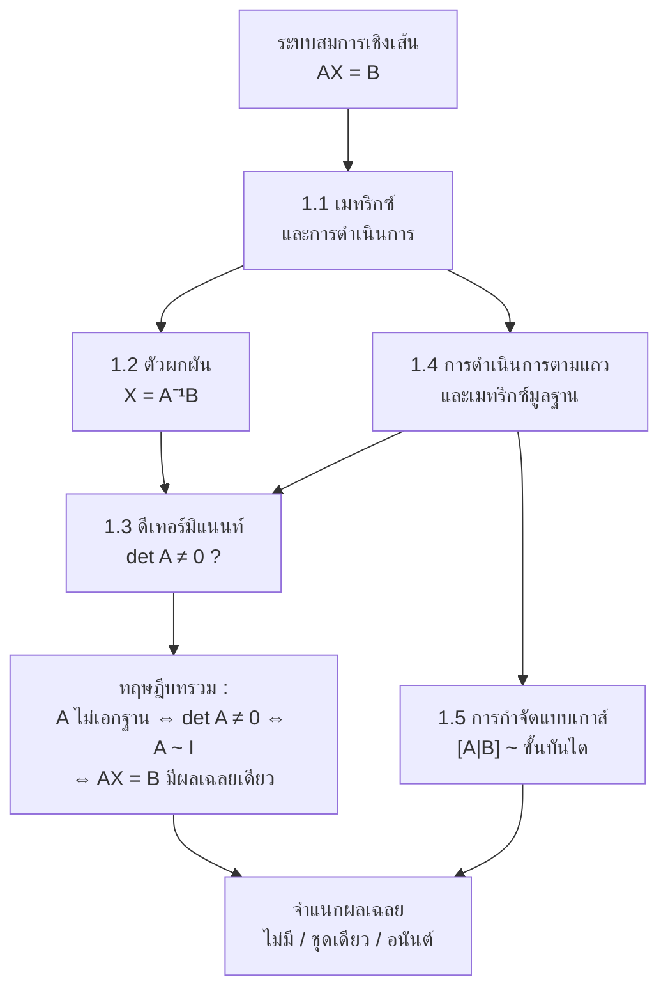
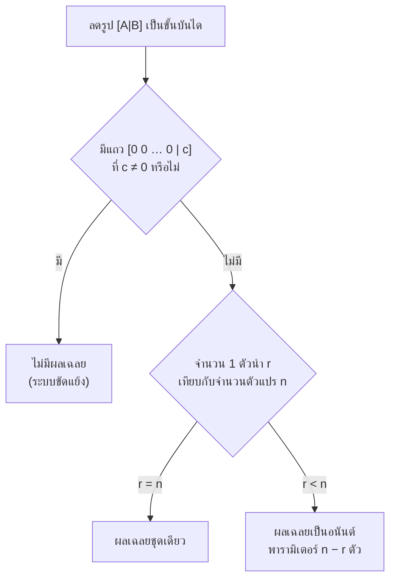

# บทที่ 1 เมทริกซ์และระบบสมการเชิงเส้น
*Matrices and Systems of Linear Equations — SC402101 พีชคณิตเชิงเส้น 1*

> [!info] ชุดสรุป 4 บท
> **บทที่ 1 เมทริกซ์และระบบสมการเชิงเส้น** (หน้านี้) → [[บทที่ 2 ปริภูมิเวกเตอร์]] → [[บทที่ 3 การแปลงเชิงเส้น]] → [[บทที่ 4 ค่าเจาะจงและเวกเตอร์เจาะจง]]

> [!abstract] อ่านบทนี้จบแล้วต้องทำอะไรได้
> 1. บวก ลบ คูณ สลับเปลี่ยนเมทริกซ์ และรู้ว่ากฎข้อไหน **ใช้ไม่ได้** (เช่น $AB \ne BA$)
> 2. หาตัวผกผัน ทั้งสูตร $2\times 2$ และวิธี $[A : I] \sim [I : A^{-1}]$
> 3. หาดีเทอร์มิแนนท์ขนาดใดก็ได้ด้วยการดำเนินการตามแถว และใช้สมบัติ 10 ข้อให้คล่อง
> 4. เขียนการดำเนินการตามแถวเป็นการคูณด้วยเมทริกซ์มูลฐาน
> 5. แก้ระบบสมการเชิงเส้นด้วยการกำจัดแบบเกาส์ และ **จำแนกได้ทันที** ว่าไม่มีผลเฉลย / มีชุดเดียว / มีเป็นอนันต์

> [!tip] วิธีใช้เอกสารนี้
> ทุกหัวข้อเรียงเป็น **นิยาม → ทฤษฎีบท (พร้อมเหตุผล) → วิธีมาตรฐาน → ทริค/มุมมองลัด → ตัวอย่างทุกข้อในเอกสารพร้อมวิธีทำ** เลขตัวอย่างตรงกับเอกสารประกอบการสอน ลองปิดวิธีทำแล้วทำเองก่อน แล้วค่อยเทียบ

---

## 0. ภาพรวมของบท

ทั้งบทมีคำถามเดียวเป็นแกนกลาง คือ **"ระบบสมการ $AX = B$ มีผลเฉลยไหม และมีกี่ชุด"** เครื่องมือทุกชิ้นในบทนี้ถูกสร้างมาเพื่อตอบคำถามนี้

| หัวข้อ | สิ่งที่ได้ | ใช้ต่อที่ไหน |
|---|---|---|
| 1.1 การดำเนินการบนเมทริกซ์ | ภาษาที่ใช้เขียนระบบสมการเป็น $AX=B$ | ทุกบท |
| 1.2 ตัวผกผัน | แก้ $AX=B$ ด้วย $X=A^{-1}B$ | เปลี่ยนฐานหลัก (บท 2), $P^{-1}AP$ (บท 4) |
| 1.3 ดีเทอร์มิแนนท์ | ตัวเลขตัวเดียวที่บอกว่า $A$ ผกผันได้หรือไม่ | อิสระเชิงเส้น (บท 2), สมการลักษณะเฉพาะ (บท 4) |
| 1.4 การดำเนินการตามแถว | เครื่องจักรคำนวณหลักของวิชา | ทุกบท |
| 1.5 ระบบสมการเชิงเส้น | อัลกอริทึมและการจำแนกผลเฉลย | span, ker, ปริภูมิเจาะจง |

---

## 1.1 เมทริกซ์และการดำเนินการบนเมทริกซ์

### 1.1.1 ความหมายของเมทริกซ์

> [!note] นิยาม — เมทริกซ์
> **เมทริกซ์** อันดับ $m \times n$ เหนือ $\mathbb{R}$ คือจำนวนจริงที่จัดเรียงเป็นสี่เหลี่ยม $m$ **แถว** $n$ **หลัก**
> $$A = \begin{bmatrix} a_{11} & a_{12} & \cdots & a_{1n} \\ a_{21} & a_{22} & \cdots & a_{2n} \\ \vdots & \vdots & \ddots & \vdots \\ a_{m1} & a_{m2} & \cdots & a_{mn} \end{bmatrix} = [a_{ij}]_{m\times n}$$
> $a_{ij}$ คือ**สมาชิก**ในแถวที่ $i$ หลักที่ $j$ — จำว่า **"แถวก่อน หลักทีหลัง"** เสมอ

คำศัพท์ที่ต้องรู้: **อันดับ/มิติ** ($m\times n$), **เมทริกซ์แถว** ($1\times n$), **เมทริกซ์หลัก** ($m\times 1$), **เส้นทแยงมุมหลัก** ($a_{11}, a_{22}, \dots$)

| ชนิด | เงื่อนไข | ตัวอย่าง |
|---|---|---|
| เมทริกซ์ศูนย์ $0_{m\times n}$ | $a_{ij}=0$ ทุกตัว | $\begin{bmatrix}0&0\\0&0\\0&0\end{bmatrix}$ |
| เมทริกซ์จัตุรัสอันดับ $n$ | $m=n$ | $\begin{bmatrix}1&0\\3&2\end{bmatrix}$ |
| สามเหลี่ยมบน | $a_{ij}=0$ เมื่อ $i>j$ (ใต้ทแยงเป็นศูนย์) | $\begin{bmatrix}2&1&1\\0&-4&3\\0&0&-3\end{bmatrix}$ |
| สามเหลี่ยมล่าง | $a_{ij}=0$ เมื่อ $i<j$ (เหนือทแยงเป็นศูนย์) | $\begin{bmatrix}2&0&0\\1&-4&0\\1&3&-3\end{bmatrix}$ |
| ทแยงมุม | $a_{ij}=0$ เมื่อ $i\ne j$ | $\begin{bmatrix}2&0&0\\0&-4&0\\0&0&-3\end{bmatrix}$ |
| เอกลักษณ์ $I_n$ | ทแยงมุมที่ทแยงเป็น 1 ทุกตัว | $\begin{bmatrix}1&0\\0&1\end{bmatrix}$ |
| สมมาตร | จัตุรัส และ $a_{ij}=a_{ji}$ (คือ $A^T=A$) | $\begin{bmatrix}1&2&3\\2&-1&4\\3&4&-13\end{bmatrix}$ |

> [!tip] จำชนิดเมทริกซ์แบบเป็นลำดับชั้น
> เอกลักษณ์ ⊂ ทแยงมุม = (สามเหลี่ยมบน ∩ สามเหลี่ยมล่าง) ⊂ จัตุรัส และเมทริกซ์ทแยงมุมทุกตัวเป็นเมทริกซ์สมมาตร

> [!example] ตัวอย่าง 1.1
> ให้ $A = \begin{bmatrix} 1 & 2 & 0 \\ -1 & 3 & 5 \end{bmatrix}$ จงบอกอันดับ สมาชิก เมทริกซ์แถว และเมทริกซ์หลัก

$A$ มีอันดับ $2\times 3$ สมาชิกคือ $a_{11}=1,\ a_{12}=2,\ a_{13}=0,\ a_{21}=-1,\ a_{22}=3,\ a_{23}=5$  
เมทริกซ์แถว: $\begin{bmatrix}1&2&0\end{bmatrix},\ \begin{bmatrix}-1&3&5\end{bmatrix}$ เมทริกซ์หลัก: $\begin{bmatrix}1\\-1\end{bmatrix},\ \begin{bmatrix}2\\3\end{bmatrix},\ \begin{bmatrix}0\\5\end{bmatrix}$

> [!example] ตัวอย่าง 1.2
> จงยกตัวอย่างเมทริกซ์ $A$ อันดับ $3\times 4$ พร้อมเมทริกซ์แถวและเมทริกซ์หลักทั้งหมด

คำตอบมีได้ไม่จำกัด เช่น $A = \begin{bmatrix} 1&2&3&4\\ -1&-2&0&0\\ 0&0&5&1 \end{bmatrix}$ (3 แถว 4 หลัก)  
เมทริกซ์แถวมี 3 ตัว: $\begin{bmatrix}1&2&3&4\end{bmatrix},\ \begin{bmatrix}-1&-2&0&0\end{bmatrix},\ \begin{bmatrix}0&0&5&1\end{bmatrix}$  
เมทริกซ์หลักมี 4 ตัว: $\begin{bmatrix}1\\-1\\0\end{bmatrix},\ \begin{bmatrix}2\\-2\\0\end{bmatrix},\ \begin{bmatrix}3\\0\\5\end{bmatrix},\ \begin{bmatrix}4\\0\\1\end{bmatrix}$

### 1.1.2 การดำเนินการบนเมทริกซ์

> [!note] นิยาม 1.3–1.4 — เท่ากัน บวก คูณสเกลาร์ สลับเปลี่ยน
> ให้ $A=[a_{ij}]_{m\times n}$, $B=[b_{ij}]_{m\times n}$ และ $c\in\mathbb{R}$
> - **เท่ากัน:** $A=B \iff$ อันดับเท่ากัน และ $a_{ij}=b_{ij}$ ทุกตำแหน่ง
> - **บวก:** $A+B=[a_{ij}+b_{ij}]$ (ต้องอันดับเท่ากันเท่านั้น)
> - **คูณสเกลาร์:** $cA=[c\,a_{ij}]$ และ $A-B = A+(-1)B$
> - **สลับเปลี่ยน (transpose):** $A^T$ คือเมทริกซ์อันดับ $n\times m$ ที่สมาชิกแถว $j$ หลัก $i$ คือ $a_{ij}$ — พูดง่าย ๆ คือ **เอาแถวมาเขียนเป็นหลัก**

> [!important] ทฤษฎีบท 1.8 และ 1.10 — สมบัติของการบวก การคูณสเกลาร์ และ transpose
> สำหรับ $A,B,C$ อันดับ $m\times n$ และ $c,d\in\mathbb{R}$
> 1. $A+B$ และ $cA$ มีอันดับ $m\times n$ (สมบัติปิด)
> 2. $A+B=B+A$ (สลับที่)
> 3. $(A+B)+C=A+(B+C)$ (เปลี่ยนกลุ่ม)
> 4. $A+0_{m\times n}=0_{m\times n}+A=A$ (มีเอกลักษณ์การบวก)
> 5. $A+(-A)=(-A)+A=0_{m\times n}$ ($-A$ คือตัวผกผันการบวกของ $A$)
> 6. $c(A+B)=cA+cB$
> 7. $(c+d)A=cA+dA$
> 8. $(cd)A=c(dA)$
> 9. $1A=A$ และ $0A=0_{m\times n}$
>
> และ $(A^T)^T=A$, $(cA)^T=cA^T$, $(A+B)^T=A^T+B^T$

**ทำไมจริง** — ทุกข้อพิสูจน์ด้วยการ "ดูสมาชิกตำแหน่ง $ij$" แล้วใช้สมบัติของจำนวนจริง เช่น ข้อ 2: สมาชิก $ij$ ของ $A+B$ คือ $a_{ij}+b_{ij}=b_{ij}+a_{ij}$ ซึ่งเป็นสมาชิก $ij$ ของ $B+A$ สังเกตว่าสมบัติ 1–9 คือรายการเดียวกับ (VS1)–(VS10) ใน [[บทที่ 2 ปริภูมิเวกเตอร์]] นั่นคือ **$M_{m\times n}$ เป็นปริภูมิเวกเตอร์**

> [!note] นิยาม 1.11 — ผลคูณของเมทริกซ์
> ให้ $A=[a_{ij}]_{m\times n}$ และ $B=[b_{ij}]_{n\times p}$ ผลคูณ $AB$ คือเมทริกซ์อันดับ $m\times p$ ที่
> $$c_{ij} = \sum_{k=1}^{n} a_{ik}b_{kj} = a_{i1}b_{1j}+a_{i2}b_{2j}+\cdots+a_{in}b_{nj}$$
> คือ **(แถวที่ $i$ ของ $A$) คูณ (หลักที่ $j$ ของ $B$)**

> [!tip] ทริค — ตรวจอันดับก่อนคูณทุกครั้ง
> เขียนอันดับเรียงกัน $(m\times \underline{n})(\underline{n}\times p)$ : **ตัวในต้องเท่ากัน** จึงคูณได้ และ **ตัวนอกคืออันดับของคำตอบ** $m\times p$  
> เช่น $(2\times 3)(3\times 2)\to 2\times 2$ แต่ $(2\times 3)(2\times 3)$ คูณไม่ได้

> [!important] ทฤษฎีบท 1.14 — สมบัติของการคูณ
> (เมื่ออันดับเข้ากันได้) $(AB)C=A(BC)$, $A(B+C)=AB+AC$, $(A+B)C=AC+BC$, และ $(AB)^T=B^TA^T$

> [!warning] กฎของจำนวนจริงที่ **ใช้ไม่ได้** กับเมทริกซ์ (หมายเหตุ 1.15)
> - โดยทั่วไป $AB\ne BA$ (บางครั้ง $BA$ ไม่นิยามด้วยซ้ำ)
> - $(AB)^T \ne A^TB^T$ — ต้อง **กลับลำดับ** เป็น $B^TA^T$
> - $AB=0$ **ไม่ได้** แปลว่า $A=0$ หรือ $B=0$ และ $AB=AC$ ตัด $A$ ทิ้งไม่ได้ (เว้นแต่ $A$ ไม่เอกฐาน)
> - $(A+B)^2 = A^2+AB+BA+B^2$ ไม่ใช่ $A^2+2AB+B^2$

> [!tip] มุมมองลัด — มองผลคูณ "ทีละหลัก" และ "ทีละแถว"
> - หลักที่ $j$ ของ $AB$ = $A$ คูณกับ (หลักที่ $j$ ของ $B$)
> - แถวที่ $i$ ของ $AB$ = (แถวที่ $i$ ของ $A$) คูณกับ $B$
> - $A\begin{bmatrix}x_1\\ \vdots\\ x_n\end{bmatrix} = x_1\mathbf{a}_1+x_2\mathbf{a}_2+\cdots+x_n\mathbf{a}_n$ เมื่อ $\mathbf{a}_j$ คือหลักที่ $j$ ของ $A$ — **ผลรวมเชิงเส้นของหลักของ $A$**
>
> มุมมองสุดท้ายคือสะพานเชื่อมไปบทที่ 2: "ระบบ $AX=B$ มีผลเฉลย" ก็คือ "$B$ เป็นผลรวมเชิงเส้นของหลักของ $A$"  
> ถ้าโจทย์ถามสมาชิกตัวเดียวหรือแถวเดียวของ $AB$ ก็คำนวณเฉพาะส่วนนั้น ไม่ต้องคูณทั้งเมทริกซ์

> [!example] ตัวอย่าง 1.6
> ให้ $A=\begin{bmatrix}1&0&3\\-2&5&4\end{bmatrix}$, $B=\begin{bmatrix}6&1&0\\-1&0&1\end{bmatrix}$, $C=\begin{bmatrix}2&2\\1&3\\7&-3\end{bmatrix}$ จงหา $A+B$, $3A$, $A-C^T$

$$A+B=\begin{bmatrix}7&1&3\\-3&5&5\end{bmatrix},\qquad 3A=\begin{bmatrix}3&0&9\\-6&15&12\end{bmatrix}$$
$C$ เป็น $3\times 2$ จึงลบจาก $A$ ตรง ๆ ไม่ได้ แต่ $C^T=\begin{bmatrix}2&1&7\\2&3&-3\end{bmatrix}$ เป็น $2\times 3$ จึง
$$A-C^T=\begin{bmatrix}1-2&0-1&3-7\\-2-2&5-3&4+3\end{bmatrix}=\begin{bmatrix}-1&-1&-4\\-4&2&7\end{bmatrix}$$

> [!example] ตัวอย่าง 1.7
> ถ้า $\begin{bmatrix}1&x\\1&1\end{bmatrix}-2\begin{bmatrix}-1&y\\z&-4\end{bmatrix}^T=\begin{bmatrix}x&3\\3&9\end{bmatrix}$ จงหา $x,y,z$

transpose ก่อน: $\begin{bmatrix}-1&y\\z&-4\end{bmatrix}^T=\begin{bmatrix}-1&z\\y&-4\end{bmatrix}$ ดังนั้นด้านซ้ายคือ
$$\begin{bmatrix}1+2&x-2z\\1-2y&1+8\end{bmatrix}=\begin{bmatrix}3&x-2z\\1-2y&9\end{bmatrix}=\begin{bmatrix}x&3\\3&9\end{bmatrix}$$
เทียบสมาชิกทีละตำแหน่ง: $x=3$; $x-2z=3\Rightarrow z=0$; $1-2y=3\Rightarrow y=-1$  
**ตอบ** $x=3,\ y=-1,\ z=0$

> [!example] ตัวอย่าง 1.9
> ใช้ $A,B$ จากตัวอย่าง 1.6 จงหา $A^T$, $B^T$, $A^T+B^T$, $(A+B)^T$, $(2A)^T$, $2A^T$, $(A^T)^T$

$$A^T=\begin{bmatrix}1&-2\\0&5\\3&4\end{bmatrix},\quad B^T=\begin{bmatrix}6&-1\\1&0\\0&1\end{bmatrix},\quad A^T+B^T=\begin{bmatrix}7&-3\\1&5\\3&5\end{bmatrix}=(A+B)^T$$
$$(2A)^T=\begin{bmatrix}2&-4\\0&10\\6&8\end{bmatrix}=2A^T,\qquad (A^T)^T=\begin{bmatrix}1&0&3\\-2&5&4\end{bmatrix}=A$$
ตัวอย่างนี้คือการ "ทดลองให้เห็น" ทฤษฎีบท 1.10 ทั้งสามข้อ

> [!example] ตัวอย่าง 1.12
> จงหา $\begin{bmatrix}-1&3&1\\5&0&4\end{bmatrix}\begin{bmatrix}1&2\\3&0\\1&-1\end{bmatrix}$

อันดับ $(2\times 3)(3\times 2)\to 2\times 2$
$$\begin{bmatrix}(-1)(1)+3(3)+1(1) & (-1)(2)+3(0)+1(-1)\\ 5(1)+0(3)+4(1) & 5(2)+0(0)+4(-1)\end{bmatrix}=\begin{bmatrix}9&-3\\9&6\end{bmatrix}$$

> [!example] ตัวอย่าง 1.13
> ให้ $A=\begin{bmatrix}3&-1\\2&1\end{bmatrix}$, $B=\begin{bmatrix}-1&0\\1&1\end{bmatrix}$, $C=\begin{bmatrix}0&2\\-1&1\end{bmatrix}$ จงหา $AB$, $BA$, $(AB)C$, $A(BC)$, $A(B+C)$, $AB+AC$, $(AB)^T$, $B^TA^T$

| ที่ต้องหา | ผลลัพธ์ | ข้อสังเกต |
|---|---|---|
| $AB$ | $\begin{bmatrix}-4&-1\\-1&1\end{bmatrix}$ | |
| $BA$ | $\begin{bmatrix}-3&1\\5&0\end{bmatrix}$ | $AB\ne BA$ |
| $(AB)C$ และ $A(BC)$ | $\begin{bmatrix}1&-9\\-1&-1\end{bmatrix}$ | เท่ากัน (เปลี่ยนกลุ่มได้) |
| $A(B+C)$ และ $AB+AC$ | $\begin{bmatrix}-3&4\\-2&6\end{bmatrix}$ | เท่ากัน (แจกแจงได้) |
| $(AB)^T$ และ $B^TA^T$ | $\begin{bmatrix}-4&-1\\-1&1\end{bmatrix}$ | เท่ากัน |

ถ้าลองคำนวณ $A^TB^T$ จะได้ $\begin{bmatrix}-3&5\\1&0\end{bmatrix}=(BA)^T$ ซึ่ง **ไม่เท่ากับ** $(AB)^T$ — ยืนยันว่าต้องกลับลำดับ  
(บังเอิญว่า $AB$ ในข้อนี้เป็นเมทริกซ์สมมาตร จึงได้ $(AB)^T=AB$)

---

## 1.2 ตัวผกผันของเมทริกซ์

$I_n$ เป็น **เอกลักษณ์การคูณ** : $AI_n=I_nA=A$

> [!note] นิยาม 1.16 — ตัวผกผัน
> ให้ $A$ เป็นเมทริกซ์จัตุรัสอันดับ $n$ ถ้ามี $B$ ที่ $AB=BA=I_n$ จะเรียก $B$ ว่า **ตัวผกผัน** ของ $A$ เขียนแทนด้วย $A^{-1}$
> - $A$ มีตัวผกผัน → เรียก $A$ ว่า **เมทริกซ์ไม่เอกฐาน** (non-singular)
> - $A$ ไม่มีตัวผกผัน → เรียก $A$ ว่า **เมทริกซ์เอกฐาน** (singular)

> [!important] หมายเหตุ 1.17 — ตัวผกผันมีได้ตัวเดียว
> **พิสูจน์** สมมติ $B$ และ $C$ เป็นตัวผกผันของ $A$ ทั้งคู่ จะได้ $B = BI = B(AC) = (BA)C = IC = C$ ∎

> [!important] สูตรตัวผกผันของเมทริกซ์ $2\times 2$
> ให้ $A=\begin{bmatrix}a&b\\c&d\end{bmatrix}$
> - ถ้า $ad-bc\ne 0$ แล้ว $A$ ไม่เอกฐาน และ $A^{-1}=\dfrac{1}{ad-bc}\begin{bmatrix}d&-b\\-c&a\end{bmatrix}$
> - ถ้า $ad-bc=0$ แล้ว $A$ เป็นเมทริกซ์เอกฐาน
>
> ท่องว่า **"สลับทแยงหลัก – กลับเครื่องหมายทแยงรอง – หารด้วย det"**

**สมบัติที่ใช้บ่อย** (พิสูจน์ได้จากนิยามโดยตรง): ถ้า $A,B$ ไม่เอกฐาน แล้ว
$$(A^{-1})^{-1}=A,\qquad (AB)^{-1}=B^{-1}A^{-1},\qquad (A^T)^{-1}=(A^{-1})^T,\qquad (kA)^{-1}=\tfrac1k A^{-1}\ (k\ne0)$$

> [!tip] ทริค "ถุงเท้า–รองเท้า"
> $(AB)^{-1}=B^{-1}A^{-1}$ และ $(AB)^T=B^TA^T$ กลับลำดับเหมือนกัน — ใส่ถุงเท้าก่อนรองเท้า เวลาถอดต้องถอดรองเท้าก่อนถุงเท้า  
> ตรวจได้เลย: $(AB)(B^{-1}A^{-1})=A(BB^{-1})A^{-1}=AA^{-1}=I$

> [!example] ตัวอย่าง 1.18
> ให้ $A=\begin{bmatrix}2&1&1\\1&3&2\\1&0&0\end{bmatrix}$, $B=\begin{bmatrix}0&0&1\\-2&1&3\\3&-1&-5\end{bmatrix}$ จงแสดงว่า $B$ เป็นตัวผกผันของ $A$

ตามนิยามต้องแสดงว่า $AB=I_3$ **และ** $BA=I_3$
$$AB=\begin{bmatrix}0-2+3&0+1-1&2+3-5\\0-6+6&0+3-2&1+9-10\\0&0&1\end{bmatrix}=\begin{bmatrix}1&0&0\\0&1&0\\0&0&1\end{bmatrix},\qquad BA=\begin{bmatrix}1&0&0\\0&1&0\\0&0&1\end{bmatrix}$$
ดังนั้น $B=A^{-1}$

> [!tip] ทริค — สำหรับเมทริกซ์จัตุรัส ตรวจข้างเดียวก็พอ
> ถ้า $A,B$ เป็นจัตุรัสอันดับเดียวกันและ $AB=I$ แล้ว $BA=I$ ตามมาเสมอ (เพราะ $\det A\det B=1$ ทำให้ $A$ ไม่เอกฐาน แล้ว $B=A^{-1}AB=A^{-1}$) ในการ **เช็กคำตอบ** จึงคูณข้างเดียวก็พอ แต่ถ้าโจทย์สั่ง "จงแสดง" ตามนิยาม ให้เขียนทั้งสองข้าง

> [!example] ตัวอย่าง 1.19
> จงหาตัวผกผัน (ถ้ามี) ของ $A=\begin{bmatrix}3&1\\-1&-2\end{bmatrix}$, $B=\begin{bmatrix}3&-6\\-1&2\end{bmatrix}$, $C=\begin{bmatrix}1&2\\1&3\end{bmatrix}$

- $A$: $ad-bc=(3)(-2)-(1)(-1)=-5\ne0$ จึง $A^{-1}=\dfrac{1}{-5}\begin{bmatrix}-2&-1\\1&3\end{bmatrix}=\begin{bmatrix}\tfrac25&\tfrac15\\-\tfrac15&-\tfrac35\end{bmatrix}$
- $B$: $ad-bc=(3)(2)-(-6)(-1)=0$ จึง $B$ เป็นเมทริกซ์เอกฐาน **ไม่มีตัวผกผัน** (สังเกตว่าแถว 1 = $-3\times$ แถว 2)
- $C$: $ad-bc=3-2=1$ จึง $C^{-1}=\begin{bmatrix}3&-2\\-1&1\end{bmatrix}$

### การใช้ตัวผกผันแก้ระบบสมการ

ระบบ $n$ สมการ $n$ ตัวแปร เขียนเป็น $AX=B$ ถ้า $A$ ไม่เอกฐาน คูณ $A^{-1}$ **ทางซ้าย** ทั้งสองข้าง:
$$A^{-1}(AX)=A^{-1}B \implies X=A^{-1}B$$
ผลเฉลยจึงมี **ชุดเดียว** เท่านั้น

> [!example] ตัวอย่าง 1.20
> จงแก้ระบบ $3x+4y=-1,\ 2x-5y=7$

$A=\begin{bmatrix}3&4\\2&-5\end{bmatrix}$, $\det=-15-8=-23\ne0$
$$X=A^{-1}B=\frac{1}{-23}\begin{bmatrix}-5&-4\\-2&3\end{bmatrix}\begin{bmatrix}-1\\7\end{bmatrix}=\frac{1}{-23}\begin{bmatrix}5-28\\2+21\end{bmatrix}=\begin{bmatrix}1\\-1\end{bmatrix}$$
**ตอบ** $(x,y)=(1,-1)$ — เช็ก: $3(1)+4(-1)=-1$ ✓, $2(1)-5(-1)=7$ ✓

> [!example] ตัวอย่าง 1.21
> จงแก้ระบบ $x+7y=16,\ -3x+y=-4$

$\det=1+21=22$
$$X=\frac{1}{22}\begin{bmatrix}1&-7\\3&1\end{bmatrix}\begin{bmatrix}16\\-4\end{bmatrix}=\frac{1}{22}\begin{bmatrix}16+28\\48-4\end{bmatrix}=\begin{bmatrix}2\\2\end{bmatrix}$$
**ตอบ** $(x,y)=(2,2)$

> [!tip] อีกมุมหนึ่ง — กฎของคราเมอร์สำหรับ $2\times2$ (เร็วกว่า ไม่ต้องเขียน $A^{-1}$)
> สำหรับ $\begin{cases}ax+by=e\\cx+dy=f\end{cases}$ ที่ $ad-bc\ne0$
> $$x=\frac{ed-bf}{ad-bc},\qquad y=\frac{af-ec}{ad-bc}$$
> (แทนหลักของตัวแปรที่ต้องการด้วยหลักค่าคงตัว แล้วหา det) ตัวอย่าง 1.20: $x=\dfrac{(-1)(-5)-(4)(7)}{-23}=\dfrac{-23}{-23}=1$, $y=\dfrac{(3)(7)-(-1)(2)}{-23}=-1$  
> สูตรนี้ก็คือ $X=A^{-1}B$ ที่กระจายออกมาแล้วนั่นเอง

---

## 1.3 ดีเทอร์มิแนนท์

### 1.3.1 ความหมาย

**ดีเทอร์มิแนนท์** คือฟังก์ชันที่ส่งเมทริกซ์จัตุรัสแต่ละตัวไปยังจำนวนจริงหนึ่งจำนวน เขียน $\det A$ หรือ $|A|$ บทบาทหลักคือเป็น "เครื่องทดสอบ" ว่าเมทริกซ์มีตัวผกผันหรือไม่

- $\det A\ne0\iff A$ เป็นเมทริกซ์ไม่เอกฐาน
- $\det A=0\iff A$ เป็นเมทริกซ์เอกฐาน

นิยามได้หลายแบบ (สูตรไลบ์นิซ, การกระจายแบบลาปลาซ, การกำจัดแบบเกาส์) สำหรับการคำนวณใช้สองสูตรนี้เป็นฐาน
$$\det\begin{bmatrix}a&b\\c&d\end{bmatrix}=ad-bc$$
$$\det\begin{bmatrix}a&b&c\\d&e&f\\g&h&i\end{bmatrix}=aei+bfg+cdh-ceg-bdi-afh$$

> [!tip] จำสูตร $3\times3$ ด้วยกฎของซารัส (Sarrus)
> เขียนสองหลักแรกซ้ำต่อท้าย แล้ว **บวกผลคูณแนวทแยงลง 3 เส้น ลบผลคูณแนวทแยงขึ้น 3 เส้น**
> $$\begin{array}{ccc|cc} a&b&c&a&b\\ d&e&f&d&e\\ g&h&i&g&h\end{array}\qquad \det = (aei+bfg+cdh)-(ceg+afh+bdi)$$
> ⚠️ ใช้ได้กับ $2\times2$ และ $3\times3$ **เท่านั้น** ขนาด $4\times4$ ขึ้นไปห้ามใช้

> [!note] เสริม — การกระจายโคแฟกเตอร์ (Laplace expansion)
> ให้ $M_{ij}$ คือดีเทอร์มิแนนท์ของเมทริกซ์ที่ได้จากการตัดแถว $i$ หลัก $j$ ทิ้ง และ $C_{ij}=(-1)^{i+j}M_{ij}$ จะได้
> $$\det A=\sum_{j=1}^n a_{ij}C_{ij}=\sum_{i=1}^n a_{ij}C_{ij}$$
> ผลรวมแรกคือการกระจายตามแถว $i$ (ตรึง $i$ วิ่ง $j$) ผลรวมหลังคือการกระจายตามหลัก $j$ (ตรึง $j$ วิ่ง $i$) — เลือกแถวหรือหลักใดก็ได้ ได้ค่าเท่ากัน  
> เครื่องหมาย $(-1)^{i+j}$ เรียงเป็นตารางหมากรุก $\begin{bmatrix}+&-&+\\-&+&-\\+&-&+\end{bmatrix}$ — **เลือกแถวหรือหลักที่มีศูนย์มากที่สุด**

### 1.3.2 สมบัติของดีเทอร์มิแนนท์

> [!important] สมบัติ 10 ข้อ ($A,B$ จัตุรัสอันดับ $n$)
> 1. มีแถว (หรือหลัก) ใดเป็นศูนย์ทั้งแถว $\Rightarrow\det A=0$
> 2. $\det A=\det(A^T)$
> 3. สลับสองแถว (หรือสองหลัก) $\Rightarrow$ ดีเทอร์มิแนนท์ **เปลี่ยนเครื่องหมาย**
> 4. มีสองแถว (หรือสองหลัก) เหมือนกัน $\Rightarrow\det A=0$
> 5. คูณแถวหนึ่ง (หรือหลักหนึ่ง) ด้วย $k$ $\Rightarrow$ ดีเทอร์มิแนนท์ **ถูกคูณด้วย $k$**
> 6. นำ $k$ เท่าของแถวหนึ่งไปบวกอีกแถวหนึ่ง $\Rightarrow$ ดีเทอร์มิแนนท์ **ไม่เปลี่ยน**
> 7. เมทริกซ์สามเหลี่ยมบน/ล่าง $\Rightarrow\det=$ ผลคูณของสมาชิกบนเส้นทแยงมุมหลัก
> 8. $\det(AB)=(\det A)(\det B)$
> 9. $\det(kA)=k^n\det A$
> 10. ถ้า $A^{-1}$ มี แล้ว $\det(A^{-1})=\dfrac{1}{\det A}$

**ทำไมจึงจริง (ภาพรวมของเหตุผล)**
- ข้อ 2 ทำให้ทุกสมบัติ "ของแถว" ใช้กับ "หลัก" ได้ด้วย
- ข้อ 4 ตามจากข้อ 3: สลับสองแถวที่เหมือนกัน ได้เมทริกซ์เดิม แต่ det ต้องเปลี่ยนเครื่องหมาย จึง $\det A=-\det A\Rightarrow\det A=0$
- ข้อ 1 ตามจากข้อ 5 โดยใช้ $k=0$
- ข้อ 9 ตามจากข้อ 5: $kA$ คือการคูณ $k$ เข้าไป **ทั้ง $n$ แถว** จึงได้ $k$ ออกมา $n$ ตัว
- ข้อ 10 ตามจากข้อ 8: $\det(A)\det(A^{-1})=\det(AA^{-1})=\det I=1$

![[SC402101-ch1-det-area.svg]]

> [!tip] มุมมองลัด — ดีเทอร์มิแนนท์คือ "ตัวคูณพื้นที่/ปริมาตร"
> สำหรับ $2\times2$ ค่า $|\det A|$ คือพื้นที่ของสี่เหลี่ยมด้านขนานที่สร้างจากแถวทั้งสอง มุมมองนี้ทำให้สมบัติ 3 ข้อของการดำเนินการตามแถว "เห็นด้วยตา":
> - **เพิ่ม $k$ เท่าของแถวหนึ่งเข้าอีกแถว** = เลื่อนด้านบนขนานไปกับฐาน ฐานเดิม สูงเดิม → พื้นที่ไม่เปลี่ยน (ข้อ 6)
> - **คูณแถวด้วย $k$** = ยืดด้านหนึ่ง $k$ เท่า → พื้นที่คูณ $k$ (ข้อ 5)
> - **สองแถวขนานกัน** = สี่เหลี่ยมแบนเป็นเส้น → พื้นที่ 0 (ข้อ 4 และกรณีแถวเป็นสัดส่วนกัน)

> [!warning] ข้อผิดพลาดยอดนิยม
> - $\det(A+B)\ne\det A+\det B$ (ไม่มีกฎการบวก)
> - $\det(kA)=k^n\det A$ **ไม่ใช่** $k\det A$ — เช่น $A$ เป็น $3\times3$ จะได้ $\det(2A)=8\det A$
> - การดำเนินการ $R_i\to kR_i+R_j$ **เปลี่ยน** det (คูณ $k$) — ข้อ 6 ปลอดภัยเฉพาะรูป $R_j+kR_i\to R_j$ ที่แถวเป้าหมายมีสัมประสิทธิ์ 1

### วิธีมาตรฐาน — ลดรูปเป็นสามเหลี่ยมบน

> [!important] ขั้นตอนหา det ด้วยการดำเนินการตามแถว
> 1. ใช้ $R_j+kR_i\to R_j$ ทำให้สมาชิกใต้เส้นทแยงเป็นศูนย์ทีละหลัก (det ไม่เปลี่ยน)
> 2. ถ้าต้องสลับแถว ให้จด **เครื่องหมายลบ** ไว้ 1 ครั้งต่อการสลับ 1 ครั้ง
> 3. ถ้าดึงตัวร่วม $k$ ออกจากแถว ให้เขียน $k$ ไว้หน้าดีเทอร์มิแนนท์
> 4. เมื่อเป็นสามเหลี่ยมบน คูณเส้นทแยงมุม แล้วคูณด้วยตัวคูณที่จดไว้

| การดำเนินการ | ผลต่อ det |
|---|---|
| $R_i\leftrightarrow R_j$ | คูณ $-1$ |
| $kR_i\to R_i$ | คูณ $k$ (หรือ "ดึง $k$ ออกมาไว้ข้างหน้า") |
| $R_j+kR_i\to R_j$ | ไม่เปลี่ยน |

> [!example] ตัวอย่าง 1.22
> จงหาดีเทอร์มิแนนท์ของ $A=\begin{bmatrix}1&2\\-2&-4\end{bmatrix}$, $B=\begin{bmatrix}0&1\\-3&7\end{bmatrix}$, $C=\begin{bmatrix}0&0&0\\1&3&5\\-1&2&1\end{bmatrix}$, $D=\begin{bmatrix}-1&1&3\\0&2&4\\0&-2&1\end{bmatrix}$, $E=\begin{bmatrix}10&0&0\\0&15&0\\0&0&-1\end{bmatrix}$

- $\det A=(1)(-4)-(2)(-2)=0$ (แถว 2 = $-2\times$ แถว 1)
- $\det B=(0)(7)-(1)(-3)=3$
- $\det C=0$ เพราะมีแถวศูนย์ (ข้อ 1)
- $\det D$: กระจายตามหลักที่ 1 (มีศูนย์สองตัว) $=(-1)\begin{vmatrix}2&4\\-2&1\end{vmatrix}=(-1)(2+8)=-10$
- $\det E=(10)(15)(-1)=-150$ เพราะเป็นเมทริกซ์ทแยงมุม (ข้อ 7)

> [!example] ตัวอย่าง 1.23 (ตัวอย่างประกอบสมบัติ จาก Lecture 1)
> ใช้สมบัติบอกค่าดีเทอร์มิแนนท์โดยไม่ต้องกระจาย

| ข้อ | เมทริกซ์ | ข้อสรุป | สมบัติ |
|---|---|---|---|
| (1) | $\begin{bmatrix}1&2&3\\4&5&6\\0&0&0\end{bmatrix}$ | $\det=0$ | ข้อ 1 (แถวศูนย์) |
| (2) | $\begin{bmatrix}1&2&3\\5&-5&1\\5&-5&1\end{bmatrix}$ | $\det=0$ | ข้อ 4 (สองแถวเหมือนกัน) |
| (3) | $A=\begin{bmatrix}-1&5&1\\2&3&2\\1&2&1\end{bmatrix}$, $B=\begin{bmatrix}1&2&1\\2&3&2\\-1&5&1\end{bmatrix}$ | $\det B=-\det A$ | ข้อ 3 (สลับ $R_1\leftrightarrow R_3$) |
| (4) | $A=\begin{bmatrix}-1&5&0\\2&3&7\\1&2&1\end{bmatrix}$, $B=A^T$ | $\det B=\det A$ | ข้อ 2 |
| (5) | $B$ = คูณแถว 1 ของ $A$ ด้วย 2, $C$ = คูณหลัก 3 ของ $A$ ด้วย 3 | $\det B=2\det A$, $\det C=3\det A$ | ข้อ 5 |
| (6) | $\begin{bmatrix}1&2&3\\0&5&6\\0&0&9\end{bmatrix}$, $\begin{bmatrix}1&0&0\\4&5&0\\7&8&9\end{bmatrix}$, $\begin{bmatrix}1&0&0\\0&5&0\\0&0&9\end{bmatrix}$ | $\det=1\cdot5\cdot9=45$ ทั้งสาม | ข้อ 7 |
| (7) | $A=\begin{bmatrix}1&2&3\\2&3&2\\1&2&1\end{bmatrix}$, $B=\begin{bmatrix}2&4&6\\-2&-3&-2\\3&6&3\end{bmatrix}$ | $\det B=(2)(-1)(3)\det A=-6\det A$ | ข้อ 5 สามครั้ง |

ในข้อ (7) $\det A=2$ จึง $\det B=-12$

> [!example] ตัวอย่าง 1.24
> เติมคำตอบพร้อมเหตุผล

1. $\det\begin{bmatrix}1&2&3\\0&0&0\\4&5&6\end{bmatrix}=0$ เนื่องจากแถวที่ 2 เป็นศูนย์ทั้งแถว
2. $A=\begin{bmatrix}1&2&3\\5&-5&1\\5&-5&1\end{bmatrix}$, $B=\begin{bmatrix}1&2&2\\4&0&0\\7&4&4\end{bmatrix}$ : $\det A=0$ และ $\det B=0$ เนื่องจาก $A$ มีสองแถวเหมือนกัน (แถว 2, 3) และ $B$ มีสองหลักเหมือนกัน (หลัก 2, 3)
3. $A=\begin{bmatrix}-1&5&1\\2&3&2\\1&2&1\end{bmatrix}$ : $\det A=-1(3-4)-5(2-2)+1(4-3)=2$
   $B$ ได้จากการสลับแถว 1 กับ 3 ของ $A$ และ $C$ ได้จากการสลับหลัก 2 กับ 3 ของ $A$ จึง $\det B=-2$, $\det C=-2$
4. $A=\begin{bmatrix}-1&5&0\\2&3&7\\1&2&1\end{bmatrix}$ : $\det A=-1(3-14)-5(2-7)+0=11+25=36$ และ $B=A^T$ จึง $\det B=36$
5. $A$ ตัวเดียวกับข้อ 3 ($\det A=2$) ; $B$ ได้จากการคูณแถว 1 ด้วย 2 จึง $\det B=2\cdot2=4$ ; $C$ ได้จากการคูณหลัก 3 ด้วย 3 จึง $\det C=3\cdot2=6$

> [!example] ตัวอย่าง 1.25
> จงหา $\det A$ เมื่อ $A=\begin{bmatrix}1&2&3&4\\2&5&2&1\\3&6&0&2\\1&1&1&1\end{bmatrix}$

**วิธีมาตรฐาน** (ลดเป็นสามเหลี่ยมบน — ใช้แต่การดำเนินการแบบที่ 3 จึงไม่ต้องจดตัวคูณ)
$$
\begin{aligned}
\det A &= \begin{vmatrix} 1 & 2 & 3 & 4 \\ 2 & 5 & 2 & 1 \\ 3 & 6 & 0 & 2 \\ 1 & 1 & 1 & 1 \end{vmatrix} \\[4pt]
&= \begin{vmatrix} 1 & 2 & 3 & 4 \\ 0 & 1 & -4 & -7 \\ 0 & 0 & -9 & -10 \\ 0 & -1 & -2 & -3 \end{vmatrix} \quad \begin{array}{l} \scriptstyle R_2 - 2R_1 \to R_2 \\ \scriptstyle R_3 - 3R_1 \to R_3 \\ \scriptstyle R_4 - R_1 \to R_4 \end{array} \\[4pt]
&= \begin{vmatrix} 1 & 2 & 3 & 4 \\ 0 & 1 & -4 & -7 \\ 0 & 0 & -9 & -10 \\ 0 & 0 & -6 & -10 \end{vmatrix} \quad \begin{array}{l} \scriptstyle R_4 + R_2 \to R_4 \end{array} \\[4pt]
&= \begin{vmatrix} 1 & 2 & 3 & 4 \\ 0 & 1 & -4 & -7 \\ 0 & 0 & -9 & -10 \\ 0 & 0 & 0 & -\tfrac{10}{3} \end{vmatrix} \quad \begin{array}{l} \scriptstyle R_4 - \tfrac{2}{3}R_3 \to R_4 \end{array}
\end{aligned}
$$
$$\det A=(1)(1)(-9)\left(-\tfrac{10}{3}\right)=30$$

> [!tip] ทางลัดของข้อนี้ — ผสม "กำจัด 1 หลัก" กับ "กระจายโคแฟกเตอร์" เพื่อเลี่ยงเศษส่วน
> หลังขั้นแรก หลักที่ 1 เหลือเลขไม่เป็นศูนย์ตัวเดียว จึงกระจายตามหลัก 1 แล้วเหลือ $3\times3$
> $$\det A=1\cdot\begin{vmatrix}1&-4&-7\\0&-9&-10\\-1&-2&-3\end{vmatrix}\overset{R_3+R_1}{=}\begin{vmatrix}1&-4&-7\\0&-9&-10\\0&-6&-10\end{vmatrix}=1\cdot\big[(-9)(-10)-(-10)(-6)\big]=90-60=30$$
> หลักคิด: **ทำให้หลักหนึ่งเหลือเลขตัวเดียว → ลดขนาดลง 1 → ทำซ้ำ** เมื่อเหลือ $2\times2$ ก็ใช้สูตรตรง ๆ

> [!example] ตัวอย่าง 1.26
> จงหา $\det A$ เมื่อ $A=\begin{bmatrix}2&3&1&5\\4&7&2&10\\2&5&3&6\\6&9&4&16\end{bmatrix}$

$$
\begin{aligned}
\det A &= \begin{vmatrix} 2 & 3 & 1 & 5 \\ 4 & 7 & 2 & 10 \\ 2 & 5 & 3 & 6 \\ 6 & 9 & 4 & 16 \end{vmatrix} \\[4pt]
&= \begin{vmatrix} 2 & 3 & 1 & 5 \\ 0 & 1 & 0 & 0 \\ 0 & 2 & 2 & 1 \\ 0 & 0 & 1 & 1 \end{vmatrix} \quad \begin{array}{l} \scriptstyle R_2 - 2R_1 \to R_2 \\ \scriptstyle R_3 - R_1 \to R_3 \\ \scriptstyle R_4 - 3R_1 \to R_4 \end{array} \\[4pt]
&= \begin{vmatrix} 2 & 3 & 1 & 5 \\ 0 & 1 & 0 & 0 \\ 0 & 0 & 2 & 1 \\ 0 & 0 & 1 & 1 \end{vmatrix} \quad \begin{array}{l} \scriptstyle R_3 - 2R_2 \to R_3 \end{array} \\[4pt]
&= \begin{vmatrix} 2 & 3 & 1 & 5 \\ 0 & 1 & 0 & 0 \\ 0 & 0 & 2 & 1 \\ 0 & 0 & 0 & \tfrac{1}{2} \end{vmatrix} \quad \begin{array}{l} \scriptstyle R_4 - \tfrac{1}{2}R_3 \to R_4 \end{array}
\end{aligned}
$$
$$\det A=(2)(1)(2)\left(\tfrac12\right)=2$$
**ทางลัด:** หลังขั้นแรก กระจายตามหลัก 1 แล้วกระจายตามแถว 1 ต่อ (มีศูนย์สองตัว)
$$\det A=2\begin{vmatrix}1&0&0\\2&2&1\\0&1&1\end{vmatrix}=2\cdot1\cdot\begin{vmatrix}2&1\\1&1\end{vmatrix}=2(2-1)=2$$

---

## 1.4 การดำเนินการตามแถวมูลฐาน

> [!note] นิยาม 1.27 — การดำเนินการตามแถวมูลฐาน 3 แบบ
> 1. **สลับแถว** $R_i\leftrightarrow R_j$
> 2. **คูณแถวด้วยค่าคงตัว $k\ne0$** : $kR_i\to R_i$
> 3. **นำ $k$ เท่าของแถว $i$ ไปบวกแถว $j$** ($i\ne j$) : $R_j+kR_i\to R_j$
>
> สัญลักษณ์ $R_j+kR_i\to R_j$ อ่านว่า "แถว $j$ **ตัวใหม่** คือ แถว $j$ เดิม บวก $k$ เท่าของแถว $i$" — แถวที่อยู่หลังลูกศรคือแถวที่ถูกแก้ แถวอื่นคงเดิม

> [!note] นิยาม 1.30 — สมมูลตามแถว
> $A\sim B$ (อ่านว่า $A$ **สมมูลตามแถว** กับ $B$) ถ้า $B$ ได้จาก $A$ โดยการดำเนินการตามแถวต่อเนื่องกันจำนวนจำกัดครั้ง

การดำเนินการทุกแบบ **ย้อนกลับได้** ด้วยการดำเนินการแบบเดียวกัน: $R_i\leftrightarrow R_j$ ย้อนด้วยตัวเอง, $kR_i$ ย้อนด้วย $\tfrac1kR_i$, $R_j+kR_i$ ย้อนด้วย $R_j-kR_i$ ดังนั้น $A\sim B\Rightarrow B\sim A$

> [!example] ตัวอย่าง 1.28
> ให้ $A=\begin{bmatrix}2&1&-1\\4&3&0\\-2&-2&1\end{bmatrix}$ ถ้า $C$ และ $D$ ได้จาก $A$ โดย $R_3+R_1\to R_3$ และ $2R_1\to R_1$ ตามลำดับ จงหา $C$, $D$

$$C=\begin{bmatrix}2&1&-1\\4&3&0\\0&-1&0\end{bmatrix},\qquad D=\begin{bmatrix}4&2&-2\\4&3&0\\-2&-2&1\end{bmatrix}$$

> [!example] ตัวอย่าง 1.29
> ให้ $A=\begin{bmatrix}1&0&2\\0&1&3\\4&-1&2\end{bmatrix}$  
> $C$ : ทำ $R_3\leftrightarrow R_1$ แล้ว $R_2\leftrightarrow R_3$  $D$ : ทำ $2R_2\to R_2$ และ $(-1)R_1\to R_1$  $X$ : ทำ $R_1+2R_2\to R_1$ แล้ว $R_2-R_3\to R_2$

ทำทีละขั้นกับเมทริกซ์ **ที่ได้ล่าสุด**
$$A\xrightarrow{R_3\leftrightarrow R_1}\begin{bmatrix}4&-1&2\\0&1&3\\1&0&2\end{bmatrix}\xrightarrow{R_2\leftrightarrow R_3}\begin{bmatrix}4&-1&2\\1&0&2\\0&1&3\end{bmatrix}=C$$
$$D=\begin{bmatrix}-1&0&-2\\0&2&6\\4&-1&2\end{bmatrix}$$
$$A\xrightarrow{R_1+2R_2\to R_1}\begin{bmatrix}1&2&8\\0&1&3\\4&-1&2\end{bmatrix}\xrightarrow{R_2-R_3\to R_2}\begin{bmatrix}1&2&8\\-4&2&1\\4&-1&2\end{bmatrix}=X$$

> [!example] ตัวอย่าง 1.31
> จงยกตัวอย่าง $A,B$ อันดับ $3\times3$ ที่ $A\sim B$

เลือก $A$ ใดก็ได้แล้วทำการดำเนินการตามแถวสัก 1–3 ครั้ง เช่น
$$A=\begin{bmatrix}1&2&3\\2&5&7\\0&1&4\end{bmatrix}\xrightarrow{R_2-2R_1\to R_2}\begin{bmatrix}1&2&3\\0&1&1\\0&1&4\end{bmatrix}\xrightarrow{R_3-R_2\to R_3}\begin{bmatrix}1&2&3\\0&1&1\\0&0&3\end{bmatrix}=B$$

### เมทริกซ์มูลฐาน

> [!note] นิยาม 1.32 — เมทริกซ์มูลฐาน
> **เมทริกซ์มูลฐาน** คือเมทริกซ์ที่ได้จากการดำเนินการตามแถวบนเมทริกซ์เอกลักษณ์ **เพียงครั้งเดียว**

> [!example] ตัวอย่าง 1.33
> จงสร้างเมทริกซ์มูลฐานจาก $I_4$ อย่างน้อย 3 เมทริกซ์

$$E_1=\begin{bmatrix}0&1&0&0\\1&0&0&0\\0&0&1&0\\0&0&0&1\end{bmatrix}\ (R_1\leftrightarrow R_2),\quad E_2=\begin{bmatrix}1&0&0&0\\0&1&0&0\\0&0&5&0\\0&0&0&1\end{bmatrix}\ (5R_3\to R_3),\quad E_3=\begin{bmatrix}1&0&0&0\\0&1&0&0\\0&0&1&0\\0&-2&0&1\end{bmatrix}\ (R_4-2R_2\to R_4)$$

> [!important] ทฤษฎีบท 1.34, 1.36 — การดำเนินการตามแถว = การคูณทางซ้ายด้วยเมทริกซ์มูลฐาน
> - $B$ ได้จาก $A_{m\times n}$ ด้วยการดำเนินการตามแถว 1 ครั้ง $\iff B=EA$ โดย $E$ คือเมทริกซ์มูลฐานที่ได้จากการทำการดำเนินการ **เดียวกัน** บน $I_m$
> - $A\sim B\iff B=E_kE_{k-1}\cdots E_2E_1A$ (การดำเนินการครั้งแรกอยู่ **ติดกับ $A$**)

**ทำไมจริง** — แถวที่ $i$ ของ $EA$ คือ (แถวที่ $i$ ของ $E$)$\cdot A$ ซึ่งเป็นผลรวมเชิงเส้นของแถวของ $A$ ด้วยสัมประสิทธิ์จากแถว $i$ ของ $E$ เมื่อ $E$ มาจาก $I$ ที่ถูกแก้แถวแบบใด แถวของ $A$ ก็ถูกผสมแบบนั้น

> [!example] ตัวอย่าง 1.35
> ให้ $A=\begin{bmatrix}2&3&5\\1&-2&2\\-1&1&0\\2&0&0\end{bmatrix}$ และ $E_1,E_2,E_3$ เป็นเมทริกซ์มูลฐานจากการทำ $R_3\leftrightarrow R_1$, $R_2+3R_1\to R_2$, $-2R_4\to R_4$ บน $I_4$ ตามลำดับ  
> (1) จงหา $E_1A,E_2A,E_3A$  (2) จงหาเมทริกซ์ที่ได้จากการทำการดำเนินการแต่ละแบบกับ $A$ โดยตรง

$$E_1=\begin{bmatrix}0&0&1&0\\0&1&0&0\\1&0&0&0\\0&0&0&1\end{bmatrix},\quad E_2=\begin{bmatrix}1&0&0&0\\3&1&0&0\\0&0&1&0\\0&0&0&1\end{bmatrix},\quad E_3=\begin{bmatrix}1&0&0&0\\0&1&0&0\\0&0&1&0\\0&0&0&-2\end{bmatrix}$$
$$E_1A=\begin{bmatrix}-1&1&0\\1&-2&2\\2&3&5\\2&0&0\end{bmatrix},\quad E_2A=\begin{bmatrix}2&3&5\\7&7&17\\-1&1&0\\2&0&0\end{bmatrix},\quad E_3A=\begin{bmatrix}2&3&5\\1&-2&2\\-1&1&0\\-4&0&0\end{bmatrix}$$
ข้อ (2) ได้คำตอบชุดเดียวกันทุกตัว — นี่คือเนื้อความของทฤษฎีบท 1.34 (เช่นแถว 2 ใหม่ของ $E_2A$ คือ $(1,-2,2)+3(2,3,5)=(7,7,17)$)

> [!warning] หมายเหตุเกี่ยวกับโจทย์ข้อนี้
> ในเอกสารพิมพ์ว่า "บน $I_3$" และ "$R_2+3R_2\to R_2$" แต่ $A$ มี 4 แถวจึงต้องใช้ $I_4$ และการดำเนินการแบบที่ 3 ต้องใช้สองแถวต่างกัน ในคาบ (Lecture 2) อาจารย์แก้เป็น $I_4$, $R_2+3R_1\to R_2$ และ $-2R_4\to R_4$ สรุปนี้ทำตามฉบับที่แก้แล้ว

> [!important] ทฤษฎีบท 1.37, 1.41 และหมายเหตุ 1.38
> ให้ $A$ เป็นเมทริกซ์จัตุรัสอันดับ $n$
> - $A$ **ไม่เอกฐาน** $\iff A\sim I_n$
> - $A$ **เอกฐาน** $\iff A\sim B$ โดยที่ $B$ มีแถวศูนย์อย่างน้อยหนึ่งแถว
> - เมทริกซ์มูลฐานทุกตัวไม่เอกฐาน (ตัวผกผันคือเมทริกซ์มูลฐานของการดำเนินการย้อนกลับ)
> - ถ้า $I_n=E_k\cdots E_1A$ แล้ว $A^{-1}=E_k\cdots E_1=E_k\cdots E_1I_n$ — **การดำเนินการชุดที่พา $A$ ไปเป็น $I$ จะพา $I$ ไปเป็น $A^{-1}$**

### วิธีมาตรฐาน — หาตัวผกผันด้วย $[A:I_n]\sim[I_n:A^{-1}]$

> [!important] ขั้นตอน (Gauss–Jordan)
> 1. เขียนเมทริกซ์แต่งเติม $[A:I_n]$
> 2. ทำทีละหลักจากซ้ายไปขวา: ทำให้ตำแหน่งทแยงเป็น 1 (สลับแถว/คูณแถว) แล้วใช้มันล้างสมาชิก **ทั้งด้านบนและด้านล่าง** ในหลักนั้นให้เป็น 0
> 3. ถ้าฝั่งซ้ายกลายเป็น $I_n$ ฝั่งขวาคือ $A^{-1}$
> 4. ถ้าระหว่างทางฝั่งซ้ายเกิด **แถวศูนย์** → หยุดได้เลย $A$ เป็นเมทริกซ์เอกฐาน ไม่มีตัวผกผัน

> [!example] ตัวอย่าง 1.39
> จงหา $A^{-1}$ (ถ้ามี) เมื่อ $A=\begin{bmatrix}2&1&3\\1&0&1\\3&1&1\end{bmatrix}$

$$
\begin{aligned}
{}[A:I_3] &= \left[\begin{array}{ccc|ccc} 2 & 1 & 3 & 1 & 0 & 0 \\ 1 & 0 & 1 & 0 & 1 & 0 \\ 3 & 1 & 1 & 0 & 0 & 1 \end{array}\right] \\[4pt]
&\sim \left[\begin{array}{ccc|ccc} 1 & 0 & 1 & 0 & 1 & 0 \\ 2 & 1 & 3 & 1 & 0 & 0 \\ 3 & 1 & 1 & 0 & 0 & 1 \end{array}\right] \quad \begin{array}{l} \scriptstyle R_1 \leftrightarrow R_2 \end{array} \\[4pt]
&\sim \left[\begin{array}{ccc|ccc} 1 & 0 & 1 & 0 & 1 & 0 \\ 0 & 1 & 1 & 1 & -2 & 0 \\ 0 & 1 & -2 & 0 & -3 & 1 \end{array}\right] \quad \begin{array}{l} \scriptstyle R_2 - 2R_1 \to R_2 \\ \scriptstyle R_3 - 3R_1 \to R_3 \end{array} \\[4pt]
&\sim \left[\begin{array}{ccc|ccc} 1 & 0 & 1 & 0 & 1 & 0 \\ 0 & 1 & 1 & 1 & -2 & 0 \\ 0 & 0 & -3 & -1 & -1 & 1 \end{array}\right] \quad \begin{array}{l} \scriptstyle R_3 - R_2 \to R_3 \end{array} \\[4pt]
&\sim \left[\begin{array}{ccc|ccc} 1 & 0 & 1 & 0 & 1 & 0 \\ 0 & 1 & 1 & 1 & -2 & 0 \\ 0 & 0 & 1 & \tfrac{1}{3} & \tfrac{1}{3} & -\tfrac{1}{3} \end{array}\right] \quad \begin{array}{l} \scriptstyle -\tfrac{1}{3}R_3 \to R_3 \end{array} \\[4pt]
&\sim \left[\begin{array}{ccc|ccc} 1 & 0 & 0 & -\tfrac{1}{3} & \tfrac{2}{3} & \tfrac{1}{3} \\ 0 & 1 & 0 & \tfrac{2}{3} & -\tfrac{7}{3} & \tfrac{1}{3} \\ 0 & 0 & 1 & \tfrac{1}{3} & \tfrac{1}{3} & -\tfrac{1}{3} \end{array}\right] \quad \begin{array}{l} \scriptstyle R_1 - R_3 \to R_1 \\ \scriptstyle R_2 - R_3 \to R_2 \end{array}
\end{aligned}
$$
$$A^{-1}=\begin{bmatrix}-\tfrac13&\tfrac23&\tfrac13\\ \tfrac23&-\tfrac73&\tfrac13\\ \tfrac13&\tfrac13&-\tfrac13\end{bmatrix}=\frac13\begin{bmatrix}-1&2&1\\2&-7&1\\1&1&-1\end{bmatrix}$$
**เช็ก** (แถว 1 ของ $A$ คูณทุกหลักของ $A^{-1}$): $\tfrac13\big(2(-1)+1(2)+3(1),\ 2(2)+1(-7)+3(1),\ 2(1)+1(1)+3(-1)\big)=\tfrac13(3,0,0)=(1,0,0)$ ✓

> [!tip] ทริคลดความผิดพลาด
> - **สลับแถวเอา 1 มาเป็นตัวนำก่อน** (เหมือนขั้นแรกของข้อนี้) จะเลี่ยงเศษส่วนได้นานที่สุด
> - เก็บการคูณแถวด้วยเศษส่วนไว้ทำ **ท้าย ๆ**
> - เช็กคำตอบด้วยการคูณ $AA^{-1}$ เพียง 1–2 แถวก็จับข้อผิดพลาดได้เกือบทั้งหมด
> - เขียนคำตอบในรูป $\frac{1}{\det A}\times$(เมทริกซ์จำนวนเต็ม) จะอ่านและตรวจง่ายกว่า

> [!tip] อีกวิธีสำหรับ $3\times3$ — สูตรเมทริกซ์ผูกพัน (adjugate) มักเร็วกว่าเมื่อสมาชิกเป็นจำนวนเต็มเล็ก ๆ
> $$A^{-1}=\frac{1}{\det A}\,\operatorname{adj}A,\qquad \operatorname{adj}A=[C_{ij}]^{T}$$
> ($\operatorname{adj}A$ คือ transpose ของเมทริกซ์โคแฟกเตอร์)  
> ข้อ 1.39: $\det A=2(0-1)-1(1-3)+3(1-0)=3$ โคแฟกเตอร์ทีละแถวคือ  
> $(C_{11},C_{12},C_{13})=(-1,2,1)$, $(C_{21},C_{22},C_{23})=(2,-7,1)$, $(C_{31},C_{32},C_{33})=(1,1,-1)$  
> วางเป็น **หลัก** (เพราะต้อง transpose) ได้ $\operatorname{adj}A=\begin{bmatrix}-1&2&1\\2&-7&1\\1&1&-1\end{bmatrix}$ ตรงกับคำตอบข้างบนพอดี (เมทริกซ์นี้บังเอิญสมมาตร)  
> ได้ $\det A$ ติดมือมาด้วย จึงรู้ทันทีว่ามีตัวผกผันหรือไม่ก่อนลงแรง

> [!example] ตัวอย่าง 1.40
> จงหา $A^{-1}$ (ถ้ามี) เมื่อ $A=\begin{bmatrix}1&2&0&1\\0&1&1&0\\2&1&1&0\\1&0&0&1\end{bmatrix}$

$$
\begin{aligned}
{}[A:I_4] &= \left[\begin{array}{cccc|cccc} 1 & 2 & 0 & 1 & 1 & 0 & 0 & 0 \\ 0 & 1 & 1 & 0 & 0 & 1 & 0 & 0 \\ 2 & 1 & 1 & 0 & 0 & 0 & 1 & 0 \\ 1 & 0 & 0 & 1 & 0 & 0 & 0 & 1 \end{array}\right] \\[4pt]
&\sim \left[\begin{array}{cccc|cccc} 1 & 2 & 0 & 1 & 1 & 0 & 0 & 0 \\ 0 & 1 & 1 & 0 & 0 & 1 & 0 & 0 \\ 0 & -3 & 1 & -2 & -2 & 0 & 1 & 0 \\ 0 & -2 & 0 & 0 & -1 & 0 & 0 & 1 \end{array}\right] \quad \begin{array}{l} \scriptstyle R_3 - 2R_1 \to R_3 \\ \scriptstyle R_4 - R_1 \to R_4 \end{array} \\[4pt]
&\sim \left[\begin{array}{cccc|cccc} 1 & 0 & -2 & 1 & 1 & -2 & 0 & 0 \\ 0 & 1 & 1 & 0 & 0 & 1 & 0 & 0 \\ 0 & 0 & 4 & -2 & -2 & 3 & 1 & 0 \\ 0 & 0 & 2 & 0 & -1 & 2 & 0 & 1 \end{array}\right] \quad \begin{array}{l} \scriptstyle R_1 - 2R_2 \to R_1 \\ \scriptstyle R_3 + 3R_2 \to R_3 \\ \scriptstyle R_4 + 2R_2 \to R_4 \end{array} \\[4pt]
&\sim \left[\begin{array}{cccc|cccc} 1 & 0 & -2 & 1 & 1 & -2 & 0 & 0 \\ 0 & 1 & 1 & 0 & 0 & 1 & 0 & 0 \\ 0 & 0 & 2 & 0 & -1 & 2 & 0 & 1 \\ 0 & 0 & 4 & -2 & -2 & 3 & 1 & 0 \end{array}\right] \quad \begin{array}{l} \scriptstyle R_3 \leftrightarrow R_4 \end{array} \\[4pt]
&\sim \left[\begin{array}{cccc|cccc} 1 & 0 & -2 & 1 & 1 & -2 & 0 & 0 \\ 0 & 1 & 1 & 0 & 0 & 1 & 0 & 0 \\ 0 & 0 & 1 & 0 & -\tfrac{1}{2} & 1 & 0 & \tfrac{1}{2} \\ 0 & 0 & 4 & -2 & -2 & 3 & 1 & 0 \end{array}\right] \quad \begin{array}{l} \scriptstyle \tfrac{1}{2}R_3 \to R_3 \end{array} \\[4pt]
&\sim \left[\begin{array}{cccc|cccc} 1 & 0 & -2 & 1 & 1 & -2 & 0 & 0 \\ 0 & 1 & 1 & 0 & 0 & 1 & 0 & 0 \\ 0 & 0 & 1 & 0 & -\tfrac{1}{2} & 1 & 0 & \tfrac{1}{2} \\ 0 & 0 & 0 & -2 & 0 & -1 & 1 & -2 \end{array}\right] \quad \begin{array}{l} \scriptstyle R_4 - 4R_3 \to R_4 \end{array} \\[4pt]
&\sim \left[\begin{array}{cccc|cccc} 1 & 0 & -2 & 1 & 1 & -2 & 0 & 0 \\ 0 & 1 & 1 & 0 & 0 & 1 & 0 & 0 \\ 0 & 0 & 1 & 0 & -\tfrac{1}{2} & 1 & 0 & \tfrac{1}{2} \\ 0 & 0 & 0 & 1 & 0 & \tfrac{1}{2} & -\tfrac{1}{2} & 1 \end{array}\right] \quad \begin{array}{l} \scriptstyle -\tfrac{1}{2}R_4 \to R_4 \end{array} \\[4pt]
&\sim \left[\begin{array}{cccc|cccc} 1 & 0 & 0 & 1 & 0 & 0 & 0 & 1 \\ 0 & 1 & 0 & 0 & \tfrac{1}{2} & 0 & 0 & -\tfrac{1}{2} \\ 0 & 0 & 1 & 0 & -\tfrac{1}{2} & 1 & 0 & \tfrac{1}{2} \\ 0 & 0 & 0 & 1 & 0 & \tfrac{1}{2} & -\tfrac{1}{2} & 1 \end{array}\right] \quad \begin{array}{l} \scriptstyle R_1 + 2R_3 \to R_1 \\ \scriptstyle R_2 - R_3 \to R_2 \end{array} \\[4pt]
&\sim \left[\begin{array}{cccc|cccc} 1 & 0 & 0 & 0 & 0 & -\tfrac{1}{2} & \tfrac{1}{2} & 0 \\ 0 & 1 & 0 & 0 & \tfrac{1}{2} & 0 & 0 & -\tfrac{1}{2} \\ 0 & 0 & 1 & 0 & -\tfrac{1}{2} & 1 & 0 & \tfrac{1}{2} \\ 0 & 0 & 0 & 1 & 0 & \tfrac{1}{2} & -\tfrac{1}{2} & 1 \end{array}\right] \quad \begin{array}{l} \scriptstyle R_1 - R_4 \to R_1 \end{array}
\end{aligned}
$$
$$A^{-1}=\begin{bmatrix}0&-\tfrac12&\tfrac12&0\\ \tfrac12&0&0&-\tfrac12\\ -\tfrac12&1&0&\tfrac12\\ 0&\tfrac12&-\tfrac12&1\end{bmatrix}=\frac12\begin{bmatrix}0&-1&1&0\\1&0&0&-1\\-1&2&0&1\\0&1&-1&2\end{bmatrix}$$
**เช็ก** แถว 4 ของ $A$ คือ $(1,0,0,1)$ : (แถว 1 + แถว 4 ของ $A^{-1}$) $=(0,0,0,1)$ ✓

> [!example] ตัวอย่าง 1.42
> จงแสดงว่า $A=\begin{bmatrix}1&2&-3\\1&-2&1\\5&-2&-3\end{bmatrix}$ เป็นเมทริกซ์เอกฐาน

$$
\begin{aligned}
A &= \begin{bmatrix} 1 & 2 & -3 \\ 1 & -2 & 1 \\ 5 & -2 & -3 \end{bmatrix} \\[4pt]
&\sim \begin{bmatrix} 1 & 2 & -3 \\ 0 & -4 & 4 \\ 0 & -12 & 12 \end{bmatrix} \quad \begin{array}{l} \scriptstyle R_2 - R_1 \to R_2 \\ \scriptstyle R_3 - 5R_1 \to R_3 \end{array} \\[4pt]
&\sim \begin{bmatrix} 1 & 2 & -3 \\ 0 & -4 & 4 \\ 0 & 0 & 0 \end{bmatrix} \quad \begin{array}{l} \scriptstyle R_3 - 3R_2 \to R_3 \end{array}
\end{aligned}
$$
$A$ สมมูลตามแถวกับเมทริกซ์ที่มีแถวศูนย์ โดยทฤษฎีบท 1.41 $A$ เป็นเมทริกซ์เอกฐาน  
**ทางลัด:** $\det A=1(6+2)-2(-3-5)+(-3)(-2+10)=8+16-24=0$ จบในบรรทัดเดียว (หรือสังเกตว่า $R_3=2R_1+3R_2$)

---

## 1.5 ระบบสมการเชิงเส้น

### 1.5.1 ทบทวน: 2 ตัวแปร 2 สมการ

สมการ $Ax+By=C$ คือเส้นตรงในระนาบ ผลเฉลยของระบบ 2 สมการคือ **จุดที่อยู่บนเส้นตรงทั้งสองเส้น** จึงมีได้เพียงสามกรณี

![[SC402101-ch1-three-cases.svg]]

### 1.5.2 ระบบ $m$ สมการ $n$ ตัวแปร

$$\begin{aligned}a_{11}x_1+a_{12}x_2+\cdots+a_{1n}x_n&=b_1\\ a_{21}x_1+a_{22}x_2+\cdots+a_{2n}x_n&=b_2\\ &\ \,\vdots\\ a_{m1}x_1+a_{m2}x_2+\cdots+a_{mn}x_n&=b_m\end{aligned}$$
$(s_1,\dots,s_n)$ เป็น **ผลเฉลย** ถ้าแทนแล้วทุกสมการเป็นจริง

- **ระบบที่มีความขัดแย้ง (inconsistent)** — ไม่มีผลเฉลย
- **ระบบที่ไม่มีความขัดแย้ง (consistent)** — มีผลเฉลย ซึ่งอาจมี **ชุดเดียว** หรือ **เป็นอนันต์** (หมายเหตุ 1.43)

> [!important] ข้อเท็จจริงสำคัญ — ไม่มีกรณี "มีผลเฉลย 2 ชุดพอดี"
> ถ้า $X_1\ne X_2$ เป็นผลเฉลยของ $AX=B$ ทั้งคู่ แล้ว $X_1+t(X_2-X_1)$ ก็เป็นผลเฉลยทุก $t\in\mathbb{R}$ เพราะ $A\big(X_1+t(X_2-X_1)\big)=B+t(B-B)=B$ จำนวนผลเฉลยจึงเป็น $0$, $1$ หรือ $\infty$ เท่านั้น

### 1.5.3 ระบบเอกพันธ์และรูปเมทริกซ์

ระบบที่ค่าคงตัวทุกตัวเป็นศูนย์ ($b_i=0$) เรียกว่า **ระบบสมการเชิงเส้นเอกพันธ์** ระบบเอกพันธ์ **ไม่มีทางขัดแย้ง** เพราะ $(0,0,\dots,0)$ เป็นผลเฉลยเสมอ เรียกว่า **ผลเฉลยชัด (trivial solution)** คำถามที่น่าสนใจจึงเหลือเพียง "มีผลเฉลยอื่นอีกไหม"

ทุกระบบเขียนเป็น $AX=B$ โดย $A$ = **เมทริกซ์สัมประสิทธิ์** ($m\times n$), $X$ = **เมทริกซ์ตัวแปร** ($n\times1$), $B$ = **เมทริกซ์ค่าคงตัว** ($m\times1$) และเก็บข้อมูลทั้งหมดไว้ใน **เมทริกซ์แต่งเติม** $[A|B]$

> [!example] ตัวอย่าง 1.44
> จงเขียนเมทริกซ์แต่งเติมของ (1) $2x+y=5,\ -4x+6y=-2$ (2) $x+y+z=6,\ 2x+2z=4,\ y+z=2,\ x=4$

$$(1)\ \left[\begin{array}{cc|c}2&1&5\\-4&6&-2\end{array}\right]\qquad(2)\ \left[\begin{array}{ccc|c}1&1&1&6\\2&0&2&4\\0&1&1&2\\1&0&0&4\end{array}\right]$$
ตัวแปรที่ไม่ปรากฏในสมการใด ให้ใส่สัมประสิทธิ์ **0** ในหลักของตัวแปรนั้น — เรียงหลักตามลำดับตัวแปรให้ตรงกันทุกแถว

### 1.5.4 การดำเนินการตามแถวบนเมทริกซ์แต่งเติม

> [!important] ทฤษฎีบท 1.45 — การดำเนินการตามแถวไม่เปลี่ยนเซตผลเฉลย
> ถ้า $[A|B]\sim[C|D]$ แล้วระบบ $AX=B$ และ $CX=D$ มีผลเฉลยชุดเดียวกัน

**ทำไมจริง** — $[C|D]=E[A|B]$ โดย $E$ เป็นผลคูณของเมทริกซ์มูลฐาน จึงไม่เอกฐาน ถ้า $AX=B$ คูณ $E$ ทางซ้ายได้ $CX=D$ และถ้า $CX=D$ คูณ $E^{-1}$ ได้ $AX=B$ ในภาษาสมการคือ: สลับสมการ, คูณสมการด้วยค่าไม่เป็นศูนย์, เอาสมการหนึ่งบวกเข้าอีกสมการ ล้วนไม่ทำให้ผลเฉลยหายหรืองอกเพิ่ม

> [!note] นิยาม 1.46 และ 1.51 — รูปขั้นบันได
> เมทริกซ์อยู่ใน **รูปขั้นบันไดตามแถว (REF)** เมื่อ
> - **(R1)** แถวศูนย์ (ถ้ามี) อยู่ล่างสุด
> - **(R2)** สมาชิกตัวแรกที่ไม่เป็นศูนย์ของแต่ละแถวเป็น 1 เรียกว่า **1 ตัวนำ (leading 1)**
> - **(R3)** 1 ตัวนำของแต่ละแถวอยู่ **ทางขวา** ของ 1 ตัวนำของแถวที่อยู่เหนือขึ้นไป
>
> และอยู่ใน **รูปขั้นบันไดลดรูปตามแถว (RREF)** เมื่อมีเพิ่มอีกข้อ
> - **(R4)** ในหลักที่มี 1 ตัวนำ สมาชิกตัวอื่นทุกตัวเป็น 0

$$\text{REF: }\begin{bmatrix}\boxed{1}&*&*&*\\0&\boxed{1}&*&*\\0&0&0&\boxed{1}\\0&0&0&0\end{bmatrix}\qquad\qquad\text{RREF: }\begin{bmatrix}\boxed{1}&0&*&0\\0&\boxed{1}&*&0\\0&0&0&\boxed{1}\\0&0&0&0\end{bmatrix}$$

**ทฤษฎีบท 1.53** ทุกเมทริกซ์สมมูลตามแถวกับเมทริกซ์ในรูป RREF (และ RREF ของเมทริกซ์หนึ่งมีได้แบบเดียว ส่วน REF มีได้หลายแบบ)

> [!example] ตัวอย่าง 1.47
> เมทริกซ์ต่อไปนี้อยู่ในรูปขั้นบันไดตามแถวหรือไม่

$$(1)\ \left[\begin{array}{ccc|c}1&3&1&2\\0&1&0&4\\0&0&2&5\\0&0&0&0\end{array}\right]\quad(2)\ \left[\begin{array}{ccc|c}1&3&1&2\\0&0&1&4\\0&0&0&0\\0&0&1&0\end{array}\right]\quad(3)\ \left[\begin{array}{ccc|c}0&1&3&2\\0&0&1&4\\0&0&0&0\end{array}\right]\quad(4)\ \left[\begin{array}{ccc|c}0&2&3&4\\0&0&1&2\\0&0&0&0\\0&0&0&0\end{array}\right]$$

1. **ไม่เป็น** — สมาชิกตัวแรกที่ไม่เป็นศูนย์ของแถวที่ 3 คือ 2 ไม่ใช่ 1 ขัดกับ (R2)
2. **ไม่เป็น** — แถวศูนย์ (แถวที่ 3) ไม่ได้อยู่ล่างสุด ขัดกับ (R1)
3. **เป็น** — สอดคล้อง (R1)–(R3) ครบ (หลักแรกเป็นศูนย์ทั้งหลักก็ไม่เป็นไร)
4. **ไม่เป็น** — สมาชิกตัวแรกที่ไม่เป็นศูนย์ของแถวที่ 1 คือ 2 ขัดกับ (R2)

> [!tip] ลำดับการตรวจที่เร็วที่สุด
> ไล่ดู 3 อย่าง: แถวศูนย์อยู่ล่างสุดไหม → ตัวนำทุกแถวเป็น 1 ไหม → ตัวนำเยื้องไปทางขวาลงมาเป็นขั้นบันไดไหม ผิดข้อเดียวก็ตอบ "ไม่เป็น" ได้ทันที

(ตัวอย่าง 1.48 ในเอกสารเว้นว่างไว้สำหรับจดในคาบ)

### วิธีมาตรฐาน — การกำจัดแบบเกาส์

> [!important] ระเบียบวิธีการกำจัดแบบเกาส์ (Gaussian elimination)
> 1. เขียนระบบเป็นเมทริกซ์แต่งเติม $[A|B]$
> 2. ใช้การดำเนินการตามแถวแปลงเป็นรูปขั้นบันไดตามแถว
> 3. แปลงกลับเป็นระบบสมการ แล้ว **แทนค่าย้อนกลับ** จากสมการล่างสุดขึ้นไป
>
> ถ้าทำต่อจนเป็น RREF (เรียกว่า Gauss–Jordan) จะอ่านผลเฉลยได้ทันทีโดยไม่ต้องแทนค่าย้อนกลับ

> [!example] ตัวอย่าง 1.49
> จงแก้ระบบ $2x+2y=6,\ x+y+z=1,\ 3x+4y-z=13$ โดยใช้เมทริกซ์ขั้นบันไดตามแถว

$$
\begin{aligned}
{}[A|B] &= \left[\begin{array}{ccc|c} 2 & 2 & 0 & 6 \\ 1 & 1 & 1 & 1 \\ 3 & 4 & -1 & 13 \end{array}\right] \\[4pt]
&\sim \left[\begin{array}{ccc|c} 1 & 1 & 0 & 3 \\ 1 & 1 & 1 & 1 \\ 3 & 4 & -1 & 13 \end{array}\right] \quad \begin{array}{l} \scriptstyle \tfrac{1}{2}R_1 \to R_1 \end{array} \\[4pt]
&\sim \left[\begin{array}{ccc|c} 1 & 1 & 0 & 3 \\ 0 & 0 & 1 & -2 \\ 0 & 1 & -1 & 4 \end{array}\right] \quad \begin{array}{l} \scriptstyle R_2 - R_1 \to R_2 \\ \scriptstyle R_3 - 3R_1 \to R_3 \end{array} \\[4pt]
&\sim \left[\begin{array}{ccc|c} 1 & 1 & 0 & 3 \\ 0 & 1 & -1 & 4 \\ 0 & 0 & 1 & -2 \end{array}\right] \quad \begin{array}{l} \scriptstyle R_2 \leftrightarrow R_3 \end{array}
\end{aligned}
$$
ได้ระบบ $x+y=3,\ y-z=4,\ z=-2$ แทนค่าย้อนกลับ: $z=-2\Rightarrow y=4+z=2\Rightarrow x=3-y=1$  
**ตอบ** $(x,y,z)=(1,2,-2)$

> [!example] ตัวอย่าง 1.50
> จงแก้ระบบ $x-y+z=8,\ 2x+3y-z=-2,\ 3x-2y-9z=9$ โดยการกำจัดแบบเกาส์

$$
\begin{aligned}
{}[A|B] &= \left[\begin{array}{ccc|c} 1 & -1 & 1 & 8 \\ 2 & 3 & -1 & -2 \\ 3 & -2 & -9 & 9 \end{array}\right] \\[4pt]
&\sim \left[\begin{array}{ccc|c} 1 & -1 & 1 & 8 \\ 0 & 5 & -3 & -18 \\ 0 & 1 & -12 & -15 \end{array}\right] \quad \begin{array}{l} \scriptstyle R_2 - 2R_1 \to R_2 \\ \scriptstyle R_3 - 3R_1 \to R_3 \end{array} \\[4pt]
&\sim \left[\begin{array}{ccc|c} 1 & -1 & 1 & 8 \\ 0 & 1 & -12 & -15 \\ 0 & 5 & -3 & -18 \end{array}\right] \quad \begin{array}{l} \scriptstyle R_2 \leftrightarrow R_3 \end{array} \\[4pt]
&\sim \left[\begin{array}{ccc|c} 1 & -1 & 1 & 8 \\ 0 & 1 & -12 & -15 \\ 0 & 0 & 57 & 57 \end{array}\right] \quad \begin{array}{l} \scriptstyle R_3 - 5R_2 \to R_3 \end{array} \\[4pt]
&\sim \left[\begin{array}{ccc|c} 1 & -1 & 1 & 8 \\ 0 & 1 & -12 & -15 \\ 0 & 0 & 1 & 1 \end{array}\right] \quad \begin{array}{l} \scriptstyle \tfrac{1}{57}R_3 \to R_3 \end{array}
\end{aligned}
$$
ได้ $z=1$; $y=-15+12z=-3$; $x=8+y-z=4$  
**ตอบ** $(x,y,z)=(4,-3,1)$

> [!tip] ทริค — สลับแถวเพื่อให้ได้ตัวนำเป็น 1 แทนการหาร
> ในข้อ 1.50 แทนที่จะหารแถว $[0\ \ 5\ \ {-3}\ |\ {-18}]$ ด้วย 5 (เกิดเศษส่วนทันที) เราสลับเอาแถว $[0\ \ 1\ \ {-12}\ |\ {-15}]$ ขึ้นมาเป็นตัวนำ การคำนวณทั้งข้อจึงเป็นจำนวนเต็มล้วน

> [!example] ตัวอย่าง 1.52 (ทำต่อจาก 1.49 ให้เป็นรูปขั้นบันไดลดรูป)
> จากเมทริกซ์ขั้นบันไดของตัวอย่าง 1.49 จงทำต่อจนเป็น RREF

$$
\begin{aligned}
{} & \left[\begin{array}{ccc|c} 1 & 1 & 0 & 3 \\ 0 & 1 & -1 & 4 \\ 0 & 0 & 1 & -2 \end{array}\right] \\[4pt]
&\sim \left[\begin{array}{ccc|c} 1 & 0 & 1 & -1 \\ 0 & 1 & -1 & 4 \\ 0 & 0 & 1 & -2 \end{array}\right] \quad \begin{array}{l} \scriptstyle R_1 - R_2 \to R_1 \end{array} \\[4pt]
&\sim \left[\begin{array}{ccc|c} 1 & 0 & 0 & 1 \\ 0 & 1 & 0 & 2 \\ 0 & 0 & 1 & -2 \end{array}\right] \quad \begin{array}{l} \scriptstyle R_1 - R_3 \to R_1 \\ \scriptstyle R_2 + R_3 \to R_2 \end{array}
\end{aligned}
$$
อ่านคำตอบได้ทันที $x=1,\ y=2,\ z=-2$

> [!example] ตัวอย่าง 1.54
> จงแก้ระบบ $x-2y+z=0,\ 2x+2y-3z=-3,\ y-z=-1,\ -x+4y+2z=13$

$$
\begin{aligned}
{}[A|B] &= \left[\begin{array}{ccc|c} 1 & -2 & 1 & 0 \\ 2 & 2 & -3 & -3 \\ 0 & 1 & -1 & -1 \\ -1 & 4 & 2 & 13 \end{array}\right] \\[4pt]
&\sim \left[\begin{array}{ccc|c} 1 & -2 & 1 & 0 \\ 0 & 6 & -5 & -3 \\ 0 & 1 & -1 & -1 \\ 0 & 2 & 3 & 13 \end{array}\right] \quad \begin{array}{l} \scriptstyle R_2 - 2R_1 \to R_2 \\ \scriptstyle R_4 + R_1 \to R_4 \end{array} \\[4pt]
&\sim \left[\begin{array}{ccc|c} 1 & -2 & 1 & 0 \\ 0 & 1 & -1 & -1 \\ 0 & 6 & -5 & -3 \\ 0 & 2 & 3 & 13 \end{array}\right] \quad \begin{array}{l} \scriptstyle R_2 \leftrightarrow R_3 \end{array} \\[4pt]
&\sim \left[\begin{array}{ccc|c} 1 & 0 & -1 & -2 \\ 0 & 1 & -1 & -1 \\ 0 & 0 & 1 & 3 \\ 0 & 0 & 5 & 15 \end{array}\right] \quad \begin{array}{l} \scriptstyle R_1 + 2R_2 \to R_1 \\ \scriptstyle R_3 - 6R_2 \to R_3 \\ \scriptstyle R_4 - 2R_2 \to R_4 \end{array} \\[4pt]
&\sim \left[\begin{array}{ccc|c} 1 & 0 & 0 & 1 \\ 0 & 1 & 0 & 2 \\ 0 & 0 & 1 & 3 \\ 0 & 0 & 0 & 0 \end{array}\right] \quad \begin{array}{l} \scriptstyle R_1 + R_3 \to R_1 \\ \scriptstyle R_2 + R_3 \to R_2 \\ \scriptstyle R_4 - 5R_3 \to R_4 \end{array}
\end{aligned}
$$
**ตอบ** $(x,y,z)=(1,2,3)$ — มี 4 สมการ 3 ตัวแปร แต่สมการหนึ่ง "ซ้ำซ้อน" (กลายเป็นแถวศูนย์) ทุกหลักตัวแปรมี 1 ตัวนำ จึงมีผลเฉลยชุดเดียว

> [!example] ตัวอย่าง 1.55
> จงแก้ระบบ $x+y+z=6,\ 2x-y-z=3,\ x+2y+2z=0$

$$
\begin{aligned}
{}[A|B] &= \left[\begin{array}{ccc|c} 1 & 1 & 1 & 6 \\ 2 & -1 & -1 & 3 \\ 1 & 2 & 2 & 0 \end{array}\right] \\[4pt]
&\sim \left[\begin{array}{ccc|c} 1 & 1 & 1 & 6 \\ 0 & -3 & -3 & -9 \\ 0 & 1 & 1 & -6 \end{array}\right] \quad \begin{array}{l} \scriptstyle R_2 - 2R_1 \to R_2 \\ \scriptstyle R_3 - R_1 \to R_3 \end{array} \\[4pt]
&\sim \left[\begin{array}{ccc|c} 1 & 1 & 1 & 6 \\ 0 & 1 & 1 & 3 \\ 0 & 1 & 1 & -6 \end{array}\right] \quad \begin{array}{l} \scriptstyle -\tfrac{1}{3}R_2 \to R_2 \end{array} \\[4pt]
&\sim \left[\begin{array}{ccc|c} 1 & 1 & 1 & 6 \\ 0 & 1 & 1 & 3 \\ 0 & 0 & 0 & -9 \end{array}\right] \quad \begin{array}{l} \scriptstyle R_3 - R_2 \to R_3 \end{array}
\end{aligned}
$$
แถวสุดท้ายคือสมการ $0x+0y+0z=-9$ ซึ่งเป็นไปไม่ได้ **ระบบไม่มีผลเฉลย**

> [!tip] มุมมองลัด — มองหา "ก้อนตัวแปร" ที่ไปด้วยกัน
> ในข้อ 1.55 ตัวแปร $y,z$ ปรากฏเป็นก้อน $y+z$ ทุกสมการ ให้ $s=y+z$: ระบบกลายเป็น $x+s=6,\ 2x-s=3,\ x+2s=0$ สองสมการแรกให้ $x=3,\ s=3$ แต่สมการที่สามให้ $3+6=9\ne0$ → ขัดแย้ง เห็นคำตอบในไม่กี่วินาที

### 1.5.5 ระบบที่มีผลเฉลยเป็นอนันต์

> [!example] ตัวอย่าง 1.56
> จงแก้ระบบ $6x-y-z=4,\ -12x+2y+2z=-8,\ 12x+y+z=3$

$$
\begin{aligned}
{}[A|B] &= \left[\begin{array}{ccc|c} 6 & -1 & -1 & 4 \\ -12 & 2 & 2 & -8 \\ 12 & 1 & 1 & 3 \end{array}\right] \\[4pt]
&\sim \left[\begin{array}{ccc|c} 6 & -1 & -1 & 4 \\ 0 & 0 & 0 & 0 \\ 0 & 3 & 3 & -5 \end{array}\right] \quad \begin{array}{l} \scriptstyle R_2 + 2R_1 \to R_2 \\ \scriptstyle R_3 - 2R_1 \to R_3 \end{array} \\[4pt]
&\sim \left[\begin{array}{ccc|c} 6 & -1 & -1 & 4 \\ 0 & 3 & 3 & -5 \\ 0 & 0 & 0 & 0 \end{array}\right] \quad \begin{array}{l} \scriptstyle R_2 \leftrightarrow R_3 \end{array} \\[4pt]
&\sim \left[\begin{array}{ccc|c} 1 & -\tfrac{1}{6} & -\tfrac{1}{6} & \tfrac{2}{3} \\ 0 & 1 & 1 & -\tfrac{5}{3} \\ 0 & 0 & 0 & 0 \end{array}\right] \quad \begin{array}{l} \scriptstyle \tfrac{1}{6}R_1 \to R_1 \\ \scriptstyle \tfrac{1}{3}R_2 \to R_2 \end{array}
\end{aligned}
$$
ได้ระบบ $x-\tfrac16y-\tfrac16z=\tfrac23$ และ $y+z=-\tfrac53$ มี 1 ตัวนำเพียง 2 ตัว (หลัก $x$ และ $y$) แต่มี 3 ตัวแปร ตัวแปร $z$ จึงเป็น **ตัวแปรอิสระ** ให้ $z=t$, $t\in\mathbb{R}$
$$y=-\tfrac53-t,\qquad x=\tfrac23+\tfrac16(y+z)=\tfrac23+\tfrac16\left(-\tfrac53\right)=\tfrac{7}{18}$$
**ผลเฉลยบริบูรณ์ (complete solution):** $(x,y,z)=\left(\tfrac{7}{18},\ -\tfrac53-t,\ t\right),\ t\in\mathbb{R}$  
แทนค่า $t$ เฉพาะเจาะจงจะได้ **ผลเฉลยเฉพาะ (particular solution)** เช่น $t=0$ ได้ $\left(\tfrac7{18},-\tfrac53,0\right)$ และ $t=-\tfrac53$ ได้ $\left(\tfrac7{18},0,-\tfrac53\right)$

> [!warning] จุดที่เอกสารพิมพ์คลาดเคลื่อน
> ในเอกสาร ผลเฉลยเฉพาะเมื่อ $t=-\tfrac53$ พิมพ์ว่า $\left(\tfrac{1}{18},0,-\tfrac53\right)$ แต่จากผลเฉลยบริบูรณ์ ค่า $x$ ไม่ขึ้นกับ $t$ จึงต้องเป็น $\tfrac{7}{18}$ ตรวจโดยแทนในสมการแรก: $6\cdot\tfrac7{18}-0+\tfrac53=\tfrac73+\tfrac53=4$ ✓ (ถ้าใช้ $\tfrac1{18}$ จะได้ $2\ne4$) ส่วนประโยค "ระบบสมการมีความขัดแย้งน้อยกว่าจำนวนตัวแปร" ควรอ่านว่า **จำนวนสมการที่เหลือ (แถวไม่เป็นศูนย์) น้อยกว่าจำนวนตัวแปร**

> [!tip] ทางลัดของข้อ 1.56
> ให้ $s=y+z$ เหลือ $6x-s=4$ และ $12x+s=3$ บวกกัน: $18x=7\Rightarrow x=\tfrac7{18}$, $s=-\tfrac53$ ส่วน $y,z$ แยกจากกันไม่ได้ จึงเหลือพารามิเตอร์ 1 ตัว

### การจำแนกผลเฉลยจากรูปขั้นบันได

> [!important] หมายเหตุ 1.57 — กฎการจำแนก
> ให้ $[A|B]\sim[C|D]$ ในรูปขั้นบันได โดยระบบมี $n$ ตัวแปร และ $r$ = จำนวนแถวที่ไม่เป็นศูนย์ของ $C$ (= จำนวน 1 ตัวนำ)
> 1. มีแถวรูป $[0\ 0\ \cdots\ 0\ |\ c]$ ที่ $c\ne0$ $\Rightarrow$ **ไม่มีผลเฉลย**
> 2. ไม่มีแถวแบบนั้น $\Rightarrow$ มีผลเฉลย และ
>    - $r=n$ $\Rightarrow$ **ผลเฉลยชุดเดียว**
>    - $r<n$ $\Rightarrow$ **ผลเฉลยเป็นอนันต์** โดยมีตัวแปรอิสระ (พารามิเตอร์) $n-r$ ตัว

> [!important] วิธีเขียนผลเฉลยเมื่อมีตัวแปรอิสระ
> 1. หลักที่มี 1 ตัวนำ → **ตัวแปรนำ** ; หลักที่ไม่มี → **ตัวแปรอิสระ** ตั้งชื่อพารามิเตอร์ $s,t,\dots$
> 2. แทนค่าย้อนกลับ เขียนตัวแปรนำในรูปของพารามิเตอร์
> 3. แยกเป็น "เวกเตอร์คงตัว + พารามิเตอร์ × เวกเตอร์ทิศทาง" จะเห็นโครงสร้างของเซตผลเฉลยชัดที่สุด

> [!example] ตัวอย่าง 1.58
> จงแก้ระบบที่มีเมทริกซ์แต่งเติม (ตัวแปร $x,y,z,w$)  
> (1) $\left[\begin{array}{cccc|c}1&0&0&1&1\\0&1&1&2&1\\0&0&0&1&1\end{array}\right]$   (2) $\left[\begin{array}{cccc|c}1&0&0&1&0\\0&1&1&2&0\\0&0&1&1&0\end{array}\right]$

**(1)** 1 ตัวนำอยู่ที่หลัก $x,y,w$ จึง $z$ เป็นตัวแปรอิสระ ให้ $z=t$  
แถว 3: $w=1$ ; แถว 2: $y=1-z-2w=-1-t$ ; แถว 1: $x=1-w=0$
$$\{(0,\,-1-t,\,t,\,1):t\in\mathbb{R}\}=\{(0,-1,0,1)+t(0,-1,1,0):t\in\mathbb{R}\}$$
**(2)** 1 ตัวนำอยู่ที่หลัก $x,y,z$ จึง $w$ อิสระ ให้ $w=t$  
แถว 3: $z=-t$ ; แถว 2: $y=-z-2w=t-2t=-t$ ; แถว 1: $x=-t$
$$\{(-t,-t,-t,t):t\in\mathbb{R}\}=\{t(-1,-1,-1,1):t\in\mathbb{R}\}$$

> [!example] ตัวอย่าง 1.59
> (1) $\left[\begin{array}{cccc|c}1&0&2&1&1\\0&0&1&2&2\\0&0&0&1&1\\0&0&0&0&0\end{array}\right]$   (2) $\left[\begin{array}{cccc|c}1&0&2&1&0\\0&0&1&2&0\\0&0&0&1&0\\0&0&0&0&0\end{array}\right]$

หลัก $y$ **ไม่มี 1 ตัวนำ** (ทั้งหลักเป็นศูนย์ คือ $y$ ไม่ถูกบังคับด้วยสมการใดเลย) จึง $y=t$ เป็นอิสระ  
**(1)** $w=1$ ; $z=2-2w=0$ ; $x=1-2z-w=0$ → $\{(0,t,0,1):t\in\mathbb{R}\}$  
**(2)** $w=0,\ z=0,\ x=0$ → $\{(0,t,0,0):t\in\mathbb{R}\}=\{t(0,1,0,0):t\in\mathbb{R}\}$

> [!example] ตัวอย่าง 1.60
> ตัวแปร $x,y,z,w,v$  
> (1) $\left[\begin{array}{ccccc|c}0&1&0&1&0&0\\0&0&0&1&1&0\\0&0&0&0&1&0\\0&0&0&0&0&0\end{array}\right]$   (2) $\left[\begin{array}{ccccc|c}0&1&2&0&0&0\\0&0&0&1&1&0\\0&0&0&0&1&0\\0&0&0&0&0&0\end{array}\right]$

1 ตัวนำอยู่ที่หลัก $y,w,v$ ($r=3$, $n=5$) จึงมีตัวแปรอิสระ $5-3=2$ ตัว คือ $x=s$ และ $z=t$  
**(1)** $v=0$ ; $w=-v=0$ ; $y=-w=0$ → $\{(s,0,t,0,0)\}=\{s(1,0,0,0,0)+t(0,0,1,0,0):s,t\in\mathbb{R}\}$  
**(2)** $v=0$ ; $w=0$ ; $y=-2z=-2t$ → $\{(s,-2t,t,0,0)\}=\{s(1,0,0,0,0)+t(0,-2,1,0,0):s,t\in\mathbb{R}\}$

> [!tip] สิ่งที่ควรสังเกตจากตัวอย่าง 1.58–1.60 (เตรียมไปบทที่ 2)
> - เซตผลเฉลยของระบบ **เอกพันธ์** เขียนได้เป็น $\{s\,v_1+t\,v_2+\cdots\}$ เสมอ — ในบทที่ 2 จะเรียกว่า $\operatorname{span}\{v_1,v_2,\dots\}$ และเป็น **ปริภูมิย่อย** ชื่อว่าปริภูมิสู่ศูนย์ของ $A$
> - ระบบ **ไม่เอกพันธ์** ที่มีผลเฉลย: ผลเฉลย = (ผลเฉลยเฉพาะ 1 ชุด) + (ผลเฉลยของระบบเอกพันธ์ที่คู่กัน) เทียบ 1.58(1) กับ 1.59(1)–(2) จะเห็นชัด
> - จำนวนพารามิเตอร์ $=n-r$ เสมอ

> [!tip] ข้อสรุปเร็วสำหรับระบบเอกพันธ์ $AX=0$ ($A$ เป็น $m\times n$)
> - มีผลเฉลยเสมอ ; มีผลเฉลยที่ไม่ใช่ผลเฉลยชัด $\iff r<n$
> - ถ้า **ตัวแปรมากกว่าสมการ** ($n>m$) จะมีผลเฉลยเป็นอนันต์แน่นอน (เพราะ $r\le m<n$) ไม่ต้องคำนวณ
> - ถ้า $A$ จัตุรัส: มีแต่ผลเฉลยชัด $\iff\det A\ne0$ ; มีผลเฉลยเป็นอนันต์ $\iff\det A=0$ (ข้อนี้คือกุญแจของบทที่ 4)

---

## สรุปท้ายบท

> [!important] ทฤษฎีบทรวมของบทที่ 1 — สำหรับเมทริกซ์จัตุรัส $A$ อันดับ $n$ ข้อความต่อไปนี้สมมูลกันทั้งหมด
> 1. $A$ ไม่เอกฐาน (มี $A^{-1}$)
> 2. $\det A\ne0$
> 3. $A\sim I_n$ (RREF ของ $A$ คือ $I_n$)
> 4. $A$ เขียนเป็นผลคูณของเมทริกซ์มูลฐานได้
> 5. ระบบ $AX=B$ มีผลเฉลยชุดเดียว ทุก $B$ (คือ $X=A^{-1}B$)
> 6. ระบบเอกพันธ์ $AX=0$ มีเฉพาะผลเฉลยชัด
>
> (บทที่ 2–4 จะเติมรายการนี้ต่อ: หลักของ $A$ เป็นอิสระเชิงเส้น, เป็นฐานหลักของ $M_{n\times1}$, $T(X)=AX$ เป็นฟังก์ชันสมสัณฐาน, $0$ ไม่เป็นค่าเจาะจงของ $A$)

### ตารางเลือกวิธี

| งาน | วิธีมาตรฐาน | ทางที่มักเร็วกว่า |
|---|---|---|
| $A^{-1}$ ขนาด $2\times2$ | — | สูตร "สลับ–กลับเครื่องหมาย–หาร det" |
| $A^{-1}$ ขนาด $3\times3$ | $[A:I]\sim[I:A^{-1}]$ | $\frac{1}{\det A}\operatorname{adj}A$ เมื่อเลขเล็ก |
| $A^{-1}$ ขนาด $4\times4$ ขึ้นไป | $[A:I]\sim[I:A^{-1}]$ | — |
| $\det$ ขนาด $3\times3$ | ลดเป็นสามเหลี่ยม | ซารัส หรือกระจายตามแถว/หลักที่มีศูนย์ |
| $\det$ ขนาด $4\times4$ ขึ้นไป | ลดเป็นสามเหลี่ยม | ล้างหลักหนึ่งให้เหลือตัวเดียวแล้วกระจายโคแฟกเตอร์ |
| ระบบ $2\times2$ | $X=A^{-1}B$ | กฎของคราเมอร์ |
| ระบบทั่วไป | กำจัดแบบเกาส์ + แทนค่าย้อนกลับ | มองหาก้อนตัวแปร / ทำถึง RREF ถ้าต้องเขียนผลเฉลยมีพารามิเตอร์ |
| ตรวจว่าเอกฐานไหม | ลดรูปหาแถวศูนย์ | $\det A$ หรือมองหาแถวที่เป็นผลรวมเชิงเส้นของแถวอื่น |

### ข้อผิดพลาดที่พบบ่อย

> [!warning] เช็กลิสต์ก่อนส่งคำตอบ
> - สลับลำดับการคูณ ($AB$ กับ $BA$) หรือคูณ $A^{-1}$ ผิดข้าง — จาก $AX=B$ ต้องได้ $X=A^{-1}B$ ไม่ใช่ $BA^{-1}$
> - ลืมกลับลำดับใน $(AB)^T$ และ $(AB)^{-1}$
> - ลืมเปลี่ยนเครื่องหมาย det เมื่อสลับแถว หรือลืมตัวคูณเมื่อคูณแถว
> - ใช้กฎซารัสกับ $4\times4$
> - ใช้ $\det(kA)=k\det A$ (ที่ถูกคือ $k^n$)
> - ทำสองการดำเนินการ "พร้อมกัน" โดยใช้แถวที่เพิ่งถูกแก้ในขั้นเดียวกัน — ในหนึ่งขั้น ให้ทุกการดำเนินการอ้างถึงแถวตัวนำ **ตัวเดียวกันที่ไม่ถูกแก้**
> - เห็นแถวศูนย์ $[0\ \cdots\ 0\,|\,0]$ แล้วสรุปว่า "ไม่มีผลเฉลย" — แถวนี้แค่บอกว่าสมการซ้ำซ้อน ที่ทำให้ไม่มีผลเฉลยคือ $[0\ \cdots\ 0\,|\,c]$ กับ $c\ne0$
> - ลืมตั้งพารามิเตอร์ให้ตัวแปรที่หลักของมันไม่มี 1 ตัวนำ (รวมถึงหลักที่เป็นศูนย์ทั้งหลัก เช่นข้อ 1.59)

### แบบฝึกทบทวน (พร้อมคำตอบ)

> [!question]- ข้อ 1 — จงหา $A^{-1}$ เมื่อ $A=\begin{bmatrix}1&2\\3&5\end{bmatrix}$
> $\det A=5-6=-1$ จึง $A^{-1}=\dfrac{1}{-1}\begin{bmatrix}5&-2\\-3&1\end{bmatrix}=\begin{bmatrix}-5&2\\3&-1\end{bmatrix}$

> [!question]- ข้อ 2 — จงหา $\det\begin{bmatrix}1&2&3\\4&5&6\\7&8&10\end{bmatrix}$
> $R_2-4R_1,\ R_3-7R_1$ ได้ $\begin{vmatrix}1&2&3\\0&-3&-6\\0&-6&-11\end{vmatrix}$ แล้ว $R_3-2R_2$ ได้แถวล่าง $(0,0,1)$ จึง $\det=(1)(-3)(1)=-3$

> [!question]- ข้อ 3 — ถ้า $A$ เป็นเมทริกซ์ $3\times3$ ที่ $\det A=4$ จงหา $\det(2A^{-1})$ และ $\det(A^TA)$
> $\det(2A^{-1})=2^3\cdot\dfrac{1}{4}=2$ และ $\det(A^TA)=\det(A^T)\det A=4\cdot4=16$

> [!question]- ข้อ 4 — จงแก้ระบบ $x+y+z=3,\ x+2y+3z=6,\ 2x+3y+4z=9$
> $R_2-R_1$ และ $R_3-2R_1$ ให้แถว $[0\ 1\ 2\,|\,3]$ ทั้งคู่ จึงเหลือแถวศูนย์ 1 แถว: $r=2<n=3$ ผลเฉลยเป็นอนันต์ ให้ $z=t$ ได้ $y=3-2t$, $x=3-y-z=t$  
> **ตอบ** $\{(t,\,3-2t,\,t):t\in\mathbb{R}\}=\{(0,3,0)+t(1,-2,1)\}$

> [!question]- ข้อ 5 — ระบบ $x+ky=1,\ kx+y=1$ มีผลเฉลยกี่ชุด สำหรับ $k$ แต่ละค่า
> $\det\begin{bmatrix}1&k\\k&1\end{bmatrix}=1-k^2$
> - $k\ne\pm1$ : ผลเฉลยชุดเดียว $x=y=\dfrac{1}{1+k}$
> - $k=1$ : สองสมการเป็นสมการเดียวกัน $x+y=1$ → ผลเฉลยเป็นอนันต์
> - $k=-1$ : $x-y=1$ และ $-x+y=1$ บวกกันได้ $0=2$ → ไม่มีผลเฉลย

> [!question]- ข้อ 6 — จริงหรือเท็จ: ถ้า $A,B$ เป็นเมทริกซ์จัตุรัสอันดับเดียวกันและ $AB$ ไม่เอกฐาน แล้ว $A$ และ $B$ ไม่เอกฐานทั้งคู่
> **จริง** เพราะ $\det A\cdot\det B=\det(AB)\ne0$ จึง $\det A\ne0$ และ $\det B\ne0$

---

> [!info] ไปต่อ
> บทถัดไป [[บทที่ 2 ปริภูมิเวกเตอร์]] จะยกเซตผลเฉลย $\{s\,v_1+t\,v_2\}$ ที่เพิ่งเห็น ขึ้นเป็นวัตถุทางคณิตศาสตร์ในตัวมันเอง และถามว่า "ต้องใช้เวกเตอร์กี่ตัวจึงจะบรรยายมันได้พอดี"
