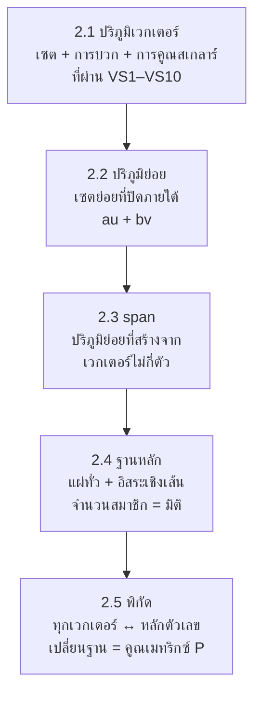

# บทที่ 2 ปริภูมิเวกเตอร์
*Vector Spaces — SC402101 พีชคณิตเชิงเส้น 1*

> [!info] ชุดสรุป 4 บท
> [[บทที่ 1 เมทริกซ์และระบบสมการเชิงเส้น]] → **บทที่ 2 ปริภูมิเวกเตอร์** (หน้านี้) → [[บทที่ 3 การแปลงเชิงเส้น]] → [[บทที่ 4 ค่าเจาะจงและเวกเตอร์เจาะจง]]

> [!abstract] อ่านบทนี้จบแล้วต้องทำอะไรได้
> 1. ตรวจว่าโครงสร้างหนึ่งเป็นปริภูมิเวกเตอร์หรือไม่ (VS1–VS10) และหาตัวอย่างค้านได้เร็ว
> 2. ตรวจว่าเซตย่อยเป็นปริภูมิย่อยหรือไม่ ด้วยเงื่อนไขเดียว $au+bv\in W$
> 3. ตัดสินว่าเวกเตอร์เป็นผลรวมเชิงเส้นของเซตที่กำหนดหรือไม่ บรรยาย span และตรวจการแผ่ทั่ว
> 4. ตรวจการเป็นอิสระเชิงเส้น หาฐานหลักและมิติ
> 5. หาพิกัดเทียบฐานหลักลำดับ และหาเมทริกซ์เปลี่ยนฐานหลัก $P_{C\leftarrow B}$

---

## 0. ภาพรวมของบท

บทที่ 1 จบด้วยเซตผลเฉลยหน้าตาแบบ $\{s\,v_1+t\,v_2 : s,t\in\mathbb{R}\}$ บทนี้ถามต่อว่า **เซตแบบนี้มีโครงสร้างอะไร และต้องใช้เวกเตอร์กี่ตัวจึงจะบรรยายมันได้ "พอดี" ไม่ขาดไม่เกิน**

> [!important] กุญแจดอกเดียวของทั้งบท — ทุกคำถามคือระบบสมการเชิงเส้นจากบทที่ 1
> ให้ $v_1,\dots,v_k$ เป็นเวกเตอร์ (เขียนเป็นหลักตัวเลข) และ $A=[\,v_1\ v_2\ \cdots\ v_k\,]$ เป็นเมทริกซ์ที่มีเวกเตอร์เหล่านี้เป็น **หลัก** จะได้ $c_1v_1+\cdots+c_kv_k=A\begin{bmatrix}c_1\\ \vdots\\ c_k\end{bmatrix}$ ดังนั้น
>
> | คำถามในบทที่ 2 | แปลเป็นคำถามเรื่องระบบสมการ |
> |---|---|
> | $u$ เป็นผลรวมเชิงเส้นของ $v_1,\dots,v_k$ ไหม | ระบบ $Ac=u$ **มีผลเฉลย** ไหม |
> | $\{v_i\}$ แผ่ทั่วปริภูมิไหม | $Ac=u$ มีผลเฉลย **ทุก** $u$ ไหม (มี 1 ตัวนำครบทุกแถว) |
> | $\{v_i\}$ อิสระเชิงเส้นไหม | $Ac=0$ มี **แต่ผลเฉลยชัด** ไหม (มี 1 ตัวนำครบทุกหลัก) |
> | พิกัด $[u]_B$ คืออะไร | ผลเฉลย (ชุดเดียว) ของ $Ac=u$ |
>
> และถ้า $A$ เป็นจัตุรัส ทุกข้อจบที่ $\det A\ne0$

---

## 2.1 ปริภูมิเวกเตอร์

### 2.1.1 ฟิลด์

**ฟิลด์** $(F,+,\cdot)$ คือเซตของ "สเกลาร์" ที่บวก ลบ คูณ หาร (ด้วยตัวที่ไม่เป็นศูนย์) ได้ตามปกติ กล่าวคือสำหรับทุก $x,y,z\in F$

| การบวก | การคูณ |
|---|---|
| (SF1) $x+y\in F$ | (SF6) $x\cdot y\in F$ |
| (SF2) $x+y=y+x$ | (SF7) $x\cdot y=y\cdot x$ |
| (SF3) $x+(y+z)=(x+y)+z$ | (SF8) $x\cdot(y\cdot z)=(x\cdot y)\cdot z$ |
| (SF4) มี $0\in F$ ที่ $x+0=x$ | (SF9) มี $1\in F$ ที่ $1\cdot x=x$ |
| (SF5) ทุก $x$ มี $-x\in F$ ที่ $x+(-x)=0$ | (SF10) ทุก $x\ne0$ มี $x^{-1}\in F$ ที่ $x\cdot x^{-1}=1$ |

และ (SF11) $x\cdot(y+z)=x\cdot y+x\cdot z$ เชื่อมสองการดำเนินการเข้าด้วยกัน

> [!example] ตัวอย่าง 2.2
> ตัวอย่างโครงสร้างที่เป็นฟิลด์และไม่เป็นฟิลด์

- **เป็นฟิลด์:** $(\mathbb{R},+,\cdot)$, $(\mathbb{Q},+,\cdot)$, $(\mathbb{C},+,\cdot)$
- **ไม่เป็นฟิลด์:** $(\mathbb{Z},+,\cdot)$ เพราะ $2\in\mathbb{Z}$ แต่ไม่มีตัวผกผันการคูณใน $\mathbb{Z}$ (ขาด SF10) ; $(\mathbb{N},+,\cdot)$ เพราะไม่มีตัวผกผันการบวก (ขาด SF5)

ในวิชานี้ใช้ฟิลด์ $\mathbb{R}$ เท่านั้น (หมายเหตุ 2.3)

### 2.1.2 ปริภูมิเวกเตอร์

> [!note] นิยาม — ปริภูมิเวกเตอร์เหนือ $\mathbb{R}$
> เซตไม่ว่าง $V$ พร้อมการบวก $\oplus$ (เวกเตอร์ ⊕ เวกเตอร์) และการคูณด้วยสเกลาร์ $\odot$ (สเกลาร์ ⊙ เวกเตอร์) เป็น **ปริภูมิเวกเตอร์** เมื่อสำหรับทุก $u,v,w\in V$ และ $c,d\in\mathbb{R}$
>
> | การบวกเวกเตอร์ | การคูณด้วยสเกลาร์ |
> |---|---|
> | (VS1) $u\oplus v\in V$ (ปิด) | (VS6) $c\odot u\in V$ (ปิด) |
> | (VS2) $u\oplus v=v\oplus u$ | (VS7) $c\odot(u\oplus v)=(c\odot u)\oplus(c\odot v)$ |
> | (VS3) $u\oplus(v\oplus w)=(u\oplus v)\oplus w$ | (VS8) $(c+d)\odot u=(c\odot u)\oplus(d\odot u)$ |
> | (VS4) มี $\theta_V\in V$ ที่ $u\oplus\theta_V=u$ | (VS9) $(cd)\odot u=c\odot(d\odot u)$ |
> | (VS5) ทุก $u$ มี $-u\in V$ ที่ $u\oplus(-u)=\theta_V$ | (VS10) $1\odot u=u$ |
>
> สมาชิกของ $V$ เรียกว่า **เวกเตอร์** และ $\theta_V$ เรียกว่า **เวกเตอร์ศูนย์** (ในบทที่ 3 เอกสารเขียน $0_V$)

> [!tip] วิธีคิดเวลาเจอโจทย์ "เป็นปริภูมิเวกเตอร์หรือไม่"
> - **จะตอบว่าเป็น** ต้องพิสูจน์ครบทั้ง 10 ข้อ
> - **จะตอบว่าไม่เป็น** หาตัวอย่างค้านของข้อ **เดียว** ก็พอ — ข้อที่พังบ่อยที่สุดตามลำดับคือ (VS4) ไม่มีเวกเตอร์ศูนย์, (VS1)/(VS6) ไม่ปิด, (VS8) การแจกแจงกับการบวกสเกลาร์
> - เวกเตอร์ศูนย์ $\theta_V$ **ไม่จำเป็นต้องเป็นเลข 0** มันคือ "ตัวที่บวกกับใครแล้วได้ตัวเดิม" ภายใต้ $\oplus$ ของโจทย์

> [!example] ตัวอย่าง 2.4
> ให้ $V=\{x\in\mathbb{R}:x>0\}$ กับ $x\oplus y=xy$ และ $a\odot x=x^a$ จงตรวจสอบว่า $(V,\oplus,\odot)$ เป็นปริภูมิเวกเตอร์หรือไม่

ให้ $u,v,w\in V$ (เป็นจำนวนจริงบวก) และ $c,d\in\mathbb{R}$
- (VS1) $u\oplus v=uv>0$ จึงอยู่ใน $V$
- (VS2) $u\oplus v=uv=vu=v\oplus u$
- (VS3) $u\oplus(v\oplus w)=u(vw)=(uv)w=(u\oplus v)\oplus w$
- (VS4) เลือก $\theta_V=1\in V$ : $u\oplus1=u\cdot1=u$ — **เวกเตอร์ศูนย์ของปริภูมินี้คือเลข 1**
- (VS5) สำหรับ $u\in V$ เลือก $-u:=\tfrac1u\in V$ : $u\oplus\tfrac1u=1=\theta_V$
- (VS6) $c\odot u=u^c>0$ จึงอยู่ใน $V$
- (VS7) $c\odot(u\oplus v)=(uv)^c=u^cv^c=(c\odot u)\oplus(c\odot v)$
- (VS8) $(c+d)\odot u=u^{c+d}=u^cu^d=(c\odot u)\oplus(d\odot u)$
- (VS9) $(cd)\odot u=u^{cd}=(u^d)^c=c\odot(d\odot u)$
- (VS10) $1\odot u=u^1=u$

ครบ 10 ข้อ จึง **เป็นปริภูมิเวกเตอร์**

> [!tip] มุมมองลัด — ปริภูมินี้คือ $\mathbb{R}$ ธรรมดาที่ "ใส่หน้ากาก $\ln$"
> ฟังก์ชัน $f(x)=\ln x$ จับคู่ $V$ กับ $\mathbb{R}$ แบบหนึ่งต่อหนึ่งทั่วถึง และ
> $$\ln(x\oplus y)=\ln x+\ln y,\qquad \ln(a\odot x)=a\ln x$$
> การ "คูณ" ใน $V$ คือการ "บวก" ใน $\mathbb{R}$ และการ "ยกกำลัง" คือการ "คูณสเกลาร์" กฎเลขชี้กำลังทั้งหมดจึงกลายเป็น VS1–VS10 โดยอัตโนมัติ (ในภาษาบทที่ 3: $f$ เป็นฟังก์ชันสมสัณฐาน และ $\dim V=1$) จึงเดาได้ทันทีว่าเวกเตอร์ศูนย์คือ $e^0=1$ และ $-u=e^{-\ln u}=1/u$

> [!example] ตัวอย่าง 2.5
> ให้ $V=\{x\in\mathbb{R}:x>0\}$ กับ $x\oplus y=x+y$ และ $a\odot x=x^a$ เป็นปริภูมิเวกเตอร์หรือไม่

**ไม่เป็น** ชี้จุดพังข้อเดียวก็พอ
- (VS4) ตัวที่ทำให้ $x+\theta=x$ ต้องเป็น $\theta=0$ แต่ $0\notin V$ จึงไม่มีเวกเตอร์ศูนย์ หรือ
- (VS8) เลือก $u=1$, $c=d=1$ : $(c+d)\odot u=1^2=1$ แต่ $(c\odot u)\oplus(d\odot u)=1+1=2$

> [!example] ตัวอย่าง 2.7 — ปริภูมิเวกเตอร์มาตรฐานที่ใช้ทั้งวิชา
> ภายใต้การบวกและการคูณสเกลาร์ตามปกติ

| ปริภูมิ | สมาชิก | มิติ |
|---|---|---|
| $\mathbb{R}^n$ | $n$-สิ่งอันดับ $(x_1,\dots,x_n)$ | $n$ |
| $P_n$ | พหุนามดีกรี **ไม่เกิน** $n$ : $a_nx^n+\cdots+a_1x+a_0$ | $n+1$ |
| $P$ | พหุนามทั้งหมด | อนันต์ |
| $M_{m\times n}$ | เมทริกซ์ $m\times n$ | $mn$ |

> [!example] ตัวอย่าง 2.8
> $V_1=\{(x,y)\in\mathbb{R}^2:y=6x+1\}$ และ $V_2=\{(x,y)\in\mathbb{R}^2:y=6x\}$ เป็นปริภูมิเวกเตอร์หรือไม่ (การดำเนินการแบบ $\mathbb{R}^2$)

- $V_1$ **ไม่เป็น** : $(0,1)\in V_1$ แต่ $(0,1)+(0,1)=(0,2)\notin V_1$ เพราะ $2\ne6(0)+1$ (ไม่ปิด) — หรือสังเกตว่า $(0,0)\notin V_1$
- $V_2$ **เป็น** : ถ้า $y_1=6x_1$, $y_2=6x_2$ แล้ว $ay_1+by_2=6(ax_1+bx_2)$ จึงปิดภายใต้ผลรวมเชิงเส้น (เป็นปริภูมิย่อยของ $\mathbb{R}^2$ ตามหัวข้อ 2.2)

> [!example] ตัวอย่าง 2.9
> $P_2^{*}=\{a_2x^2+a_1x+a_0:a_2\ne0\}$ (พหุนามดีกรี **เท่ากับ** 2) เป็นปริภูมิเวกเตอร์หรือไม่

**ไม่เป็น** : $x^2+1$ และ $-x^2$ อยู่ใน $P_2^{*}$ แต่ผลบวกคือ $1\notin P_2^{*}$ (ไม่ปิด) และพหุนามศูนย์ก็ไม่อยู่ใน $P_2^{*}$ ด้วย  
นี่คือเหตุผลที่ต้องนิยาม $P_n$ ด้วยคำว่า "ดีกรี **ไม่เกิน** $n$"

> [!important] ทฤษฎีบท 2.10 — ผลที่ตามมาจาก VS1–VS10
> ให้ $u\in V$ และ $c\in\mathbb{R}$
> 1. $0u=\theta_V$
> 2. $c\,\theta_V=\theta_V$
> 3. ถ้า $cu=\theta_V$ แล้ว $c=0$ หรือ $u=\theta_V$
> 4. $(-1)u=-u$
> 5. $-(-u)=u$

**พิสูจน์ (แนวคิด)**
1. $0u=(0+0)u=0u+0u$ บวก $-(0u)$ ทั้งสองข้างได้ $\theta_V=0u$
2. $c\theta_V=c(\theta_V+\theta_V)=c\theta_V+c\theta_V$ แล้วตัดออกแบบเดียวกัน
3. ถ้า $c\ne0$ : $u=1u=(c^{-1}c)u=c^{-1}(cu)=c^{-1}\theta_V=\theta_V$
4. $u+(-1)u=(1+(-1))u=0u=\theta_V$ จึง $(-1)u$ ทำหน้าที่เป็นตัวผกผันการบวกของ $u$

> [!tip] ใช้ข้อ 3 บ่อยมาก
> สมการ $cu=\theta_V$ ที่ $u\ne\theta_V$ บังคับให้ $c=0$ — นี่คือเหตุผลที่ **เซตที่มีเวกเตอร์ไม่ศูนย์ตัวเดียวเป็นอิสระเชิงเส้นเสมอ**

---

## 2.2 ปริภูมิย่อย

> [!note] นิยาม 2.11 — ปริภูมิย่อย
> ให้ $V$ เป็นปริภูมิเวกเตอร์ และ $\varnothing\ne W\subseteq V$ ถ้า $W$ เป็นปริภูมิเวกเตอร์ภายใต้การดำเนินการ **ชุดเดียวกับ** $V$ จะเรียก $W$ ว่า **ปริภูมิย่อย (subspace)** ของ $V$

**ตัวอย่าง 2.12** ทุกปริภูมิ $V$ มีปริภูมิย่อยสองตัวเสมอ คือ $\{\theta_V\}$ และ $V$ เอง

**ต้องตรวจกี่ข้อ?** สมาชิกของ $W$ เป็นสมาชิกของ $V$ อยู่แล้ว สมบัติที่เป็น "สมการ" จึงสืบทอดมาฟรี

| สมบัติ | บน $W$ | เหตุผล |
|---|---|---|
| (VS2), (VS3), (VS7), (VS8), (VS9), (VS10) | จริงอัตโนมัติ | เป็นสมการที่จริงกับทุกสมาชิกของ $V$ อยู่แล้ว |
| (VS1) ปิดการบวก, (VS6) ปิดการคูณสเกลาร์ | **ต้องตรวจ** | ผลลัพธ์อาจหลุดออกนอก $W$ |
| (VS4) มีศูนย์, (VS5) มีตัวผกผัน | ตามมาจาก (VS6) | $0u=\theta_V\in W$ และ $(-1)u=-u\in W$ |

> [!important] ทฤษฎีบท 2.13 และ 2.14 — เกณฑ์ปริภูมิย่อย
> ให้ $\varnothing\ne W\subseteq V$ ข้อความต่อไปนี้สมมูลกัน
> - $W$ เป็นปริภูมิย่อยของ $V$
> - **(SS1)** $u+v\in W$ และ **(SS2)** $au\in W$ สำหรับทุก $u,v\in W$, $a\in\mathbb{R}$
> - $au+bv\in W$ สำหรับทุก $u,v\in W$ และ $a,b\in\mathbb{R}$ **(เงื่อนไขเดียวจบ)**

### วิธีมาตรฐาน

> [!important] แม่แบบการเขียนพิสูจน์ว่า $W$ เป็นปริภูมิย่อย
> 1. **$W\subseteq V$** : เห็นชัดจากนิยามของ $W$
> 2. **$W\ne\varnothing$** : แสดงว่า $\theta_V\in W$
> 3. **ปิด** : ให้ $u,v\in W$ และ $a,b\in\mathbb{R}$ เขียน $u,v$ ตามเงื่อนไขของ $W$ แล้วแสดงว่า $au+bv$ ยังสอดคล้องเงื่อนไขเดิม

![[SC402101-ch2-subspace.svg]]

> [!tip] ทริค 3 ชั้น — ตัดสินได้ก่อนลงมือเขียน
> **ชั้นที่ 1 (ตัดทิ้งเร็ว):** ถ้า $\theta_V\notin W$ → ไม่เป็นปริภูมิย่อย จบ (ปริภูมิย่อยทุกตัวต้องมีเวกเตอร์ศูนย์)  
> **ชั้นที่ 2 (ดูรูปเงื่อนไข):** ถ้า $W$ นิยามด้วย **สมการเชิงเส้นเอกพันธ์** (ทุกพจน์เป็นดีกรี 1 ไม่มีค่าคงตัว ไม่มีกำลังสอง/ผลคูณของตัวแปร) → $W$ คือปริภูมิสู่ศูนย์ของเมทริกซ์ จึงเป็นปริภูมิย่อยแน่นอน (ตัวอย่าง 2.19)  
> **ชั้นที่ 3 (ดูรูปสมาชิก):** ถ้าสมาชิกทั่วไปของ $W$ เขียนเป็น "พารามิเตอร์ × เวกเตอร์คงตัว" บวกกันได้ → $W=\operatorname{span}\{\dots\}$ จึงเป็นปริภูมิย่อยโดยทฤษฎีบท 2.36
>
> สัญญาณอันตรายว่า **ไม่** เป็นปริภูมิย่อย: มีค่าคงตัวไม่เป็นศูนย์ ($x+2y=1$), อสมการ ($x\ge0$), กำลังสองหรือผลคูณ ($xy=0$, $y=x^2$), ค่าสัมบูรณ์, เงื่อนไข "เป็นจำนวนเต็ม"

> [!example] ตัวอย่าง 2.15
> $W_1=\{(x,y)\in\mathbb{R}^2:2x-3y=0\}$ และ $W_2=\{(x,y)\in\mathbb{R}^2:x+2y=1\}$ เป็นปริภูมิย่อยของ $\mathbb{R}^2$ หรือไม่

**$W_1$ เป็น** — $W_1\subseteq\mathbb{R}^2$ ชัดเจน และ $2(0)-3(0)=0$ จึง $(0,0)\in W_1$  
ให้ $u=(x_1,y_1),v=(x_2,y_2)\in W_1$ (คือ $2x_1-3y_1=0$, $2x_2-3y_2=0$) และ $a,b\in\mathbb{R}$ จะได้ $au+bv=(ax_1+bx_2,\ ay_1+by_2)$ และ
$$2(ax_1+bx_2)-3(ay_1+by_2)=a(2x_1-3y_1)+b(2x_2-3y_2)=a(0)+b(0)=0$$
จึง $au+bv\in W_1$  
**$W_2$ ไม่เป็น** — $(0,0)\notin W_2$ เพราะ $0+2(0)\ne1$ (หรือ $(1,0),(-1,1)\in W_2$ แต่ผลบวก $(0,1)\notin W_2$ เพราะ $0+2=2\ne1$)

> [!example] ตัวอย่าง 2.16
> $W_1=\{(x,2y,0):x,y\in\mathbb{R}\}$ และ $W_2=\{(x,y,z)\in\mathbb{R}^3:z=2x-7y\}$ เป็นปริภูมิย่อยของ $\mathbb{R}^3$ หรือไม่

**$W_1$ เป็น** — $(0,0,0)=(0,2\cdot0,0)\in W_1$ และถ้า $u=(x_1,2y_1,0)$, $v=(x_2,2y_2,0)$ แล้ว
$$au+bv=\big(ax_1+bx_2,\ 2(ay_1+by_2),\ 0\big)\in W_1$$
**$W_2$ เป็น** — $0=2(0)-7(0)$ จึง $(0,0,0)\in W_2$ และถ้า $z_1=2x_1-7y_1$, $z_2=2x_2-7y_2$ แล้ว
$$az_1+bz_2=2(ax_1+bx_2)-7(ay_1+by_2)$$
ซึ่งเป็นเงื่อนไขของ $W_2$ สำหรับเวกเตอร์ $au+bv$ พอดี  
**มองแบบลัด:** $W_1=\operatorname{span}\{(1,0,0),(0,2,0)\}$ (ระนาบ $XY$) และ $W_2=\operatorname{span}\{(1,0,2),(0,1,-7)\}$ คือระนาบ $2x-7y-z=0$ ผ่านจุดกำเนิด

> [!example] ตัวอย่าง 2.17
> $V=\{(x,y)\in\mathbb{R}^2:y=5x\}$ เป็นปริภูมิย่อยของ $\mathbb{R}^2$ หรือไม่

**เป็น** — $(0,0)=(0,5\cdot0)\in V$ ; ถ้า $y_1=5x_1$, $y_2=5x_2$ แล้ว $ay_1+by_2=5(ax_1+bx_2)$ จึง $au+bv\in V$ (ลัด: $V=\operatorname{span}\{(1,5)\}$ เส้นตรงผ่านจุดกำเนิด)

> [!example] ตัวอย่าง 2.18
> $V=\left\{\begin{bmatrix}x&x-2y\\x+y+z&y-z\end{bmatrix}:x,y,z\in\mathbb{R}\right\}$ เป็นปริภูมิย่อยของ $M_{2\times2}$ หรือไม่

**เป็น** — แทน $x=y=z=0$ ได้เมทริกซ์ศูนย์ จึง $V\ne\varnothing$ ให้ $u,v\in V$ มาจากพารามิเตอร์ $(x_1,y_1,z_1)$ และ $(x_2,y_2,z_2)$ ตั้ง $X=ax_1+bx_2$, $Y=ay_1+by_2$, $Z=az_1+bz_2$ จะได้
$$au+bv=\begin{bmatrix}X&X-2Y\\X+Y+Z&Y-Z\end{bmatrix}\in V$$
**มองแบบลัด:** แยกตามพารามิเตอร์
$$\begin{bmatrix}x&x-2y\\x+y+z&y-z\end{bmatrix}=x\begin{bmatrix}1&1\\1&0\end{bmatrix}+y\begin{bmatrix}0&-2\\1&1\end{bmatrix}+z\begin{bmatrix}0&0\\1&-1\end{bmatrix}$$
$V$ จึงเป็น span ของเมทริกซ์สามตัวนี้ (และเป็นปริภูมิย่อยมิติ 3)

> [!example] ตัวอย่าง 2.19 — ปริภูมิสู่ศูนย์ของเมทริกซ์ (null space / kernel)
> ให้ $A$ เป็นเมทริกซ์ $m\times n$ จงแสดงว่า $\operatorname{Kernel}(A)=\{X\in M_{n\times1}:AX=0_{m\times1}\}$ เป็นปริภูมิย่อยของ $M_{n\times1}$

$A\,0_{n\times1}=0_{m\times1}$ จึง $0_{n\times1}\in\operatorname{Kernel}(A)$ ให้ $X_1,X_2\in\operatorname{Kernel}(A)$ และ $a,b\in\mathbb{R}$
$$A(aX_1+bX_2)=aAX_1+bAX_2=a\,0+b\,0=0$$
จึง $aX_1+bX_2\in\operatorname{Kernel}(A)$ ∎

> [!important] ผลที่ได้ — เซตผลเฉลยของระบบเอกพันธ์เป็นปริภูมิย่อยเสมอ
> นี่คือเหตุผลเบื้องหลัง "ทริคชั้นที่ 2" และจะกลับมาอีกครั้งในชื่อ $\ker(T)$ (บทที่ 3) และปริภูมิเจาะจง $C_A(\lambda)$ (บทที่ 4)  
> ⚠️ เซตผลเฉลยของระบบ **ไม่เอกพันธ์** $AX=B$ ($B\ne0$) **ไม่เป็น** ปริภูมิย่อย เพราะไม่มีเวกเตอร์ศูนย์

> [!example] ตัวอย่าง 2.21
> จงหาปริภูมิสู่ศูนย์ของ $A=\begin{bmatrix}1&-5\\-3&15\end{bmatrix}$

$$
\begin{aligned}
A &= \begin{bmatrix} 1 & -5 \\ -3 & 15 \end{bmatrix} \\[4pt]
&\sim \begin{bmatrix} 1 & -5 \\ 0 & 0 \end{bmatrix} \quad \begin{array}{l} \scriptstyle R_2 + 3R_1 \to R_2 \end{array}
\end{aligned}
$$
เหลือสมการเดียว $x-5y=0$ ให้ $y=t$ ได้ $x=5t$
$$\operatorname{Kernel}(A)=\left\{t\begin{bmatrix}5\\1\end{bmatrix}:t\in\mathbb{R}\right\}=\operatorname{span}\left\{\begin{bmatrix}5\\1\end{bmatrix}\right\}$$

> [!example] ตัวอย่าง 2.22
> จงหาปริภูมิสู่ศูนย์ของ $B=\begin{bmatrix}1&1&1&0\\2&1&0&1\end{bmatrix}$

$$
\begin{aligned}
B &= \begin{bmatrix} 1 & 1 & 1 & 0 \\ 2 & 1 & 0 & 1 \end{bmatrix} \\[4pt]
&\sim \begin{bmatrix} 1 & 1 & 1 & 0 \\ 0 & -1 & -2 & 1 \end{bmatrix} \quad \begin{array}{l} \scriptstyle R_2 - 2R_1 \to R_2 \end{array} \\[4pt]
&\sim \begin{bmatrix} 1 & 1 & 1 & 0 \\ 0 & 1 & 2 & -1 \end{bmatrix} \quad \begin{array}{l} \scriptstyle -R_2 \to R_2 \end{array} \\[4pt]
&\sim \begin{bmatrix} 1 & 0 & -1 & 1 \\ 0 & 1 & 2 & -1 \end{bmatrix} \quad \begin{array}{l} \scriptstyle R_1 - R_2 \to R_1 \end{array}
\end{aligned}
$$
ตัวแปร $x,y,z,w$ : ตัวนำอยู่ที่ $x,y$ จึง $z=s$, $w=t$ เป็นอิสระ อ่านจาก RREF ได้ $x=z-w=s-t$ และ $y=-2z+w=-2s+t$
$$\operatorname{Kernel}(B)=\left\{s\begin{bmatrix}1\\-2\\1\\0\end{bmatrix}+t\begin{bmatrix}-1\\1\\0\\1\end{bmatrix}:s,t\in\mathbb{R}\right\}$$

> [!tip] ทริค — อ่านฐานหลักของปริภูมิสู่ศูนย์จาก RREF โดยตรง
> สำหรับตัวแปรอิสระแต่ละตัว: ตั้งตัวนั้นเป็น 1 ตัวอิสระอื่นเป็น 0 แล้วตัวแปรนำ = **ลบ** ของสมาชิกในหลักของตัวแปรอิสระนั้น  
> ข้อ 2.22: หลัก $z$ ของ RREF คือ $(-1,2)$ → เวกเตอร์ $(1,-2,1,0)$ ; หลัก $w$ คือ $(1,-1)$ → เวกเตอร์ $(-1,1,0,1)$  
> จำนวนเวกเตอร์ที่ได้ = จำนวนตัวแปรอิสระ $=n-r$ = มิติของปริภูมิสู่ศูนย์

---

## 2.3 ผลการแผ่ของเซตของเวกเตอร์

### 2.3.1 ผลรวมเชิงเส้น

> [!note] นิยาม 2.23 — ผลรวมเชิงเส้น
> $u$ เป็น **ผลรวมเชิงเส้น (linear combination)** ของ $v_1,\dots,v_n$ ถ้ามีสเกลาร์ $c_1,\dots,c_n$ ที่ทำให้ $u=c_1v_1+c_2v_2+\cdots+c_nv_n$

> [!important] วิธีมาตรฐาน
> 1. ตั้ง $u=c_1v_1+\cdots+c_nv_n$ โดย $c_i$ เป็นตัวไม่ทราบค่า
> 2. เทียบส่วนประกอบ (หรือสัมประสิทธิ์ของพหุนาม / สมาชิกของเมทริกซ์) ได้ระบบสมการเชิงเส้น — เมทริกซ์แต่งเติมคือ $[\,v_1\ \cdots\ v_n\ |\ u\,]$
> 3. ระบบ **มีผลเฉลย** → เป็นผลรวมเชิงเส้น (และผลเฉลยคือสัมประสิทธิ์) ; ระบบ **ขัดแย้ง** → ไม่เป็น

> [!example] ตัวอย่าง 2.24
> $(1,2)$ เป็นผลรวมเชิงเส้นของ $(1,0),(0,1)$ หรือไม่

เป็น : $(1,2)=1(1,0)+2(0,1)$

> [!example] ตัวอย่าง 2.25
> $(1,2)$ เป็นผลรวมเชิงเส้นของ $(2,1),(3,1)$ หรือไม่

ตั้ง $(1,2)=a(2,1)+b(3,1)=(2a+3b,\ a+b)$ ได้ $2a+3b=1$ และ $a+b=2$ คูณสมการหลังด้วย 2 แล้วลบ: $b=-3$, $a=5$  
**เป็น** : $(1,2)=5(2,1)+(-3)(3,1)$

> [!example] ตัวอย่าง 2.26
> $(1,2)$ เป็นผลรวมเชิงเส้นของ $(2,1),(4,2)$ หรือไม่

ตั้ง $(1,2)=a(2,1)+b(4,2)$ ได้ $2a+4b=1$ และ $a+2b=2$ ซึ่งสมการหลังให้ $2a+4b=4$ ขัดแย้งกับสมการแรก  
**ไม่เป็น** — มองลัด: $(4,2)=2(2,1)$ ผลรวมเชิงเส้นทุกตัวจึงเป็นพหุคูณของ $(2,1)$ แต่ $(1,2)$ ไม่ใช่

> [!example] ตัวอย่าง 2.27
> $(0,0)$ เป็นผลรวมเชิงเส้นของ $(2,1),(3,1)$ หรือไม่

**เป็น** : $(0,0)=0(2,1)+0(3,1)$ — เวกเตอร์ศูนย์เป็นผลรวมเชิงเส้นของเซตใดก็ได้เสมอ

> [!example] ตัวอย่าง 2.28
> $\begin{bmatrix}1&-1\\-3&2\end{bmatrix}$ เป็นผลรวมเชิงเส้นของ $\begin{bmatrix}1&0\\0&0\end{bmatrix},\begin{bmatrix}0&1\\0&0\end{bmatrix},\begin{bmatrix}0&0\\1&0\end{bmatrix},\begin{bmatrix}0&0\\0&1\end{bmatrix}$ หรือไม่

**เป็น** : $\begin{bmatrix}1&-1\\-3&2\end{bmatrix}=1\begin{bmatrix}1&0\\0&0\end{bmatrix}+(-1)\begin{bmatrix}0&1\\0&0\end{bmatrix}+(-3)\begin{bmatrix}0&0\\1&0\end{bmatrix}+2\begin{bmatrix}0&0\\0&1\end{bmatrix}$ (สัมประสิทธิ์คือสมาชิกแต่ละตำแหน่งนั่นเอง)

> [!example] ตัวอย่าง 2.29
> $\begin{bmatrix}1&-1\\-3&2\end{bmatrix}$ เป็นผลรวมเชิงเส้นของ $\begin{bmatrix}-1&1\\0&0\end{bmatrix},\begin{bmatrix}0&0\\2&1\end{bmatrix},\begin{bmatrix}0&0\\0&5\end{bmatrix}$ หรือไม่

ตั้ง $\begin{bmatrix}1&-1\\-3&2\end{bmatrix}=a\begin{bmatrix}-1&1\\0&0\end{bmatrix}+b\begin{bmatrix}0&0\\2&1\end{bmatrix}+c\begin{bmatrix}0&0\\0&5\end{bmatrix}=\begin{bmatrix}-a&a\\2b&b+5c\end{bmatrix}$  
เทียบ 4 ตำแหน่ง: $-a=1$, $a=-1$, $2b=-3$, $b+5c=2$ สองสมการแรก **สอดคล้องกัน** ($a=-1$) ; $b=-\tfrac32$ ; $c=\tfrac15\left(2+\tfrac32\right)=\tfrac{7}{10}$  
**เป็น** : $\begin{bmatrix}1&-1\\-3&2\end{bmatrix}=(-1)\begin{bmatrix}-1&1\\0&0\end{bmatrix}+\left(-\tfrac32\right)\begin{bmatrix}0&0\\2&1\end{bmatrix}+\tfrac{7}{10}\begin{bmatrix}0&0\\0&5\end{bmatrix}$  
⚠️ มี 4 สมการ 3 ตัวแปร ต้องเช็กให้ครบทุกสมการ ถ้าตำแหน่ง $(1,2)$ ของโจทย์ไม่ใช่ $-1$ คำตอบจะเป็น "ไม่เป็น" ทันที

### 2.3.2 ผลการแผ่ (span)

> [!note] นิยาม 2.30 — ผลการแผ่
> $$\operatorname{span}\{v_1,\dots,v_n\}=\{c_1v_1+c_2v_2+\cdots+c_nv_n:c_1,\dots,c_n\in\mathbb{R}\}$$
> คือ **เซตของผลรวมเชิงเส้นทั้งหมด** ของ $v_1,\dots,v_n$ (สำหรับเซต $S$ ทั่วไป: ผลรวมเชิงเส้นของสมาชิกจำนวนจำกัดใน $S$)

![[SC402101-ch2-span.svg]]

> [!important] ทฤษฎีบท 2.36 และหมายเหตุ 2.37
> - $\operatorname{span}\{v_1,\dots,v_n\}$ เป็น **ปริภูมิย่อย** ของ $V$ เสมอ
> - เป็นปริภูมิย่อยที่ **เล็กที่สุด** ที่บรรจุ $v_1,\dots,v_n$ : ถ้า $W$ เป็นปริภูมิย่อยที่มี $v_1,\dots,v_n$ แล้ว $\operatorname{span}\{v_1,\dots,v_n\}\subseteq W$
> - ถ้า $V=\operatorname{span}\{v_1,\dots,v_n\}$ จะกล่าวว่าเซตนี้ **แผ่ทั่ว** $V$ (ทุก $u\in V$ เป็นผลรวมเชิงเส้นของ $v_1,\dots,v_n$)

**พิสูจน์ข้อแรก** $\theta_V=0v_1+\cdots+0v_n$ อยู่ใน span ; ถ้า $x=\sum\alpha_iv_i$ และ $y=\sum\beta_iv_i$ แล้ว $ax+by=\sum(a\alpha_i+b\beta_i)v_i$ ซึ่งยังเป็นผลรวมเชิงเส้นของ $v_i$ ∎

> [!example] ตัวอย่าง 2.31
> จงหา $\operatorname{span}\{(1,2)\}$

$\operatorname{span}\{(1,2)\}=\{a(1,2):a\in\mathbb{R}\}=\{(a,2a):a\in\mathbb{R}\}=\{(x,y):y=2x\}$ — เส้นตรงผ่านจุดกำเนิดและจุด $(1,2)$ เช่น $(0,0),(2,4),(-1,-2)$ อยู่ในเซตนี้

> [!example] ตัวอย่าง 2.32
> จงหา $\operatorname{span}\{(1,2),(3,1)\}$

$=\{a(1,2)+b(3,1)\}=\{(a+3b,\ 2a+b):a,b\in\mathbb{R}\}$ และเนื่องจาก $\begin{vmatrix}1&3\\2&1\end{vmatrix}=-5\ne0$ ระบบ $a+3b=x,\ 2a+b=y$ มีผลเฉลยทุก $(x,y)$ เซตนี้จึงเท่ากับ $\mathbb{R}^2$

> [!example] ตัวอย่าง 2.33
> จงหา $\operatorname{span}\{(1,0,2),(2,3,-1)\}$

$=\{a(1,0,2)+b(2,3,-1)\}=\{(a+2b,\ 3b,\ 2a-b):a,b\in\mathbb{R}\}$  
**ถามต่อ (จาก Lecture 4):** $(-3,-6,4)$ อยู่ใน span นี้ไหม — จากส่วนประกอบที่สอง $3b=-6\Rightarrow b=-2$ ; ส่วนประกอบแรก $a-4=-3\Rightarrow a=1$ ; เช็กส่วนประกอบที่สาม $2(1)-(-2)=4$ ✓ จึง **อยู่** : $(-3,-6,4)=1(1,0,2)+(-2)(2,3,-1)$

> [!tip] มุมมองลัด — span ของ 2 เวกเตอร์ที่ไม่ขนานกันใน $\mathbb{R}^3$ คือระนาบผ่านจุดกำเนิด
> เวกเตอร์ตั้งฉากของระนาบคือผลคูณไขว้ $(1,0,2)\times(2,3,-1)=(-6,5,3)$ ระนาบจึงมีสมการ $-6x+5y+3z=0$  
> ตรวจการเป็นสมาชิกได้ในบรรทัดเดียว: $(-3,-6,4)\ \to\ 18-30+12=0$ ✓ อยู่ในระนาบ

> [!example] ตัวอย่าง 2.34
> จงหา $\operatorname{span}\left\{\begin{bmatrix}0&-1\\-2&1\end{bmatrix},\begin{bmatrix}1&1\\3&2\end{bmatrix}\right\}$

$=\left\{a\begin{bmatrix}0&-1\\-2&1\end{bmatrix}+b\begin{bmatrix}1&1\\3&2\end{bmatrix}\right\}=\left\{\begin{bmatrix}b&-a+b\\-2a+3b&a+2b\end{bmatrix}:a,b\in\mathbb{R}\right\}$

> [!example] ตัวอย่าง 2.35
> ให้ $e_1=(1,0,0),e_2=(0,1,0),e_3=(0,0,1)$ จงแสดงว่า $\operatorname{span}\{e_1,e_2,e_3\}=\mathbb{R}^3$

$\operatorname{span}\{e_1,e_2,e_3\}=\{a(1,0,0)+b(0,1,0)+c(0,0,1)\}=\{(a,b,c):a,b,c\in\mathbb{R}\}=\mathbb{R}^3$

### การตรวจการแผ่ทั่ว

> [!important] วิธีมาตรฐาน — ตรวจว่า $S=\{v_1,\dots,v_k\}$ แผ่ทั่ว $V$
> 1. หยิบสมาชิก **ทั่วไป** ของ $V$ (เช่น $(x,y,z)$, $ax^2+bx+c$, $\begin{bmatrix}x&y\\z&w\end{bmatrix}$)
> 2. ตั้งให้เท่ากับ $c_1v_1+\cdots+c_kv_k$ ได้ระบบสมการ
> 3. ระบบมีผลเฉลย **ทุกค่าของตัวทั่วไป** → แผ่ทั่ว ; มีบางค่าที่ทำให้ขัดแย้ง → ไม่แผ่ทั่ว (ชี้เวกเตอร์ตัวนั้นเป็นตัวอย่างค้าน)

> [!tip] ทริคตัดสินเร็ว (ใช้ความรู้เรื่องมิติจากหัวข้อ 2.4)
> - จำนวนเวกเตอร์ **น้อยกว่า** $\dim V$ → **ไม่มีทางแผ่ทั่ว** (เช่น 2 เวกเตอร์ใน $\mathbb{R}^3$, 2 พหุนามใน $P_2$)
> - จำนวนเวกเตอร์ **เท่ากับ** $\dim V$ → แผ่ทั่ว $\iff\det[\,v_1\cdots v_n\,]\ne0$ $\iff$ อิสระเชิงเส้น
> - จำนวนเวกเตอร์มากกว่า $\dim V$ → ลดรูป $[\,v_1\cdots v_k\,]$ แผ่ทั่ว $\iff$ มี 1 ตัวนำ **ครบทุกแถว**

> [!example] ตัวอย่าง 2.38
> $\{(2,1),(1,2)\}$ แผ่ทั่ว $\mathbb{R}^2$ หรือไม่

ให้ $(x,y)\in\mathbb{R}^2$ หา $a,b$ ที่ $a(2,1)+b(1,2)=(x,y)$ คือ $2a+b=x$, $a+2b=y$ แก้ได้ $a=\tfrac{2x-y}{3}$, $b=\tfrac{2y-x}{3}$ (มีเสมอ)  
**แผ่ทั่ว** : $(x,y)=\tfrac{2x-y}{3}(2,1)+\tfrac{2y-x}{3}(1,2)$ — ลัด: $\begin{vmatrix}2&1\\1&2\end{vmatrix}=3\ne0$

> [!example] ตัวอย่าง 2.39
> $\{(2,1,0),(3,1,0)\}$ แผ่ทั่ว $\mathbb{R}^3$ หรือไม่

$a(2,1,0)+b(3,1,0)=(2a+3b,\ a+b,\ 0)$ ส่วนประกอบที่สามเป็น 0 เสมอ เลือก $(0,0,1)$ จะได้สมการ $0=1$ ขัดแย้ง  
**ไม่แผ่ทั่ว** — ลัด: มีเพียง 2 เวกเตอร์ แต่ $\dim\mathbb{R}^3=3$

> [!example] ตัวอย่าง 2.40
> $\{(1,2,0),(3,1,0),(1,2,3)\}$ แผ่ทั่ว $\mathbb{R}^3$ หรือไม่

ตั้ง $(x,y,z)=a(1,2,0)+b(3,1,0)+c(1,2,3)$ ได้ระบบ $a+3b+c=x,\ 2a+b+2c=y,\ 3c=z$ เมทริกซ์สัมประสิทธิ์
$$
\begin{aligned}
{} & \begin{bmatrix} 1 & 3 & 1 \\ 2 & 1 & 2 \\ 0 & 0 & 3 \end{bmatrix} \\[4pt]
&\sim \begin{bmatrix} 1 & 3 & 1 \\ 0 & -5 & 0 \\ 0 & 0 & 3 \end{bmatrix} \quad \begin{array}{l} \scriptstyle R_2 - 2R_1 \to R_2 \end{array} \\[4pt]
&\sim \begin{bmatrix} 1 & 3 & 1 \\ 0 & 1 & 0 \\ 0 & 0 & 1 \end{bmatrix} \quad \begin{array}{l} \scriptstyle -\tfrac{1}{5}R_2 \to R_2 \\ \scriptstyle \tfrac{1}{3}R_3 \to R_3 \end{array}
\end{aligned}
$$
มี 1 ตัวนำครบทุกแถว ระบบจึงมีผลเฉลยทุก $(x,y,z)$ — **แผ่ทั่ว** (ผลเฉลยคือ $c=\tfrac z3$, $b=\tfrac{2x-y}{5}$, $a=\tfrac{3y-x}{5}-\tfrac z3$)  
ลัด: $\begin{vmatrix}1&3&1\\2&1&2\\0&0&3\end{vmatrix}=3\begin{vmatrix}1&3\\2&1\end{vmatrix}=3(-5)=-15\ne0$

> [!example] ตัวอย่าง 2.41
> $\{1,x,x^2\}$ แผ่ทั่ว $P_2$ หรือไม่

**แผ่ทั่ว** : สมาชิกทั่วไป $ax^2+bx+c=c(1)+b(x)+a(x^2)$

> [!example] ตัวอย่าง 2.42
> $\{1-x^2,\ 1+x,\ x^2\}$ แผ่ทั่ว $P_2$ หรือไม่

ตั้ง $ax^2+bx+c=\alpha(1-x^2)+\beta(1+x)+\gamma x^2=(-\alpha+\gamma)x^2+\beta x+(\alpha+\beta)$ เทียบสัมประสิทธิ์
$$-\alpha+\gamma=a,\qquad \beta=b,\qquad \alpha+\beta=c\quad\Longrightarrow\quad \beta=b,\ \ \alpha=c-b,\ \ \gamma=a+c-b$$
มีผลเฉลยทุก $a,b,c$ — **แผ่ทั่ว** (ลัด: $\begin{vmatrix}-1&0&1\\0&1&0\\1&1&0\end{vmatrix}=-1\ne0$)

> [!example] ตัวอย่าง 2.43
> $\left\{\begin{bmatrix}0&1\\1&1\end{bmatrix},\begin{bmatrix}1&0\\1&1\end{bmatrix},\begin{bmatrix}1&1\\0&1\end{bmatrix},\begin{bmatrix}1&1\\1&0\end{bmatrix}\right\}$ แผ่ทั่ว $M_{2\times2}$ หรือไม่

ตั้ง $\begin{bmatrix}a&b\\c&d\end{bmatrix}=x\begin{bmatrix}0&1\\1&1\end{bmatrix}+y\begin{bmatrix}1&0\\1&1\end{bmatrix}+z\begin{bmatrix}1&1\\0&1\end{bmatrix}+w\begin{bmatrix}1&1\\1&0\end{bmatrix}$ เทียบสมาชิก
$$y+z+w=a,\quad x+z+w=b,\quad x+y+w=c,\quad x+y+z=d$$

> [!tip] ทริคสมมาตร — ไม่ต้องลดรูปเมทริกซ์ $4\times5$
> แต่ละสมการคือ "ผลรวมทั้งสี่ตัว ลบด้วยตัวหนึ่ง" บวกทั้งสี่สมการ: $3(x+y+z+w)=a+b+c+d$ ให้ $\Sigma=\tfrac13(a+b+c+d)$ จะได้
> $$x=\Sigma-a,\quad y=\Sigma-b,\quad z=\Sigma-c,\quad w=\Sigma-d$$

มีผลเฉลยทุก $a,b,c,d$ — **แผ่ทั่ว** (สอดคล้องกับ $\det$ ของเมทริกซ์สัมประสิทธิ์ $=-3\ne0$)

> [!example] ตัวอย่าง 2.44
> $\begin{bmatrix}-17\\-6\\11\end{bmatrix}$ อยู่ใน $\operatorname{span}\left\{\begin{bmatrix}1\\2\\1\end{bmatrix},\begin{bmatrix}-2\\0\\2\end{bmatrix}\right\}$ หรือไม่

ตั้ง $a\begin{bmatrix}1\\2\\1\end{bmatrix}+b\begin{bmatrix}-2\\0\\2\end{bmatrix}=\begin{bmatrix}-17\\-6\\11\end{bmatrix}$ ได้ $a-2b=-17$, $2a=-6$, $a+2b=11$  
จากสมการกลาง $a=-3$ ; สมการแรกให้ $b=7$ ; **เช็กสมการที่สาม** $-3+14=11$ ✓  
**อยู่** : $\begin{bmatrix}-17\\-6\\11\end{bmatrix}=(-3)\begin{bmatrix}1\\2\\1\end{bmatrix}+7\begin{bmatrix}-2\\0\\2\end{bmatrix}$

> [!example] ตัวอย่างเพิ่มจาก Lecture 5 (2.3.14)
> $\{1-x^2,\ 1+x\}$ แผ่ทั่ว $P_2$ หรือไม่

ตั้ง $ax^2+bx+c=\alpha(1-x^2)+\beta(1+x)$ ได้ $-\alpha=a$, $\beta=b$, $\alpha+\beta=c$ จึงบังคับว่า $c=b-a$ เลือก $p(x)=x$ ($a=0,b=1,c=0$) จะได้ $0=1$ ขัดแย้ง — **ไม่แผ่ทั่ว** (ลัด: 2 ตัว < $\dim P_2=3$)

> [!example] ตัวอย่างเพิ่มจาก Lecture 5 (2.3.17)
> ให้ $p(x)=x^3-2x^2-5x-3$ และ $q(x)=3x^3-5x^2-4x-8$ พหุนามต่อไปนี้เป็นผลรวมเชิงเส้นของ $p,q$ หรือไม่ (i) $f(x)=-2x^3+3x^2-x+5$ (ii) $g(x)=-2x^3-2x^2+x+5$

ตั้ง $ap+bq$ แล้วเทียบสัมประสิทธิ์ของ $x^3,x^2,x,1$ ได้เมทริกซ์แต่งเติม (หลัก $a$, $b$ | เป้าหมาย)  
**(i)**
$$
\begin{aligned}
{} & \left[\begin{array}{cc|c} 1 & 3 & -2 \\ -2 & -5 & 3 \\ -5 & -4 & -1 \\ -3 & -8 & 5 \end{array}\right] \\[4pt]
&\sim \left[\begin{array}{cc|c} 1 & 3 & -2 \\ 0 & 1 & -1 \\ 0 & 11 & -11 \\ 0 & 1 & -1 \end{array}\right] \quad \begin{array}{l} \scriptstyle R_2 + 2R_1 \to R_2 \\ \scriptstyle R_3 + 5R_1 \to R_3 \\ \scriptstyle R_4 + 3R_1 \to R_4 \end{array} \\[4pt]
&\sim \left[\begin{array}{cc|c} 1 & 3 & -2 \\ 0 & 1 & -1 \\ 0 & 0 & 0 \\ 0 & 0 & 0 \end{array}\right] \quad \begin{array}{l} \scriptstyle R_3 - 11R_2 \to R_3 \\ \scriptstyle R_4 - R_2 \to R_4 \end{array}
\end{aligned}
$$
ไม่ขัดแย้ง: $b=-1$, $a=-2-3b=1$ — **เป็น** : $f=p-q$  
**(ii)**
$$
\begin{aligned}
{} & \left[\begin{array}{cc|c} 1 & 3 & -2 \\ -2 & -5 & -2 \\ -5 & -4 & 1 \\ -3 & -8 & 5 \end{array}\right] \\[4pt]
&\sim \left[\begin{array}{cc|c} 1 & 3 & -2 \\ 0 & 1 & -6 \\ 0 & 11 & -9 \\ 0 & 1 & -1 \end{array}\right] \quad \begin{array}{l} \scriptstyle R_2 + 2R_1 \to R_2 \\ \scriptstyle R_3 + 5R_1 \to R_3 \\ \scriptstyle R_4 + 3R_1 \to R_4 \end{array} \\[4pt]
&\sim \left[\begin{array}{cc|c} 1 & 3 & -2 \\ 0 & 1 & -6 \\ 0 & 0 & 57 \\ 0 & 0 & 5 \end{array}\right] \quad \begin{array}{l} \scriptstyle R_3 - 11R_2 \to R_3 \\ \scriptstyle R_4 - R_2 \to R_4 \end{array}
\end{aligned}
$$
แถวที่ 3 และ 4 ให้ $0=57$ และ $0=5$ ขัดแย้ง — **ไม่เป็น**

> [!tip] ทริค — หา $a,b$ จาก 2 สมการที่ง่ายที่สุด แล้ว "เช็ก" กับสมการที่เหลือ
> ข้อ (i): สัมประสิทธิ์ $x^3$ และ $x^2$ ให้ $a+3b=-2$, $-2a-5b=3\Rightarrow a=1,b=-1$ เช็ก $x$: $-5(1)-4(-1)=-1$ ✓ ค่าคงตัว: $-3(1)-8(-1)=5$ ✓  
> ข้อ (ii): สองสมการแรกให้ $a=16,b=-6$ เช็ก $x$: $-5(16)-4(-6)=-56\ne1$ ✗ จบ

---

## 2.4 การเป็นอิสระเชิงเส้น ฐานหลัก และมิติ

### 2.4.1 การเป็นอิสระเชิงเส้น

> [!note] นิยาม 2.45 — อิสระเชิงเส้น
> $S=\{v_1,\dots,v_n\}$ **เป็นอิสระเชิงเส้น (linearly independent)** ถ้า
> $$c_1v_1+c_2v_2+\cdots+c_nv_n=\theta_V\quad\Longrightarrow\quad c_1=c_2=\cdots=c_n=0$$
> และ **ไม่เป็นอิสระเชิงเส้น (linearly dependent)** ถ้ามี $c_i$ **ไม่เป็นศูนย์อย่างน้อยหนึ่งตัว** ที่ทำให้ $c_1v_1+\cdots+c_nv_n=\theta_V$

**ความหมาย:** อิสระเชิงเส้น = ไม่มีตัวไหน "ซ้ำซ้อน" ; ไม่อิสระ = มีบางตัวสร้างได้จากตัวอื่น

> [!important] ทฤษฎีบท 2.55
> ให้ $S$ ไม่มีเวกเตอร์ศูนย์ จะได้ว่า $S$ ไม่เป็นอิสระเชิงเส้น $\iff$ มีเวกเตอร์ใน $S$ ที่เป็นผลรวมเชิงเส้นของเวกเตอร์ที่เหลือ

**เหตุผล** ถ้า $c_1v_1+\cdots+c_nv_n=\theta$ โดย $c_k\ne0$ ย้ายข้างแล้วหารด้วย $c_k$ ได้ $v_k=-\sum_{i\ne k}\tfrac{c_i}{c_k}v_i$ และกลับกัน ถ้า $v_k=\sum_{i\ne k}d_iv_i$ ก็ได้ความสัมพันธ์ที่สัมประสิทธิ์ของ $v_k$ เป็น $-1\ne0$

> [!important] วิธีมาตรฐาน — ตรวจการเป็นอิสระเชิงเส้น
> 1. ตั้ง $c_1v_1+\cdots+c_nv_n=\theta_V$
> 2. เทียบส่วนประกอบ ได้ **ระบบเอกพันธ์** $Ac=0$ โดย $A=[\,v_1\ \cdots\ v_n\,]$
> 3. มีแต่ผลเฉลยชัด → **อิสระ** ; มีผลเฉลยอื่น → **ไม่อิสระ** (และผลเฉลยนั้นบอกความสัมพันธ์ระหว่างเวกเตอร์)

> [!tip] ทริค — 6 ทางลัดที่ควรลองก่อนตั้งสมการ
> 1. **มีเวกเตอร์ศูนย์อยู่ในเซต** → ไม่อิสระ
> 2. **มี 2 เวกเตอร์** → ไม่อิสระ $\iff$ ตัวหนึ่งเป็นพหุคูณของอีกตัว (ดูด้วยตาได้)
> 3. **จำนวนเวกเตอร์ > มิติของปริภูมิ** → ไม่อิสระแน่นอน (เช่น 4 เวกเตอร์ใน $\mathbb{R}^3$)
> 4. **จำนวนเวกเตอร์ = มิติ** → อิสระ $\iff\det[\,v_1\cdots v_n\,]\ne0$
> 5. **รูปขั้นบันได** → ถ้าแต่ละตัวมี "ตำแหน่งนำ" ต่างกัน (เช่นพหุนามดีกรีต่างกันทั้งหมด หรือเวกเตอร์ที่ตำแหน่งไม่เป็นศูนย์ตัวแรกไม่ซ้ำกัน) → อิสระ
> 6. **มองเห็นความสัมพันธ์** → ถ้าเห็นว่าตัวหนึ่งเป็นผลบวก/ผลต่างของตัวอื่น ตอบ "ไม่อิสระ" พร้อมเขียนความสัมพันธ์นั้นได้เลย (ทฤษฎีบท 2.55)

> [!example] ตัวอย่าง 2.46
> $S_1=\{(2,1),(3,1)\}$ เป็นอิสระเชิงเส้นหรือไม่

ตั้ง $a(2,1)+b(3,1)=(0,0)$ ได้ $2a+3b=0$, $a+b=0$ เนื่องจาก $\begin{vmatrix}2&3\\1&1\end{vmatrix}=-1\ne0$ ระบบมีแต่ผลเฉลยชัด $a=b=0$ — **อิสระเชิงเส้น**

> [!example] ตัวอย่าง 2.47
> $S_2=\{(1,3),(-2,-6)\}$ เป็นอิสระเชิงเส้นหรือไม่

$(-2,-6)=-2(1,3)$ จึง $2(1,3)+1(-2,-6)=(0,0)$ โดยสัมประสิทธิ์ไม่เป็นศูนย์ — **ไม่อิสระเชิงเส้น**  
(วิธีมาตรฐาน: $c-2d=0$, $3c-6d=0$ เหลือสมการเดียว ให้ $d=t$ ได้ $c=2t$ เลือก $t=1$)

> [!example] ตัวอย่าง 2.48
> $S_3=\{e_1,e_2,e_3\}$ ใน $\mathbb{R}^3$ เป็นอิสระเชิงเส้นหรือไม่

$ae_1+be_2+ce_3=(a,b,c)=(0,0,0)\Rightarrow a=b=c=0$ — **อิสระเชิงเส้น**

> [!example] ตัวอย่าง 2.49 และ 2.50
> $S_4=\{(1,2,0),(3,1,0),(1,2,3)\}$ ใน $\mathbb{R}^3$ (และ $S_5$ คือเวกเตอร์ชุดเดียวกันเขียนเป็นเมทริกซ์หลักใน $M_{3\times1}$) เป็นอิสระเชิงเส้นหรือไม่

ตั้ง $a(1,2,0)+b(3,1,0)+c(1,2,3)=(0,0,0)$ ได้ $a+3b+c=0$, $2a+b+2c=0$, $3c=0$
$$\begin{vmatrix}1&3&1\\2&1&2\\0&0&3\end{vmatrix}=3(1-6)=-15\ne0$$
ระบบเอกพันธ์จึงมีแต่ผลเฉลยชัด — **อิสระเชิงเส้น** ทั้ง $S_4$ และ $S_5$ (ระบบสมการเดียวกันทุกประการ)  
หรือแก้ตรง ๆ: $c=0$ แล้วเหลือ $a+3b=0$, $2a+b=0\Rightarrow a=b=0$

> [!example] ตัวอย่าง 2.51
> $S_6=\left\{\begin{bmatrix}1\\-2\\3\end{bmatrix},\begin{bmatrix}5\\6\\-1\end{bmatrix},\begin{bmatrix}3\\2\\1\end{bmatrix}\right\}$ เป็นอิสระเชิงเส้นหรือไม่

ตั้ง $a v_1+b v_2+c v_3=0$ ลดรูปเมทริกซ์สัมประสิทธิ์
$$
\begin{aligned}
{} & \begin{bmatrix} 1 & 5 & 3 \\ -2 & 6 & 2 \\ 3 & -1 & 1 \end{bmatrix} \\[4pt]
&\sim \begin{bmatrix} 1 & 5 & 3 \\ 0 & 16 & 8 \\ 0 & -16 & -8 \end{bmatrix} \quad \begin{array}{l} \scriptstyle R_2 + 2R_1 \to R_2 \\ \scriptstyle R_3 - 3R_1 \to R_3 \end{array} \\[4pt]
&\sim \begin{bmatrix} 1 & 5 & 3 \\ 0 & 16 & 8 \\ 0 & 0 & 0 \end{bmatrix} \quad \begin{array}{l} \scriptstyle R_3 + R_2 \to R_3 \end{array} \\[4pt]
&\sim \begin{bmatrix} 1 & 5 & 3 \\ 0 & 1 & \tfrac{1}{2} \\ 0 & 0 & 0 \end{bmatrix} \quad \begin{array}{l} \scriptstyle \tfrac{1}{16}R_2 \to R_2 \end{array}
\end{aligned}
$$
เกิดแถวศูนย์: $c=t$ อิสระ, $b=-\tfrac12t$, $a=-5b-3c=-\tfrac12t$ เลือก $t=2$ ได้ $a=-1,b=-1,c=2$
$$(-1)\begin{bmatrix}1\\-2\\3\end{bmatrix}+(-1)\begin{bmatrix}5\\6\\-1\end{bmatrix}+2\begin{bmatrix}3\\2\\1\end{bmatrix}=\begin{bmatrix}0\\0\\0\end{bmatrix}$$
**ไม่อิสระเชิงเส้น** (ลัด: $\det=6+30+6-54+2+10=0$ — บอกได้ว่าไม่อิสระ แต่ถ้าโจทย์ถามความสัมพันธ์ต้องแก้ระบบ)

> [!example] ตัวอย่าง 2.52
> $S_7=\{1-x^2,\ 1+x,\ 5x^2+4x-2\}$ เป็นอิสระเชิงเส้นหรือไม่

ตั้ง $a(1-x^2)+b(1+x)+c(5x^2+4x-2)=0$ จัดรูป $(a+b-2c)+(b+4c)x+(-a+5c)x^2=0$ เทียบสัมประสิทธิ์
$$a+b-2c=0,\quad b+4c=0,\quad -a+5c=0\qquad\begin{vmatrix}1&1&-2\\0&1&4\\-1&0&5\end{vmatrix}=5-4-2=-1\ne0$$
จึง $a=b=c=0$ — **อิสระเชิงเส้น**

> [!example] ตัวอย่างจาก Lecture 5 (2.4.7, 2.4.8)
> $\{1,x,x^2\}$ และ $\{1-x^2,\ 1+x,\ x^2\}$ เป็นอิสระเชิงเส้นหรือไม่

- $a+bx+cx^2=0$ (พหุนามศูนย์) $\Rightarrow a=b=c=0$ — อิสระ
- $a(1-x^2)+b(1+x)+cx^2=(a+b)+bx+(-a+c)x^2=0\Rightarrow b=0,\ a=0,\ c=0$ — อิสระ

> [!example] ตัวอย่าง 2.53
> $\left\{\begin{bmatrix}1&0\\0&0\end{bmatrix},\begin{bmatrix}0&1\\0&0\end{bmatrix},\begin{bmatrix}0&0\\1&0\end{bmatrix},\begin{bmatrix}0&0\\0&1\end{bmatrix}\right\}$ เป็นอิสระเชิงเส้นหรือไม่

$a E_{11}+bE_{12}+cE_{21}+dE_{22}=\begin{bmatrix}a&b\\c&d\end{bmatrix}=\begin{bmatrix}0&0\\0&0\end{bmatrix}\Rightarrow a=b=c=d=0$ — **อิสระเชิงเส้น**

> [!example] ตัวอย่าง 2.54
> $\left\{\begin{bmatrix}0&1\\1&1\end{bmatrix},\begin{bmatrix}1&0\\1&1\end{bmatrix},\begin{bmatrix}1&1\\0&1\end{bmatrix},\begin{bmatrix}1&1\\1&0\end{bmatrix}\right\}$ เป็นอิสระเชิงเส้นหรือไม่

ตั้งผลรวมเชิงเส้นด้วยสัมประสิทธิ์ $a,b,c,d$ ให้เท่ากับเมทริกซ์ศูนย์ ได้
$$b+c+d=0,\quad a+c+d=0,\quad a+b+d=0,\quad a+b+c=0$$
ใช้ทริคสมมาตรเดิม: บวกทั้งสี่สมการ $3(a+b+c+d)=0$ จึง $a+b+c+d=0$ แล้วลบแต่ละสมการออก ได้ $a=b=c=d=0$ — **อิสระเชิงเส้น**  
(วิธีดีเทอร์มิแนนท์: $\begin{vmatrix}0&1&1&1\\1&0&1&1\\1&1&0&1\\1&1&1&0\end{vmatrix}=-3\ne0$)

> [!example] ตัวอย่าง 2.56, 2.57, 2.58 — ใช้ทฤษฎีบท 2.55
> แสดงว่าเซตไม่เป็นอิสระเชิงเส้นโดยชี้ว่าตัวหนึ่งเป็นผลรวมเชิงเส้นของตัวที่เหลือ

**2.56** $\left\{\begin{bmatrix}1\\2\\-3\end{bmatrix},\begin{bmatrix}5\\6\\1\end{bmatrix},\begin{bmatrix}-1\\-2\\3\end{bmatrix}\right\}$ : ตัวที่สามคือ $-1$ เท่าของตัวแรก
$$\begin{bmatrix}-1\\-2\\3\end{bmatrix}=(-1)\begin{bmatrix}1\\2\\-3\end{bmatrix}+0\begin{bmatrix}5\\6\\1\end{bmatrix}$$
จึงไม่อิสระเชิงเส้น  
**2.57** $\{1-x^2,\ 1+x,\ 5x^2+4x-1\}$ : $5x^2+4x-1=(-5)(1-x^2)+4(1+x)$ (ตรวจ: $-5+5x^2+4+4x$ ✓) จึงไม่อิสระเชิงเส้น  
เทียบกับ 2.52 ที่ต่างกันแค่ค่าคงตัว $-2$ กับ $-1$ : ดีเทอร์มิแนนท์เปลี่ยนจาก $-1$ เป็น $5-4-1=0$  
**2.58 (ฉบับ Lecture 5: 2.4.13/2.4.16)** $\left\{\begin{bmatrix}0&1\\1&0\end{bmatrix},\begin{bmatrix}1&0\\1&1\end{bmatrix},\begin{bmatrix}1&1\\0&1\end{bmatrix},\begin{bmatrix}1&1\\1&1\end{bmatrix}\right\}$ :
$$\begin{bmatrix}1&1\\1&1\end{bmatrix}=\tfrac12\begin{bmatrix}0&1\\1&0\end{bmatrix}+\tfrac12\begin{bmatrix}1&0\\1&1\end{bmatrix}+\tfrac12\begin{bmatrix}1&1\\0&1\end{bmatrix}$$
(สามตัวแรกบวกกันได้ $\begin{bmatrix}2&2\\2&2\end{bmatrix}$) จึงไม่อิสระเชิงเส้น — เขียนอีกแบบ: $1\cdot v_1+1\cdot v_2+1\cdot v_3+(-2)v_4=0$

> [!warning] จุดที่เอกสารพิมพ์คลาดเคลื่อน (ตรวจด้วยการคำนวณแล้ว)
> - **ตัวอย่าง 2.56** ในเอกสารสัมประสิทธิ์ของเวกเตอร์ตัวที่สองอ่านได้เป็น $2$ ซึ่งให้ $(-1)(1,2,-3)+2(5,6,1)=(9,10,5)$ ไม่ตรง ค่าที่ถูกคือ $0$
> - **ตัวอย่าง 2.58** ในเอกสารพิมพ์เซต $\left\{\begin{bmatrix}1&1\\0&1\end{bmatrix},\begin{bmatrix}0&1\\1&0\end{bmatrix},\begin{bmatrix}1&0\\1&1\end{bmatrix},\begin{bmatrix}1&1\\1&0\end{bmatrix}\right\}$ พร้อมความสัมพันธ์ $v_4=v_1+v_2-v_3$ แต่ $v_1+v_2-v_3=\begin{bmatrix}0&2\\0&0\end{bmatrix}\ne v_4$ และเซตตามที่พิมพ์มีดีเทอร์มิแนนท์ของเมทริกซ์สัมประสิทธิ์เท่ากับ $-2\ne0$ จึง **เป็นอิสระเชิงเส้น** ตัวอย่างที่ตั้งใจน่าจะเป็นฉบับใน Lecture 5 ข้างบน ถ้าเจอในข้อสอบให้คำนวณจากเซตที่โจทย์ให้จริง ๆ เสมอ

### 2.4.2 ฐานหลักและมิติ

> [!note] นิยาม 2.59 — ฐานหลัก
> $S\subseteq V$ เป็น **ฐานหลัก (basis)** สำหรับ $V$ เมื่อ (i) $S$ **เป็นอิสระเชิงเส้น** และ (ii) $S$ **แผ่ทั่ว** $V$

ฐานหลักคือเซตที่ "พอดี": แผ่ทั่ว = **มากพอ** จะสร้างทุกเวกเตอร์ ; อิสระ = **ไม่เกิน** ไม่มีตัวซ้ำซ้อน  
(ฐานหลัก = เซตอิสระเชิงเส้นที่ใหญ่ที่สุด = เซตแผ่ทั่วที่เล็กที่สุด)

> [!note] หมายเหตุ 2.60 — ฐานหลักธรรมชาติ (natural basis)
>
> | ปริภูมิ | ฐานหลักธรรมชาติ | จำนวนสมาชิก |
> |---|---|---|
> | $\mathbb{R}^n$ | $\{(1,0,\dots,0),(0,1,\dots,0),\dots,(0,\dots,0,1)\}$ | $n$ |
> | $P_n$ | $\{1,x,x^2,\dots,x^n\}$ | $n+1$ |
> | $M_{m\times n}$ | $\{e_{ij}\}$ : เมทริกซ์ที่ตำแหน่ง $(i,j)$ เป็น 1 ที่เหลือเป็น 0 | $mn$ |
> | $M_{m\times1}$ | $\{e_1,\dots,e_m\}$ : หลักที่แถว $i$ เป็น 1 | $m$ |

> [!example] ตัวอย่าง 2.61, 2.62, 2.63
> เซตต่อไปนี้เป็นฐานหลักหรือไม่

- **2.61** $\{(1,2,0),(3,1,0),(1,2,3)\}$ สำหรับ $\mathbb{R}^3$ : แผ่ทั่ว (ตัวอย่าง 2.40) และอิสระ (ตัวอย่าง 2.49) — **เป็นฐานหลัก**
- **2.62** $\left\{\begin{bmatrix}0&1\\1&1\end{bmatrix},\begin{bmatrix}1&0\\1&1\end{bmatrix},\begin{bmatrix}1&1\\0&1\end{bmatrix},\begin{bmatrix}1&1\\1&0\end{bmatrix}\right\}$ สำหรับ $M_{2\times2}$ : แผ่ทั่ว (2.43) และอิสระ (2.54) — **เป็นฐานหลัก**
- **2.63** $\left\{\begin{bmatrix}1\\2\\-3\end{bmatrix},\begin{bmatrix}5\\6\\1\end{bmatrix},\begin{bmatrix}-1\\-2\\3\end{bmatrix}\right\}$ สำหรับ $M_{3\times1}$ : ไม่อิสระ (2.56) — **ไม่เป็นฐานหลัก**

> [!important] ทฤษฎีบท 2.64 — สมบัติของฐานหลัก
> ให้ $S=\{u_1,\dots,u_n\}$ เป็นฐานหลักสำหรับ $V$
> 1. ทุกเวกเตอร์ใน $V$ เขียนเป็นผลรวมเชิงเส้นของ $S$ ได้ **แบบเดียวเท่านั้น**
> 2. ถ้า $S_1$ แผ่ทั่ว $V$ แล้วมีเซตย่อยของ $S_1$ ที่เป็นฐานหลัก (คัดตัวซ้ำซ้อนทิ้งได้)
> 3. ถ้า $S_2=\{v_1,\dots,v_k\}$ อิสระเชิงเส้น แล้ว $k\le n$
> 4. ถ้า $S_3$ อิสระเชิงเส้นและมีสมาชิก $m<n$ ตัว แล้ว $S_3$ ไม่เป็นฐานหลัก (ไม่แผ่ทั่ว)
> 5. ถ้า $S_4$ มีสมาชิก $k>n$ ตัว แล้ว $S_4$ ไม่เป็นอิสระเชิงเส้น
> 6. ฐานหลักทุกชุดของ $V$ มีจำนวนสมาชิกเท่ากัน ($=n$)

**พิสูจน์ข้อ 1** (จาก Lecture 5) ให้ $v\in V$ เนื่องจาก $S$ แผ่ทั่ว มี $a_i$ ที่ $v=\sum a_iu_i$ สมมติว่ามีอีกแบบ $v=\sum b_iu_i$ ลบกันได้ $\sum(a_i-b_i)u_i=\theta_V$ แต่ $S$ อิสระเชิงเส้น จึง $a_i-b_i=0$ ทุก $i$ คือ $a_i=b_i$ ∎  
สังเกตการแบ่งงาน: **แผ่ทั่ว ⇒ เขียนได้** ; **อิสระ ⇒ เขียนได้แบบเดียว** — นี่คือเหตุผลที่ "พิกัด" ในหัวข้อ 2.5 มีความหมาย

> [!example] ตัวอย่าง 2.65
> ให้ $S_0=\left\{\begin{bmatrix}1\\2\\0\end{bmatrix},\begin{bmatrix}1\\1\\0\end{bmatrix},\begin{bmatrix}0\\0\\1\end{bmatrix}\right\}$ เป็นฐานหลักสำหรับ $M_{3\times1}$

1. $\begin{bmatrix}x\\y\\z\end{bmatrix}=a\begin{bmatrix}1\\2\\0\end{bmatrix}+b\begin{bmatrix}1\\1\\0\end{bmatrix}+c\begin{bmatrix}0\\0\\1\end{bmatrix}$ ให้ $a+b=x$, $2a+b=y$, $c=z$ จึง **$a=y-x$, $b=2x-y$, $c=z$** แบบเดียวเท่านั้น
2. $S_1=S_0\cup\left\{\begin{bmatrix}2\\3\\4\end{bmatrix}\right\}$ แผ่ทั่ว $M_{3\times1}$ และมีเซตย่อย 3 ตัวที่เป็นฐานหลัก เช่น $S_0$ เอง (อันที่จริงเซตย่อยขนาด 3 ทั้งสี่ชุดของ $S_1$ เป็นฐานหลักหมด เพราะดีเทอร์มิแนนท์ไม่เป็นศูนย์ทุกชุด)
3. $S_1$ มี 4 ตัว $>3$ จึงไม่เป็นอิสระเชิงเส้น
4. $S_2=\left\{\begin{bmatrix}1\\2\\0\end{bmatrix},\begin{bmatrix}1\\1\\0\end{bmatrix}\right\}$ อิสระเชิงเส้นแต่มี 2 ตัว $<3$ จึงไม่เป็นฐานหลัก เช่น $\begin{bmatrix}0\\0\\1\end{bmatrix}\notin\operatorname{span}S_2$

> [!warning] จุดที่เอกสารพิมพ์คลาดเคลื่อน
> ในตัวอย่าง 2.65 เอกสารพิมพ์ว่า $b=2x+y$ ค่าที่ถูกคือ $b=2x-y$ (ตรวจ: $a+b=(y-x)+(2x-y)=x$ ✓ และ $2a+b=2y-2x+2x-y=y$ ✓)

> [!note] นิยาม 2.66 — มิติ
> **มิติ (dimension)** ของ $V$ คือจำนวนเวกเตอร์ในฐานหลักของ $V$ เขียน $\dim V$ (นิยามนี้มีความหมายเพราะทฤษฎีบท 2.64 ข้อ 6) และกำหนด $\dim\{\theta_V\}=0$

> [!example] ตัวอย่าง 2.68
> $\dim\mathbb{R}^3=3$, $\dim P_2=3$, $\dim M_{3\times1}=3$, $\dim M_{2\times2}=4$, $\dim\mathbb{R}^n=n$, $\dim M_{m\times n}=mn$ (และ $\dim P_n=n+1$)

> [!important] ทฤษฎีบท 2.69 — "นับจำนวนให้พอ แล้วตรวจแค่ครึ่งเดียว"
> ให้ $\dim V=k\ge1$ และ $S$ มีสมาชิก **$k$ ตัวพอดี**
> 1. $S$ อิสระเชิงเส้น $\Rightarrow$ $S$ แผ่ทั่ว $V$
> 2. $S$ แผ่ทั่ว $V$ $\Rightarrow$ $S$ อิสระเชิงเส้น
> 3. ดังนั้นตรวจเพียงอย่างใดอย่างหนึ่ง ก็สรุปได้ว่า $S$ เป็นฐานหลัก

> [!tip] สูตรตัดสินฐานหลักใน 3 วินาที
>
> | จำนวนสมาชิกของ $S$ เทียบ $\dim V$ | ข้อสรุป |
> |---|---|
> | น้อยกว่า | ไม่เป็นฐานหลัก (แผ่ไม่ทั่ว) |
> | มากกว่า | ไม่เป็นฐานหลัก (ไม่อิสระ) |
> | เท่ากัน | เป็นฐานหลัก ก็ต่อเมื่อ ดีเทอร์มิแนนท์ของเมทริกซ์ที่มีพิกัดของสมาชิกใน $S$ เป็นหลัก ไม่เท่ากับ 0 |
>
> กรณีพหุนามหรือเมทริกซ์: เขียนสมาชิกแต่ละตัวเป็นหลักของสัมประสิทธิ์เทียบฐานหลักธรรมชาติก่อน แล้วหา det (ถูกต้องโดยทฤษฎีบท 2.81–2.82)

> [!example] ตัวอย่าง 2.70
> $S=\{(2,1),(-1,1)\}$ เป็นฐานหลักสำหรับ $\mathbb{R}^2$ หรือไม่

$S$ มี 2 ตัว $=\dim\mathbb{R}^2$ จึงตรวจอย่างเดียว: ตั้ง $a(2,1)+b(-1,1)=(0,0)$ ได้ $2a-b=0$, $a+b=0$ และ $\begin{vmatrix}2&-1\\1&1\end{vmatrix}=3\ne0$ จึง $a=b=0$ $S$ อิสระเชิงเส้น โดยทฤษฎีบท 2.69 — **เป็นฐานหลัก**

> [!example] ตัวอย่าง 2.71
> $S=\left\{\begin{bmatrix}1\\2\\1\end{bmatrix},\begin{bmatrix}-2\\1\\0\end{bmatrix},\begin{bmatrix}1\\0\\1\end{bmatrix}\right\}$ เป็นฐานหลักสำหรับ $M_{3\times1}$ หรือไม่

มี 3 ตัว $=\dim M_{3\times1}$ และ $\begin{vmatrix}1&-2&1\\2&1&0\\1&0&1\end{vmatrix}=1(1)+2(2)+1(-1)=4\ne0$ จึงอิสระเชิงเส้น — **เป็นฐานหลัก**

> [!example] ตัวอย่าง 2.72
> ให้ $W=\left\{\begin{bmatrix}a&b\\-b&c\end{bmatrix}:a,b,c\in\mathbb{R}\right\}$ เป็นปริภูมิย่อยของ $M_{2\times2}$ จงหาฐานหลักและ $\dim W$

**ขั้นที่ 1 แยกตามพารามิเตอร์ (ได้เซตแผ่ทั่ว)**
$$\begin{bmatrix}a&b\\-b&c\end{bmatrix}=a\begin{bmatrix}1&0\\0&0\end{bmatrix}+b\begin{bmatrix}0&1\\-1&0\end{bmatrix}+c\begin{bmatrix}0&0\\0&1\end{bmatrix}$$
จึง $W=\operatorname{span}\left\{\begin{bmatrix}1&0\\0&0\end{bmatrix},\begin{bmatrix}0&1\\-1&0\end{bmatrix},\begin{bmatrix}0&0\\0&1\end{bmatrix}\right\}$  
**ขั้นที่ 2 ตรวจอิสระเชิงเส้น** ถ้าผลรวมเชิงเส้นข้างบนเท่ากับเมทริกซ์ศูนย์ จะได้ $\begin{bmatrix}a&b\\-b&c\end{bmatrix}=\begin{bmatrix}0&0\\0&0\end{bmatrix}$ คือ $a=b=c=0$  
**ตอบ** เซตสามตัวนี้เป็นฐานหลักสำหรับ $W$ และ $\dim W=3$

> [!important] วิธีมาตรฐาน — หาฐานหลักของปริภูมิย่อย
> - **$W$ ให้มาเป็นรูปพารามิเตอร์** → แยกเป็น "พารามิเตอร์ × เวกเตอร์" (ได้เซตแผ่ทั่ว) → ตรวจอิสระ ; โดยมากพารามิเตอร์แต่ละตัว "คุมตำแหน่งของตัวเอง" จึงอิสระทันที และ $\dim W$ = จำนวนพารามิเตอร์อิสระ
> - **$W$ ให้มาเป็นเงื่อนไขสมการ** → แก้ระบบเอกพันธ์ให้ได้รูปพารามิเตอร์ก่อน ($\dim W=n-r$)
> - **$W=\operatorname{span}$ ของเซตที่อาจซ้ำซ้อน** → วางเป็นหลักของเมทริกซ์ ลดรูป แล้วเก็บเวกเตอร์ที่ตรงกับ **หลักที่มี 1 ตัวนำ**

---

## 2.5 พิกัดและการเปลี่ยนฐานหลัก

### 2.5.1 พิกัด

> [!note] นิยาม 2.73 — พิกัดเทียบฐานหลักลำดับ
> ให้ $B=\{v_1,\dots,v_n\}$ เป็น **ฐานหลักลำดับ (ordered basis)** ของ $V$ (ลำดับของเวกเตอร์มีความสำคัญ) ถ้า $u=c_1v_1+c_2v_2+\cdots+c_nv_n$ แล้ว
> $$[u]_B=\begin{bmatrix}c_1\\c_2\\ \vdots\\c_n\end{bmatrix}\in M_{n\times1}$$
> เรียกว่า **พิกัด (coordinate)** ของ $u$ เทียบกับ $B$

![[SC402101-ch2-coordinates.svg]]

> [!important] วิธีมาตรฐาน — หา $[u]_B$
> ตั้ง $u=c_1v_1+\cdots+c_nv_n$ แล้วแก้หา $c_i$ (ระบบนี้มีผลเฉลยชุดเดียวเสมอ เพราะ $B$ เป็นฐานหลัก) แล้วเรียง $c_i$ **ตามลำดับของ $B$**

> [!example] ตัวอย่าง 2.74, 2.75, 2.76
> จงหาพิกัดของ $(1,-3)$ เทียบกับ $B=\{(1,0),(0,1)\}$, $B_1=\{(1,2),(0,1)\}$ และ $B_2=\{(0,1),(1,2)\}$

- $B$ : $(1,-3)=1(1,0)+(-3)(0,1)$ จึง $[(1,-3)]_B=\begin{bmatrix}1\\-3\end{bmatrix}$ (เทียบฐานธรรมชาติ พิกัดคือตัวมันเอง)
- $B_1$ : $(1,-3)=a(1,2)+b(0,1)=(a,\ 2a+b)$ ได้ $a=1$, $b=-3-2=-5$ จึง $[(1,-3)]_{B_1}=\begin{bmatrix}1\\-5\end{bmatrix}$
- $B_2$ : $(1,-3)=a(0,1)+b(1,2)=(b,\ a+2b)$ ได้ $b=1$, $a=-5$ จึง $[(1,-3)]_{B_2}=\begin{bmatrix}-5\\1\end{bmatrix}$

$B_1$ กับ $B_2$ เป็น **เซตเดียวกัน** แต่ลำดับต่างกัน พิกัดจึงสลับที่ — นี่คือเหตุผลที่ต้องเป็นฐานหลัก "ลำดับ"

> [!example] ตัวอย่าง 2.77
> ให้ $B_3=\{1,\ 1+x,\ x^2-1,\ 2x+x^3\}$ เป็นฐานหลักลำดับของ $P_3$ จงหาพิกัดของ $p(x)=2x^3+x^2+5x+5$

ตั้ง $p=a(1)+b(1+x)+c(x^2-1)+d(2x+x^3)=dx^3+cx^2+(b+2d)x+(a+b-c)$ เทียบสัมประสิทธิ์ **จากดีกรีสูงลงมา**
$$d=2,\quad c=1,\quad b+2d=5\Rightarrow b=1,\quad a+b-c=5\Rightarrow a=5\qquad\Longrightarrow\qquad[p]_{B_3}=\begin{bmatrix}5\\1\\1\\2\end{bmatrix}$$

> [!tip] ทริค — ฐานหลักที่ "ดีกรีไล่กันเป็นขั้นบันได" ให้แก้จากดีกรีสูงสุดลงมา
> ใน $B_3$ มีแต่ตัวสุดท้ายที่มี $x^3$ มีแต่ตัวที่สามที่มี $x^2$ ระบบสมการจึงเป็นสามเหลี่ยมอยู่แล้ว แก้ได้ด้วยการแทนค่าย้อนกลับทันที ไม่ต้องลดรูปเมทริกซ์

> [!example] ตัวอย่าง 2.78
> ให้ $B_4=\left\{\begin{bmatrix}0&1\\1&0\end{bmatrix},\begin{bmatrix}1&0\\1&1\end{bmatrix},\begin{bmatrix}1&1\\0&1\end{bmatrix},\begin{bmatrix}1&0\\1&0\end{bmatrix}\right\}$ จงหาพิกัดของ $P=\begin{bmatrix}-1&2\\-1&0\end{bmatrix}$

ตั้ง $P=a\begin{bmatrix}0&1\\1&0\end{bmatrix}+b\begin{bmatrix}1&0\\1&1\end{bmatrix}+c\begin{bmatrix}1&1\\0&1\end{bmatrix}+d\begin{bmatrix}1&0\\1&0\end{bmatrix}=\begin{bmatrix}b+c+d&a+c\\a+b+d&b+c\end{bmatrix}$ เทียบสมาชิก
$$\text{(1) } b+c+d=-1\qquad\text{(2) } a+c=2\qquad\text{(3) } a+b+d=-1\qquad\text{(4) } b+c=0$$
(1)−(4): $d=-1$ ; แทนใน (3): $a+b=0$ ; จาก (4): $c=-b=a$ ; แทนใน (2): $2a=2\Rightarrow a=1$ จึง $b=-1$, $c=1$
$$[P]_{B_4}=\begin{bmatrix}1\\-1\\1\\-1\end{bmatrix}$$
เช็ก: $\begin{bmatrix}0&1\\1&0\end{bmatrix}-\begin{bmatrix}1&0\\1&1\end{bmatrix}+\begin{bmatrix}1&1\\0&1\end{bmatrix}-\begin{bmatrix}1&0\\1&0\end{bmatrix}=\begin{bmatrix}-1&2\\-1&0\end{bmatrix}$ ✓

> [!important] ทฤษฎีบท 2.79 — พิกัดทำตัวเหมือนเวกเตอร์ต้นฉบับ
> ให้ $B$ เป็นฐานหลักลำดับของ $V$ ($\dim V=n$)
> 1. พิกัด $[u]_B$ มีได้แบบเดียว
> 2. $[cu+dv]_B=c[u]_B+d[v]_B$
> 3. $[u]_B=0_{n\times1}\iff u=\theta_V$

ข้อ 2 บอกว่า **"หาพิกัดก่อนแล้วค่อยรวม" = "รวมก่อนแล้วค่อยหาพิกัด"** (ในภาษาบทที่ 3: การหาพิกัด $u\mapsto[u]_B$ เป็นฟังก์ชันสมสัณฐานจาก $V$ ไป $M_{n\times1}$)

> [!example] ตัวอย่าง 2.80
> ให้ $B=\{1,\ 1+x,\ x^2-1,\ 2x+x^3\}$ เป็นฐานหลักลำดับของ $P_3$  
> (1) หา $[3x^3+x^2+5x]_B$ และ $[-x^3-4x^2]_B$ (2) หา $2[3x^3+x^2+5x]_B+6[-x^3-4x^2]_B$ (3) หา $[2(3x^3+x^2+5x)+6(-x^3-4x^2)]_B$ (4) หา $p(x)$ ที่ $[p]_B=(-3,2,0,9)^T$

ใช้สูตรจาก 2.77: ถ้า $p=\alpha_3x^3+\alpha_2x^2+\alpha_1x+\alpha_0$ แล้ว $d=\alpha_3$, $c=\alpha_2$, $b=\alpha_1-2d$, $a=\alpha_0-b+c$  
**(1)** $3x^3+x^2+5x$ : $d=3,\ c=1,\ b=5-6=-1,\ a=0+1+1=2$ จึง $[\,\cdot\,]_B=(2,-1,1,3)^T$  
  $-x^3-4x^2$ : $d=-1,\ c=-4,\ b=0+2=2,\ a=0-2-4=-6$ จึง $[\,\cdot\,]_B=(-6,2,-4,-1)^T$  
**(2)** $2\begin{bmatrix}2\\-1\\1\\3\end{bmatrix}+6\begin{bmatrix}-6\\2\\-4\\-1\end{bmatrix}=\begin{bmatrix}-32\\10\\-22\\0\end{bmatrix}$  
**(3)** โดยทฤษฎีบท 2.79 ข้อ 2 คำตอบเท่ากับข้อ (2) : $(-32,10,-22,0)^T$ (ตรวจตรง ๆ: พหุนามคือ $-22x^2+10x$ ให้ $d=0,c=-22,b=10,a=-32$ ✓)  
**(4)** $p(x)=(-3)(1)+2(1+x)+0(x^2-1)+9(2x+x^3)=9x^3+20x-1$

> [!important] ทฤษฎีบท 2.81–2.83 — ย้ายปัญหาไปทำใน $M_{n\times1}$ ได้เสมอ
> ให้ $B$ เป็นฐานหลักลำดับของ $V$ ($\dim V=n$) และ $D=\{v_1,\dots,v_k\}\subseteq V$
> - $D$ อิสระเชิงเส้น $\iff\{[v_1]_B,\dots,[v_k]_B\}$ อิสระเชิงเส้น
> - $D$ เป็นฐานหลักของ $V$ $\iff\{[v_1]_B,\dots,[v_k]_B\}$ เป็นฐานหลักของ $M_{n\times1}$
> - ถ้า $D$ เป็นฐานหลักลำดับ ($k=n$) แล้ว $P=\big[\,[v_1]_B\ [v_2]_B\ \cdots\ [v_n]_B\,\big]$ เป็นเมทริกซ์ไม่เอกฐาน

> [!tip] นี่คือ "ใบอนุญาต" ให้ใช้ดีเทอร์มิแนนท์กับพหุนามและเมทริกซ์
> เลือก $B$ เป็นฐานหลักธรรมชาติ แล้วพิกัดของพหุนามก็คือรายการสัมประสิทธิ์ พิกัดของเมทริกซ์ก็คือรายการสมาชิก ทุกคำถามเรื่องอิสระ/แผ่ทั่ว/ฐานหลักใน $P_n$ หรือ $M_{m\times n}$ จึงกลายเป็นคำถามเรื่องหลักตัวเลข

> [!example] ตัวอย่าง 2.84
> ให้ $B$ เป็นฐานหลักธรรมชาติของ $\mathbb{R}^3$

- $D=\{(1,2,0),(3,1,0)\}$ อิสระเชิงเส้นใน $\mathbb{R}^3$ จึง $\left\{\begin{bmatrix}1\\2\\0\end{bmatrix},\begin{bmatrix}3\\1\\0\end{bmatrix}\right\}$ อิสระเชิงเส้นใน $M_{3\times1}$ (ทฤษฎีบท 2.81)
- $D'=\{(1,2,0),(3,1,0),(1,2,3)\}$ เป็นฐานหลักลำดับ จึง $P=\begin{bmatrix}1&3&1\\2&1&2\\0&0&3\end{bmatrix}$ ไม่เอกฐาน (ทฤษฎีบท 2.83 ; $\det P=-15$)

### 2.5.2 การเปลี่ยนฐานหลัก

**คำถาม:** รู้พิกัดของ $u$ เทียบฐานเก่า $B$ จะหาพิกัดเทียบฐานใหม่ $C$ ได้อย่างไรโดยไม่ต้องแก้ระบบใหม่ทุกครั้ง

ให้ $B=\{v_1,\dots,v_n\}$ (เก่า) และ $C=\{u_1,\dots,u_n\}$ (ใหม่) ถ้า $[u]_B=(c_1,\dots,c_n)^T$ คือ $u=c_1v_1+\cdots+c_nv_n$ ใช้ทฤษฎีบท 2.79 ข้อ 2
$$[u]_C=c_1[v_1]_C+c_2[v_2]_C+\cdots+c_n[v_n]_C=\underbrace{\big[\,[v_1]_C\ [v_2]_C\ \cdots\ [v_n]_C\,\big]}_{P_{C\leftarrow B}}\begin{bmatrix}c_1\\ \vdots\\c_n\end{bmatrix}$$

> [!note] นิยาม — เมทริกซ์เปลี่ยนฐานหลักจาก $B$ ไปยัง $C$
> $$P_{C\leftarrow B}=\big[\,[v_1]_C\ \ [v_2]_C\ \ \cdots\ \ [v_n]_C\,\big],\qquad[u]_C=P_{C\leftarrow B}\,[u]_B\quad(\forall u\in V)$$
> **หลักที่ $i$ = พิกัดของเวกเตอร์ตัวที่ $i$ ของฐานเก่า เทียบกับฐานใหม่**

> [!important] สมบัติ
> 1. $P_{C\leftarrow B}$ ไม่เอกฐาน และเป็นเมทริกซ์เดียวที่ทำให้ $[u]_C=P[u]_B$ ทุก $u$
> 2. $P_{B\leftarrow C}=(P_{C\leftarrow B})^{-1}$
> 3. $P_{D\leftarrow B}=P_{D\leftarrow C}\,P_{C\leftarrow B}$ (ต่อทอดกันได้)

> [!tip] วิธีจำสัญลักษณ์ — "ตัวห้อยที่ติดกันตัดกัน" อ่านจากขวาไปซ้าย
> $$[u]_{\color{red}C}=P_{{\color{red}C}\leftarrow{\color{blue}B}}\,[u]_{\color{blue}B}\qquad\qquad P_{D\leftarrow\color{blue}C}\,P_{{\color{blue}C}\leftarrow B}=P_{D\leftarrow B}$$
> ฐานที่อยู่ติดกันต้องเป็นตัวเดียวกัน แล้วเหลือแต่ตัวนอกสุด

> [!important] วิธีมาตรฐาน — หา $P_{C\leftarrow B}$
> 1. สำหรับแต่ละเวกเตอร์ $v_i$ ของฐาน **เก่า** $B$ หาพิกัด $[v_i]_C$ เทียบฐาน **ใหม่** $C$ (แก้ระบบ $n$ ครั้ง)
> 2. นำมาเรียงเป็น **หลัก** ตามลำดับ

> [!tip] ทางลัดสำหรับ $\mathbb{R}^n$ (และทุกปริภูมิหลังแปลงเป็นพิกัดเทียบฐานธรรมชาติ)
> ให้ $M_B$, $M_C$ เป็นเมทริกซ์ที่มีเวกเตอร์ของ $B$, $C$ เป็นหลัก (คือ $P_{E\leftarrow B}$, $P_{E\leftarrow C}$ เมื่อ $E$ เป็นฐานธรรมชาติ) จะได้
> $$P_{C\leftarrow B}=M_C^{-1}M_B$$
> และคำนวณได้ในครั้งเดียวด้วยการลดรูป
> $$[\,M_C : M_B\,]\sim[\,I : P_{C\leftarrow B}\,]$$
> — **"ใหม่ไว้ซ้าย เก่าไว้ขวา ลดรูปจนซ้ายเป็น $I$"** แก้ระบบ $n$ ชุดพร้อมกันในการลดรูปครั้งเดียว  
> กรณีพิเศษที่ไม่ต้องคำนวณเลย: **$P_{E\leftarrow B}=M_B$** (แค่เขียนเวกเตอร์ของ $B$ เรียงเป็นหลัก) และ $P_{B\leftarrow E}=M_B^{-1}$

> [!example] ตัวอย่าง 2.86
> ให้ $B=\{(1,0,0,0),(0,1,0,0),(0,0,1,0),(0,0,0,1)\}$, $C=\{(1,0,0,0),(1,1,0,0),(-1,0,1,0),(0,2,0,1)\}$, $D=\{(1,0,0,0),(0,1,0,0),(0,1,1,0),(2,0,0,1)\}$ เป็นฐานหลักลำดับของ $\mathbb{R}^4$  
> จงหา (1) $P_{C\leftarrow B}$ (2) $P_{D\leftarrow B}$ (3) $P_{B\leftarrow C}$ (4) $P_{D\leftarrow C}$ (5) $P_{C\leftarrow D}$ (6) $[u]_B,[u]_C,[u]_D$ เมื่อ $u=(2,5,-1,3)$

เขียน $c_1,\dots,c_4$ และ $d_1,\dots,d_4$ แทนเวกเตอร์ของ $C$ และ $D$ และ $e_1,\dots,e_4$ แทนเวกเตอร์ของ $B$

**(3) $P_{B\leftarrow C}$ — ทำข้อนี้ก่อนเพราะง่ายที่สุด** $B$ เป็นฐานธรรมชาติ พิกัดเทียบ $B$ คือตัวเวกเตอร์เอง จึงแค่วางเวกเตอร์ของ $C$ เป็นหลัก
$$P_{B\leftarrow C}=\begin{bmatrix}1&1&-1&0\\0&1&0&2\\0&0&1&0\\0&0&0&1\end{bmatrix}$$
**(1) $P_{C\leftarrow B}=(P_{B\leftarrow C})^{-1}$** วิธีตามนิยาม: เขียน $e_i$ เป็นผลรวมเชิงเส้นของ $c_1,\dots,c_4$  
$e_1=c_1$ ; $e_2=c_2-c_1$ ; $e_3=c_3+c_1$ ; $e_4=c_4-2e_2=c_4-2c_2+2c_1$ จึง
$$[e_1]_C=\begin{bmatrix}1\\0\\0\\0\end{bmatrix},\ [e_2]_C=\begin{bmatrix}-1\\1\\0\\0\end{bmatrix},\ [e_3]_C=\begin{bmatrix}1\\0\\1\\0\end{bmatrix},\ [e_4]_C=\begin{bmatrix}2\\-2\\0\\1\end{bmatrix}\quad\Longrightarrow\quad P_{C\leftarrow B}=\begin{bmatrix}1&-1&1&2\\0&1&0&-2\\0&0&1&0\\0&0&0&1\end{bmatrix}$$
หรือด้วยทางลัด $[\,C:B\,]\sim[\,I:P_{C\leftarrow B}\,]$
$$
\begin{aligned}
{}[\,C : B\,] &= \left[\begin{array}{cccc|cccc} 1 & 1 & -1 & 0 & 1 & 0 & 0 & 0 \\ 0 & 1 & 0 & 2 & 0 & 1 & 0 & 0 \\ 0 & 0 & 1 & 0 & 0 & 0 & 1 & 0 \\ 0 & 0 & 0 & 1 & 0 & 0 & 0 & 1 \end{array}\right] \\[4pt]
&\sim \left[\begin{array}{cccc|cccc} 1 & 1 & -1 & 0 & 1 & 0 & 0 & 0 \\ 0 & 1 & 0 & 0 & 0 & 1 & 0 & -2 \\ 0 & 0 & 1 & 0 & 0 & 0 & 1 & 0 \\ 0 & 0 & 0 & 1 & 0 & 0 & 0 & 1 \end{array}\right] \quad \begin{array}{l} \scriptstyle R_2 - 2R_4 \to R_2 \end{array} \\[4pt]
&\sim \left[\begin{array}{cccc|cccc} 1 & 0 & 0 & 0 & 1 & -1 & 1 & 2 \\ 0 & 1 & 0 & 0 & 0 & 1 & 0 & -2 \\ 0 & 0 & 1 & 0 & 0 & 0 & 1 & 0 \\ 0 & 0 & 0 & 1 & 0 & 0 & 0 & 1 \end{array}\right] \quad \begin{array}{l} \scriptstyle R_1 - R_2 \to R_1 \\ \scriptstyle R_1 + R_3 \to R_1 \end{array}
\end{aligned}
$$
**(2) $P_{D\leftarrow B}$** : $e_1=d_1$ ; $e_2=d_2$ ; $e_3=d_3-d_2$ ; $e_4=d_4-2d_1$
$$P_{D\leftarrow B}=\begin{bmatrix}1&0&0&-2\\0&1&-1&0\\0&0&1&0\\0&0&0&1\end{bmatrix}$$
**(4) $P_{D\leftarrow C}$** ใช้ $[\,D:C\,]\sim[\,I:P_{D\leftarrow C}\,]$ (หรือคูณ $P_{D\leftarrow B}P_{B\leftarrow C}$)
$$
\begin{aligned}
{}[\,D : C\,] &= \left[\begin{array}{cccc|cccc} 1 & 0 & 0 & 2 & 1 & 1 & -1 & 0 \\ 0 & 1 & 1 & 0 & 0 & 1 & 0 & 2 \\ 0 & 0 & 1 & 0 & 0 & 0 & 1 & 0 \\ 0 & 0 & 0 & 1 & 0 & 0 & 0 & 1 \end{array}\right] \\[4pt]
&\sim \left[\begin{array}{cccc|cccc} 1 & 0 & 0 & 0 & 1 & 1 & -1 & -2 \\ 0 & 1 & 0 & 0 & 0 & 1 & -1 & 2 \\ 0 & 0 & 1 & 0 & 0 & 0 & 1 & 0 \\ 0 & 0 & 0 & 1 & 0 & 0 & 0 & 1 \end{array}\right] \quad \begin{array}{l} \scriptstyle R_1 - 2R_4 \to R_1 \\ \scriptstyle R_2 - R_3 \to R_2 \end{array}
\end{aligned}
$$
$$P_{D\leftarrow C}=\begin{bmatrix}1&1&-1&-2\\0&1&-1&2\\0&0&1&0\\0&0&0&1\end{bmatrix}$$
ตรวจหลักที่ 4: $-2d_1+2d_2+0d_3+1d_4=(-2+2,\ 2,\ 0,\ 1)=(0,2,0,1)=c_4$ ✓  
**(5) $P_{C\leftarrow D}=(P_{D\leftarrow C})^{-1}$** ใช้ $[\,C:D\,]\sim[\,I:P_{C\leftarrow D}\,]$
$$
\begin{aligned}
{}[\,C : D\,] &= \left[\begin{array}{cccc|cccc} 1 & 1 & -1 & 0 & 1 & 0 & 0 & 2 \\ 0 & 1 & 0 & 2 & 0 & 1 & 1 & 0 \\ 0 & 0 & 1 & 0 & 0 & 0 & 1 & 0 \\ 0 & 0 & 0 & 1 & 0 & 0 & 0 & 1 \end{array}\right] \\[4pt]
&\sim \left[\begin{array}{cccc|cccc} 1 & 1 & -1 & 0 & 1 & 0 & 0 & 2 \\ 0 & 1 & 0 & 0 & 0 & 1 & 1 & -2 \\ 0 & 0 & 1 & 0 & 0 & 0 & 1 & 0 \\ 0 & 0 & 0 & 1 & 0 & 0 & 0 & 1 \end{array}\right] \quad \begin{array}{l} \scriptstyle R_2 - 2R_4 \to R_2 \end{array} \\[4pt]
&\sim \left[\begin{array}{cccc|cccc} 1 & 0 & 0 & 0 & 1 & -1 & 0 & 4 \\ 0 & 1 & 0 & 0 & 0 & 1 & 1 & -2 \\ 0 & 0 & 1 & 0 & 0 & 0 & 1 & 0 \\ 0 & 0 & 0 & 1 & 0 & 0 & 0 & 1 \end{array}\right] \quad \begin{array}{l} \scriptstyle R_1 - R_2 \to R_1 \\ \scriptstyle R_1 + R_3 \to R_1 \end{array}
\end{aligned}
$$
$$P_{C\leftarrow D}=\begin{bmatrix}1&-1&0&4\\0&1&1&-2\\0&0&1&0\\0&0&0&1\end{bmatrix}$$
**(6)** $[u]_B=\begin{bmatrix}2\\5\\-1\\3\end{bmatrix}$ (ฐานธรรมชาติ)
$$[u]_C=P_{C\leftarrow B}[u]_B=\begin{bmatrix}1&-1&1&2\\0&1&0&-2\\0&0&1&0\\0&0&0&1\end{bmatrix}\begin{bmatrix}2\\5\\-1\\3\end{bmatrix}=\begin{bmatrix}2\\-1\\-1\\3\end{bmatrix},\qquad[u]_D=P_{D\leftarrow B}[u]_B=\begin{bmatrix}2-6\\5+1\\-1\\3\end{bmatrix}=\begin{bmatrix}-4\\6\\-1\\3\end{bmatrix}$$
ตรวจ: $-4d_1+6d_2-d_3+3d_4=(-4+6,\ 6-1,\ -1,\ 3)=(2,5,-1,3)$ ✓ และ $P_{D\leftarrow C}[u]_C=(2-1+1-6,\ -1+1+6,\ -1,\ 3)^T=(-4,6,-1,3)^T$ ✓ ตรงกันทั้งสองทาง

> [!example] แบบฝึกหัดท้าย Lecture 6 (ข้อ 1) — อ่านฐานหลักย้อนกลับจาก $P$
> ให้ $P=\begin{bmatrix}1&1&0\\1&0&2\\0&2&1\end{bmatrix}$ เป็นเมทริกซ์เปลี่ยนฐานหลักจาก $B$ ไปยังฐานธรรมชาติ $E$ ของ $\mathbb{R}^3$ จงหาฐาน $B$

$P=P_{E\leftarrow B}$ หลักที่ $i$ คือ $[v_i]_E$ ซึ่งก็คือ $v_i$ เอง จึงอ่านได้ทันที $B=\{(1,1,0),(1,0,2),(0,2,1)\}$

> [!example] แบบฝึกหัดท้าย Lecture 6 (ข้อ 2)
> ให้ $P=\begin{bmatrix}0&2\\2&1\end{bmatrix}$ เป็นเมทริกซ์เปลี่ยนฐานหลักจากฐานธรรมชาติ $E=\{[1\ \ 0],[0\ \ 1]\}$ ไปยังฐาน $C$ ของ $M_{1\times2}$ จงหาฐาน $C$

$P=P_{C\leftarrow E}$ ยังอ่านตรง ๆ ไม่ได้ ต้องกลับทิศก่อน
$$P_{E\leftarrow C}=P^{-1}=\frac{1}{0-4}\begin{bmatrix}1&-2\\-2&0\end{bmatrix}=\begin{bmatrix}-\tfrac14&\tfrac12\\ \tfrac12&0\end{bmatrix}$$
หลักของ $P_{E\leftarrow C}$ คือ $[u_1]_E,[u_2]_E$ จึง $u_1=\begin{bmatrix}-\tfrac14&\tfrac12\end{bmatrix}$, $u_2=\begin{bmatrix}\tfrac12&0\end{bmatrix}$  
**ตอบ** $C=\left\{\begin{bmatrix}-\tfrac14&\tfrac12\end{bmatrix},\begin{bmatrix}\tfrac12&0\end{bmatrix}\right\}$ — ตรวจ: $[1\ \ 0]=0u_1+2u_2$ ✓ (หลักที่ 1 ของ $P$ คือ $(0,2)^T$)

> [!tip] หลักจำสำหรับโจทย์ "ให้ $P$ มาหาฐาน"
> - ถ้า $P$ คือ $P_{E\leftarrow B}$ โดย $B$ เป็นฐานที่อยากรู้ → หลักของ $P$ คือเวกเตอร์ของ $B$ เลย
> - ถ้า $P$ คือ $P_{B\leftarrow E}$ โดย $B$ เป็นฐานที่อยากรู้ → หา $P^{-1}=P_{E\leftarrow B}$ ก่อน แล้วอ่านหลัก

---

## สรุปท้ายบท

### แผนที่แนวคิด

| แนวคิด | นิยามสั้น ๆ | วิธีตรวจ (เมื่อ $A=[\,v_1\cdots v_k\,]$ เป็น $n\times k$) |
|---|---|---|
| ผลรวมเชิงเส้น | $u=\sum c_iv_i$ | $[A\ \vert\ u]$ ไม่ขัดแย้ง |
| แผ่ทั่ว $\mathbb{R}^n$ | ทุก $u$ เป็นผลรวมเชิงเส้น | 1 ตัวนำครบทุก **แถว** ($r=n$) |
| อิสระเชิงเส้น | $\sum c_iv_i=\theta\Rightarrow c_i=0$ | 1 ตัวนำครบทุก **หลัก** ($r=k$) |
| ฐานหลัก | แผ่ทั่ว + อิสระ | $k=n$ และ $\det A\ne0$ |
| มิติ | จำนวนสมาชิกของฐานหลัก | — |
| พิกัด $[u]_B$ | สัมประสิทธิ์ของ $u$ เทียบ $B$ | ผลเฉลยของ $M_Bc=u$ |
| $P_{C\leftarrow B}$ | หลัก = $[v_i]_C$ | $[\,M_C:M_B\,]\sim[\,I:P\,]$ |

> [!important] เติมทฤษฎีบทรวมจากบทที่ 1 — สำหรับเมทริกซ์จัตุรัส $A$ อันดับ $n$ ข้อความต่อไปนี้สมมูลกัน
> $\det A\ne0$ $\iff$ หลักของ $A$ เป็นอิสระเชิงเส้น $\iff$ หลักของ $A$ แผ่ทั่ว $M_{n\times1}$ $\iff$ หลักของ $A$ เป็นฐานหลักของ $M_{n\times1}$ $\iff\operatorname{Kernel}(A)=\{0\}$

### ข้อผิดพลาดที่พบบ่อย

> [!warning] เช็กลิสต์
> - พิสูจน์ปริภูมิย่อยโดยยกตัวอย่างตัวเลข — การ **พิสูจน์** ต้องใช้สมาชิกทั่วไป ; ตัวอย่างตัวเลขใช้ได้เฉพาะตอน **หักล้าง**
> - ลืมแสดงว่า $W\ne\varnothing$
> - ตั้งสมการอิสระเชิงเส้นแล้วสรุปว่า "$a=b=c=0$ เป็นผลเฉลย จึงอิสระ" — ผลเฉลยชัดมีเสมอ ต้องแสดงว่าเป็นผลเฉลย **เดียว**
> - สับสนทิศของ $P_{C\leftarrow B}$ : หลักคือพิกัดของ **ฐานเก่า ($B$) เทียบฐานใหม่ ($C$)**
> - ลืมว่าฐานหลักมีลำดับ สลับลำดับเวกเตอร์ = สลับหลักของ $P$ และสลับแถวของพิกัด
> - ใช้ดีเทอร์มิแนนท์กับเซตที่จำนวนเวกเตอร์ไม่เท่ากับมิติ (เมทริกซ์ไม่จัตุรัส ไม่มี det)
> - เทียบสัมประสิทธิ์พหุนาม/เมทริกซ์ไม่ครบทุกตำแหน่ง ทำให้ไม่เห็นความขัดแย้ง

### แบบฝึกทบทวน (พร้อมคำตอบ)

> [!question]- ข้อ 1 — $W=\{(x,y,z)\in\mathbb{R}^3:\ x+y+z=0,\ x-z=0\}$ เป็นปริภูมิย่อยหรือไม่ ถ้าเป็นจงหาฐานหลักและมิติ
> เป็น (ปริภูมิสู่ศูนย์ของ $\begin{bmatrix}1&1&1\\1&0&-1\end{bmatrix}$) จาก $x=z$ และ $y=-x-z=-2z$ ให้ $z=t$ ได้ $W=\{t(1,-2,1)\}$ ฐานหลัก $\{(1,-2,1)\}$, $\dim W=1$

> [!question]- ข้อ 2 — $k$ เป็นเท่าใด เซต $\{(1,k,0),(0,1,k),(k,0,1)\}$ จึงไม่เป็นอิสระเชิงเส้น
> $\begin{vmatrix}1&0&k\\k&1&0\\0&k&1\end{vmatrix}=1(1)-0+k(k^2)=1+k^3$ เป็นศูนย์เมื่อ $k=-1$ เท่านั้น

> [!question]- ข้อ 3 — จงหาพิกัดของ $p(x)=3+2x-x^2$ เทียบฐาน $B=\{1,\ 1+x,\ 1+x+x^2\}$ ของ $P_2$
> $p=a+b(1+x)+c(1+x+x^2)$ : จาก $x^2$: $c=-1$ ; จาก $x$: $b+c=2\Rightarrow b=3$ ; ค่าคงตัว: $a+b+c=3\Rightarrow a=1$ จึง $[p]_B=(1,3,-1)^T$

> [!question]- ข้อ 4 — ให้ $B=\{(1,1),(1,-1)\}$ และ $C=\{(1,0),(1,1)\}$ จงหา $P_{C\leftarrow B}$
> $[\,M_C:M_B\,]=\left[\begin{array}{cc|cc}1&1&1&1\\0&1&1&-1\end{array}\right]\overset{R_1-R_2}{\sim}\left[\begin{array}{cc|cc}1&0&0&2\\0&1&1&-1\end{array}\right]$ จึง $P_{C\leftarrow B}=\begin{bmatrix}0&2\\1&-1\end{bmatrix}$  
> ตรวจ: $(1,1)=0(1,0)+1(1,1)$ ✓ และ $(1,-1)=2(1,0)-1(1,1)$ ✓

> [!question]- ข้อ 5 — จงหามิติของ $W=\{A\in M_{2\times2}:A^T=A\}$
> $A=\begin{bmatrix}a&b\\b&c\end{bmatrix}=a\begin{bmatrix}1&0\\0&0\end{bmatrix}+b\begin{bmatrix}0&1\\1&0\end{bmatrix}+c\begin{bmatrix}0&0\\0&1\end{bmatrix}$ สามตัวนี้อิสระเชิงเส้น จึง $\dim W=3$

> [!question]- ข้อ 6 — จริงหรือเท็จ: ถ้า $\{u,v,w\}$ อิสระเชิงเส้น แล้ว $\{u+v,\ v+w,\ w+u\}$ อิสระเชิงเส้น
> **จริง** ตั้ง $a(u+v)+b(v+w)+c(w+u)=\theta$ จัดเป็น $(a+c)u+(a+b)v+(b+c)w=\theta$ จึง $a+c=a+b=b+c=0$ ซึ่งให้ $a=b=c=0$ (ดีเทอร์มิแนนท์ของระบบคือ $2\ne0$)

---

> [!info] ไปต่อ
> [[บทที่ 3 การแปลงเชิงเส้น]] จะศึกษาฟังก์ชันระหว่างปริภูมิเวกเตอร์ที่ "เคารพ" การบวกและการคูณสเกลาร์ และจะพบว่าเมื่อเลือกฐานหลักแล้ว ฟังก์ชันพวกนี้ทุกตัวคือการคูณด้วยเมทริกซ์
