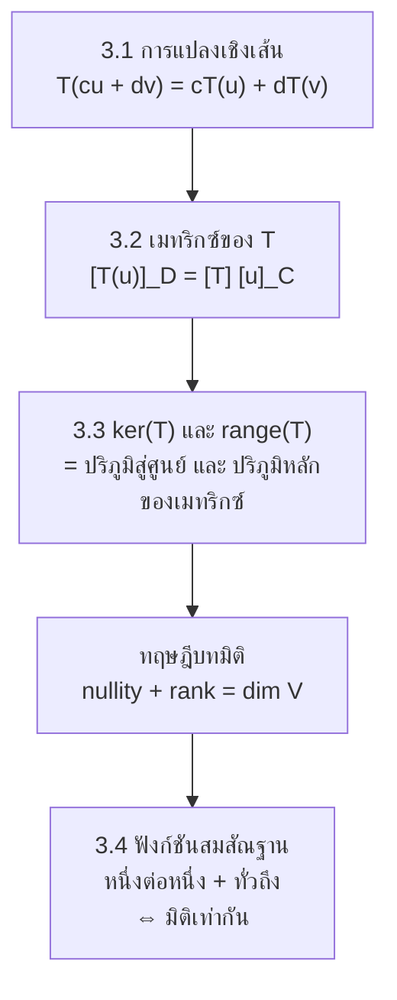

# บทที่ 3 การแปลงเชิงเส้น
*Linear Transformations — SC402101 พีชคณิตเชิงเส้น 1*

> [!info] ชุดสรุป 4 บท
> [[บทที่ 1 เมทริกซ์และระบบสมการเชิงเส้น]] → [[บทที่ 2 ปริภูมิเวกเตอร์]] → **บทที่ 3 การแปลงเชิงเส้น** (หน้านี้) → [[บทที่ 4 ค่าเจาะจงและเวกเตอร์เจาะจง]]

> [!abstract] อ่านบทนี้จบแล้วต้องทำอะไรได้
> 1. พิสูจน์หรือหักล้างว่าฟังก์ชันหนึ่งเป็นการแปลงเชิงเส้น
> 2. หาเมทริกซ์ $A$ ที่ $T(X)=AX$ และหาเมทริกซ์ $[T]^D_C$ เทียบฐานหลักลำดับใด ๆ รวมทั้งกู้สูตรของ $T$ กลับจากเมทริกซ์
> 3. หา $\ker(T)$, $\operatorname{range}(T)$, นัลลิติ, แรงค์ พร้อมฐานหลัก และตัดสินการเป็นหนึ่งต่อหนึ่ง/ทั่วถึง
> 4. ใช้ทฤษฎีบทมิติ $\operatorname{nullity}(T)+\operatorname{rank}(T)=\dim V$ ตัดสินเรื่องต่าง ๆ โดยไม่ต้องคำนวณ
> 5. ตัดสินและสร้างฟังก์ชันสมสัณฐานระหว่างปริภูมิเวกเตอร์

---

## 0. ภาพรวมของบท

บทที่ 2 ศึกษา "วัตถุ" (ปริภูมิเวกเตอร์) บทนี้ศึกษา "ฟังก์ชันระหว่างวัตถุ" ที่รักษาโครงสร้างไว้ ข้อค้นพบหลักมีสามข้อ

1. **การแปลงเชิงเส้นถูกกำหนดโดยค่าบนฐานหลัก** — รู้ $T(v_1),\dots,T(v_n)$ ก็รู้ $T$ ทั้งหมด
2. **เมื่อเลือกฐานหลักแล้ว การแปลงเชิงเส้นทุกตัวคือการคูณด้วยเมทริกซ์** — คำถามเรื่อง $T$ จึงกลับไปเป็นคำถามเรื่องระบบสมการของบทที่ 1
3. **มิติของโดเมนถูกแบ่งเป็นสองส่วน** — ส่วนที่ถูกบีบเป็นศูนย์ (เคอร์เนล) กับส่วนที่รอดเป็นภาพ (เรนจ์)

---

## 3.1 การแปลงเชิงเส้น

> [!note] นิยาม 3.1 — การแปลงเชิงเส้น
> ให้ $V,W$ เป็นปริภูมิเวกเตอร์เหนือ $\mathbb{R}$ ฟังก์ชัน $T:V\to W$ เป็น **การแปลงเชิงเส้น (linear transformation)** เมื่อ
> - **(L1)** $T(u+v)=T(u)+T(v)$ ทุก $u,v\in V$
> - **(L2)** $T(cu)=cT(u)$ ทุก $u\in V$, $c\in\mathbb{R}$

คำศัพท์ (หมายเหตุ 3.2): $V$ คือ **โดเมน**, $T(V)=\{T(v):v\in V\}\subseteq W$ คือ **เรนจ์**, $T(v)$ คือ **ภาพ** ของ $v$ ถ้า $V=W$ เรียก $T$ ว่า **ตัวดำเนินการเชิงเส้นบน $V$**

> [!important] ทฤษฎีบท 3.3 — เงื่อนไขเดียวจบ
> $T:V\to W$ เป็นการแปลงเชิงเส้น $\iff T(cu+dv)=cT(u)+dT(v)$ ทุก $u,v\in V$ และ $c,d\in\mathbb{R}$

**พิสูจน์** ($\Rightarrow$) $T(cu+dv)\overset{L1}{=}T(cu)+T(dv)\overset{L2}{=}cT(u)+dT(v)$  
($\Leftarrow$) แทน $c=d=1$ ได้ (L1) ; แทน $d=0$ ได้ $T(cu)=cT(u)+0\,T(v)=cT(u)$ คือ (L2) ∎

ผลที่ตามมาทันที (โดยอุปนัย): $T(c_1v_1+\cdots+c_kv_k)=c_1T(v_1)+\cdots+c_kT(v_k)$ — **$T$ สลับที่กับผลรวมเชิงเส้นได้**

> [!important] ทฤษฎีบท 3.4
> 1. ถ้า $T$ เป็นการแปลงเชิงเส้น แล้ว $T(\theta_V)=\theta_W$
> 2. ฟังก์ชันศูนย์ ($T(u)=\theta_W$ ทุก $u$) เป็นการแปลงเชิงเส้น

**พิสูจน์** (1) $T(\theta_V)=T(0\cdot\theta_V)=0\cdot T(\theta_V)=\theta_W$ (2) $T(cu+dv)=\theta_W=c\,\theta_W+d\,\theta_W=cT(u)+dT(v)$ ∎

### วิธีมาตรฐานและทริค

> [!important] แม่แบบการพิสูจน์ว่า $T$ เป็นการแปลงเชิงเส้น
> ให้ $u,v\in V$ (เขียนเป็นสมาชิกทั่วไป) และ $\alpha,\beta\in\mathbb{R}$ คำนวณ $T(\alpha u+\beta v)$ ตามสูตรของ $T$ แล้วจัดรูปให้ได้ $\alpha T(u)+\beta T(v)$

> [!tip] ทริคตัดสินเร็ว — ดูหน้าตาของสูตร
> **หักล้าง (ตอบว่าไม่เชิงเส้น) ไล่ตามลำดับนี้**
> 1. $T(\theta_V)\ne\theta_W$ → ไม่เชิงเส้น จบ (ข้อแย้งสลับของทฤษฎีบท 3.4) — ใช้ได้เมื่อมี **ค่าคงตัวบวกอยู่** เช่น $y+1$
> 2. ถ้า $T(\theta)=\theta$ แต่มีพจน์ไม่เชิงเส้น ($x^2$, $x^3$, $xy$, $\sin y$, $|x|$, $e^x$) → ลอง $T(2v)$ เทียบกับ $2T(v)$ ด้วย $v$ ง่าย ๆ เช่น $(1,1)$
>
> **ยืนยัน (ตอบว่าเชิงเส้น)**  
> ถ้าทุกส่วนประกอบของ $T(x_1,\dots,x_n)$ อยู่ในรูป $a_1x_1+\cdots+a_nx_n$ (ดีกรี 1 ล้วน ไม่มีค่าคงตัว) แล้ว $T(X)=AX$ และเป็นเชิงเส้นเสมอ เพราะ $A(\alpha u+\beta v)=\alpha Au+\beta Av$
>
> ⚠️ $T(\theta_V)=\theta_W$ เป็นเงื่อนไข **จำเป็น ไม่เพียงพอ** — ผ่านด่านนี้แล้วยังสรุปว่าเชิงเส้นไม่ได้ (ดูตัวอย่าง 3.16, 3.17)

![[SC402101-ch3-geometry.svg]]

> [!example] ตัวอย่าง 3.5
> $T:\mathbb{R}^2\to\mathbb{R}^2$, $T((x,y))=(5x,5y)$ เป็นการแปลงเชิงเส้นหรือไม่

ให้ $u=(a,b)$, $v=(c,d)$ และ $\alpha,\beta\in\mathbb{R}$
$$\begin{aligned}T(\alpha u+\beta v)&=T\big((\alpha a+\beta c,\ \alpha b+\beta d)\big)=\big(5(\alpha a+\beta c),\ 5(\alpha b+\beta d)\big)\\&=\alpha(5a,5b)+\beta(5c,5d)=\alpha T(u)+\beta T(v)\end{aligned}$$
**เป็นการแปลงเชิงเส้น** (คือ $T(v)=5v$ การขยาย 5 เท่า)

> [!example] ตัวอย่าง 3.6
> $T((x,y))=\left(\tfrac x2,\tfrac y2\right)$ เป็นการแปลงเชิงเส้นบน $\mathbb{R}^2$ หรือไม่

$$T(\alpha(a,b)+\beta(c,d))=\left(\tfrac{\alpha a+\beta c}{2},\tfrac{\alpha b+\beta d}{2}\right)=\alpha\left(\tfrac a2,\tfrac b2\right)+\beta\left(\tfrac c2,\tfrac d2\right)=\alpha T((a,b))+\beta T((c,d))$$
**เป็นการแปลงเชิงเส้น** (การหดตัวด้วย $k=\tfrac12$)

> [!example] ตัวอย่าง 3.7
> ให้ $k$ เป็นสเกลาร์ และ $T:V\to V$, $T(v)=kv$ เป็นการแปลงเชิงเส้นหรือไม่

$T(\alpha u+\beta v)=k(\alpha u+\beta v)=\alpha(ku)+\beta(kv)=\alpha T(u)+\beta T(v)$ — **เป็น** สำหรับปริภูมิ $V$ ใดก็ได้  
(หมายเหตุ 3.8) $k=1$ : ฟังก์ชันเอกลักษณ์ ; $k>1$ : **การขยายขนาด (dilation)** ; $0<k<1$ : **การหดตัว (contraction)**

> [!example] ตัวอย่าง 3.9 และ 3.10
> $T((x,y))=(x,0)$ และ $T((x,y))=(0,y)$ เป็นการแปลงเชิงเส้นบน $\mathbb{R}^2$ หรือไม่

$T(\alpha(a,b)+\beta(c,d))=(\alpha a+\beta c,\ 0)=\alpha(a,0)+\beta(c,0)=\alpha T((a,b))+\beta T((c,d))$ — **เป็น**  
ทำนองเดียวกัน $(0,\ \alpha b+\beta d)=\alpha(0,b)+\beta(0,d)$ — **เป็น**  
(หมายเหตุ 3.11) ตัวแรกคือ **การฉาย (projection) บนแกน $X$** ตัวที่สองคือการฉายบนแกน $Y$

> [!example] ตัวอย่าง 3.12 และ 3.13
> $T((x,y,z))=(x,y,0)$ และ $T((x,y,z))=(x,0,0)$ เป็นการแปลงเชิงเส้นบน $\mathbb{R}^3$ หรือไม่

ให้ $u=(a,b,c)$, $v=(x,y,z)$ : $T(\alpha u+\beta v)=(\alpha a+\beta x,\ \alpha b+\beta y,\ 0)=\alpha(a,b,0)+\beta(x,y,0)=\alpha T(u)+\beta T(v)$ — **เป็น** (การฉายบนระนาบ $XY$)  
และ $(\alpha a+\beta x,0,0)=\alpha(a,0,0)+\beta(x,0,0)$ — **เป็น** (การฉายบนแกน $X$) (หมายเหตุ 3.14)

> [!example] ตัวอย่าง 3.15
> $T((x,y))=(x,y+1)$ เป็นการแปลงเชิงเส้นหรือไม่

$T((0,0))=(0,1)\ne(0,0)$ โดยทฤษฎีบท 3.4 (1) — **ไม่เป็น**  
(ตัวอย่างค้านตรง ๆ: $T((1,0)+(0,1))=T((1,1))=(1,2)$ แต่ $T((1,0))+T((0,1))=(1,1)+(0,2)=(1,3)$)

> [!example] ตัวอย่าง 3.16
> $T((x,y))=(x^3,y)$ เป็นการแปลงเชิงเส้นหรือไม่

$T(2(1,1))=T((2,2))=(8,2)$ แต่ $2T((1,1))=2(1,1)=(2,2)$ ขัดกับ (L2) — **ไม่เป็น** (ทั้งที่ $T((0,0))=(0,0)$)

> [!example] ตัวอย่าง 3.17
> $T((x,y))=(x,\sin y)$ เป็นการแปลงเชิงเส้นหรือไม่

เลือก $u=v=\left(0,\tfrac\pi2\right)$ : $T(u+v)=T((0,\pi))=(0,\sin\pi)=(0,0)$ แต่ $T(u)+T(v)=(0,1)+(0,1)=(0,2)$ ขัดกับ (L1) — **ไม่เป็น**

> [!example] ตัวอย่าง 3.18
> $T:M_{2\times1}\to M_{3\times1}$, $T\left(\begin{bmatrix}x\\y\end{bmatrix}\right)=\begin{bmatrix}x-2y\\x+y\\3y\end{bmatrix}$ เป็นการแปลงเชิงเส้นหรือไม่

ให้ $\begin{bmatrix}x\\y\end{bmatrix},\begin{bmatrix}z\\w\end{bmatrix}\in M_{2\times1}$ และ $\alpha,\beta\in\mathbb{R}$
$$T\left(\alpha\begin{bmatrix}x\\y\end{bmatrix}+\beta\begin{bmatrix}z\\w\end{bmatrix}\right)=\begin{bmatrix}(\alpha x+\beta z)-2(\alpha y+\beta w)\\(\alpha x+\beta z)+(\alpha y+\beta w)\\3(\alpha y+\beta w)\end{bmatrix}=\alpha\begin{bmatrix}x-2y\\x+y\\3y\end{bmatrix}+\beta\begin{bmatrix}z-2w\\z+w\\3w\end{bmatrix}=\alpha T\left(\begin{bmatrix}x\\y\end{bmatrix}\right)+\beta T\left(\begin{bmatrix}z\\w\end{bmatrix}\right)$$
**เป็นการแปลงเชิงเส้น** — มองลัด: ทุกส่วนประกอบเป็นพหุนามดีกรี 1 ไม่มีค่าคงตัว คือ $T(X)=\begin{bmatrix}1&-2\\1&1\\0&3\end{bmatrix}X$

> [!example] Quiz #2 (จาก Lecture 7)
> $T:\mathbb{R}^2\to\mathbb{R}^3$, $T((a,b))=(-2a,\ a-3b,\ ab)$ เป็นการแปลงเชิงเส้นหรือไม่

มีพจน์ผลคูณ $ab$ จึงสงสัยว่าไม่เชิงเส้น ทดสอบ (L2): $T((1,1))=(-2,-2,1)$ จึง $2T((1,1))=(-4,-4,2)$ แต่ $T(2(1,1))=T((2,2))=(-4,-4,4)$ ไม่เท่ากัน — **ไม่เป็นการแปลงเชิงเส้น** (สังเกตว่า $T((0,0))=(0,0,0)$ ผ่านด่านแรก แต่ยังไม่เชิงเส้น)

---

## 3.2 เมทริกซ์ของการแปลงเชิงเส้น

### การแปลงเชิงเมทริกซ์

ถ้า $T:M_{n\times1}\to M_{m\times1}$ เป็นการแปลงเชิงเส้น จะมีเมทริกซ์ $A$ อันดับ $m\times n$ ที่ $T(u)=Au$ ทุก $u$ เรียก $T$ ว่า **การแปลงเชิงเมทริกซ์ (matrix transformation)**

> [!important] วิธีหา $A$ — สองวิธีที่ให้ผลเดียวกัน
> - **อ่านสัมประสิทธิ์:** แถวที่ $i$ ของ $A$ คือสัมประสิทธิ์ของ $x_1,\dots,x_n$ ในส่วนประกอบที่ $i$ ของ $T$
> - **ส่งฐานธรรมชาติ:** หลักที่ $j$ ของ $A$ คือ $T(e_j)$ — $A=\big[\,T(e_1)\ T(e_2)\ \cdots\ T(e_n)\,\big]$
>
> อันดับของ $A$ คือ **(มิติปลายทาง) × (มิติต้นทาง)**

> [!example] ตัวอย่าง 3.19, 3.20, 3.21
> จงหา $A$ ที่ $T(X)=AX$ เมื่อ  
> (3.19) $T\left(\begin{bmatrix}x_1\\x_2\end{bmatrix}\right)=\begin{bmatrix}x_1+x_2\\x_1-x_2\end{bmatrix}$ (3.20) $T\left(\begin{bmatrix}x_1\\x_2\end{bmatrix}\right)=\begin{bmatrix}x_1-x_2\\2x_2\\0\end{bmatrix}$ (3.21) $T\left(\begin{bmatrix}x_1\\x_2\\x_3\end{bmatrix}\right)=\begin{bmatrix}x_1+2x_2\\x_1-x_2+x_3\end{bmatrix}$

$$\text{(3.19) }A=\begin{bmatrix}1&1\\1&-1\end{bmatrix}\qquad\text{(3.20) }A=\begin{bmatrix}1&-1\\0&2\\0&0\end{bmatrix}\qquad\text{(3.21) }A=\begin{bmatrix}1&2&0\\1&-1&1\end{bmatrix}$$
ตรวจข้อ 3.20 ด้วยวิธีส่งฐาน: $T(e_1)=\begin{bmatrix}1\\0\\0\end{bmatrix}$ (หลักที่ 1), $T(e_2)=\begin{bmatrix}-1\\2\\0\end{bmatrix}$ (หลักที่ 2) ✓

> [!warning] จุดที่เอกสารพิมพ์คลาดเคลื่อน
> ต้นหัวข้อ 3.2 เอกสารเขียนรูปเมทริกซ์ของตัวอย่าง 3.18 ถูกต้องแล้วว่า $\begin{bmatrix}1&-2\\1&1\\0&3\end{bmatrix}$ แต่บรรทัดถัดมา "เมื่อ $A=\ldots$" พิมพ์เป็น $\begin{bmatrix}1&-1\\-1&0\\5&0\end{bmatrix}$ ซึ่งไม่ตรงกับ $T$ ตัวนี้ (ใน Lecture 7 อาจารย์แก้เป็น $\begin{bmatrix}1&-2\\1&1\\0&3\end{bmatrix}$)

### เมทริกซ์เทียบฐานหลักลำดับทั่วไป

ให้ $\dim V=n$, $\dim W=m$, $C=\{v_1,\dots,v_n\}$ เป็นฐานหลักลำดับของ $V$ และ $D=\{u_1,\dots,u_m\}$ เป็นฐานหลักลำดับของ $W$

> [!important] ทฤษฎีบท 3.22 (Matrix representation theorem) และ 3.24
> สำหรับการแปลงเชิงเส้น $T:V\to W$ มีเมทริกซ์ $A$ อันดับ $m\times n$ **เพียงตัวเดียว** ที่
> $$[T(u)]_D=A\,[u]_C\qquad(\forall u\in V)$$
> เรียกว่า **เมทริกซ์ของ $T$ เทียบฐานหลักลำดับ $C$ ไปยัง $D$** เขียนแทนด้วย $[T]^D_C$ และ
> $$[T]^D_C=\Big[\ [T(v_1)]_D\ \ [T(v_2)]_D\ \ \cdots\ \ [T(v_n)]_D\ \Big]$$
> กลับกัน เมทริกซ์ $m\times n$ ทุกตัวเป็น $[T]^D_C$ ของการแปลงเชิงเส้น $T$ เพียงตัวเดียว (เมื่อ $V=W$ และ $C=D$ เขียนสั้น ๆ ว่า $[T]_C$)

**ทำไมสูตรนี้ถูก** ถ้า $[u]_C=(c_1,\dots,c_n)^T$ คือ $u=\sum c_iv_i$ แล้ว $T(u)=\sum c_iT(v_i)$ (ความเป็นเชิงเส้นของ $T$) และ $[T(u)]_D=\sum c_i[T(v_i)]_D$ (ความเป็นเชิงเส้นของพิกัด ทฤษฎีบท 2.79) ซึ่งคือผลคูณของเมทริกซ์ที่มี $[T(v_i)]_D$ เป็นหลัก กับ $[u]_C$ ∎

$$\begin{array}{ccc}u\in V&\xrightarrow{\qquad T\qquad}&T(u)\in W\\[2pt]\Big\downarrow{\scriptstyle[\ \cdot\ ]_C}&&\Big\downarrow{\scriptstyle[\ \cdot\ ]_D}\\[2pt][u]_C\in M_{n\times1}&\xrightarrow{\quad[T]^D_C\quad}&[T(u)]_D\in M_{m\times1}\end{array}$$

ลูกศรล่างคือการคูณทางซ้ายด้วยเมทริกซ์ $[T]^D_C$ แผนภาพนี้บอกว่า **เดินทางบน (ใช้ $T$ ตรง ๆ) หรือเดินทางล่าง (แปลงเป็นพิกัด → คูณเมทริกซ์) ได้ผลตรงกัน**

> [!important] วิธีมาตรฐาน — หา $[T]^D_C$ (3 ขั้น)
> 1. หา $T(v_i)$ ของเวกเตอร์ทุกตัวในฐาน **ต้นทาง** $C$
> 2. หาพิกัด $[T(v_i)]_D$ เทียบฐาน **ปลายทาง** $D$
> 3. เรียงเป็น **หลัก** ตามลำดับ

> [!tip] ทางลัดเมื่อทำงานเป็นหลักตัวเลข
> ให้ $A$ เป็นเมทริกซ์มาตรฐานของ $T$ และ $M_C,M_D$ เป็นเมทริกซ์ที่มีเวกเตอร์ของ $C,D$ เป็นหลัก
> $$[T]^D_C=M_D^{-1}\,A\,M_C$$
> และคำนวณได้ในครั้งเดียวด้วยการลดรูป
> $$\big[\,M_D : AM_C\,\big]\sim\big[\,I : [T]^D_C\,\big]$$
> ($AM_C$ ก็คือเมทริกซ์ที่มี $T(v_i)$ เป็นหลัก) — ขั้นที่ 2 ของวิธีมาตรฐานสำหรับทุก $i$ ถูกทำพร้อมกันในการลดรูปครั้งเดียว  
> และกู้สูตรของ $T$ กลับได้ด้วย $A=M_D\,[T]^D_C\,M_C^{-1}$  
> อ่านจากขวาไปซ้าย: $M_C^{-1}$ แปลงเวกเตอร์เป็นพิกัดเทียบ $C$ → $[T]^D_C$ ทำงาน → $M_D$ แปลงพิกัดเทียบ $D$ กลับเป็นเวกเตอร์

> [!example] ตัวอย่าง 3.25
> ให้ $T:P_1\to P_2$, $T(p(x))=x\,p(x)+p(0)$ และ $C=\{x+1,\ x-1\}$, $D=\{x^2+1,\ x-1,\ x+1\}$  
> (1) จงหา $[T]^D_C$ (2) จงหา $T(-3x+3)$ โดยใช้เมทริกซ์จากข้อ 1

**(1) ขั้นที่ 1** $T(x+1)=x(x+1)+1=x^2+x+1$ และ $T(x-1)=x(x-1)+(-1)=x^2-x-1$  
**ขั้นที่ 2** หาพิกัดเทียบ $D$ : ตั้ง $a(x^2+1)+b(x-1)+c(x+1)=ax^2+(b+c)x+(a-b+c)$
- $x^2+x+1$ : $a=1$, $b+c=1$, $a-b+c=1\Rightarrow c-b=0$ จึง $b=c=\tfrac12$ → $[T(x+1)]_D=\left(1,\tfrac12,\tfrac12\right)^T$
- $x^2-x-1$ : $a=1$, $b+c=-1$, $c-b=-2$ จึง $c=-\tfrac32$, $b=\tfrac12$ → $[T(x-1)]_D=\left(1,\tfrac12,-\tfrac32\right)^T$

**ขั้นที่ 3**
$$[T]^D_C=\begin{bmatrix}1&1\\ \tfrac12&\tfrac12\\ \tfrac12&-\tfrac32\end{bmatrix}$$
ทางลัด: ทำสองระบบพร้อมกัน (แถวคือสัมประสิทธิ์ของ $x^2$, $x$, ค่าคงตัว)
$$
\begin{aligned}
{} & \left[\begin{array}{ccc|cc} 1 & 0 & 0 & 1 & 1 \\ 0 & 1 & 1 & 1 & -1 \\ 1 & -1 & 1 & 1 & -1 \end{array}\right] \\[4pt]
&\sim \left[\begin{array}{ccc|cc} 1 & 0 & 0 & 1 & 1 \\ 0 & 1 & 1 & 1 & -1 \\ 0 & -1 & 1 & 0 & -2 \end{array}\right] \quad \begin{array}{l} \scriptstyle R_3 - R_1 \to R_3 \end{array} \\[4pt]
&\sim \left[\begin{array}{ccc|cc} 1 & 0 & 0 & 1 & 1 \\ 0 & 1 & 1 & 1 & -1 \\ 0 & 0 & 2 & 1 & -3 \end{array}\right] \quad \begin{array}{l} \scriptstyle R_3 + R_2 \to R_3 \end{array} \\[4pt]
&\sim \left[\begin{array}{ccc|cc} 1 & 0 & 0 & 1 & 1 \\ 0 & 1 & 1 & 1 & -1 \\ 0 & 0 & 1 & \tfrac{1}{2} & -\tfrac{3}{2} \end{array}\right] \quad \begin{array}{l} \scriptstyle \tfrac{1}{2}R_3 \to R_3 \end{array} \\[4pt]
&\sim \left[\begin{array}{ccc|cc} 1 & 0 & 0 & 1 & 1 \\ 0 & 1 & 0 & \tfrac{1}{2} & \tfrac{1}{2} \\ 0 & 0 & 1 & \tfrac{1}{2} & -\tfrac{3}{2} \end{array}\right] \quad \begin{array}{l} \scriptstyle R_2 - R_3 \to R_2 \end{array}
\end{aligned}
$$
**(2)** $-3x+3=0(x+1)+(-3)(x-1)$ จึง $[-3x+3]_C=\begin{bmatrix}0\\-3\end{bmatrix}$
$$[T(-3x+3)]_D=[T]^D_C\begin{bmatrix}0\\-3\end{bmatrix}=\begin{bmatrix}-3\\-\tfrac32\\ \tfrac92\end{bmatrix}$$
$$T(-3x+3)=(-3)(x^2+1)+\left(-\tfrac32\right)(x-1)+\tfrac92(x+1)=-3x^2+3x+3$$
ตรวจด้วยสูตรตรง ๆ: $x(-3x+3)+3=-3x^2+3x+3$ ✓

> [!example] ตัวอย่าง 3.26
> ให้ $T:M_{2\times1}\to M_{3\times1}$ เป็นการแปลงเชิงเส้นที่ $[T]^D_C=A=\begin{bmatrix}0&0\\-3&6\\16&8\end{bmatrix}$ โดย $C=\left\{\begin{bmatrix}1\\3\end{bmatrix},\begin{bmatrix}-2\\4\end{bmatrix}\right\}$, $D=\left\{\begin{bmatrix}1\\1\\1\end{bmatrix},\begin{bmatrix}2\\2\\0\end{bmatrix},\begin{bmatrix}3\\0\\0\end{bmatrix}\right\}$ จงหา $T\left(\begin{bmatrix}x\\y\end{bmatrix}\right)$

เดินตามแผนภาพ: **เวกเตอร์ → พิกัดเทียบ $C$ → คูณ $A$ → แปลงพิกัดเทียบ $D$ กลับเป็นเวกเตอร์**  
**ขั้นที่ 1** หา $\left[\begin{smallmatrix}x\\y\end{smallmatrix}\right]_C$ : ตั้ง $\begin{bmatrix}x\\y\end{bmatrix}=a\begin{bmatrix}1\\3\end{bmatrix}+b\begin{bmatrix}-2\\4\end{bmatrix}$ คือ $a-2b=x$, $3a+4b=y$ ได้ $a=\tfrac{2x+y}{5}$, $b=\tfrac{y-3x}{10}$  
**ขั้นที่ 2** คูณด้วย $A$
$$\left[T\left(\begin{bmatrix}x\\y\end{bmatrix}\right)\right]_D=\begin{bmatrix}0&0\\-3&6\\16&8\end{bmatrix}\begin{bmatrix}\tfrac{2x+y}{5}\\ \tfrac{y-3x}{10}\end{bmatrix}=\begin{bmatrix}0\\-3x\\4x+4y\end{bmatrix}$$
(แถว 2: $-\tfrac{6x+3y}{5}+\tfrac{3y-9x}{5}=-3x$ ; แถว 3: $\tfrac{32x+16y}{5}+\tfrac{4y-12x}{5}=4x+4y$)  
**ขั้นที่ 3** แปลงกลับด้วยฐาน $D$
$$T\left(\begin{bmatrix}x\\y\end{bmatrix}\right)=0\begin{bmatrix}1\\1\\1\end{bmatrix}+(-3x)\begin{bmatrix}2\\2\\0\end{bmatrix}+(4x+4y)\begin{bmatrix}3\\0\\0\end{bmatrix}=\begin{bmatrix}6x+12y\\-6x\\0\end{bmatrix}$$

> [!tip] ทางลัดของข้อ 3.26 — ไม่ต้องแบกตัวแปร $x,y$
> หลักของ $M_DA$ คือ $T$ ของเวกเตอร์ในฐาน $C$ :
> $$M_DA=\begin{bmatrix}1&2&3\\1&2&0\\1&0&0\end{bmatrix}\begin{bmatrix}0&0\\-3&6\\16&8\end{bmatrix}=\begin{bmatrix}42&36\\-6&12\\0&0\end{bmatrix}\quad\Rightarrow\quad T\begin{bmatrix}1\\3\end{bmatrix}=\begin{bmatrix}42\\-6\\0\end{bmatrix},\ \ T\begin{bmatrix}-2\\4\end{bmatrix}=\begin{bmatrix}36\\12\\0\end{bmatrix}$$
> แล้วเมทริกซ์มาตรฐานคือ $M_DA\,M_C^{-1}=\begin{bmatrix}42&36\\-6&12\\0&0\end{bmatrix}\cdot\dfrac1{10}\begin{bmatrix}4&2\\-3&1\end{bmatrix}=\begin{bmatrix}6&12\\-6&0\\0&0\end{bmatrix}$ ได้คำตอบเดียวกัน  
> ตรวจ: $T\begin{bmatrix}1\\3\end{bmatrix}=\begin{bmatrix}6+36\\-6\\0\end{bmatrix}=\begin{bmatrix}42\\-6\\0\end{bmatrix}$ ✓

> [!note] หมายเหตุ 3.27 — เมทริกซ์ตัวแทนฐานมาตรฐาน
> ถ้า $T:M_{n\times1}\to M_{m\times1}$ และใช้ฐานหลักธรรมชาติ $E_n$, $E_m$ จะได้ $[u]_{E_n}=u$ และ $[T(u)]_{E_m}=T(u)$ สมการ $[T(u)]_{E_m}=A[u]_{E_n}$ จึงกลายเป็น $T(u)=Au$ — เมทริกซ์ $[T]^{E_m}_{E_n}$ คือเมทริกซ์ $A$ ของการแปลงเชิงเมทริกซ์นั่นเอง เรียกว่า **เมทริกซ์ตัวแทนฐานมาตรฐานของ $T$**

> [!example] ตัวอย่าง 3.28
> $T\left(\begin{bmatrix}x_1\\x_2\\x_3\end{bmatrix}\right)=\begin{bmatrix}x_1+x_2\\x_2-x_3\end{bmatrix}$ จงหาเมทริกซ์ของ $T$ เทียบฐานหลักธรรมชาติ $E_3$ ไปยัง $E_2$

$T(e_1)=\begin{bmatrix}1\\0\end{bmatrix}$, $T(e_2)=\begin{bmatrix}1\\1\end{bmatrix}$, $T(e_3)=\begin{bmatrix}0\\-1\end{bmatrix}$ และพิกัดเทียบ $E_2$ คือตัวมันเอง จึง
$$[T]^{E_2}_{E_3}=\begin{bmatrix}1&1&0\\0&1&-1\end{bmatrix}$$

> [!example] ตัวอย่าง 3.29
> ให้ $T:M_{2\times2}\to M_{2\times2}$, $T(A)=A^T$ และ $E=\{E_{11},E_{12},E_{21},E_{22}\}$, $S=\{E_{11},E_{22},E_{12},E_{21}\}$ โดย $E_{ij}$ คือเมทริกซ์ที่ตำแหน่ง $(i,j)$ เป็น 1 ที่เหลือเป็น 0 จงหา (1) $[T]_E$ (2) $[T]^S_E$ (3) $[T]^E_S$ (4) $[T]_S$

$T$ ส่ง $E_{11}\mapsto E_{11}$, $E_{12}\mapsto E_{21}$, $E_{21}\mapsto E_{12}$, $E_{22}\mapsto E_{22}$ ที่เหลือคือ "อ่านพิกัดให้ถูกลำดับ"

| เวกเตอร์ | พิกัดเทียบ $E$ (ลำดับ $E_{11},E_{12},E_{21},E_{22}$) | พิกัดเทียบ $S$ (ลำดับ $E_{11},E_{22},E_{12},E_{21}$) |
|---|---|---|
| $E_{11}$ | $(1,0,0,0)$ | $(1,0,0,0)$ |
| $E_{12}$ | $(0,1,0,0)$ | $(0,0,1,0)$ |
| $E_{21}$ | $(0,0,1,0)$ | $(0,0,0,1)$ |
| $E_{22}$ | $(0,0,0,1)$ | $(0,1,0,0)$ |

**(1)** ต้นทาง $E$ ปลายทาง $E$ : หลักคือ $[E_{11}]_E,[E_{21}]_E,[E_{12}]_E,[E_{22}]_E$  
**(2)** ต้นทาง $E$ ปลายทาง $S$ : หลักคือ $[E_{11}]_S,[E_{21}]_S,[E_{12}]_S,[E_{22}]_S$  
**(3)** ต้นทาง $S$ ปลายทาง $E$ : หลักคือ $[T(E_{11})]_E,[T(E_{22})]_E,[T(E_{12})]_E,[T(E_{21})]_E=[E_{11}]_E,[E_{22}]_E,[E_{21}]_E,[E_{12}]_E$  
**(4)** ต้นทาง $S$ ปลายทาง $S$ : หลักคือ $[E_{11}]_S,[E_{22}]_S,[E_{21}]_S,[E_{12}]_S$
$$[T]_E=\begin{bmatrix}1&0&0&0\\0&0&1&0\\0&1&0&0\\0&0&0&1\end{bmatrix},\quad[T]^S_E=\begin{bmatrix}1&0&0&0\\0&0&0&1\\0&0&1&0\\0&1&0&0\end{bmatrix},\quad[T]^E_S=\begin{bmatrix}1&0&0&0\\0&0&0&1\\0&0&1&0\\0&1&0&0\end{bmatrix},\quad[T]_S=\begin{bmatrix}1&0&0&0\\0&1&0&0\\0&0&0&1\\0&0&1&0\end{bmatrix}$$

> [!tip] ข้อสังเกตจาก 3.29
> - การแปลงตัวเดียวกันมีเมทริกซ์ได้หลายหน้าตา ขึ้นกับฐานหลักที่เลือก (และลำดับ) — **เมทริกซ์ไม่ใช่ตัวการแปลง เป็นเพียง "ภาพถ่าย" จากมุมหนึ่ง**
> - เปลี่ยนลำดับฐาน **ปลายทาง** = สลับ **แถว** ; เปลี่ยนลำดับฐาน **ต้นทาง** = สลับ **หลัก**
> - ใน $[T]_S$ บล็อกซ้ายบนเป็น $I_2$ : $E_{11},E_{22}$ ถูกตรึงอยู่กับที่ — การเลือกฐานที่เหมาะทำให้เมทริกซ์อ่านง่าย นี่คือแรงจูงใจของการทำให้เป็นเมทริกซ์ทแยงมุมใน [[บทที่ 4 ค่าเจาะจงและเวกเตอร์เจาะจง]]

---

## 3.3 เคอร์เนลและภาพของการแปลงเชิงเส้น

### ฟังก์ชันหนึ่งต่อหนึ่งและเคอร์เนล

> [!note] นิยาม 3.30 และ 3.34
> - $T:V\to W$ เป็น **ฟังก์ชันหนึ่งต่อหนึ่ง (one-to-one)** ถ้า $T(u)=T(v)\Rightarrow u=v$
> - **เคอร์เนล (kernel)** ของการแปลงเชิงเส้น $T$ คือ
> $$\ker(T)=\{u\in V:T(u)=0_W\}$$
> เซตของเวกเตอร์ในโดเมนที่ถูกส่งไปยังเวกเตอร์ศูนย์ (ไม่เป็นเซตว่างเสมอ เพราะ $0_V\in\ker(T)$)

> [!important] ทฤษฎีบท 3.37 และ 3.39
> ให้ $T:V\to W$ เป็นการแปลงเชิงเส้น
> - $\ker(T)$ เป็น **ปริภูมิย่อย** ของ $V$
> - $T$ เป็นหนึ่งต่อหนึ่ง $\iff\ker(T)=\{0_V\}$

**พิสูจน์ 3.37** $0_V\in\ker(T)$ และถ้า $u,v\in\ker(T)$ แล้ว $T(au+bv)=aT(u)+bT(v)=a\,0_W+b\,0_W=0_W$ จึง $au+bv\in\ker(T)$ ∎  
**พิสูจน์ 3.39** ($\Rightarrow$) ถ้า $u\in\ker(T)$ แล้ว $T(u)=0_W=T(0_V)$ ความเป็นหนึ่งต่อหนึ่งให้ $u=0_V$  
($\Leftarrow$) ถ้า $T(u)=T(v)$ แล้ว $T(u-v)=T(u)-T(v)=0_W$ จึง $u-v\in\ker(T)=\{0_V\}$ คือ $u=v$ ∎

> [!tip] ทำไมทฤษฎีบท 3.39 จึงทรงพลัง
> การตรวจหนึ่งต่อหนึ่งตามนิยามต้องเทียบ "ทุกคู่" $u,v$ แต่สำหรับการแปลงเชิงเส้น **ตรวจแค่ว่ามีอะไรถูกส่งไป $0$ บ้างก็พอ** — กลายเป็นการแก้ระบบเอกพันธ์ระบบเดียว

> [!example] ตัวอย่าง 3.31, 3.32, 3.33 — ตรวจหนึ่งต่อหนึ่งตามนิยาม
> (3.31) $T\left(\begin{bmatrix}x_1\\x_2\end{bmatrix}\right)=\begin{bmatrix}x_1+x_2\\x_1-x_2\end{bmatrix}$ (3.32) $T\left(\begin{bmatrix}x_1\\x_2\end{bmatrix}\right)=\begin{bmatrix}x_1\\x_2\\0\end{bmatrix}$ (3.33) $T\left(\begin{bmatrix}x_1\\x_2\\x_3\end{bmatrix}\right)=\begin{bmatrix}x_1\\x_2\end{bmatrix}$

- **3.31** สมมติ $T\left(\begin{bmatrix}a\\b\end{bmatrix}\right)=T\left(\begin{bmatrix}c\\d\end{bmatrix}\right)$ จะได้ $a+b=c+d$ และ $a-b=c-d$ บวกกัน: $a=c$ ลบกัน: $b=d$ — **หนึ่งต่อหนึ่ง**
- **3.32** $\begin{bmatrix}a\\b\\0\end{bmatrix}=\begin{bmatrix}c\\d\\0\end{bmatrix}\Rightarrow a=c,\ b=d$ — **หนึ่งต่อหนึ่ง**
- **3.33** $T\left(\begin{bmatrix}1\\1\\0\end{bmatrix}\right)=\begin{bmatrix}1\\1\end{bmatrix}=T\left(\begin{bmatrix}1\\1\\1\end{bmatrix}\right)$ ทั้งที่สองเวกเตอร์ต่างกัน — **ไม่หนึ่งต่อหนึ่ง**

> [!example] ตัวอย่าง 3.36
> $T:M_{3\times1}\to M_{2\times1}$, $T\left(\begin{bmatrix}x_1\\x_2\\x_3\end{bmatrix}\right)=\begin{bmatrix}x_1\\x_2\end{bmatrix}$ จงหา $\ker(T)$

$$\ker(T)=\left\{\begin{bmatrix}x\\y\\z\end{bmatrix}:\begin{bmatrix}x\\y\end{bmatrix}=\begin{bmatrix}0\\0\end{bmatrix}\right\}=\left\{\begin{bmatrix}0\\0\\z\end{bmatrix}:z\in\mathbb{R}\right\}=\operatorname{span}\left\{\begin{bmatrix}0\\0\\1\end{bmatrix}\right\}$$
(แกน $Z$ ทั้งเส้นถูกบีบลงเป็นจุดกำเนิด — สอดคล้องกับ 3.33 ที่ว่าไม่หนึ่งต่อหนึ่ง)

> [!example] ตัวอย่าง 3.38
> $T:M_{4\times1}\to M_{2\times1}$, $T\left(\begin{bmatrix}x_1\\x_2\\x_3\\x_4\end{bmatrix}\right)=\begin{bmatrix}x_1+x_2\\x_3+x_4\end{bmatrix}$ จงหา $\ker(T)$ และ $\dim(\ker(T))$

เงื่อนไข $x_1+x_2=0$ และ $x_3+x_4=0$ คือ $x_2=-x_1$, $x_4=-x_3$ ให้ $x_1=s$, $x_3=t$
$$\ker(T)=\left\{\begin{bmatrix}s\\-s\\t\\-t\end{bmatrix}\right\}=\left\{s\begin{bmatrix}1\\-1\\0\\0\end{bmatrix}+t\begin{bmatrix}0\\0\\1\\-1\end{bmatrix}:s,t\in\mathbb{R}\right\}=\operatorname{span}\left\{\begin{bmatrix}1\\-1\\0\\0\end{bmatrix},\begin{bmatrix}0\\0\\1\\-1\end{bmatrix}\right\}$$
สองเวกเตอร์นี้แผ่ทั่ว $\ker(T)$ และอิสระเชิงเส้น (ถ้า $s(1,-1,0,0)+t(0,0,1,-1)=0$ แล้ว $s=t=0$) จึงเป็นฐานหลัก และ $\dim(\ker(T))=2$

> [!example] ตัวอย่าง 3.40
> $T\left(\begin{bmatrix}x_1\\x_2\end{bmatrix}\right)=\begin{bmatrix}x_1+x_2\\x_1-x_2\end{bmatrix}$ จงหา $\ker(T)$ และตรวจว่าหนึ่งต่อหนึ่งหรือไม่

$x+y=0$ และ $x-y=0$ ให้ $x=0=y$ จึง $\ker(T)=\left\{\begin{bmatrix}0\\0\end{bmatrix}\right\}$ โดยทฤษฎีบท 3.39 — **หนึ่งต่อหนึ่ง** (สั้นกว่าวิธีตามนิยามใน 3.31)

### ภาพ เรนจ์ และฟังก์ชันทั่วถึง

> [!note] นิยาม 3.41 และ 3.44
> ให้ $T:V\to W$ เป็นการแปลงเชิงเส้น และ $S\subseteq V$
> - **ภาพ (image)** ของ $S$ : $T(S)=\{T(v):v\in S\}$
> - **เรนจ์ (range)** : $\operatorname{range}(T)=T(V)$
> - $T$ เป็น **ฟังก์ชันทั่วถึง (onto)** ถ้า $\operatorname{range}(T)=W$ (ทุก $w\in W$ มี $v\in V$ ที่ $T(v)=w$)
> - **นัลลิติ** $\operatorname{nullity}(T)=\dim\ker(T)$ และ **แรงค์** $\operatorname{rank}(T)=\dim\operatorname{range}(T)$ (ถ้า $\ker(T)=\{0_V\}$ กำหนด $\operatorname{nullity}(T)=0$)

**ทฤษฎีบท 3.43** ถ้า $S$ เป็นปริภูมิย่อยของ $V$ แล้ว $T(S)$ เป็นปริภูมิย่อยของ $W$ โดยเฉพาะ $\operatorname{range}(T)$ เป็นปริภูมิย่อยของ $W$  
(เหตุผล: $aT(u)+bT(v)=T(au+bv)$ และ $au+bv\in S$)

![[SC402101-ch3-kernel-range.svg]]

> [!important] ทฤษฎีบท 3.46 — ทฤษฎีบทมิติ (Dimension Theorem / Rank–Nullity)
> ถ้า $T:V\to W$ เป็นการแปลงเชิงเส้น และ $V$ มีมิติจำกัด แล้ว
> $$\operatorname{nullity}(T)+\operatorname{rank}(T)=\dim(V)$$

**แนวคิดของบทพิสูจน์** เลือกฐานหลัก $\{k_1,\dots,k_p\}$ ของ $\ker(T)$ แล้วเติมเวกเตอร์ $\{v_1,\dots,v_q\}$ จนเป็นฐานหลักของ $V$ ($p+q=\dim V$) จะพิสูจน์ได้ว่า $\{T(v_1),\dots,T(v_q)\}$ เป็นฐานหลักของ $\operatorname{range}(T)$ : แผ่ทั่วเพราะ $T(k_i)=0$ จึงเหลือแต่ $T(v_j)$ ; อิสระเพราะถ้า $\sum c_jT(v_j)=0$ แล้ว $\sum c_jv_j\in\ker(T)$ ซึ่งขัดกับความเป็นอิสระของฐานหลัก นอกจาก $c_j=0$ ทุกตัว ∎

> [!important] ทฤษฎีบท 3.47 และ 3.49
> ให้ $V$ มีมิติจำกัด และ $S$ เป็นฐานหลักของ $V$
> 1. $\operatorname{range}(T)=\operatorname{span}(T(S))$ — **ภาพของฐานหลักแผ่ทั่วเรนจ์**
> 2. $\operatorname{rank}(T)\le\dim(W)$
> 3. $T$ หนึ่งต่อหนึ่ง $\iff T(S)$ เป็นฐานหลักของ $\operatorname{range}(T)$
> 4. $T$ หนึ่งต่อหนึ่ง $\iff\operatorname{rank}(T)=\dim(V)$
> 5. $\operatorname{rank}(T)=\dim(W)\Rightarrow\operatorname{range}(T)=W$ คือ $T$ ทั่วถึง
>
> **(3.49)** ถ้า $\dim V=\dim W$ แล้ว $T$ หนึ่งต่อหนึ่ง $\iff T$ ทั่วถึง

### วิธีมาตรฐานและทริค

> [!important] สูตรสำเร็จ — เมื่อ $T(X)=AX$ โดย $A$ เป็น $m\times n$ (หรือ $A=[T]^D_C$)
> ลดรูป $A$ เป็นขั้นบันได ให้ $r$ = จำนวน 1 ตัวนำ
>
> | สิ่งที่ต้องการ | อ่านจาก |
> |---|---|
> | $\ker(T)$ | ผลเฉลยของ $AX=0$ (ปริภูมิสู่ศูนย์ของ $A$) |
> | $\operatorname{nullity}(T)$ | จำนวนตัวแปรอิสระ $=n-r$ |
> | $\operatorname{range}(T)$ | $\operatorname{span}$ ของหลักของ $A$ (หลักของ $A$ คือ $T(e_j)$) |
> | ฐานหลักของ $\operatorname{range}(T)$ | หลักของ $A$ **ตัวเดิม** ที่ตรงกับตำแหน่ง 1 ตัวนำ |
> | $\operatorname{rank}(T)$ | $r$ |
> | หนึ่งต่อหนึ่ง | $r=n$ (ตัวนำครบทุก **หลัก**) |
> | ทั่วถึง | $r=m$ (ตัวนำครบทุก **แถว**) |

> [!tip] ทริคนับมิติ — ตอบได้ก่อนคำนวณ
> ให้ $T:V\to W$, $\dim V=n$, $\dim W=m$
> - $n>m$ ("บีบจากใหญ่ไปเล็ก") → **ไม่มีทางหนึ่งต่อหนึ่ง** เพราะ $\operatorname{nullity}=n-\operatorname{rank}\ge n-m>0$
> - $n<m$ ("ยัดจากเล็กไปใหญ่") → **ไม่มีทางทั่วถึง** เพราะ $\operatorname{rank}\le n<m$
> - $n=m$ → หนึ่งต่อหนึ่ง $\iff$ ทั่วถึง $\iff\det A\ne0$ ตรวจอย่างเดียวพอ
> - หาอย่างใดอย่างหนึ่งระหว่าง nullity กับ rank แล้วอีกตัวได้จากการลบ **ไม่ต้องคำนวณสองรอบ**

> [!example] ตัวอย่าง 3.42
> $T\left(\begin{bmatrix}x_1\\x_2\\x_3\end{bmatrix}\right)=\begin{bmatrix}x_1\\x_2\end{bmatrix}$ เป็นฟังก์ชันจาก $M_{3\times1}$ ไปทั่วถึง $M_{2\times1}$ หรือไม่

ให้ $\begin{bmatrix}a\\b\end{bmatrix}\in M_{2\times1}$ ใด ๆ เลือก $\begin{bmatrix}a\\b\\0\end{bmatrix}\in M_{3\times1}$ จะได้ $T\left(\begin{bmatrix}a\\b\\0\end{bmatrix}\right)=\begin{bmatrix}a\\b\end{bmatrix}$ — **ทั่วถึง**  
(หรือ: $\operatorname{nullity}=1$ จากตัวอย่าง 3.36 จึง $\operatorname{rank}=3-1=2=\dim M_{2\times1}$)

> [!example] ตัวอย่าง 3.48
> $T:M_{4\times1}\to M_{3\times1}$, $T\left(\begin{bmatrix}x_1\\x_2\\x_3\\x_4\end{bmatrix}\right)=\begin{bmatrix}x_1+x_2\\x_3+x_4\\x_1+x_3\end{bmatrix}$  
> (1) หาฐานหลักของ $\ker(T)$, $\operatorname{nullity}(T)$ และตรวจหนึ่งต่อหนึ่ง (2) หาฐานหลักของ $\operatorname{range}(T)$, $\operatorname{rank}(T)$ และตรวจทั่วถึง

เมทริกซ์มาตรฐานคือ $A=\begin{bmatrix}1&1&0&0\\0&0&1&1\\1&0&1&0\end{bmatrix}$
$$
\begin{aligned}
A &= \begin{bmatrix} 1 & 1 & 0 & 0 \\ 0 & 0 & 1 & 1 \\ 1 & 0 & 1 & 0 \end{bmatrix} \\[4pt]
&\sim \begin{bmatrix} 1 & 1 & 0 & 0 \\ 0 & 0 & 1 & 1 \\ 0 & -1 & 1 & 0 \end{bmatrix} \quad \begin{array}{l} \scriptstyle R_3 - R_1 \to R_3 \end{array} \\[4pt]
&\sim \begin{bmatrix} 1 & 1 & 0 & 0 \\ 0 & -1 & 1 & 0 \\ 0 & 0 & 1 & 1 \end{bmatrix} \quad \begin{array}{l} \scriptstyle R_2 \leftrightarrow R_3 \end{array} \\[4pt]
&\sim \begin{bmatrix} 1 & 1 & 0 & 0 \\ 0 & 1 & -1 & 0 \\ 0 & 0 & 1 & 1 \end{bmatrix} \quad \begin{array}{l} \scriptstyle -R_2 \to R_2 \end{array} \\[4pt]
&\sim \begin{bmatrix} 1 & 0 & 1 & 0 \\ 0 & 1 & -1 & 0 \\ 0 & 0 & 1 & 1 \end{bmatrix} \quad \begin{array}{l} \scriptstyle R_1 - R_2 \to R_1 \end{array} \\[4pt]
&\sim \begin{bmatrix} 1 & 0 & 0 & -1 \\ 0 & 1 & 0 & 1 \\ 0 & 0 & 1 & 1 \end{bmatrix} \quad \begin{array}{l} \scriptstyle R_1 - R_3 \to R_1 \\ \scriptstyle R_2 + R_3 \to R_2 \end{array}
\end{aligned}
$$
**(1)** $x_4=t$ เป็นตัวแปรอิสระ: $x_1=t$, $x_2=-t$, $x_3=-t$
$$\ker(T)=\operatorname{span}\left\{\begin{bmatrix}1\\-1\\-1\\1\end{bmatrix}\right\},\qquad\operatorname{nullity}(T)=1\ne0$$
จึง **$T$ ไม่หนึ่งต่อหนึ่ง**  
(ทางตรง: $x_2=-x_1$, $x_3=-x_1$, $x_4=-x_3=x_1$)  
**(2)** โดยทฤษฎีบทมิติ $\operatorname{rank}(T)=4-1=3=\dim M_{3\times1}$ จึง $\operatorname{range}(T)=M_{3\times1}$ — **$T$ ทั่วถึง**  
ฐานหลักของเรนจ์: หลักที่ 1, 2, 3 ของ $A$ (ตำแหน่ง 1 ตัวนำ) คือ $\left\{\begin{bmatrix}1\\0\\1\end{bmatrix},\begin{bmatrix}1\\0\\0\end{bmatrix},\begin{bmatrix}0\\1\\1\end{bmatrix}\right\}$ — หรือจะตอบฐานหลักธรรมชาติของ $M_{3\times1}$ ก็ได้ เพราะเรนจ์คือทั้งปริภูมิ

**วิธีในคาบ (Lecture 8):** ใช้ทฤษฎีบท 3.47 ข้อ 1 กับฐานธรรมชาติ $S=\{e_1,e_2,e_3,e_4\}$
$$\operatorname{range}(T)=\operatorname{span}\{T(e_1),T(e_2),T(e_3),T(e_4)\}=\operatorname{span}\left\{\begin{bmatrix}1\\0\\1\end{bmatrix},\begin{bmatrix}1\\0\\0\end{bmatrix},\begin{bmatrix}0\\1\\1\end{bmatrix},\begin{bmatrix}0\\1\\0\end{bmatrix}\right\}$$
มี 4 ตัวแต่ $\operatorname{rank}=3$ จึงต้องตัดตัวซ้ำซ้อนออก 1 ตัว เวกเตอร์ในเคอร์เนล $(1,-1,-1,1)$ บอกความสัมพันธ์ $T(e_1)-T(e_2)-T(e_3)+T(e_4)=0$ จึงตัด $T(e_4)$ ออกได้ เหลือสามตัวที่อิสระเชิงเส้น ($\det=1\ne0$) เป็นฐานหลักของเรนจ์

> [!tip] ข้อสังเกตลึก — เวกเตอร์ในเคอร์เนลคือ "สูตรความสัมพันธ์ระหว่างหลักของ $A$"
> $AX=0$ แปลว่า $x_1\mathbf{a}_1+\cdots+x_n\mathbf{a}_n=0$ เมื่อ $\mathbf{a}_j$ คือหลักที่ $j$ ของ $A$ ดังนั้นหลักของ $A$ อิสระเชิงเส้น $\iff\ker=\{0\}$ $\iff T$ หนึ่งต่อหนึ่ง — เรื่องเดียวกันพูดสามภาษา

> [!example] ตัวอย่าง 3.50
> $T:\mathbb{R}^2\to\mathbb{R}^2$, $T(x,y)=\left(\tfrac x2,\tfrac y2\right)$ เป็นหนึ่งต่อหนึ่งและทั่วถึงหรือไม่

$\ker(T)=\{(x,y):\left(\tfrac x2,\tfrac y2\right)=(0,0)\}=\{(0,0)\}$ จึง **หนึ่งต่อหนึ่ง** และเนื่องจาก $\dim\mathbb{R}^2=\dim\mathbb{R}^2$ โดยทฤษฎีบท 3.49 จึง **ทั่วถึง** ด้วย

> [!example] ตัวอย่าง 3.51
> $T:P_2\to P_2$, $T(ax^2+bx+c)=(a+2b)x+(b+c)$  
> (1) หาฐานหลักของ $\ker(T)$ และตรวจหนึ่งต่อหนึ่ง (2) หาฐานหลักของ $\operatorname{range}(T)$ และตรวจทั่วถึง

**(1)** $T(ax^2+bx+c)=0$ (พหุนามศูนย์) $\iff a+2b=0$ และ $b+c=0$ $\iff a=-2b$, $c=-b$
$$\ker(T)=\{-2bx^2+bx-b:b\in\mathbb{R}\}=\operatorname{span}\{-2x^2+x-1\}$$
ฐานหลักคือ $\{-2x^2+x-1\}$, $\operatorname{nullity}(T)=1\ne0$ — **ไม่หนึ่งต่อหนึ่ง** และเพราะ $\dim P_2=\dim P_2$ โดยทฤษฎีบท 3.49 จึง **ไม่ทั่วถึง** ด้วย  
**(2)** ใช้ฐานธรรมชาติ $S=\{1,x,x^2\}$ : $T(1)=1$, $T(x)=2x+1$, $T(x^2)=x$
$$\operatorname{range}(T)=\operatorname{span}\{1,\ 2x+1,\ x\}$$
โดยทฤษฎีบทมิติ $\operatorname{rank}(T)=3-1=2$ จึงต้องตัดออก 1 ตัว: $2x+1=2(x)+1(1)$ ซ้ำซ้อน เหลือ $\{1,x\}$ ซึ่งอิสระเชิงเส้น  
ฐานหลักของ $\operatorname{range}(T)$ คือ $\{1,x\}$ ($\operatorname{range}(T)=P_1$), $\operatorname{rank}(T)=2\ne3=\dim P_2$ — **ไม่ทั่วถึง**

---

## 3.4 ฟังก์ชันสมสัณฐาน

> [!note] นิยาม 3.52 — ฟังก์ชันสมสัณฐาน
> การแปลงเชิงเส้น $T:V\to W$ ที่ **หนึ่งต่อหนึ่ง** และ **ทั่วถึง** เรียกว่า **ฟังก์ชันสมสัณฐาน (isomorphism)** และกล่าวว่า $V$ **สมสัณฐาน (isomorphic)** กับ $W$ เขียน $V\cong W$ ถ้ามีฟังก์ชันสมสัณฐานจาก $V$ ไปทั่วถึง $W$

**ความหมาย:** $V$ กับ $W$ เป็น "ปริภูมิเดียวกันที่เรียกชื่อสมาชิกต่างกัน" — บวกใน $V$ แล้วค่อยแปลง ได้เท่ากับแปลงแล้วค่อยบวกใน $W$ ; ข้อความเชิงพีชคณิตเชิงเส้นใดจริงใน $V$ ก็จริงใน $W$ (อิสระ ↔ อิสระ, ฐานหลัก ↔ ฐานหลัก, มิติเท่ากัน)

**หมายเหตุ 3.54** การสมสัณฐานเป็นความสัมพันธ์สมมูล: (1) $V\cong V$ (ใช้ฟังก์ชันเอกลักษณ์) (2) $V_1\cong V_2\Rightarrow V_2\cong V_1$ (ใช้ฟังก์ชันผกผัน) (3) $V_1\cong V_2$ และ $V_2\cong V_3\Rightarrow V_1\cong V_3$ (ใช้ฟังก์ชันประกอบ)

> [!important] ทฤษฎีบท 3.55 และ 3.56 — มิติคือสิ่งเดียวที่ต้องดู
> - ทุกปริภูมิเวกเตอร์มิติ $n$ สมสัณฐานกับ $M_{n\times1}$ (ผ่านฟังก์ชันพิกัด $u\mapsto[u]_B$)
> - สำหรับ $V,W$ มิติจำกัด: $V\cong W\iff\dim V=\dim W$

ตัวอย่างผลที่ตามมา: $\mathbb{R}^3\cong P_2\cong M_{3\times1}$ และ $\mathbb{R}^4\cong P_3\cong M_{2\times2}\cong M_{4\times1}$ แต่ $P_2\not\cong M_{2\times2}$ (มิติ 3 กับ 4)

> [!important] วิธีมาตรฐาน
> **ตรวจว่า $T$ ที่ให้มาเป็นฟังก์ชันสมสัณฐาน:** (1) เชิงเส้น (2) $\ker(T)=\{0_V\}$ (3) ถ้า $\dim V=\dim W$ ได้ทั่วถึงฟรีจากทฤษฎีบท 3.49 — ถ้ามิติไม่เท่ากัน ตอบ "ไม่เป็น" ได้ทันที  
> **สร้างฟังก์ชันสมสัณฐาน $V\to W$:** เลือกฐานหลัก $\{v_1,\dots,v_n\}$ ของ $V$ และ $\{w_1,\dots,w_n\}$ ของ $W$ แล้วกำหนด $T(c_1v_1+\cdots+c_nv_n)=c_1w_1+\cdots+c_nw_n$ ("ส่งฐานไปฐาน") — ในทางปฏิบัติคือ **อ่านพารามิเตอร์อิสระของ $V$ แล้ววางลงในช่องของ $W$**

> [!example] ตัวอย่าง 3.53
> $T:P_1\to M_{2\times1}$, $T(a+bx)=\begin{bmatrix}a\\2b\end{bmatrix}$ เป็นฟังก์ชันสมสัณฐานหรือไม่

- เชิงเส้น: แต่ละส่วนประกอบเป็นนิพจน์ดีกรี 1 ของ $a,b$ (โจทย์กำหนดให้แล้วด้วย)
- $\ker(T)=\left\{a+bx:\begin{bmatrix}a\\2b\end{bmatrix}=\begin{bmatrix}0\\0\end{bmatrix}\right\}=\{0\}$ จึงหนึ่งต่อหนึ่ง
- $\dim P_1=2=\dim M_{2\times1}$ โดยทฤษฎีบท 3.49 จึงทั่วถึง

**เป็นฟังก์ชันสมสัณฐาน** ดังนั้น $P_1\cong M_{2\times1}$

> [!example] ตัวอย่าง 3.57
> จงแสดงว่า $P_2\cong\mathbb{R}^3$ และหาฟังก์ชันสมสัณฐานจาก $P_2$ ไปทั่วถึง $\mathbb{R}^3$

$\dim P_2=3=\dim\mathbb{R}^3$ โดยทฤษฎีบท 3.56 จึง $P_2\cong\mathbb{R}^3$  
กำหนด $T:P_2\to\mathbb{R}^3$ โดย $T(ax^2+bx+c)=(a,b,c)$
- เชิงเส้น: $T\big(\alpha(a_1x^2+b_1x+c_1)+\beta(a_2x^2+b_2x+c_2)\big)=(\alpha a_1+\beta a_2,\ \alpha b_1+\beta b_2,\ \alpha c_1+\beta c_2)=\alpha(a_1,b_1,c_1)+\beta(a_2,b_2,c_2)$
- $\ker(T)=\{ax^2+bx+c:(a,b,c)=(0,0,0)\}=\{0\}$ จึงหนึ่งต่อหนึ่ง และมิติเท่ากันจึงทั่วถึง

(ใน Lecture 8 สร้างเป็นฟังก์ชันประกอบ $P_2\xrightarrow{F}M_{3\times1}\xrightarrow{g}\mathbb{R}^3$ ซึ่งให้ $T=g\circ F$ ตัวเดียวกันนี้ — ฟังก์ชันประกอบของฟังก์ชันสมสัณฐานเป็นฟังก์ชันสมสัณฐาน)

> [!example] ตัวอย่าง 3.58
> จงสร้างฟังก์ชันสมสัณฐานจาก $W=\left\{\begin{bmatrix}b&c\\a&b\end{bmatrix}:a,b,c\in\mathbb{R}\right\}$ ไปทั่วถึง $M_{3\times1}$

$W$ มีพารามิเตอร์อิสระ 3 ตัว ($\dim W=3$ : ฐานหลักคือ $\begin{bmatrix}0&0\\1&0\end{bmatrix},\begin{bmatrix}1&0\\0&1\end{bmatrix},\begin{bmatrix}0&1\\0&0\end{bmatrix}$) กำหนด
$$T\left(\begin{bmatrix}b&c\\a&b\end{bmatrix}\right)=\begin{bmatrix}a\\b\\c\end{bmatrix}$$
- **เชิงเส้น:** $T\left(\alpha\begin{bmatrix}b&c\\a&b\end{bmatrix}+\beta\begin{bmatrix}y&z\\x&y\end{bmatrix}\right)=\begin{bmatrix}\alpha a+\beta x\\ \alpha b+\beta y\\ \alpha c+\beta z\end{bmatrix}=\alpha\begin{bmatrix}a\\b\\c\end{bmatrix}+\beta\begin{bmatrix}x\\y\\z\end{bmatrix}$
- **หนึ่งต่อหนึ่ง:** $\ker(T)=\left\{\begin{bmatrix}b&c\\a&b\end{bmatrix}:a=b=c=0\right\}=\left\{\begin{bmatrix}0&0\\0&0\end{bmatrix}\right\}$
- **ทั่วถึง:** $\operatorname{range}(T)=\left\{a\begin{bmatrix}1\\0\\0\end{bmatrix}+b\begin{bmatrix}0\\1\\0\end{bmatrix}+c\begin{bmatrix}0\\0\\1\end{bmatrix}\right\}=M_{3\times1}$ (หรือ $\operatorname{rank}=3-0=3=\dim M_{3\times1}$)

$T$ จึงเป็นฟังก์ชันสมสัณฐานจาก $W$ ไปทั่วถึง $M_{3\times1}$ (คำตอบไม่ได้มีแบบเดียว เช่น $(b,a,c)^T$ หรือ $(a,2b,c)^T$ ก็ใช้ได้)

---

## สรุปท้ายบท

### ตารางตัดสิน

| คำถาม | เงื่อนไขสมมูล (ให้ $T:V\to W$, $\dim V=n$, $\dim W=m$, $A$ เป็นเมทริกซ์ของ $T$, $r=\operatorname{rank}$) |
|---|---|
| $T$ หนึ่งต่อหนึ่ง | $\ker(T)=\{0_V\}$ ⟺ $\operatorname{nullity}=0$ ⟺ $r=n$ ⟺ หลักของ $A$ อิสระเชิงเส้น |
| $T$ ทั่วถึง | $\operatorname{range}(T)=W$ ⟺ $r=m$ ⟺ หลักของ $A$ แผ่ทั่ว $M_{m\times1}$ |
| $T$ สมสัณฐาน | หนึ่งต่อหนึ่ง + ทั่วถึง ⟺ $n=m$ และ $\det A\ne0$ |
| $V\cong W$ | $n=m$ |

> [!important] เติมทฤษฎีบทรวม — สำหรับ $A$ จัตุรัสอันดับ $n$ และ $T(X)=AX$
> $\det A\ne0$ $\iff\ker(T)=\{0\}$ $\iff T$ หนึ่งต่อหนึ่ง $\iff T$ ทั่วถึง $\iff T$ เป็นฟังก์ชันสมสัณฐาน $\iff\operatorname{rank}(T)=n$

### ข้อผิดพลาดที่พบบ่อย

> [!warning] เช็กลิสต์
> - สรุปว่าเชิงเส้นเพียงเพราะ $T(0)=0$
> - เขียนเมทริกซ์มาตรฐานผิดอันดับ — $T:M_{n\times1}\to M_{m\times1}$ ต้องได้ $m\times n$ (แถว = ปลายทาง)
> - ใน $[T]^D_C$ : ใส่ $T$ ให้กับฐาน **ต้นทาง $C$** แล้วหาพิกัดเทียบฐาน **ปลายทาง $D$** — สลับกันคือผิดทั้งข้อ
> - ลืมแปลงพิกัดกลับเป็นเวกเตอร์ในขั้นสุดท้าย ($[T(u)]_D$ ยังไม่ใช่ $T(u)$)
> - ตอบฐานหลักของเรนจ์ด้วยหลักของ **RREF** — ต้องใช้หลักของ $A$ ตัวเดิม (RREF บอกแค่ว่าเป็นหลักที่เท่าไร)
> - $\ker(T)$ อยู่ใน $V$ ส่วน $\operatorname{range}(T)$ อยู่ใน $W$ — เขียนสมาชิกให้ถูกชนิด (เช่นข้อ 3.51 เคอร์เนลเป็นพหุนามดีกรี 2 เรนจ์เป็นพหุนามดีกรีไม่เกิน 1)
> - ใช้ทฤษฎีบท 3.49 ทั้งที่ $\dim V\ne\dim W$

### แบบฝึกทบทวน (พร้อมคำตอบ)

> [!question]- ข้อ 1 — ให้ $T:\mathbb{R}^3\to\mathbb{R}^3$, $T(x,y,z)=(x+y,\ y+z,\ x-z)$ จงหาเมทริกซ์มาตรฐาน $\ker(T)$ $\operatorname{range}(T)$ แรงค์ และนัลลิติ
> $A=\begin{bmatrix}1&1&0\\0&1&1\\1&0&-1\end{bmatrix}$, $\det A=1(-1)-1(-1)+0=0$ จึงไม่หนึ่งต่อหนึ่งและไม่ทั่วถึง  
> $\ker$: $x=-y$, $z=-y$ (สมการที่สาม $x-z=0$ จริงเอง) ได้ $\ker(T)=\operatorname{span}\{(1,-1,1)\}$, นัลลิติ 1  
> แรงค์ $=3-1=2$ และ $\operatorname{range}(T)=\operatorname{span}\{(1,0,1),(1,1,0)\}$ (หลักที่ 1, 2 ของ $A$)

> [!question]- ข้อ 2 — $D:P_2\to P_2$, $D(p)=p'$ (อนุพันธ์) จงหา $\ker$, $\operatorname{range}$ และตรวจหนึ่งต่อหนึ่ง/ทั่วถึง
> $D(ax^2+bx+c)=2ax+b$ เป็นเชิงเส้น ; $\ker(D)=\{c\}=\operatorname{span}\{1\}$ (พหุนามคงตัว) นัลลิติ 1 ; $\operatorname{range}(D)=\operatorname{span}\{1,x\}=P_1$ แรงค์ 2 ; ไม่หนึ่งต่อหนึ่ง ไม่ทั่วถึง

> [!question]- ข้อ 3 — ให้ $T(x,y)=(y,x)$ บน $\mathbb{R}^2$ และ $C=\{(1,1),(1,-1)\}$ จงหา $[T]_C$
> $T(1,1)=(1,1)=1(1,1)+0(1,-1)$ และ $T(1,-1)=(-1,1)=0(1,1)+(-1)(1,-1)$ จึง $[T]_C=\begin{bmatrix}1&0\\0&-1\end{bmatrix}$ — เป็นเมทริกซ์ทแยงมุม เพราะเวกเตอร์ในฐาน $C$ เป็นเวกเตอร์เจาะจงของ $T$ (เรื่องของบทที่ 4)

> [!question]- ข้อ 4 — มีการแปลงเชิงเส้น $T:\mathbb{R}^4\to\mathbb{R}^2$ ที่หนึ่งต่อหนึ่งหรือไม่ และมี $T:\mathbb{R}^2\to\mathbb{R}^3$ ที่ทั่วถึงหรือไม่
> ไม่มีทั้งคู่ กรณีแรก $\operatorname{nullity}=4-\operatorname{rank}\ge4-2=2>0$ ; กรณีหลัง $\operatorname{rank}\le2<3$

> [!question]- ข้อ 5 — จงสร้างฟังก์ชันสมสัณฐานจาก $P_3$ ไปทั่วถึง $M_{2\times2}$
> มิติเท่ากัน (4) กำหนด $T(a+bx+cx^2+dx^3)=\begin{bmatrix}a&b\\c&d\end{bmatrix}$ เป็นเชิงเส้น, $\ker(T)=\{0\}$ และมิติเท่ากันจึงทั่วถึง

> [!question]- ข้อ 6 — ถ้า $T:\mathbb{R}^5\to\mathbb{R}^3$ เป็นการแปลงเชิงเส้นที่ทั่วถึง $\dim\ker(T)$ เป็นเท่าใด
> ทั่วถึง → แรงค์ 3 จึงนัลลิติ $=5-3=2$

---

> [!info] ไปต่อ
> [[บทที่ 4 ค่าเจาะจงและเวกเตอร์เจาะจง]] ถามคำถามที่ตัวอย่าง 3.29 ทิ้งไว้: สำหรับตัวดำเนินการเชิงเส้น $T:V\to V$ **มีฐานหลักที่ทำให้เมทริกซ์ของ $T$ เป็นเมทริกซ์ทแยงมุมหรือไม่**
