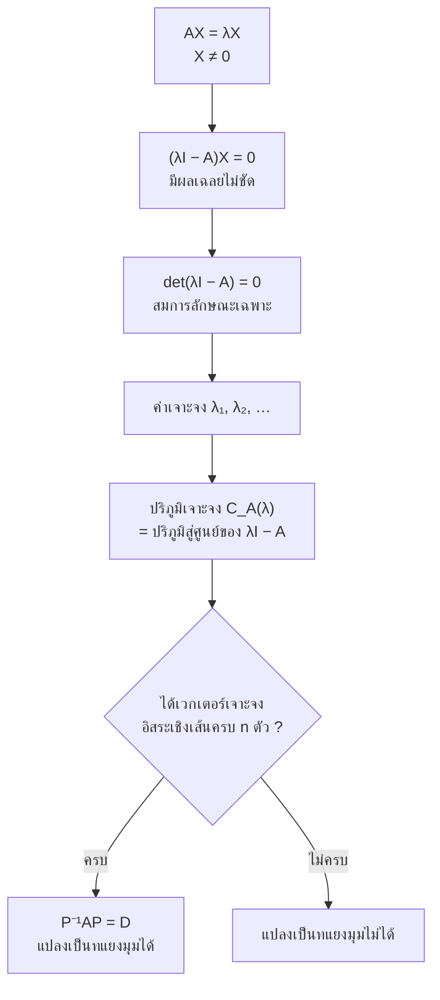
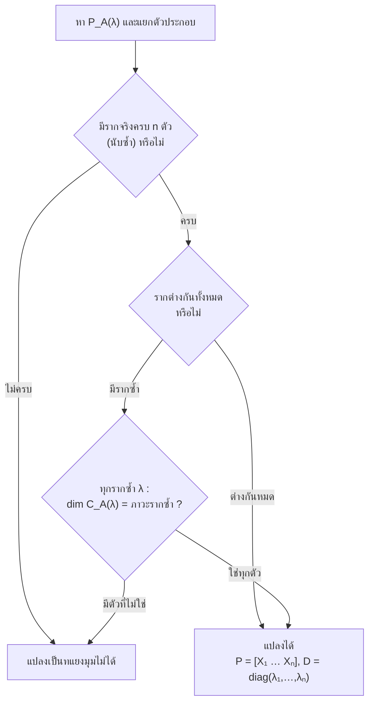

# บทที่ 4 ค่าเจาะจงและเวกเตอร์เจาะจง
*Eigenvalues and Eigenvectors — SC402101 พีชคณิตเชิงเส้น 1*

> [!info] ชุดสรุป 4 บท
> [[บทที่ 1 เมทริกซ์และระบบสมการเชิงเส้น]] → [[บทที่ 2 ปริภูมิเวกเตอร์]] → [[บทที่ 3 การแปลงเชิงเส้น]] → **บทที่ 4 ค่าเจาะจงและเวกเตอร์เจาะจง** (หน้านี้)

> [!abstract] อ่านบทนี้จบแล้วต้องทำอะไรได้
> 1. หาค่าเจาะจงและเวกเตอร์เจาะจงของการแปลงเชิงเส้นจากนิยาม
> 2. หาพหุนามลักษณะเฉพาะ สมการลักษณะเฉพาะ ค่าเจาะจง และปริภูมิเจาะจงของเมทริกซ์
> 3. ตัดสินว่าเมทริกซ์แปลงเป็นเมทริกซ์ทแยงมุมได้หรือไม่ พร้อมเหตุผล
> 4. สร้าง $P$ และ $D$ ที่ $D=P^{-1}AP$ และใช้คำนวณ $A^k$

> [!note] สัญลักษณ์ของเอกสารที่ใช้ในบทนี้
> $\|A\|$ หรือ $\det A$ = ดีเทอร์มิแนนท์ ; $P_A(\lambda)=\det(\lambda I_n-A)$ = พหุนามลักษณะเฉพาะ ; $C_A(\lambda)$ = ปริภูมิเจาะจงของ $A$ สำหรับค่าเจาะจง $\lambda$ ; $\operatorname{diag}(a_1,\dots,a_n)$ = เมทริกซ์ทแยงมุม  
> ตลอดบทนี้ค่าเจาะจงหมายถึง **จำนวนจริง** เท่านั้น

---

## 0. ภาพรวมของบท

ตัวอย่าง 3.29 ของ [[บทที่ 3 การแปลงเชิงเส้น]] แสดงว่าการแปลงเชิงเส้นตัวเดียวมีเมทริกซ์ได้หลายหน้าตาตามฐานหลักที่เลือก บทนี้ถามว่า **เลือกฐานหลักอย่างไรให้เมทริกซ์ง่ายที่สุด คือเป็นเมทริกซ์ทแยงมุม** คำตอบคือ ต้องใช้ฐานหลักที่ประกอบด้วย **เวกเตอร์เจาะจง** — เวกเตอร์ที่การแปลงทำได้แค่ยืดหรือหด ไม่เปลี่ยนแนว

### ทบทวนที่ต้องใช้: ระบบเอกพันธ์ $CX=0$

1. ระบบเอกพันธ์ไม่มีทางขัดแย้ง — ผลเฉลยชัด $X=0$ มีเสมอ
2. จำนวนผลเฉลยมีได้ 2 แบบ: ผลเฉลยชัดอย่างเดียว หรือเป็นอนันต์
3. ถ้า $C$ เป็นจัตุรัส: $\det C\ne0\iff$ มีแต่ผลเฉลยชัด ; $\det C=0\iff$ มีผลเฉลยเป็นอนันต์

ข้อ 3 คือเครื่องยนต์ของทั้งบท

---

## 4.1 ค่าเจาะจงและเวกเตอร์เจาะจง

> [!note] นิยาม 4.1 และ 4.4
> - ให้ $T:V\to V$ เป็นการแปลงเชิงเส้น สเกลาร์ $\lambda$ เป็น **ค่าเจาะจง (eigenvalue)** ของ $T$ ถ้ามีเวกเตอร์ $v\ne\theta_V$ ที่
> $$T(v)=\lambda v$$
> และเรียก $v$ ว่า **เวกเตอร์เจาะจง (eigenvector)** ของ $T$ ที่สมนัยกับ $\lambda$
> - ให้ $A$ เป็นเมทริกซ์จัตุรัสอันดับ $n$ สเกลาร์ $\lambda$ เป็นค่าเจาะจงของ $A$ ถ้ามี $X\in M_{n\times1}$, $X\ne0$ ที่ $AX=\lambda X$
>
> (บางตำราเรียก ค่าลักษณะเฉพาะ / เวกเตอร์ลักษณะเฉพาะ — eigen เป็นภาษาเยอรมันแปลว่า "เฉพาะตัว")

> [!warning] สองจุดที่ต้องจำให้ขึ้นใจ
> - **เวกเตอร์เจาะจงต้องไม่ใช่เวกเตอร์ศูนย์** (เพราะ $A0=\lambda0$ จริงกับทุก $\lambda$ ไม่บอกอะไรเลย)
> - **ค่าเจาะจงเป็น 0 ได้** — $\lambda=0$ เป็นค่าเจาะจง $\iff$ มี $X\ne0$ ที่ $AX=0$ $\iff\det A=0$

![[SC402101-ch4-eigen.svg]]

> [!example] ตัวอย่าง 4.2
> $T:\mathbb{R}^2\to\mathbb{R}^2$, $T((x,y))=(3x,\ 8x-y)$ จงหาค่าเจาะจงและเวกเตอร์เจาะจงของ $T$

ให้ $(x,y)\ne(0,0)$ และ $\lambda\in\mathbb{R}$ ที่ $T((x,y))=\lambda(x,y)$ คือ
$$3x=\lambda x,\qquad8x-y=\lambda y$$
- **กรณี $x\ne0$** : สมการแรกให้ $\lambda=3$ แล้วสมการที่สอง $8x-y=3y\Rightarrow y=2x$ เวกเตอร์เจาะจงคือ $(x,2x)=x(1,2)$, $x\ne0$
- **กรณี $x=0$** : ต้องมี $y\ne0$ สมการที่สอง $-y=\lambda y\Rightarrow\lambda=-1$ เวกเตอร์เจาะจงคือ $(0,y)=y(0,1)$, $y\ne0$

**ตอบ** ค่าเจาะจงคือ $3$ และ $-1$ ; เวกเตอร์เจาะจงที่สมนัยกับ $\lambda=3$ คือ $\{t(1,2):t\ne0\}$ และที่สมนัยกับ $\lambda=-1$ คือ $\{t(0,1):t\ne0\}$

> [!example] ตัวอย่าง 4.3
> $T:P_1\to P_1$, $T(a+bx)=5a+3bx$ จงหาค่าเจาะจงและเวกเตอร์เจาะจงของ $T$

ให้ $a+bx\ne0$ และ $T(a+bx)=\lambda(a+bx)$ คือ $5a+3bx=\lambda a+\lambda bx$ เทียบสัมประสิทธิ์: $5a=\lambda a$ และ $3b=\lambda b$
- ถ้า $a\ne0$ : $\lambda=5$ แล้ว $3b=5b\Rightarrow b=0$ เวกเตอร์เจาะจงคือพหุนามคงตัว $p(x)=t$, $t\ne0$
- ถ้า $a=0$ : ต้องมี $b\ne0$ จึง $\lambda=3$ เวกเตอร์เจาะจงคือ $p(x)=tx$, $t\ne0$

**ตอบ** $\lambda=5$ กับ $\{t:t\ne0\}$ และ $\lambda=3$ กับ $\{tx:t\ne0\}$

> [!tip] มุมมองลัด — แปลง $T$ เป็นเมทริกซ์ก่อน
> เทียบฐานธรรมชาติ ตัวอย่าง 4.2 คือ $A=\begin{bmatrix}3&0\\8&-1\end{bmatrix}$ และตัวอย่าง 4.3 คือ $[T]_{\{1,x\}}=\begin{bmatrix}5&0\\0&3\end{bmatrix}$ ทั้งคู่เป็นเมทริกซ์สามเหลี่ยม **ค่าเจาะจงคือสมาชิกบนเส้นทแยงมุม** อ่านได้ทันที (เหตุผลอยู่ในหัวข้อ 4.2) แล้วค่อยแปลงเวกเตอร์เจาะจงของเมทริกซ์กลับเป็นสมาชิกของ $V$

> [!example] ตัวอย่าง 4.6
> จงแสดงว่า $X=\begin{bmatrix}1\\2\end{bmatrix}$ เป็นเวกเตอร์เจาะจงของ $A=\begin{bmatrix}3&0\\8&-1\end{bmatrix}$ ที่สมนัยกับ $\lambda=3$

$$AX=\begin{bmatrix}3&0\\8&-1\end{bmatrix}\begin{bmatrix}1\\2\end{bmatrix}=\begin{bmatrix}3\\6\end{bmatrix}=3\begin{bmatrix}1\\2\end{bmatrix}=3X$$
และ $X\ne0$ จึงเป็นเวกเตอร์เจาะจงที่สมนัยกับ $\lambda=3$

> [!important] หมายเหตุ 4.7 — เวกเตอร์เจาะจงไม่ได้มีตัวเดียว
> ถ้า $AX=\lambda X$ แล้วทุก $\alpha\ne0$ : $A(\alpha X)=\alpha(AX)=\lambda(\alpha X)$ ดังนั้นพหุคูณที่ไม่เป็นศูนย์ของเวกเตอร์เจาะจงก็เป็นเวกเตอร์เจาะจง (ของค่าเจาะจงเดิม) — เวลาตอบจึงเลือกตัวแทนที่ **เป็นจำนวนเต็มสวย ๆ** ได้เสมอ

---

## 4.2 การหาค่าเจาะจงของเมทริกซ์

### จากนิยามสู่สมการ

$$AX=\lambda X\iff\lambda I_nX-AX=0\iff(\lambda I_n-A)X=0_{n\times1}$$
นี่คือ **ระบบเอกพันธ์** $n$ สมการ $n$ ตัวแปร ที่มี $\lambda I_n-A$ เป็นเมทริกซ์สัมประสิทธิ์ เราต้องการผลเฉลย $X\ne0$ ซึ่งมีได้ก็ต่อเมื่อ $\det(\lambda I_n-A)=0$ (ทบทวนข้อ 3)

> [!important] ทฤษฎีบท 4.8 — ข้อความต่อไปนี้สมมูลกัน ($A$ จัตุรัสอันดับ $n$, $\lambda\in\mathbb{R}$)
> 1. $\lambda$ เป็นค่าเจาะจงของ $A$
> 2. ระบบ $(\lambda I_n-A)X=0$ มีผลเฉลยที่ไม่เป็นเวกเตอร์ศูนย์
> 3. $\det(\lambda I_n-A)=0$
> 4. มี $X\ne0$ ที่ $AX=\lambda X$

> [!note] นิยาม — พหุนามลักษณะเฉพาะ สมการลักษณะเฉพาะ ปริภูมิเจาะจง
> - **พหุนามลักษณะเฉพาะ** : $P_A(\lambda)=\det(\lambda I_n-A)=\lambda^n+a_1\lambda^{n-1}+\cdots+a_n$ (ดีกรี $n$ สัมประสิทธิ์นำเป็น 1)
> - **สมการลักษณะเฉพาะ** : $\det(\lambda I_n-A)=0$ — รากจริงของสมการนี้คือค่าเจาะจงทั้งหมดของ $A$
> - **ปริภูมิเจาะจง (eigenspace)** ของ $\lambda$ :
> $$C_A(\lambda)=\{X\in M_{n\times1}:AX=\lambda X\}=\{X:(\lambda I_n-A)X=0\}$$
> คือปริภูมิสู่ศูนย์ของ $\lambda I_n-A$ จึงเป็น **ปริภูมิย่อย** ของ $M_{n\times1}$ ; สมาชิกที่ไม่ใช่ศูนย์ของมันคือเวกเตอร์เจาะจงทั้งหมดของ $\lambda$

> [!important] ทฤษฎีบท 4.9
> เวกเตอร์เจาะจง $X_1,\dots,X_k$ ที่สมนัยกับค่าเจาะจงที่ **ต่างกัน** ย่อมเป็นอิสระเชิงเส้น

**แนวคิดของบทพิสูจน์ (กรณี 2 ตัว)** ให้ $c_1X_1+c_2X_2=0$ คูณ $A$ ได้ $c_1\lambda_1X_1+c_2\lambda_2X_2=0$ ลบด้วย $\lambda_2$ เท่าของสมการแรก: $c_1(\lambda_1-\lambda_2)X_1=0$ เพราะ $\lambda_1\ne\lambda_2$ และ $X_1\ne0$ จึง $c_1=0$ แล้ว $c_2=0$ ตามมา (กรณีทั่วไปใช้อุปนัย)

### วิธีมาตรฐาน

> [!important] ขั้นตอนหาค่าเจาะจงและปริภูมิเจาะจง
> 1. เขียน $\lambda I_n-A$ (เปลี่ยนเครื่องหมายสมาชิกของ $A$ ทุกตัว แล้วบวก $\lambda$ ที่เส้นทแยงมุม)
> 2. คำนวณ $P_A(\lambda)=\det(\lambda I_n-A)$ และแยกตัวประกอบ
> 3. แก้ $P_A(\lambda)=0$ ได้ค่าเจาะจง
> 4. สำหรับค่าเจาะจงแต่ละค่า แทนลงใน $(\lambda I_n-A)X=0$ แล้วแก้ระบบเอกพันธ์ เขียนผลเฉลยเป็น $\operatorname{span}$ ได้ $C_A(\lambda)$

> [!tip] ทริคชุดที่ 1 — หาพหุนามลักษณะเฉพาะให้เร็ว
> - **$2\times2$:** $P_A(\lambda)=\lambda^2-(\operatorname{tr}A)\lambda+\det A$ โดย $\operatorname{tr}A$ = ผลบวกสมาชิกบนเส้นทแยงมุม
> - **$3\times3$:** $P_A(\lambda)=\lambda^3-(\operatorname{tr}A)\lambda^2+(M_{11}+M_{22}+M_{33})\lambda-\det A$ โดย $M_{ii}$ คือดีเทอร์มิแนนท์ $2\times2$ ที่ได้จากการตัดแถว $i$ หลัก $i$
> - **เมทริกซ์สามเหลี่ยม/ทแยงมุม:** $\lambda I-A$ ยังเป็นสามเหลี่ยม จึง $P_A(\lambda)=(\lambda-a_{11})\cdots(\lambda-a_{nn})$ — **ค่าเจาะจงคือสมาชิกบนเส้นทแยงมุม**
> - **มีแถวหรือหลักที่มีศูนย์มาก:** กระจายโคแฟกเตอร์ตามแถว/หลักนั้น จะได้ตัวประกอบ $(\lambda-a)$ ออกมาเลย ไม่ต้องคูณกระจายแล้วมานั่งแยกใหม่
> - **หารากของพหุนามกำลังสาม:** ลองตัวประกอบของพจน์คงตัว ($\pm1,\pm2,\dots$) ; ถ้า $\det A=0$ แล้ว $\lambda=0$ เป็นรากแน่นอน

> [!tip] ทริคชุดที่ 2 — ตรวจคำตอบ
> $$\lambda_1+\lambda_2+\cdots+\lambda_n=\operatorname{tr}A\qquad\qquad\lambda_1\lambda_2\cdots\lambda_n=\det A$$
> (นับซ้ำตามภาวะรากซ้ำ) ใช้เวลา 5 วินาที จับข้อผิดพลาดได้เกือบหมด และตรวจเวกเตอร์เจาะจงด้วยการคูณ $AX$ ตรง ๆ ว่าได้ $\lambda X$ จริง

> [!tip] ทริคชุดที่ 3 — หาเวกเตอร์เจาะจงโดยไม่ต้องลดรูป
> - **$2\times2$:** เมื่อแทน $\lambda$ แล้ว สองแถวของ $\lambda I-A$ เป็นสัดส่วนกันเสมอ ถ้าแถวที่ไม่เป็นศูนย์คือ $(a,\ b)$ เวกเตอร์เจาะจงคือ $\begin{bmatrix}b\\-a\end{bmatrix}$ (หรือ $\begin{bmatrix}-b\\a\end{bmatrix}$) ทันที
> - **$3\times3$ ที่ปริภูมิเจาะจงมีมิติ 1:** เลือกสองแถวของ $\lambda I-A$ ที่ไม่เป็นสัดส่วนกัน **ผลคูณไขว้** ของสองแถวนั้นคือเวกเตอร์เจาะจง (เพราะ $X$ ต้องตั้งฉากกับทุกแถว)
> - **ผลบวกทุกแถวเท่ากัน $=s$:** $s$ เป็นค่าเจาะจงที่มีเวกเตอร์เจาะจง $(1,1,\dots,1)^T$
> - จะใช้ $\lambda I-A$ หรือ $A-\lambda I$ ก็ได้ ปริภูมิสู่ศูนย์เหมือนกัน (ต่างกันแค่คูณ $-1$ ทุกแถว)

> [!example] ตัวอย่าง 4.11
> ให้ $A=\begin{bmatrix}3&0\\8&-1\end{bmatrix}$ จงหา (1) พหุนามลักษณะเฉพาะ (2) สมการลักษณะเฉพาะ (3) ค่าเจาะจง (4) ปริภูมิเจาะจง

**(1)** $P_A(\lambda)=\det\begin{bmatrix}\lambda-3&0\\-8&\lambda+1\end{bmatrix}=(\lambda-3)(\lambda+1)=\lambda^2-2\lambda-3$  
**(2)** $\lambda^2-2\lambda-3=0$  
**(3)** $\lambda=3,\ -1$  
**(4)** $\lambda=3$ : $(3I-A)X=0$ คือ $\begin{bmatrix}0&0\\-8&4\end{bmatrix}\begin{bmatrix}x\\y\end{bmatrix}=\begin{bmatrix}0\\0\end{bmatrix}$ ให้ $-8x+4y=0\Rightarrow y=2x$
$$C_A(3)=\left\{t\begin{bmatrix}1\\2\end{bmatrix}:t\in\mathbb{R}\right\}=\operatorname{span}\left\{\begin{bmatrix}1\\2\end{bmatrix}\right\}$$
$\lambda=-1$ : $(-I-A)X=0$ คือ $\begin{bmatrix}-4&0\\-8&0\end{bmatrix}\begin{bmatrix}x\\y\end{bmatrix}=\begin{bmatrix}0\\0\end{bmatrix}$ ให้ $x=0$, $y$ อิสระ
$$C_A(-1)=\operatorname{span}\left\{\begin{bmatrix}0\\1\end{bmatrix}\right\}$$
ทางลัด: $A$ เป็นสามเหลี่ยมล่าง ค่าเจาะจงคือ $3,-1$ ทันที ; แถว $(-8,4)$ ให้เวกเตอร์ $(4,8)\parallel(1,2)$ ; ตรวจ: $3+(-1)=2=\operatorname{tr}A$ ✓

> [!example] ตัวอย่าง 4.12
> ให้ $B=\begin{bmatrix}4&-1\\1&2\end{bmatrix}$ จงหา (1)–(4) เช่นเดียวกัน

**(1)** $P_B(\lambda)=\det\begin{bmatrix}\lambda-4&1\\-1&\lambda-2\end{bmatrix}=(\lambda-4)(\lambda-2)+1=\lambda^2-6\lambda+9$ (ลัด: $\operatorname{tr}B=6$, $\det B=9$)  
**(2)** $\lambda^2-6\lambda+9=0$ คือ $(\lambda-3)^2=0$  
**(3)** $\lambda=3$ (รากซ้ำ 2 ครั้ง)  
**(4)** $(3I-B)X=0$ : $\begin{bmatrix}-1&1\\-1&1\end{bmatrix}\begin{bmatrix}x\\y\end{bmatrix}=0$ ให้ $x=y$
$$C_B(3)=\operatorname{span}\left\{\begin{bmatrix}1\\1\end{bmatrix}\right\}$$
สังเกต: ค่าเจาะจงซ้ำ 2 ครั้ง แต่ปริภูมิเจาะจงมีมิติเพียง 1 — จะเป็นประเด็นสำคัญในหัวข้อ 4.3

> [!example] ตัวอย่าง 4.13
> ให้ $C=\begin{bmatrix}-2&-1\\5&2\end{bmatrix}$ จงหา (1) พหุนามลักษณะเฉพาะ (2) สมการลักษณะเฉพาะ (3) ค่าเจาะจง

**(1)** $P_C(\lambda)=\det\begin{bmatrix}\lambda+2&1\\-5&\lambda-2\end{bmatrix}=(\lambda+2)(\lambda-2)+5=\lambda^2+1$  
**(2)** $\lambda^2+1=0$  
**(3)** สมการนี้ **ไม่มีรากจริง** ($\lambda^2=-1$) ดังนั้น $C$ **ไม่มีค่าเจาะจง (ที่เป็นจำนวนจริง)** และไม่มีเวกเตอร์เจาะจงใน $M_{2\times1}$  
(ในเชิงเรขาคณิต $C^2=-I$ : $C$ ทำตัวคล้ายการหมุน $90^\circ$ จึงไม่มีทิศใดคงแนวเดิม)

> [!example] ตัวอย่าง 4.14
> ให้ $D=\begin{bmatrix}1&1&-2\\4&0&4\\1&-1&4\end{bmatrix}$ จงหา (1)–(4)

**(1)** กระจายตามแถวที่ 1
$$\begin{aligned}P_D(\lambda)&=\begin{vmatrix}\lambda-1&-1&2\\-4&\lambda&-4\\-1&1&\lambda-4\end{vmatrix}\\&=(\lambda-1)\big[\lambda(\lambda-4)+4\big]+1\big[-4(\lambda-4)-4\big]+2\big[-4+\lambda\big]\\&=(\lambda-1)(\lambda-2)^2-2(\lambda-2)\\&=(\lambda-2)\big[(\lambda-1)(\lambda-2)-2\big]=(\lambda-2)(\lambda^2-3\lambda)=\lambda(\lambda-2)(\lambda-3)\end{aligned}$$
คือ $P_D(\lambda)=\lambda^3-5\lambda^2+6\lambda$  
**(2)** $\lambda^3-5\lambda^2+6\lambda=0$  
**(3)** $\lambda=0,\ 2,\ 3$  
**(4)** แก้ $(\lambda I-D)X=0$ ทีละค่า (ใช้ $D-\lambda I$ แทนก็ได้)
- $\lambda=0$ : $DX=0$ แถว 2: $4x+4z=0\Rightarrow x=-z$ ; แถว 1: $x+y-2z=0\Rightarrow y=3z$ จึง $C_D(0)=\operatorname{span}\left\{\begin{bmatrix}-1\\3\\1\end{bmatrix}\right\}$
- $\lambda=2$ : $2I-D=\begin{bmatrix}1&-1&2\\-4&2&-4\\-1&1&-2\end{bmatrix}$ แถว 1: $x-y+2z=0$ ; แถว 2 (หาร 2): $-2x+y-2z=0$ ; บวกกัน: $x=0$ แล้ว $y=2z$ จึง $C_D(2)=\operatorname{span}\left\{\begin{bmatrix}0\\2\\1\end{bmatrix}\right\}$
- $\lambda=3$ : $3I-D=\begin{bmatrix}2&-1&2\\-4&3&-4\\-1&1&-1\end{bmatrix}$ แถว 3: $y=x+z$ ; แทนในแถว 1: $x+z=0$ จึง $x=-z$, $y=0$ และ $C_D(3)=\operatorname{span}\left\{\begin{bmatrix}-1\\0\\1\end{bmatrix}\right\}$

> [!tip] ใช้ทริคกับข้อ 4.14
> - **สูตร $3\times3$:** $\operatorname{tr}D=5$ ; $M_{11}+M_{22}+M_{33}=\begin{vmatrix}0&4\\-1&4\end{vmatrix}+\begin{vmatrix}1&-2\\1&4\end{vmatrix}+\begin{vmatrix}1&1\\4&0\end{vmatrix}=4+6-4=6$ ; $\det D=1(4)-1(12)-2(-4)=0$ ได้ $\lambda^3-5\lambda^2+6\lambda$ ทันที
> - **ผลคูณไขว้ ($\lambda=3$):** แถว $(2,-1,2)\times(-1,1,-1)=\big((-1)(-1)-(2)(1),\ (2)(-1)-(2)(-1),\ (2)(1)-(-1)(-1)\big)=(-1,0,1)$ ✓
> - **ตรวจ:** $0+2+3=5=\operatorname{tr}D$ ✓ และ $D\begin{bmatrix}0\\2\\1\end{bmatrix}=\begin{bmatrix}0\\4\\2\end{bmatrix}=2\begin{bmatrix}0\\2\\1\end{bmatrix}$ ✓

> [!example] ตัวอย่าง 4.15
> ให้ $E=\begin{bmatrix}1&1&2\\0&1&0\\0&1&3\end{bmatrix}$ จงหา (1)–(4)

**(1)** หลักที่ 1 ของ $\lambda I-E$ มีศูนย์สองตัว กระจายตามหลักนั้น
$$P_E(\lambda)=\begin{vmatrix}\lambda-1&-1&-2\\0&\lambda-1&0\\0&-1&\lambda-3\end{vmatrix}=(\lambda-1)\begin{vmatrix}\lambda-1&0\\-1&\lambda-3\end{vmatrix}=(\lambda-1)^2(\lambda-3)=\lambda^3-5\lambda^2+7\lambda-3$$
**(2)** $(\lambda-1)^2(\lambda-3)=0$  
**(3)** $\lambda=1$ (ซ้ำ 2 ครั้ง) และ $\lambda=3$  
**(4)** $\lambda=1$ : $I-E=\begin{bmatrix}0&-1&-2\\0&0&0\\0&-1&-2\end{bmatrix}$ เหลือสมการเดียว $y+2z=0$ ; $x=s$ และ $z=t$ อิสระ, $y=-2t$
$$C_E(1)=\operatorname{span}\left\{\begin{bmatrix}1\\0\\0\end{bmatrix},\begin{bmatrix}0\\-2\\1\end{bmatrix}\right\}$$
ปริภูมิเจาะจงนี้มีมิติ 2  
$\lambda=3$ : $3I-E=\begin{bmatrix}2&-1&-2\\0&2&0\\0&-1&0\end{bmatrix}$ ให้ $y=0$ และ $2x-2z=0\Rightarrow x=z$
$$C_E(3)=\operatorname{span}\left\{\begin{bmatrix}1\\0\\1\end{bmatrix}\right\}$$
ปริภูมิเจาะจงนี้มีมิติ 1

> [!example] ตัวอย่าง 4.16
> ให้ $F=\begin{bmatrix}2&0&3\\0&1&0\\0&1&2\end{bmatrix}$ จงหา (1)–(4)

**(1)** กระจายตามหลักที่ 1
$$P_F(\lambda)=\begin{vmatrix}\lambda-2&0&-3\\0&\lambda-1&0\\0&-1&\lambda-2\end{vmatrix}=(\lambda-2)(\lambda-1)(\lambda-2)=(\lambda-2)^2(\lambda-1)=\lambda^3-5\lambda^2+8\lambda-4$$
**(2)** $(\lambda-2)^2(\lambda-1)=0$  
**(3)** $\lambda=2$ (ซ้ำ 2 ครั้ง) และ $\lambda=1$  
**(4)** $\lambda=1$ : $I-F=\begin{bmatrix}-1&0&-3\\0&0&0\\0&-1&-1\end{bmatrix}$ ให้ $x=-3z$, $y=-z$
$$C_F(1)=\operatorname{span}\left\{\begin{bmatrix}-3\\-1\\1\end{bmatrix}\right\}$$
$\lambda=2$ : $2I-F=\begin{bmatrix}0&0&-3\\0&1&0\\0&-1&0\end{bmatrix}$ ให้ $z=0$, $y=0$, $x$ อิสระ
$$C_F(2)=\operatorname{span}\left\{\begin{bmatrix}1\\0\\0\end{bmatrix}\right\}$$
ปริภูมิเจาะจงนี้มีมิติเพียง 1 ทั้งที่ $\lambda=2$ เป็นรากซ้ำ 2 ครั้ง

เทียบ $E$ กับ $F$ ให้ดี: ทั้งคู่มีรากซ้ำ แต่ $E$ ได้เวกเตอร์เจาะจงอิสระเชิงเส้นครบ 3 ตัว ส่วน $F$ ได้เพียง 2 ตัว

---

## 4.3 การทำให้เป็นเมทริกซ์ทแยงมุม

### ทำไมจึงอยากได้เมทริกซ์ทแยงมุม

เมทริกซ์ทแยงมุมยกกำลังง่ายที่สุด:
$$D=\begin{bmatrix}1&0\\0&2\end{bmatrix}\ \Rightarrow\ D^k=\begin{bmatrix}1^k&0\\0&2^k\end{bmatrix}$$

**ตัวอย่างนำของเอกสาร** $A=\begin{bmatrix}3&2\\-1&0\end{bmatrix}$ มีค่าเจาะจง $1,2$ ($\operatorname{tr}=3$, $\det=2$) และเวกเตอร์เจาะจง $x_1=\begin{bmatrix}-1\\1\end{bmatrix}$, $x_2=\begin{bmatrix}-2\\1\end{bmatrix}$ ตั้ง
$$P=[\,x_1\ x_2\,]=\begin{bmatrix}-1&-2\\1&1\end{bmatrix},\qquad P^{-1}=\begin{bmatrix}1&2\\-1&-1\end{bmatrix}\qquad\Rightarrow\qquad P^{-1}AP=\begin{bmatrix}1&0\\0&2\end{bmatrix}$$
แล้ว $(P^{-1}AP)^6=P^{-1}A(PP^{-1})A(PP^{-1})\cdots AP=P^{-1}A^6P$ จึง
$$A^6=P\begin{bmatrix}1&0\\0&2\end{bmatrix}^6P^{-1}=\begin{bmatrix}-1&-2\\1&1\end{bmatrix}\begin{bmatrix}1&0\\0&64\end{bmatrix}\begin{bmatrix}1&2\\-1&-1\end{bmatrix}=\begin{bmatrix}127&126\\-63&-62\end{bmatrix}$$

### เมทริกซ์คล้าย

> [!note] นิยาม 4.17 และ 4.20
> - $A$ **คล้าย (similar)** กับ $B$ ถ้ามีเมทริกซ์ไม่เอกฐาน $P$ ที่ $B=P^{-1}AP$
> - $A$ **แปลงเป็นเมทริกซ์ทแยงมุมได้ (diagonalizable)** ถ้ามีเมทริกซ์ไม่เอกฐาน $P$ ที่ $D=P^{-1}AP$ เป็นเมทริกซ์ทแยงมุม — คือ $A$ คล้ายกับเมทริกซ์ทแยงมุม

**ความหมาย (เชื่อมกับบทที่ 2–3):** $P$ คือเมทริกซ์เปลี่ยนฐานหลัก $P^{-1}AP$ คือเมทริกซ์ของการแปลง $X\mapsto AX$ **ตัวเดิม** เมื่อวัดด้วยฐานหลักใหม่ที่เป็นหลักของ $P$ — เมทริกซ์คล้ายกันคือ "การแปลงเดียวกัน ถ่ายจากคนละมุม"

> [!important] ทฤษฎีบท 4.19
> ถ้า $A$ คล้ายกับ $B$ แล้ว $\lambda$ เป็นค่าเจาะจงของ $A$ $\iff$ $\lambda$ เป็นค่าเจาะจงของ $B$

**พิสูจน์** $\lambda I-P^{-1}AP=P^{-1}(\lambda I-A)P$ จึง
$$\det(\lambda I-B)=\det(P^{-1})\det(\lambda I-A)\det(P)=\det(\lambda I-A)$$
พหุนามลักษณะเฉพาะ **เหมือนกันทุกประการ** ∎ ผลพลอยได้: เมทริกซ์คล้ายกันมี $\operatorname{tr}$ และ $\det$ เท่ากัน

> [!example] ตัวอย่าง 4.18
> ให้ $P=\begin{bmatrix}-1&-2\\1&1\end{bmatrix}$, $P^{-1}=\begin{bmatrix}1&2\\-1&-1\end{bmatrix}$

$$P^{-1}\begin{bmatrix}1&2\\3&4\end{bmatrix}P=\begin{bmatrix}7&10\\-4&-6\end{bmatrix}\begin{bmatrix}-1&-2\\1&1\end{bmatrix}=\begin{bmatrix}3&-4\\-2&2\end{bmatrix}$$
จึง $\begin{bmatrix}1&2\\3&4\end{bmatrix}$ คล้ายกับ $\begin{bmatrix}3&-4\\-2&2\end{bmatrix}$
$$P^{-1}\begin{bmatrix}3&2\\-1&0\end{bmatrix}P=\begin{bmatrix}1&0\\0&2\end{bmatrix}=\operatorname{diag}(1,2)$$
จึง $\begin{bmatrix}3&2\\-1&0\end{bmatrix}$ คล้ายกับ $\operatorname{diag}(1,2)$  
นั่นคือ $\begin{bmatrix}3&2\\-1&0\end{bmatrix}$ แปลงเป็นเมทริกซ์ทแยงมุมได้

> [!warning] จุดที่เอกสารพิมพ์คลาดเคลื่อน (ตรวจด้วยการคำนวณแล้ว)
> ในตัวอย่าง 4.18 ของเอกสาร
> - ป้าย $P$ กับ $P^{-1}$ สลับ/พิมพ์เพี้ยน: เมทริกซ์ $\begin{bmatrix}1&1\\-1&-1\end{bmatrix}$ ที่พิมพ์ไว้มีดีเทอร์มิแนนท์เป็น 0 จึงเป็น $P$ ไม่ได้ ค่าที่สอดคล้องกับตัวอย่างนำคือ $P=\begin{bmatrix}-1&-2\\1&1\end{bmatrix}$, $P^{-1}=\begin{bmatrix}1&2\\-1&-1\end{bmatrix}$
> - ผลลัพธ์ $\begin{bmatrix}3&-4\\1&2\end{bmatrix}$ ที่พิมพ์ไว้ควรเป็น $\begin{bmatrix}3&-4\\-2&2\end{bmatrix}$
>
> **จับผิดได้ด้วยทริค tr/det:** $\begin{bmatrix}1&2\\3&4\end{bmatrix}$ มี $\operatorname{tr}=5$, $\det=-2$ เมทริกซ์ที่คล้ายกับมันต้องมีค่าทั้งสองเท่ากัน $\begin{bmatrix}3&-4\\-2&2\end{bmatrix}$ มี $\operatorname{tr}=5$, $\det=6-8=-2$ ✓ แต่ $\begin{bmatrix}3&-4\\1&2\end{bmatrix}$ มี $\det=10$ ✗

### เกณฑ์การแปลงเป็นเมทริกซ์ทแยงมุม

> [!important] ทฤษฎีบท 4.21 และ 4.27 — หัวใจของบท
> $A$ (จัตุรัสอันดับ $n$) แปลงเป็นเมทริกซ์ทแยงมุมได้ $\iff$ $A$ มีเวกเตอร์เจาะจง $n$ ตัวที่ **อิสระเชิงเส้น**  
> และถ้า $X_1,\dots,X_n$ เป็นเวกเตอร์เจาะจงอิสระเชิงเส้นที่สมนัยกับ $\lambda_1,\dots,\lambda_n$ ตามลำดับ แล้ว
> $$P=[\,X_1\ X_2\ \cdots\ X_n\,]\qquad\Longrightarrow\qquad P^{-1}AP=\operatorname{diag}(\lambda_1,\lambda_2,\dots,\lambda_n)$$

**ทำไมจริง — อ่านสมการ $AP=PD$ ทีละหลัก**
$$AP=[\,AX_1\ \cdots\ AX_n\,],\qquad PD=[\,\lambda_1X_1\ \cdots\ \lambda_nX_n\,]$$
ดังนั้น $AP=PD\iff AX_i=\lambda_iX_i$ ทุก $i$ (หลักของ $P$ เป็นเวกเตอร์เจาะจง) และ $P$ ไม่เอกฐาน $\iff$ หลักของ $P$ อิสระเชิงเส้น เมื่อครบทั้งสองอย่างจึงคูณ $P^{-1}$ ได้ $P^{-1}AP=D$ ∎

> [!warning] ลำดับต้องตรงกัน
> หลักที่ $i$ ของ $P$ ต้องคู่กับสมาชิกทแยงตัวที่ $i$ ของ $D$ เปลี่ยนลำดับเวกเตอร์เจาะจงใน $P$ ได้ตามใจ แต่ต้องเปลี่ยนลำดับค่าเจาะจงใน $D$ ตาม — $P$ และ $D$ จึง **ไม่ได้มีแบบเดียว**

> [!note] นิยาม 4.25 — ภาวะรากซ้ำ
> ถ้า $P_A(\lambda)=(\lambda-\lambda_1)^{s_1}(\lambda-\lambda_2)^{s_2}\cdots(\lambda-\lambda_m)^{s_m}$ โดย $\lambda_i$ ต่างกันทั้งหมดและ $s_1+\cdots+s_m=n$ เรียก $s_i$ ว่า **ภาวะรากซ้ำ (multiplicity)** ของ $\lambda_i$  
> เช่น $P_E(\lambda)=(\lambda-1)^2(\lambda-3)$ : ภาวะรากซ้ำของ $\lambda=1$ คือ 2 และของ $\lambda=3$ คือ 1

> [!important] ทฤษฎีบท 4.23, 4.26 และหมายเหตุ 4.22, 4.28
> - **(4.23)** ถ้า $P_A(\lambda)$ มีราก (จริง) **ต่างกันทั้งหมด $n$ ตัว** แล้ว $A$ แปลงเป็นเมทริกซ์ทแยงมุมได้ (เวกเตอร์เจาะจงของค่าเจาะจงต่างกันอิสระเชิงเส้นเอง — ทฤษฎีบท 4.9)
> - **(4.26)** ถ้า $P_A(\lambda)=(\lambda-\lambda_1)^{s_1}\cdots(\lambda-\lambda_m)^{s_m}$ แล้ว
> $A$ แปลงเป็นเมทริกซ์ทแยงมุมได้ ก็ต่อเมื่อ
> $$\dim C_A(\lambda_k)=s_k\qquad(\forall k=1,\dots,m)$$
> - **(4.28)** เมื่อแปลงได้ ถ้า $B_i$ เป็นฐานหลักของ $C_A(\lambda_i)$ แล้ว $B_1\cup B_2\cup\cdots\cup B_m$ เป็นเซตของเวกเตอร์เจาะจงอิสระเชิงเส้น $n$ ตัว — **เอาฐานหลักของแต่ละปริภูมิเจาะจงมาต่อกันเป็น $P$ ได้เลย**

> [!tip] ข้อเท็จจริงเสริมที่ทำให้งานลดลงครึ่งหนึ่ง
> สำหรับค่าเจาะจง $\lambda_k$ ทุกตัว $1\le\dim C_A(\lambda_k)\le s_k$ เสมอ ดังนั้น
> - ค่าเจาะจงที่ **ไม่ซ้ำ** ($s_k=1$) ผ่านเงื่อนไขโดยอัตโนมัติ — **ตรวจเฉพาะค่าเจาะจงที่ซ้ำ**
> - นับมิติได้โดยไม่ต้องแก้ระบบ: $\dim C_A(\lambda)=n-\operatorname{rank}(\lambda I-A)$ = จำนวนตัวแปรอิสระ
> - ถ้า $P_A(\lambda)$ มีตัวประกอบที่ไม่มีรากจริง (เช่น $\lambda^2+1$) แปลงเป็นเมทริกซ์ทแยงมุม (เหนือ $\mathbb{R}$) ไม่ได้
> - (เสริมนอกเอกสาร) เมทริกซ์ **สมมาตร** ที่สมาชิกเป็นจำนวนจริงแปลงเป็นเมทริกซ์ทแยงมุมได้เสมอ

### วิธีมาตรฐาน — ขั้นตอนตรวจสอบและแปลงเป็นเมทริกซ์ทแยงมุม

> [!important] อัลกอริทึม (เติมส่วนที่เอกสารเว้นว่างไว้ในหน้า 157–158)
> 1. หา $P_A(\lambda)=\det(\lambda I_n-A)$ และแยกตัวประกอบ → ได้ค่าเจาะจง $\lambda_1,\dots,\lambda_m$ พร้อมภาวะรากซ้ำ $s_1,\dots,s_m$
> 2. ถ้าแยกเป็นตัวประกอบเชิงเส้นเหนือ $\mathbb{R}$ ไม่หมด → **แปลงไม่ได้** จบ
> 3. ถ้าค่าเจาะจงต่างกันทั้งหมด $n$ ตัว → **แปลงได้** (ทฤษฎีบท 4.23) ข้ามไปขั้นที่ 5
> 4. สำหรับค่าเจาะจงที่ซ้ำแต่ละตัว หาปริภูมิเจาะจงแล้วเทียบ $\dim C_A(\lambda_k)$ กับ $s_k$ : มีตัวใดที่ $\dim C_A(\lambda_k)<s_k$ → **แปลงไม่ได้** จบ
> 5. หาฐานหลักของ $C_A(\lambda_k)$ ทุกตัว นำเวกเตอร์ทั้งหมดมาเรียงเป็นหลักของ $P$ และใส่ค่าเจาะจงที่คู่กันลงใน $D$ ตามลำดับเดียวกัน
> 6. (ถ้าโจทย์ถาม) หา $P^{-1}$ และตรวจ $AP=PD$

> [!tip] ทริค — ตรวจคำตอบด้วย $AP=PD$ ไม่ต้องหา $P^{-1}$
> $P^{-1}AP=D\iff AP=PD$ (เมื่อ $\det P\ne0$) การคูณ $AP$ กับ $PD$ ง่ายกว่าการหา $P^{-1}$ มาก และ $PD$ คือ "คูณหลักที่ $i$ ของ $P$ ด้วย $\lambda_i$" เขียนได้ทันที

> [!example] ตัวอย่าง 4.24
> $A=\begin{bmatrix}3&0\\8&-1\end{bmatrix}$ และ $C=\begin{bmatrix}1&1&-2\\4&0&4\\1&-1&4\end{bmatrix}$ แปลงเป็นเมทริกซ์ทแยงมุมได้หรือไม่

- $A$ : $P_A(\lambda)=(\lambda-3)(\lambda+1)$ มีราก $3,-1$ ต่างกันทั้งหมด (2 ตัว = อันดับ) — **แปลงได้** โดยทฤษฎีบท 4.23
- $C$ (คือเมทริกซ์ $D$ ของตัวอย่าง 4.14) : $P_C(\lambda)=\lambda(\lambda-2)(\lambda-3)$ มีราก $0,2,3$ ต่างกันทั้งหมด — **แปลงได้**

> [!example] ตัวอย่าง 4.29
> $A=\begin{bmatrix}3&0\\8&-1\end{bmatrix}$ แปลงเป็นเมทริกซ์ทแยงมุมได้หรือไม่ จงหา $P$ ที่ทำให้ $D=P^{-1}AP$ เป็นเมทริกซ์ทแยงมุม

แปลงได้ (ตัวอย่าง 4.24) จากตัวอย่าง 4.11: $C_A(3)=\operatorname{span}\left\{\begin{bmatrix}1\\2\end{bmatrix}\right\}$, $C_A(-1)=\operatorname{span}\left\{\begin{bmatrix}0\\1\end{bmatrix}\right\}$
$$P=\begin{bmatrix}1&0\\2&1\end{bmatrix},\qquad D=P^{-1}AP=\begin{bmatrix}3&0\\0&-1\end{bmatrix}$$
ตรวจ: $AP=\begin{bmatrix}3&0\\6&-1\end{bmatrix}=PD$ ✓ (หลัก 1 ของ $P$ คูณ 3, หลัก 2 คูณ $-1$)

> [!example] ตัวอย่าง 4.30
> $B=\begin{bmatrix}4&-1\\1&2\end{bmatrix}$ แปลงเป็นเมทริกซ์ทแยงมุมได้หรือไม่

จากตัวอย่าง 4.12: $P_B(\lambda)=(\lambda-3)^2$ ภาวะรากซ้ำของ $\lambda=3$ คือ 2 แต่ $C_B(3)=\operatorname{span}\left\{\begin{bmatrix}1\\1\end{bmatrix}\right\}$ มีมิติ 1 $\ne2$ โดยทฤษฎีบท 4.26 — **แปลงไม่ได้** ไม่มี $P$ ดังกล่าว

> [!tip] มองอีกมุม — เมทริกซ์ $n\times n$ ที่มีค่าเจาะจงค่าเดียว $\lambda$ จะแปลงเป็นทแยงมุมได้ก็ต่อเมื่อมันคือ $\lambda I$ อยู่แล้ว
> เพราะถ้าแปลงได้ $A=P(\lambda I)P^{-1}=\lambda I$ ข้อ 4.30: $B\ne3I$ จึงแปลงไม่ได้ทันทีโดยไม่ต้องหาปริภูมิเจาะจง

> [!example] ตัวอย่าง 4.31
> $A=\begin{bmatrix}3&3\\2&4\end{bmatrix}$ แปลงเป็นเมทริกซ์ทแยงมุมได้หรือไม่ ถ้าได้จงหา $P$ และใช้คำนวณ $A^8$

$P_A(\lambda)=\lambda^2-7\lambda+6=(\lambda-1)(\lambda-6)$ ($\operatorname{tr}=7$, $\det=6$) ค่าเจาะจง $1,6$ ต่างกัน — **แปลงได้**
- $\lambda=1$ : $I-A=\begin{bmatrix}-2&-3\\-2&-3\end{bmatrix}$ ให้ $2x+3y=0$ เลือก $X_1=\begin{bmatrix}3\\-2\end{bmatrix}$
- $\lambda=6$ : $6I-A=\begin{bmatrix}3&-3\\-2&2\end{bmatrix}$ ให้ $x=y$ เลือก $X_2=\begin{bmatrix}1\\1\end{bmatrix}$

$$P=\begin{bmatrix}3&1\\-2&1\end{bmatrix},\qquad P^{-1}=\frac15\begin{bmatrix}1&-1\\2&3\end{bmatrix},\qquad D=P^{-1}AP=\begin{bmatrix}1&0\\0&6\end{bmatrix}$$
จาก $A=PDP^{-1}$ ได้ $A^8=PD^8P^{-1}$ โดย $6^8=1679616$
$$A^8=\frac15\begin{bmatrix}3&1\\-2&1\end{bmatrix}\begin{bmatrix}1&0\\0&6^8\end{bmatrix}\begin{bmatrix}1&-1\\2&3\end{bmatrix}=\frac15\begin{bmatrix}3+2\cdot6^8&-3+3\cdot6^8\\-2+2\cdot6^8&2+3\cdot6^8\end{bmatrix}=\begin{bmatrix}671847&1007769\\671846&1007770\end{bmatrix}$$

> [!tip] ทางลัดสำหรับ $A^k$ ของเมทริกซ์ $2\times2$ ที่มีค่าเจาะจง $\lambda_1\ne\lambda_2$ — ไม่ต้องหา $P$ เลย
> $$A^k=\lambda_1^k\,\frac{A-\lambda_2I}{\lambda_1-\lambda_2}+\lambda_2^k\,\frac{A-\lambda_1I}{\lambda_2-\lambda_1}$$
> (ตรวจได้โดยคูณทั้งสองข้างด้วยเวกเตอร์เจาะจงแต่ละตัว) ข้อ 4.31: $\lambda_1=1$, $\lambda_2=6$
> $$A^8=\frac{A-6I}{-5}+6^8\cdot\frac{A-I}{5}=\frac{6^8-1}{5}A-\frac{6^8-6}{5}I=335923\,A-335922\,I$$
> ได้ $\begin{bmatrix}3(335923)-335922&3(335923)\\2(335923)&4(335923)-335922\end{bmatrix}=\begin{bmatrix}671847&1007769\\671846&1007770\end{bmatrix}$ ✓  
> ตัวอย่างนำ ($\lambda=1,2$, $k=6$) : $A^6=-(A-2I)+64(A-I)=63A-62I=\begin{bmatrix}127&126\\-63&-62\end{bmatrix}$ ✓

> [!example] ตัวอย่าง 4.32
> $C=\begin{bmatrix}1&1&-2\\4&0&4\\1&-1&4\end{bmatrix}$ แปลงเป็นเมทริกซ์ทแยงมุมได้หรือไม่ จงหา $P$ ที่ $D=P^{-1}CP$ เป็นเมทริกซ์ทแยงมุม

ค่าเจาะจง $0,2,3$ ต่างกันทั้งหมด — **แปลงได้** ใช้เวกเตอร์เจาะจงจากตัวอย่าง 4.14 เรียงตามลำดับ $\lambda=0,2,3$
$$P=\begin{bmatrix}-1&0&-1\\3&2&0\\1&1&1\end{bmatrix},\qquad D=P^{-1}CP=\begin{bmatrix}0&0&0\\0&2&0\\0&0&3\end{bmatrix}$$
ตรวจ: $CP=\begin{bmatrix}0&0&-3\\0&4&0\\0&2&3\end{bmatrix}=PD$ ✓ (ถ้าต้องการ $P^{-1}=\dfrac13\begin{bmatrix}-2&1&-2\\3&0&3\\-1&-1&2\end{bmatrix}$)

> [!example] ตัวอย่าง 4.33
> $E=\begin{bmatrix}1&1&2\\0&1&0\\0&1&3\end{bmatrix}$ แปลงเป็นเมทริกซ์ทแยงมุมได้หรือไม่ จงหา $P$ (ถ้ามี)

$P_E(\lambda)=(\lambda-1)^2(\lambda-3)$ ; จากตัวอย่าง 4.15

| ค่าเจาะจง | ภาวะรากซ้ำ | $\dim C_E(\lambda)$ | ผ่าน? |
|---|---|---|---|
| $1$ | 2 | 2 | ✓ |
| $3$ | 1 | 1 | ✓ |

มิติเท่ากับภาวะรากซ้ำทุกตัว โดยทฤษฎีบท 4.26 — **แปลงได้** และ
$$P=\begin{bmatrix}1&0&1\\0&-2&0\\0&1&1\end{bmatrix},\qquad D=P^{-1}EP=\begin{bmatrix}1&0&0\\0&1&0\\0&0&3\end{bmatrix}$$
ตรวจ: $EP=\begin{bmatrix}1&0&3\\0&-2&0\\0&1&3\end{bmatrix}=PD$ ✓

> [!example] ตัวอย่าง 4.34
> $F=\begin{bmatrix}2&0&3\\0&1&0\\0&1&2\end{bmatrix}$ แปลงเป็นเมทริกซ์ทแยงมุมได้หรือไม่

$P_F(\lambda)=(\lambda-2)^2(\lambda-1)$ ; จากตัวอย่าง 4.16: $C_F(2)=\operatorname{span}\{(1,0,0)^T\}$ มีมิติ 1 แต่ภาวะรากซ้ำของ $\lambda=2$ คือ 2 โดยทฤษฎีบท 4.26 — **แปลงไม่ได้** (หาเวกเตอร์เจาะจงอิสระเชิงเส้นได้มากสุด 2 ตัว ไม่ถึง 3)  
ลัด: $2I-F=\begin{bmatrix}0&0&-3\\0&1&0\\0&-1&0\end{bmatrix}$ มีแรงค์ 2 จึง $\dim C_F(2)=3-2=1$

> [!example] ตัวอย่าง 4.35
> ให้ $A=\begin{bmatrix}2&0&1\\0&1&1\\0&0&3\end{bmatrix}$ จงหา (1) ค่าเจาะจง (2) ปริภูมิเจาะจง (3) $P$ และ $P^{-1}$ ที่ทำให้ $P^{-1}AP$ เป็นเมทริกซ์ทแยงมุม และหา $P^{-1}AP$

**(1)** $A$ เป็นเมทริกซ์สามเหลี่ยมบน : $P_A(\lambda)=(\lambda-2)(\lambda-1)(\lambda-3)$ ค่าเจาะจงคือ $2,1,3$  
**(2)**
- $\lambda=2$ : $2I-A=\begin{bmatrix}0&0&-1\\0&1&-1\\0&0&-1\end{bmatrix}$ ให้ $z=0$, $y=0$ จึง $C_A(2)=\operatorname{span}\{(1,0,0)^T\}$
- $\lambda=1$ : $I-A=\begin{bmatrix}-1&0&-1\\0&0&-1\\0&0&-2\end{bmatrix}$ ให้ $z=0$, $x=0$ จึง $C_A(1)=\operatorname{span}\{(0,1,0)^T\}$
- $\lambda=3$ : $3I-A=\begin{bmatrix}1&0&-1\\0&2&-1\\0&0&0\end{bmatrix}$ ให้ $x=z$, $y=\tfrac z2$ เลือก $z=2$ จึง $C_A(3)=\operatorname{span}\{(2,1,2)^T\}$

**(3)** เรียงตามลำดับ $\lambda=2,1,3$
$$P=\begin{bmatrix}1&0&2\\0&1&1\\0&0&2\end{bmatrix},\qquad P^{-1}=\begin{bmatrix}1&0&-1\\0&1&-\tfrac12\\0&0&\tfrac12\end{bmatrix},\qquad P^{-1}AP=\begin{bmatrix}2&0&0\\0&1&0\\0&0&3\end{bmatrix}$$

> [!example] ตัวอย่าง 4.36
> ให้ $A=\begin{bmatrix}3&11&-11\\1&3&-2\\1&5&-4\end{bmatrix}$ ซึ่งมีค่าเจาะจง $\lambda=1,-2,3$ จงหา (1) เวกเตอร์เจาะจงที่สมนัยกับแต่ละค่า (2) $P$, $P^{-1}$ และ $P^{-1}AP$

ตรวจโจทย์ก่อน: $1+(-2)+3=2=\operatorname{tr}A$ ✓  
**(1)** (ใช้ $A-\lambda I$)
- $\lambda=1$ : $A-I=\begin{bmatrix}2&11&-11\\1&2&-2\\1&5&-5\end{bmatrix}$ หลักที่ 2 กับหลักที่ 3 เป็นลบของกัน จึง $(0,1,1)^T$ เป็นผลเฉลยทันที → $X_1=\begin{bmatrix}0\\1\\1\end{bmatrix}$
- $\lambda=-2$ : $A+2I=\begin{bmatrix}5&11&-11\\1&5&-2\\1&5&-2\end{bmatrix}$ สองแถวล่างซ้ำกัน ใช้ผลคูณไขว้ของแถว 1 กับแถว 2: $(5,11,-11)\times(1,5,-2)=(-22+55,\ -11+10,\ 25-11)=(33,-1,14)$ → $X_2=\begin{bmatrix}33\\-1\\14\end{bmatrix}$
- $\lambda=3$ : $A-3I=\begin{bmatrix}0&11&-11\\1&0&-2\\1&5&-7\end{bmatrix}$ แถว 1: $y=z$ ; แถว 2: $x=2z$ → $X_3=\begin{bmatrix}2\\1\\1\end{bmatrix}$

ตรวจ $X_2$: $AX_2=(99-11-154,\ 33-3-28,\ 33-5-56)^T=(-66,2,-28)^T=-2X_2$ ✓  
**(2)** ค่าเจาะจงต่างกันทั้งหมดจึงแปลงได้ เรียงตาม $\lambda=1,-2,3$
$$P=\begin{bmatrix}0&33&2\\1&-1&1\\1&14&1\end{bmatrix},\qquad P^{-1}=\frac1{30}\begin{bmatrix}-15&-5&35\\0&-2&2\\15&33&-33\end{bmatrix},\qquad P^{-1}AP=\begin{bmatrix}1&0&0\\0&-2&0\\0&0&3\end{bmatrix}$$
($\det P=30$ ; $P^{-1}AP$ **เขียนได้ทันทีโดยไม่ต้องคูณ** เพราะรู้จากทฤษฎีบท 4.27 ว่าต้องเป็น $\operatorname{diag}$ ของค่าเจาะจงตามลำดับหลักของ $P$)

> [!example] ตัวอย่าง 4.37
> ให้ $B=\begin{bmatrix}1&-1&-1\\-1&1&-1\\-1&-1&1\end{bmatrix}$ ซึ่งมีค่าเจาะจง $\lambda=-1,2,2$ จงหา (1) เวกเตอร์เจาะจง (2) $B$ แปลงเป็นเมทริกซ์ทแยงมุมได้หรือไม่ เพราะเหตุใด

**(1)**
- $\lambda=-1$ : $B+I=\begin{bmatrix}2&-1&-1\\-1&2&-1\\-1&-1&2\end{bmatrix}$ ผลบวกทุกแถวเป็น 0 จึง $(1,1,1)^T$ เป็นผลเฉลย และแรงค์เป็น 2 จึง $C_B(-1)=\operatorname{span}\{(1,1,1)^T\}$
- $\lambda=2$ : $B-2I=\begin{bmatrix}-1&-1&-1\\-1&-1&-1\\-1&-1&-1\end{bmatrix}$ เหลือสมการเดียว $x+y+z=0$ ; $y=s$, $z=t$ อิสระ, $x=-s-t$
$$C_B(2)=\operatorname{span}\left\{\begin{bmatrix}-1\\1\\0\end{bmatrix},\begin{bmatrix}-1\\0\\1\end{bmatrix}\right\}$$

**(2)** ภาวะรากซ้ำของ $\lambda=2$ คือ 2 และ $\dim C_B(2)=2$ ; ของ $\lambda=-1$ คือ 1 และ $\dim C_B(-1)=1$ เท่ากันทุกตัว โดยทฤษฎีบท 4.26 — **แปลงได้** ด้วย
$$P=\begin{bmatrix}1&-1&-1\\1&1&0\\1&0&1\end{bmatrix},\qquad P^{-1}BP=\operatorname{diag}(-1,2,2)$$

> [!tip] มุมมองลัดของข้อ 4.37 — เขียน $B=2I-J$ โดย $J$ คือเมทริกซ์ที่สมาชิกเป็น 1 ทุกตัว
> $J(1,1,1)^T=3(1,1,1)^T$ และ $JX=0$ ทุก $X$ ที่ $x+y+z=0$ ดังนั้น $J$ มีค่าเจาะจง $3,0,0$ และ $B=2I-J$ มีค่าเจาะจง $2-3=-1$ กับ $2-0=2$ (ซ้ำ 2 ครั้ง) พร้อมเวกเตอร์เจาะจงชุดเดียวกัน — ได้ทั้งคำตอบโดยไม่ต้องหาดีเทอร์มิแนนท์  
> หลักทั่วไป: ถ้า $AX=\lambda X$ แล้ว $(aA+bI)X=(a\lambda+b)X$ ; อีกทั้ง $B$ สมมาตรจึงแปลงเป็นทแยงมุมได้แน่นอน

> [!example] ตัวอย่าง 4.38
> ให้ $D=\begin{bmatrix}3&6&2\\0&-3&-8\\1&0&-4\end{bmatrix}$ ซึ่งมีค่าเจาะจง $\lambda=-6,1,1$ จงหา (1) เวกเตอร์เจาะจง (2) $D$ แปลงเป็นเมทริกซ์ทแยงมุมได้หรือไม่ เพราะเหตุใด

ตรวจโจทย์: $-6+1+1=-4=\operatorname{tr}D$ ✓  
**(1)**
- $\lambda=-6$ : $D+6I=\begin{bmatrix}9&6&2\\0&3&-8\\1&0&2\end{bmatrix}$ แถว 3: $x=-2z$ ; แถว 2: $y=\tfrac83z$ เลือก $z=3$ จึง $C_D(-6)=\operatorname{span}\{(-6,8,3)^T\}$ (ตรวจแถว 1: $-54+48+6=0$ ✓)
- $\lambda=1$ : $D-I=\begin{bmatrix}2&6&2\\0&-4&-8\\1&0&-5\end{bmatrix}$ แถว 3: $x=5z$ ; แถว 2: $y=-2z$ จึง $C_D(1)=\operatorname{span}\{(5,-2,1)^T\}$ (ตรวจแถว 1: $10-12+2=0$ ✓)

**(2)** ภาวะรากซ้ำของ $\lambda=1$ คือ 2 แต่ $\dim C_D(1)=1$ (เมทริกซ์ $D-I$ มีแรงค์ 2) โดยทฤษฎีบท 4.26 — **แปลงเป็นเมทริกซ์ทแยงมุมไม่ได้** เพราะมีเวกเตอร์เจาะจงอิสระเชิงเส้นได้มากสุดเพียง 2 ตัว

---

## สรุปท้ายบท

### สรุปผลของตัวอย่างทั้งบท

| เมทริกซ์ | พหุนามลักษณะเฉพาะ | ค่าเจาะจง (ภาวะรากซ้ำ) | มิติปริภูมิเจาะจง | แปลงเป็นทแยงมุม |
|---|---|---|---|---|
| $\begin{bmatrix}3&0\\8&-1\end{bmatrix}$ (4.11) | $(\lambda-3)(\lambda+1)$ | $3\,(1),\ -1\,(1)$ | 1, 1 | ได้ |
| $\begin{bmatrix}4&-1\\1&2\end{bmatrix}$ (4.12) | $(\lambda-3)^2$ | $3\,(2)$ | 1 | ไม่ได้ |
| $\begin{bmatrix}-2&-1\\5&2\end{bmatrix}$ (4.13) | $\lambda^2+1$ | ไม่มีค่าเจาะจงจริง | — | ไม่ได้ |
| $\begin{bmatrix}1&1&-2\\4&0&4\\1&-1&4\end{bmatrix}$ (4.14) | $\lambda(\lambda-2)(\lambda-3)$ | $0,2,3$ | 1, 1, 1 | ได้ |
| $\begin{bmatrix}1&1&2\\0&1&0\\0&1&3\end{bmatrix}$ (4.15) | $(\lambda-1)^2(\lambda-3)$ | $1\,(2),\ 3\,(1)$ | 2, 1 | ได้ |
| $\begin{bmatrix}2&0&3\\0&1&0\\0&1&2\end{bmatrix}$ (4.16) | $(\lambda-2)^2(\lambda-1)$ | $2\,(2),\ 1\,(1)$ | 1, 1 | ไม่ได้ |
| $\begin{bmatrix}3&3\\2&4\end{bmatrix}$ (4.31) | $(\lambda-1)(\lambda-6)$ | $1,6$ | 1, 1 | ได้ |
| $\begin{bmatrix}1&-1&-1\\-1&1&-1\\-1&-1&1\end{bmatrix}$ (4.37) | $(\lambda+1)(\lambda-2)^2$ | $-1\,(1),\ 2\,(2)$ | 1, 2 | ได้ |
| $\begin{bmatrix}3&6&2\\0&-3&-8\\1&0&-4\end{bmatrix}$ (4.38) | $(\lambda+6)(\lambda-1)^2$ | $-6\,(1),\ 1\,(2)$ | 1, 1 | ไม่ได้ |

### สมบัติของค่าเจาะจงที่ใช้ตอบโจทย์เชิงแนวคิด

ถ้า $AX=\lambda X$, $X\ne0$ แล้ว (ด้วย $X$ ตัวเดิม)

| เมทริกซ์ | ค่าเจาะจง |
|---|---|
| $A^k$ | $\lambda^k$ |
| $cA$ | $c\lambda$ |
| $A+cI$ | $\lambda+c$ |
| $A^{-1}$ (เมื่อ $A$ ไม่เอกฐาน) | $\tfrac1\lambda$ |
| $A^T$ | $\lambda$ (ค่าเจาะจงเหมือนกัน แต่เวกเตอร์เจาะจงอาจต่างกัน) |

> [!important] เติมทฤษฎีบทรวมเป็นข้อสุดท้าย — สำหรับ $A$ จัตุรัสอันดับ $n$
> $A$ ไม่เอกฐาน $\iff\det A\ne0\iff A\sim I_n\iff AX=0$ มีแต่ผลเฉลยชัด $\iff$ หลักของ $A$ เป็นฐานหลักของ $M_{n\times1}$ $\iff X\mapsto AX$ เป็นฟังก์ชันสมสัณฐาน $\iff$ **$0$ ไม่เป็นค่าเจาะจงของ $A$**

### ข้อผิดพลาดที่พบบ่อย

> [!warning] เช็กลิสต์
> - ตอบเวกเตอร์ศูนย์เป็นเวกเตอร์เจาะจง
> - เขียน $\lambda I-A$ ผิดเครื่องหมาย (ลืมกลับเครื่องหมายสมาชิกนอกเส้นทแยง)
> - แทน $\lambda$ แล้วได้ระบบที่มีแต่ผลเฉลยชัด — แปลว่า $\lambda$ ที่หามา **ผิด** (ค่าเจาะจงจริงต้องทำให้ $\lambda I-A$ เอกฐานเสมอ) ย้อนไปตรวจพหุนามลักษณะเฉพาะ
> - สรุปว่า "มีรากซ้ำ จึงแปลงเป็นทแยงมุมไม่ได้" — ผิด ต้องเทียบมิติของปริภูมิเจาะจงก่อน (ดู 4.15 กับ 4.16, 4.37 กับ 4.38)
> - สรุปว่า "เอกฐาน จึงแปลงเป็นทแยงมุมไม่ได้" — ผิด การผกผันได้กับการแปลงเป็นทแยงมุมได้เป็นคนละเรื่อง (4.14 มี $\det=0$ แต่แปลงได้)
> - เรียงค่าเจาะจงใน $D$ ไม่ตรงกับลำดับหลักของ $P$
> - ใช้ $A^k=P^{-1}D^kP$ — ที่ถูกคือ $A^k=PD^kP^{-1}$ (จาก $D=P^{-1}AP$ ได้ $A=PDP^{-1}$)

### แบบฝึกทบทวน (พร้อมคำตอบ)

> [!question]- ข้อ 1 — จงหาค่าเจาะจงและปริภูมิเจาะจงของ $A=\begin{bmatrix}2&1\\1&2\end{bmatrix}$
> $P_A(\lambda)=\lambda^2-4\lambda+3=(\lambda-1)(\lambda-3)$ ; $C_A(1)=\operatorname{span}\{(1,-1)^T\}$, $C_A(3)=\operatorname{span}\{(1,1)^T\}$ (ผลบวกแถวเท่ากับ 3 จึงเห็น $\lambda=3$ กับ $(1,1)^T$ ทันที แล้ว $\lambda$ อีกตัว $=\operatorname{tr}-3=1$)

> [!question]- ข้อ 2 — $A=\begin{bmatrix}1&1\\0&1\end{bmatrix}$ แปลงเป็นเมทริกซ์ทแยงมุมได้หรือไม่
> ไม่ได้ : ค่าเจาะจงเดียวคือ 1 (ซ้ำ 2) และ $I-A=\begin{bmatrix}0&-1\\0&0\end{bmatrix}$ มีแรงค์ 1 จึง $\dim C_A(1)=1<2$ (หรือ: มีค่าเจาะจงค่าเดียวแต่ $A\ne I$)

> [!question]- ข้อ 3 — ให้ $A=\begin{bmatrix}4&-2\\1&1\end{bmatrix}$ จงหา $A^5$
> $P_A(\lambda)=\lambda^2-5\lambda+6$ ค่าเจาะจง $2,3$ ใช้สูตรลัด $A^5=-2^5(A-3I)+3^5(A-2I)=-32\begin{bmatrix}1&-2\\1&-2\end{bmatrix}+243\begin{bmatrix}2&-2\\1&-1\end{bmatrix}=\begin{bmatrix}454&-422\\211&-179\end{bmatrix}$  
> (วิธีมาตรฐาน: $P=\begin{bmatrix}1&2\\1&1\end{bmatrix}$, $D=\operatorname{diag}(2,3)$, $A^5=PD^5P^{-1}$)

> [!question]- ข้อ 4 — เมทริกซ์ $A$ ขนาด $3\times3$ มีค่าเจาะจง $1,2,3$ จงหา $\det A$, $\operatorname{tr}A$, ค่าเจาะจงของ $A^2$ และของ $A^{-1}$ และ $\det(A-2I)$
> $\det A=6$, $\operatorname{tr}A=6$ ; $A^2$ : $1,4,9$ ; $A^{-1}$ : $1,\tfrac12,\tfrac13$ ; $\det(A-2I)=0$ เพราะ 2 เป็นค่าเจาะจง

> [!question]- ข้อ 5 — $A=\begin{bmatrix}2&1&0\\0&2&0\\0&0&3\end{bmatrix}$ แปลงเป็นเมทริกซ์ทแยงมุมได้หรือไม่
> ค่าเจาะจง $2$ (ซ้ำ 2), $3$ ; $2I-A=\begin{bmatrix}0&-1&0\\0&0&0\\0&0&-1\end{bmatrix}$ มีแรงค์ 2 จึง $\dim C_A(2)=1<2$ — ไม่ได้

> [!question]- ข้อ 6 — จริงหรือเท็จ: ถ้า $A$ แปลงเป็นเมทริกซ์ทแยงมุมได้ แล้ว $A^2$ แปลงเป็นเมทริกซ์ทแยงมุมได้
> **จริง** ถ้า $P^{-1}AP=D$ แล้ว $P^{-1}A^2P=(P^{-1}AP)(P^{-1}AP)=D^2$ ซึ่งเป็นเมทริกซ์ทแยงมุม

---

> [!info] ย้อนดูทั้งวิชา
> บทที่ 1 ให้เครื่องคำนวณ (การดำเนินการตามแถว, ดีเทอร์มิแนนท์) → บทที่ 2 ให้ภาษา (ปริภูมิ, ฐานหลัก, มิติ, พิกัด) → บทที่ 3 ให้ฟังก์ชันระหว่างปริภูมิและบอกว่ามันคือเมทริกซ์ → บทที่ 4 เลือกฐานหลักที่ดีที่สุดให้เมทริกซ์นั้น กลับไปที่ [[บทที่ 1 เมทริกซ์และระบบสมการเชิงเส้น]]
