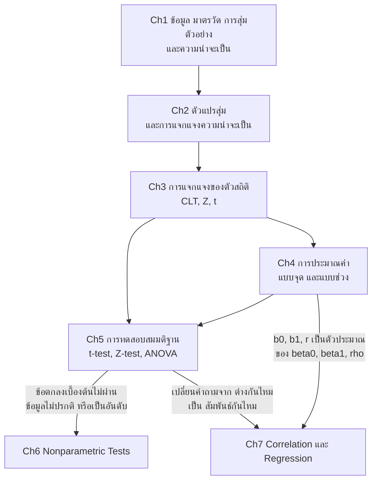
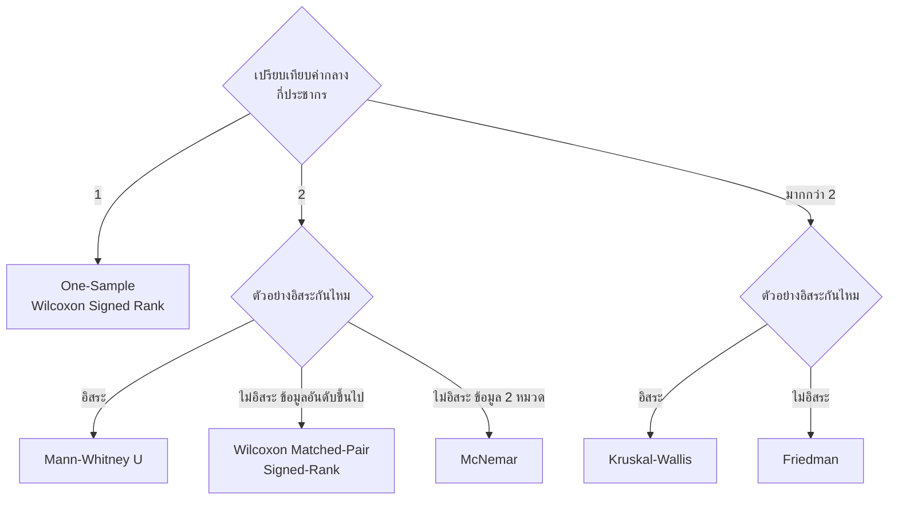
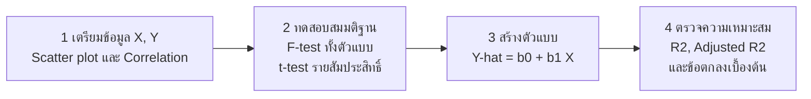

# สรุป Ch6–7 แบบละเอียด และการเชื่อมโยงกับ Ch1–5

> [!abstract] ทั้งวิชาในย่อหน้าเดียว
> เราไม่เคยเห็น **ประชากร** ทั้งหมด เห็นแค่ **ตัวอย่าง** → ใช้ **ความน่าจะเป็น** (Ch1) อธิบายความไม่แน่นอน → อธิบายข้อมูลด้วย **ตัวแปรสุ่มและการแจกแจง** (Ch2) → รู้ว่า **ตัวสถิติ** เช่น $\bar X$ แกว่งอย่างไร (Ch3) → ใช้ตัวสถิติ **ประมาณค่า** พารามิเตอร์ (Ch4) → และ **ทดสอบสมมติฐาน** เกี่ยวกับพารามิเตอร์ (Ch5)
> แต่ Ch5 ทำงานได้เมื่อข้อมูล "แจกแจงปรกติ" เท่านั้น → **Ch6** คือทางออกเมื่อข้อตกลงนั้นพัง (ใช้ "อันดับ" แทน "ค่าจริง")
> และ Ch5–6 ถามแค่ว่า "กลุ่มต่างกันไหม" → **Ch7** ถามต่อว่า "ตัวแปรสองตัว *สัมพันธ์กัน* ไหม แค่ไหน และใช้ตัวหนึ่ง *ทำนาย* อีกตัวได้อย่างไร"

**สารบัญ**
- [[#1. แผนที่ทั้งวิชา]]
- [[#2. สิ่งที่ต้องหยิบจาก Ch1–5 มาใช้]]
- [[#3. บทที่ 6 การทดสอบแบบไม่ใช้พารามิเตอร์]]
- [[#4. บทที่ 7 สหสัมพันธ์และการถดถอยเชิงเส้น]]
- [[#5. ร้อยทุกบทเข้าด้วยกัน]]
- [[#6. ถามตัวเองก่อนสอบ]]

> [!info] วิธีอ่านโน้ตนี้
> - เนื้อหาหลักมาจากสไลด์ทั้งหมด ส่วนที่ผมเติมเพื่อให้เรื่องต่อกันติดจะกำกับว่า **(เสริม)**
> - ตัวอย่างคำนวณทุกข้อถูกคำนวณซ้ำเพื่อตรวจตัวเลขแล้ว จุดที่สไลด์พิมพ์ไม่ตรงกับการคำนวณอยู่ใน callout สีเหลือง `[!warning]`

---

## 1. แผนที่ทั้งวิชา

| บท | ให้อะไรกับเรา | ถูกใช้ตรงไหนใน Ch6–7 |
|---|---|---|
| **Ch1 Part 1** ความฉลาดรู้ทางข้อมูล | มาตรวัด 4 ระดับ (นามบัญญัติ, เรียงอันดับ, อันตรภาค, อัตราส่วน), ประชากร/ตัวอย่าง, วิธีสุ่ม | มาตรวัดเป็นตัวกำหนดว่าใช้สถิติอะไรได้ — Ch6 ต้องการ "อย่างน้อยเรียงอันดับ", Ch7 ต้องการ "อันตรภาค/อัตราส่วน" |
| **Ch1 Part 2** ความน่าจะเป็น | กฎความน่าจะเป็น, เหตุการณ์อิสระ | p-value คือความน่าจะเป็น; "ตัวอย่างอิสระ / ไม่อิสระ" เป็นแกนแบ่งชนิดการทดสอบทั้ง Ch5 และ Ch6 |
| **Ch2** ตัวแปรสุ่ม & การแจกแจง | $E(X)$, $V(X)$, การแจกแจงปรกติและ $Z$, การประมาณด้วยปรกติ + ปรับค่า 0.5 | ข้อตกลง "แจกแจงปรกติ"; การประมาณ $T$, $U$ ด้วย $Z$ เมื่อ $n$ ใหญ่; ค่า $-1$ ในสูตร McNemar |
| **Ch3** การแจกแจงของตัวสถิติ | พารามิเตอร์ vs ตัวสถิติ, CLT, การแจกแจง $t$ | ตัวสถิติทดสอบทุกตัวคือ "ตัวสถิติที่รู้การแจกแจงเมื่อ $H_0$ จริง"; $T$ ของ $r$ และ $b$ ใช้ $t$ ที่ $\nu=n-2$ |
| **Ch4** การประมาณค่า | ตัวประมาณแบบจุด/ช่วง | $r$ ประมาณ $\rho$; $b_0,b_1$ ประมาณ $\beta_0,\beta_1$; $\hat Y$ ประมาณค่า $Y$ |
| **Ch5** การทดสอบสมมติฐาน | 5 ขั้นตอน, $\alpha$, $\beta$, อำนาจการทดสอบ, p-value, t-test 3 แบบ, ANOVA | โครง 5 ขั้นตอนใช้ซ้ำทุกการทดสอบใน Ch6–7; Ch6 คือ "คู่แฝด" ของแต่ละ test ใน Ch5; Ch7 ใช้ t-test และ F-test (ANOVA) กับสัมประสิทธิ์ |

---

## 2. สิ่งที่ต้องหยิบจาก Ch1–5 มาใช้

### 2.1 มาตรวัดของข้อมูล (Ch1) — กุญแจเลือกสถิติ

| มาตรวัด | จำแนก | เรียงอันดับ | บวก/ลบ | คูณ/หาร (ศูนย์แท้) | ตัวอย่าง |
|---|:-:|:-:|:-:|:-:|---|
| นามบัญญัติ (Nominal) | ✓ | | | | เพศ, ผ่าน/ไม่ผ่าน |
| เรียงอันดับ (Ordinal) | ✓ | ✓ | | | ระดับความพึงพอใจ |
| อันตรภาค (Interval) | ✓ | ✓ | ✓ | | อุณหภูมิ °C, คะแนนสอบ |
| อัตราส่วน (Ratio) | ✓ | ✓ | ✓ | ✓ | น้ำหนัก, รายได้ |

- **ค่าเฉลี่ย** มีความหมายตั้งแต่ระดับอันตรภาคขึ้นไป → t-test, ANOVA, Pearson $r$, regression
- **มัธยฐาน/อันดับ** ใช้ได้ตั้งแต่เรียงอันดับ → กลุ่ม Wilcoxon, Mann–Whitney, Kruskal–Wallis, Friedman
- **ความถี่ของหมวด 2 ค่า** (นามบัญญัติ) → McNemar

### 2.2 พารามิเตอร์ vs ตัวสถิติ (Ch3–4)

| สิ่งที่สนใจ | พารามิเตอร์ (ประชากร) | ตัวสถิติ (ตัวอย่าง) | บทที่เจอ |
|---|:-:|:-:|---|
| ค่าเฉลี่ย | $\mu$ | $\bar X$ | Ch3–5 |
| สัดส่วน | $p$ | $\hat p$ | Ch3–5 |
| มัธยฐาน | $M$ | มัธยฐานตัวอย่าง / ผลรวมอันดับ | **Ch6** |
| สหสัมพันธ์ | $\rho$ | $r$ | **Ch7** |
| จุดตัดแกน / ความชัน | $\beta_0,\ \beta_1$ | $b_0,\ b_1$ | **Ch7** |

สมมติฐานเขียนด้วย **พารามิเตอร์** เสมอ ($H_0:\mu=\mu_0$, $H_0:M=M_0$, $H_0:\rho=0$, $H_0:\beta=0$) ส่วนการตัดสินใจใช้ **ตัวสถิติ** ที่คำนวณจากตัวอย่าง

### 2.3 โครง 5 ขั้นตอน (Ch5) — ใช้ซ้ำทุกการทดสอบ

1. กำหนดสมมติฐาน $H_0$, $H_1$ (ทางเดียว หรือ สองทาง)
2. กำหนดระดับนัยสำคัญ $\alpha$ (นิยม 0.05)
3. เลือกตัวสถิติทดสอบ **ให้สอดคล้องกับสมมติฐานและข้อตกลงเบื้องต้น**
4. คำนวณค่าสถิติและหา p-value
5. ตัดสินใจและสรุปผล: **ปฏิเสธ $H_0$ เมื่อ p-value $\le \alpha$**

> [!tip] จุดที่ Ch6 "งอก" ออกมาจาก Ch5 คือขั้นที่ 3
> Ch5 สอนว่าก่อนเลือกสถิติต้อง "ทดสอบข้อตกลงเบื้องต้น (ถ้ามี)" ถ้าผ่าน → ใช้ Ch5 ถ้าไม่ผ่าน → ไป Ch6 ขั้นอื่นทั้งหมดเหมือนเดิม

### 2.4 ความผิดพลาดและอำนาจการทดสอบ (Ch5, ถูกทวนซ้ำใน Ch6)

| การตัดสินใจ | $H_0$ จริง | $H_0$ ไม่จริง |
|---|---|---|
| ปฏิเสธ $H_0$ | ความผิดพลาดแบบที่ 1 ($\alpha$) | ตัดสินใจถูก ($1-\beta$) = **อำนาจการทดสอบ** |
| ยอมรับ $H_0$ | ตัดสินใจถูก ($1-\alpha$) | ความผิดพลาดแบบที่ 2 ($\beta$) |

อำนาจการทดสอบ = โอกาส "จับความแตกต่างที่มีอยู่จริงได้" → นี่คือสิ่งที่ nonparametric **เสียเปรียบ** parametric

### 2.5 การทดสอบการแจกแจงปรกติ (Ch5) — ประตูสู่ Ch6

$H_0$: ข้อมูลมีการแจกแจงแบบปรกติ / $H_1$: ข้อมูลไม่มีการแจกแจงแบบปรกติ

- **Kolmogorov–Smirnov** เมื่อ $n > 50$
- **Shapiro–Wilk** เมื่อ $n \le 50$
- SPSS: `Analyze > Descriptive Statistics > Explore…`

> [!warning] ระวังทิศของการตัดสินใจ
> ที่นี่เรา **อยากยอมรับ** $H_0$: ถ้า p-value $> \alpha$ → ข้อมูลปรกติ → ใช้ parametric ได้ / ถ้า p-value $\le \alpha$ → ไม่ปรกติ → ไป nonparametric

### 2.6 สถิติ parametric ที่เรียนมา (Ch5) และข้อตกลงของแต่ละตัว

| คำถาม | สถิติ (Ch5) | ตัวสถิติทดสอบ | ข้อตกลงเบื้องต้น |
|---|---|---|---|
| ค่าเฉลี่ย 1 ประชากร | One-sample t / Z | $T=\dfrac{\bar X-\mu_0}{S/\sqrt n}$, $\nu=n-1$ (ใช้ $Z$ เมื่อทราบ $\sigma^2$ หรือ $n\ge30$) | ตัวอย่างสุ่มจากประชากรปรกติ |
| ค่าเฉลี่ย 2 ประชากรอิสระ | Independent-samples t | $T=\dfrac{(\bar X_1-\bar X_2)-d_0}{S_p\sqrt{1/n_1+1/n_2}}$, $\nu=n_1+n_2-2$ (กรณี $\sigma_1^2=\sigma_2^2$) | สองกลุ่มอิสระกัน, ปรกติทั้งคู่, ตรวจความแปรปรวนด้วย Levene |
| ค่าเฉลี่ย 2 ประชากรสัมพันธ์กัน | Paired-samples t | $T=\dfrac{\bar D-D_0}{S_D/\sqrt n}$, $\nu=n-1$ | ผลต่าง $D_i$ มาจากประชากรปรกติ |
| ค่าเฉลี่ย > 2 ประชากร | One-way ANOVA (F-test) | $F=\dfrac{MSTr}{MSE}$ | ทุกกลุ่มปรกติ และความแปรปรวนไม่ต่างกัน |
| สัดส่วน | Z-test | $Z=\dfrac{\hat p-p_0}{\sqrt{p_0q_0/n}}$ | — |

---

## 3. บทที่ 6 การทดสอบแบบไม่ใช้พารามิเตอร์

### 3.1 ปัญหาตั้งต้น

สไลด์เปิดบทด้วยกรณีศึกษาเดิมจาก Ch4–5 (งานวิจัยความเครียดของนักศึกษาช่วงโควิด-19) แล้วถามว่า *"ถ้าข้อมูลไม่เป็นไปตามข้อตกลงเบื้องต้น ทำยังไงดี?"*

**การทดสอบแบบไม่ใช้พารามิเตอร์ (Nonparametric Test)** คือ การวิเคราะห์ข้อมูลเพื่อทดสอบสมมติฐานที่ **ไม่เป็นไปตามข้อตกลงเบื้องต้น** ของสถิติที่ใช้พารามิเตอร์ เช่น
- ประชากรไม่ได้แจกแจงแบบปรกติ
- ข้อมูลอยู่ในรูปความถี่ หรือลำดับที่
- ตัวอย่างที่สุ่มมีขนาดเล็กเกินไป

| ข้อดี | ข้อด้อย |
|---|---|
| ข้อมูลไม่จำเป็นต้องแจกแจงปรกติ | **อำนาจการทดสอบน้อยกว่า** parametric |
| ตัวอย่างขนาดเล็กก็ทดสอบได้ | ใช้ **อันดับ (Rank)** แทนค่าจริง → สูญเสียข้อมูลบางส่วน ประสิทธิภาพลดลง |
| คำนวณง่ายกว่า | |
| ใช้ได้กับมาตรวัดนามบัญญัติ/เรียงอันดับ | |

> [!note] เชื่อมกับ Ch5
> เพราะอำนาจการทดสอบต่ำกว่า → **ถ้าข้อมูลผ่านข้อตกลง ให้ใช้ parametric ก่อนเสมอ** nonparametric เป็น "แผนสำรองที่ปลอดภัย" ไม่ใช่ตัวเลือกแรก

### 3.2 สองสิ่งที่เปลี่ยนไปจาก Ch5

1. **พารามิเตอร์ที่ทดสอบ**: ค่าเฉลี่ย $\mu$ → **มัธยฐาน $M$** (ค่ากลางที่ไม่ไวต่อค่าสุดโต่งและไม่ต้องอาศัยรูปการแจกแจง)
2. **วัตถุดิบในการคำนวณ**: ค่าจริง → **อันดับ** (เรียงน้อยไปมาก ค่าซ้ำให้ใช้ **อันดับเฉลี่ย**)

ข้อตกลงที่เหลืออยู่จึงเบามาก: มาตรวัด **อย่างน้อยเรียงอันดับ** + โครงสร้างความเป็นอิสระของกลุ่มตรงตามชนิดของ test

### 3.3 แผนผังเลือกสถิติ (Ch5 ↔ Ch6)

| สถานการณ์ | Parametric (Ch5) | Nonparametric (Ch6) | ข้อตกลงของ Ch6 |
|---|---|---|---|
| 1 ประชากร เทียบค่าที่กำหนด | One-sample t | **One-Sample Wilcoxon Signed Rank** | มาตรวัดอย่างน้อยเรียงอันดับ |
| 2 ประชากรอิสระ | Independent-samples t | **Mann–Whitney U** | 2 กลุ่มอิสระกัน + อย่างน้อยเรียงอันดับ |
| 2 ประชากรไม่อิสระ (ก่อน–หลัง) | Paired-samples t | **Wilcoxon Matched-Pair Signed-Rank** | 2 กลุ่มไม่อิสระ + อย่างน้อยเรียงอันดับ |
| 2 ประชากรไม่อิสระ ข้อมูล 2 หมวด | (Paired t ใช้ไม่ได้) | **McNemar** | ตาราง 2×2 ก่อน–หลังของกลุ่มเดียวกัน |
| >2 ประชากรอิสระ | One-way ANOVA | **Kruskal–Wallis** | ทุกกลุ่มอิสระกัน + อย่างน้อยเรียงอันดับ |
| >2 ประชากรไม่อิสระ (บล็อก) | ANOVA แบบจับคู่ | **Friedman** | ทุกชุดไม่อิสระกัน (วัดซ้ำ/จับคู่) |

---

### 3.4 One-Sample Wilcoxon Signed Rank Test

**ใช้เมื่อ** เปรียบเทียบมัธยฐานของตัวอย่าง 1 กลุ่มกับค่าที่ทราบ/ตั้งสมมติฐานไว้ $M_0$ แทน One-sample t เมื่อข้อมูลไม่ปรกติ

**สมมติฐาน** ($M$ = มัธยฐาน)

| แบบที่ 1 (ทางเดียว) | แบบที่ 2 (ทางเดียว) | แบบที่ 3 (สองทาง) |
|---|---|---|
| $H_0: M=M_0$ | $H_0: M=M_0$ | $H_0: M=M_0$ |
| $H_1: M>M_0$ | $H_1: M<M_0$ | $H_1: M\ne M_0$ |

**ขั้นตอนคำนวณ**
1. หาผลต่าง $D_i = X_i - M_0$ (**ตัด $D_i=0$ ทิ้ง** แล้ว $n$ = จำนวนที่เหลือ)
2. จัดอันดับ $\lvert D_i\rvert$ จากน้อยไปมาก ไม่สนเครื่องหมาย ค่าเท่ากันใช้อันดับเฉลี่ย
3. ใส่เครื่องหมายของ $D_i$ กลับให้อันดับ
4. $T^+$ = ผลรวมอันดับที่เป็นบวก, $T^-$ = ผลรวมอันดับที่เป็นลบ
5. หา $P(T\le t)$ ไปเทียบกับ $\alpha$

**ตัวสถิติและเขตปฏิเสธ**

| สมมติฐานแย้ง | ตัวสถิติ | ปฏิเสธ $H_0$ เมื่อ |
|---|---|---|
| $H_1: M\ne M_0$ | $T=\min(T^-,T^+)$ | $2P(T\le t)\le\alpha$ |
| $H_1: M> M_0$ | $T^-$ | $P(T^-\le t)\le\alpha$ |
| $H_1: M< M_0$ | $T^+$ | $P(T^+\le t)\le\alpha$ |

- $n$ น้อย ($5\le n\le30$): เปิดตาราง Wilcoxon Signed Rank
- $n$ มาก ($n>30$): ประมาณด้วยปรกติ

$$Z=\frac{T-\mu_T}{\sigma_T},\qquad \mu_T=\frac{n(n+1)}{4},\qquad \sigma_T^2=\frac{n(n+1)(2n+1)}{24}$$

(กรณี $\lvert D_i\rvert$ เท่ากันหลายค่า ต้องปรับค่าความแปรปรวนของ $T$)

> [!tip] ทำไมสถิติตัว "เล็ก" ถึงปฏิเสธ $H_0$ (เสริม)
> ถ้า $H_0$ จริง ข้อมูลควรอยู่เหนือและใต้ $M_0$ พอ ๆ กัน → $T^+\approx T^-$ ถ้าฝั่งหนึ่งเล็กมากแปลว่าข้อมูลเอียงไปอีกฝั่งเกือบหมด ตรวจคำตอบได้ด้วย $T^++T^-=\dfrac{n(n+1)}{2}$

> [!example] ตัวอย่าง: ท่อเหล็กโรงงาน TPI
> สุ่มท่อเหล็ก 10 ท่อน วัดความยาว (นิ้ว): 9, 10, 11, 9, 10, 9, 9, 9, 8, 9 สรุปได้หรือไม่ว่ามัธยฐานความยาวเท่ากับ 10 นิ้ว ที่ $\alpha=0.05$
>
> 1. $H_0: M=10$, $H_1: M\ne10$
> 2. $\alpha=0.05$
> 3. คำนวณ
>
> | $X_i$ | 9 | 10 | 11 | 9 | 10 | 9 | 9 | 9 | 8 | 9 |
> |---|:-:|:-:|:-:|:-:|:-:|:-:|:-:|:-:|:-:|:-:|
> | $D_i=X_i-10$ | −1 | 0 | 1 | −1 | 0 | −1 | −1 | −1 | −2 | −1 |
> | $\lvert D_i\rvert$ | 1 | – | 1 | 1 | – | 1 | 1 | 1 | 2 | 1 |
> | อันดับ | 4 | ตัดทิ้ง | 4 | 4 | ตัดทิ้ง | 4 | 4 | 4 | 8 | 4 |
> | เครื่องหมาย | − | | + | − | | − | − | − | − | − |
>
> ค่า $\lvert D\rvert=1$ มี 7 ตัว ครองอันดับ 1–7 → อันดับเฉลี่ย $=\dfrac{1+2+\dots+7}{7}=4$
> $T^-=4\times6+8=32$, $T^+=4$ → $T=\min(32,4)=4$ (ตรวจ: $32+4=36=\frac{8\cdot9}{2}$ โดย $n=8$)
> 4. เปิดตาราง ($n=8$): $2P(T\le4)=2(0.0273)=0.0546>0.05$ → **ยอมรับ $H_0$**
> 5. มัธยฐานของความยาวท่อเหล็กเท่ากับ 10 นิ้ว ที่ระดับนัยสำคัญ 0.05

> [!warning] ข้อมูลในสไลด์พิมพ์สองชุด
> สไลด์หน้าโจทย์และหน้าสรุปเขียนข้อมูลเป็น "8, 9, 9, 9, 9, 10, 10, 9, 8, 9" แต่ตารางคำนวณใช้ "9, 10, 11, 9, 10, 9, 9, 9, 8, 9" ผลลัพธ์ $T=4$ และ p = 0.0546 ตรงกับ **ชุดหลัง** เท่านั้น (ชุดแรกไม่มีค่าบวกเลย จะได้ $T^+=0$)

**กรณีศึกษา (SPSS)** — คะแนนความเครียดของนักศึกษาเทียบกับรายงานของมหาวิทยาลัย A (22.74)
- ทดสอบปรกติ: p-value < 0.001 → ไม่ปรกติ → ใช้ One-sample t ไม่ได้
- $H_0: M=22.74$, $H_1: M\ne22.74$, $\alpha=0.05$
- `Analyze > Nonparametric Tests > One Sample…` → ส่งตัวแปรไป *Test Fields* → แท็บ *Settings* → เลือก *Compare median to hypothesized (Wilcoxon signed-rank test)* → กรอก $M_0$
- ผล: p-value < 0.001 < 0.05 → **ปฏิเสธ $H_0$** → มัธยฐานคะแนนความเครียดต่างไปจากรายงานของมหาวิทยาลัย A

---

### 3.5 Mann–Whitney U Test

**ใช้เมื่อ** เปรียบเทียบมัธยฐานของ 2 กลุ่ม **ที่เป็นอิสระกัน** แทน Independent-samples t เมื่อข้อมูลไม่ปรกติ

**สมมติฐาน**: $H_0: M_1=M_2$ กับ $H_1: M_1>M_2$ / $M_1<M_2$ / $M_1\ne M_2$

**ขั้นตอนคำนวณ**
1. รวมตัวอย่างสองกลุ่ม $n=n_1+n_2$
2. เรียงอันดับจากน้อยไปมาก (1 ถึง $n$)
3. หาผลรวมอันดับของแต่ละกลุ่ม $T_1$, $T_2$
4. คำนวณ

$$U_1=n_1n_2+\frac{n_1(n_1+1)}{2}-T_1,\qquad U_2=n_1n_2+\frac{n_2(n_2+1)}{2}-T_2,\qquad U=\min(U_1,U_2)$$

**เขตปฏิเสธ**: $U<U_\alpha$ (ค่าวิกฤตจากตาราง Mann–Whitney) หรือ p-value $\le\alpha$
เมื่อ $n_1,n_2>20$ การแจกแจงของ $U$ ใกล้ปรกติ ใช้ $Z=\dfrac{U-\mu_U}{\sigma_U}$
(เสริม: $\mu_U=\dfrac{n_1n_2}{2}$, $\sigma_U=\sqrt{\dfrac{n_1n_2(n_1+n_2+1)}{12}}$ และตรวจคำตอบได้ด้วย $U_1+U_2=n_1n_2$)

> [!example] ตัวอย่าง: เรียนออนไลน์ vs ในห้องเรียน
> คะแนน Programming Test หลังเรียน 1 เดือน ทดสอบว่าประสิทธิภาพการเรียนรู้ต่างกันหรือไม่ ที่ $\alpha=0.05$
>
> | กลุ่ม 1 (ออนไลน์) $n_1=7$ | 130 | 135 | 138 | 144 | 148 | 155 | 168 | | |
> |---|:-:|:-:|:-:|:-:|:-:|:-:|:-:|:-:|:-:|
> | อันดับ | 1 | 2 | 3 | 5 | 7 | 9 | 12 | | |
> | **กลุ่ม 2 (ห้องเรียน) $n_2=9$** | 140 | 147 | 153 | 160 | 165 | 170 | 171 | 193 | 194 |
> | อันดับ | 4 | 6 | 8 | 10 | 11 | 13 | 14 | 15 | 16 |
>
> 1. $H_0: M_1=M_2$, $H_1: M_1\ne M_2$
> 2. $\alpha=0.05$
> 3. $T_1=39$, $T_2=97$ (ตรวจ: $39+97=136=\frac{16\cdot17}{2}$)
>    $U_1=7(9)+\dfrac{7(8)}{2}-39=52$
>    $U_2=7(9)+\dfrac{9(10)}{2}-97=11$
>    $U=\min(52,11)=11$
> 4. $U=11<U_\alpha=12$ → **ปฏิเสธ $H_0$**
> 5. ประสิทธิภาพการเรียนรู้ผ่านระบบออนไลน์แตกต่างจากการบรรยายในห้องเรียนปกติ ที่ระดับนัยสำคัญ 0.05

> [!warning] พิมพ์ผิดในสไลด์
> บรรทัด $U_2$ ในสไลด์เขียน "$-39$" แต่ค่าที่ถูกคือ $-T_2=-97$ คำตอบ $U_2=11$ ถูกต้องแล้ว

**กรณีศึกษา (SPSS)** — นักศึกษาชาย vs หญิง
- ทดสอบปรกติ: ชาย p < 0.001, หญิง p < 0.001 → ไม่ปรกติทั้งคู่
- `Analyze > Nonparametric Tests > Independent Samples…` → คะแนนไป *Test Fields*, เพศไป *Groups* → *Settings* → *Mann–Whitney U (2 samples)*
- ผล: p-value = 0.828 > 0.05 → **ยอมรับ $H_0$** → มัธยฐานคะแนนความเครียดของชายและหญิงไม่แตกต่างกัน

---

### 3.6 Wilcoxon Matched-Pair Signed-Rank Test

**ใช้เมื่อ** เปรียบเทียบมัธยฐานของ 2 กลุ่ม **ที่ไม่เป็นอิสระกัน** (ก่อน–หลัง, จับคู่) แทน Paired-samples t เมื่อข้อมูลไม่ปรกติ

**สมมติฐาน**: $H_0: M_{before}=M_{after}$ กับ $H_1: M_{before}>M_{after}$ / $<$ / $\ne$

**ขั้นตอนคำนวณ** (เหมือน 3.4 ทุกอย่าง แค่เปลี่ยน $D_i=X_i-M_0$ เป็นผลต่างของคู่)
1. หาผลต่างแต่ละคู่ $d_i$
2. เรียงอันดับ $\lvert d_i\rvert$ จากน้อยไปมาก (ไม่นับ $d_i=0$)
3. ใส่เครื่องหมายตาม $d_i$ แล้วหา $T^+$, $T^-$
4. $n$ = จำนวนเครื่องหมายบวก + ลบ, $T=\min(T^+,T^-)$
5. ปฏิเสธ $H_0$ เมื่อ $T\le T_\alpha$ (ตาราง Wilcoxon signed-rank)

> [!note] เชื่อมกับ Ch5
> Paired t ลดปัญหา 2 กลุ่มให้เหลือ "1 กลุ่มของผลต่าง $D$" แล้วทดสอบ $\mu_D$ — Wilcoxon แบบจับคู่ทำแบบเดียวกันเป๊ะ คือเป็น One-sample Wilcoxon ที่ทำกับ $d_i$ โดยมี $M_0=0$

> [!example] ตัวอย่าง: โปรแกรมอบรมทักษะดิจิทัล (12 คน)
> ทดสอบว่าคะแนนความพร้อมก่อนและหลังอบรมแตกต่างกันหรือไม่ ที่ $\alpha=0.05$
>
> | คนที่ | 1 | 2 | 3 | 4 | 5 | 6 | 7 | 8 | 9 | 10 | 11 | 12 |
> |---|:-:|:-:|:-:|:-:|:-:|:-:|:-:|:-:|:-:|:-:|:-:|:-:|
> | ก่อน | 57 | 60 | 63 | 40 | 38 | 48 | 52 | 54 | 56 | 55 | 38 | 60 |
> | หลัง | 44 | 53 | 45 | 45 | 41 | 49 | 40 | 42 | 50 | 63 | 36 | 58 |
> | $d_i$ (สไลด์) | 13 | 7 | 18 | −5 | −3 | −1 | 12 | 12 | 6 | −7 | 2 | 2 |
> | อันดับ $\lvert d_i\rvert$ (สไลด์) | 11 | 7.5 | 12 | 5 | 4 | 1 | 9.5 | 9.5 | 6 | 7.5 | 2.5 | 2.5 |
>
> 1. $H_0: M_{before}=M_{after}$, $H_1: M_{before}\ne M_{after}$
> 2. $\alpha=0.05$
> 3. $T^-=5+4+1+7.5=17.5$, $T^+=11+7.5+12+9.5+9.5+6+2.5+2.5=60.5$
> 4. $n=12$, $T=\min(60.5,17.5)=17.5>T_\alpha=14$ → **ยอมรับ $H_0$**
> 5. ความพร้อมของพนักงานก่อนและหลังเข้าร่วมโปรแกรมไม่แตกต่างกัน ที่ระดับนัยสำคัญ 0.05

> [!warning] ตัวเลขคนที่ 10 ในสไลด์
> $55-63=-8$ ไม่ใช่ $-7$ ถ้าใช้ $-8$ อันดับจะเป็น 7 (ของ $d=7$) และ 8 (ของ $d=-8$) ได้ $T^-=5+4+1+8=18$, $T^+=60$ → $T=18>14$ **ข้อสรุปไม่เปลี่ยน** (ยอมรับ $H_0$) ถ้าข้อสอบให้ตัวเลขชุดนี้ ให้ยึดผลต่างที่คำนวณได้จริง

**กรณีศึกษา (SPSS)** — โปรแกรมดนตรีบำบัดลดความเครียดได้หรือไม่
- ทดสอบปรกติ: ก่อน p < 0.001 (ไม่ปรกติ), หลัง p = 0.200 (ปรกติ) → มีชุดหนึ่งไม่ผ่าน → ใช้ Wilcoxon
- $H_0: M_{before}=M_{after}$, $H_1: M_{before}>M_{after}$ (ทางเดียว เพราะถามว่า "ลด" ได้ไหม)
- `Analyze > Nonparametric Tests > Related Samples…` → ส่งตัวแปรก่อนและหลังไป *Test Fields* → *Settings* → *Wilcoxon matched-pair signed-rank (2 samples)*
- ผล: p-value < 0.001 < 0.05 → **ปฏิเสธ $H_0$** → โปรแกรมมีประสิทธิภาพในการลดความเครียด

> [!tip] ทางเดียวกับ p-value ของโปรแกรม (จาก Ch5)
> SPSS รายงาน p-value แบบสองทาง ถ้าตั้งสมมติฐานทางเดียวให้ใช้ $\dfrac{\text{p-value}}{2}$ เทียบกับ $\alpha$ และต้องดูด้วยว่าทิศของผลต่างตรงกับ $H_1$

---

### 3.7 McNemar Test

**ใช้เมื่อ** เปรียบเทียบการเปลี่ยนแปลง **ก่อน–หลังของกลุ่มตัวอย่างชุดเดียวกัน** ที่คำตอบมีแค่ **2 ประเภท** (ใช่/ไม่ใช่, ผ่าน/ไม่ผ่าน, ชอบ/ไม่ชอบ) ข้อมูลอยู่ในตาราง 2×2

| ก่อน \ หลัง | − | + |
|---|:-:|:-:|
| **+** | A | B |
| **−** | C | D |

- **A และ D** = จำนวนคนที่ **เปลี่ยน** คำตอบ (A: + → −, D: − → +)
- **B และ C** = จำนวนคนที่ **ไม่เปลี่ยน** → ไม่ถูกใช้ในการคำนวณเลย

**สมมติฐาน**: $H_0$: ก่อนและหลังไม่มีการเปลี่ยนแปลง ($A=D$) / $H_1$: มีการเปลี่ยนแปลง ($A\ne D$)

**ตัวสถิติ**

$$\chi^2=\frac{(\lvert A-D\rvert-1)^2}{A+D},\qquad df=(r-1)(c-1)=1,\qquad \text{ปฏิเสธ } H_0 \text{ เมื่อ } \chi^2\ge\chi^2_{\alpha,df}$$

เมื่อ $A+D\ge10$ สไลด์ใช้ตัวสถิติ $Z$ โดยปฏิเสธ $H_0$ เมื่อ $Z\ge Z_{\alpha/2}$ (ดูตัวอย่าง 2)

> [!note] เชื่อมกับ Ch2 (เสริม)
> ถ้า $H_0$ จริง คนที่เปลี่ยนคำตอบควรเปลี่ยนไปทางใดทางหนึ่งด้วยโอกาสเท่ากัน ($p=0.5$) จำนวน A จึงเป็น **ทวินาม** $(n=A+D,\ p=0.5)$ สูตรข้างบนคือการ **ประมาณทวินามด้วยปรกติ** และ "$-1$" คือการปรับความต่อเนื่อง (แบบเดียวกับ ±0.5 ใน Ch2)

> [!example] ตัวอย่าง 1: การฝึกอบรม 19 คน ($\alpha=0.05$)
>
> | ก่อนอบรม \ หลังอบรม | ไม่ผ่าน | ผ่าน | รวม |
> |---|:-:|:-:|:-:|
> | ผ่าน | **2** (A) | 8 | 10 |
> | ไม่ผ่าน | 6 | **3** (D) | 9 |
>
> 1. $H_0: A=D$ (ไม่มีการเปลี่ยนแปลง), $H_1: A\ne D$
> 2. $\alpha=0.05$
> 3. $\chi^2=\dfrac{(\lvert2-3\rvert-1)^2}{2+3}=0$
> 4. $\chi^2=0<\chi^2_{0.05,1}=3.84$ → **ยอมรับ $H_0$** → ก่อนและหลังอบรมไม่มีการเปลี่ยนแปลง

> [!example] ตัวอย่าง 2: ความชอบก่อน–หลังดูงาน Apple TH (85 คน, $\alpha=0.01$)
>
> | ก่อนเดินทาง \ หลังเดินทาง | ชอบ | ไม่ชอบ | รวม |
> |---|:-:|:-:|:-:|
> | ชอบ | 26 | **15** (A) | 41 |
> | ไม่ชอบ | **7** (D) | 37 | 44 |
>
> 1. $H_0: A=D$, $H_1: A\ne D$
> 2. $\alpha=0.01$
> 3. เนื่องจาก $A+D=22\ge10$ ใช้ $Z=\dfrac{A-D}{\sqrt{A+D}}=\dfrac{15-7}{\sqrt{22}}=1.705$
> 4. ค่าวิกฤต $Z_{0.01/2}=\pm2.58$; $1.705<2.58$ → **ยอมรับ $H_0$** → ความชอบก่อนและหลังไปศึกษาดูงานไม่เปลี่ยนแปลง

> [!warning] ข้อสังเกตจากการตรวจตัวเลข
> - ตาราง 2 ตัวอย่างวางหัวคอลัมน์สลับกัน อย่าจำตำแหน่งช่อง ให้จำว่า **A, D คือช่องที่ "ก่อน ≠ หลัง"**
> - ค่า 1.705 ในตัวอย่าง 2 ได้จาก $(A-D)/\sqrt{A+D}$ แบบไม่ปรับความต่อเนื่อง ถ้าปรับ ($\lvert A-D\rvert-1$) จะได้ 1.492 ข้อสรุปเหมือนกัน
> - สไลด์นิยามพิมพ์ว่า "B และ C แทนจำนวนข้อมูลที่มีการเปลี่ยนแปลง" ซึ่งน่าจะตกคำว่า "ไม่" ไป

**SPSS**: `Analyze > Nonparametric Tests > Related Samples…` → *Settings* → *McNemar's Test (2 samples)*

---

### 3.8 Kruskal–Wallis Test

**ใช้เมื่อ** เปรียบเทียบมัธยฐานของ $k$ กลุ่ม ($k\ge3$) **ที่เป็นอิสระกัน** แทน F-test (One-way ANOVA) เมื่อเงื่อนไขของ F-test ไม่จริง

**สมมติฐาน**
$H_0: M_1=M_2=\dots=M_k$
$H_1: M_i$ อย่างน้อย 2 ค่าไม่เท่ากัน

**ขั้นตอนคำนวณ**
1. รวมตัวอย่างทุกกลุ่ม $n=n_1+\dots+n_k$
2. เรียงอันดับรวมจากน้อยไปมาก (1 ถึง $n$)
3. หาผลรวมอันดับของแต่ละกลุ่ม $R_i$
4. คำนวณ

$$KW=\frac{12}{n(n+1)}\sum_{i=1}^{k}\frac{R_i^2}{n_i}-3(n+1)$$

($k$ = จำนวนประชากร, $n_i$ = ขนาดตัวอย่างกลุ่ม $i$, $R_i$ = ผลรวมอันดับกลุ่ม $i$, $n$ = ขนาดตัวอย่างทั้งหมด)

**เขตปฏิเสธ**: $KW\ge KW_\alpha$ (ตาราง Kruskal–Wallis) หรือ $\chi^2_{\alpha,\,k-1}$

> [!note] เชื่อมกับ ANOVA (Ch5)
> ANOVA ถามว่า "ค่าเฉลี่ยของกลุ่มห่างกันมากเมื่อเทียบกับความแปรผันภายในกลุ่มไหม" — Kruskal–Wallis ถามคำถามเดียวกันแต่กับ **อันดับ**: ถ้าทุกกลุ่มเหมือนกัน อันดับเฉลี่ยของแต่ละกลุ่มควรใกล้กัน $KW$ จะเล็ก ถ้าบางกลุ่มกวาดอันดับสูง/ต่ำไปหมด $KW$ จะใหญ่ → ปฏิเสธเมื่อ **ค่าใหญ่** (ทางขวาทางเดียว เหมือน $F$)

> [!example] ตัวอย่าง: มโนทัศน์ของครูผู้สอน ผู้บริหาร ศึกษานิเทศก์ ($\alpha=0.05$)
>
> | | ครูผู้สอน ($n_1=5$) | ผู้บริหาร ($n_2=5$) | ศึกษานิเทศก์ ($n_3=4$) |
> |---|---|---|---|
> | คะแนน | 96, 128, 83, 61, 101 | 82, 124, 132, 135, 109 | 115, 149, 166, 147 |
> | อันดับ | 4, 9, 3, 1, 5 | 2, 8, 10, 11, 6 | 7, 13, 14, 12 |
> | $R_i$ | 22 | 37 | 46 |
>
> 1. $H_0$: ทั้งสามกลุ่มมีมโนทัศน์ไม่แตกต่างกัน / $H_1$: แตกต่างกัน
> 2. $\alpha=0.05$, $n=14$
> 3. $KW=\dfrac{12}{14(15)}\left[\dfrac{22^2}{5}+\dfrac{37^2}{5}+\dfrac{46^2}{4}\right]-3(15)=\dfrac{12}{210}(899.6)-45=6.4$
> 4. $KW=6.4>KW_\alpha=5.66$ → **ปฏิเสธ $H_0$**
> 5. ครูผู้สอน ผู้บริหาร และศึกษานิเทศก์มีมโนทัศน์แตกต่างกัน ที่ระดับนัยสำคัญ 0.05

> [!warning] พิมพ์ผิดในสไลด์
> สไลด์เขียนพจน์สุดท้ายเป็น $\dfrac{46^2}{5}$ แต่กลุ่มศึกษานิเทศก์มี $n_3=4$ ต้องเป็น $\dfrac{46^2}{4}$ จึงจะได้ 6.4 (ถ้าหารด้วย 5 จะได้ 0.36)

**กรณีศึกษา (SPSS)** — เปรียบเทียบโปรแกรมบำบัดความเครียด 3 วิธี (ดนตรีบำบัด, ออกกำลังกาย, อาหารบำบัด)
- ทดสอบปรกติ: กลุ่ม 1 p < 0.001, กลุ่ม 2 p < 0.001, กลุ่ม 3 p = 0.007 → ไม่ปรกติทั้งสามกลุ่ม → ANOVA ใช้ไม่ได้
- $H_0: M_1=M_2=M_3$ / $H_1$: อย่างน้อย 2 ค่าไม่เท่ากัน
- `Analyze > Nonparametric Tests > Independent Samples…` → คะแนนไป *Test Fields*, โปรแกรมไป *Groups* → *Settings* → *Kruskal-Wallis 1-way ANOVA (k samples)*
- ผล: p-value = 0.141 > 0.05 → **ยอมรับ $H_0$** → ทั้ง 3 วิธีมีประสิทธิภาพในการลดความเครียดไม่แตกต่างกัน

---

### 3.9 Friedman Test

**ใช้เมื่อ** เปรียบเทียบมัธยฐานของ $k$ กลุ่ม ($k\ge3$) **ที่ไม่เป็นอิสระกัน** (วัดซ้ำคนเดิม หรือจับคู่เป็นบล็อก) แทน F-test (ANOVA แบบจับคู่)

**สมมติฐาน**: เหมือน Kruskal–Wallis ($H_0: M_1=\dots=M_k$)

**ขั้นตอนคำนวณ**
1. เรียงอันดับ **ภายในแต่ละบล็อก** (แต่ละแถว ให้อันดับ 1 ถึง $k$)
2. หาผลรวมอันดับของแต่ละทรีตเมนต์ (แต่ละคอลัมน์) $R_j$
3. คำนวณ

$$F_r=\frac{12}{nk(k+1)}\sum_{j=1}^{k}R_j^2-3n(k+1)$$

($k$ = จำนวนทรีตเมนต์, $n$ = จำนวนบล็อก, $R_j$ = ผลรวมอันดับในทรีตเมนต์ที่ $j$)

**เขตปฏิเสธ**: $F_r\ge F_\alpha$ (ตาราง Friedman)

> [!tip] Kruskal–Wallis vs Friedman ต่างกันที่ "เรียงอันดับตรงไหน"
> - Kruskal–Wallis: เรียงอันดับ **รวมทุกกลุ่ม** (เพราะทุกค่าเทียบกันได้อย่างยุติธรรม)
> - Friedman: เรียงอันดับ **ทีละบล็อก** (เพื่อตัดความต่างระหว่างบล็อกออก เหมือนที่ paired t ใช้ผลต่างตัดความต่างระหว่างคนออก)

> [!example] ตัวอย่าง: วิธีการสอน 4 วิธี
> สุ่มนักเรียน 12 คน ใช้เกรดเฉลี่ยจับคู่แบ่งเป็น 3 กลุ่ม (บล็อก) กลุ่มละ 4 คน ทดลองวิธีสอน 4 วิธี ที่ $\alpha=0.05$
>
> | กลุ่ม | วิธีที่ 1 | วิธีที่ 2 | วิธีที่ 3 | วิธีที่ 4 |
> |---|:-:|:-:|:-:|:-:|
> | A (คะแนน → อันดับ) | 9 → 4 | 4 → 2 | 1 → 1 | 7 → 3 |
> | B | 6 → 3 | 5 → 2 | 2 → 1 | 8 → 4 |
> | C | 9 → 4 | 1 → 1 | 2 → 2 | 6 → 3 |
> | $R_j$ | **11** | **5** | **4** | **10** |
>
> 1. $H_0$: มัธยฐานของวิธีสอนทั้ง 4 วิธีไม่แตกต่างกัน / $H_1$: อย่างน้อย 1 คู่แตกต่างกัน
> 2. $\alpha=0.05$, $n=3$, $k=4$
> 3. $F_r=\dfrac{12}{3(4)(5)}\left[11^2+5^2+4^2+10^2\right]-3(3)(5)=\dfrac{12}{60}(262)-45=7.4$
> 4. $F_r=7.4\ge F_\alpha=7.4$ → **ปฏิเสธ $H_0$**
> 5. มัธยฐานของวิธีการสอนอย่างน้อย 1 คู่แตกต่างกัน ที่ระดับนัยสำคัญ 0.05

**SPSS**: `Analyze > Nonparametric Tests > Legacy Dialogs > K Related Samples…`

---

### 3.10 ตารางสรุป Ch6

| Test | แทน (Ch5) | เรียงอันดับอะไร | ตัวสถิติ | ปฏิเสธ $H_0$ เมื่อ |
|---|---|---|---|---|
| One-Sample Wilcoxon | One-sample t | $\lvert X_i-M_0\rvert$ | $T=\min(T^+,T^-)$ | $T$ **เล็ก**: $2P(T\le t)\le\alpha$ |
| Mann–Whitney U | Independent t | ค่าข้อมูลรวม 2 กลุ่ม | $U=\min(U_1,U_2)$ | $U$ **เล็ก**: $U<U_\alpha$ |
| Wilcoxon Matched-Pair | Paired t | $\lvert d_i\rvert$ ของคู่ | $T=\min(T^+,T^-)$ | $T$ **เล็ก**: $T\le T_\alpha$ |
| McNemar | Paired (ข้อมูล 2 หมวด) | ไม่เรียง ใช้ความถี่ A, D | $\chi^2=\frac{(\lvert A-D\rvert-1)^2}{A+D}$ | $\chi^2$ **ใหญ่**: $\ge\chi^2_{\alpha,1}$ |
| Kruskal–Wallis | One-way ANOVA | ค่าข้อมูลรวมทุกกลุ่ม | $KW$ | $KW$ **ใหญ่**: $\ge KW_\alpha$ |
| Friedman | ANOVA แบบจับคู่ | ภายในแต่ละบล็อก | $F_r$ | $F_r$ **ใหญ่**: $\ge F_\alpha$ |

> [!tip] จำทิศของเขตปฏิเสธ
> สถิติตระกูล "$\min$" ($T$, $U$) → ปฏิเสธเมื่อ **เล็ก** / สถิติตระกูล "ผลรวมกำลังสอง" ($\chi^2$, $KW$, $F_r$) → ปฏิเสธเมื่อ **ใหญ่** / แต่ถ้าใช้ p-value กติกาเดียวทุกตัว: **p-value $\le\alpha$ → ปฏิเสธ**

---

## 4. บทที่ 7 สหสัมพันธ์และการถดถอยเชิงเส้น

### 4.1 เปลี่ยนคำถาม

| | Ch5–6 | Ch7 |
|---|---|---|
| คำถาม | กลุ่มต่างกันไหม | ตัวแปรสัมพันธ์กันไหม / ทำนายได้ไหม |
| ตัวแปร | เชิงคุณภาพ (กลุ่ม) + เชิงปริมาณ (ค่าที่วัด) | เชิงปริมาณ + เชิงปริมาณ (อันตรภาค/อัตราส่วน) |
| ตัวอย่าง | เพศ → คะแนนความเครียด | ส่วนสูง–น้ำหนัก, รายได้–เงินออม, ชั่วโมงอ่านหนังสือ–คะแนนสอบ |

บทนี้มี 2 ส่วน
- **การวิเคราะห์สหสัมพันธ์**: การประมาณค่าสัมประสิทธิ์สหสัมพันธ์ + การทดสอบสมมติฐาน
- **การวิเคราะห์การถดถอยเชิงเส้น**: ตัวแบบ, การประมาณค่าและทดสอบพารามิเตอร์ของเส้นถดถอย, การตรวจสอบความเหมาะสมของตัวแบบ, สัมประสิทธิ์การตัดสินใจ

---

### 4.2 สหสัมพันธ์ (Correlation)

**นิยาม**: การศึกษาความสัมพันธ์ระหว่างตัวแปรต่อเนื่องตั้งแต่ 2 ตัวขึ้นไป โดยต้องเป็น **ความสัมพันธ์เชิงเส้นตรง** ค่า **สัมประสิทธิ์สหสัมพันธ์** บอก
- **ขนาด** ความสัมพันธ์ (มาก–น้อย)
- **ทิศทาง** ความสัมพันธ์ (แปรผันตาม – แปรผกผัน)

| ชนิด | จำนวนตัวแปร | ตัวอย่าง |
|---|---|---|
| สหสัมพันธ์อย่างง่าย (Simple) | 2 ตัว | รายได้ ↔ เงินออม |
| สหสัมพันธ์พหุคูณ (Multiple) | มากกว่า 2 ตัว | รายได้, รายจ่าย ↔ เงินออม |

**สัญลักษณ์**: ประชากร $\rho$ / ตัวอย่าง $r$ (→ $r$ เป็นตัวประมาณแบบจุดของ $\rho$ ตามแนวคิด Ch4)

**สูตรคำนวณ**

$$r=\frac{\sum_{i=1}^{n}(X_i-\bar X)(Y_i-\bar Y)}{\sqrt{\sum_{i=1}^{n}(X_i-\bar X)^2\ \sum_{i=1}^{n}(Y_i-\bar Y)^2}}$$

$$r=\frac{\sum X_iY_i-\dfrac{(\sum X_i)(\sum Y_i)}{n}}{\sqrt{\left[\sum X_i^2-\dfrac{(\sum X_i)^2}{n}\right]\left[\sum Y_i^2-\dfrac{(\sum Y_i)^2}{n}\right]}},\qquad -1\le r\le1$$

**การแปลความหมาย**

| ค่า $r$ | ความหมาย |
|---|---|
| $r>0$ | สัมพันธ์ทิศทางเดียวกัน |
| $r<0$ | สัมพันธ์ทิศทางตรงกันข้าม |
| $r=1$ | ทิศทางเดียวกันอย่างสมบูรณ์ |
| $r=-1$ | ทิศทางตรงข้ามอย่างสมบูรณ์ |
| $r=0$ | **ไม่มีความสัมพันธ์เชิงเส้น** |

| ขนาด $\lvert r\rvert$ | ระดับความสัมพันธ์ |
|---|---|
| 0.90 – 1.00 | สูงมาก (Very high) |
| 0.70 – 0.90 | สูง (High) |
| 0.50 – 0.70 | ปานกลาง (Moderate) |
| 0.30 – 0.50 | ต่ำ (Low) |
| 0.00 – 0.30 | น้อยมากจนละเลยได้ (Negligible) |

(อ้างอิง: Hinkle, Wiersma & Jurs, 2003)

> [!warning] $r=0$ ไม่ได้แปลว่า "ไม่เกี่ยวกันเลย" (เสริม)
> $r$ วัดเฉพาะความสัมพันธ์ **เชิงเส้น** ตัวแปรอาจสัมพันธ์กันแบบโค้งได้แม้ $r\approx0$ และ $r$ สูงก็ไม่ได้พิสูจน์ว่าเป็นเหตุเป็นผลกัน

#### การทดสอบสมมติฐานเกี่ยวกับ ρ

สมมติฐาน: $H_0:\rho=\rho_0$ กับ $H_1:\rho>\rho_0$ / $\rho<\rho_0$ / $\rho\ne\rho_0$

| กรณี | ตัวสถิติทดสอบ |
|---|---|
| $\rho_0=0$ (ถามว่า "สัมพันธ์กันไหม") | $T=r\dfrac{\sqrt{n-2}}{\sqrt{1-r^2}},\quad \nu=n-2$ |
| $\rho_0\ne0$ (ถามว่า "เท่ากับค่าที่กำหนดไหม") | $Z=\dfrac{\sqrt{n-3}}{2}\ln\left[\dfrac{(1+r)(1-\rho_0)}{(1-r)(1+\rho_0)}\right]$ |

เกณฑ์ตัดสินใจ: ปฏิเสธ $H_0$ ถ้า p-value $\le\alpha$

> [!note] เชื่อมกับ Ch3
> $\nu=n-2$ เพราะต้องประมาณพารามิเตอร์ 2 ตัว (ค่าเฉลี่ยของ $X$ และ $Y$ หรือมองเป็น $\beta_0,\beta_1$ ของเส้นตรง) ต่างจาก one-sample t ที่ประมาณตัวเดียวจึงเป็น $n-1$

**คำถาม 3 ข้อที่การวิเคราะห์สหสัมพันธ์ตอบ**: (1) สัมพันธ์กันหรือไม่ → p-value (2) มากน้อยเพียงใด → $\lvert r\rvert$ (3) ทิศทางใด → เครื่องหมายของ $r$

> [!example] กรณีศึกษา: คะแนนความรู้เกี่ยวกับโควิด-19 กับคะแนนความเครียด ($n=150$)
> $H_0:\rho=0$ (ไม่มีความสัมพันธ์) / $H_1:\rho\ne0$ (มีความสัมพันธ์), $\alpha=0.05$
>
> **Output แบบที่ 1**: Pearson Correlation = 0.073, Sig. (2-tailed) = 0.372
> → p-value $=0.372>0.05$ → ยอมรับ $H_0$ → คะแนนความรู้ **ไม่มีความสัมพันธ์** กับคะแนนความเครียด (ไม่ต้องแปลขนาด/ทิศทางต่อ)
>
> **Output แบบที่ 2**: Pearson Correlation = 0.734, Sig. (2-tailed) = 0.003
> → p-value $=0.003<0.05$ → ปฏิเสธ $H_0$ → **มีความสัมพันธ์** ในทิศทางเดียวกัน ระดับสูง ($r=0.734$)
> (ถ้า output เป็น $-0.734$ จะสรุปว่าสัมพันธ์ในทิศทางตรงข้าม ระดับสูง)

> [!tip] ลำดับการอ่านผล
> ดู **p-value ก่อน** ถ้าไม่ปฏิเสธ $H_0$ ให้หยุด ถ้าปฏิเสธ จึงรายงาน **ทิศทาง** (เครื่องหมาย) และ **ระดับ** (ตาราง Hinkle)

**โปรแกรม**
- SPSS: `Analyze > Correlate > Bivariate…`
- Excel: `Data > Data Analysis > Correlation`

---

### 4.3 การวิเคราะห์การถดถอย (Regression Analysis)

**นิยาม**: วิธีการทางสถิติที่ใช้ศึกษา **รูปแบบความสัมพันธ์** ของตัวแปร โดย
- **ตัวแปรอิสระ (Independent variable, $X$)**: ตัวแปรที่เป็นสาเหตุ ทำให้ตัวแปรอีกตัวเปลี่ยนแปลง
- **ตัวแปรตาม (Dependent variable, $Y$)**: ตัวแปรที่เกิดขึ้นเนื่องจากอิทธิพลของตัวแปรอื่น

**วัตถุประสงค์**
1. หาระดับและทิศทางความสัมพันธ์ของตัวแปรอิสระแต่ละตัวที่มีผลต่อตัวแปรตาม
2. หารูปแบบความสัมพันธ์ที่เหมาะสมที่สุด เพื่อนำไป **ทำนาย** ตัวแปรตาม

| | สหสัมพันธ์ | การถดถอย |
|---|---|---|
| บทบาทของตัวแปร | $X$ และ $Y$ สมมาตรกัน | แยก $X$ (เหตุ) กับ $Y$ (ผล) |
| ผลลัพธ์ | ตัวเลขเดียว $r$ | สมการ $\hat Y=b_0+b_1X$ |
| ตอบคำถาม | สัมพันธ์ไหม แค่ไหน ทิศใด | $X$ เปลี่ยน 1 หน่วย $Y$ เปลี่ยนเท่าไร, ทำนาย $Y$ |

| ชนิด | จำนวน $X$ | ตัวอย่าง |
|---|---|---|
| การถดถอยเชิงเส้นอย่างง่าย (Simple) | 1 ตัว | ชั่วโมงอ่านหนังสือ → คะแนนสอบ |
| การถดถอยเชิงเส้นพหุคูณ (Multiple) | มากกว่า 1 ตัว | ชั่วโมงอ่านหนังสือ, GPA → คะแนนสอบ |

#### ตัวแบบการถดถอยเชิงเส้นอย่างง่าย

$$Y=\beta_0+\beta_1X+\varepsilon\quad(\text{ประชากร})\qquad\qquad \hat Y=b_0+b_1X\quad(\text{ตัวอย่าง})$$

- $\beta_0$ : ค่าของ $Y$ เมื่อ $X=0$ (จุดตัดแกน $Y$)
- $\beta_1$ : ความชัน = การเปลี่ยนแปลงของ $Y$ เมื่อ $X$ เปลี่ยนไป 1 หน่วย
  - $\beta_1>0$ → สัมพันธ์ทิศทางเดียวกัน
  - $\beta_1<0$ → สัมพันธ์ทิศทางตรงกันข้าม
  - $\beta_1=0$ → ไม่มีความสัมพันธ์แบบเชิงเส้นตรง
- $\varepsilon$ : ความคลาดเคลื่อน เป็น **ตัวแปรสุ่ม** (แนวคิด Ch2) โดยมีข้อสมมติ
  1. $\varepsilon$ มีการแจกแจงแบบปรกติ
  2. $\varepsilon$ เป็นอิสระต่อกัน
  3. $\varepsilon$ มีค่าเฉลี่ยเท่ากับ 0
  4. $\varepsilon$ มีความแปรปรวนคงที่
- $b_0$, $b_1$ เป็น **ตัวประมาณ** ของ $\beta_0$, $\beta_1$ (แนวคิด Ch4)

> [!note] (เสริม) สูตรหา $b_0$, $b_1$ ด้วยวิธีกำลังสองน้อยที่สุด
> ให้ $x=X-\bar X$ และ $y=Y-\bar Y$ (ตัวพิมพ์เล็ก = ส่วนเบี่ยงเบนจากค่าเฉลี่ย ซึ่งเป็นสัญลักษณ์เดียวกับในสูตรของสไลด์ข้างล่าง)
> $b_1=\dfrac{\sum xy}{\sum x^2}$, $\quad b_0=\bar Y-b_1\bar X$
> สังเกตว่า $b_1$ กับ $r$ มีตัวเศษเดียวกัน ($\sum xy$) → **เครื่องหมายเหมือนกันเสมอ** และ $b_1=r\dfrac{S_Y}{S_X}$

#### ตัวแบบการถดถอยเชิงเส้นพหุคูณ

$$Y=\beta_0+\beta_1X_1+\beta_2X_2+\dots+\beta_kX_k+\varepsilon\qquad\Rightarrow\qquad \hat Y=b_0+b_1X_1+b_2X_2+\dots+b_kX_k$$

- $\beta_0$ : ระยะตัดแกน $Y$
- $\beta_j$ : ความชันของ $Y$ เมื่อเปลี่ยน $X_j$ **โดยตัวแปร $X$ อื่นคงที่** → เรียก **สัมประสิทธิ์การถดถอยบางส่วน (Partial regression coefficient)**

---

### 4.4 ขั้นตอนการวิเคราะห์การถดถอยเชิงเส้น 4 ขั้น

#### ขั้นที่ 1 ตรวจสอบความสัมพันธ์เชิงเส้นระหว่าง X กับ Y
- แผนภาพการกระจาย (Scatter diagram) → ดูว่าจุดเรียงเป็นแนวเส้นตรงไหม
- สหสัมพันธ์ (Correlation) → ใช้ทุกอย่างในหัวข้อ 4.2

#### ขั้นที่ 2 ทดสอบสมมติฐานเกี่ยวกับพารามิเตอร์ในตัวแบบ

**(ก) ทดสอบความสัมพันธ์ทั้งตัวแบบด้วย ANOVA (F-test)**

$H_0:\beta_1=\beta_2=\dots=\beta_k=0$
$H_1:$ มี $\beta_i$ อย่างน้อย 1 ค่า $\ne0$

$$F=\frac{MSTr}{MSE}\sim f_{(k-1,\,n-k)}$$

| แหล่งความผันแปร (SOV) | df | SS | MS | F |
|---|:-:|:-:|:-:|:-:|
| ทรีตเมนต์ / การถดถอย | $k-1$ | $SSTr$ | $MSTr=\dfrac{SSTr}{k-1}$ | $\dfrac{MSTr}{MSE}$ |
| ความคลาดเคลื่อน (Error) | $n-k$ | $SSE$ | $MSE=\dfrac{SSE}{n-k}$ | |
| รวม (Total) | $n-1$ | $SST$ | | |

> [!note] เชื่อมกับ ANOVA ใน Ch5
> เป็นตาราง ANOVA ตัวเดียวกับที่ใช้เปรียบเทียบค่าเฉลี่ยหลายกลุ่ม หลักคิดเหมือนกันคือ **แบ่งความผันแปรรวมของ $Y$** ออกเป็นส่วนที่ "อธิบายได้" กับส่วนที่ "อธิบายไม่ได้" ($SST=SSR+SSE$) แล้วดูอัตราส่วน
> ใน output ของ SPSS: df ของ Regression = จำนวนตัวแปรอิสระ, df ของ Residual = $n-$ จำนวนตัวแปรอิสระ $-1$ (ตรงกับตารางข้างบนเมื่อ $k$ นับรวมค่าคงที่ด้วย)

**(ข) ทดสอบค่าคงที่ $\beta_0$ (t-test)**

$H_0:\beta_0=0$ / $H_1:\beta_0\ne0$

$$T=\frac{b_0-(\beta_0)_0}{S_{b_0}},\quad\nu=n-2,\qquad S^2_{b_0}=\frac{S^2_{Y|X}\sum_{i=1}^{n}X_i^2}{n\sum x^2},\qquad S^2_{Y|X}=\frac{\sum y^2-b\sum xy}{n-2}$$

**(ค) ทดสอบสัมประสิทธิ์การถดถอย $\beta$ (t-test)** — ทดสอบว่า $X$ และ $Y$ มีความสัมพันธ์กันหรือไม่

$H_0:\beta=0$ / $H_1:\beta\ne0$

$$T=\frac{b-\beta_0}{S_b},\quad\nu=n-2,\qquad S_b^2=\frac{S^2_{Y|X}}{\sum x^2}$$

($\beta_0$ ในสูตร (ค) หมายถึงค่าของ $\beta$ ภายใต้ $H_0$ ซึ่งปกติคือ 0; $S^2_{Y|X}$ คือความแปรปรวนของจุดข้อมูลรอบเส้นถดถอย)

> [!note] เชื่อมกับ Ch5 (เสริม)
> รูปร่างของ $T$ เหมือน one-sample t ทุกประการ: $\dfrac{\text{ตัวประมาณ}-\text{ค่าภายใต้ }H_0}{\text{ความคลาดเคลื่อนมาตรฐานของตัวประมาณ}}$ แค่เปลี่ยนตัวประมาณจาก $\bar X$ เป็น $b$
> สำหรับการถดถอยอย่างง่าย การทดสอบ $H_0:\beta=0$ กับ $H_0:\rho=0$ ให้ค่า $t$ และ p-value **เท่ากัน** และ $F=t^2$

#### ขั้นที่ 3 สร้างตัวแบบการถดถอย

$\hat Y=b_0+b_1X$ หรือ $\hat Y=b_0+b_1X_1+\dots+b_kX_k$

**การแปลความหมาย**: เมื่อ $X$ เพิ่มขึ้น 1 หน่วย $Y$ จะเปลี่ยนแปลงไป $b$ หน่วย (ถ้าเป็นพหุคูณ ต้องต่อท้ายว่า "เมื่อให้ตัวแปรอิสระอื่น ๆ คงที่")

#### ขั้นที่ 4 ตรวจสอบความเหมาะสมของตัวแบบ

**(ก) สัมประสิทธิ์การตัดสินใจ (Coefficient of determination: $R^2$, Adjusted $R^2$)**

บอกว่า **ความผันแปรของ $Y$ อธิบายได้ด้วย $X$ ในตัวแบบมากน้อยเพียงใด** = ตัวแบบอธิบายการเปลี่ยนแปลงของ $Y$ ได้ดีเพียงใด

$$r^2=b\,\frac{\sum xy}{\sum y^2}=\frac{SSR}{SST}$$

วิธีอธิบาย: "$r^2=\dots$ หมายความว่า $X$ ในเส้นถดถอยสามารถอธิบายความผันแปรของ $Y$ ได้ถึง … %"

> [!note] (เสริม) $R^2$ กับ Adjusted $R^2$
> - ในการถดถอยอย่างง่าย $r^2$ คือกำลังสองของสัมประสิทธิ์สหสัมพันธ์ $r$ จากหัวข้อ 4.2 พอดี → นี่คือสะพานเชื่อมสหสัมพันธ์กับการถดถอย
> - $R^2$ จะเพิ่มขึ้นเสมอเมื่อเพิ่มตัวแปร แม้ตัวแปรนั้นไร้ประโยชน์ **Adjusted $R^2$** ปรับลดตามจำนวนตัวแปร จึงเหมาะกับการถดถอยพหุคูณ: $R^2_{adj}=1-\dfrac{SSE/(n-p-1)}{SST/(n-1)}$ เมื่อ $p$ = จำนวนตัวแปรอิสระ

**(ข) ตรวจสอบข้อตกลงเบื้องต้นของการถดถอย (Assumption)**

| # | ข้อตกลง | วิธีตรวจ | เกณฑ์ผ่าน |
|:-:|---|---|---|
| 1 | ความคลาดเคลื่อนแจกแจงปรกติ | Normal P-P Plot ของ residual | จุดเรียงตัวตามแนวเส้นทแยงมุม |
| 2 | ความคลาดเคลื่อนเป็นอิสระต่อกัน | Durbin–Watson | ค่าอยู่ระหว่าง **1.5 – 2.5** |
| 3 | ความคลาดเคลื่อนมีค่าเฉลี่ยเท่ากับ 0 | Scatter ระหว่าง residual กับ $\hat Y$ / One-sample t ของ residual (Test Value = 0) | กระจายรอบศูนย์ / p-value $>\alpha$ |
| 4 | ความแปรปรวนของความคลาดเคลื่อนคงที่ (และไม่ทราบค่า) | Scatter ระหว่าง residual กับ $\hat Y$ | การกระจาย **ไม่มีรูปแบบ** |
| 5 | ตัวแปรอิสระในตัวแบบเป็นอิสระต่อกัน (เฉพาะพหุคูณ) | Tolerance (Collinearity Statistics) | **Tolerance > 0.1** |

> [!note] เชื่อมกับ Ch5–6
> ข้อ 1–4 คือเรื่องเดียวกับ "ข้อตกลงเบื้องต้น" ของ t-test และ ANOVA (ปรกติ, อิสระ, ความแปรปรวนเท่ากัน) แต่ที่นี่ตรวจกับ **residual** ($Y_i-\hat Y_i$) ไม่ใช่ข้อมูลดิบ เพราะข้อสมมติถูกวางไว้ที่ $\varepsilon$ ข้อ 3 ยังเป็นตัวอย่างการนำ one-sample t ของ Ch5 กลับมาใช้ตรง ๆ

---

### 4.5 วิธีการคัดเลือกตัวแปรอิสระเข้าตัวแบบถดถอย

| วิธี | หลักการ |
|---|---|
| **Enter** | ผู้วิเคราะห์เลือกตัวแปรอิสระเข้าตัวแบบได้เองตามต้องการ (ใส่ทั้งหมดพร้อมกัน) |
| **Forward** | **เพิ่มทีละตัว** เริ่มจากตัวที่สัมพันธ์กับ $Y$ มากที่สุด แล้วทดสอบว่าสมควรอยู่ในตัวแบบไหม ถ้าไม่ → หยุด (ไม่มีตัวแบบ) ถ้าสมควร → นำตัวถัดไป (ดูสหสัมพันธ์บางส่วนโดยตรึงตัวแรก) เข้ามาทดสอบ ทำต่อไปจนตัวที่เข้าใหม่ไม่สมควรอยู่ |
| **Backward** | **ตัดออกทีละตัว** เริ่มจากใส่ทุกตัว แล้วทดสอบว่าตัวใดไม่สมควรอยู่ (ไม่สัมพันธ์กับ $Y$ เมื่อตรึงตัวอื่น) → คัดออก ทำต่อไปจนทุกตัวที่เหลือสมควรอยู่ |
| **Stepwise** | ผสม Forward + Backward: เพิ่มทีละตัวแบบ Forward แต่ตั้งแต่มี 2 ตัวในตัวแบบ จะตรวจด้วยว่าตัวที่อยู่แล้ว **ยังสมควรอยู่ไหม** ถ้าไม่ก็คัดออกแบบ Backward — **นิยมใช้มากที่สุด** |

---

### 4.6 ตัวอย่างครบวงจร: ความพึงพอใจของผู้ใช้ Google Play

สุ่มผู้ใช้ 13 คน บันทึก $Y$ = คะแนนความพึงพอใจ, $X_1$ = ความสะดวกในการใช้งาน, $X_2$ = ความสะดวกในการเข้าถึง application, $X_3$ = การใช้ application ที่ง่าย, $X_4$ = ความสะดวกในการชำระเงิน จงสร้างตัวแบบถดถอยที่ $\alpha=0.05$

> [!example]- ข้อมูล 13 คน (กดเพื่อกาง)
>
> | ID | Y | X1 | X2 | X3 | X4 |
> |:-:|:-:|:-:|:-:|:-:|:-:|
> | 1 | 78.5 | 7 | 26 | 6 | 60 |
> | 2 | 74.3 | 1 | 29 | 15 | 52 |
> | 3 | 104.3 | 11 | 56 | 8 | 20 |
> | 4 | 87.6 | 11 | 31 | 8 | 47 |
> | 5 | 95.9 | 7 | 52 | 6 | 33 |
> | 6 | 109.2 | 11 | 55 | 9 | 22 |
> | 7 | 102.7 | 3 | 71 | 17 | 6 |
> | 8 | 72.5 | 1 | 31 | 22 | 44 |
> | 9 | 93.1 | 2 | 54 | 18 | 22 |
> | 10 | 115.9 | 21 | 47 | 4 | 26 |
> | 11 | 83.8 | 1 | 40 | 23 | 34 |
> | 12 | 113.3 | 11 | 66 | 9 | 12 |
> | 13 | 109.4 | 10 | 68 | 8 | 12 |

**ขั้นตอนใน SPSS**: `Analyze > Regression > Linear…`
- *Dependent*: $Y$ / *Independent(s)*: ใส่ตัวแปรอิสระทุกตัว / *Method*: เลือกวิธีนำเข้าตัวแปร (ตัวอย่างนี้ใช้ **Stepwise**)
- *Statistics…*: ค่าประมาณและความเหมาะสมของตัวแบบ (สร้างตัวแบบ), Collinearity diagnostics (ตัวแปรอิสระเป็นอิสระต่อกัน?), Durbin-Watson (ความคลาดเคลื่อนเป็นอิสระกัน?)
- *Plots…*: Normal probability plot (ความคลาดเคลื่อนปรกติ?), scatter ของ residual (ความแปรปรวนคงที่?)
- *Save…*: ค่าพยากรณ์ $\hat Y$ และค่าส่วนเหลือ $Y_i-\hat Y_i$

**ผลลัพธ์ 1 — Variables Entered/Removed**: Stepwise (เกณฑ์ F-to-enter $\le0.050$, F-to-remove $\ge0.100$) นำ **$X_4$ เข้าก่อน** (Model 1) แล้วตามด้วย **$X_1$** (Model 2) ส่วน $X_2$, $X_3$ ไม่ผ่านเกณฑ์เข้า

**ผลลัพธ์ 2 — Model Summary**

| Model | R | R Square | Adjusted R Square | Std. Error | Durbin–Watson |
|:-:|:-:|:-:|:-:|:-:|:-:|
| 1 ($X_4$) | 0.821 | 0.675 | 0.645 | 8.9639 | |
| 2 ($X_4$, $X_1$) | 0.986 | 0.972 | **0.967** | 2.7343 | **1.788** |

**ผลลัพธ์ 3 — ANOVA** (ทดสอบ $H_0:\beta_1=\dots=\beta_k=0$)

| Model | แหล่ง | SS | df | MS | F | Sig. |
|:-:|---|:-:|:-:|:-:|:-:|:-:|
| 1 | Regression | 1831.896 | 1 | 1831.896 | 22.799 | 0.001 |
| | Residual | 883.867 | 11 | 80.352 | | |
| | Total | 2715.763 | 12 | | | |
| 2 | Regression | 2641.001 | 2 | 1320.500 | **176.627** | **< 0.001** |
| | Residual | 74.762 | 10 | 7.476 | | |
| | Total | 2715.763 | 12 | | | |

→ p-value $\le\alpha$ → ปฏิเสธ $H_0$ → มีตัวแปรอิสระอย่างน้อย 1 ตัวอยู่ในสมการการถดถอย
(ตรวจมือ: $F=\dfrac{1320.500}{7.476}=176.6$ และ $R^2=\dfrac{2641.001}{2715.763}=0.972$)

**ผลลัพธ์ 4 — Coefficients (Model 2)** (ทดสอบรายตัว $H_0:\beta_j=0$)

| | B | Std. Error | Beta | t | Sig. | Tolerance | VIF |
|---|:-:|:-:|:-:|:-:|:-:|:-:|:-:|
| (Constant) | **103.097** | 2.124 | | 48.540 | < 0.001 | | |
| $X_4$ | **−0.614** | 0.049 | −0.683 | −12.621 | < 0.001 | 0.940 | 1.064 |
| $X_1$ | **1.440** | 0.138 | 0.563 | 10.403 | < 0.001 | 0.940 | 1.064 |

- $H_0:\beta_0=0$ → p < 0.001 → ปฏิเสธ → $\beta_0\ne0$
- $H_0:\beta_1=0$ → p < 0.001 → ปฏิเสธ → $\beta_1\ne0$
- $H_0:\beta_4=0$ → p < 0.001 → ปฏิเสธ → $\beta_4\ne0$

**สมการการถดถอยเชิงเส้นพหุคูณ**

$$\hat Y=103.097+1.440X_1-0.614X_4$$

**ตรวจสอบข้อตกลงเบื้องต้น**

| ข้อตกลง | สิ่งที่เห็นใน output | สรุป |
|---|---|---|
| $\varepsilon$ ปรกติ | Normal P-P plot: จุดเรียงเป็นแนวเส้นทแยงมุม | ผ่าน |
| $\varepsilon$ อิสระกัน | Durbin–Watson = 1.788 (อยู่ใน 1.5–2.5) | ผ่าน |
| $\varepsilon$ มีค่าเฉลี่ย 0 | One-sample t ของ Unstandardized Residual (Test Value = 0): mean = 0.000, t = 0.000, df = 12, Sig. = 1.000 | ผ่าน (ยอมรับ $H_0$: ค่าเฉลี่ย = 0) |
| ความแปรปรวนของ $\varepsilon$ คงที่ | Scatter ของ residual: การกระจายไม่มีรูปแบบ | ผ่าน |
| ตัวแปรอิสระเป็นอิสระต่อกัน | Tolerance = 0.940 > 0.1 | ผ่าน |

**สรุปผล**
- ตัวแปร $X_1$ (ความสะดวกในการใช้งาน) และ $X_4$ (ความสะดวกในการชำระเงิน) มีผลต่อ $Y$ (ความพึงพอใจ)
- Adjusted $R^2=0.967$ → $Y$ สามารถอธิบายได้ด้วยกลุ่มตัวแปร $X$ ในสมการการถดถอยได้ **ร้อยละ 96.7**
- ถ้า $X_1$ เพิ่มขึ้น 1 หน่วย ผู้ใช้ Google Play จะมีค่า $Y$ **เพิ่มขึ้น** โดยเฉลี่ย 1.440 หน่วย (เมื่อให้ตัวแปรอิสระอื่น ๆ คงที่)
- ถ้า $X_4$ เพิ่มขึ้น 1 หน่วย ผู้ใช้ Google Play จะมีค่า $Y$ **ลดลง** โดยเฉลี่ย 0.614 หน่วย (เมื่อให้ตัวแปรอิสระอื่น ๆ คงที่)

> [!tip] อ่าน output การถดถอยตามลำดับนี้
> 1. **ANOVA** (Sig. ของ F) → ตัวแบบใช้ได้ไหม
> 2. **Coefficients** (Sig. ของ t แต่ละแถว) → ตัวแปรไหนมีผล แล้วหยิบคอลัมน์ **B** ไปเขียนสมการ
> 3. **Model Summary** → Adjusted $R^2$ (อธิบายได้กี่ %) และ Durbin–Watson
> 4. **Plots + Tolerance** → ข้อตกลงเบื้องต้นผ่านไหม

> [!note] (เสริม) ทำไม Stepwise เลือก $X_4$ ก่อน
> คำนวณ $r$ กับ $Y$ จากข้อมูลชุดนี้ได้: $X_4=-0.821$, $X_2=0.816$, $X_1=0.731$, $X_3=-0.535$ → $X_4$ มี $\lvert r\rvert$ สูงสุดจึงเข้าเป็นตัวแรก (ตรงกับ R = 0.821 ของ Model 1) จากนั้นรอบที่สองดู **สหสัมพันธ์บางส่วน** เมื่อตรึง $X_4$ ไว้ จึงได้ $X_1$ ไม่ใช่ $X_2$ ทั้งที่ $X_2$ มี $r$ ดิบสูงกว่า นี่คือการทำงานของ Forward ที่สไลด์อธิบาย

---

## 5. ร้อยทุกบทเข้าด้วยกัน

### 5.1 ตารางเลือกเครื่องมือทั้งคอร์ส

| คำถามวิจัย | ข้อมูล | ผ่านข้อตกลงปรกติ → Ch5 / Ch7 | ไม่ผ่าน → Ch6 |
|---|---|---|---|
| ค่ากลางของ 1 กลุ่มเท่ากับค่าที่กำหนดไหม | เชิงปริมาณ 1 ตัว | One-sample t / Z | One-Sample Wilcoxon |
| 2 กลุ่มอิสระต่างกันไหม | กลุ่ม (2) + เชิงปริมาณ | Independent t (+ Levene) | Mann–Whitney U |
| ก่อน–หลังต่างกันไหม | เชิงปริมาณวัด 2 ครั้ง | Paired t | Wilcoxon Matched-Pair |
| ก่อน–หลังเปลี่ยนไหม (2 หมวด) | นามบัญญัติวัด 2 ครั้ง | — | McNemar |
| >2 กลุ่มอิสระต่างกันไหม | กลุ่ม (k) + เชิงปริมาณ | One-way ANOVA | Kruskal–Wallis |
| >2 เงื่อนไขในบล็อกเดียวกันต่างกันไหม | วัดซ้ำ k ครั้ง | ANOVA แบบจับคู่ | Friedman |
| สัดส่วนเท่ากับค่าที่กำหนด / 2 กลุ่มต่างกันไหม | นามบัญญัติ | Z-test ของสัดส่วน | — |
| 2 ตัวแปรสัมพันธ์กันไหม แค่ไหน | เชิงปริมาณ 2 ตัว | Pearson $r$ + t-test (Ch7) | (เสริม: Spearman ซึ่งคือ Pearson ที่คำนวณบน **อันดับ** — แนวคิดเดียวกับ Ch6 แต่ไม่ได้อยู่ในสไลด์) |
| ใช้ $X$ ทำนาย $Y$ ได้อย่างไร | เชิงปริมาณ $Y$ + $X$ ≥ 1 ตัว | Linear regression (Ch7) | — |

### 5.2 แก่นเดียวกันที่ซ่อนอยู่ในทุกบท

1. **ตัวอย่างมีความไม่แน่นอน** (Ch1–3) → ทุกข้อสรุปจึงต้องมาพร้อม $\alpha$ และ p-value
2. **ตัวสถิติทดสอบ = สิ่งที่วัดว่า "ข้อมูลห่างจาก $H_0$ แค่ไหน"** โดยเรารู้การแจกแจงของมันเมื่อ $H_0$ จริง
   - Ch5: ห่างในหน่วยของ standard error ($Z$, $T$) หรืออัตราส่วนความแปรปรวน ($F$)
   - Ch6: ห่างในหน่วยของ **ผลรวมอันดับ** ($T$, $U$, $KW$, $F_r$)
   - Ch7: ตัวสถิติหน้าตาเดิม ($T$, $F$, $Z$) แต่ใช้กับ $r$ และ $b$
3. **ข้อตกลงเบื้องต้นมาก่อนเสมอ** — Ch5 ตรวจที่ข้อมูล, Ch6 คือทางออกเมื่อไม่ผ่าน, Ch7 ตรวจที่ residual
4. **อิสระ vs ไม่อิสระ** (เมล็ดพันธุ์จาก Ch1 เรื่องเหตุการณ์อิสระ) แบ่งสถิติเป็นสองตระกูลทั้งใน Ch5 และ Ch6 และกลับมาอีกครั้งใน Ch7 ในรูป "ความคลาดเคลื่อนเป็นอิสระต่อกัน" กับ "ตัวแปรอิสระเป็นอิสระต่อกัน"
5. **การแบ่งความผันแปร** — ANOVA (Ch5) แบ่งเป็นระหว่างกลุ่ม/ภายในกลุ่ม, regression (Ch7) แบ่งเป็น $SSR$/$SSE$ และ $R^2=SSR/SST$ คือสัดส่วนที่อธิบายได้
6. **ประมาณค่าก่อน ทดสอบทีหลัง** (Ch4 → Ch5) — ใน Ch7 เห็นชัด: ประมาณ $b_0,b_1$ แล้วจึงทดสอบ $\beta_0,\beta_1$

### 5.3 กรณีศึกษาเดียวที่เดินทางข้ามบท

งานวิจัย "ผลกระทบจากโควิด-19 ต่อความเครียดของนักศึกษาระดับปริญญาตรี" ($n=150$) ถูกใช้ต่อเนื่อง

| คำถาม | Ch4 | Ch5 | Ch6 | Ch7 |
|---|---|---|---|---|
| ความเครียดเฉลี่ยเป็นเท่าไร / ต่างจาก 22.74 ไหม | ช่วงความเชื่อมั่นของ $\mu$ | One-sample t | One-Sample Wilcoxon | |
| ชาย vs หญิง | ช่วงความเชื่อมั่นของ $\mu_1-\mu_2$ | Independent t | Mann–Whitney U | |
| ก่อน vs หลังดนตรีบำบัด | ช่วงความเชื่อมั่นของ $\mu_D$ | Paired t | Wilcoxon Matched-Pair | |
| โปรแกรมบำบัด 3 วิธี | | One-way ANOVA | Kruskal–Wallis | |
| สัดส่วนผู้มีความเครียด | ช่วงความเชื่อมั่นของ $p$ | Z-test สัดส่วน | | |
| ความรู้เรื่องโควิดสัมพันธ์กับความเครียดไหม | | | | Pearson correlation |

> [!warning] อย่าเทียบผลข้ามบทตรง ๆ
> ผลใน Ch5 กับ Ch6 ไม่ตรงกัน (เช่น ชาย–หญิง: Ch5 ได้ p = 0.008 ปฏิเสธ $H_0$ แต่ Ch6 ได้ p = 0.828 ยอมรับ $H_0$) เพราะสไลด์ใช้ **ชุดข้อมูลสาธิตคนละชุด** — ชุดของ Ch5 ผ่านการทดสอบปรกติ (p = 0.200) ส่วนชุดของ Ch6 ไม่ผ่าน (p < 0.001) สิ่งที่ต้องเก็บคือ **กระบวนการเลือกสถิติ** ไม่ใช่ตัวเลข

### 5.4 จุดที่มักพลาด

- ลืมตรวจข้อตกลงเบื้องต้นก่อนเลือกสถิติ (ขั้นที่ 3)
- เขียนสมมติฐานของ nonparametric ด้วย $\mu$ — ต้องเป็น **มัธยฐาน $M$**
- ลืมตัด $D_i=0$ ทิ้ง และลืมลด $n$ ใน Wilcoxon
- ลืมใช้อันดับเฉลี่ยเมื่อค่าซ้ำ
- จำทิศเขตปฏิเสธสลับ: $T$, $U$ ปฏิเสธเมื่อ **เล็ก** ส่วน $\chi^2$, $KW$, $F_r$ ปฏิเสธเมื่อ **ใหญ่**
- McNemar: หยิบช่องที่ "ไม่เปลี่ยน" มาคำนวณ
- Friedman: เรียงอันดับรวมทั้งตาราง (ต้องเรียงทีละบล็อก)
- สหสัมพันธ์: แปลขนาด $r$ ทั้งที่ p-value ไม่มีนัยสำคัญ
- การถดถอยพหุคูณ: แปลสัมประสิทธิ์โดยลืมคำว่า "เมื่อตัวแปรอิสระอื่นคงที่" และรายงาน $R^2$ แทน Adjusted $R^2$
- สับสน "ตัวแปรอิสระ" (independent variable = $X$) กับ "ตัวอย่างอิสระกัน" (independent samples)

---

## 6. ถามตัวเองก่อนสอบ

> [!question]- 1) ข้อมูลคะแนนของ 2 กลุ่มอิสระ กลุ่มละ 8 คน ทดสอบปรกติแล้วได้ p = 0.012 ควรใช้สถิติอะไร
> p $\le0.05$ → ไม่ปรกติ → **Mann–Whitney U** สมมติฐาน $H_0:M_1=M_2$ ตัวสถิติ $U=\min(U_1,U_2)$ ปฏิเสธเมื่อ $U<U_\alpha$

> [!question]- 2) ทำไม nonparametric ถึงมีอำนาจการทดสอบน้อยกว่า
> เพราะแปลงค่าจริงเป็นอันดับ จึงทิ้งข้อมูลเรื่อง "ห่างกันเท่าไร" ไป เหลือแค่ "ใครมากกว่าใคร" โอกาสจับความแตกต่างที่มีอยู่จริง ($1-\beta$) จึงลดลง

> [!question]- 3) ผู้ป่วย 30 คน ตอบ "ปวด/ไม่ปวด" ก่อนและหลังให้ยา จะทดสอบว่ายามีผลด้วยอะไร
> ข้อมูลจับคู่ + 2 หมวด → **McNemar** ใช้เฉพาะช่องที่คำตอบเปลี่ยน (A, D): $\chi^2=\dfrac{(\lvert A-D\rvert-1)^2}{A+D}$ เทียบ $\chi^2_{\alpha,1}$

> [!question]- 4) ได้ r = −0.62 และ p-value = 0.001 แปลผลอย่างไร
> p $<0.05$ → ปฏิเสธ $H_0:\rho=0$ → ตัวแปรทั้งสองมีความสัมพันธ์กัน ใน **ทิศทางตรงกันข้าม** ระดับ **ปานกลาง** ($\lvert r\rvert$ อยู่ในช่วง 0.50–0.70)

> [!question]- 5) ในการถดถอยอย่างง่ายได้ r = 0.8 ตัวแบบอธิบายความผันแปรของ Y ได้กี่เปอร์เซ็นต์
> $r^2=0.64$ → $X$ ในเส้นถดถอยอธิบายความผันแปรของ $Y$ ได้ 64%

> [!question]- 6) Durbin–Watson = 1.1 และ Tolerance = 0.05 บอกอะไร
> DW อยู่นอกช่วง 1.5–2.5 → ความคลาดเคลื่อน **ไม่เป็นอิสระกัน** / Tolerance $\le0.1$ → ตัวแปรอิสระ **สัมพันธ์กันเอง** → ตัวแบบยังไม่ผ่านข้อตกลงเบื้องต้น ไม่ควรนำไปใช้ทำนาย

> [!question]- 7) Forward กับ Stepwise ต่างกันอย่างไร
> Forward เพิ่มตัวแปรแล้ว **ไม่เอาออก** อีก ส่วน Stepwise ทุกครั้งที่เพิ่มตัวใหม่จะกลับไปตรวจตัวที่อยู่แล้วว่ายังสมควรอยู่ไหม ถ้าไม่ก็คัดออก (Forward + Backward)

> [!question]- 8) จากสมการ Ŷ = 103.097 + 1.440X1 − 0.614X4 ถ้า X1 = 10 และ X4 = 20 ทำนาย Y ได้เท่าไร
> $\hat Y=103.097+1.440(10)-0.614(20)=103.097+14.40-12.28=105.217$
