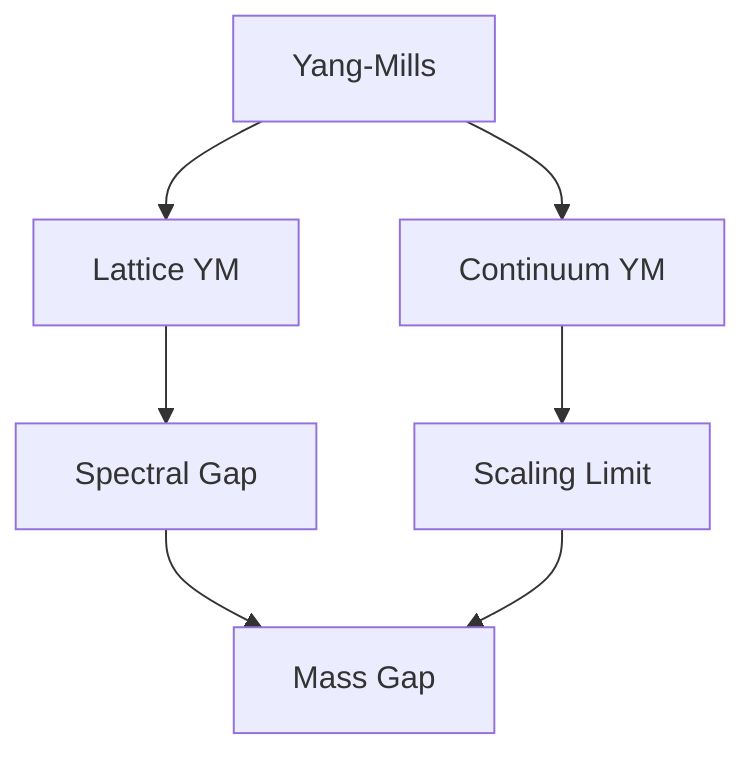

# Yang-Mills Theory

Yang–Mills theory is a [[Gauge Theory]] whose gauge group is a compact, non-abelian [[Lie Group]] $G$, such as $SU(N)$. It is the backbone of the Standard Model.

## Gauge Fields

Let $\mathfrak g$ be the Lie algebra of $G$ with generators $T^a$. A gauge field is a $\mathfrak g$-valued one-form

$$
A_\mu = A_\mu^a T^a .
$$

## Field Strength

$$
\begin{aligned}
F_{\mu\nu}
&= \partial_\mu A_\nu - \partial_\nu A_\mu + g[A_\mu, A_\nu], \\
D_\mu F^{\mu\nu} &= 0 .
\end{aligned}
$$

> [!definition] Covariant derivative
> $D_\mu = \partial_\mu + g A_\mu$ acting in a representation of $G$.

## Yang-Mills Action

$$
S[A] = -\frac{1}{4}\int d^4x \, \operatorname{tr} F_{\mu\nu}F^{\mu\nu} \tag{1}
$$

## Quantization

Rigorous quantization is usually approached through the lattice: see [[Lattice Yang-Mills]] and the classical results of @Wilson1974.

## Mass Gap

The central open problem is the [[Mass Gap|Yang-Mills mass gap]]:

![[Mass Gap#Statement]]

#Millennium-Problem
